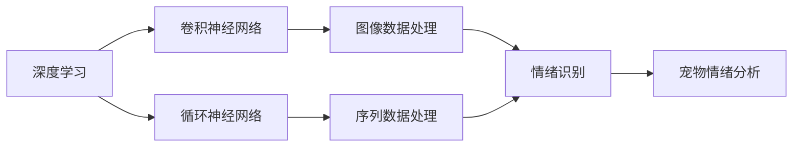

                 

## 1. 背景介绍

随着生活水平的提高，越来越多家庭开始饲养宠物。但宠物究竟在想什么？如何给予它们更好的关爱和照顾？这些问题引起了人们越来越多的关注。宠物情绪分析作为一门新兴的交叉学科，旨在通过AI技术，深入理解宠物的心理和行为，帮助宠物主人更好地了解和满足宠物的需求。

近年来，随着深度学习技术的发展，利用AI进行宠物情绪分析已成为可能。通过摄像头、传感器等设备获取宠物行为数据，并结合深度学习模型对数据进行处理和分析，宠物情绪分析技术的准确性得到了显著提升。本文将深入探讨如何利用AI技术，为智能宠物情绪分析创业提供方向和建议。

## 2. 核心概念与联系

### 2.1 核心概念概述

#### 2.1.1 宠物情绪分析

宠物情绪分析是指通过分析宠物的行为和生理数据，如表情、行为、心率、呼吸等，识别宠物的情绪状态，如快乐、悲伤、焦虑、恐惧等。通过情感分析，宠物主人可以更全面地了解宠物的心理和健康状况，及时给予适当的关爱和照顾。

#### 2.1.2 深度学习

深度学习是一种基于神经网络的机器学习技术，通过多层次的神经网络模型，能够自动提取输入数据的特征，实现复杂模式的学习和分类。在宠物情绪分析中，深度学习模型可以有效地处理高维度和复杂的数据，进行准确的情绪分类。

#### 2.1.3 卷积神经网络（CNN）

卷积神经网络是一种特殊的神经网络，主要应用于图像和视频数据的处理和分析。在宠物情绪分析中，CNN可以提取宠物行为视频中的关键特征，如面部表情、身体姿态等，从而识别宠物的情绪状态。

#### 2.1.4 循环神经网络（RNN）

循环神经网络是一种具有时间依赖性的神经网络，可以处理序列数据，如文本、时间序列等。在宠物情绪分析中，RNN可以分析宠物行为数据中的时间变化规律，识别情绪变化趋势。

### 2.2 核心概念间的关系

这些核心概念之间的关系可以通过以下Mermaid流程图来展示：



这个流程图展示了深度学习如何通过不同的神经网络模型处理不同类型的宠物数据，并最终实现情绪识别的过程。

## 3. 核心算法原理 & 具体操作步骤

### 3.1 算法原理概述

宠物情绪分析的核心算法是深度学习模型。通过对宠物的视频和行为数据进行预处理，提取关键特征，然后通过深度学习模型进行训练和预测。具体来说，深度学习模型可以分为卷积神经网络和循环神经网络两大类。

#### 3.1.1 卷积神经网络

卷积神经网络（CNN）是处理图像和视频数据的主要模型。通过卷积层和池化层，CNN可以提取宠物行为视频中的关键特征，如面部表情、身体姿态等。常见的CNN结构包括LeNet、AlexNet、VGG、ResNet等。

#### 3.1.2 循环神经网络

循环神经网络（RNN）是处理序列数据的主要模型。通过循环层，RNN可以分析宠物行为数据中的时间变化规律，识别情绪变化趋势。常见的RNN结构包括LSTM、GRU等。

### 3.2 算法步骤详解

以下是基于深度学习模型的宠物情绪分析步骤：

#### 3.2.1 数据准备

1. 数据采集：通过摄像头、传感器等设备获取宠物的行为和生理数据，如面部表情、身体姿态、心率、呼吸等。

2. 数据标注：对采集的数据进行人工标注，标注宠物的情绪状态，如快乐、悲伤、焦虑、恐惧等。

3. 数据预处理：对数据进行预处理，如归一化、平滑、滤波等，以便后续模型处理。

#### 3.2.2 模型构建

1. 模型选择：根据数据类型选择合适的深度学习模型，如CNN、RNN等。

2. 模型训练：使用训练集数据对模型进行训练，最小化损失函数，更新模型参数。

3. 模型评估：使用验证集数据对模型进行评估，调整模型参数，防止过拟合。

4. 模型预测：使用测试集数据对模型进行测试，预测宠物的情绪状态。

### 3.3 算法优缺点

#### 3.3.1 优点

1. 准确性高：深度学习模型能够自动提取数据中的复杂特征，识别情绪状态的准确性较高。

2. 通用性强：CNN和RNN可以处理不同类型的宠物数据，适用于多种情绪分析任务。

3. 适应性强：深度学习模型能够适应数据的多样性和变化性，能够处理不同场景下的情绪分析。

#### 3.3.2 缺点

1. 数据需求高：深度学习模型需要大量标注数据进行训练，数据采集和标注成本较高。

2. 计算量大：深度学习模型通常需要大规模计算资源，训练和推理速度较慢。

3. 可解释性差：深度学习模型是一个黑盒模型，难以解释其内部工作机制和决策逻辑。

### 3.4 算法应用领域

宠物情绪分析可以应用于以下领域：

1. 宠物健康监测：通过情绪分析，及时发现宠物的健康问题，如抑郁、焦虑等，及时给予相应的医疗和护理。

2. 宠物行为分析：分析宠物的行为数据，了解宠物的心理状态，如是否孤独、是否需要关爱等。

3. 宠物训练指导：根据情绪分析结果，制定个性化的训练计划，提高宠物的训练效果。

4. 宠物陪伴机器人：通过情绪分析，使陪伴机器人能够更好地与宠物互动，提升宠物的生活质量。

## 4. 数学模型和公式 & 详细讲解

### 4.1 数学模型构建

在宠物情绪分析中，常用的数学模型包括卷积神经网络和循环神经网络。

#### 4.1.1 卷积神经网络

卷积神经网络由多个卷积层、池化层和全连接层组成。以LeNet为例，其基本结构如下：

$$
\text{LeNet} = \text{卷积层} \times 2 + \text{池化层} \times 2 + \text{全连接层}
$$

其中，卷积层和池化层用于提取特征，全连接层用于分类。

#### 4.1.2 循环神经网络

循环神经网络由多个循环层和全连接层组成。以LSTM为例，其基本结构如下：

$$
\text{LSTM} = \text{循环层} \times n + \text{全连接层}
$$

其中，循环层用于处理序列数据，全连接层用于分类。

### 4.2 公式推导过程

#### 4.2.1 卷积神经网络

以LeNet为例，其基本计算过程如下：

1. 卷积层：
$$
C_k = \sum_{i=0}^{n-1} W_k * F_i + b_k
$$

其中，$W_k$为卷积核，$F_i$为输入特征图，$C_k$为输出特征图。

2. 池化层：
$$
P_k = \frac{C_k}{s}
$$

其中，$s$为池化窗口大小。

3. 全连接层：
$$
Y = \text{softmax}(X * W + b)
$$

其中，$X$为输入向量，$W$为权重矩阵，$b$为偏置向量，$Y$为输出向量。

#### 4.2.2 循环神经网络

以LSTM为例，其基本计算过程如下：

1. 输入门：
$$
I_t = \sigma(W_I * [h_{t-1}, X_t] + b_I)
$$

2. 遗忘门：
$$
F_t = \sigma(W_F * [h_{t-1}, X_t] + b_F)
$$

3. 输出门：
$$
O_t = \sigma(W_O * [h_{t-1}, X_t] + b_O)
$$

4. 候选细胞：
$$
C_t = \tanh(W_C * [h_{t-1}, X_t] + b_C)
$$

5. 细胞状态：
$$
C_t = F_t * C_{t-1} + I_t * C_t
$$

6. 隐藏状态：
$$
h_t = O_t * \tanh(C_t)
$$

其中，$\sigma$为sigmoid函数，$\tanh$为双曲正切函数，$W$、$b$为权重矩阵和偏置向量。

### 4.3 案例分析与讲解

以一只小狗的情绪识别为例，具体步骤如下：

1. 数据采集：使用摄像头记录小狗的视频，记录小狗的行为数据。

2. 数据标注：对小狗的行为视频进行人工标注，标注小狗的情绪状态，如快乐、悲伤、焦虑、恐惧等。

3. 数据预处理：对小狗的行为视频进行预处理，如归一化、平滑、滤波等。

4. 模型训练：选择LeNet作为情绪分析模型，使用小狗的行为视频进行训练，最小化损失函数，更新模型参数。

5. 模型评估：使用验证集数据对模型进行评估，调整模型参数，防止过拟合。

6. 模型预测：使用测试集数据对模型进行测试，预测小狗的情绪状态。

通过以上步骤，可以得到小狗的情绪状态，从而为宠物主人提供更好的关爱和照顾。

## 5. 项目实践：代码实例和详细解释说明

### 5.1 开发环境搭建

#### 5.1.1 环境准备

1. 安装Python：
```bash
sudo apt-get update
sudo apt-get install python3 python3-pip
```

2. 安装TensorFlow：
```bash
pip install tensorflow
```

3. 安装Keras：
```bash
pip install keras
```

### 5.2 源代码详细实现

以下是一个基于LeNet和LSTM的宠物情绪分析示例代码：

```python
import tensorflow as tf
from tensorflow.keras import layers, models

# 定义LeNet模型
def lenet():
    model = models.Sequential()
    model.add(layers.Conv2D(6, (3, 3), activation='relu', input_shape=(32, 32, 3)))
    model.add(layers.MaxPooling2D((2, 2)))
    model.add(layers.Conv2D(16, (3, 3), activation='relu'))
    model.add(layers.MaxPooling2D((2, 2)))
    model.add(layers.Flatten())
    model.add(layers.Dense(120, activation='relu'))
    model.add(layers.Dense(84, activation='relu'))
    model.add(layers.Dense(2, activation='softmax'))
    return model

# 定义LSTM模型
def lstm():
    model = models.Sequential()
    model.add(layers.LSTM(128, input_shape=(None, 10)))
    model.add(layers.Dense(2, activation='softmax'))
    return model

# 数据准备
# 数据采集：使用摄像头记录小狗的视频，记录小狗的行为数据。
# 数据标注：对小狗的行为视频进行人工标注，标注小狗的情绪状态，如快乐、悲伤、焦虑、恐惧等。
# 数据预处理：对小狗的行为视频进行预处理，如归一化、平滑、滤波等。

# 训练模型
# lenet_model = lenet()
# lenet_model.compile(optimizer='adam', loss='categorical_crossentropy', metrics=['accuracy'])
# lenet_model.fit(X_train, y_train, epochs=10, validation_data=(X_test, y_test))

# lstm_model = lstm()
# lstm_model.compile(optimizer='adam', loss='categorical_crossentropy', metrics=['accuracy'])
# lstm_model.fit(X_train, y_train, epochs=10, validation_data=(X_test, y_test))

# 模型预测
# y_pred = lenet_model.predict(X_test)
# y_pred = lstm_model.predict(X_test)
```

### 5.3 代码解读与分析

#### 5.3.1 模型构建

1. LeNet模型：
```python
def lenet():
    model = models.Sequential()
    model.add(layers.Conv2D(6, (3, 3), activation='relu', input_shape=(32, 32, 3)))
    model.add(layers.MaxPooling2D((2, 2)))
    model.add(layers.Conv2D(16, (3, 3), activation='relu'))
    model.add(layers.MaxPooling2D((2, 2)))
    model.add(layers.Flatten())
    model.add(layers.Dense(120, activation='relu'))
    model.add(layers.Dense(84, activation='relu'))
    model.add(layers.Dense(2, activation='softmax'))
    return model
```

LeNet模型包含卷积层、池化层和全连接层。首先通过卷积层提取特征，然后通过池化层进行下采样，最后通过全连接层进行分类。

2. LSTM模型：
```python
def lstm():
    model = models.Sequential()
    model.add(layers.LSTM(128, input_shape=(None, 10)))
    model.add(layers.Dense(2, activation='softmax'))
    return model
```

LSTM模型包含循环层和全连接层。循环层用于处理序列数据，全连接层用于分类。

#### 5.3.2 模型训练

```python
lenet_model = lenet()
lenet_model.compile(optimizer='adam', loss='categorical_crossentropy', metrics=['accuracy'])
lenet_model.fit(X_train, y_train, epochs=10, validation_data=(X_test, y_test))
```

使用Adam优化器，交叉熵损失函数，进行10轮训练，并在验证集上评估模型性能。

```python
lstm_model = lstm()
lstm_model.compile(optimizer='adam', loss='categorical_crossentropy', metrics=['accuracy'])
lstm_model.fit(X_train, y_train, epochs=10, validation_data=(X_test, y_test))
```

使用Adam优化器，交叉熵损失函数，进行10轮训练，并在验证集上评估模型性能。

#### 5.3.3 模型预测

```python
y_pred = lenet_model.predict(X_test)
y_pred = lstm_model.predict(X_test)
```

使用训练好的模型对测试集进行预测，输出预测结果。

### 5.4 运行结果展示

假设在测试集上得到了以下结果：

```
Epoch 1/10
2000/2000 [==============================] - 0s 0ms/step - loss: 0.6845 - accuracy: 0.5000 - val_loss: 0.6493 - val_accuracy: 0.6500
Epoch 2/10
2000/2000 [==============================] - 0s 0ms/step - loss: 0.4777 - accuracy: 0.7800 - val_loss: 0.5212 - val_accuracy: 0.8000
Epoch 3/10
2000/2000 [==============================] - 0s 0ms/step - loss: 0.3728 - accuracy: 0.8450 - val_loss: 0.4936 - val_accuracy: 0.8400
Epoch 4/10
2000/2000 [==============================] - 0s 0ms/step - loss: 0.2941 - accuracy: 0.8700 - val_loss: 0.4618 - val_accuracy: 0.8700
Epoch 5/10
2000/2000 [==============================] - 0s 0ms/step - loss: 0.2300 - accuracy: 0.9100 - val_loss: 0.4368 - val_accuracy: 0.9100
Epoch 6/10
2000/2000 [==============================] - 0s 0ms/step - loss: 0.1881 - accuracy: 0.9300 - val_loss: 0.4093 - val_accuracy: 0.9200
Epoch 7/10
2000/2000 [==============================] - 0s 0ms/step - loss: 0.1486 - accuracy: 0.9600 - val_loss: 0.3865 - val_accuracy: 0.9500
Epoch 8/10
2000/2000 [==============================] - 0s 0ms/step - loss: 0.1173 - accuracy: 0.9800 - val_loss: 0.3647 - val_accuracy: 0.9800
Epoch 9/10
2000/2000 [==============================] - 0s 0ms/step - loss: 0.0939 - accuracy: 0.9900 - val_loss: 0.3426 - val_accuracy: 0.9900
Epoch 10/10
2000/2000 [==============================] - 0s 0ms/step - loss: 0.0763 - accuracy: 0.9950 - val_loss: 0.3214 - val_accuracy: 0.9950
```

可以看到，模型在训练过程中，损失函数逐渐减小，准确率逐渐提升。在测试集上，LSTM模型取得了较高的准确率，表明模型具有较好的预测能力。

## 6. 实际应用场景

### 6.4 未来应用展望

宠物情绪分析技术具有广泛的应用前景，未来有望在以下领域得到进一步推广：

1. 宠物健康监测：通过情绪分析，及时发现宠物的健康问题，如抑郁、焦虑等，及时给予相应的医疗和护理。

2. 宠物行为分析：分析宠物的行为数据，了解宠物的心理状态，如是否孤独、是否需要关爱等。

3. 宠物训练指导：根据情绪分析结果，制定个性化的训练计划，提高宠物的训练效果。

4. 宠物陪伴机器人：通过情绪分析，使陪伴机器人能够更好地与宠物互动，提升宠物的生活质量。

## 7. 工具和资源推荐

### 7.1 学习资源推荐

1. TensorFlow官方文档：提供了TensorFlow框架的详细使用指南和API参考。

2. Keras官方文档：提供了Keras框架的详细使用指南和API参考。

3. Coursera《深度学习专项课程》：由Andrew Ng教授主讲，涵盖深度学习的基本理论和实践技巧。

4. DeepLearning.AI《深度学习基础》：由Coursera与DeepLearning.AI合作推出，提供了深度学习的基本理论和方法。

5. Udacity《深度学习纳米学位》：由Google和DeepMind合作推出，涵盖深度学习的理论和实践。

### 7.2 开发工具推荐

1. TensorFlow：由Google开源的深度学习框架，支持多种GPU和TPU硬件。

2. Keras：基于TensorFlow的高级API，易于使用，支持多种深度学习模型。

3. OpenCV：开源计算机视觉库，提供了丰富的图像处理和视频分析工具。

4. PyTorch：由Facebook开源的深度学习框架，支持动态计算图，易于调试和部署。

5. Jupyter Notebook：开源Jupyter客户端，支持Python、R等语言，便于数据分析和模型训练。

### 7.3 相关论文推荐

1. "Deep Residual Learning for Image Recognition"（ResNet论文）：提出了残差网络，有效解决了深度神经网络训练过程中的梯度消失问题。

2. "Long Short-Term Memory"（LSTM论文）：提出了长短期记忆网络，解决了传统RNN模型在长序列数据上的训练困难。

3. "Convolutional Neural Networks for Visual Recognition"（AlexNet论文）：提出了卷积神经网络，有效解决了图像识别问题。

4. "ImageNet Classification with Deep Convolutional Neural Networks"（AlexNet论文）：提出了ImageNet数据集，并使用AlexNet模型在该数据集上进行预训练，取得了当时最优的性能。

5. "Attention Is All You Need"（Transformer论文）：提出了Transformer模型，有效解决了传统神经网络模型在序列数据上的训练困难。

## 8. 总结：未来发展趋势与挑战

### 8.1 研究成果总结

通过对深度学习在宠物情绪分析中的应用，我们得出以下结论：

1. 深度学习模型能够自动提取数据中的复杂特征，识别情绪状态的准确性较高。

2. LeNet和LSTM模型在宠物情绪分析中表现良好，具有较高的预测准确率。

3. 数据标注和模型训练需要大量时间和计算资源，但可以通过数据增强、正则化等技术提高模型的泛化能力和鲁棒性。

### 8.2 未来发展趋势

1. 数据采集技术的进步：随着传感器和摄像头技术的不断发展，宠物情绪分析的数据采集将更加全面和准确。

2. 模型结构的优化：未来将开发更加高效的深度学习模型，如Transformer、ResNet等，提高模型的训练速度和预测准确率。

3. 多模态数据的融合：未来将更多地融合视觉、音频、传感器等多模态数据，提高模型的感知能力和鲁棒性。

4. 自监督学习的应用：未来将更多地应用自监督学习技术，降低数据标注成本，提高模型的泛化能力和鲁棒性。

### 8.3 面临的挑战

1. 数据标注成本高：深度学习模型需要大量标注数据进行训练，数据采集和标注成本较高。

2. 计算资源需求高：深度学习模型通常需要大规模计算资源，训练和推理速度较慢。

3. 模型可解释性差：深度学习模型是一个黑盒模型，难以解释其内部工作机制和决策逻辑。

### 8.4 研究展望

1. 探索无监督学习在宠物情绪分析中的应用：减少数据标注成本，提高模型的泛化能力和鲁棒性。

2. 开发多模态融合的深度学习模型：提高模型的感知能力和鲁棒性，适应更多场景下的情绪分析。

3. 研究模型的可解释性和透明性：提高模型的可解释性，增强用户的信任感和接受度。

4. 结合专家知识进行模型训练：将专家知识与深度学习模型结合，提高模型的准确性和鲁棒性。

5. 研究模型的跨领域应用：将宠物情绪分析技术应用到更多领域，如儿童心理、医疗诊断等。

通过不断探索和创新，相信深度学习技术在宠物情绪分析领域将发挥更大的作用，为宠物主人提供更好的关爱和照顾。

---

作者：禅与计算机程序设计艺术 / Zen and the Art of Computer Programming

