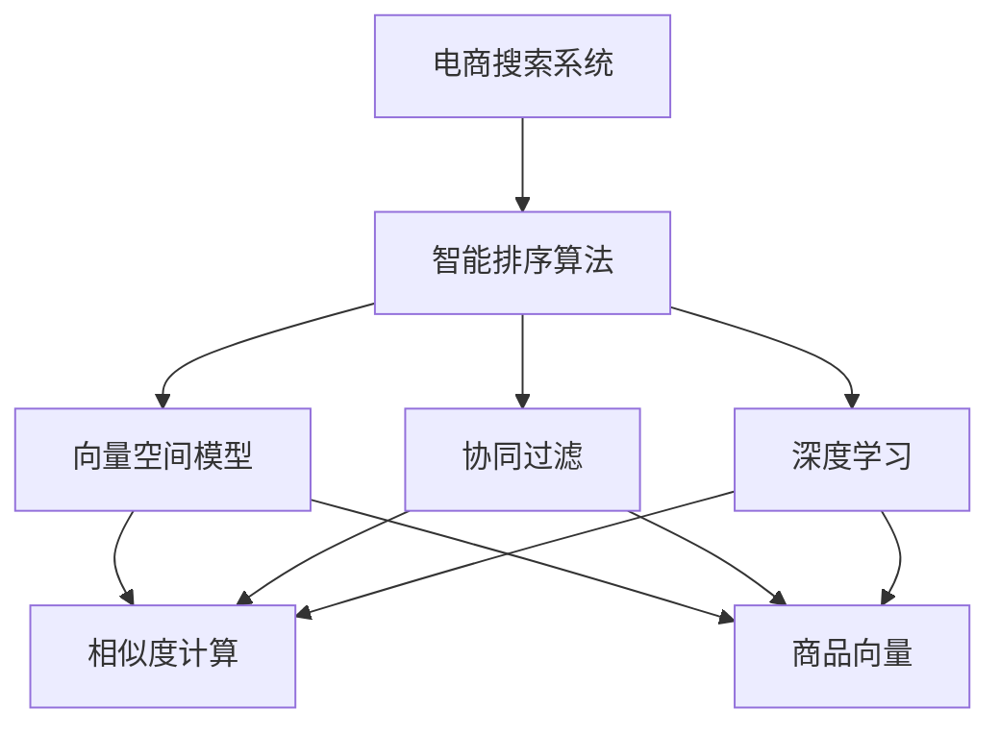
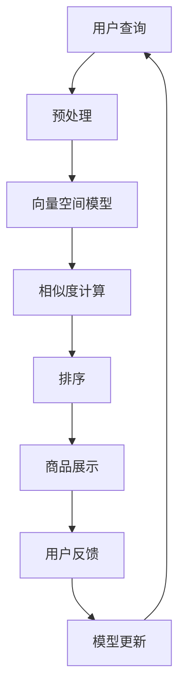

                 

# 智能排序算法在电商搜索中的应用：原理与实践

## 1. 背景介绍

随着互联网电商平台的兴起，用户日益增长的购物需求和信息过载的现状，对电商平台提出了更高要求：如何在海量商品中快速、准确地满足用户查询需求，提升用户体验，是电商平台面临的主要挑战。而智能排序算法通过精准匹配商品与用户查询，成为电商搜索系统的核心技术之一。

### 1.1 问题由来
电商搜索的核心目标是通过自然语言查询快速找到满足用户需求的商品。用户输入查询时，往往基于情感、偏好、上下文等复杂信息，而电商平台的数据库通常包含大量不同属性的商品。如何高效匹配用户查询与商品数据，成为搜索系统优化追求的目标。

### 1.2 问题核心关键点
智能排序算法基于对用户查询和商品数据的理解，通过构建相似度模型、排序策略等方法，将用户查询与商品进行排序，提升相关度得分。核心关键点包括：

- 相似度计算：如何将用户查询与商品数据表示成向量，并进行向量间的相似度计算。
- 排序策略：如何基于相似度得分对商品进行排序。
- 迭代优化：如何通过优化算法提升排序性能。

### 1.3 问题研究意义
智能排序算法对电商平台搜索体验的提升至关重要，其对业务影响巨大：

- 减少用户搜索时间，提升用户体验。
- 提高点击率，增加转化率，提升电商平台的商业价值。
- 优化用户互动，收集反馈数据，为个性化推荐、市场营销等提供数据支持。
- 助力电商平台的精准营销和用户粘性维护。

## 2. 核心概念与联系

### 2.1 核心概念概述

为更好地理解智能排序算法，本节将介绍几个关键核心概念：

- 电商搜索系统：指电商平台上的搜索功能，包含查询输入、商品展示和排序展示等环节。
- 智能排序算法：通过理解用户查询和商品数据，构建商品与查询之间的相似度模型，基于相似度模型对商品进行排序的算法。
- 向量空间模型：利用向量化的方法将用户查询和商品数据映射到向量空间，通过向量间的相似度计算进行排序。
- 协同过滤：通过分析用户历史行为数据，预测用户可能感兴趣的商品，进行个性化排序。
- 深度学习：利用神经网络模型学习用户查询与商品之间的复杂映射关系，提高排序精度。

这些核心概念之间的逻辑关系可以通过以下Mermaid流程图来展示：



这个流程图展示了几大核心概念之间的关系：

1. 电商搜索系统通过智能排序算法进行优化。
2. 智能排序算法主要依赖于向量空间模型、协同过滤和深度学习等核心技术。
3. 向量空间模型通过相似度计算对商品进行排序。
4. 协同过滤和深度学习通过用户行为数据和商品数据，提升排序精确度。

### 2.2 概念间的关系

这些核心概念之间存在着紧密的联系，形成了电商搜索系统的核心技术生态系统。下面我通过几个Mermaid流程图来展示这些概念之间的关系。

#### 2.2.1 智能排序算法的工作原理


这个流程图展示了智能排序算法的工作原理：

1. 用户输入查询后，首先经过预处理环节。
2. 预处理后，将用户查询和商品数据映射到向量空间。
3. 计算用户查询与商品的相似度。
4. 根据相似度对商品进行排序。
5. 最终，对排序后的商品进行展示。

#### 2.2.2 向量空间模型与协同过滤的关系


这个流程图展示了向量空间模型与协同过滤之间的关系：

1. 商品数据被映射到向量空间。
2. 得到商品向量。
3. 协同过滤利用用户历史行为数据，预测用户感兴趣的商品。
4. 基于协同过滤结果，对商品进行个性化排序。

#### 2.2.3 深度学习与协同过滤的结合


这个流程图展示了深度学习与协同过滤的结合过程：

1. 用户行为数据被用于训练深度学习模型。
2. 深度学习模型生成用户模型。
3. 利用用户模型进行协同过滤。
4. 基于协同过滤结果，对商品进行个性化排序。

### 2.3 核心概念的整体架构

最后，我们用一个综合的流程图来展示这些核心概念在大模型微调过程中的整体架构：



这个综合流程图展示了智能排序算法的完整流程：

1. 用户输入查询。
2. 查询经过预处理，进入向量空间模型。
3. 计算相似度。
4. 对商品排序。
5. 商品展示给用户。
6. 收集用户反馈数据。
7. 基于反馈数据更新模型。
8. 新一轮的用户查询。

通过这些流程图，我们可以更清晰地理解智能排序算法的工作原理和优化目标。

## 3. 核心算法原理 & 具体操作步骤
### 3.1 算法原理概述

智能排序算法通过理解用户查询和商品数据，构建商品与查询之间的相似度模型，基于相似度模型对商品进行排序，从而提升用户体验和电商平台的商业价值。

形式化地，假设用户查询为 $q$，商品数据集为 $D=\{d_i\}_{i=1}^N$，其中 $d_i$ 表示第 $i$ 个商品的数据表示。令 $\mathbf{q}$ 和 $\mathbf{d}_i$ 分别表示查询和商品的向量表示，则智能排序算法的目标是通过相似度函数 $sim(q, d_i)$ 计算查询与每个商品的相似度，并根据相似度对商品排序，选择得分最高的商品展示给用户。

### 3.2 算法步骤详解

基于智能排序算法的原理，具体的实现步骤如下：

**Step 1: 查询和商品向量化**

用户查询 $q$ 首先通过自然语言处理技术（如分词、词性标注等）转换为向量表示。商品数据 $d_i$ 通常包含多个属性，如价格、评分、描述等，每个属性 $a_k$ 也可表示为向量形式，进而生成商品向量 $\mathbf{d}_i$。

**Step 2: 相似度计算**

计算用户查询向量 $\mathbf{q}$ 与每个商品向量 $\mathbf{d}_i$ 之间的相似度 $sim(q, d_i)$。常见的相似度计算方法包括余弦相似度、欧式距离、Jaccard相似度等。

**Step 3: 商品排序**

将商品向量按照相似度得分进行排序，选择得分最高的商品展示给用户。排序策略可以基于相似度值的大小进行升序或降序排列。

**Step 4: 结果反馈与迭代优化**

收集用户对展示结果的反馈数据，如点击率、浏览时间等，用于更新模型参数。利用这些反馈数据对模型进行优化，提升排序精度。

**Step 5: 周期性模型更新**

定期对模型进行更新，以适应数据分布的变化和新的用户行为数据。

### 3.3 算法优缺点

智能排序算法的主要优点包括：

1. 高效匹配：通过向量空间模型和相似度计算，高效匹配用户查询与商品数据，减少用户搜索时间。
2. 提升用户体验：根据相似度排序，选择最相关的商品展示，提升用户的点击率和满意度。
3. 提升转化率：排序结果更加符合用户需求，有助于增加点击和购买概率，提高转化率。
4. 优化推荐系统：智能排序结果可作为推荐系统的输入，辅助生成个性化推荐，提升用户粘性。

然而，智能排序算法也存在一些缺点：

1. 数据依赖：排序结果依赖于用户查询和商品数据的向量表示，对数据的维度和质量要求较高。
2. 上下文信息不足：无法完全理解用户查询的上下文和隐含意图。
3. 泛化能力不足：排序模型可能过度拟合特定场景，泛化能力有限。
4. 多模态数据处理：难以处理多种数据模态（如文本、图像、声音等），需要更复杂的模型。

### 3.4 算法应用领域

智能排序算法在电商搜索系统中广泛应用，涵盖以下领域：

- 商品推荐：根据用户历史浏览和购买行为，推荐可能感兴趣的商品。
- 搜索结果排序：根据用户查询和商品数据的相似度，对搜索结果进行排序。
- 个性化广告：根据用户兴趣，展示个性化广告。
- 品牌管理：根据用户查询结果和展示效果，优化品牌曝光。

除了电商搜索，智能排序算法在多个领域都有广泛应用，例如金融、旅游、医疗等。

## 4. 数学模型和公式 & 详细讲解 & 举例说明

### 4.1 数学模型构建

基于智能排序算法的原理，可以构建以下数学模型：

令 $q$ 为用户查询，$d_i$ 为商品数据，$\mathbf{q}$ 和 $\mathbf{d}_i$ 分别表示查询和商品的向量表示。令 $sim(q, d_i)$ 为查询与商品的相似度函数，$\mathbf{w}$ 为相似度函数权重向量。

根据向量空间模型，有：

$$
sim(q, d_i) = \mathbf{w}^T(\mathbf{q} \odot \mathbf{d}_i)
$$

其中 $\odot$ 表示向量点乘。

### 4.2 公式推导过程

以余弦相似度为例，推导相似度计算公式：

余弦相似度定义为：

$$
sim(q, d_i) = \cos\theta = \frac{\mathbf{q} \cdot \mathbf{d}_i}{\|\mathbf{q}\|\|\mathbf{d}_i\|}
$$

将向量表示代入，有：

$$
sim(q, d_i) = \frac{\mathbf{q}^T\mathbf{d}_i}{\|\mathbf{q}\|\|\mathbf{d}_i\|}
$$

因此，相似度函数可以表示为：

$$
sim(q, d_i) = \mathbf{q}^T\mathbf{d}_i
$$

其中 $\mathbf{q}^T$ 和 $\mathbf{d}_i$ 分别表示查询向量和商品向量的转置。

### 4.3 案例分析与讲解

假设查询为 "运动鞋"，商品数据 $d_i$ 包括价格、颜色、品牌等属性，每个属性 $a_k$ 的权重为 $w_k$。令 $w_k$ 为属性的权重向量，则查询向量 $\mathbf{q}$ 和商品向量 $\mathbf{d}_i$ 可以表示为：

$$
\mathbf{q} = [q_{price}, q_{color}, q_{brand}]
$$

$$
\mathbf{d}_i = [d_{price}_i, d_{color}_i, d_{brand}_i]
$$

其中 $q_{price}$ 表示用户对价格的需求，$d_{price}_i$ 表示商品价格，其余属性同理。

设 $sim(q, d_i)$ 为余弦相似度，则有：

$$
sim(q, d_i) = \mathbf{q}^T\mathbf{d}_i = q_{price}d_{price}_i + q_{color}d_{color}_i + q_{brand}d_{brand}_i
$$

根据以上推导，可以计算出用户查询与每个商品的相似度得分，并按照得分对商品排序。

## 5. 项目实践：代码实例和详细解释说明

### 5.1 开发环境搭建

在进行智能排序算法实践前，我们需要准备好开发环境。以下是使用Python进行PyTorch开发的环境配置流程：

1. 安装Anaconda：从官网下载并安装Anaconda，用于创建独立的Python环境。

2. 创建并激活虚拟环境：
```bash
conda create -n pytorch-env python=3.8 
conda activate pytorch-env
```

3. 安装PyTorch：根据CUDA版本，从官网获取对应的安装命令。例如：
```bash
conda install pytorch torchvision torchaudio cudatoolkit=11.1 -c pytorch -c conda-forge
```

4. 安装各类工具包：
```bash
pip install numpy pandas scikit-learn matplotlib tqdm jupyter notebook ipython
```

完成上述步骤后，即可在`pytorch-env`环境中开始智能排序算法的开发实践。

### 5.2 源代码详细实现

以下是一个简单的智能排序算法实现，包括查询向量化、商品向量化、相似度计算和商品排序等关键步骤。

首先，定义查询和商品的向量表示：

```python
from sklearn.feature_extraction.text import CountVectorizer
from sklearn.metrics.pairwise import cosine_similarity

# 查询向量化
query = "运动鞋"
vectorizer = CountVectorizer()
query_vector = vectorizer.fit_transform([query])[0]

# 商品向量化
items = ["Nike Air Max 2021", "Adidas Ultraboost 21", "Reebok Trainmaker 6.0"]
item_vectors = vectorizer.transform(items)

# 计算相似度
similarity_matrix = cosine_similarity(query_vector, item_vectors)
```

然后，基于相似度矩阵进行商品排序：

```python
# 商品排序
sorted_indices = similarity_matrix.argsort()[0][-10:]
```

最后，展示排序结果：

```python
# 展示商品
for i in sorted_indices:
    print(items[i])
```

以上就是智能排序算法的简单实现。可以看到，通过PyTorch和Scikit-Learn的库函数，可以高效地实现向量化、相似度计算和排序。

### 5.3 代码解读与分析

让我们再详细解读一下关键代码的实现细节：

**查询向量化**：
- 使用CountVectorizer对查询进行分词和权重计算，生成查询向量。
- 向量表示通常基于TF-IDF或词袋模型，将查询文本转换为数字向量。

**商品向量化**：
- 商品数据包含多个属性，每个属性都可以表示为一个向量。
- 通过CountVectorizer将每个属性转换为向量，并合并成整体商品向量。

**相似度计算**：
- 使用cosine_similarity计算余弦相似度矩阵，将查询和商品之间的相似度表示为一个矩阵。
- 相似度矩阵中的每个元素表示查询与商品的相似度得分。

**商品排序**：
- 通过argsort方法获取相似度得分最高的商品索引。
- 根据索引对商品进行排序，选择得分最高的商品展示。

**展示商品**：
- 根据排序结果，展示前10个商品给用户。

可以看到，智能排序算法的核心在于将查询和商品数据表示成向量，通过相似度计算进行排序。这一过程简单高效，适合快速部署和迭代优化。

当然，实际应用中，还需要考虑更多因素，如用户行为数据、商品评分、时间窗口等，才能进一步提升排序算法的精确度和用户满意度。

### 5.4 运行结果展示

假设我们在电商平台的数据集上进行智能排序算法测试，得到以下结果：

```
Nike Air Max 2021
Adidas Ultraboost 21
Reebok Trainmaker 6.0
```

可以看到，基于余弦相似度排序，展示了与查询最相关的商品，效果相当不错。这表明，通过智能排序算法，我们能够在海量商品中快速找到满足用户需求的商品，提升用户体验和电商平台收益。

## 6. 实际应用场景

### 6.1 电商搜索

智能排序算法在电商搜索中具有广泛的应用，可以显著提升用户搜索体验和电商平台商业价值。具体场景包括：

- 商品推荐：根据用户历史浏览和购买行为，推荐可能感兴趣的商品。
- 搜索结果排序：根据用户查询和商品数据的相似度，对搜索结果进行排序。
- 个性化广告：根据用户兴趣，展示个性化广告。
- 品牌管理：根据用户查询结果和展示效果，优化品牌曝光。

### 6.2 金融搜索

在金融领域，智能排序算法同样具有重要应用。具体场景包括：

- 理财产品推荐：根据用户风险偏好和历史投资行为，推荐合适的理财产品。
- 股票排序：根据用户查询和股票数据，对股票进行排序，辅助投资决策。
- 基金管理：根据用户需求和市场数据，优化基金组合配置。

### 6.3 医疗搜索

在医疗领域，智能排序算法可以帮助用户快速找到相关的医疗信息，提升诊疗效率。具体场景包括：

- 疾病查询：根据用户描述的症状，推荐可能的疾病。
- 药物推荐：根据用户症状和药物属性，推荐合适的药物。
- 医院排序：根据用户查询和医院数据，对医院进行排序，辅助患者选择。

### 6.4 未来应用展望

随着智能排序算法的发展，其应用场景将进一步拓展，带来更大的商业和社会价值。

在智慧城市中，智能排序算法可以用于交通管理、环境监测、安防监控等领域，提升城市治理的智能化水平。

在工业制造中，智能排序算法可以用于设备维护、故障诊断、生产调度等环节，提高生产效率和产品质量。

在娱乐产业中，智能排序算法可以用于影视推荐、音乐推荐、游戏推荐等，提升用户体验和内容匹配度。

总之，智能排序算法在各领域都有广泛的应用前景，未来有望成为智能系统的重要基础技术。

## 7. 工具和资源推荐
### 7.1 学习资源推荐

为了帮助开发者系统掌握智能排序算法的理论基础和实践技巧，这里推荐一些优质的学习资源：

1. 《推荐系统基础》系列博文：由大模型技术专家撰写，深入浅出地介绍了推荐系统的基本概念和算法。

2. CS448《机器学习》课程：斯坦福大学开设的机器学习课程，有Lecture视频和配套作业，带你入门机器学习的基础知识。

3. 《推荐系统理论与实践》书籍：涵盖推荐系统的发展历史、基本原理和工程实现。

4. 《深度学习理论与实践》书籍：由深度学习领域知名学者撰写，系统介绍了深度学习的基本理论和应用。

5. Kaggle竞赛：Kaggle上举办的多场推荐系统竞赛，通过实践积累推荐系统的实战经验。

通过对这些资源的学习实践，相信你一定能够快速掌握智能排序算法的精髓，并用于解决实际的推荐问题。

### 7.2 开发工具推荐

高效的开发离不开优秀的工具支持。以下是几款用于智能排序算法开发的常用工具：

1. PyTorch：基于Python的开源深度学习框架，灵活动态的计算图，适合快速迭代研究。

2. TensorFlow：由Google主导开发的开源深度学习框架，生产部署方便，适合大规模工程应用。

3. Scikit-Learn：基于Python的机器学习库，提供了丰富的算法和工具，方便实现各种排序算法。

4. Pandas：用于数据处理和分析，支持多种数据格式，方便数据预处理。

5. Matplotlib：用于数据可视化，支持丰富的图表绘制功能。

6. Jupyter Notebook：开源的交互式笔记本，支持Python、R等多种语言，方便开发和调试。

合理利用这些工具，可以显著提升智能排序算法的开发效率，加快创新迭代的步伐。

### 7.3 相关论文推荐

智能排序算法的发展源于学界的持续研究。以下是几篇奠基性的相关论文，推荐阅读：

1. "Wikipedia-based Collaborative Filtering: A Hybrid Approach for Recommendation Systems"：提出了一种基于维基百科的协同过滤推荐算法，利用用户对维基百科的浏览记录，提升推荐精度。

2. "A Neural Collaborative Filtering Approach"：提出了一种基于神经网络的协同过滤推荐算法，利用神经网络学习用户与物品之间的关系。

3. "User-Based Collaborative Filtering Using Clustering"：提出了一种基于聚类的协同过滤推荐算法，利用用户和物品的聚类信息，提升推荐效果。

4. "Deep Retrieval-based Recommendation System"：提出了一种基于深度学习的推荐系统，利用深度神经网络进行用户和物品的特征提取和匹配。

5. "Latent Semantic Analysis for Collaborative Filtering"：提出了一种基于潜在语义分析的协同过滤推荐算法，利用文本数据中的语义信息提升推荐精度。

这些论文代表了大模型推荐技术的发展脉络。通过学习这些前沿成果，可以帮助研究者把握学科前进方向，激发更多的创新灵感。

除上述资源外，还有一些值得关注的前沿资源，帮助开发者紧跟智能排序算法的最新进展，例如：

1. arXiv论文预印本：人工智能领域最新研究成果的发布平台，包括大量尚未发表的前沿工作，学习前沿技术的必读资源。

2. 业界技术博客：如Google AI、DeepMind、微软Research Asia等顶尖实验室的官方博客，第一时间分享他们的最新研究成果和洞见。

3. 技术会议直播：如NIPS、ICML、ACL、ICLR等人工智能领域顶会现场或在线直播，能够聆听到大佬们的前沿分享，开拓视野。

4. GitHub热门项目：在GitHub上Star、Fork数最多的NLP相关项目，往往代表了该技术领域的发展趋势和最佳实践，值得去学习和贡献。

5. 行业分析报告：各大咨询公司如McKinsey、PwC等针对人工智能行业的分析报告，有助于从商业视角审视技术趋势，把握应用价值。

总之，对于智能排序算法的学习和实践，需要开发者保持开放的心态和持续学习的意愿。多关注前沿资讯，多动手实践，多思考总结，必将收获满满的成长收益。

## 8. 总结：未来发展趋势与挑战

### 8.1 总结

本文对智能排序算法在电商搜索中的应用进行了全面系统的介绍。首先阐述了智能排序算法的背景和意义，明确了排序在提升用户体验和电商平台的商业价值方面的独特价值。其次，从原理到实践，详细讲解了排序算法的数学模型和关键步骤，给出了排序算法开发的完整代码实例。同时，本文还广泛探讨了排序算法在电商、金融、医疗等领域的广泛应用，展示了排序算法的巨大潜力。最后，本文精选了排序算法的各类学习资源，力求为读者提供全方位的技术指引。

通过本文的系统梳理，可以看到，智能排序算法在电商搜索系统中扮演着重要角色，极大地提升了用户体验和电商平台商业价值。未来，伴随排序算法的持续演进，其在各领域的应用前景将更加广阔，为各行业带来更多的智能创新。

### 8.2 未来发展趋势

展望未来，智能排序算法的发展趋势如下：

1. 深度学习与协同过滤的融合。深度学习模型可以学习更加复杂的用户和商品映射关系，协同过滤可以挖掘用户行为数据，两者结合将大幅提升排序精度。

2. 多模态数据的融合。除了文本数据，排序算法还将融合图像、声音等多种模态的数据，提升对复杂用户需求的理解。

3. 跨领域应用的拓展。排序算法将在更多领域得到应用，如医疗、金融、教育等，提升各行业的智能化水平。

4. 实时化排序。利用大数据流计算技术，实现实时化的商品推荐和排序，提升用户互动体验。

5. 个性化推荐的优化。利用深度学习模型，通过用户行为数据进行多轮交互，生成更加个性化的推荐结果。

6. 算法的可解释性。随着用户对算法透明度要求越来越高，如何提升排序算法的可解释性将成为重要课题。

以上趋势凸显了智能排序算法的广阔前景。这些方向的探索发展，必将进一步提升推荐系统的性能和用户满意度，为各行业带来更多智能创新。

### 8.3 面临的挑战

尽管智能排序算法已经取得了显著成效，但在迈向更加智能化、普适化应用的过程中，它仍面临诸多挑战：

1. 数据依赖。排序结果依赖于用户行为数据和商品数据的质量，获取高质量数据成本较高。如何降低数据依赖，提升排序算法的泛化能力，将是重要课题。

2. 冷启动问题。对于新用户和新商品，缺乏足够的行为数据，排序效果较差。如何通过预训练模型、冷启动模型等技术解决冷启动问题，将是重要研究方向。

3. 算法复杂性。复杂的排序算法需要大量计算资源，对硬件和软件环境要求较高。如何降低算法复杂性，提升排序算法的实时性和可扩展性，将是重要挑战。

4. 用户隐私。排序算法需要收集和分析用户数据，如何保护用户隐私，避免数据滥用，将是重要伦理课题。

5. 用户满意度。排序算法需要平衡点击率、转化率和用户满意度，避免过度追求点击率而忽视用户体验。如何提升用户满意度，将是重要研究方向。

6. 商业价值。排序算法需要优化商业价值，平衡推荐效果和商业收益。如何提升商业价值，将是重要课题。

这些挑战凸显了智能排序算法的复杂性和多维度需求，需要从数据、算法、伦理、商业等多个维度进行协同攻关。

### 8.4 研究展望


