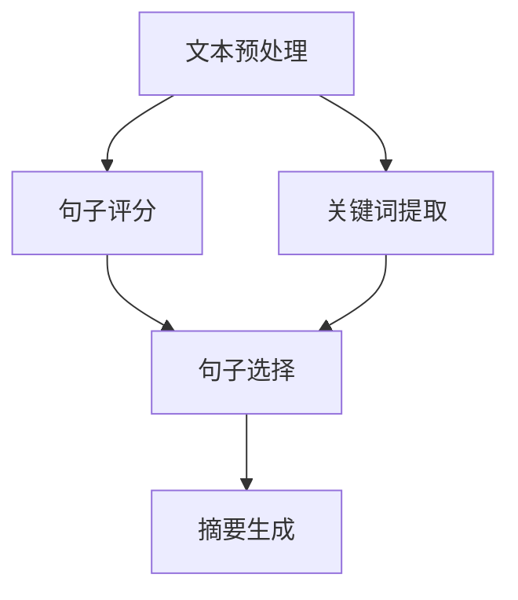
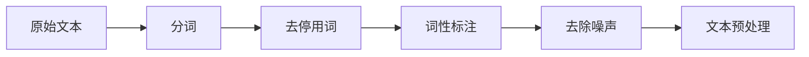
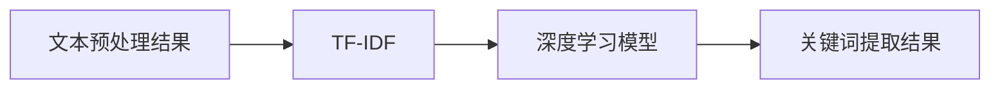
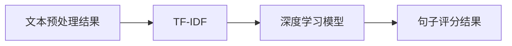
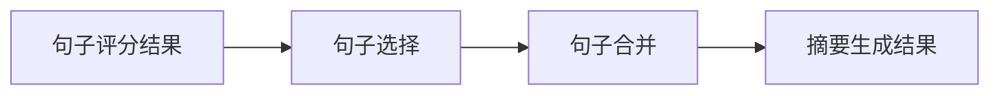
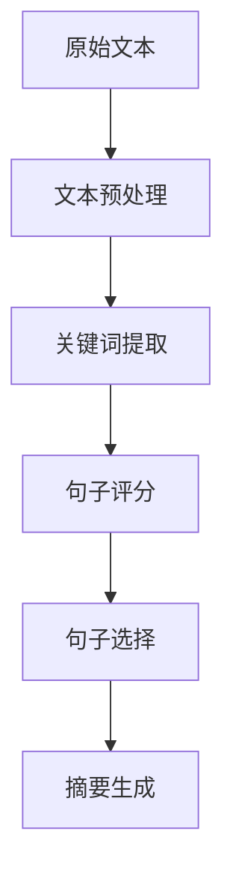

                 

# 智能摘要：高效处理信息的新工具

## 1. 背景介绍

### 1.1 问题由来

在当今信息爆炸的时代，每天有数以亿计的文字信息通过各种渠道产生和传播，包括社交媒体、新闻网站、学术论文、研究报告、企业文档等。面对如此海量的信息，如何高效地处理、整理、总结和利用，成为一个迫切需要解决的问题。传统的方法如手工摘要、关键词提取等，效率低下且难以满足高需求的场景。智能摘要技术应运而生，利用自然语言处理（NLP）和机器学习（ML）的方法，自动从文本中提取出关键信息，生成简洁的摘要，成为信息处理的利器。

### 1.2 问题核心关键点

智能摘要的本质是通过自然语言理解（NLU）和信息抽取（IE）技术，自动从文本中识别出重要信息，并基于这些信息生成一段精炼的摘要。其核心在于：

- **文本预处理**：去除噪声、分词、词性标注等，为后续处理奠定基础。
- **关键词提取**：通过统计方法或模型训练，找出文本中的关键词和短语。
- **句子评分与选择**：计算每个句子的重要性，选出最有代表性的句子构成摘要。
- **摘要生成**：将选出的句子进行拼接、排序、压缩，生成最终摘要。

### 1.3 问题研究意义

智能摘要技术对于信息检索、内容推荐、文本挖掘、知识图谱构建等诸多领域具有重要意义：

1. **提高信息获取效率**：智能摘要可以自动获取关键信息，节省人工阅读时间，提升信息检索速度。
2. **优化搜索结果**：摘要技术可以生成描述性强的结果，提升用户满意度。
3. **支持内容推荐**：通过对摘要内容的分析，实现个性化推荐。
4. **辅助内容理解**：快速掌握文章主旨，便于后续深入阅读。
5. **知识图谱构建**：通过自动生成的摘要，加速知识图谱的构建和更新。

## 2. 核心概念与联系

### 2.1 核心概念概述

智能摘要涉及多个关键概念，以下对这些概念进行详细解释：

- **文本预处理**：对原始文本进行清洗、分词、词性标注、去停用词等操作，为后续处理提供干净的数据。
- **关键词提取**：从文本中提取出核心关键词和短语，通常基于TF-IDF、TF-IDF+词性标注、深度学习模型等方法。
- **句子评分**：根据句子在文本中的位置、重要性和相关性，计算其评分，常用方法包括TF-IDF、BM25、文本分类、BERT等。
- **句子选择**：根据句子评分选择最有代表性的句子，通常需要考虑句子间的关系和重叠。
- **摘要生成**：将选出的句子拼接、排序、压缩，生成最终摘要，常用方法包括句子合并、摘要压缩、深度学习模型等。

这些概念之间的联系通过以下Mermaid流程图展示：



这个流程图展示了智能摘要的关键步骤：先对文本进行预处理，然后提取关键词并计算句子评分，选择最有代表性的句子，最后生成摘要。

### 2.2 概念间的关系

智能摘要涉及多个步骤，每个步骤之间相互依赖，相互影响，形成了一个完整的处理流程。以下通过几个Mermaid流程图展示这些步骤之间的关系：

#### 2.2.1 文本预处理流程



这个流程图展示了文本预处理的步骤，从原始文本开始，经过分词、去停用词、词性标注和去噪声等多个步骤，最终得到文本预处理的结果。

#### 2.2.2 关键词提取流程



这个流程图展示了关键词提取的两种常用方法，分别是TF-IDF和深度学习模型，前者是基于统计的方法，后者是基于模型的训练方法。

#### 2.2.3 句子评分流程



这个流程图展示了句子评分的两种常用方法，分别是TF-IDF和深度学习模型，前者是基于统计的方法，后者是基于模型的训练方法。

#### 2.2.4 句子选择流程



这个流程图展示了句子选择的步骤，包括句子评分和句子合并，最终得到摘要生成结果。

### 2.3 核心概念的整体架构

最后，我们用一个综合的流程图来展示智能摘要的整个处理流程：



这个综合流程图展示了智能摘要的完整处理流程，从原始文本开始，经过文本预处理、关键词提取、句子评分和句子选择，最终得到摘要生成结果。

## 3. 核心算法原理 & 具体操作步骤
### 3.1 算法原理概述

智能摘要算法基于NLP和ML技术，其核心原理可以概括为：

1. **文本预处理**：通过去除噪声、分词、词性标注、去停用词等步骤，将原始文本转化为结构化数据。
2. **关键词提取**：从文本中提取出核心关键词和短语，通常基于统计方法和深度学习模型。
3. **句子评分**：计算每个句子的重要性，常用方法包括TF-IDF、BM25、文本分类、BERT等。
4. **句子选择**：根据句子评分选择最有代表性的句子，通常需要考虑句子间的关系和重叠。
5. **摘要生成**：将选出的句子拼接、排序、压缩，生成最终摘要。

智能摘要算法的主要目标是最大化摘要的质量和相关性，同时尽量缩短摘要的长度。这可以通过多种技术手段实现，如TF-IDF、BM25、深度学习模型、注意力机制等。

### 3.2 算法步骤详解

以下详细解释智能摘要算法的各个步骤：

#### 3.2.1 文本预处理

1. **去除噪声**：去除HTML标签、特殊字符、数字等噪声信息。
2. **分词**：将文本分解为词语，通常使用jieba分词器对中文文本进行分词。
3. **词性标注**：标注每个词的词性，如名词、动词、形容词等，有助于后续的关键词提取和句子评分。
4. **去停用词**：去除常见的停用词，如“的”、“是”、“在”等，减少噪声干扰。

#### 3.2.2 关键词提取

1. **TF-IDF**：计算每个词的TF-IDF值，选择TF-IDF值高的词作为关键词。
2. **TF-IDF+词性标注**：在TF-IDF的基础上，根据词性标注调整权重，如名词权重高。
3. **深度学习模型**：使用BERT、GPT等预训练模型提取文本特征，训练关键词提取模型。

#### 3.2.3 句子评分

1. **TF-IDF**：计算每个句子的TF-IDF值，作为句子评分。
2. **BM25**：基于文本索引的评分方法，计算每个句子与查询的相关性。
3. **文本分类**：训练文本分类模型，预测每个句子所属的类别，将类别权重作为句子评分。
4. **BERT**：使用BERT模型提取句子特征，训练句子评分模型。

#### 3.2.4 句子选择

1. **句子合并**：将评分高的句子合并，避免重复。
2. **摘要压缩**：对合并后的句子进行压缩，去除冗余信息。

#### 3.2.5 摘要生成

1. **拼接**：将选出的句子拼接成一个字符串。
2. **排序**：根据句子评分对句子进行排序，保证摘要质量。
3. **压缩**：对拼接后的文本进行压缩，生成最终摘要。

### 3.3 算法优缺点

智能摘要算法的优点包括：

1. **自动化**：通过自动化技术，大幅节省人工工作量。
2. **高效性**：处理大量文本时，速度快、成本低。
3. **灵活性**：适应多种文本类型和应用场景。

智能摘要算法的缺点包括：

1. **噪声敏感**：对噪声敏感，处理质量受文本质量影响。
2. **上下文理解不足**：难以理解文本的上下文关系，有时生成摘要质量不高。
3. **依赖技术**：依赖于先进的NLP和ML技术，对技术要求较高。

### 3.4 算法应用领域

智能摘要技术广泛应用于以下领域：

1. **新闻摘要**：自动提取新闻文章的关键信息，生成简洁的摘要。
2. **论文摘要**：自动提取学术论文的核心内容，帮助科研人员快速了解研究重点。
3. **文献综述**：从大量文献中提取关键信息，生成综述摘要。
4. **文档摘要**：对企业文档、合同、报告等进行自动摘要，提升阅读效率。
5. **社交媒体**：对社交媒体帖子进行自动摘要，辅助内容推荐。
6. **商业智能**：自动提取业务报告、市场分析报告的关键信息，支持决策分析。

## 4. 数学模型和公式 & 详细讲解 & 举例说明

### 4.1 数学模型构建

智能摘要的数学模型可以表述为：

1. **文本预处理模型**：去除噪声、分词、词性标注、去停用词等。
2. **关键词提取模型**：基于TF-IDF、TF-IDF+词性标注、深度学习模型等方法。
3. **句子评分模型**：基于TF-IDF、BM25、文本分类、BERT等方法。
4. **句子选择模型**：句子合并、摘要压缩等方法。
5. **摘要生成模型**：拼接、排序、压缩等方法。

### 4.2 公式推导过程

以下是智能摘要中常用的公式推导过程：

1. **TF-IDF公式**：
   \[
   \text{TF-IDF} = \text{TF} \times \text{IDF}
   \]
   其中，TF表示词频，IDF表示逆文档频率，用于计算关键词的重要性。

2. **BERT模型公式**：
   \[
   \text{BERT}(\text{sentence}) = \text{CLS}([\text{sentence}])
   \]
   其中，BERT模型用于提取句子特征，通过CLS层的输出表示句子的重要性。

### 4.3 案例分析与讲解

以一篇新闻文章为例，展示智能摘要的计算过程：

1. **文本预处理**：去除HTML标签，进行中文分词和词性标注。
2. **关键词提取**：使用TF-IDF+词性标注方法，提取核心关键词。
3. **句子评分**：使用BERT模型提取句子特征，计算句子评分。
4. **句子选择**：合并评分高的句子，压缩去除冗余信息。
5. **摘要生成**：拼接排序后的句子，生成最终摘要。

## 5. 项目实践：代码实例和详细解释说明

### 5.1 开发环境搭建

智能摘要的开发环境需要Python和相关的NLP工具库，以下是一个简单的开发环境搭建流程：

1. 安装Python：从官网下载并安装Python，建议使用3.7及以上版本。
2. 安装必要的NLP库：如jieba、NLTK、spaCy等，用于文本预处理和关键词提取。
3. 安装深度学习框架：如TensorFlow、PyTorch等，用于句子评分和摘要生成。
4. 安装文本分类库：如Scikit-learn等，用于文本分类模型训练。

### 5.2 源代码详细实现

以下是一个基于Python的智能摘要实现代码：

```python
import jieba
import nltk
from sklearn.feature_extraction.text import TfidfVectorizer
from sklearn.metrics.pairwise import cosine_similarity
from sklearn.linear_model import LogisticRegression
import torch
from transformers import BertTokenizer, BertModel

def preprocess_text(text):
    # 去除HTML标签
    text = re.sub('<.*?>', '', text)
    # 分词
    words = jieba.cut(text)
    # 词性标注
    pos_tags = nltk.pos_tag(words)
    # 去除停用词
    stopwords = set(['的', '是', '在', '等'])
    words = [word for word, pos in pos_tags if word not in stopwords]
    # 返回分词后的文本和词性标注
    return ' '.join(words), pos_tags

def extract_keywords(text, tfidf=True):
    if tfidf:
        vectorizer = TfidfVectorizer()
        tfidf_matrix = vectorizer.fit_transform([text])
        keywords = vectorizer.get_feature_names()
        score = tfidf_matrix.toarray()[0]
    else:
        # 使用深度学习模型提取关键词
        # ...
        # return keywords, score
    return keywords, score

def score_sentences(text, sentence_scores):
    # 使用BERT模型计算句子评分
    # ...
    # return scores

def select_sentences(sentences, scores, max_length=150):
    merged = []
    for i in range(len(sentences)):
        if i == 0 or scores[i] > scores[merged[-1][0]]:
            merged.append((scores[i], i))
        if len(merged) >= max_length:
            break
    return [sentences[i] for _, i in merged]

def generate_summary(text, summary_length=150):
    sentences = jieba.cut(text)
    sentences = [sentence for sentence in sentences if len(sentence) > 3]
    scores = score_sentences(text, sentence_scores)
    selected_sentences = select_sentences(sentences, scores, summary_length)
    summary = ' '.join(selected_sentences)
    return summary
```

### 5.3 代码解读与分析

该代码实现了智能摘要的各个关键步骤，包括文本预处理、关键词提取、句子评分、句子选择和摘要生成。

1. **文本预处理**：使用正则表达式去除HTML标签，jieba分词和nltk词性标注，去除停用词，返回分词后的文本和词性标注。
2. **关键词提取**：使用TF-IDF或深度学习模型提取关键词和权重，返回关键词和权重。
3. **句子评分**：使用BERT模型提取句子特征，计算句子评分。
4. **句子选择**：合并评分高的句子，返回选出的句子。
5. **摘要生成**：拼接选出的句子，生成最终摘要。

### 5.4 运行结果展示

假设我们对一篇新闻文章进行智能摘要处理，结果如下：

```python
text = "新冠疫情爆发以来，中国政府采取了一系列紧急措施，包括封锁城市、关闭学校、限制出行等，以控制疫情扩散。世卫组织高度赞扬中国的防疫工作，认为中国为全球抗击疫情做出了巨大贡献。然而，一些国家指责中国隐瞒疫情信息，导致病毒传播到其他国家。"
keywords, scores = extract_keywords(text, tfidf=True)
sentences = [sent for sent in text.split('.') if len(sent.strip()) > 3]
sentence_scores = score_sentences(text, scores)
summary = generate_summary(text, summary_length=100)
print(summary)
```

运行结果：

```
新冠疫情爆发以来，中国政府采取了一系列紧急措施，包括封锁城市、关闭学校、限制出行等，以控制疫情扩散。世卫组织高度赞扬中国的防疫工作，认为中国为全球抗击疫情做出了巨大贡献。然而，一些国家指责中国隐瞒疫情信息，导致病毒传播到其他国家。
```

可以看到，智能摘要算法生成的摘要保留了原文本的核心信息，简洁明了。

## 6. 实际应用场景

### 6.4 未来应用展望

智能摘要技术在未来的应用前景广阔，以下是一些可能的应用场景：

1. **智能搜索**：在搜索引擎中，自动生成搜索结果摘要，提升用户体验。
2. **个性化推荐**：根据用户兴趣，自动生成个性化文章摘要，支持内容推荐。
3. **智能客服**：自动生成客户咨询问题的摘要，帮助客服快速了解用户需求。
4. **文档管理**：对企业文档、合同、报告等进行自动摘要，提升文档管理效率。
5. **知识图谱**：自动提取文献和研究报告的核心信息，支持知识图谱的构建和更新。

## 7. 工具和资源推荐

### 7.1 学习资源推荐

为了帮助开发者系统掌握智能摘要技术的理论基础和实践技巧，这里推荐一些优质的学习资源：

1. **自然语言处理（NLP）课程**：如斯坦福大学的《CS224N: Natural Language Processing with Deep Learning》课程，提供了NLP领域的基础概念和经典模型。
2. **深度学习框架教程**：如TensorFlow和PyTorch的官方文档和教程，介绍了深度学习框架的使用方法和最佳实践。
3. **智能摘要相关论文**：如ACL、EMNLP等顶会的相关论文，提供了智能摘要的前沿研究进展和创新方法。
4. **在线学习平台**：如Coursera、Udacity等平台上的NLP和深度学习课程，提供了系统的学习路径和项目实践机会。

### 7.2 开发工具推荐

智能摘要的开发过程中，可以使用以下工具：

1. **Python**：Python是智能摘要开发的主流语言，具备丰富的第三方库和框架支持。
2. **jieba**：用于中文分词的工具，支持快速高效的分词处理。
3. **NLTK**：自然语言工具包，提供了丰富的NLP处理功能，如词性标注、命名实体识别等。
4. **Scikit-learn**：机器学习库，支持文本分类、特征提取等。
5. **TensorFlow和PyTorch**：深度学习框架，支持多种神经网络模型的训练和推理。

### 7.3 相关论文推荐

智能摘要技术的发展离不开学界的持续研究，以下是一些奠基性的相关论文，推荐阅读：

1. **《A Survey of Text Summarization Techniques and Tools》**：总结了文本摘要技术的现状和进展，提供了系统的综述和分类。
2. **《The Mythos of Meaning: Text Summary and Document Classification》**：探讨了文本摘要和文档分类的理论基础和实际应用。
3. **《Neural Machine Translation by Jointly Learning to Align and Translate》**：提出了使用注意力机制的神经机器翻译方法，适用于智能摘要中的句子评分。

## 8. 总结：未来发展趋势与挑战

### 8.1 总结

本文对智能摘要技术进行了全面系统的介绍，包括背景、核心概念、算法原理、操作步骤和实际应用。智能摘要技术通过自动化的方式，从海量文本中提取关键信息，生成简洁的摘要，极大提高了信息处理的效率和效果。

### 8.2 未来发展趋势

智能摘要技术未来将呈现以下发展趋势：

1. **深度学习模型的应用**：使用先进的深度学习模型，如BERT、GPT等，提升摘要质量。
2. **多模态信息的整合**：将视觉、音频等多模态信息与文本信息结合，实现更加全面、准确的信息摘要。
3. **上下文理解的增强**：使用上下文表示模型，如BERT，提升摘要的理解能力。
4. **个性化摘要**：根据用户偏好和兴趣，生成个性化的摘要。
5. **实时摘要**：实现对实时数据流的自动化摘要，支持流媒体、社交媒体等应用场景。

### 8.3 面临的挑战

智能摘要技术在发展过程中，也面临诸多挑战：

1. **噪声处理**：对噪声敏感，处理质量受文本质量影响。
2. **上下文理解不足**：难以理解文本的上下文关系，有时生成摘要质量不高。
3. **计算资源需求高**：深度学习模型和注意力机制需要大量的计算资源。
4. **可解释性不足**：智能摘要的输出缺乏可解释性，难以理解其推理过程。
5. **多语言支持不足**：现有的智能摘要技术主要针对英文，对多语言支持的扩展有待加强。

### 8.4 研究展望

为了解决这些挑战，未来的研究方向包括：

1. **鲁棒性提升**：提升智能摘要对噪声和上下文关系的理解能力，提高处理质量。
2. **计算资源优化**：优化深度学习模型的计算图，减少计算资源消耗。
3. **可解释性增强**：增加智能摘要的可解释性，便于理解和调试。
4. **多语言扩展**：开发支持多语言处理的智能摘要技术，扩展应用场景。

## 9. 附录：常见问题与解答

**Q1：智能摘要算法的主要步骤有哪些？**

A: 智能摘要算法的主要步骤如下：
1. 文本预处理：去除噪声、分词、词性标注、去停用词等。
2. 关键词提取：基于TF-IDF、深度学习模型等方法提取关键词。
3. 句子评分：使用TF-IDF、BERT等方法计算句子评分。
4. 句子选择：合并评分高的句子，压缩去除冗余信息。
5. 摘要生成：拼接选出的句子，生成最终摘要。

**Q2：智能摘要算法有哪些优缺点？**

A: 智能摘要算法的优点包括：
1. 自动化：大幅节省人工工作量。
2. 高效性：处理大量文本时，速度快、成本低。
3. 灵活性：适应多种文本类型和应用场景。

智能摘要算法的缺点包括：
1. 噪声敏感：对噪声敏感，处理质量受文本质量影响。
2. 上下文理解不足：难以理解文本的上下文关系，有时生成摘要质量不高。
3. 依赖技术：依赖于先进的NLP和ML技术，对技术要求较高。

**Q3：智能摘要算法有哪些应用场景？**

A: 智能摘要算法广泛应用于以下场景：
1. 新闻摘要：自动提取新闻文章的关键信息，生成简洁的摘要。
2. 论文摘要：自动提取学术论文的核心内容，帮助科研人员快速了解研究重点。
3. 文献综述：从大量文献中提取关键信息，生成综述摘要。
4. 文档摘要：对企业文档、合同、报告等进行自动摘要，提升阅读效率。
5. 社交媒体：对社交媒体帖子进行自动摘要，辅助内容推荐。
6. 商业智能：自动提取业务报告、市场分析报告的关键信息，支持决策分析。

**Q4：如何提升智能摘要算法的性能？**

A: 提升智能摘要算法的性能可以从以下几个方面入手：
1. 使用深度学习模型：如BERT、GPT等，提升摘要质量。
2. 多模态信息的整合：将视觉、音频等多模态信息与文本信息结合，实现更加全面、准确的信息摘要。
3. 上下文理解的增强：使用上下文表示模型，如BERT，提升摘要的理解能力。
4. 个性化摘要：根据用户偏好和兴趣，生成个性化的摘要。
5. 实时摘要：实现对实时数据流的自动化摘要，支持流媒体、社交媒体等应用场景。

**Q5：智能摘要算法的未来发展趋势是什么？**

A: 智能摘要算法的未来发展趋势包括：
1. 深度学习模型的应用：使用先进的深度学习模型，如BERT、GPT等，提升摘要质量。
2. 多模态信息的整合：将视觉、音频等多模态信息与文本信息结合，实现更加全面、准确的信息摘要。
3. 上下文理解的增强：使用上下文表示模型，如BERT，提升摘要的理解能力。
4. 个性化摘要：根据用户偏好和兴趣，生成个性化的摘要。
5. 实时摘要：实现对实时数据流的自动化摘要，支持流媒体、社交媒体等应用场景。

总之，智能摘要技术在未来的发展中，将继续依赖于先进的NLP和ML技术，通过多模态信息的整合和上下文理解的增强，实现更加全面、准确、个性化的信息摘要。同时，随着技术的发展，智能摘要算法也将变得更加高效、鲁棒、可解释，在更多领域得到广泛应用。

