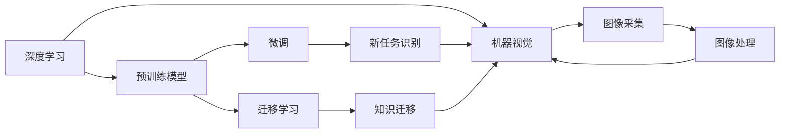

                 

## 1. 背景介绍

随着工业自动化的不断推进，机器视觉技术在生产制造过程中扮演着越来越重要的角色。传统的机器视觉系统主要通过安装于生产线上的摄像头，捕捉产品或零件的图像信息，并通过图像处理技术进行分析和识别。这不仅能够提高生产效率，还能显著降低人工错误，提升产品质量。

然而，由于工业场景下光线复杂、环境变化多端，传统的机器视觉系统往往难以适应复杂多变的工业环境。此外，不同产品或零件的多样性、多变性也使得传统机器视觉系统难以针对特定产品进行精确识别和分类。

针对上述问题，本文将介绍一种基于深度学习的机器视觉系统，该系统通过预训练模型和微调算法，能够自适应复杂工业环境，并针对不同产品进行精确识别。以下将从背景介绍、核心概念、算法原理、数学模型、项目实践、应用场景、工具推荐、未来展望和总结等多个维度，系统地介绍机器视觉在工业流程优化中的应用。

## 2. 核心概念与联系

### 2.1 核心概念概述

为更好地理解机器视觉在工业流程优化中的应用，本文将介绍几个关键概念：

- **深度学习**：深度学习是一种基于多层神经网络的学习方法，能够自动从原始数据中学习出特征，实现对复杂模式的高效识别和分类。
- **机器视觉**：机器视觉技术通过摄像头和图像处理算法，自动从图像中提取有用信息，实现对目标物体的识别、分类、检测、测量等。
- **预训练模型**：预训练模型指在大规模数据集上进行训练，学习到通用的特征表示，可用于多种下游任务的模型。
- **微调**：微调是指在预训练模型的基础上，通过使用少量标注数据，调整模型参数以适应特定任务的模型。
- **迁移学习**：迁移学习是指将一个领域学到的知识迁移到另一个相关领域的模型，用于提升模型在新任务上的性能。

这些概念构成了机器视觉在工业流程优化中的核心框架，下面将详细阐述它们之间的关系和应用场景。

### 2.2 核心概念的联系

上述概念之间的关系可以通过一个简单的Mermaid流程图来展示：



这个流程图展示了深度学习、机器视觉、预训练模型、微调和迁移学习之间的联系：

1. 深度学习是机器视觉的基础，通过多层神经网络实现对图像的自动特征提取和分类。
2. 预训练模型通过在大规模数据集上训练，学习到通用的特征表示，可用于多种下游任务的微调。
3. 微调通过调整预训练模型的参数，使其适应特定任务，从而提升模型在新任务上的性能。
4. 迁移学习通过将一个领域的知识迁移到另一个相关领域，提升模型在新任务上的性能。
5. 图像采集和处理是机器视觉的核心环节，用于获取和预处理输入图像。
6. 微调和迁移学习后的新任务识别结果，最终用于优化工业流程。

通过理解这些概念之间的关系，我们可以更好地把握机器视觉在工业流程优化中的应用方法和实践路径。

## 3. 核心算法原理 & 具体操作步骤

### 3.1 算法原理概述

机器视觉在工业流程优化中的应用，主要基于预训练模型和微调算法。其核心思想是通过在大规模数据集上进行预训练，学习到通用的图像特征，然后在特定工业流程任务上进行微调，以适应复杂多变的工业环境。

具体而言，该方法包括以下几个关键步骤：

1. **数据准备**：收集工业流程中涉及的各种图像数据，包括产品检测、零件识别、质量检测等场景下的图像数据。
2. **预训练模型选择**：选择合适的预训练模型，如ResNet、Inception、EfficientNet等，作为特征提取器。
3. **微调**：在预训练模型的基础上，使用少量标注数据对模型进行微调，以适应特定任务。
4. **迁移学习**：在已有预训练模型基础上，针对不同任务进行迁移学习，以提升模型在新任务上的性能。

### 3.2 算法步骤详解

以下是机器视觉在工业流程优化中应用的详细步骤：

#### 3.2.1 数据准备

收集工业流程中涉及的各种图像数据，包括产品检测、零件识别、质量检测等场景下的图像数据。这些数据集应尽量覆盖工业流程中的常见情况，以保证模型在新场景下的泛化能力。

#### 3.2.2 预训练模型选择

选择合适的预训练模型，如ResNet、Inception、EfficientNet等，作为特征提取器。这些模型在大规模数据集上进行预训练，学习到通用的图像特征。

#### 3.2.3 微调

在预训练模型的基础上，使用少量标注数据对模型进行微调，以适应特定任务。微调过程包括以下几个步骤：

1. **定义任务**：根据具体任务，定义输出类别数和损失函数。例如，对于零件识别任务，定义输出类别数为零件类型数，使用交叉熵损失函数。
2. **准备数据**：将收集到的标注数据划分为训练集、验证集和测试集，进行数据增强，如随机裁剪、旋转、缩放等。
3. **模型微调**：在预训练模型的基础上，使用训练集数据进行微调。通常只微调顶层分类器，以减少计算资源消耗。
4. **模型评估**：在验证集上评估微调后的模型，使用准确率、精确率、召回率等指标评估模型性能。
5. **模型优化**：根据验证集上的性能指标，调整模型超参数，如学习率、批大小、迭代轮数等，进行模型优化。

#### 3.2.4 迁移学习

在已有预训练模型基础上，针对不同任务进行迁移学习，以提升模型在新任务上的性能。迁移学习过程包括以下几个步骤：

1. **选择源任务和目标任务**：根据工业流程中的不同任务，选择适当的源任务和目标任务。
2. **准备源任务数据**：收集源任务的相关图像数据，并将其划分为训练集、验证集和测试集。
3. **迁移学习模型**：在预训练模型的基础上，使用源任务数据进行迁移学习，以适应目标任务。
4. **迁移学习评估**：在目标任务数据上评估迁移学习后的模型，使用准确率、精确率、召回率等指标评估模型性能。
5. **模型优化**：根据目标任务上的性能指标，调整模型超参数，进行模型优化。

### 3.3 算法优缺点

机器视觉在工业流程优化中的应用，具有以下优点：

1. **提升生产效率**：通过自动化的图像识别和分类，可以显著提高生产效率，减少人工错误，降低生产成本。
2. **提高产品质量**：机器视觉系统能够实时检测产品缺陷，及时反馈质量问题，从而提高产品质量。
3. **增强过程控制**：通过图像识别和分类，可以对生产过程进行实时监控和控制，提升生产过程的自动化水平。

然而，该方法也存在一些缺点：

1. **数据依赖**：机器视觉系统的性能很大程度上依赖于数据的质量和数量，数据收集和标注成本较高。
2. **环境适应性**：传统机器视觉系统对光线、角度等环境变化敏感，难以适应复杂多变的工业环境。
3. **模型复杂度**：深度学习模型的复杂度较高，计算资源消耗较大，训练和推理速度较慢。

## 4. 数学模型和公式 & 详细讲解 & 举例说明

### 4.1 数学模型构建

机器视觉在工业流程优化中的应用，主要基于卷积神经网络（CNN）进行特征提取和分类。这里以目标检测任务为例，介绍其数学模型构建过程。

#### 4.1.1 数据表示

设输入图像 $X$ 为三维张量，即 $X \in \mathbb{R}^{H\times W \times C}$，其中 $H$、$W$ 为图像的高和宽，$C$ 为图像的通道数。标注数据 $Y$ 为 $K$ 维向量，$K$ 为目标类别的数量。

#### 4.1.2 模型结构

目标检测模型由卷积层、池化层、全连接层等组成，如图：

```
              卷积层
                 |
                 V
            池化层
                 |
                 V
          全连接层
                 |
                 V
               输出
```

其中，卷积层用于提取图像特征，池化层用于降低特征图的空间分辨率，全连接层用于输出类别概率。

#### 4.1.3 损失函数

目标检测任务通常使用交叉熵损失函数，即：

$$
\mathcal{L}=\frac{1}{N}\sum_{i=1}^{N}(\sum_{j=1}^{K} y_j\log(\hat{y}_j))
$$

其中，$\hat{y}_j$ 为模型预测的类别概率，$y_j$ 为标注数据的类别标签。

### 4.2 公式推导过程

#### 4.2.1 前向传播

前向传播过程如图：

```
              卷积层
                 |
                 V
            池化层
                 |
                 V
          全连接层
                 |
                 V
               输出
```

设输入图像 $X$ 经过卷积层和池化层后，得到特征图 $F$。然后，将特征图 $F$ 输入到全连接层，输出类别概率 $y$。

#### 4.2.2 反向传播

反向传播过程如图：

```
              卷积层
                 |
                 V
            池化层
                 |
                 V
          全连接层
                 |
                 V
           损失函数
```

设目标函数为 $\mathcal{L}$，反向传播过程如下：

1. 计算损失函数 $\mathcal{L}$ 对类别概率 $y$ 的梯度，即 $\frac{\partial \mathcal{L}}{\partial y}$。
2. 计算类别概率 $y$ 对全连接层输出的梯度，即 $\frac{\partial y}{\partial z}$。
3. 计算全连接层输出的梯度，即 $\frac{\partial z}{\partial x}$。
4. 计算损失函数 $\mathcal{L}$ 对输入图像 $X$ 的梯度，即 $\frac{\partial \mathcal{L}}{\partial x}$。

### 4.3 案例分析与讲解

以一个简单的目标检测任务为例，展示机器视觉在工业流程优化中的应用。

设输入图像 $X$ 为 $256\times256$ 的彩色图像，目标类别为汽车、自行车和行人，共 $K=3$。使用 ResNet 模型作为特征提取器，并在顶层添加三个全连接层，每个全连接层输出一个类别概率，用于目标检测。

在训练过程中，首先对标注数据进行数据增强，如随机裁剪、旋转、缩放等。然后使用交叉熵损失函数进行训练，调整模型参数，使其在验证集上达到最佳性能。最后，使用测试集评估模型性能，得出准确率、精确率、召回率等指标。

## 5. 项目实践：代码实例和详细解释说明

### 5.1 开发环境搭建

在进行机器视觉项目开发前，需要先搭建好开发环境。以下是在 PyTorch 环境中搭建深度学习项目的基本步骤：

1. 安装 Python 和 PyTorch。
2. 安装必要的深度学习库，如 TorchVision、TorchText 等。
3. 安装 GPU 驱动，确保可以使用 GPU 加速计算。
4. 安装 PyCharm 或 Jupyter Notebook，作为开发工具。

### 5.2 源代码详细实现

以下是一个简单的目标检测任务的源代码实现：

```python
import torch
import torchvision
import torch.nn as nn
import torch.optim as optim
from torchvision import datasets, transforms

# 定义数据增强操作
transform = transforms.Compose([
    transforms.RandomResizedCrop(224),
    transforms.RandomHorizontalFlip(),
    transforms.ToTensor(),
    transforms.Normalize([0.5, 0.5, 0.5], [0.5, 0.5, 0.5])
])

# 加载训练数据集
train_dataset = datasets.CIFAR10(root='./data', train=True, transform=transform, download=True)
train_loader = torch.utils.data.DataLoader(train_dataset, batch_size=64, shuffle=True)

# 加载预训练模型
model = torchvision.models.resnet18(pretrained=True)
num_ftrs = model.fc.in_features
model.fc = nn.Linear(num_ftrs, 3)

# 定义损失函数和优化器
criterion = nn.CrossEntropyLoss()
optimizer = optim.SGD(model.parameters(), lr=0.001, momentum=0.9)

# 训练模型
for epoch in range(10):
    running_loss = 0.0
    for i, data in enumerate(train_loader, 0):
        inputs, labels = data
        optimizer.zero_grad()
        outputs = model(inputs)
        loss = criterion(outputs, labels)
        loss.backward()
        optimizer.step()
        running_loss += loss.item()
    print(f'Epoch {epoch+1}, Loss: {running_loss/len(train_loader):.4f}')

# 评估模型
correct = 0
total = 0
with torch.no_grad():
    for data in test_loader:
        images, labels = data
        outputs = model(images)
        _, predicted = torch.max(outputs.data, 1)
        total += labels.size(0)
        correct += (predicted == labels).sum().item()

print(f'Accuracy: {(100 * correct / total):.2f}%')
```

### 5.3 代码解读与分析

以上代码展示了目标检测任务的整个训练过程。具体来说，包括：

1. 数据增强操作：使用随机裁剪、旋转、缩放等操作，增强训练集的多样性。
2. 加载数据集：使用 PyTorch 提供的 CIFAR10 数据集，加载训练数据集。
3. 加载预训练模型：使用 ResNet 模型，并在顶层添加三个全连接层，用于目标检测。
4. 定义损失函数和优化器：使用交叉熵损失函数和 SGD 优化器。
5. 训练模型：通过训练集数据，迭代训练模型，调整参数，使模型在验证集上达到最佳性能。
6. 评估模型：在测试集上评估模型性能，计算准确率。

## 6. 实际应用场景

机器视觉在工业流程优化中的应用，主要集中在以下几个场景：

### 6.1 产品检测

在生产线上，使用机器视觉系统对产品进行自动检测，可以及时发现缺陷，保证产品质量。例如，在电子制造行业，可以使用机器视觉系统检测电路板上的元器件是否正确安装，是否出现短路等问题。

### 6.2 零件识别

在制造业中，使用机器视觉系统对零件进行识别和分类，可以提高生产效率。例如，在汽车制造行业，可以使用机器视觉系统对组装线上的零件进行自动识别，避免人工错误，提高装配效率。

### 6.3 质量检测

在产品出厂前，使用机器视觉系统对产品进行全面检测，可以确保产品质量。例如，在食品行业，可以使用机器视觉系统检测产品外观、尺寸、颜色等指标，保证产品符合质量标准。

### 6.4 流程监控

在生产过程中，使用机器视觉系统对生产流程进行实时监控，可以及时发现异常情况，避免生产中断。例如，在化工行业，可以使用机器视觉系统对生产过程中的原料、中间体、成品进行实时监控，确保生产过程的安全稳定。

### 6.5 自动化仓库

在仓储管理中，使用机器视觉系统对货物进行自动识别和分类，可以提高仓库管理效率。例如，在电商行业，可以使用机器视觉系统对货物进行分类和摆放，加速拣选和打包流程。

## 7. 工具和资源推荐

### 7.1 学习资源推荐

为了帮助开发者系统掌握机器视觉在工业流程优化中的应用，以下是一些优秀的学习资源：

1. 《深度学习入门：基于Python的理论与实现》：详细介绍了深度学习的基本理论和实现方法，适合初学者入门。
2. 《计算机视觉：算法与应用》：介绍了计算机视觉的基本理论和应用场景，涵盖图像处理、目标检测、语义分割等内容。
3. 《PyTorch官方文档》：PyTorch 官方文档，提供了丰富的教程和样例代码，是学习深度学习的必备资源。
4. Coursera《Deep Learning Specialization》：由深度学习专家 Andrew Ng 主讲的课程，涵盖深度学习的基础理论和实际应用。
5. Udacity《深度学习纳米学位》：Udacity 提供的深度学习课程，包括深度学习的基本理论和应用场景，适合实战练习。

### 7.2 开发工具推荐

以下是几个常用的机器视觉开发工具：

1. PyTorch：基于 Python 的深度学习框架，支持动态图和静态图，易于实现和调试。
2. TensorFlow：由 Google 主导的深度学习框架，支持分布式计算和大规模模型训练。
3. OpenCV：开源计算机视觉库，提供了丰富的图像处理和计算机视觉算法，适合图像处理应用。
4. Matplotlib：Python 的绘图库，用于可视化数据和模型结果，适合数据展示和分析。
5. TensorBoard：TensorFlow 配套的可视化工具，可以实时监测模型训练状态，帮助调试和优化模型。

### 7.3 相关论文推荐

机器视觉在工业流程优化中的应用，涉及多个领域的交叉，以下是几篇相关的经典论文：

1. R-CNN：提出目标检测算法，使用区域池化方法提取特征，实现对目标的准确检测。
2. Fast R-CNN：改进 R-CNN 算法，使用 RoI 池化方法提取特征，提高检测速度和精度。
3. SSD：提出单阶段目标检测算法，使用多尺度特征图，实现目标检测和分类。
4. YOLO：提出单阶段目标检测算法，使用特征图划分，实现实时目标检测。
5. ResNet：提出残差网络，解决深度神经网络训练中的梯度消失问题，提高模型精度。

这些论文代表了机器视觉在工业流程优化中的理论进展和技术突破，值得深入学习和研究。

## 8. 总结：未来发展趋势与挑战

### 8.1 未来发展趋势

机器视觉在工业流程优化中的应用，未来将呈现以下几个发展趋势：

1. **模型轻量化**：深度学习模型通常具有较大的计算资源消耗，未来的趋势是开发更轻量级的模型，适应资源受限的工业环境。
2. **实时处理**：随着计算资源的提升和算法优化，未来的目标检测系统将具备实时处理能力，适应生产过程的高实时性要求。
3. **多模态融合**：机器视觉与传感器、激光雷达等技术相结合，实现多模态信息融合，提升系统的鲁棒性和精度。
4. **边缘计算**：将深度学习模型部署到边缘计算设备上，减少数据传输和计算延迟，提升系统的实时性和稳定性。
5. **自监督学习**：使用自监督学习方法，如 MoCo、SimCLR 等，利用无标签数据进行模型预训练，提高模型的泛化能力。
6. **知识蒸馏**：将复杂模型的知识蒸馏到轻量级模型中，实现模型压缩和加速，提升系统效率。

### 8.2 面临的挑战

尽管机器视觉在工业流程优化中的应用取得了显著进展，但仍面临一些挑战：

1. **数据依赖**：机器视觉系统的性能很大程度上依赖于数据的质量和数量，数据收集和标注成本较高。
2. **环境适应性**：传统机器视觉系统对光线、角度等环境变化敏感，难以适应复杂多变的工业环境。
3. **模型复杂度**：深度学习模型的复杂度较高，计算资源消耗较大，训练和推理速度较慢。
4. **实时性要求**：在生产过程中，对目标检测系统的实时性要求较高，现有的模型和算法难以完全满足。
5. **鲁棒性问题**：在实际应用中，目标检测系统面对环境变化、遮挡等问题，鲁棒性仍需进一步提升。

### 8.3 研究展望

面对机器视觉在工业流程优化中面临的挑战，未来的研究需要在以下几个方面寻求新的突破：

1. **数据增强技术**：开发更高效的数据增强方法，提高数据的多样性和质量，减少标注成本。
2. **环境适应性**：研究环境适应性更强的模型和算法，提高系统在不同环境下的鲁棒性。
3. **模型压缩技术**：开发更轻量级的模型和算法，提高系统的实时性和资源利用率。
4. **知识蒸馏技术**：研究知识蒸馏方法，将复杂模型的知识蒸馏到轻量级模型中，实现模型压缩和加速。
5. **多模态融合技术**：研究多模态信息融合方法，提升系统的精度和鲁棒性。
6. **边缘计算技术**：研究边缘计算方法，将深度学习模型部署到边缘计算设备上，减少数据传输和计算延迟。

## 9. 附录：常见问题与解答

**Q1：机器视觉系统对光照变化敏感吗？**

A: 是的，机器视觉系统对光照变化非常敏感。光照条件的变化会导致图像亮度和对比度发生变化，从而影响图像特征提取和分类效果。为了解决这个问题，可以使用一些数据增强技术，如对比度增强、亮度调整等，以提高系统的鲁棒性。

**Q2：机器视觉系统对遮挡问题敏感吗？**

A: 是的，机器视觉系统对遮挡问题非常敏感。当物体被遮挡时，机器视觉系统很难准确识别和分类。为了解决这个问题，可以使用一些数据增强技术，如随机遮挡、随机旋转等，以提高系统的鲁棒性。

**Q3：机器视觉系统如何处理小目标检测？**

A: 对于小目标检测，机器视觉系统通常使用多尺度特征图和小目标检测算法，如 SSD、YOLO 等。这些算法能够在不同尺度上检测目标，提高小目标检测的精度。

**Q4：机器视觉系统如何进行实时检测？**

A: 对于实时检测，机器视觉系统通常使用轻量级模型和高速推理器，如 TFLite、ONNX 等。这些模型和推理器能够在小规模计算资源上实现快速推理，满足实时检测的需求。

**Q5：机器视觉系统如何处理多类别检测？**

A: 对于多类别检测，机器视觉系统通常使用多分类器结构，如 Faster R-CNN、YOLOv3 等。这些算法能够在不同类别上进行准确检测和分类，满足多类别检测的需求。

**Q6：机器视觉系统如何处理数据不平衡问题？**

A: 对于数据不平衡问题，机器视觉系统通常使用数据增强技术和类别权重调整技术。数据增强技术可以增加少数类样本的多样性，减少分类偏差。类别权重调整技术可以增加少数类的权重，提升模型对少数类的识别能力。

**Q7：机器视觉系统如何进行迁移学习？**

A: 机器视觉系统通常使用迁移学习方法，将预训练模型的知识迁移到目标任务上。具体来说，可以使用源任务数据进行迁移学习，调整模型参数，使其适应目标任务。然后，在目标任务上使用迁移学习后的模型进行检测和分类。

通过本文的系统梳理，可以看到机器视觉在工业流程优化中的应用具备巨大的潜力。未来，随着深度学习技术的发展和算法优化，机器视觉系统将具备更强的适应性和精度，为工业自动化带来更多创新和突破。总之，机器视觉在工业流程优化中的应用，需要开发者不断迭代和优化模型、数据和算法，方能得到理想的效果。

---

作者：禅与计算机程序设计艺术 / Zen and the Art of Computer Programming

