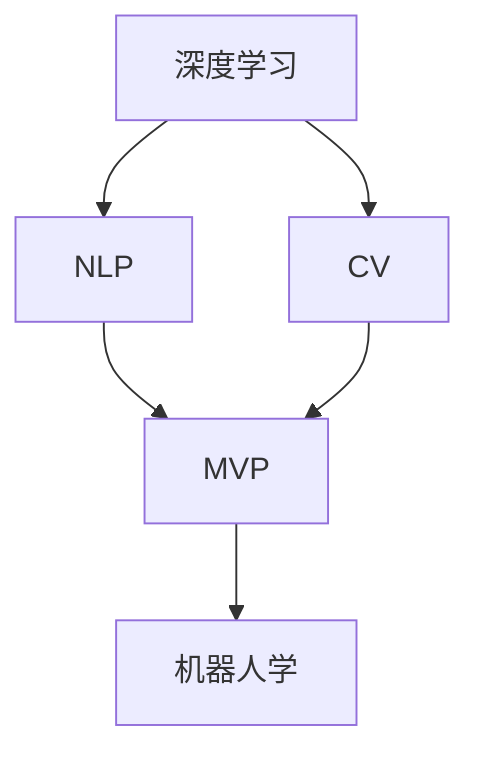
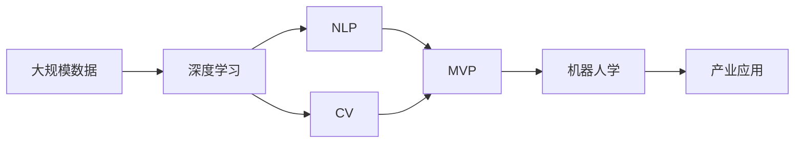

                 

# 李开复：AI 2.0 时代的市场前景

在人工智能(AI)2.0时代，科技的迅猛发展正在深刻改变我们的生活方式，推动各行各业的数字化转型。作为世界级的科技思想领袖，李开复在多个场合分享了他对AI 2.0未来市场前景的独到见解。本文将从背景介绍、核心概念、算法原理、项目实践、应用场景、工具资源推荐、总结与展望等多个维度，系统解析李开复的观点，并结合最新技术进展，为读者描绘出一幅AI 2.0市场的广阔前景图景。

## 1. 背景介绍

### 1.1 问题由来

随着科技的不断进步，人工智能(AI)正以势不可挡的势头，从实验室走向实际应用。AI 2.0时代，即“人工智能的黄金时代”，标志着AI技术的全面成熟和商业化应用。李开复指出，AI 2.0将不仅仅局限于学术界的研究，而是将广泛应用于各个行业，带来深远的社会变革。

### 1.2 问题核心关键点

AI 2.0时代的核心在于其广泛的应用前景和巨大的市场潜力。李开复认为，AI 2.0将深刻影响医疗、教育、金融、制造、交通等众多领域，推动产业升级和经济转型。AI 2.0的核心技术包括深度学习、自然语言处理(NLP)、计算机视觉(CV)、机器人学等，这些技术正在快速发展，不断突破人类认知的边界。

### 1.3 问题研究意义

理解AI 2.0时代的市场前景，对于把握技术发展趋势、制定企业战略、投资AI领域具有重要意义。AI 2.0将带来大量的投资机会，促进经济增长，同时也会带来就业结构的变化，影响教育体系和社会福祉。因此，对AI 2.0市场的洞察，有助于企业、政府和个人做出明智的决策。

## 2. 核心概念与联系

### 2.1 核心概念概述

李开复在阐述AI 2.0市场前景时，提到了几个核心概念：

- **AI 2.0**：指AI技术的全面成熟和商业化应用，涵盖了深度学习、NLP、CV、机器人学等多个领域。
- **深度学习**：通过多层次的神经网络，从数据中自动学习特征，实现图像、语音、文本等数据的处理和理解。
- **自然语言处理(NLP)**：使机器能够理解、处理和生成人类语言，包括语音识别、文本分类、机器翻译等。
- **计算机视觉(CV)**：使机器能够“看”和理解图像和视频，包括目标检测、图像分割、图像生成等。
- **机器人学**：使机器人能够具备自主决策和执行任务的能力，推动工业自动化和家庭服务机器人发展。

这些概念构成了AI 2.0的核心技术框架，彼此之间相互支持，共同推动AI技术的进步和应用。

### 2.2 概念间的关系

李开复通过以下几个Mermaid流程图展示了AI 2.0核心概念之间的关系：



这个流程图展示了深度学习、NLP、CV和机器人学这四个核心概念之间的相互作用。深度学习为NLP和CV提供了基础的特征提取能力，NLP和CV通过多模态数据的融合，为MVP（模型-数据-产品）循环提供了更丰富的数据源，机器人学则将NLP和CV的技术应用于实际的机器执行场景。

### 2.3 核心概念的整体架构

李开复进一步构建了一个综合的流程图，展示AI 2.0技术的整体架构：



这个流程图展示了AI 2.0技术从数据到应用的全流程。大规模数据是AI 2.0技术的基石，深度学习通过训练模型自动提取特征，NLP和CV分别处理文本和视觉数据，MVP循环驱动产品创新，机器人学将技术应用于实际的工业和家庭场景，最终推动产业应用。

## 3. 核心算法原理 & 具体操作步骤

### 3.1 算法原理概述

AI 2.0技术的核心算法包括深度学习、NLP、CV和机器人学。李开复强调，这些技术的发展依赖于庞大的数据集和强大的计算能力。深度学习通过多层次神经网络实现特征提取和分类；NLP利用预训练模型和微调技术，提升对语言的理解和生成能力；CV通过卷积神经网络(CNN)和循环神经网络(RNN)等技术，处理图像和视频数据；机器人学则结合NLP和CV技术，实现自主决策和执行任务。

### 3.2 算法步骤详解

李开复以AI 2.0在医疗领域的应用为例，详细介绍了AI 2.0技术的实施步骤：

1. **数据采集与预处理**：收集大规模的医疗数据，包括电子健康记录、影像数据、基因数据等，并进行清洗和标注。
2. **模型训练与验证**：使用深度学习模型，如卷积神经网络(CNN)和循环神经网络(RNN)，对医疗数据进行训练和验证，优化模型参数。
3. **模型微调与优化**：针对特定医疗任务，如疾病诊断、治疗方案推荐等，对模型进行微调，提升其在特定场景下的性能。
4. **模型部署与应用**：将训练好的模型部署到医疗系统中，实现对病人的智能诊断和个性化治疗。

### 3.3 算法优缺点

AI 2.0技术虽然具备强大的数据处理和分析能力，但也存在一些局限性：

- **数据依赖性**：AI 2.0技术依赖于大规模高质量的数据，数据获取和标注成本较高。
- **算法复杂性**：深度学习等技术的算法复杂度高，需要大量计算资源和专业人才。
- **伦理与安全**：AI 2.0技术可能带来隐私泄露和算法偏见问题，需要加强监管和伦理约束。
- **可解释性**：AI 2.0模型往往被视为“黑盒”，难以解释其内部决策逻辑。

李开复强调，虽然存在这些局限性，但AI 2.0技术的优势远大于缺点，其在医疗、教育、金融等领域的广泛应用将带来巨大的社会价值。

### 3.4 算法应用领域

AI 2.0技术已经广泛应用于医疗、教育、金融、制造、交通等多个领域，具体包括：

- **医疗**：智能诊断、治疗方案推荐、医疗影像分析等。
- **教育**：个性化学习、智能辅导、考试评分等。
- **金融**：风险评估、投资策略、客户服务机器人等。
- **制造**：智能制造、供应链管理、质量检测等。
- **交通**：自动驾驶、智能交通管理、车联网等。

## 4. 数学模型和公式 & 详细讲解  
### 4.1 数学模型构建

AI 2.0技术中的数学模型构建，主要集中在深度学习和NLP领域。以医疗影像分析为例，深度学习模型构建的过程如下：

- **输入数据**：输入医疗影像数据，如X光片、CT扫描等。
- **特征提取**：使用卷积神经网络(CNN)提取影像特征。
- **模型训练**：使用标注数据训练CNN模型，优化模型参数。
- **预测与验证**：对新影像数据进行预测，并在验证集上进行性能评估。

### 4.2 公式推导过程

以医疗影像分类为例，推导CNN模型训练过程中的损失函数和梯度更新公式。

假设医疗影像的分类任务有K个类别，输入图像为$x$，输出标签为$y$，CNN模型的输出为$z$。则损失函数$L$可以表示为交叉熵损失：

$$
L = -\frac{1}{N}\sum_{i=1}^N \sum_{k=1}^K y_{ik}\log(z_{ik})
$$

其中，$y_{ik}$表示第$i$个样本的第$k$个类别的标签，$z_{ik}$表示模型对第$i$个样本的第$k$个类别的预测概率。

根据链式法则，模型的梯度更新公式为：

$$
\frac{\partial L}{\partial z_{ik}} = \frac{\partial L}{\partial y_{ik}} \frac{\partial y_{ik}}{\partial z_{ik}}
$$

其中，$\frac{\partial L}{\partial y_{ik}} = -\frac{1}{N}\sum_{i=1}^N y_{ik}$，$\frac{\partial y_{ik}}{\partial z_{ik}} = \delta_{ik} - z_{ik}$，$\delta_{ik} = \mathbf{1}[k = \arg\max_k y_{ik}]$。

### 4.3 案例分析与讲解

以自然语言处理(NLP)为例，李开复详细介绍了BERT模型的微调过程：

- **预训练**：使用大规模无标签文本数据，如维基百科、新闻等，训练BERT模型。
- **微调**：选择特定领域的标注数据，如医疗问答、法律文书等，对BERT模型进行微调，提升其在特定场景下的性能。
- **验证与部署**：在验证集上评估微调后的模型性能，部署到实际应用中。

## 5. 项目实践：代码实例和详细解释说明

### 5.1 开发环境搭建

使用Python和PyTorch搭建AI 2.0项目环境，具体步骤如下：

1. 安装Anaconda：从官网下载并安装Anaconda，用于创建独立的Python环境。
2. 创建并激活虚拟环境：
```bash
conda create -n pytorch-env python=3.8 
conda activate pytorch-env
```
3. 安装PyTorch：根据CUDA版本，从官网获取对应的安装命令。例如：
```bash
conda install pytorch torchvision torchaudio cudatoolkit=11.1 -c pytorch -c conda-forge
```
4. 安装TensorFlow：如果需要使用TensorFlow，请从官网下载并安装。
5. 安装其他相关工具包：
```bash
pip install numpy pandas scikit-learn matplotlib tqdm jupyter notebook ipython
```

完成上述步骤后，即可在`pytorch-env`环境中开始AI 2.0项目开发。

### 5.2 源代码详细实现

以下是一个简单的医疗影像分类项目的PyTorch代码实现：

```python
import torch
import torch.nn as nn
import torch.optim as optim
from torchvision import datasets, transforms

# 定义卷积神经网络(CNN)
class CNNModel(nn.Module):
    def __init__(self):
        super(CNNModel, self).__init__()
        self.conv1 = nn.Conv2d(1, 32, 3)
        self.pool = nn.MaxPool2d(2)
        self.fc1 = nn.Linear(32 * 28 * 28, 128)
        self.fc2 = nn.Linear(128, 10)
        
    def forward(self, x):
        x = self.pool(F.relu(self.conv1(x)))
        x = x.view(-1, 32 * 28 * 28)
        x = F.relu(self.fc1(x))
        x = self.fc2(x)
        return x

# 加载数据集
train_dataset = datasets.MNIST('data', train=True, download=True, transform=transforms.ToTensor())
test_dataset = datasets.MNIST('data', train=False, download=True, transform=transforms.ToTensor())

# 定义模型和优化器
model = CNNModel()
optimizer = optim.SGD(model.parameters(), lr=0.01, momentum=0.9)

# 训练模型
device = torch.device('cuda' if torch.cuda.is_available() else 'cpu')
model.to(device)
criterion = nn.CrossEntropyLoss()
for epoch in range(10):
    model.train()
    for i, (images, labels) in enumerate(train_loader):
        images, labels = images.to(device), labels.to(device)
        optimizer.zero_grad()
        outputs = model(images)
        loss = criterion(outputs, labels)
        loss.backward()
        optimizer.step()
        
# 评估模型
model.eval()
with torch.no_grad():
    correct = 0
    total = 0
    for images, labels in test_loader:
        images, labels = images.to(device), labels.to(device)
        outputs = model(images)
        _, predicted = torch.max(outputs.data, 1)
        total += labels.size(0)
        correct += (predicted == labels).sum().item()
    print('Accuracy: {} %'.format(100 * correct / total))
```

### 5.3 代码解读与分析

这段代码展示了如何训练一个简单的CNN模型，用于分类MNIST手写数字数据集。具体步骤如下：

1. **数据预处理**：使用`transforms.ToTensor()`将图像数据转化为张量。
2. **模型定义**：定义一个包含卷积层、池化层、全连接层的CNN模型。
3. **训练过程**：在训练集上循环迭代，每次前向传播计算输出，反向传播更新模型参数。
4. **模型评估**：在测试集上评估模型性能，计算准确率。

## 6. 实际应用场景

### 6.1 智能医疗

AI 2.0在医疗领域的应用，包括智能诊断、治疗方案推荐、医疗影像分析等。例如，使用深度学习技术，可以对CT扫描、MRI等医疗影像进行自动分类和分析，辅助医生进行疾病诊断和治疗方案选择。

### 6.2 智能教育

AI 2.0在教育领域的应用，包括个性化学习、智能辅导、考试评分等。例如，使用NLP技术，可以自动批改学生作业，根据学生的学习行为和反馈，推荐个性化的学习内容和路径。

### 6.3 智能金融

AI 2.0在金融领域的应用，包括风险评估、投资策略、客户服务机器人等。例如，使用深度学习技术，可以对金融市场数据进行分析，预测市场趋势和风险，提供投资建议。

### 6.4 智能制造

AI 2.0在制造领域的应用，包括智能制造、供应链管理、质量检测等。例如，使用计算机视觉技术，可以自动检测生产线上的产品质量缺陷，提高生产效率和产品质量。

### 6.5 智能交通

AI 2.0在交通领域的应用，包括自动驾驶、智能交通管理、车联网等。例如，使用深度学习技术，可以对交通视频数据进行分析，实时预测交通流量和事故风险，优化交通管理。

## 7. 工具和资源推荐

### 7.1 学习资源推荐

1. **《深度学习》系列课程**：斯坦福大学的李飞飞教授开设的深度学习课程，涵盖深度学习的基本概念和实现技巧。
2. **TensorFlow官方文档**：Google开发的深度学习框架，提供详细的API文档和案例代码，适合深入学习。
3. **PyTorch官方文档**：Facebook开发的深度学习框架，提供丰富的预训练模型和优化器库，适合快速上手。
4. **Coursera深度学习课程**：由Google、DeepMind等机构联合开设的深度学习课程，涵盖深度学习在NLP、CV等领域的应用。
5. **ArXiv论文预印本**：人工智能领域最新研究成果的发布平台，涵盖大量未发表的前沿工作，学习前沿技术的必读资源。

### 7.2 开发工具推荐

1. **PyTorch**：基于Python的开源深度学习框架，灵活的动态计算图，适合快速迭代研究。
2. **TensorFlow**：由Google主导开发的深度学习框架，生产部署方便，适合大规模工程应用。
3. **Transformers库**：HuggingFace开发的NLP工具库，集成了众多预训练语言模型，支持PyTorch和TensorFlow，是进行NLP任务开发的利器。
4. **Jupyter Notebook**：基于IPython的项目开发环境，支持实时展示代码运行结果，适合科学研究和数据探索。
5. **GitHub**：代码托管平台，方便开发者协作和分享代码，是开源项目的重要基础设施。

### 7.3 相关论文推荐

1. **《深度学习》（Deep Learning）**：Ian Goodfellow、Yoshua Bengio、Aaron Courville合著的深度学习经典教材，涵盖深度学习的理论和实践。
2. **《自然语言处理综论》（Speech and Language Processing）**：Daniel Jurafsky和James H. Martin合著的NLP经典教材，深入浅出地介绍了NLP的基础知识和前沿技术。
3. **《计算机视觉：算法与应用》（Computer Vision: Algorithms and Applications）**：Richard Szeliski合著的计算机视觉教材，详细介绍了计算机视觉的基本算法和应用场景。
4. **《机器人学基础》（Introduction to Robotics）**：Arditti Isack、Dennis Rodriguez合著的机器人学教材，涵盖机器人学的基本原理和应用技术。
5. **《机器学习》（Machine Learning Yearning）**：Andrew Ng合著的机器学习实践指南，详细介绍了机器学习项目的开发和部署过程。

## 8. 总结：未来发展趋势与挑战

### 8.1 研究成果总结

AI 2.0技术在医疗、教育、金融、制造、交通等多个领域的应用前景广阔，推动了产业升级和经济转型。深度学习、NLP、CV、机器人学等核心技术不断发展，不断突破人类认知的边界。

### 8.2 未来发展趋势

1. **数据和计算资源的需求将持续增长**：AI 2.0技术依赖于大规模高质量的数据和强大的计算能力，未来的数据量和计算需求将不断增加。
2. **多模态数据的融合将更加广泛**：AI 2.0技术将更加注重多模态数据的融合，提高模型的感知能力和泛化能力。
3. **自动化和智能化水平将显著提升**：AI 2.0技术将更加注重自动化和智能化，提高系统的自主决策能力和鲁棒性。
4. **伦理和安全问题将受到更多关注**：AI 2.0技术将更多地考虑伦理和安全问题，确保技术的公平性和安全性。

### 8.3 面临的挑战

AI 2.0技术在发展过程中也面临着诸多挑战：

1. **数据获取和标注成本高**：AI 2.0技术依赖于大规模高质量的数据，数据获取和标注成本较高。
2. **算法复杂度高**：深度学习等技术的算法复杂度高，需要大量计算资源和专业人才。
3. **伦理和安全问题**：AI 2.0技术可能带来隐私泄露和算法偏见问题，需要加强监管和伦理约束。
4. **可解释性不足**：AI 2.0模型往往被视为“黑盒”，难以解释其内部决策逻辑。

### 8.4 研究展望

未来的研究需要重点关注以下几个方向：

1. **无监督学习和半监督学习**：摆脱对大规模标注数据的依赖，利用自监督学习、主动学习等方法，最大限度利用非结构化数据。
2. **参数高效和计算高效的微调范式**：开发更加参数高效和计算高效的微调方法，提高微调效率和模型性能。
3. **多模态数据融合**：引入更多的多模态数据融合方法，提高模型的感知能力和泛化能力。
4. **先验知识的融合**：将符号化的先验知识，如知识图谱、逻辑规则等，与神经网络模型进行融合，增强模型的知识整合能力。
5. **自动化和智能化**：提高系统的自主决策能力和鲁棒性，实现更加智能化的应用。

## 9. 附录：常见问题与解答

**Q1：AI 2.0技术是否适用于所有行业？**

A: AI 2.0技术在医疗、教育、金融、制造、交通等多个领域都有广泛的应用前景。但是，对于某些特定的领域，如医疗、法律等，AI 2.0技术需要结合领域知识进行定制化开发。

**Q2：AI 2.0技术是否容易被理解和解释？**

A: 当前AI 2.0技术，尤其是深度学习模型，往往被视为“黑盒”，难以解释其内部决策逻辑。未来的研究需要重点关注模型的可解释性，提高系统的透明度和可信度。

**Q3：AI 2.0技术是否存在伦理和安全问题？**

A: AI 2.0技术可能会带来隐私泄露和算法偏见等问题。未来的研究需要重点关注伦理和安全问题，确保技术的应用符合人类价值观和伦理道德。

**Q4：AI 2.0技术的市场前景如何？**

A: AI 2.0技术在医疗、教育、金融、制造、交通等多个领域都有广泛的应用前景，推动了产业升级和经济转型。未来的市场前景广阔，有望带来巨大的社会价值和经济效益。

---

作者：禅与计算机程序设计艺术 / Zen and the Art of Computer Programming

