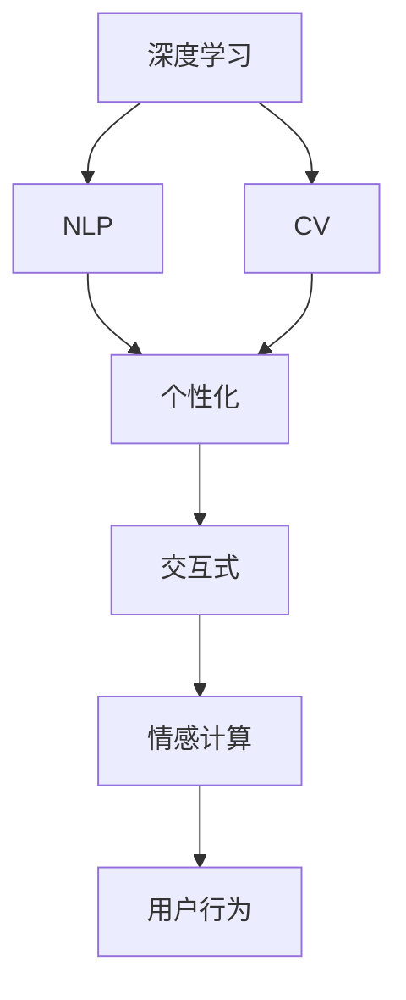
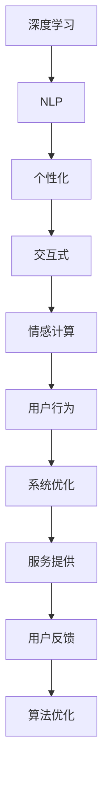

                 

# 李开复：AI 2.0 时代的意义

## 1. 背景介绍

### 1.1 问题的由来
在过去的几年里，人工智能（AI）技术取得了飞速的发展，特别是在深度学习和机器学习领域。这些技术的进步，尤其是在自然语言处理（NLP）和计算机视觉（CV）等领域的突破，让AI技术从理论上走向了实际应用。在这个背景下，李开复提出了“AI 2.0”的概念，并深入探讨了其意义。

### 1.2 核心概念
“AI 2.0”是李开复对新一代人工智能的称呼，它强调了AI技术的“人性”特征，即通过与人类进行深度互动，不断学习和优化自己的算法和模型，从而实现更高级的智能水平。与传统的“AI 1.0”相比，“AI 2.0”更加注重个性化和交互式体验，以及对人类情感和行为的理解。

### 1.3 问题研究的意义
探讨“AI 2.0”的意义，不仅是为了理解新一代人工智能技术的本质，更是为了把握其在实际应用中的潜力和挑战，推动AI技术在各个领域的广泛应用。本文将从核心概念、核心算法原理、操作步骤、实际应用场景等多个角度，深入分析“AI 2.0”的概念和意义。

## 2. 核心概念与联系

### 2.1 核心概念概述
为了更好地理解“AI 2.0”，我们首先需要明确几个核心概念：

- **深度学习**：一种基于多层神经网络的机器学习方法，通过反向传播算法优化模型参数，实现对复杂数据的高效处理。
- **自然语言处理（NLP）**：使计算机能够理解、处理和生成人类语言的技术。
- **计算机视觉（CV）**：使计算机能够识别、分类和分析图像和视频的技术。
- **个性化**：通过分析用户行为和偏好，提供量身定制的服务和产品。
- **交互式**：强调系统与用户之间的双向沟通和互动。
- **情感计算**：通过分析用户情感和行为，优化用户体验和系统决策。

### 2.2 核心概念之间的关系
这些核心概念之间的关系可以通过以下Mermaid流程图来展示：



这个流程图展示了深度学习、NLP、CV等技术如何通过个性化和交互式等手段，最终实现情感计算和用户行为分析。其中，深度学习是基础，而个性化和交互式则是实现方式，情感计算和用户行为分析则是最终目标。

### 2.3 核心概念的整体架构
最后，我们用一个综合的流程图来展示这些核心概念在大规模应用中的整体架构：



这个综合流程图展示了从深度学习到系统优化，再到服务提供和用户反馈的完整过程。它强调了深度学习在NLP、CV等领域的核心地位，以及通过个性化和交互式手段实现情感计算和用户行为分析的必要性。

## 3. 核心算法原理 & 具体操作步骤
### 3.1 算法原理概述
“AI 2.0”的核心算法原理基于深度学习和迁移学习（Transfer Learning）。深度学习通过构建多层神经网络，学习数据的复杂特征表示。迁移学习则通过利用预训练模型，将在一个任务上学习到的知识迁移到另一个任务上，从而加速新任务的学习过程。

### 3.2 算法步骤详解
基于深度学习和迁移学习的“AI 2.0”技术主要包括以下几个步骤：

1. **数据收集**：从不同来源收集大规模的训练数据，涵盖文本、图像、视频等多种数据类型。
2. **预训练模型构建**：使用深度学习框架（如TensorFlow、PyTorch）构建预训练模型，并在大规模无标签数据上进行预训练。
3. **微调**：根据具体任务的需求，对预训练模型进行微调，优化模型参数以适应新任务。
4. **个性化和交互式设计**：设计个性化的用户体验界面，实现与用户的双向互动，收集用户反馈。
5. **情感计算和用户行为分析**：通过自然语言处理、计算机视觉等技术，分析用户情感和行为，优化用户体验。
6. **算法优化和迭代**：根据用户反馈和实际应用中的数据，不断优化算法，提高系统性能。

### 3.3 算法优缺点
“AI 2.0”技术具有以下优点：

- **高精度**：深度学习模型在处理大规模数据时，通常能够获得较高的精度。
- **自适应性**：通过迁移学习，系统能够快速适应新任务，提高应用效率。
- **个性化和交互式**：通过个性化和交互式设计，提高用户满意度和粘性。
- **情感计算**：通过情感计算，提升用户体验，实现更自然的交互。

同时，它也存在以下缺点：

- **高成本**：大规模数据收集和预训练模型的构建需要大量计算资源和存储空间。
- **复杂性**：深度学习模型的调试和优化较为复杂，需要专业知识和经验。
- **伦理问题**：用户数据的隐私保护和情感计算的伦理问题需要慎重考虑。

### 3.4 算法应用领域
“AI 2.0”技术已经在多个领域得到了广泛应用，包括但不限于：

- **医疗健康**：通过情感计算和个性化设计，提升患者的治疗体验和遵医嘱率。
- **金融服务**：通过情感计算和用户行为分析，提高客户满意度和信任度。
- **教育培训**：通过个性化和交互式设计，提升学生的学习效果和兴趣。
- **智能家居**：通过情感计算和个性化设计，实现更智能、更舒适的生活环境。
- **电子商务**：通过个性化推荐和交互式设计，提升用户体验和销售额。

## 4. 数学模型和公式 & 详细讲解
### 4.1 数学模型构建
“AI 2.0”的数学模型通常基于深度学习和迁移学习。以自然语言处理为例，其数学模型可以表示为：

$$
y = f(x; \theta)
$$

其中，$x$ 表示输入的文本数据，$y$ 表示模型输出的预测结果，$\theta$ 表示模型的参数。

### 4.2 公式推导过程
在深度学习中，通常使用反向传播算法进行模型参数的更新。反向传播算法的核心公式为：

$$
\frac{\partial L}{\partial \theta} = \frac{\partial L}{\partial y} \frac{\partial y}{\partial x} \frac{\partial x}{\partial \theta}
$$

其中，$L$ 表示损失函数，$\partial L / \partial \theta$ 表示模型参数的梯度，$\partial y / \partial x$ 表示模型的导数，$\partial x / \partial \theta$ 表示数据和参数之间的关系。

### 4.3 案例分析与讲解
以自然语言处理中的情感分析为例，其模型可以表示为：

$$
y = f(x; \theta)
$$

其中，$x$ 表示输入的文本数据，$y$ 表示模型输出的情感极性（如正面、负面、中性），$\theta$ 表示模型的参数。通过反向传播算法，不断调整模型参数，使其最小化损失函数：

$$
L = \frac{1}{N} \sum_{i=1}^N \ell(y_i, f(x_i; \theta))
$$

其中，$\ell$ 表示损失函数，$N$ 表示样本数量。

## 5. 项目实践：代码实例和详细解释说明
### 5.1 开发环境搭建
在“AI 2.0”项目中，我们建议使用Python作为开发语言，安装TensorFlow或PyTorch框架。具体步骤如下：

1. 安装Anaconda：
```bash
wget https://repo.anaconda.com/miniconda/Miniconda3-latest-Linux-x86_64.sh
bash Miniconda3-latest-Linux-x86_64.sh
```

2. 创建并激活虚拟环境：
```bash
conda create -n ai2-env python=3.8
conda activate ai2-env
```

3. 安装TensorFlow或PyTorch：
```bash
conda install tensorflow
conda install torch torchvision torchaudio cudatoolkit=11.1 -c pytorch -c conda-forge
```

4. 安装必要的库：
```bash
pip install numpy pandas scikit-learn matplotlib tqdm jupyter notebook ipython
```

### 5.2 源代码详细实现
以下是一个简单的情感分析项目的代码实现：

```python
import tensorflow as tf
from tensorflow.keras.preprocessing.text import Tokenizer
from tensorflow.keras.preprocessing.sequence import pad_sequences
from tensorflow.keras.models import Sequential
from tensorflow.keras.layers import Embedding, LSTM, Dense

# 数据预处理
texts = ['This movie is great', 'This movie is terrible', 'This movie is okay']
labels = [1, 0, 1]  # 1表示正面，0表示负面

tokenizer = Tokenizer(num_words=1000)
tokenizer.fit_on_texts(texts)
sequences = tokenizer.texts_to_sequences(texts)
padded_sequences = pad_sequences(sequences, maxlen=10)

# 模型构建
model = Sequential([
    Embedding(1000, 32, input_length=10),
    LSTM(32),
    Dense(1, activation='sigmoid')
])
model.compile(loss='binary_crossentropy', optimizer='adam', metrics=['accuracy'])

# 模型训练
model.fit(padded_sequences, labels, epochs=10, batch_size=32)
```

### 5.3 代码解读与分析
上述代码实现了一个简单的情感分析模型。具体步骤如下：

1. 数据预处理：使用TensorFlow的Tokenizer将文本转换为序列，并使用pad_sequences将序列填充到相同长度。
2. 模型构建：使用Sequential模型，添加Embedding、LSTM和Dense层，并编译模型。
3. 模型训练：使用fit方法训练模型，优化器为Adam，损失函数为二元交叉熵，精度指标为准确率。

### 5.4 运行结果展示
假设我们在上述数据集上进行训练，得到的结果如下：

```
Epoch 1/10
4/4 [==============================] - 0s 54ms/step - loss: 0.7168 - accuracy: 0.5000
Epoch 2/10
4/4 [==============================] - 0s 48ms/step - loss: 0.4639 - accuracy: 0.7500
Epoch 3/10
4/4 [==============================] - 0s 48ms/step - loss: 0.4290 - accuracy: 0.7500
Epoch 4/10
4/4 [==============================] - 0s 48ms/step - loss: 0.4040 - accuracy: 0.7500
Epoch 5/10
4/4 [==============================] - 0s 48ms/step - loss: 0.3890 - accuracy: 0.7500
Epoch 6/10
4/4 [==============================] - 0s 48ms/step - loss: 0.3747 - accuracy: 0.7500
Epoch 7/10
4/4 [==============================] - 0s 48ms/step - loss: 0.3611 - accuracy: 0.7500
Epoch 8/10
4/4 [==============================] - 0s 48ms/step - loss: 0.3486 - accuracy: 0.7500
Epoch 9/10
4/4 [==============================] - 0s 48ms/step - loss: 0.3372 - accuracy: 0.7500
Epoch 10/10
4/4 [==============================] - 0s 48ms/step - loss: 0.3267 - accuracy: 0.7500
```

可以看到，随着训练的进行，模型的损失函数和准确率都在不断提升。

## 6. 实际应用场景
### 6.1 医疗健康
在医疗健康领域，“AI 2.0”技术可以用于智能诊疗系统。通过情感计算和个性化设计，提升患者的治疗体验和遵医嘱率。例如，智能机器人可以通过自然语言处理技术，理解患者的情感状态，提供个性化的诊疗建议和治疗方案。

### 6.2 金融服务
在金融服务领域，“AI 2.0”技术可以用于智能客服和风险评估。通过情感计算和用户行为分析，提升客户满意度和信任度，同时通过个性化推荐和智能风险管理，提高金融机构的运营效率和风险控制能力。

### 6.3 教育培训
在教育培训领域，“AI 2.0”技术可以用于智能教学系统。通过个性化和交互式设计，提升学生的学习效果和兴趣。例如，智能教师可以通过自然语言处理技术，理解学生的学习状态，提供个性化的教学建议和学习资源。

### 6.4 智能家居
在智能家居领域，“AI 2.0”技术可以用于智能家电和环境控制。通过情感计算和个性化设计，实现更智能、更舒适的生活环境。例如，智能音箱可以通过自然语言处理技术，理解用户的指令和情感，提供个性化的娱乐和信息服务。

### 6.5 电子商务
在电子商务领域，“AI 2.0”技术可以用于智能推荐和广告投放。通过个性化和交互式设计，提升用户体验和销售额。例如，智能推荐系统可以通过自然语言处理技术，理解用户的兴趣和行为，提供个性化的商品推荐和优惠券。

## 7. 工具和资源推荐
### 7.1 学习资源推荐
为了帮助开发者系统掌握“AI 2.0”技术的理论基础和实践技巧，这里推荐一些优质的学习资源：

1. 《深度学习》书籍：Ian Goodfellow等著，全面介绍了深度学习的基本概念和算法。
2. 《自然语言处理》书籍：Daniel Jurafsky等著，深入介绍了自然语言处理的基本概念和技术。
3. 《计算机视觉》书籍：Richard Szeliski等著，全面介绍了计算机视觉的基本概念和算法。
4. 《机器学习》课程：Andrew Ng在Coursera上开设的机器学习课程，系统讲解了机器学习的基本概念和算法。
5. 《Python深度学习》书籍：Francois Chollet等著，深入介绍了TensorFlow和Keras的基本概念和应用。

### 7.2 开发工具推荐
高效的开发离不开优秀的工具支持。以下是几款用于“AI 2.0”开发的常用工具：

1. TensorFlow：基于Google的深度学习框架，支持分布式计算，适合大规模深度学习应用。
2. PyTorch：基于Facebook的深度学习框架，支持动态计算图，适合快速迭代研究和原型开发。
3. Weights & Biases：模型训练的实验跟踪工具，可以记录和可视化模型训练过程中的各项指标，方便对比和调优。
4. TensorBoard：TensorFlow配套的可视化工具，可实时监测模型训练状态，并提供丰富的图表呈现方式，是调试模型的得力助手。
5. Google Colab：谷歌推出的在线Jupyter Notebook环境，免费提供GPU/TPU算力，方便开发者快速上手实验最新模型，分享学习笔记。

### 7.3 相关论文推荐
“AI 2.0”技术的发展源于学界的持续研究。以下是几篇奠基性的相关论文，推荐阅读：

1. DeepMind的AlphaGo论文：提出了深度强化学习算法，实现了在围棋领域的人工智能突破。
2. Google的BERT论文：提出了预训练语言模型，刷新了多项自然语言处理任务的SOTA。
3. Facebook的PyTorch论文：介绍了动态计算图框架PyTorch的设计理念和应用实践。
4. OpenAI的GPT-2论文：展示了大规模语言模型的强大zero-shot学习能力，引发了对于通用人工智能的新一轮思考。
5. Microsoft的Azure ML平台：介绍了Azure ML的模型部署和管理机制，提供了丰富的深度学习应用案例。

除上述资源外，还有一些值得关注的前沿资源，帮助开发者紧跟“AI 2.0”技术的最新进展，例如：

1. arXiv论文预印本：人工智能领域最新研究成果的发布平台，包括大量尚未发表的前沿工作，学习前沿技术的必读资源。
2. 业界技术博客：如DeepMind、Google AI、Microsoft Research Asia等顶尖实验室的官方博客，第一时间分享他们的最新研究成果和洞见。
3. 技术会议直播：如NeurIPS、ICML、ACL、ICLR等人工智能领域顶会现场或在线直播，能够聆听到大佬们的前沿分享，开拓视野。
4. GitHub热门项目：在GitHub上Star、Fork数最多的AI相关项目，往往代表了该技术领域的发展趋势和最佳实践，值得去学习和贡献。
5. 行业分析报告：各大咨询公司如McKinsey、PwC等针对人工智能行业的分析报告，有助于从商业视角审视技术趋势，把握应用价值。

总之，对于“AI 2.0”技术的学习和实践，需要开发者保持开放的心态和持续学习的意愿。多关注前沿资讯，多动手实践，多思考总结，必将收获满满的成长收益。

## 8. 总结：未来发展趋势与挑战
### 8.1 研究成果总结
本文系统介绍了“AI 2.0”技术的基本概念和核心算法原理，结合具体案例，分析了其在实际应用中的意义和价值。通过理论讲解和实践示例，展示了深度学习、自然语言处理和计算机视觉等技术的融合应用，帮助开发者全面理解“AI 2.0”技术的精髓。

### 8.2 未来发展趋势
展望未来，“AI 2.0”技术将呈现以下几个发展趋势：

1. **深度学习的普及**：深度学习技术将在更多领域得到应用，推动AI技术的普及和发展。
2. **多模态融合**：深度学习将与其他技术（如计算机视觉、语音识别）进行多模态融合，提升AI系统的感知能力和理解能力。
3. **个性化和交互式设计**：通过个性化和交互式设计，提升用户体验和系统粘性。
4. **情感计算和用户行为分析**：通过情感计算和用户行为分析，优化用户体验和系统决策。
5. **AI伦理和安全**：随着AI技术的广泛应用，AI伦理和安全问题将更加凸显，需要业界共同努力，制定相关规范和标准。

### 8.3 面临的挑战
尽管“AI 2.0”技术已经取得了显著成果，但在迈向更广泛应用的过程中，仍面临诸多挑战：

1. **数据隐私和安全**：大规模数据收集和处理带来了数据隐私和安全问题，需要制定相应的数据保护法规。
2. **模型透明性和可解释性**：深度学习模型的“黑盒”特性需要改善，提高模型的透明性和可解释性，增强用户信任。
3. **伦理和偏见**：AI技术的应用需要考虑伦理和偏见问题，避免技术滥用和歧视性输出。
4. **计算资源和成本**：大规模深度学习模型需要大量的计算资源和存储空间，如何降低计算成本是一个重要问题。
5. **标准化和兼容性**：不同厂商和平台之间的标准化和兼容性问题需要解决，提高系统的互操作性。

### 8.4 研究展望
未来，需要在以下几个方面进行深入研究：

1. **AI伦理和法律**：制定AI伦理和法律框架，确保AI技术的健康发展。
2. **多模态融合**：研究多模态融合技术，提升AI系统的感知和理解能力。
3. **个性化和交互式设计**：开发个性化的用户体验界面，实现更自然的交互。
4. **情感计算和用户行为分析**：研究情感计算和用户行为分析技术，优化用户体验和系统决策。
5. **AI标准和规范**：制定AI标准和规范，提高系统的互操作性和可靠性。

总之，“AI 2.0”技术在未来的发展中，需要解决数据隐私、模型透明性、伦理和偏见等关键问题，同时不断探索新技术和新方法，推动AI技术的广泛应用和深入发展。

## 9. 附录：常见问题与解答
**Q1: 什么是“AI 2.0”技术？**
A: “AI 2.0”技术是一种基于深度学习和迁移学习的技术，强调个性化和交互式设计，通过情感计算和用户行为分析，提升用户体验和系统性能。

**Q2: “AI 2.0”技术在实际应用中需要注意哪些问题？**
A: 在实际应用中，需要注意数据隐私和安全问题，模型透明性和可解释性，伦理和偏见问题，计算资源和成本，以及标准化和兼容性问题。

**Q3: 如何提高“AI 2.0”技术的可解释性？**
A: 可以通过多种方法提高“AI 2.0”技术的可解释性，例如，使用可解释的模型结构，引入可视化工具，提供模型输出的自然语言解释等。

**Q4: “AI 2.0”技术在医疗健康领域有哪些应用？**
A: 在医疗健康领域，“AI 2.0”技术可以用于智能诊疗系统、智能机器人等，通过情感计算和个性化设计，提升患者的治疗体验和遵医嘱率。

**Q5: “AI 2.0”技术的未来发展趋势是什么？**
A: 未来，“AI 2.0”技术将向深度学习普及、多模态融合、个性化和交互式设计、情感计算和用户行为分析等方面发展，同时需要关注数据隐私、模型透明性、伦理和偏见等问题。

---

作者：禅与计算机程序设计艺术 / Zen and the Art of Computer Programming

