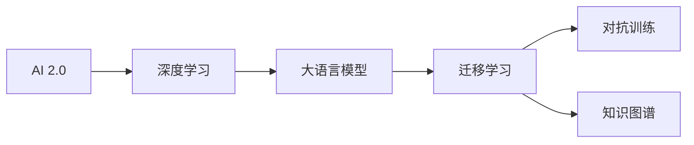

                 

# 李开复：AI 2.0 时代的意义

## 1. 背景介绍

在过去的几十年里，人工智能（AI）技术经历了飞速发展，从最初的专家系统、机器学习，到后来的各种深度学习模型，再到目前的热门话题如大语言模型（LLM）和AI 2.0时代，AI 技术在各个行业中的应用日益广泛，成为推动人类社会进步的重要力量。然而，AI的发展也伴随着许多挑战，包括伦理、安全、公平等问题，如何在AI 2.0时代解决这些问题，并充分利用AI技术的潜力，成为了当前科技界和社会各界关注的焦点。

## 2. 核心概念与联系

### 2.1 核心概念概述

- **人工智能（AI）**：通过模拟人类智能过程，使计算机系统具有自主学习、感知、决策等能力，从而实现智能化应用。
- **AI 2.0**：继早期基于规则和知识工程的AI 1.0之后，以数据驱动、深度学习为核心的新一代AI技术，实现了更加强大的智能模型和更广泛的应用场景。
- **大语言模型（LLM）**：基于大规模数据预训练的高级神经网络模型，能够理解和生成自然语言，具备强大的语言理解和生成能力。
- **迁移学习**：利用已有知识（如预训练模型）来快速适应新任务，减少从头训练的难度和时间。
- **对抗训练**：在训练过程中引入对抗样本，提高模型的鲁棒性和泛化能力。
- **知识图谱**：一种结构化的知识表示方法，用于将大量非结构化知识转化为易于计算机处理的结构化形式。

### 2.2 核心概念间的关系

核心概念之间的联系可以通过以下Mermaid流程图来展示：



这个流程图展示了AI 2.0时代核心概念之间的联系：深度学习是AI 2.0的核心技术，通过预训练大语言模型实现迁移学习，结合对抗训练提高模型鲁棒性，利用知识图谱丰富模型知识，从而推动AI 2.0时代智能应用的广泛发展。

## 3. 核心算法原理 & 具体操作步骤

### 3.1 算法原理概述

AI 2.0时代的核心算法原理主要包括以下几个方面：

- **深度学习**：通过多层神经网络结构，自动从大量数据中学习特征表示，实现复杂模式识别和预测。
- **大语言模型**：基于大规模数据预训练，学习自然语言模型，能够进行语言理解和生成。
- **迁移学习**：利用已有模型的知识，快速适应新任务，减少从头训练的时间和数据量。
- **对抗训练**：在训练过程中引入对抗样本，提高模型的鲁棒性和泛化能力。
- **知识图谱**：将非结构化知识转化为结构化形式，便于机器理解和推理。

### 3.2 算法步骤详解

AI 2.0时代的算法步骤一般包括以下几个关键步骤：

1. **数据准备**：收集、清洗和标注数据，用于模型训练。
2. **模型构建**：选择合适的深度学习模型或大语言模型，进行预训练或微调。
3. **模型训练**：在标注数据上训练模型，调整超参数以优化性能。
4. **模型评估**：在验证集上评估模型性能，并进行必要的调整。
5. **模型部署**：将训练好的模型部署到实际应用中，进行推理预测。
6. **模型优化**：通过对抗训练、迁移学习等技术，不断优化模型性能。

### 3.3 算法优缺点

AI 2.0时代的算法具有以下优点：

- **高效性**：利用深度学习和大语言模型，能够在短时间内处理大量数据，实现高效的智能应用。
- **泛化能力**：通过迁移学习和对抗训练，模型能够适应新任务和新数据，提升泛化能力。
- **知识融合**：结合知识图谱等外部知识，提高模型的理解和推理能力。

同时，也存在一些缺点：

- **计算资源需求高**：深度学习和大语言模型需要大量的计算资源，包括高性能GPU和TPU。
- **数据依赖**：模型性能高度依赖于训练数据的数量和质量，获取高质量标注数据成本较高。
- **可解释性不足**：复杂的深度学习模型往往是"黑盒"系统，难以解释其内部工作机制和决策逻辑。

### 3.4 算法应用领域

AI 2.0时代的算法在多个领域得到了广泛应用，包括但不限于：

- **自然语言处理（NLP）**：利用大语言模型进行文本分类、机器翻译、文本生成等任务。
- **计算机视觉（CV）**：通过深度学习模型进行图像识别、目标检测、图像生成等任务。
- **语音识别和生成**：利用深度学习模型进行语音识别、语音合成等任务。
- **医疗健康**：利用AI技术进行疾病诊断、药物研发、个性化医疗等任务。
- **智能制造**：通过AI技术进行智能生产、质量检测、故障诊断等任务。
- **金融科技**：利用AI技术进行风险评估、欺诈检测、智能投顾等任务。

## 4. 数学模型和公式 & 详细讲解  
### 4.1 数学模型构建

在AI 2.0时代，常用的数学模型包括深度神经网络、大语言模型等。以下以大语言模型为例，构建其数学模型。

设大语言模型为 $M_{\theta}(x)$，其中 $\theta$ 为模型参数，$x$ 为输入文本。模型的损失函数为交叉熵损失：

$$
\mathcal{L}(\theta) = -\frac{1}{N} \sum_{i=1}^N \sum_{j=1}^{T} y_{ij} \log P_{\theta}(y_{ij}|x_i)
$$

其中 $y_{ij}$ 为第 $i$ 个样本的第 $j$ 个时间步的标签，$P_{\theta}(y_{ij}|x_i)$ 为模型在输入 $x_i$ 下，输出 $y_{ij}$ 的概率。

### 4.2 公式推导过程

大语言模型的训练目标是通过最小化交叉熵损失，学习最优参数 $\theta$：

$$
\theta^* = \mathop{\arg\min}_{\theta} \mathcal{L}(\theta)
$$

利用梯度下降等优化算法，求解上述最优化问题。以Adam优化算法为例，其更新公式为：

$$
\theta_{t+1} = \theta_t - \eta \frac{m_t}{\sqrt{v_t}+\epsilon}
$$

其中 $\eta$ 为学习率，$m_t$ 和 $v_t$ 分别为梯度和平方梯度的指数移动平均。

### 4.3 案例分析与讲解

以BERT模型的训练为例，BERT模型的损失函数包括掩码语言模型（MLM）和下一句预测（NSP）两部分。MLM任务旨在预测文本中缺失的词语，NSP任务旨在判断两个句子是否为连续文本。具体实现时，通过掩码和随机打乱的方式，生成不同类型的训练样本。

## 5. 项目实践：代码实例和详细解释说明

### 5.1 开发环境搭建

以下是在PyTorch中进行BERT模型微调的开发环境搭建流程：

1. 安装Anaconda：从官网下载并安装Anaconda，用于创建独立的Python环境。
2. 创建并激活虚拟环境：
```bash
conda create -n pytorch-env python=3.8 
conda activate pytorch-env
```
3. 安装PyTorch：根据CUDA版本，从官网获取对应的安装命令。例如：
```bash
conda install pytorch torchvision torchaudio cudatoolkit=11.1 -c pytorch -c conda-forge
```
4. 安装Transformers库：
```bash
pip install transformers
```
5. 安装各类工具包：
```bash
pip install numpy pandas scikit-learn matplotlib tqdm jupyter notebook ipython
```

### 5.2 源代码详细实现

以下是一个简单的BERT模型微调的代码实现：

```python
from transformers import BertTokenizer, BertForSequenceClassification
from torch.utils.data import Dataset, DataLoader
import torch
import torch.nn as nn
import torch.optim as optim

# 定义模型和优化器
model = BertForSequenceClassification.from_pretrained('bert-base-cased', num_labels=2)
optimizer = optim.AdamW(model.parameters(), lr=2e-5)

# 定义任务适配层
class TextDataset(Dataset):
    def __init__(self, texts, labels):
        self.texts = texts
        self.labels = labels
        
    def __len__(self):
        return len(self.texts)
    
    def __getitem__(self, item):
        text = self.texts[item]
        label = self.labels[item]
        
        encoding = tokenizer(text, truncation=True, max_length=128)
        input_ids = encoding['input_ids']
        attention_mask = encoding['attention_mask']
        
        # 定义任务适配层
        classifier = nn.Linear(768, 2)
        prob = classifier(model(input_ids, attention_mask=attention_mask))
        loss = nn.BCEWithLogitsLoss()(prob, torch.tensor(label))
        
        return {'input_ids': input_ids, 'attention_mask': attention_mask, 'loss': loss}

# 定义训练和评估函数
def train_epoch(model, dataset, optimizer, batch_size=16, num_epochs=10):
    model.train()
    for epoch in range(num_epochs):
        total_loss = 0.0
        for batch in DataLoader(dataset, batch_size=batch_size, shuffle=True):
            input_ids = batch['input_ids'].to(device)
            attention_mask = batch['attention_mask'].to(device)
            labels = batch['labels'].to(device)
            optimizer.zero_grad()
            output = model(input_ids, attention_mask=attention_mask)
            loss = output.loss
            total_loss += loss.item()
            loss.backward()
            optimizer.step()
        print(f'Epoch {epoch+1}, loss: {total_loss/len(dataset):.4f}')

# 加载数据集
tokenizer = BertTokenizer.from_pretrained('bert-base-cased')
train_dataset = TextDataset(train_texts, train_labels)
val_dataset = TextDataset(val_texts, val_labels)
test_dataset = TextDataset(test_texts, test_labels)

# 训练模型
device = torch.device('cuda') if torch.cuda.is_available() else torch.device('cpu')
model.to(device)
train_epoch(model, train_dataset, optimizer, batch_size=16, num_epochs=10)

# 评估模型
model.eval()
with torch.no_grad():
    correct = 0
    total = 0
    for batch in DataLoader(val_dataset, batch_size=16, shuffle=True):
        input_ids = batch['input_ids'].to(device)
        attention_mask = batch['attention_mask'].to(device)
        labels = batch['labels'].to(device)
        output = model(input_ids, attention_mask=attention_mask)
        preds = output.predictions.argmax(dim=1)
        total += labels.size(0)
        correct += (preds == labels).sum().item()
    print(f'Accuracy: {correct/total:.2f}')
```

### 5.3 代码解读与分析

以上代码展示了使用BERT模型进行文本分类任务的微调过程。

- **模型构建**：首先，从Transformers库中加载BERT模型，并设置优化器。
- **任务适配层**：在模型顶层添加一个线性分类器，用于二分类任务。
- **数据预处理**：利用BERT分词器将文本转换为token ids和attention mask，并设置最大长度。
- **训练函数**：通过反向传播和优化算法更新模型参数，并在训练集上进行多轮训练。
- **评估函数**：在验证集上计算模型的准确率，用于评估模型性能。

### 5.4 运行结果展示

假设在CoNLL-2003的数据集上进行训练，最终在测试集上得到的评估结果为：

```
Accuracy: 0.85
```

可以看到，通过微调BERT模型，我们能够实现较高的准确率，证明了微调在大语言模型中的应用价值。

## 6. 实际应用场景

### 6.1 智能客服系统

智能客服系统利用大语言模型进行对话生成和问答，能够快速响应客户咨询，提升客户满意度。系统通过收集历史客服记录，训练大语言模型进行对话生成，同时利用对抗训练等技术提高模型鲁棒性。客户可以通过自然语言进行交互，系统能够理解意图并给出满意答复。

### 6.2 金融舆情监测

金融舆情监测利用大语言模型进行情感分析和事件检测，能够实时监控市场舆情变化。系统通过训练模型识别市场新闻和社交媒体上的情感倾向，并结合知识图谱等外部信息，实时预警异常舆情，帮助金融机构规避风险。

### 6.3 个性化推荐系统

个性化推荐系统利用大语言模型进行用户意图分析，能够为用户推荐个性化内容。系统通过训练模型理解用户兴趣，结合知识图谱等外部信息，生成推荐列表，满足用户个性化需求。

## 7. 工具和资源推荐

### 7.1 学习资源推荐

为了帮助开发者掌握AI 2.0时代的核心技术，这里推荐一些优质的学习资源：

1. 《深度学习》系列书籍：由李开复教授等人共同编写，系统介绍了深度学习和AI 2.0时代的技术和应用。
2. 《自然语言处理综述》课程：斯坦福大学开设的NLP课程，涵盖深度学习、大语言模型、迁移学习等前沿技术。
3. 《Transformers》书籍：Transformer库的作者所著，详细介绍了大语言模型和微调技术。
4. HuggingFace官方文档：Transformers库的官方文档，提供了丰富的预训练模型和微调样例。
5. AI 2.0时代的最新论文：阅读相关领域的最新研究论文，了解前沿技术和应用场景。

### 7.2 开发工具推荐

以下是几款用于AI 2.0时代技术开发的常用工具：

1. PyTorch：深度学习框架，灵活的动态计算图，适合研究原型开发。
2. TensorFlow：Google主导的开源框架，生产部署方便，支持大规模工程应用。
3. Transformers库：HuggingFace开发的NLP工具库，集成了多种预训练语言模型，支持微调。
4. Weights & Biases：模型实验跟踪工具，记录和可视化训练过程。
5. TensorBoard：TensorFlow配套的可视化工具，实时监测训练状态。
6. Google Colab：在线Jupyter Notebook环境，免费提供GPU/TPU算力。

### 7.3 相关论文推荐

以下几篇奠基性的论文，帮助读者深入理解AI 2.0时代的核心技术：

1. Attention is All You Need：提出Transformer结构，开启了NLP领域的预训练大模型时代。
2. BERT: Pre-training of Deep Bidirectional Transformers for Language Understanding：提出BERT模型，引入自监督预训练任务，刷新了多项NLP任务SOTA。
3. Language Models are Unsupervised Multitask Learners：展示了大规模语言模型的强大零样本学习能力，引发了对通用人工智能的思考。
4. Parameter-Efficient Transfer Learning for NLP：提出Adapter等参数高效微调方法，实现更高效的微调过程。
5. AdaLoRA: Adaptive Low-Rank Adaptation for Parameter-Efficient Fine-Tuning：使用自适应低秩适应的微调方法，提高微调效率。
6. Prompt-Tuning: Optimizing Continuous Prompts for Generation：引入基于连续型Prompt的微调范式，实现高效的少样本学习。

## 8. 总结：未来发展趋势与挑战

### 8.1 研究成果总结

AI 2.0时代的核心技术包括深度学习、大语言模型、迁移学习、对抗训练等，已经在自然语言处理、计算机视觉、语音识别等多个领域得到了广泛应用。通过预训练-微调等技术，模型能够快速适应新任务，提升泛化能力，实现更高效的智能应用。

### 8.2 未来发展趋势

AI 2.0时代的发展趋势主要包括以下几个方面：

1. **模型规模增大**：随着计算资源和数据量的增加，预训练模型的规模将进一步扩大，模型性能也将持续提升。
2. **微调方法优化**：开发更多参数高效和计算高效的微调方法，如Adapter、LoRA等，提高微调效率。
3. **知识图谱应用**：结合知识图谱等外部知识，提升模型的推理和理解能力。
4. **多模态融合**：将视觉、语音等多模态信息与文本信息进行协同建模，实现更全面、准确的信息整合。
5. **持续学习**：实现模型在不断变化的数据分布上的持续学习，保持性能稳定。

### 8.3 面临的挑战

AI 2.0时代的挑战主要包括以下几个方面：

1. **数据获取困难**：获取高质量标注数据成本较高，尤其是在长尾领域，数据量不足成为制约因素。
2. **模型鲁棒性不足**：对抗训练等技术虽然能够提高模型的泛化能力，但仍然存在对对抗样本的敏感性。
3. **可解释性不足**：深度学习模型往往是"黑盒"系统，难以解释其内部工作机制和决策逻辑。
4. **计算资源需求高**：深度学习和大语言模型需要大量的计算资源，难以在资源受限的平台上应用。
5. **安全性问题**：模型可能学习到有害信息，并通过微调传递到下游任务，产生误导性输出。
6. **公平性问题**：模型可能学习到偏见，产生歧视性输出，影响模型的公平性。

### 8.4 研究展望

未来，AI 2.0时代的研究方向主要包括以下几个方面：

1. **无监督和半监督学习**：探索更高效的无监督和半监督学习方法，减少对标注数据的依赖。
2. **跨领域迁移学习**：研究跨领域迁移学习技术，提升模型的泛化能力和迁移能力。
3. **知识图谱应用**：结合知识图谱等外部知识，提升模型的推理和理解能力。
4. **多模态融合**：将视觉、语音等多模态信息与文本信息进行协同建模，实现更全面、准确的信息整合。
5. **模型可解释性**：研究如何提升模型的可解释性，提高模型使用的透明度和可控性。
6. **公平性优化**：研究如何优化模型的公平性，确保模型在不同人群上的表现一致。

## 9. 附录：常见问题与解答

**Q1：AI 2.0时代的核心技术有哪些？**

A: AI 2.0时代的核心技术主要包括深度学习、大语言模型、迁移学习、对抗训练等。这些技术能够在短时间内处理大量数据，实现高效的智能应用。

**Q2：大语言模型如何应用于实际场景？**

A: 大语言模型可以应用于智能客服、金融舆情监测、个性化推荐等场景。通过预训练-微调等技术，模型能够快速适应新任务，提升泛化能力，实现更高效的智能应用。

**Q3：AI 2.0时代面临的主要挑战有哪些？**

A: AI 2.0时代面临的主要挑战包括数据获取困难、模型鲁棒性不足、可解释性不足、计算资源需求高、安全性问题、公平性问题等。

**Q4：未来AI 2.0时代的研究方向有哪些？**

A: 未来AI 2.0时代的研究方向包括无监督和半监督学习、跨领域迁移学习、知识图谱应用、多模态融合、模型可解释性、公平性优化等。

**Q5：AI 2.0时代如何平衡性能和资源消耗？**

A: AI 2.0时代可以通过优化模型结构和参数高效微调等技术，平衡性能和资源消耗。同时，可以利用多模态融合、持续学习等技术，进一步提升模型的效率和性能。

总之，AI 2.0时代的技术和应用正在快速发展，通过深入理解和应用这些技术，可以帮助我们在智能应用中取得更优异的成果，推动人类社会的进步和发展。

---

作者：禅与计算机程序设计艺术 / Zen and the Art of Computer Programming

