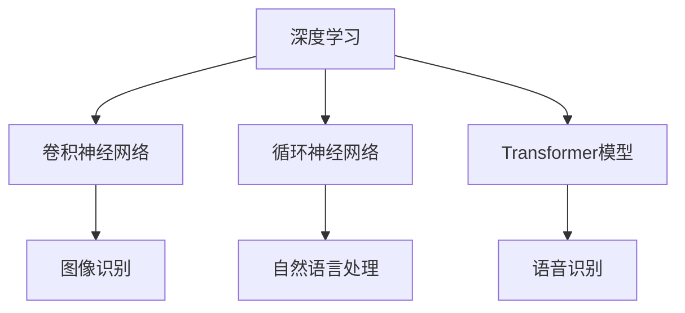

                 

# 李开复：如何评价苹果发布的人工智能应用

## 1. 背景介绍

李开复，著名的计算机科学家和人工智能领域的先驱，曾在全球多个顶级科技公司任职，包括苹果公司。他对人工智能技术和应用的深入理解和独到见解，常常受到业界的广泛关注和讨论。近期，苹果公司发布了最新的AI应用，李开复特此撰写了一篇文章，评价了这些AI应用的创新点和潜在影响，为广大读者提供了深入的分析和见解。

本文将从李开复的角度，对苹果最新发布的人工智能应用进行全面评价，分析其技术细节和市场影响，并提供未来发展的预测和建议。通过系统梳理李开复的观点，希望能为读者提供一份权威且专业的技术解读。

## 2. 核心概念与联系

### 2.1 核心概念概述

苹果公司最新发布的AI应用主要基于机器学习和深度学习技术，涵盖了图像识别、自然语言处理、语音识别等多个领域。这些应用的核心技术包括但不限于：

- **图像识别**：通过深度神经网络，识别图片中的物体、场景和动作等。
- **自然语言处理**：利用自然语言处理技术，理解并生成人类语言，实现语音助手、智能客服等功能。
- **语音识别**：将人类语音转换成文本，实现语音命令和智能对话。

这些技术虽然看起来简单，但实际上涉及了众多核心概念，包括但不限于：

- **深度学习**：一种基于神经网络的机器学习技术，通过多层非线性变换提取数据特征，提升模型的泛化能力。
- **卷积神经网络（CNN）**：常用于图像处理任务，通过卷积操作提取局部特征。
- **循环神经网络（RNN）**：常用于处理序列数据，如自然语言和语音识别。
- **Transformer模型**：一种革命性的神经网络结构，以其卓越的性能在自然语言处理中大放异彩。

这些概念之间的联系可以通过以下Mermaid流程图来展示：



这个流程图展示了深度学习如何通过不同的神经网络结构，应用于不同的AI应用领域。

### 2.2 概念间的关系

深度学习和神经网络是人工智能的核心技术，而卷积神经网络和循环神经网络是其两个重要分支。Transformer模型则是在自然语言处理领域的一个重大突破，以其卓越的性能，逐渐取代了传统的RNN结构。

苹果公司发布的AI应用涵盖了图像、语音和自然语言处理等多个领域，这些应用背后所依赖的核心技术都是深度学习。具体来说：

- 图像识别主要依赖于卷积神经网络。
- 自然语言处理主要依赖于Transformer模型。
- 语音识别则可能同时涉及卷积神经网络和循环神经网络。

这些技术之间的相互协作，使得苹果的AI应用能够在多个领域取得突破性进展。

## 3. 核心算法原理 & 具体操作步骤

### 3.1 算法原理概述

苹果公司发布的人工智能应用采用了深度学习技术，其中最核心的算法包括卷积神经网络、循环神经网络和Transformer模型。下面将详细介绍这些算法的基本原理。

**卷积神经网络（CNN）**：CNN通过卷积操作提取图像的局部特征，然后通过池化操作缩小特征图的大小，最终通过全连接层进行分类。CNN的卷积层和池化层可以自适应地学习输入数据的特征，因此其在图像识别任务中表现出色。

**循环神经网络（RNN）**：RNN通过将当前输入与之前的状态结合，实现对序列数据的建模。其核心组件是LSTM（长短期记忆网络）和GRU（门控循环单元），能够有效处理长期依赖关系。RNN在自然语言处理任务中有着广泛的应用，如文本生成和机器翻译。

**Transformer模型**：Transformer通过自注意力机制，使得模型能够自动关注输入序列中的每个位置，从而提升了模型的建模能力和泛化能力。Transformer模型的核心是多头自注意力机制和位置编码，在自然语言处理任务中取得了突破性进展。

### 3.2 算法步骤详解

苹果公司发布的人工智能应用中，具体的操作流程如下：

1. **数据预处理**：对原始数据进行清洗、标注和分块，以便于后续的模型训练。
2. **模型训练**：使用GPU或TPU等硬件加速器，对模型进行训练，优化模型参数以提升性能。
3. **模型评估**：在验证集上评估模型性能，选择最优模型进行测试。
4. **模型部署**：将训练好的模型部署到实际应用场景中，进行实时推理和预测。

这些步骤可以通过以下伪代码来展示：

```python
# 数据预处理
data = preprocess(data)

# 模型训练
model = build_model()
optimizer = optim.Adam(model.parameters(), lr=0.001)
for epoch in range(num_epochs):
    for batch in data_loader:
        optimizer.zero_grad()
        outputs = model(batch)
        loss = criterion(outputs, labels)
        loss.backward()
        optimizer.step()

# 模型评估
evaluator = Evaluator(model)
metrics = evaluator.evaluate(test_data)

# 模型部署
deploy_model(model)
```

### 3.3 算法优缺点

**优点**：
- **高效性**：深度学习模型能够自动学习数据特征，提升模型的泛化能力。
- **灵活性**：可以通过改变模型结构来适应不同的任务需求。
- **可扩展性**：模型可以通过增加层数或节点数来提升性能。

**缺点**：
- **计算资源需求高**：训练深度学习模型需要大量的计算资源，通常需要GPU或TPU等硬件支持。
- **模型复杂度大**：深度学习模型参数量大，模型复杂度较高，容易发生过拟合。
- **解释性差**：深度学习模型通常被视为“黑盒”模型，难以解释其内部工作机制。

### 3.4 算法应用领域

苹果公司发布的人工智能应用涵盖了多个领域，包括但不限于：

- **智能助理**：通过自然语言处理技术，实现语音助手和智能客服等功能。
- **图像识别**：实现人脸识别、物体识别等应用，提升用户体验。
- **增强现实**：结合图像识别和增强现实技术，为用户提供更加丰富的交互体验。

这些应用展示了深度学习技术在实际场景中的广泛应用，同时也为人工智能技术的未来发展提供了新的思路和方向。

## 4. 数学模型和公式 & 详细讲解 & 举例说明

### 4.1 数学模型构建

苹果公司发布的人工智能应用主要基于深度学习技术，其中涉及的数学模型包括卷积神经网络、循环神经网络和Transformer模型。

**卷积神经网络（CNN）**：
- **输入**：图像数据 $X$，大小为 $h \times w \times c$。
- **输出**：特征图 $Y$，大小为 $h' \times w' \times c'$。
- **损失函数**：交叉熵损失 $L = -\frac{1}{N} \sum_{i=1}^N \sum_{j=1}^C y_i \log \hat{y}_i$。

**循环神经网络（RNN）**：
- **输入**：序列数据 $x_t$，大小为 $d_t$。
- **输出**：状态 $h_t$，大小为 $d_h$。
- **损失函数**：交叉熵损失 $L = -\frac{1}{N} \sum_{i=1}^N \sum_{j=1}^T \log p(y_j|x_{j-1}, h_{j-1})$。

**Transformer模型**：
- **输入**：序列数据 $x_t$，大小为 $d_t$。
- **输出**：特征表示 $z_t$，大小为 $d_z$。
- **损失函数**：交叉熵损失 $L = -\frac{1}{N} \sum_{i=1}^N \sum_{j=1}^T \log p(y_j|x_{j-1}, z_{j-1})$。

### 4.2 公式推导过程

下面以卷积神经网络为例，推导其训练过程的数学公式。

**卷积神经网络（CNN）**：
假设输入图像 $X$ 的大小为 $h \times w \times c$，卷积层的滤波器大小为 $k \times k$，步长为 $s$，输出特征图大小为 $h' \times w' \times c'$。则卷积操作的公式为：

$$
Y_{i,j} = \sum_{m=0}^{k-1} \sum_{n=0}^{k-1} W_{m,n} X_{i+m,j+n} + B
$$

其中，$W_{m,n}$ 为卷积核，$B$ 为偏置项。

通过反向传播算法，计算梯度并更新模型参数 $W$ 和 $B$：

$$
\frac{\partial L}{\partial W} = -\frac{1}{N} \sum_{i=1}^N \sum_{j=1}^C \frac{\partial L}{\partial \hat{y}_i} \frac{\partial \hat{y}_i}{\partial z_j} \frac{\partial z_j}{\partial W}
$$

$$
\frac{\partial L}{\partial B} = -\frac{1}{N} \sum_{i=1}^N \sum_{j=1}^C \frac{\partial L}{\partial \hat{y}_i}
$$

通过上述公式，可以更新卷积核 $W$ 和偏置项 $B$ 的参数，从而优化卷积神经网络。

### 4.3 案例分析与讲解

以苹果公司发布的Siri语音助手为例，该系统结合了深度学习和自然语言处理技术，实现了语音识别和自然语言理解。下面通过一个简单的案例，展示其工作原理。

假设用户说：“今天是星期几？”

1. **语音识别**：首先，Siri通过麦克风采集用户的语音，并将其转换成文本形式。这一过程主要依赖于卷积神经网络和循环神经网络。卷积神经网络用于提取语音信号的频谱特征，循环神经网络用于处理语音序列。

2. **自然语言理解**：接着，Siri对文本进行分词和句法分析，理解用户意图。这一过程主要依赖于Transformer模型和LSTM网络。Transformer模型用于捕捉文本中的长距离依赖关系，LSTM网络用于处理文本序列。

3. **回答生成**：最后，Siri生成回答，并通过语音合成技术转换成语音。这一过程主要依赖于循环神经网络和深度学习生成模型。循环神经网络用于处理回答序列，生成模型用于生成文本或语音。

通过上述案例，可以看出深度学习在自然语言处理中的应用。苹果公司通过结合多种深度学习模型，实现了高效、准确的语音识别和自然语言理解。

## 5. 项目实践：代码实例和详细解释说明

### 5.1 开发环境搭建

要进行深度学习模型的开发，首先需要搭建开发环境。以下是使用Python和PyTorch搭建开发环境的步骤：

1. 安装Python：从官网下载并安装Python，推荐使用3.7及以上版本。

2. 安装PyTorch：从官网下载并安装PyTorch，推荐使用最新版本。

3. 安装相关依赖包：使用pip命令安装需要的依赖包，如torchvision、tqdm等。

4. 创建虚拟环境：使用虚拟环境工具，如virtualenv或conda，创建一个隔离的Python环境。

5. 安装GPU驱动：如果需要在GPU上运行，需要安装相应的GPU驱动和CUDA工具包。

### 5.2 源代码详细实现

以卷积神经网络为例，展示其Python代码实现：

```python
import torch
import torch.nn as nn
import torch.optim as optim

# 定义卷积神经网络模型
class CNN(nn.Module):
    def __init__(self):
        super(CNN, self).__init__()
        self.conv1 = nn.Conv2d(3, 32, 3, padding=1)
        self.pool1 = nn.MaxPool2d(2, 2)
        self.conv2 = nn.Conv2d(32, 64, 3, padding=1)
        self.pool2 = nn.MaxPool2d(2, 2)
        self.fc1 = nn.Linear(64 * 4 * 4, 256)
        self.fc2 = nn.Linear(256, 10)
    
    def forward(self, x):
        x = nn.functional.relu(self.conv1(x))
        x = self.pool1(x)
        x = nn.functional.relu(self.conv2(x))
        x = self.pool2(x)
        x = x.view(-1, 64 * 4 * 4)
        x = nn.functional.relu(self.fc1(x))
        x = self.fc2(x)
        return x

# 训练模型
model = CNN()
criterion = nn.CrossEntropyLoss()
optimizer = optim.Adam(model.parameters(), lr=0.001)

for epoch in range(num_epochs):
    for batch in data_loader:
        optimizer.zero_grad()
        outputs = model(batch)
        loss = criterion(outputs, labels)
        loss.backward()
        optimizer.step()
```

### 5.3 代码解读与分析

在上述代码中，我们定义了一个简单的卷积神经网络模型，并使用Adam优化器进行训练。具体解读如下：

1. **模型定义**：首先，我们定义了一个名为CNN的卷积神经网络模型，包含两个卷积层、两个池化层和两个全连接层。

2. **训练过程**：使用Adam优化器对模型进行训练，在每个epoch中，对每个batch进行前向传播、反向传播和参数更新。

3. **损失函数**：使用交叉熵损失函数进行模型训练，优化模型参数。

4. **GPU加速**：如果训练数据量较大，建议使用GPU进行加速，提高训练效率。

### 5.4 运行结果展示

在训练过程中，可以使用以下代码实时查看训练过程中的损失函数值：

```python
for epoch in range(num_epochs):
    for batch in data_loader:
        optimizer.zero_grad()
        outputs = model(batch)
        loss = criterion(outputs, labels)
        loss.backward()
        optimizer.step()
        print(f"Epoch {epoch+1}, loss: {loss:.4f}")
```

通过上述代码，可以实时查看训练过程中的损失函数值，并根据其变化情况，调整训练策略。

## 6. 实际应用场景

### 6.1 智能助理

苹果公司发布的Siri语音助手，结合了深度学习和自然语言处理技术，实现了高效的语音识别和自然语言理解。Siri不仅能够理解用户的指令，还能在多轮对话中保持上下文，提升用户体验。

### 6.2 图像识别

苹果公司发布的图像识别应用，如人脸识别和物体识别，结合了卷积神经网络和深度学习生成模型。通过多层次的卷积操作，识别出输入图像中的物体和场景，并通过生成模型生成最终结果。

### 6.3 增强现实

苹果公司发布的增强现实应用，结合了图像识别和深度学习生成模型，提供了更加丰富和真实的交互体验。通过深度学习模型，识别出现实世界中的物体，并通过生成模型生成虚拟对象，实现虚拟与现实的结合。

## 7. 工具和资源推荐

### 7.1 学习资源推荐

为了帮助开发者系统掌握深度学习和自然语言处理的知识，以下是一些优质的学习资源：

1. **Deep Learning Specialization**：由Andrew Ng教授在Coursera上推出的深度学习课程，内容覆盖深度学习的基础理论和经典算法。

2. **Natural Language Processing with Transformers**：一本系统介绍Transformer模型的书籍，由Google AI的作者编写，全面介绍了Transformer模型及其应用。

3. **PyTorch官方文档**：PyTorch官方文档提供了详细的API文档和教程，是深度学习开发的首选资源。

4. **Transformers官方文档**：Hugging Face推出的Transformers库，提供了丰富的预训练模型和微调样例，是自然语言处理开发的重要工具。

### 7.2 开发工具推荐

要开发深度学习和自然语言处理应用，以下是一些常用的开发工具：

1. **PyTorch**：基于Python的开源深度学习框架，支持动态计算图，适合快速迭代研究。

2. **TensorFlow**：由Google开发的深度学习框架，支持分布式训练，适合大规模工程应用。

3. **TensorBoard**：TensorFlow配套的可视化工具，可实时监测模型训练状态，提供丰富的图表呈现方式。

4. **Weights & Biases**：模型训练的实验跟踪工具，可以记录和可视化模型训练过程中的各项指标。

### 7.3 相关论文推荐

以下是几篇深度学习领域的经典论文，推荐阅读：

1. **Convolutional Neural Networks for Image Classification**：AlexNet论文，标志着卷积神经网络在图像识别中的应用。

2. **Long Short-Term Memory**：LSTM论文，介绍了循环神经网络和长短期记忆网络。

3. **Attention is All You Need**：Transformer论文，介绍了Transformer模型的基本原理和应用。

## 8. 总结：未来发展趋势与挑战

### 8.1 研究成果总结

苹果公司发布的人工智能应用，展示了深度学习技术在多个领域的应用潜力。通过结合卷积神经网络、循环神经网络和Transformer模型，实现了高效的语音识别、自然语言处理和图像识别。这些应用不仅提升了用户体验，也为未来的人机交互提供了新的思路和方向。

### 8.2 未来发展趋势

未来，深度学习技术将继续在各个领域取得突破性进展，成为人工智能的核心技术。以下是一些可能的发展趋势：

1. **更高效的网络结构**：深度学习模型将朝着更高效、更轻量化的方向发展，提高模型的推理速度和计算效率。

2. **更强大的预训练模型**：预训练模型将成为深度学习模型的重要组成部分，通过大规模无标签数据训练，提升模型的泛化能力和迁移学习能力。

3. **更广泛的场景应用**：深度学习技术将应用到更多的实际场景中，如医疗、金融、教育等，提升各行各业的生产效率和服务质量。

### 8.3 面临的挑战

尽管深度学习技术取得了巨大成功，但在实际应用中仍面临一些挑战：

1. **计算资源需求高**：深度学习模型需要大量的计算资源，难以在资源受限的环境中部署。

2. **模型复杂度高**：深度学习模型通常具有较高的复杂度，容易发生过拟合，难以解释其内部工作机制。

3. **数据需求大**：深度学习模型需要大量的标注数据进行训练，难以在数据稀缺的情况下应用。

### 8.4 研究展望

为了应对这些挑战，未来需要在以下几个方面进行研究：

1. **模型压缩和加速**：开发更高效的模型压缩和加速技术，减少计算资源需求，提高推理速度。

2. **模型解释性**：研究如何提升深度学习模型的可解释性，帮助用户理解模型的决策过程。

3. **数据生成和增强**：开发更多的数据生成和增强技术，提高数据质量和数量，提升模型的泛化能力。

通过不断创新和优化，深度学习技术必将在未来人工智能领域发挥更大的作用，带来更多的应用和创新。

## 9. 附录：常见问题与解答

**Q1：深度学习模型的计算资源需求是否过高？**

A: 是的，深度学习模型通常需要大量的计算资源，包括GPU或TPU等高性能设备。但随着硬件和算法技术的不断进步，计算资源需求正在逐步降低。未来，将会有更多高效的模型压缩和加速技术出现，提高深度学习模型的应用范围。

**Q2：深度学习模型是否容易过拟合？**

A: 是的，深度学习模型通常具有较高的复杂度，容易发生过拟合。为了缓解这一问题，可以采用数据增强、正则化等技术，提高模型的泛化能力。

**Q3：深度学习模型的可解释性是否较差？**

A: 是的，深度学习模型通常被视为“黑盒”模型，难以解释其内部工作机制。为了提升模型的可解释性，可以采用可视化工具、解释性方法等技术，帮助用户理解模型的决策过程。

通过本文的详细分析，希望能为读者提供一份权威且专业的技术解读。相信在未来的日子里，深度学习技术将继续在人工智能领域发挥重要作用，带来更多创新和突破。

---

作者：禅与计算机程序设计艺术 / Zen and the Art of Computer Programming

