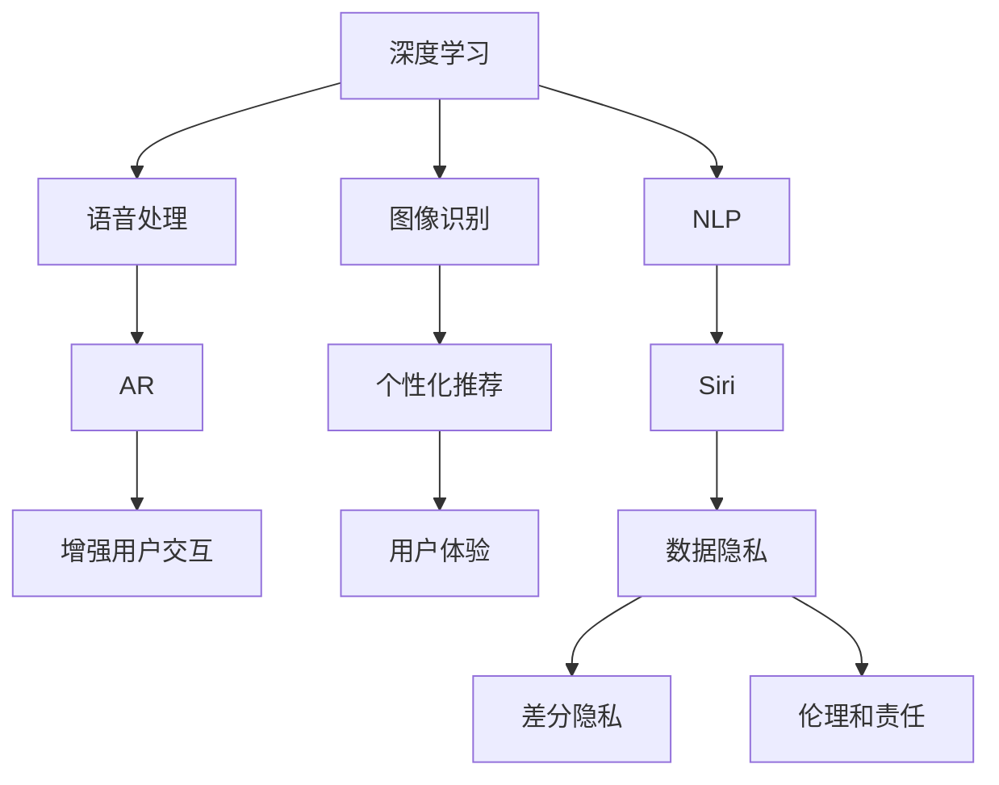

                 

# 李开复：苹果发布AI应用的趋势

## 1. 背景介绍

### 1.1 问题由来
李开复，作为全球知名的AI专家和创新领袖，一直以来对AI技术的发展有着独到的见解。随着苹果公司近年来不断加大对AI技术的投资和应用，李开复对苹果发布AI应用的趋势发表了一系列深入分析和思考。本文将从多个角度探讨苹果在AI技术领域的最新动向，以及未来可能的趋势和影响。

### 1.2 问题核心关键点
苹果公司在大规模投资AI技术后，已经在多个产品和服务中广泛应用AI技术，包括但不限于人脸识别、语音助手、图像识别、个性化推荐等。然而，AI技术的快速发展和广泛应用也引发了关于伦理、隐私和安全等诸多争议。李开复认为，苹果公司需要在AI技术的应用中取得平衡，既要充分发挥AI的优势，又要严格遵守隐私和伦理规范。

### 1.3 问题研究意义
研究苹果发布AI应用的趋势，对于了解AI技术在消费电子产品中的应用前景，以及其对社会和技术的影响具有重要意义。通过分析苹果公司的AI策略和应用案例，可以为其他科技公司提供借鉴和启示，同时也为AI技术在各领域的普及和发展提供新的视角。

## 2. 核心概念与联系

### 2.1 核心概念概述

李开复提出，苹果公司对于AI技术的运用可以总结为以下几个关键概念：

- **深度学习（Deep Learning）**：苹果公司在图像识别、语音处理、自然语言处理等领域广泛应用深度学习技术，使得AI在产品中变得更加智能和个性化。

- **增强现实（Augmented Reality, AR）**：通过AR技术，苹果将AI技术引入用户交互界面，增强用户体验。

- **自然语言处理（Natural Language Processing, NLP）**：苹果在Siri等语音助手中应用NLP技术，实现更加智能的语音识别和理解。

- **个性化推荐**：苹果通过数据分析和机器学习技术，为用户推荐个性化内容和服务。

- **数据隐私**：苹果在AI应用中注重数据隐私保护，使用差分隐私等技术手段，防止用户信息被滥用。

- **伦理和责任**：苹果强调AI技术的伦理和责任，致力于防止AI滥用和偏见。

这些概念之间相互联系，共同构成了苹果AI应用的整体架构。

### 2.2 概念间的关系

这些核心概念之间的关系可以通过以下Mermaid流程图来展示：



这个流程图展示了深度学习在苹果AI应用中的基础地位，以及与其他概念之间的紧密联系。深度学习为苹果提供了强大的技术支持，而AR和NLP技术则进一步丰富了用户体验。个性化推荐和增强用户交互，使得AI应用更加人性化。数据隐私和伦理责任，则是确保AI应用可持续发展的关键因素。

## 3. 核心算法原理 & 具体操作步骤

### 3.1 算法原理概述

苹果公司在大规模应用AI技术时，主要依赖于以下几个算法原理：

- **卷积神经网络（Convolutional Neural Networks, CNN）**：用于图像识别和分类任务，通过卷积层和池化层提取图像特征，实现高精度的图像分类和识别。

- **循环神经网络（Recurrent Neural Networks, RNN）和长短时记忆网络（Long Short-Term Memory, LSTM）**：用于自然语言处理任务，如语音识别和机器翻译，通过循环层捕捉时间序列上的语言特征，提高模型的语言理解能力。

- **生成对抗网络（Generative Adversarial Networks, GANs）**：用于生成逼真的图像和视频内容，如苹果的Face ID面部识别系统，通过GAN生成高质量的人脸图像，提高识别的准确率。

### 3.2 算法步骤详解

苹果公司发布AI应用的具体步骤可以分为以下几个阶段：

1. **数据收集与标注**：苹果从其生态系统（如iPhone、iPad、Apple Watch等设备）中收集大量数据，并通过人工标注或半自动标注的方式，获得高质量的训练数据。

2. **模型构建与训练**：苹果使用自研的机器学习框架和深度学习库，如Core ML和Create ML，构建和训练AI模型。

3. **模型优化与调优**：通过微调、迁移学习和正则化等技术手段，优化模型的性能和鲁棒性。

4. **模型部署与应用**：将训练好的模型集成到产品中，如Siri、Face ID、ARKit等，提供给用户使用。

5. **用户反馈与迭代**：收集用户反馈，持续改进模型性能，进行产品迭代和优化。

### 3.3 算法优缺点

苹果公司在应用AI技术时，主要面临以下优缺点：

**优点**：

- **用户体验优化**：通过深度学习和自然语言处理技术，苹果能够提供更加个性化和智能化的用户体验。
- **数据隐私保护**：苹果在AI应用中注重数据隐私保护，使用差分隐私等技术手段，防止用户信息被滥用。
- **伦理和责任**：苹果强调AI技术的伦理和责任，致力于防止AI滥用和偏见。

**缺点**：

- **技术复杂性**：深度学习和自然语言处理等技术复杂，需要大量的计算资源和时间进行模型训练和优化。
- **数据偏见**：苹果收集的数据主要来自其生态系统，可能存在数据偏见，影响模型的公平性和泛化能力。
- **隐私争议**：尽管苹果在数据隐私保护方面做了很多努力，但仍有一些用户对其隐私保护措施表示担忧。

### 3.4 算法应用领域

苹果公司在其广泛的产品和服务中应用了AI技术，主要集中在以下几个领域：

- **硬件**：如iPhone、iPad、Apple Watch等设备中，应用了人脸识别、语音助手等AI技术，提升用户体验。
- **软件**：Siri等语音助手，通过自然语言处理技术，实现智能语音识别和理解。
- **服务**：如Apple Pay、Apple Music等，通过个性化推荐技术，提升用户粘性和满意度。
- **增强现实**：ARKit等增强现实平台，利用AI技术提供更加沉浸和互动的虚拟体验。

## 4. 数学模型和公式 & 详细讲解 & 举例说明

### 4.1 数学模型构建

苹果公司在其AI应用中主要使用以下数学模型：

- **卷积神经网络**：用于图像识别，其数学模型包括卷积层、池化层、全连接层等。

  $$
  \text{Convolutional Layer} = f(\text{convolutional filter}, \text{input image})
  $$

  其中，卷积核（convolutional filter）通过滑动窗口在输入图像上进行操作，提取特征。

- **循环神经网络**：用于自然语言处理，其数学模型包括循环层、时间步（time step）、隐藏状态（hidden state）等。

  $$
  \text{RNN} = f(\text{recurrent filter}, \text{input sequence})
  $$

  其中，递归神经网络通过隐藏状态在时间序列上捕捉语言特征。

### 4.2 公式推导过程

以下以卷积神经网络为例，推导其基本数学公式。

设输入图像为 $I \in \mathbb{R}^{H \times W \times C}$，卷积核为 $F \in \mathbb{R}^{K \times K \times C \times O}$，其中 $H$、$W$ 为图像的高和宽，$C$ 为通道数，$K$ 为卷积核大小，$O$ 为输出通道数。卷积操作的输出为 $O \in \mathbb{R}^{H' \times W' \times O}$，其中 $H'$、$W'$ 为输出图像的高和宽。

卷积操作的核心公式为：

$$
O_{h,w,c} = \sum_{k=1}^{K}\sum_{o=1}^{O} F_{k-1,k-1,c,i} \ast I_{h-k+1,w-k+1,i}
$$

其中 $\ast$ 表示卷积操作。

### 4.3 案例分析与讲解

假设苹果在其手机相机应用中使用了卷积神经网络进行图像识别，具体流程如下：

1. 收集大量手机拍照数据，并进行标注。
2. 使用卷积神经网络模型，如MobileNet、ResNet等，训练识别模型。
3. 在模型训练过程中，使用交叉熵损失函数进行优化。
4. 将训练好的模型部署到相机应用中，用户可以实时拍照并识别照片中的物体。

## 5. 项目实践：代码实例和详细解释说明

### 5.1 开发环境搭建

苹果公司使用自研的机器学习框架和深度学习库，如Core ML和Create ML，进行AI应用的开发。开发者可以在开发环境中使用Xcode等工具，编写和测试代码。

以下是Xcode开发环境搭建的步骤：

1. 安装Xcode：从App Store下载并安装Xcode，并设置开发环境。
2. 创建新项目：在Xcode中创建一个新的iOS应用项目，选择Core ML作为机器学习框架。
3. 引入数据集：将训练数据集导入项目中，使用Create ML工具进行数据预处理和模型训练。
4. 训练和测试模型：使用Xcode中的模拟器或真机，对模型进行训练和测试。
5. 集成模型：将训练好的模型集成到应用中，通过Core ML API进行调用。

### 5.2 源代码详细实现

以下是一个简单的示例代码，展示了如何在iOS应用中使用Core ML进行图像识别：

```swift
import UIKit
import CoreML

class ViewController: UIViewController {
    var predictor: MLModel?

    override func viewDidLoad() {
        super.viewDidLoad()

        let model = MLModel(contentsOf: URL(fileURLWithPath: "path_to_model.mlmodel"))
        predictor = try? MLModel.makePredictor(model: model)

        let image = UIImage(named: "test.jpg")
        let input = MLImageFeatureValue(image: image!)
        let inputFeatures = MLFeatureCollection(feature: input)
        let inputFeatureProvider = MLFeatureProvider(features: inputFeatures)

        predictor?.predict(inputFeatureProvider: inputFeatureProvider) { result, error in
            if let result = result {
                // 处理识别结果
            }
            if let error = error {
                // 处理错误
            }
        }
    }
}
```

### 5.3 代码解读与分析

以上代码展示了在iOS应用中使用Core ML进行图像识别的基本流程。开发者通过Create ML工具将训练好的模型转换为Core ML格式，并使用MLModel.makePredictor方法创建预测器。在应用中，通过UIImageFeatureValue将图像转换为输入数据，并使用MLFeatureProvider包装输入数据，最后调用predict方法进行预测。

## 6. 实际应用场景

### 6.1 智能助理

苹果的Siri语音助手是AI技术在消费电子产品中应用的典型代表。Siri利用自然语言处理技术，实现智能语音识别和理解，能够执行命令、回答问题、提供建议等。用户只需说出指令，Siri便能迅速响应，提供个性化服务。

### 6.2 增强现实

苹果的ARKit平台，利用AI技术提供增强现实体验。通过摄像头和传感器捕捉现实世界场景，并在其上叠加虚拟图像和信息，提升用户的沉浸感。ARKit可以应用于游戏、教育、医疗等多个领域，为用户提供全新的交互体验。

### 6.3 个性化推荐

Apple Music和Apple News等服务，利用个性化推荐技术，为用户提供定制化内容。通过分析用户的行为和偏好，推荐用户可能感兴趣的音乐、文章等，提升用户体验和满意度。

## 7. 工具和资源推荐

### 7.1 学习资源推荐

1. **Apple Developer官网**：提供苹果公司最新的开发工具和文档，包括Core ML和Create ML等框架的使用指南。

2. **斯坦福大学CS231n课程**：斯坦福大学的深度学习课程，涵盖卷积神经网络等基础算法，适合开发者系统学习。

3. **Coursera**：提供Coursera上的深度学习课程，包括自然语言处理和图像识别等领域的经典算法和应用。

4. **ArXiv预印本**：人工智能领域的最新研究论文，涵盖深度学习、自然语言处理等多个方向。

### 7.2 开发工具推荐

1. **Xcode**：苹果公司的集成开发环境，支持iOS、macOS等平台的应用开发，包括机器学习框架和工具。

2. **TensorFlow**：谷歌开源的深度学习框架，支持大规模模型训练和优化。

3. **PyTorch**：Facebook开源的深度学习框架，支持动态计算图和灵活的模型定义。

4. **Jupyter Notebook**：开源的交互式编程环境，支持多种编程语言和数据处理工具。

### 7.3 相关论文推荐

1. **深度学习与增强学习**：Yann LeCun, Yoshua Bengio, Geoffrey Hinton. 2015年《Nature》杂志综述文章，介绍了深度学习的基本原理和应用。

2. **自然语言处理与机器翻译**：Johns Hopkins University. 2021年《Journal of Machine Learning Research》综述文章，介绍了自然语言处理和机器翻译的最新进展。

3. **增强现实与虚拟现实**：The MIT Press. 2020年《IEEE Transactions on Visualization and Computer Graphics》综述文章，介绍了增强现实和虚拟现实技术的基本原理和应用。

## 8. 总结：未来发展趋势与挑战

### 8.1 研究成果总结

苹果公司在AI技术的应用中，取得了显著的进展，特别是在图像识别、自然语言处理和增强现实等领域。其应用案例展示了AI技术在消费电子产品中的广泛应用，为用户提供了更加智能化和个性化的体验。

### 8.2 未来发展趋势

1. **更多AI功能集成**：苹果将进一步将AI技术集成到更多产品和服务中，如智能家居、医疗健康等，提升用户体验和效率。
2. **数据隐私保护**：随着数据隐私问题日益受到关注，苹果将更加重视数据隐私保护，使用差分隐私等技术手段，防止用户信息被滥用。
3. **伦理和责任**：苹果将进一步加强AI技术的伦理和责任，防止AI滥用和偏见，提升社会信任度。
4. **跨领域应用**：苹果将探索AI技术在更多领域的应用，如自动驾驶、智能制造等，拓展AI技术的边界。

### 8.3 面临的挑战

1. **技术复杂性**：深度学习和自然语言处理等技术复杂，需要大量的计算资源和时间进行模型训练和优化。
2. **数据偏见**：苹果收集的数据主要来自其生态系统，可能存在数据偏见，影响模型的公平性和泛化能力。
3. **隐私争议**：尽管苹果在数据隐私保护方面做了很多努力，但仍有一些用户对其隐私保护措施表示担忧。

### 8.4 研究展望

未来，苹果将在AI技术的研发和应用中不断创新和突破，致力于构建更加智能、高效、安全的未来。开发者和研究者应关注AI技术的最新进展，积极探索AI技术在各领域的应用，推动AI技术的普及和发展。

## 9. 附录：常见问题与解答

**Q1：苹果公司如何保护用户隐私？**

A: 苹果公司在其AI应用中注重数据隐私保护，使用差分隐私等技术手段，防止用户信息被滥用。差分隐私通过在数据中添加噪声，使得单个数据点的影响变得微乎其微，保护用户隐私。

**Q2：苹果公司如何处理数据偏见问题？**

A: 苹果收集的数据主要来自其生态系统，可能存在数据偏见。为此，苹果通过数据增强、模型校正等技术手段，尽量消除数据偏见，提高模型的公平性和泛化能力。

**Q3：苹果公司如何确保AI技术的伦理和责任？**

A: 苹果公司在其AI应用中强调伦理和责任，致力于防止AI滥用和偏见。苹果通过定期审查AI模型的输出，监控AI应用的实际效果，确保其符合伦理规范和社会价值观。

**Q4：苹果公司如何处理AI技术的计算资源需求？**

A: 苹果在其AI应用中面临计算资源需求大的问题。为此，苹果采用模型裁剪、混合精度训练等技术手段，优化模型的计算效率，同时利用GPU、TPU等高性能设备，提升AI应用的性能。

通过本文的深入分析，我们能够更全面地理解苹果在AI技术的应用中面临的挑战和机遇，以及其未来的发展趋势。希望开发者和研究者能够从中获得启发和借鉴，推动AI技术在各领域的广泛应用和创新发展。

