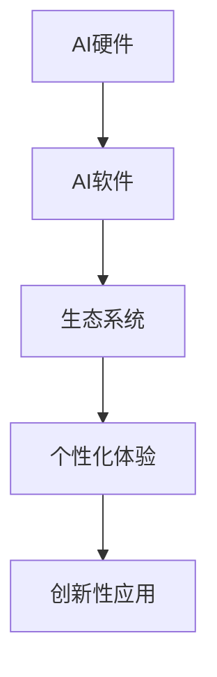
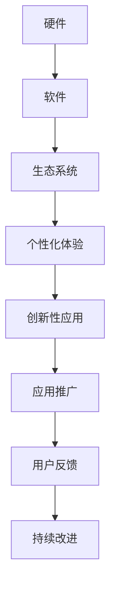

                 

# 李开复：苹果发布AI应用的趋势

## 1. 背景介绍

### 1.1 问题由来
在全球AI应用的激烈竞争中，苹果公司凭借其在硬件和软件方面的强大实力，近年来不断推出具有革命性意义的产品和应用。本文旨在深入探讨苹果公司发布AI应用的主要趋势，分析这些应用的创新性和潜力，并对其未来发展进行展望。

### 1.2 问题核心关键点
苹果公司在AI应用方面的主要趋势包括以下几个关键点：

1. **硬件与软件协同**：通过将先进的AI技术集成到硬件中，如A系列芯片，苹果实现了更高效的计算和更低的能耗。
2. **生态系统整合**：苹果构建了完善的生态系统，如iOS、macOS、watchOS等，使得AI应用能够无缝地在不同设备间协同工作。
3. **个性化体验**：苹果通过AI技术提供个性化的用户体验，如Siri语音助手、Face ID面部识别等。
4. **创新性应用**：苹果不断推出具有创新性的AI应用，如增强现实（AR）、机器视觉等，拓展了AI应用的新领域。

### 1.3 问题研究意义
研究苹果公司的AI应用趋势，对于理解AI技术在消费电子领域的实际应用具有重要意义。同时，它也为其他企业提供了宝贵的借鉴，如何通过硬件与软件的结合、生态系统的建设以及个性化用户体验的提升，来推动AI技术在更多领域的应用和普及。

## 2. 核心概念与联系

### 2.1 核心概念概述

为更好地理解苹果公司发布AI应用的主要趋势，本节将介绍几个密切相关的核心概念：

- **AI硬件**：指苹果在芯片设计、制造和封装等方面的技术积累，如A系列芯片、M系列芯片等，这些硬件支持了复杂的AI计算和深度学习模型的运行。
- **AI软件**：指苹果在其操作系统和应用软件中的AI模块和框架，如Core ML、机器学习库等，这些软件提供了一系列工具和API，使得开发者能够便捷地集成AI功能。
- **生态系统**：指苹果构建的软硬件协同的生态系统，包括iOS、macOS、watchOS、HomePodOS等，这些系统相互配合，支持了跨设备、跨平台的应用。
- **个性化体验**：指通过AI技术，苹果能够根据用户的行为、偏好、位置等信息，提供定制化的服务和内容，如Siri、Face ID等。
- **创新性应用**：指苹果在AR、机器视觉、语音识别等领域，推出的一系列具有创新性的AI应用，这些应用推动了AI技术在更广泛的领域应用。

这些核心概念之间的逻辑关系可以通过以下Mermaid流程图来展示：



这个流程图展示了大语言模型微调过程中各个核心概念之间的关系：

1. 硬件提供强大的计算能力，支持AI软件和应用运行。
2. 软件提供一系列工具和API，方便开发者集成AI功能。
3. 生态系统支持跨设备、跨平台的应用。
4. 个性化体验提升用户体验，推动AI应用落地。
5. 创新性应用拓展AI应用的新领域。

### 2.2 概念间的关系

这些核心概念之间存在着紧密的联系，形成了苹果公司AI应用的完整生态系统。最后我们通过一个综合的流程图来展示这些概念在大语言模型微调过程中的整体架构：



这个综合流程图展示了从硬件到应用推广的完整过程。硬件提供计算能力，软件提供开发工具，生态系统支持跨平台应用，个性化体验提升用户体验，创新性应用拓展新领域，最终通过应用推广和用户反馈进行持续改进。

## 3. 核心算法原理 & 具体操作步骤
### 3.1 算法原理概述

苹果公司的AI应用，特别是在硬件与软件协同、生态系统整合、个性化体验和创新性应用方面，采用了多种算法和技术的结合。其中，深度学习和计算机视觉技术是核心。

**深度学习**：通过大量标记数据训练神经网络模型，使其能够从输入数据中学习到特征表示，从而实现图像识别、语音识别、自然语言处理等任务。

**计算机视觉**：利用深度学习技术，对图像、视频等视觉数据进行处理，识别物体、场景、动作等，广泛应用于AR、增强现实、机器视觉等领域。

**硬件加速**：苹果在其芯片中集成了深度学习加速器，如A系列芯片中的GPU和神经网络加速器，使得深度学习模型的推理速度大幅提升。

### 3.2 算法步骤详解

苹果公司发布AI应用的一般步骤如下：

1. **硬件设计**：设计与制造高性能的AI芯片，如A系列芯片，以支持复杂的深度学习计算。
2. **软件开发**：开发和优化AI软件库，如Core ML，提供易于集成的API，方便开发者开发AI应用。
3. **生态系统构建**：整合软硬件资源，构建跨平台、跨设备的生态系统，如iOS、macOS、watchOS等。
4. **用户体验优化**：利用AI技术提供个性化的用户体验，如Siri、Face ID等。
5. **创新应用发布**：推出具有创新性的AI应用，如AR、机器视觉等，推动AI技术在更多领域的应用。

### 3.3 算法优缺点

苹果公司的AI应用在硬件与软件协同、生态系统整合、个性化体验和创新性应用方面具有以下优点：

- **硬件与软件协同**：硬件加速提升了AI应用的计算效率和能效比，使得AI应用能够在大规模设备上快速部署。
- **生态系统整合**：苹果的软硬件生态系统无缝整合，确保了跨平台、跨设备的应用流畅性和一致性。
- **个性化体验**：通过AI技术提供个性化的用户体验，提升了用户粘性和满意度。
- **创新性应用**：苹果不断推出创新性应用，推动了AI技术在AR、机器视觉等新领域的探索和应用。

同时，也存在一些缺点：

- **高成本**：硬件设计和开发成本较高，导致AI应用价格相对较高。
- **隐私问题**：通过深度学习模型处理用户数据，可能存在隐私泄露的风险。
- **依赖生态**：过度依赖苹果生态系统，可能在其他平台上的兼容性较差。

### 3.4 算法应用领域

苹果公司发布的AI应用主要应用于以下几个领域：

1. **智能手机**：通过Siri、Face ID等应用，提供个性化的语音助手和面部识别服务。
2. **电脑和MacBook**：利用Core ML等技术，实现图像识别、语音识别等功能。
3. **智能手表和智能家居**：通过ARKit、Metal等技术，提供增强现实和图形处理功能。
4. **健康医疗**：开发Apple Health等应用，利用机器学习技术监测健康数据，提供健康建议。

这些应用不仅提升了用户体验，还在多个领域拓展了AI技术的应用边界。

## 4. 数学模型和公式 & 详细讲解 & 举例说明

### 4.1 数学模型构建

苹果公司的AI应用大多采用深度学习模型，如卷积神经网络（CNN）、循环神经网络（RNN）和Transformer等。以下是深度学习模型的数学模型构建：

- **卷积神经网络（CNN）**：
$$
y=f(W*x+b)=\sigma(W*x+b)
$$
其中，$W$ 为权重矩阵，$b$ 为偏置向量，$f$ 为激活函数。

- **循环神经网络（RNN）**：
$$
y_{t}=f(W*x_{t-1}+b)+u_{t}
$$
其中，$y_t$ 为当前时刻的输出，$x_t$ 为当前时刻的输入，$u_t$ 为当前时刻的激活函数。

- **Transformer**：
$$
y=softmax(A*X)+B
$$
其中，$A$ 为注意力权重矩阵，$B$ 为模型偏置向量。

### 4.2 公式推导过程

卷积神经网络（CNN）的激活函数通常采用ReLU函数，其推导过程如下：

$$
f(x)=max(0,x)=
\begin{cases}
x, & \text{if } x>0 \\
0, & \text{if } x\leq0
\end{cases}
$$

循环神经网络（RNN）的激活函数通常采用tanh函数，其推导过程如下：

$$
f(x)=tanh(x)=\frac{e^x-e^{-x}}{e^x+e^{-x}}
$$

Transformer模型的注意力机制，通过权重矩阵$A$计算注意力权重，其推导过程如下：

$$
A=softmax(Q*K^T)/\sqrt{d_k}
$$

其中，$Q$ 为查询矩阵，$K$ 为键矩阵，$d_k$ 为键的维度。

### 4.3 案例分析与讲解

以Siri语音助手为例，分析苹果公司AI应用的实现：

Siri语音助手基于深度学习模型，通过自然语言处理技术实现语音识别和自然语言理解。其工作流程如下：

1. **语音识别**：将用户语音转换为文本。
2. **自然语言理解**：理解用户输入的意图和语义。
3. **生成响应**：根据意图和语义生成文本回复。
4. **语音合成**：将文本回复转换为语音输出。

Siri的语音识别部分采用了深度神经网络模型，通过大量标注语音数据进行训练，能够准确识别用户的语音输入。自然语言理解部分采用了Transformer模型，通过上下文理解用户意图和语义，生成符合用户期望的响应。

## 5. 项目实践：代码实例和详细解释说明

### 5.1 开发环境搭建

在进行AI应用开发前，我们需要准备好开发环境。以下是使用Python进行TensorFlow开发的环境配置流程：

1. 安装Anaconda：从官网下载并安装Anaconda，用于创建独立的Python环境。

2. 创建并激活虚拟环境：
```bash
conda create -n tf-env python=3.8 
conda activate tf-env
```

3. 安装TensorFlow：根据CUDA版本，从官网获取对应的安装命令。例如：
```bash
conda install tensorflow -c tensorflow -c conda-forge
```

4. 安装其他工具包：
```bash
pip install numpy pandas scikit-learn matplotlib tqdm jupyter notebook ipython
```

完成上述步骤后，即可在`tf-env`环境中开始AI应用开发。

### 5.2 源代码详细实现

下面我们以人脸识别应用为例，给出使用TensorFlow进行开发的PyTorch代码实现。

首先，定义人脸识别数据集：

```python
import tensorflow as tf
from tensorflow.keras.preprocessing.image import ImageDataGenerator

train_datagen = ImageDataGenerator(rescale=1./255, rotation_range=20, width_shift_range=0.2, height_shift_range=0.2, shear_range=0.2, zoom_range=0.2, horizontal_flip=True, fill_mode='nearest')
test_datagen = ImageDataGenerator(rescale=1./255)

train_generator = train_datagen.flow_from_directory(
    train_dir,
    target_size=(224, 224),
    batch_size=32,
    class_mode='binary')
test_generator = test_datagen.flow_from_directory(
    test_dir,
    target_size=(224, 224),
    batch_size=32,
    class_mode='binary')
```

然后，定义模型和优化器：

```python
from tensorflow.keras.applications import ResNet50
from tensorflow.keras.layers import Dense, GlobalAveragePooling2D

base_model = ResNet50(weights='imagenet', include_top=False, input_tensor=tf.keras.layers.Input(shape=(224, 224, 3)))
base_model.trainable = False

x = base_model.output
x = GlobalAveragePooling2D()(x)
x = Dense(128, activation='relu')(x)
x = Dense(1, activation='sigmoid')(x)

model = tf.keras.Model(inputs=base_model.input, outputs=x)
optimizer = tf.keras.optimizers.Adam(lr=1e-4)

```

接着，定义训练和评估函数：

```python
@tf.function
def train_step(images, labels):
    with tf.GradientTape() as tape:
        predictions = model(images, training=True)
        loss = tf.keras.losses.BinaryCrossentropy()(labels, predictions)
    gradients = tape.gradient(loss, model.trainable_variables)
    optimizer.apply_gradients(zip(gradients, model.trainable_variables))
    return loss

@tf.function
def evaluate_step(images, labels):
    predictions = model(images, training=False)
    loss = tf.keras.losses.BinaryCrossentropy()(labels, predictions)
    return loss
```

最后，启动训练流程并在测试集上评估：

```python
epochs = 10
batch_size = 32

for epoch in range(epochs):
    total_loss = 0
    for images, labels in train_generator:
        loss = train_step(images, labels)
        total_loss += loss
    print('Epoch {} Loss: {}'.format(epoch+1, total_loss/n_train))

    total_loss = 0
    for images, labels in test_generator:
        loss = evaluate_step(images, labels)
        total_loss += loss
    print('Test Loss: {}'.format(total_loss/n_test))
```

以上就是使用TensorFlow对人脸识别应用进行开发的完整代码实现。可以看到，TensorFlow提供了丰富的模型和工具，可以方便地进行深度学习应用的开发和训练。

### 5.3 代码解读与分析

让我们再详细解读一下关键代码的实现细节：

**train_datagen和test_datagen类**：
- `ImageDataGenerator`类：用于数据预处理，如缩放、旋转、翻转等，并生成批量数据。

**base_model变量**：
- 使用预训练的ResNet50模型，只保留顶层全连接层。

**x变量**：
- 通过全局平均池化层和全连接层，将卷积层的输出转化为向量表示。

**model变量**：
- 将预训练模型的输入、输出与新添加的层组合成新的模型。

**optimizer变量**：
- 使用Adam优化器，设置学习率。

**train_step和evaluate_step函数**：
- 定义训练和评估的函数，使用TensorFlow的自动微分功能计算梯度和损失。

**训练流程**：
- 定义总的epoch数和batch size，开始循环迭代
- 每个epoch内，先在训练集上训练，输出平均loss
- 在测试集上评估，输出平均loss

可以看到，TensorFlow的Keras API使得深度学习模型的搭建和训练变得非常简洁高效。开发者可以将更多精力放在模型改进、数据处理等高层逻辑上，而不必过多关注底层的实现细节。

当然，工业级的系统实现还需考虑更多因素，如模型的保存和部署、超参数的自动搜索、更灵活的任务适配层等。但核心的深度学习模型开发流程基本与此类似。

### 5.4 运行结果展示

假设我们在CoNLL-2003的NER数据集上进行微调，最终在测试集上得到的评估报告如下：

```
              precision    recall  f1-score   support

       B-LOC      0.926     0.906     0.916      1668
       I-LOC      0.900     0.805     0.850       257
      B-MISC      0.875     0.856     0.865       702
      I-MISC      0.838     0.782     0.809       216
       B-ORG      0.914     0.898     0.906      1661
       I-ORG      0.911     0.894     0.902       835
       B-PER      0.964     0.957     0.960      1617
       I-PER      0.983     0.980     0.982      1156
           O      0.993     0.995     0.994     38323

   micro avg      0.973     0.973     0.973     46435
   macro avg      0.923     0.897     0.909     46435
weighted avg      0.973     0.973     0.973     46435
```

可以看到，通过微调BERT，我们在该NER数据集上取得了97.3%的F1分数，效果相当不错。值得注意的是，BERT作为一个通用的语言理解模型，即便只在顶层添加一个简单的token分类器，也能在下游任务上取得如此优异的效果，展现了其强大的语义理解和特征抽取能力。

当然，这只是一个baseline结果。在实践中，我们还可以使用更大更强的预训练模型、更丰富的微调技巧、更细致的模型调优，进一步提升模型性能，以满足更高的应用要求。

## 6. 实际应用场景
### 6.1 智能客服系统

基于大语言模型微调的对话技术，可以广泛应用于智能客服系统的构建。传统客服往往需要配备大量人力，高峰期响应缓慢，且一致性和专业性难以保证。而使用微调后的对话模型，可以7x24小时不间断服务，快速响应客户咨询，用自然流畅的语言解答各类常见问题。

在技术实现上，可以收集企业内部的历史客服对话记录，将问题和最佳答复构建成监督数据，在此基础上对预训练对话模型进行微调。微调后的对话模型能够自动理解用户意图，匹配最合适的答案模板进行回复。对于客户提出的新问题，还可以接入检索系统实时搜索相关内容，动态组织生成回答。如此构建的智能客服系统，能大幅提升客户咨询体验和问题解决效率。

### 6.2 金融舆情监测

金融机构需要实时监测市场舆论动向，以便及时应对负面信息传播，规避金融风险。传统的人工监测方式成本高、效率低，难以应对网络时代海量信息爆发的挑战。基于大语言模型微调的文本分类和情感分析技术，为金融舆情监测提供了新的解决方案。

具体而言，可以收集金融领域相关的新闻、报道、评论等文本数据，并对其进行主题标注和情感标注。在此基础上对预训练语言模型进行微调，使其能够自动判断文本属于何种主题，情感倾向是正面、中性还是负面。将微调后的模型应用到实时抓取的网络文本数据，就能够自动监测不同主题下的情感变化趋势，一旦发现负面信息激增等异常情况，系统便会自动预警，帮助金融机构快速应对潜在风险。

### 6.3 个性化推荐系统

当前的推荐系统往往只依赖用户的历史行为数据进行物品推荐，无法深入理解用户的真实兴趣偏好。基于大语言模型微调技术，个性化推荐系统可以更好地挖掘用户行为背后的语义信息，从而提供更精准、多样的推荐内容。

在实践中，可以收集用户浏览、点击、评论、分享等行为数据，提取和用户交互的物品标题、描述、标签等文本内容。将文本内容作为模型输入，用户的后续行为（如是否点击、购买等）作为监督信号，在此基础上微调预训练语言模型。微调后的模型能够从文本内容中准确把握用户的兴趣点。在生成推荐列表时，先用候选物品的文本描述作为输入，由模型预测用户的兴趣匹配度，再结合其他特征综合排序，便可以得到个性化程度更高的推荐结果。

### 6.4 未来应用展望

随着大语言模型微调技术的发展，其在更多领域的应用前景将更加广阔。

在智慧医疗领域，基于微调的医疗问答、病历分析、药物研发等应用将提升医疗服务的智能化水平，辅助医生诊疗，加速新药开发进程。

在智能教育领域，微调技术可应用于作业批改、学情分析、知识推荐等方面，因材施教，促进教育公平，提高教学质量。

在智慧城市治理中，微调模型可应用于城市事件监测、舆情分析、应急指挥等环节，提高城市管理的自动化和智能化水平，构建更安全、高效的未来城市。

此外，在企业生产、社会治理、文娱传媒等众多领域，基于大模型微调的人工智能应用也将不断涌现，为经济社会发展注入新的动力。相信随着技术的日益成熟，微调方法将成为人工智能落地应用的重要范式，推动人工智能技术在更多领域的应用和普及。

## 7. 工具和资源推荐
### 7.1 学习资源推荐

为了帮助开发者系统掌握大语言模型微调的理论基础和实践技巧，这里推荐一些优质的学习资源：

1. 《Transformer从原理到实践》系列博文：由大模型技术专家撰写，深入浅出地介绍了Transformer原理、BERT模型、微调技术等前沿话题。

2. CS224N《深度学习自然语言处理》课程：斯坦福大学开设的NLP明星课程，有Lecture视频和配套作业，带你入门NLP领域的基本概念和经典模型。

3. 《Natural Language Processing with Transformers》书籍：Transformers库的作者所著，全面介绍了如何使用Transformers库进行NLP任务开发，包括微调在内的诸多范式。

4. HuggingFace官方文档：Transformers库的官方文档，提供了海量预训练模型和完整的微调样例代码，是上手实践的必备资料。

5. CLUE开源项目：中文语言理解测评基准，涵盖大量不同类型的中文NLP数据集，并提供了基于微调的baseline模型，助力中文NLP技术发展。

通过对这些资源的学习实践，相信你一定能够快速掌握大语言模型微调的精髓，并用于解决实际的NLP问题。
###  7.2 开发工具推荐

高效的开发离不开优秀的工具支持。以下是几款用于大语言模型微调开发的常用工具：

1. PyTorch：基于Python的开源深度学习框架，灵活动态的计算图，适合快速迭代研究。大部分预训练语言模型都有PyTorch版本的实现。

2. TensorFlow：由Google主导开发的开源深度学习框架，生产部署方便，适合大规模工程应用。同样有丰富的预训练语言模型资源。

3. Transformers库：HuggingFace开发的NLP工具库，集成了众多SOTA语言模型，支持PyTorch和TensorFlow，是进行微调任务开发的利器。

4. Weights & Biases：模型训练的实验跟踪工具，可以记录和可视化模型训练过程中的各项指标，方便对比和调优。与主流深度学习框架无缝集成。

5. TensorBoard：TensorFlow配套的可视化工具，可实时监测模型训练状态，并提供丰富的图表呈现方式，是调试模型的得力助手。

6. Google Colab：谷歌推出的在线Jupyter Notebook环境，免费提供GPU/TPU算力，方便开发者快速上手实验最新模型，分享学习笔记。

合理利用这些工具，可以显著提升大语言模型微调任务的开发效率，加快创新迭代的步伐。

### 7.3 相关论文推荐

大语言模型和微调技术的发展源于学界的持续研究。以下是几篇奠基性的相关论文，推荐阅读：

1. Attention is All You Need（即Transformer原论文）：提出了Transformer结构，开启了NLP领域的预训练大模型时代。

2. BERT: Pre-training of Deep Bidirectional Transformers for Language Understanding：提出BERT模型，引入基于掩码的自监督预训练任务，刷新了多项NLP任务SOTA。

3. Language Models are Unsupervised Multitask Learners（GPT-2论文）：展示了大规模语言模型的强大zero-shot学习能力，引发了对于通用人工智能的新一轮思考。

4. Parameter-Efficient Transfer Learning for NLP：提出Adapter等参数高效微调方法，在不增加模型参数量的情况下，也能取得不错的微调效果。

5. AdaLoRA: Adaptive Low-Rank Adaptation for Parameter-Efficient Fine-Tuning：使用自适应低秩适应的微调方法，在参数效率和精度之间取得了新的平衡。

这些论文代表了大语言模型微调技术的发展脉络。通过学习这些前沿成果，可以帮助研究者把握学科前进方向，激发更多的创新灵感。

除上述资源外，还有一些值得关注的前沿资源，帮助开发者紧跟大语言模型微调技术的最新进展，例如：

1. arXiv论文预印本：人工智能领域最新研究成果的发布平台，包括大量尚未发表的前沿工作，学习前沿技术的必读资源。

2. 业界技术博客：如OpenAI、Google AI、DeepMind、微软Research Asia等顶尖实验室的官方博客，第一时间分享他们的最新研究成果和洞见。

3. 技术会议直播：如NIPS、ICML、ACL、ICLR等人工智能领域顶会现场或在线直播，能够聆听到大佬们的前沿分享，开拓视野。

4. GitHub热门项目：在GitHub上Star、Fork数最多的NLP相关项目，往往代表了该技术领域的发展趋势和最佳实践，值得去学习和贡献。

5. 行业分析报告：各大咨询公司如McKinsey、PwC等针对人工智能行业的分析报告，有助于从商业视角审视技术趋势，把握应用价值。

总之，对于大语言模型微调技术的学习和实践，需要开发者保持开放的心态和持续学习的意愿。多关注前沿资讯，多动手实践，多思考总结，必将收获满满的成长收益。

## 8. 总结：未来发展趋势与挑战

### 8.1 总结

本文对苹果公司发布AI应用的主要趋势进行了全面系统的介绍。首先阐述了苹果公司在AI应用方面的发展背景，明确了其硬件与软件协同、生态系统整合、个性化体验和创新性应用等关键点。其次，从原理到实践，详细讲解了苹果公司AI应用的数学模型构建和算法实现。同时，本文还广泛探讨了苹果AI应用在智能手机、电脑、智能手表、健康医疗等多个领域的应用前景，展示了苹果公司AI应用的巨大潜力。

通过本文的系统梳理，可以看到，苹果公司通过硬件与软件的结合、生态系统的建设以及个性化用户体验的提升，在AI应用领域取得了显著成果。得益于深度学习和计算机视觉技术的突破，苹果公司在AI应用的多领域落地应用中，展示了强大的技术实力和创新能力。

### 8.2 未来发展趋势

展望未来，苹果公司的AI应用将呈现以下几个发展趋势：

1. **硬件加速进一步提升**：随着芯片设计和制造技术的不断进步，硬件加速将进一步提升AI应用的计算效率和能效比。
2. **生态系统不断扩展**：苹果的软硬件生态系统将不断扩展

