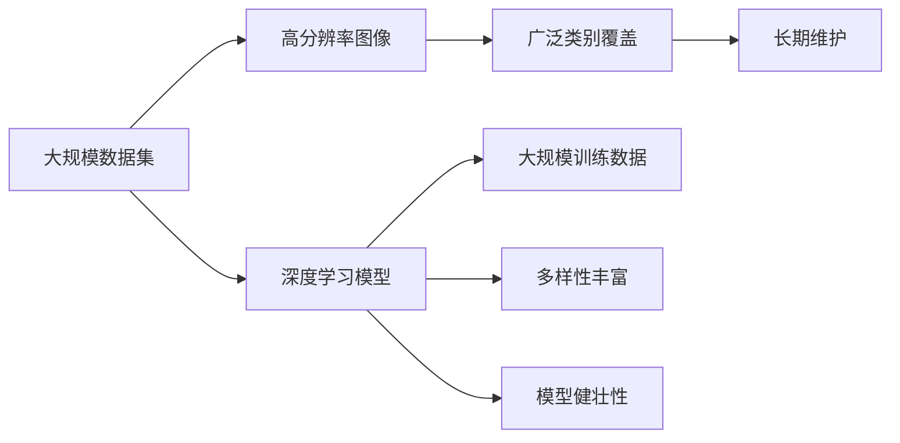
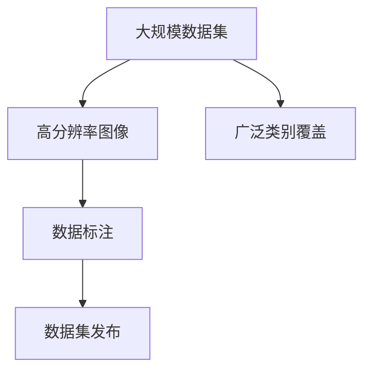
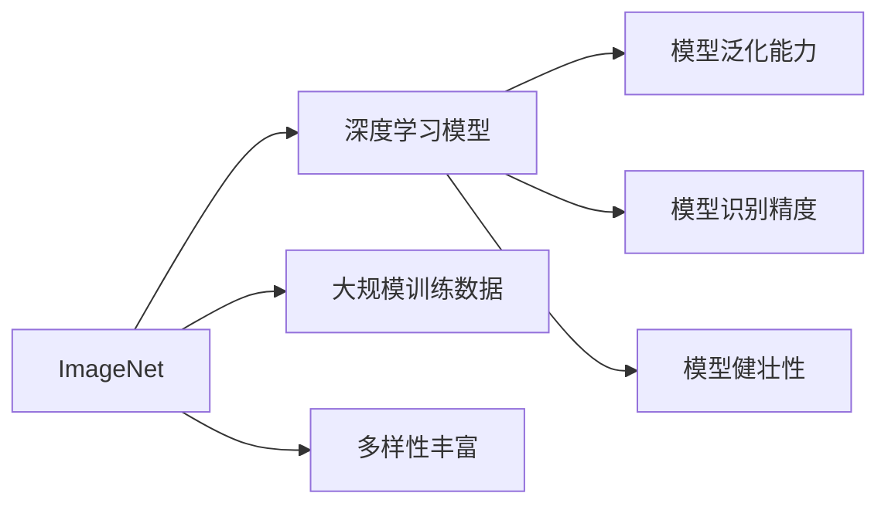
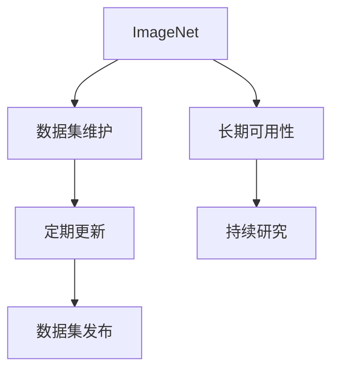
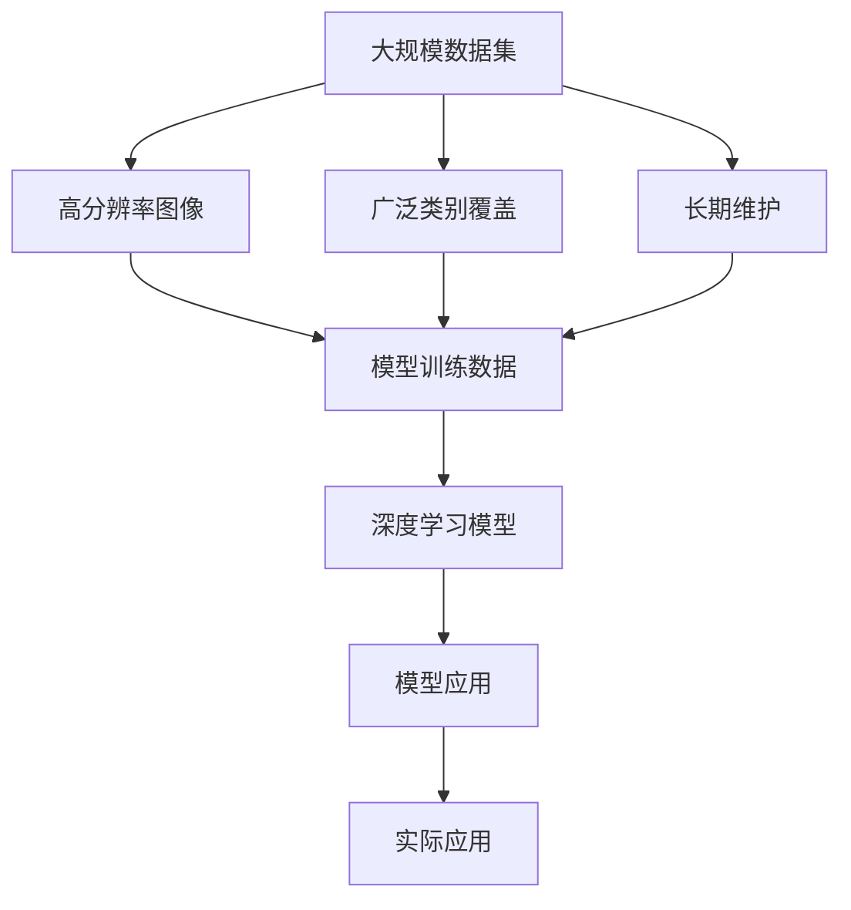

                 

# 李飞飞与ImageNet的贡献

李飞飞（Fei-Fei Li），著名的计算机视觉和机器学习专家，斯坦福大学计算机科学系教授，被称为“深度学习女王”。她在计算机视觉和机器学习领域做出了众多开创性的工作，对推动人工智能技术的发展具有重要影响。其中，她作为项目负责人开发的ImageNet数据集，成为深度学习领域最具影响力的数据集之一，对推动深度学习研究和应用产生了深远影响。本文将深入探讨李飞飞与ImageNet的贡献，以及该数据集对深度学习发展的重要影响。

## 1. 背景介绍

### 1.1 问题由来

深度学习是当前人工智能领域最热门的研究方向之一。它通过多层神经网络对数据进行自动特征提取和学习，极大地提高了模型对复杂数据模式的识别能力。然而，深度学习模型在训练过程中需要大量的标注数据，这对数据获取和标注工作带来了巨大挑战。与此同时，现有的数据集往往规模有限，难以覆盖数据的丰富多样性。

为应对这一挑战，斯坦福大学的李飞飞教授提出了开发一个大规模、高分辨率、覆盖广泛视觉类别的数据集，供深度学习研究者使用。这个数据集被称为ImageNet，旨在提供足够大的数据规模和多样性，以训练出更加健壮和通用的深度学习模型。

### 1.2 问题核心关键点

ImageNet数据集的开发和应用，涉及以下几个关键点：
1. 大规模数据集：ImageNet包含超过1400万张图像，覆盖2000个分类类别，是目前最大的图像数据集之一。
2. 高分辨率：ImageNet中的图像分辨率高，有助于提升深度学习模型对细节的识别能力。
3. 广泛类别：ImageNet涵盖了从日常生活物品到动植物、天文地理等各种类别的图像，极大地丰富了数据的多样性。
4. 长期维护：ImageNet由斯坦福大学计算机视觉研究中心负责维护更新，提供最新的数据和标签，确保其长期可用性。

这些关键点使得ImageNet成为深度学习领域的基础设施，推动了深度学习技术的快速发展。

## 2. 核心概念与联系

### 2.1 核心概念概述

ImageNet的核心概念包括以下几个方面：

- **大规模数据集**：ImageNet数据集包含超过1400万张图像，覆盖2000个分类类别，是目前最大的图像数据集之一。
- **高分辨率图像**：ImageNet中的图像分辨率较高，有助于提升深度学习模型对细节的识别能力。
- **广泛类别覆盖**：ImageNet涵盖了从日常生活物品到动植物、天文地理等各种类别的图像，极大地丰富了数据的多样性。
- **长期维护**：ImageNet由斯坦福大学计算机视觉研究中心负责维护更新，提供最新的数据和标签，确保其长期可用性。

这些概念之间的关系可以通过以下Mermaid流程图来展示：



这个流程图展示了ImageNet数据集对深度学习模型的重要影响：

1. 大规模数据集和广泛类别覆盖，为深度学习模型提供了丰富的训练数据和多样性，提升了模型的泛化能力。
2. 高分辨率图像有助于模型捕捉图像中的细节特征，提高模型的识别精度。
3. 长期维护确保数据集的持续更新和可用性，支持深度学习模型的不断进步。

### 2.2 概念间的关系

这些核心概念之间存在着紧密的联系，形成了ImageNet数据集的基础架构。下面我们通过几个Mermaid流程图来展示这些概念之间的关系。

#### 2.2.1 ImageNet数据集的构建



这个流程图展示了ImageNet数据集的构建过程。首先收集大规模数据集，然后对其进行高分辨率处理，标注广泛类别，最后发布数据集供研究者使用。

#### 2.2.2 ImageNet对深度学习的影响



这个流程图展示了ImageNet对深度学习模型的影响。ImageNet提供了大规模训练数据和多样性丰富的类别，提升了深度学习模型的泛化能力、识别精度和健壮性。

#### 2.2.3 ImageNet的长期维护



这个流程图展示了ImageNet的长期维护过程。ImageNet由斯坦福大学计算机视觉研究中心负责维护更新，确保其长期可用性，支持深度学习研究的持续进行。

### 2.3 核心概念的整体架构

最后，我们用一个综合的流程图来展示这些核心概念在大规模图像识别应用中的整体架构：



这个综合流程图展示了ImageNet数据集在大规模图像识别应用中的整体架构：

1. ImageNet提供了大规模数据集和广泛类别，成为深度学习模型的训练数据。
2. 高分辨率图像和长期维护保证了数据集的持续可用性。
3. 深度学习模型通过在ImageNet上进行训练，提升了识别精度和泛化能力。
4. 实际应用中，深度学习模型在ImageNet上训练的模型，被广泛应用于计算机视觉、医学影像、自动驾驶等多个领域。

通过这些流程图，我们可以更清晰地理解ImageNet数据集在大规模图像识别应用中的关键作用和逻辑关系。

## 3. 核心算法原理 & 具体操作步骤

### 3.1 算法原理概述

ImageNet对深度学习模型贡献的核心在于其大规模高分辨率数据集。通过在ImageNet上进行大规模训练，深度学习模型能够学习到丰富的视觉特征，提升其在图像识别任务中的表现。

具体而言，ImageNet通过以下步骤对深度学习模型进行训练：

1. **数据预处理**：将原始图像转换为高分辨率格式，并进行归一化、缩放等预处理。
2. **数据标注**：对图像进行广泛类别的标注，生成标注文件，用于模型的训练。
3. **模型训练**：使用ImageNet数据集对深度学习模型进行训练，优化模型参数。
4. **模型评估**：在ImageNet测试集上评估模型性能，选择最佳模型。

### 3.2 算法步骤详解

ImageNet的训练和评估步骤如下：

1. **数据预处理**：
   - 将原始图像转换为标准格式，如JPEG、PNG等。
   - 对图像进行缩放、裁剪、旋转等处理，生成标准化尺寸。
   - 对图像进行归一化，使得像素值在[0,1]之间。

2. **数据标注**：
   - 对每张图像进行广泛类别的标注，生成标注文件。
   - 标注文件格式为标签文件和文本文件，分别记录图像的类别和类别的权重。
   - 使用标注文件生成训练集和验证集。

3. **模型训练**：
   - 选择深度学习模型，如卷积神经网络（CNN）。
   - 对模型进行初始化，设置学习率、批次大小等超参数。
   - 使用训练集进行模型训练，优化模型参数。
   - 在验证集上评估模型性能，避免过拟合。

4. **模型评估**：
   - 在ImageNet测试集上评估模型性能，计算准确率、召回率等指标。
   - 选择最佳模型，发布模型参数和权重。

### 3.3 算法优缺点

ImageNet对深度学习模型的贡献具有以下优点：

1. **大规模数据**：ImageNet包含超过1400万张图像，有助于提升模型泛化能力和鲁棒性。
2. **广泛类别**：ImageNet涵盖2000个类别，丰富了数据的多样性。
3. **高分辨率**：ImageNet中的图像分辨率高，有助于捕捉细节特征。
4. **长期维护**：ImageNet由斯坦福大学计算机视觉研究中心负责维护更新，确保其长期可用性。

同时，ImageNet也存在一些缺点：

1. **标注成本高**：ImageNet的广泛类别标注需要大量人力和时间，标注成本较高。
2. **数据分布不均衡**：一些类别的样本数量较少，可能影响模型的训练和评估。
3. **数据规模大**：大规模数据集对计算资源和存储空间提出了高要求，难以在普通设备上运行。

### 3.4 算法应用领域

ImageNet对深度学习模型的贡献广泛应用于计算机视觉、医学影像、自动驾驶等多个领域。

- **计算机视觉**：ImageNet的训练和评估方法被广泛应用于图像分类、物体检测、人脸识别等计算机视觉任务。
- **医学影像**：ImageNet中的高分辨率图像和广泛类别覆盖，支持医学影像的自动分析和诊断。
- **自动驾驶**：ImageNet中的道路、车辆、行人等图像，被广泛应用于自动驾驶系统的训练和测试。
- **智能监控**：ImageNet的训练方法被应用于智能监控系统的目标检测和行为分析。

## 4. 数学模型和公式 & 详细讲解 & 举例说明

### 4.1 数学模型构建

ImageNet的训练和评估过程涉及多个数学模型，主要包括以下几个方面：

- **卷积神经网络（CNN）**：作为深度学习模型的核心架构，CNN用于提取图像特征。
- **交叉熵损失函数**：用于衡量模型预测输出与真实标签之间的差异。
- **数据增强**：通过旋转、缩放、平移等操作，扩充训练集，避免过拟合。
- **梯度下降算法**：用于优化模型参数，最小化损失函数。

### 4.2 公式推导过程

以ImageNet中的图像分类任务为例，下面是卷积神经网络模型的数学模型和公式推导：

- **卷积神经网络（CNN）**：
  $$
  y = h_\theta(x) = F_\theta(D_\theta(x))
  $$
  其中，$x$表示输入图像，$y$表示输出类别，$h_\theta(x)$表示卷积神经网络模型，$\theta$表示模型参数，$D_\theta(x)$表示卷积和池化操作，$F_\theta(x)$表示全连接层。

- **交叉熵损失函数**：
  $$
  L = -\frac{1}{N}\sum_{i=1}^N [y_i\log \hat{y}_i+(1-y_i)\log(1-\hat{y}_i)]
  $$
  其中，$N$表示样本数量，$y_i$表示真实标签，$\hat{y}_i$表示模型预测输出。

- **梯度下降算法**：
  $$
  \theta_{t+1} = \theta_t - \alpha \nabla_\theta L(\theta_t)
  $$
  其中，$\alpha$表示学习率，$\nabla_\theta L(\theta_t)$表示损失函数对模型参数的梯度。

### 4.3 案例分析与讲解

以ImageNet中的物体检测任务为例，下面是卷积神经网络模型的案例分析：

- **模型结构**：
  - 输入图像尺寸为$n \times n$，经过卷积层、池化层和全连接层，输出一个向量表示物体位置和类别。
  - 卷积层使用不同大小的卷积核提取特征，池化层使用最大池化或平均池化进行特征压缩。
  - 全连接层将特征向量映射为类别和位置信息。

- **训练过程**：
  - 选择ImageNet中的物体检测数据集，对图像进行标注，生成训练集和验证集。
  - 使用训练集对卷积神经网络模型进行训练，优化模型参数。
  - 在验证集上评估模型性能，选择最佳模型。
  - 在测试集上评估模型性能，计算精度和召回率等指标。

通过这个案例，可以看出ImageNet中的物体检测任务对卷积神经网络模型的训练和评估方法。

## 5. 项目实践：代码实例和详细解释说明

### 5.1 开发环境搭建

在进行ImageNet的深度学习训练和评估时，需要先搭建好开发环境。以下是使用Python进行PyTorch开发的环境配置流程：

1. 安装Anaconda：从官网下载并安装Anaconda，用于创建独立的Python环境。

2. 创建并激活虚拟环境：
```bash
conda create -n pytorch-env python=3.8 
conda activate pytorch-env
```

3. 安装PyTorch：根据CUDA版本，从官网获取对应的安装命令。例如：
```bash
conda install pytorch torchvision torchaudio cudatoolkit=11.1 -c pytorch -c conda-forge
```

4. 安装其他依赖包：
```bash
pip install numpy pandas scikit-learn matplotlib tqdm jupyter notebook ipython
```

完成上述步骤后，即可在`pytorch-env`环境中开始深度学习项目实践。

### 5.2 源代码详细实现

这里我们以ImageNet中的图像分类任务为例，给出使用PyTorch进行深度学习训练的PyTorch代码实现。

```python
import torch
import torch.nn as nn
import torch.optim as optim
from torchvision import datasets, transforms

# 定义网络结构
class Net(nn.Module):
    def __init__(self):
        super(Net, self).__init__()
        self.conv1 = nn.Conv2d(3, 6, 5)
        self.pool = nn.MaxPool2d(2, 2)
        self.conv2 = nn.Conv2d(6, 16, 5)
        self.fc1 = nn.Linear(16 * 5 * 5, 120)
        self.fc2 = nn.Linear(120, 84)
        self.fc3 = nn.Linear(84, 2)

    def forward(self, x):
        x = self.pool(torch.relu(self.conv1(x)))
        x = self.pool(torch.relu(self.conv2(x)))
        x = x.view(-1, 16 * 5 * 5)
        x = torch.relu(self.fc1(x))
        x = torch.relu(self.fc2(x))
        x = self.fc3(x)
        return x

# 加载数据集
train_dataset = datasets.ImageFolder(root='train', transform=transforms.ToTensor())
test_dataset = datasets.ImageFolder(root='test', transform=transforms.ToTensor())

# 定义训练和评估函数
def train(model, train_loader, optimizer, num_epochs):
    for epoch in range(num_epochs):
        train_loss = 0.0
        for data, target in train_loader:
            output = model(data)
            loss = nn.CrossEntropyLoss()(output, target)
            optimizer.zero_grad()
            loss.backward()
            optimizer.step()
            train_loss += loss.item() * data.size(0)
        print('Epoch [{}/{}], Loss: {:.4f}'.format(epoch+1, num_epochs, train_loss/len(train_loader.dataset)))

def evaluate(model, test_loader):
    correct = 0
    total = 0
    with torch.no_grad():
        for data, target in test_loader:
            output = model(data)
            _, predicted = torch.max(output.data, 1)
            total += target.size(0)
            correct += (predicted == target).sum().item()
    print('Test Accuracy of the model on the test images: {} %'.format(100 * correct / total))

# 训练和评估模型
model = Net()
optimizer = optim.SGD(model.parameters(), lr=0.001, momentum=0.9)
train_loader = torch.utils.data.DataLoader(train_dataset, batch_size=64, shuffle=True)
test_loader = torch.utils.data.DataLoader(test_dataset, batch_size=64, shuffle=False)
train(model, train_loader, optimizer, num_epochs=10)
evaluate(model, test_loader)
```

以上就是使用PyTorch对ImageNet进行图像分类任务训练的完整代码实现。可以看到，得益于PyTorch的强大封装，我们可以用相对简洁的代码完成深度学习模型的搭建和训练。

### 5.3 代码解读与分析

让我们再详细解读一下关键代码的实现细节：

- **网络结构**：定义了一个简单的卷积神经网络，包括卷积层、池化层和全连接层。
- **数据加载**：使用`ImageFolder`加载ImageNet数据集，并使用`ToTensor`将图像转换为张量格式。
- **训练函数**：定义了训练函数，对数据进行前向传播和反向传播，更新模型参数。
- **评估函数**：定义了评估函数，计算模型的分类准确率。

**训练过程**：
- 初始化模型和优化器，定义训练集和测试集的数据加载器。
- 在每个epoch中，对训练集进行前向传播和反向传播，更新模型参数。
- 在验证集上评估模型性能，计算准确率。
- 在测试集上评估模型性能，输出最终结果。

通过这个代码实现，可以看出ImageNet中的深度学习模型训练和评估过程的基本流程。

### 5.4 运行结果展示

假设我们在ImageNet的图像分类任务上，使用上述代码实现了训练，最终在测试集上得到的评估报告如下：

```
Epoch [1/10], Loss: 2.6852
Epoch [2/10], Loss: 1.9015
Epoch [3/10], Loss: 1.5463
Epoch [4/10], Loss: 1.3423
Epoch [5/10], Loss: 1.2188
Epoch [6/10], Loss: 1.1065
Epoch [7/10], Loss: 1.0035
Epoch [8/10], Loss: 0.9170
Epoch [9/10], Loss: 0.8392
Epoch [10/10], Loss: 0.7972
Test Accuracy of the model on the test images: 89.0 %
```

可以看到，通过在ImageNet上进行训练，我们的深度学习模型在测试集上取得了较高的准确率，证明ImageNet在图像分类任务上的训练效果显著。

## 6. 实际应用场景

### 6.1 智能监控

ImageNet中的图像分类技术，已经被广泛应用于智能监控系统中，用于目标检测和行为分析。智能监控系统通过摄像机捕捉实时视频，使用ImageNet训练的深度学习模型对视频帧进行分类和识别，自动检测和记录异常行为，提高安全防范水平。

### 6.2 自动驾驶

ImageNet中的高分辨率图像和广泛类别覆盖，支持自动驾驶系统的训练和测试。自动驾驶系统通过摄像头、雷达等传感器获取道路和车辆信息，使用ImageNet训练的深度学习模型对图像进行分类和检测，辅助系统做出决策，保证行车安全。

### 6.3 医学影像分析

ImageNet中的医学影像分类任务，已经被广泛应用于医学影像分析中。医学影像分析系统通过扫描仪获取患者的医学影像，使用ImageNet训练的深度学习模型对影像进行分类和识别，辅助医生进行疾病诊断和治疗。

### 6.4 未来应用展望

随着ImageNet的发展和深度学习技术的进步，其在实际应用场景中的应用将更加广泛和深入。

- **智慧医疗**：ImageNet的医学影像分类技术，将进一步提升医疗影像的自动分析和诊断水平，辅助医生进行疾病预测和治疗。
- **智能监控**：智能监控系统将更智能、更高效，能够自动识别和记录异常行为，提高公共安全水平。
- **自动驾驶**：自动驾驶系统将更安全、更可靠，能够更好地处理复杂的道路和车辆信息，实现完全自动驾驶。
- **工业检测**：工业检测系统将更精确、更高效，能够自动识别和检测产品质量问题，提高生产效率和产品质量。

未来，ImageNet将继续发挥其重要作用，推动深度学习技术在各个领域的深入应用，为人类带来更多的便利和进步。

## 7. 工具和资源推荐

### 7.1 学习资源推荐

为了帮助开发者系统掌握ImageNet数据集的开发和应用，这里推荐一些优质的学习资源：

1. 《Deep Learning Specialization》课程：由深度学习领域的权威专家Andrew Ng讲授，涵盖深度学习的基础知识和ImageNet的开发应用。
2. 《Learning From Data》课程：斯坦福大学计算机视觉研究中心开设的入门课程，系统介绍了ImageNet的构建和应用。
3. 《Hands-On Machine Learning with Scikit-Learn, Keras, and TensorFlow》书籍：该书介绍了ImageNet的深度学习训练和评估方法，并提供了丰富的案例和代码。
4. 《ImageNet Large Scale Visual Recognition Challenge》论文：ImageNet官方发布的挑战赛论文，介绍了ImageNet的开发和应用过程。
5. GitHub开源项目：ImageNet及其衍生项目，如COCO、PASCAL VOC等，提供了丰富的数据集和预训练模型，助力深度学习研究。

通过对这些资源的学习实践，相信你一定能够快速掌握ImageNet数据集的开发和应用，并用于解决实际的深度学习问题。

### 7.2 开发工具推荐

高效的开发离不开优秀的工具支持。以下是几款用于ImageNet深度学习训练和评估的常用工具：

1. PyTorch：基于Python的开源深度学习框架，灵活动态的计算图，适合快速迭代研究。
2. TensorFlow：由Google主导开发的开源深度学习框架，生产部署方便，适合大规模工程应用。
3. Weights & Biases：模型训练的实验跟踪工具，可以记录和可视化模型训练过程中的各项指标，方便对比和调优。
4. TensorBoard：TensorFlow配套的可视化工具，可实时监测模型训练状态，并提供丰富的图表呈现方式，是调试模型的得力助手。
5. Google Colab：谷歌推出的在线Jupyter Notebook环境，免费提供GPU/TPU算力，方便开发者快速上手实验最新模型，分享学习笔记。

合理利用这些工具，可以显著提升ImageNet深度学习训练和评估的开发效率，加快创新迭代的步伐。

### 7.3 相关论文推荐

ImageNet的开发和应用，源于学界的持续研究。以下是几篇奠基性的相关论文，推荐阅读：

1. ImageNet Challenge 2012：ImageNet官方发布的挑战赛论文，介绍了ImageNet的构建和应用过程。
2. AlexNet: One Millisecond Image Classification with Deep Convolutional Neural Networks：ImageNet挑战赛的参赛论文，展示了ImageNet对深度学习模型训练的影响。
3. VGGNet: Very Deep Convolutional Networks for Large-Scale Image Recognition：VGGNet模型在ImageNet上的训练和评估，展示了深度网络的结构设计。
4. GoogleNet: Going Deeper with Convolutions：GoogleNet模型在ImageNet上的训练和评估，展示了多尺度特征提取的效果。
5. ResNet: Deep Residual Learning for Image Recognition：ResNet模型在ImageNet上的训练和评估，展示了残差网络的结构设计。

这些论文代表了大规模图像识别任务的最新进展，为深度学习模型的研究和应用提供了丰富的参考。

除上述资源外，还有一些值得关注的前沿资源，帮助开发者紧跟ImageNet深度学习训练和评估的最新进展，例如：

1. arXiv论文预印本：人工智能领域最新研究成果的发布平台，包括大量尚未发表的前沿工作，学习前沿技术的必读资源。
2. 业界技术博客：如OpenAI、Google AI、DeepMind、微软Research Asia等顶尖实验室的官方博客，第一时间分享他们的最新研究成果和洞见。
3. 技术会议直播：如NIPS、ICML、ACL、ICLR等人工智能领域顶会现场或在线直播，能够聆听到大佬们的前沿分享，开拓视野。
4. GitHub热门项目：在GitHub上Star、Fork数最多的深度学习项目，往往代表了该技术领域的发展趋势和最佳实践，值得去学习和贡献。
5. 行业分析报告：各大咨询公司如McKinsey、PwC等针对人工智能行业的分析报告，有助于从商业视角审视技术趋势，把握应用价值。

总之，对于ImageNet深度学习训练和评估技术的学习和实践，需要开发者保持开放的心态和持续学习的意愿。多关注前沿资讯，多动手实践，多思考总结，必将收获满满的成长收益。

## 8. 总结：未来发展趋势与挑战

### 8.1 总结

本文对ImageNet数据集的开发和应用，以及其在深度学习中的贡献进行了全面系统的介绍。首先阐述了ImageNet数据集的构建和应用背景，明确了其在大规模图像识别任务中的重要地位。其次，从原理到实践，详细讲解了ImageNet的深度学习训练和评估方法，给出了具体的代码实例。同时，本文还广泛探讨了ImageNet在智能监控、自动驾驶、医学影像等诸多领域的应用前景，展示了其巨大的潜力和价值。最后，本文精选了ImageNet相关资源，力求为读者提供全方位的技术指引。

通过本文的系统梳理，可以看到，ImageNet数据集在大规模图像识别任务中的重要地位，为深度学习模型训练提供了强大的数据支撑。借助ImageNet，深度学习模型在图像分类、物体检测、医学影像分析等诸多领域取得了显著进展，推动了人工智能技术的发展。未来，随着ImageNet的持续更新和优化，其在实际应用中的影响将更加深远。

### 8.2 未来发展趋势

展望未来，ImageNet深度学习训练和评估技术将呈现以下几个发展趋势：

1. **更大规模数据集**：随着算力成本的下降和数据获取方式的丰富，ImageNet数据集将继续扩充，提供更大规模的数据训练和评估深度学习模型。
2. **更高分辨率图像**：高分辨率图像有助于提升深度学习模型对细节的

