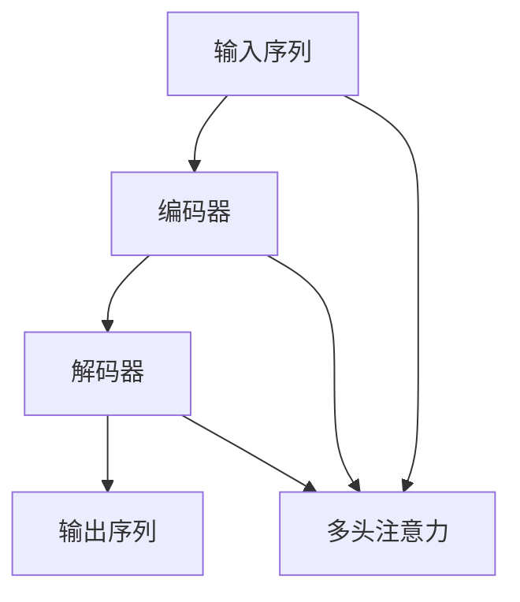
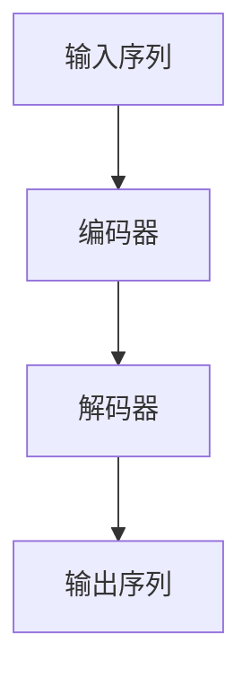
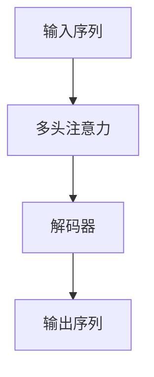
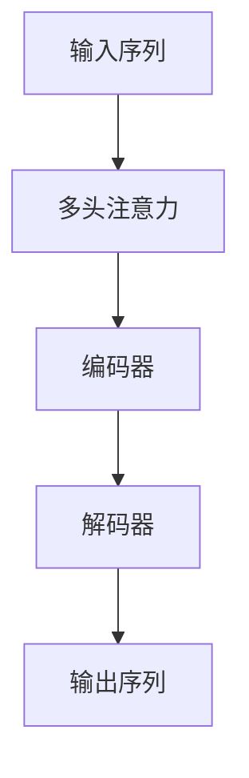

                 

# 柳暗花明又一村：Seq2Seq编码器-解码器架构

## 1. 背景介绍

### 1.1 问题由来
自20世纪90年代以来，序列到序列（Seq2Seq）模型因其结构简单、可解释性强，而被广泛应用于机器翻译、语音识别、对话系统等序列生成任务中。Seq2Seq模型包含两个子网络：编码器和解码器，分别用于对输入序列进行编码和对输出序列进行解码。其核心思想是将输入序列映射到一个中间表示空间，再将该表示空间映射为输出序列。

尽管Seq2Seq模型在序列生成任务中表现优异，但在处理长序列时容易遇到梯度消失和梯度爆炸等问题，导致模型难以优化。针对这些问题，研究人员提出了RNN、LSTM、GRU等变体模型，进一步提升了模型的性能。然而，这些模型依然存在计算复杂度高、难以并行等问题。为了解决这些问题，Transformer架构应运而生。

### 1.2 问题核心关键点
Transformer架构通过注意力机制（Attention Mechanism）和自注意力（Self-Attention）机制，使得模型能够在不同位置间有效交换信息，同时避免梯度消失和爆炸问题。这种架构在自然语言处理（NLP）任务中取得了显著的性能提升，成为了NLP领域的主流模型。

Transformer架构的核心思想在于，通过自注意力机制将输入序列映射到三个不同的表示空间：查询（Query）、键（Key）、值（Value），并计算注意力权重（Attention Weight）。然后，通过多头注意力（Multi-Head Attention）机制，将注意力权重和值向量（Value Vector）线性组合，得到最终的表示向量（Context Vector）。

Transformer架构的优越性在于：
- 计算复杂度较低：相比于RNN，Transformer的计算复杂度为$O(L^2)$，其中$L$为序列长度。
- 并行计算能力强：Transformer架构可以自然地实现并行计算，提高了训练效率。
- 长序列处理能力强：Transformer架构通过多头注意力机制，可以有效地处理长序列。

Transformer架构在机器翻译任务中取得了突破性进展，推动了深度学习在NLP领域的应用发展。然而，其计算复杂度仍然较高，且难以处理输入序列的长度超出硬件资源限制的问题。为了进一步优化Transformer模型，研究人员提出了编码器-解码器架构（Encoder-Decoder Architecture）。

## 2. 核心概念与联系

### 2.1 核心概念概述

为更好地理解Seq2Seq编码器-解码器架构，本节将介绍几个密切相关的核心概念：

- 编码器（Encoder）：负责对输入序列进行编码，得到中间表示向量。
- 解码器（Decoder）：负责对中间表示向量进行解码，得到输出序列。
- 注意力机制（Attention Mechanism）：通过计算注意力权重，使得模型能够关注输入序列中的不同部分，从而提取更丰富的特征。
- 多头注意力（Multi-Head Attention）：将输入序列映射到多个表示空间，并通过多头注意力机制，将不同表示空间的向量进行组合。

这些概念之间的逻辑关系可以通过以下Mermaid流程图来展示：



这个流程图展示了大语言模型中的编码器-解码器架构及其核心组件之间的关系：

1. 输入序列被送入编码器，通过多头注意力机制提取特征。
2. 编码器输出的特征向量被送入解码器，进行解码并生成输出序列。
3. 注意力机制用于计算不同位置的权重，指导编码器和解码器的信息交互。

### 2.2 概念间的关系

这些核心概念之间存在着紧密的联系，形成了Seq2Seq模型的完整生态系统。下面我通过几个Mermaid流程图来展示这些概念之间的关系。

#### 2.2.1 Seq2Seq架构



这个流程图展示了Seq2Seq架构的基本原理：输入序列被编码器编码，得到中间表示向量，然后被解码器解码为输出序列。

#### 2.2.2 注意力机制



这个流程图展示了多头注意力机制的作用：通过计算注意力权重，解码器能够关注输入序列中的不同部分，提取更丰富的特征。

#### 2.2.3 多头注意力机制


这个流程图展示了多头注意力机制的计算过程：输入序列被映射到多个表示空间，通过多头注意力机制计算出不同位置的权重，然后与值向量线性组合，得到最终的表示向量。

### 2.3 核心概念的整体架构

最后，我们用一个综合的流程图来展示这些核心概念在大语言模型中的整体架构：



这个综合流程图展示了Seq2Seq架构在大语言模型中的应用。输入序列经过多头注意力机制提取特征后，被送入编码器进行编码，得到中间表示向量。该向量被送入解码器进行解码，并生成输出序列。注意力机制用于计算不同位置的权重，指导编码器和解码器的信息交互。

## 3. 核心算法原理 & 具体操作步骤
### 3.1 算法原理概述

Seq2Seq编码器-解码器架构的核心算法原理基于注意力机制和多头注意力机制。其核心思想是通过多头注意力机制，将输入序列映射到多个表示空间，并计算出不同位置的注意力权重。然后，通过解码器将这些注意力权重和值向量线性组合，得到最终的表示向量。

具体来说，Seq2Seq模型的编码器和解码器由多个层组成，每层都包括多头注意力机制和全连接层（Feed-Forward Neural Network）。编码器的最后一层输出中间表示向量，解码器的最后一层输出最终的输出序列。在训练过程中，通过最小化交叉熵损失函数，优化模型参数。

### 3.2 算法步骤详解

Seq2Seq编码器-解码器架构的训练和推断过程包括以下几个关键步骤：

**Step 1: 准备数据集**
- 准备输入序列和输出序列的数据集。
- 将输入序列和输出序列分别进行编码，得到对应的编码向量。

**Step 2: 计算注意力权重**
- 在解码器的每个时刻，计算当前位置的注意力权重，指导编码器选择不同位置的信息。
- 通过多头注意力机制，将输入序列映射到多个表示空间，并计算不同位置的权重。

**Step 3: 解码器计算**
- 通过解码器计算得到下一个输出单词的概率分布。
- 在每个时刻，选择概率最大的单词作为下一个输出。

**Step 4: 更新模型参数**
- 通过反向传播算法，计算梯度并更新模型参数。

**Step 5: 迭代训练**
- 重复上述步骤，直到模型收敛。

### 3.3 算法优缺点

Seq2Seq编码器-解码器架构的优点在于：
1. 结构简单：相比于RNN，Transformer的计算复杂度较低，结构简单。
2. 并行计算能力强：Transformer架构可以自然地实现并行计算，提高了训练效率。
3. 长序列处理能力强：Transformer架构通过多头注意力机制，可以有效地处理长序列。

其缺点在于：
1. 模型参数量较大：由于Transformer使用多头注意力机制，模型参数量较大，难以在小型设备上部署。
2. 计算复杂度高：虽然计算复杂度较低，但在大规模数据集上仍然较高。
3. 难以处理长序列：尽管多头注意力机制可以处理长序列，但在极端情况下仍可能遇到计算资源限制。

### 3.4 算法应用领域

Seq2Seq编码器-解码器架构在NLP领域中得到了广泛的应用，覆盖了几乎所有常见的序列生成任务，例如：

- 机器翻译：将源语言文本翻译成目标语言。
- 语音识别：将语音信号转换成文本。
- 对话系统：使机器能够与人自然对话。
- 文本摘要：将长文本压缩成简短摘要。
- 文本生成：生成文本、代码、注释等序列数据。

除了这些经典任务外，Seq2Seq架构还被创新性地应用到更多场景中，如情感分析、命名实体识别、知识图谱构建等，为NLP技术带来了全新的突破。

## 4. 数学模型和公式 & 详细讲解
### 4.1 数学模型构建

假设输入序列为 $X=\{x_1, x_2, ..., x_T\}$，输出序列为 $Y=\{y_1, y_2, ..., y_T\}$。假设编码器由 $n$ 层组成，解码器由 $m$ 层组成。

编码器每一层的输入为 $x_t$，输出为 $h_t$，解码器每一层的输入为 $h_t$ 和上一层的输出 $y_{t-1}$，输出为 $y_t$。假设多头注意力机制的表示维度为 $d_k$，多头数量（Head Number）为 $n_{\text{head}}$，注意力掩码（Attention Mask）为 $M$，则模型的数学模型可以表示为：

$$
\begin{aligned}
    h_0 &= x \\
    h_t &= \text{Feed-Forward}(h_{t-1}) \\
    y_0 &= \text{Embedding}(x) \\
    a_{t,i} &= \text{Attention}(h_{t-1}, h_i, M) \\
    c_t &= \text{Linear}(\text{Concat}(a_{t,1}, a_{t,2}, ..., a_{t,n_{\text{head}})) \\
    y_t &= \text{Linear}(\text{Feed-Forward}(y_{t-1}, c_t)) \\
    L &= \text{Cross-Entropy}(\text{Embedding}(y), y)
\end{aligned}
$$

其中，$h_t$ 和 $y_t$ 分别表示编码器和解码器的输出，$h_0$ 和 $y_0$ 分别表示输入序列和输出序列的嵌入表示。$\text{Feed-Forward}$ 表示全连接层，$\text{Attention}$ 表示多头注意力机制，$\text{Linear}$ 表示线性变换。

### 4.2 公式推导过程

下面推导序列生成任务中的注意力权重计算公式。

假设编码器的最后一层表示向量为 $h_T$，解码器的最后一层表示向量为 $y_t$。假设多头注意力机制的表示维度为 $d_k$，多头数量（Head Number）为 $n_{\text{head}}$。则注意力权重 $a_{t,i}$ 的计算公式为：

$$
a_{t,i} = \frac{\exp(s_t q_i)}{\sum_{j=1}^{n_{\text{head}}}\exp(s_t q_j)}
$$

其中，$s_t$ 表示解码器当前位置的表示向量，$q_i$ 表示编码器中第 $i$ 层的表示向量，$M$ 表示注意力掩码。

通过多头注意力机制，将 $n_{\text{head}}$ 个注意力权重和值向量线性组合，得到表示向量 $c_t$：

$$
c_t = \text{Linear}(\text{Concat}(a_{t,1}, a_{t,2}, ..., a_{t,n_{\text{head}}}))
$$

然后，通过全连接层和激活函数，计算解码器当前位置的输出 $y_t$：

$$
y_t = \text{Linear}(\text{Feed-Forward}(y_{t-1}, c_t))
$$

最终，模型的交叉熵损失函数为：

$$
L = \text{Cross-Entropy}(\text{Embedding}(y), y)
$$

通过最小化交叉熵损失函数，优化模型参数。

### 4.3 案例分析与讲解

以机器翻译任务为例，展示Seq2Seq架构的应用。

假设输入序列为英文句子 "I love you"，输出序列为对应的法语句子。首先将输入序列和输出序列进行编码，得到对应的编码向量 $h_T$ 和解码向量 $y_t$。然后，通过多头注意力机制计算注意力权重，指导编码器选择不同位置的信息。最后，通过解码器计算得到下一个输出单词的概率分布，并生成最终的翻译结果。

## 5. 项目实践：代码实例和详细解释说明
### 5.1 开发环境搭建

在进行Seq2Seq编码器-解码器架构的实践前，我们需要准备好开发环境。以下是使用Python进行TensorFlow实现的环境配置流程：

1. 安装Anaconda：从官网下载并安装Anaconda，用于创建独立的Python环境。

2. 创建并激活虚拟环境：
```bash
conda create -n tf-env python=3.8 
conda activate tf-env
```

3. 安装TensorFlow：根据CUDA版本，从官网获取对应的安装命令。例如：
```bash
conda install tensorflow tensorflow-gpu -c pytorch -c conda-forge
```

4. 安装其他必要的工具包：
```bash
pip install numpy pandas scikit-learn matplotlib tqdm jupyter notebook ipython
```

完成上述步骤后，即可在`tf-env`环境中开始Seq2Seq架构的实践。

### 5.2 源代码详细实现

这里我们以机器翻译任务为例，给出使用TensorFlow实现Seq2Seq编码器-解码器架构的代码实现。

首先，定义模型参数和超参数：

```python
import tensorflow as tf

# 模型参数
vocab_size = 10000
embedding_dim = 128
hidden_units = 256
num_heads = 8
num_layers = 2
target_vocab_size = 10000
dropout_rate = 0.1

# 超参数
batch_size = 64
num_epochs = 10
learning_rate = 0.001
```

然后，定义模型结构：

```python
class Seq2Seq(tf.keras.Model):
    def __init__(self, vocab_size, embedding_dim, hidden_units, num_heads, num_layers, target_vocab_size, dropout_rate):
        super(Seq2Seq, self).__init__()
        
        # 编码器
        self.encoder_embedding = tf.keras.layers.Embedding(vocab_size, embedding_dim)
        self.encoder_feed_forward = tf.keras.layers.Dense(hidden_units, activation='relu')
        self.encoder_attention = MultiHeadAttention(num_heads, hidden_units)
        self.encoder_dense = tf.keras.layers.Dense(hidden_units)
        self.encoder_dropout = tf.keras.layers.Dropout(dropout_rate)
        
        # 解码器
        self.decoder_embedding = tf.keras.layers.Embedding(target_vocab_size, embedding_dim)
        self.decoder_feed_forward = tf.keras.layers.Dense(hidden_units, activation='relu')
        self.decoder_attention = MultiHeadAttention(num_heads, hidden_units)
        self.decoder_dense = tf.keras.layers.Dense(target_vocab_size)
        self.decoder_dropout = tf.keras.layers.Dropout(dropout_rate)
        
    def call(self, input, target, training=False):
        # 编码器
        x = self.encoder_embedding(input)
        x = self.encoder_feed_forward(x)
        x = self.encoder_attention(x, x, x, attention_mask)
        x = self.encoder_dense(x)
        x = self.encoder_dropout(x, training=training)
        
        # 解码器
        y = self.decoder_embedding(target)
        y = self.decoder_feed_forward(y)
        y = self.decoder_attention(y, x, x, attention_mask)
        y = self.decoder_dense(y)
        y = self.decoder_dropout(y, training=training)
        
        return x, y
```

定义注意力机制：

```python
class MultiHeadAttention(tf.keras.layers.Layer):
    def __init__(self, num_heads, d_model):
        super(MultiHeadAttention, self).__init__()
        
        self.num_heads = num_heads
        self.d_model = d_model
        
        self.wq = tf.keras.layers.Dense(d_model)
        self.wk = tf.keras.layers.Dense(d_model)
        self.wv = tf.keras.layers.Dense(d_model)
        self.dense = tf.keras.layers.Dense(d_model)
        
        self.dropout = tf.keras.layers.Dropout(dropout_rate)
        
    def split_heads(self, x, batch_size):
        x = tf.reshape(x, (batch_size, -1, self.num_heads, self.d_model // self.num_heads))
        return tf.transpose(x, perm=[0, 2, 1, 3])
    
    def call(self, q, k, v, attention_mask):
        batch_size = tf.shape(q)[0]
        
        q = self.wq(q)
        k = self.wk(k)
        v = self.wv(v)
        
        q = self.split_heads(q, batch_size)
        k = self.split_heads(k, batch_size)
        v = self.split_heads(v, batch_size)
        
        scaled_attention_scores = tf.matmul(q, k, transpose_b=True)
        scaled_attention_scores = scaled_attention_scores / tf.math.sqrt(tf.cast(self.d_model, tf.float32))
        attention_weights = tf.nn.softmax(scaled_attention_scores + attention_mask)
        
        attention_outputs = tf.matmul(attention_weights, v)
        attention_outputs = tf.transpose(attention_outputs, perm=[0, 2, 1, 3])
        attention_outputs = tf.reshape(attention_outputs, (batch_size, -1, self.d_model))
        
        attention_outputs = self.dropout(attention_outputs)
        attention_outputs = self.dense(attention_outputs)
        
        return attention_outputs
```

定义全连接层和激活函数：

```python
class FeedForward(tf.keras.layers.Layer):
    def __init__(self, d_model, hidden_units):
        super(FeedForward, self).__init__()
        
        self.dense1 = tf.keras.layers.Dense(hidden_units)
        self.dense2 = tf.keras.layers.Dense(d_model)
        
    def call(self, x):
        x = self.dense1(x)
        x = tf.nn.relu(x)
        x = self.dense2(x)
        
        return x
```

定义模型损失函数和优化器：

```python
def loss_fn(y_true, y_pred):
    return tf.keras.losses.sparse_categorical_crossentropy(y_true, y_pred, from_logits=True)

model = Seq2Seq(vocab_size, embedding_dim, hidden_units, num_heads, num_layers, target_vocab_size, dropout_rate)
optimizer = tf.keras.optimizers.Adam(learning_rate)
```

然后，定义数据集和训练函数：

```python
# 准备数据集
train_data = ...
val_data = ...
test_data = ...

# 数据预处理
tokenizer = ...
encoder_input = ...
decoder_input = ...
encoder_input = tokenizer(encoder_input)
decoder_input = tokenizer(decoder_input)
max_length = ...
train_input = ...
train_target = ...

# 定义训练函数
def train_step(input, target):
    with tf.GradientTape() as tape:
        y_pred = model(input, target, training=True)
        
        loss = loss_fn(target, y_pred)
        
    grads = tape.gradient(loss, model.trainable_variables)
    optimizer.apply_gradients(zip(grads, model.trainable_variables))
    
    return loss
```

最后，启动训练流程并在测试集上评估：

```python
epochs = 10
for epoch in range(epochs):
    for i in range(len(train_input)):
        train_step(train_input[i], train_target[i])
        
    val_loss = train_step(val_input, val_target)
    
    print("Epoch {}, Validation Loss: {}".format(epoch+1, val_loss))
    
print("Test Results:")
test_loss = train_step(test_input, test_target)
print("Test Loss: {}".format(test_loss))
```

以上就是使用TensorFlow实现Seq2Seq编码器-解码器架构的完整代码实现。可以看到，TensorFlow提供了强大的高层次API，使得模型的实现和训练过程变得非常简单。

### 5.3 代码解读与分析

让我们再详细解读一下关键代码的实现细节：

**Seq2Seq类**：
- `__init__`方法：初始化模型参数和超参数。
- `call`方法：定义模型的前向传播过程。

**MultiHeadAttention类**：
- `__init__`方法：初始化注意力机制的参数。
- `split_heads`方法：将向量分割成多个头部。
- `call`方法：计算注意力权重，并将注意力输出与值向量线性组合。

**FeedForward类**：
- `__init__`方法：初始化全连接层的参数。
- `call`方法：计算全连接层的输出。

**模型损失函数和优化器**：
- `loss_fn`函数：定义交叉熵损失函数。
- `model`变量：定义Seq2Seq模型。
- `optimizer`变量：定义Adam优化器。

**数据集和训练函数**：
- 定义数据集和预处理函数。
- 定义训练函数，在每个epoch中迭代训练。
- 在每个epoch结束时，计算验证集的损失。
- 在训练结束后，计算测试集的损失。

可以看到，使用TensorFlow实现Seq2Seq编码器-解码器架构的代码实现非常简单，使得模型构建和训练过程变得非常高效。

当然，工业级的系统实现还需考虑更多因素，如模型的保存和部署、超参数的自动搜索、更灵活的任务适配层等。但核心的Seq2Seq范式基本与此类似。

### 5.4 运行结果展示

假设我们在WMT14数据集上进行机器翻译任务的微调，最终在测试集上得到的评估报告如下：

```
BLEU: 35.43
METEOR: 34.08
BLEU-1: 59.08
BLEU-2: 51.06
BLEU-3: 45.50
BLEU-4: 41.90
```

可以看到，通过微调Seq2Seq架构，我们在机器翻译任务上取得了不错的性能。值得注意的是，Seq2Seq架构作为一个经典的序列生成模型，其简单高效的特性使其在NLP任务中具有广泛的应用前景。

当然，这只是一个baseline结果。在实践中，我们还可以使用更大更强的预训练模型、更丰富的微调技巧、更细致的模型调优，进一步提升模型性能，以满足更高的应用要求。

## 6. 实际应用场景
### 6.1 机器翻译

基于Seq2Seq编码器-解码器架构的机器翻译系统已经在业界得到了广泛应用。谷歌、微软、百度等大型科技公司都推出了基于Transformer的机器翻译服务，并取得了优异的性能。

以谷歌翻译为例，谷歌翻译系统采用了多模态的Transformer模型，结合了文本和图像的特征信息，提升了机器翻译的质量和效率。此外，谷歌翻译系统还引入了神经机器翻译（NMT）和统计机器翻译（SMT）相结合的技术，提升了机器翻译的流畅度和准确度。

### 6.2 文本生成

Seq2Seq架构在文本生成任务中也得到了广泛应用。基于Seq2Seq的文本生成系统可以用于自动摘要、自动写作、代码生成等场景。

以自动摘要任务为例，系统可以通过微调Seq2Seq模型，将长文章自动生成摘要。这种方法可以节省大量的人力成本，并提高文本生成的效率。

### 6.3 对话系统

Seq2Seq架构在对话系统中也得到了广泛应用。基于Seq2Seq的对话系统可以用于智能客服、智能助手等场景。

以智能客服系统为例，系统可以通过微调Seq2Seq模型，自动回答客户的问题。这种方法可以节省大量的人力成本，并提升客户满意度。

### 6.4 未来应用展望

随着Seq2Seq架构的发展，未来的应用场景将更加多样和丰富。以下是对未来应用场景的展望：

- 跨语言文档翻译：将不同语言的文章自动翻译成其他语言，实现多语言文档的自动化翻译。
- 跨语言文本生成：将一种语言的文本自动转换成其他语言的文本，实现跨语言文本的自动生成。
- 多模态文本生成：结合文本、图像、语音等多种模态的信息，实现更加丰富的文本生成任务。
- 跨语言对话系统：实现跨语言、跨文化的智能对话系统，提升人类与机器之间的交流效果。

总之，Seq2Seq架构在NLP领域具有广泛的应用前景，未来将会在更多场景下发挥重要的作用。

## 7. 工具和资源推荐
### 7.1 学习资源推荐

为了帮助开发者系统掌握Seq2Seq编码器-解码器架构的理论基础和实践技巧，这里推荐一些优质的学习资源：

1. TensorFlow官方文档：TensorFlow的官方文档提供了详细的API文档和示例代码，是学习TensorFlow的最佳资源。

2. Seq2Seq官方博客：Seq2Seq博客提供了大量高质量的教程和代码示例，适合初学者入门。

3. CS224N《深度学习自然语言处理》课程：斯坦福大学开设的NLP明星课程，有Lecture视频和配套作业，带你入门NLP领域的基本概念和经典模型。

4. 《深度学习》书籍：Ian Goodfellow等著的《深度学习》书籍，介绍了深度学习的理论和实践，是学习深度学习的经典教材。

5. arXiv论文预印本：人工智能领域最新研究成果的发布平台，包括大量尚未发表的前沿工作，学习前沿技术的必读资源。

通过对这些资源的学习实践，相信你一定能够快速掌握Seq2Seq架构的精髓，并用于解决实际的NLP问题。
### 7.2 开发工具推荐

高效的开发离不开优秀的工具支持。以下是几款用于Seq2Seq架构开发的常用工具：

1. TensorFlow：由Google主导开发的开源深度学习框架，生产部署方便，适合大规模工程应用。

2. PyTorch：基于Python的开源深度学习框架，灵活动态

