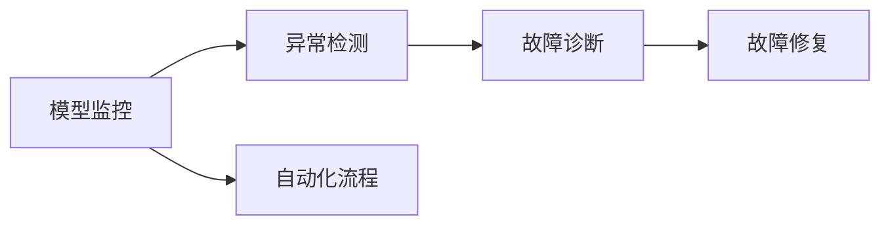
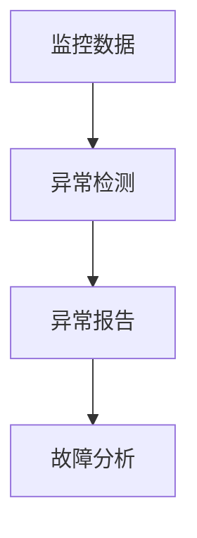
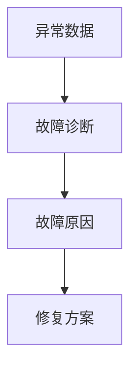
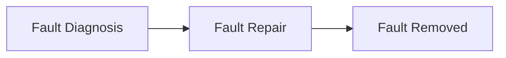
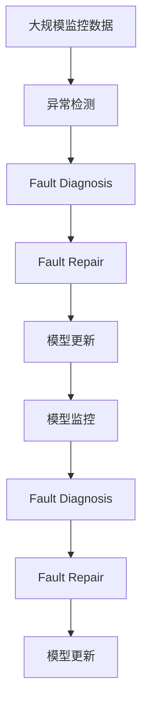

                 

# 模型监控与故障诊断原理与代码实战案例讲解

## 1. 背景介绍

### 1.1 问题由来

在现代信息技术日新月异的今天，模型已经广泛应用于各类决策场景中，如推荐系统、风险评估、医疗诊断等。模型性能的稳定性直接影响着决策的质量和可信度。然而，由于模型的复杂性以及训练数据的多样性，模型在实际应用中可能会表现出异常行为，如过拟合、欠拟合、泛化能力差等。这些问题不仅影响模型的效率和准确性，还可能导致严重的后果，如欺诈检测失败、推荐结果偏差、误诊等。

因此，模型监控与故障诊断成为了保障模型可靠性的重要手段。通过持续监控模型的运行状态，及时发现异常并诊断故障原因，可以有效提升模型的鲁棒性和可用性。

### 1.2 问题核心关键点

模型监控与故障诊断的核心在于：

1. **模型性能监控**：实时监控模型的运行状态和输出结果，及时发现性能异常。
2. **故障诊断与修复**：通过分析异常数据和日志，找出故障原因，采取相应措施修复模型。
3. **自动化流程**：建立自动化的监控和诊断流程，减少人工干预，提升处理效率。

本文将系统性地介绍模型监控与故障诊断的原理、关键技术和实践案例，帮助读者理解如何构建高效的模型监控与故障诊断系统。

## 2. 核心概念与联系

### 2.1 核心概念概述

为更好地理解模型监控与故障诊断方法，本节将介绍几个密切相关的核心概念：

- **模型监控(Model Monitoring)**：实时监控模型的运行状态和输出结果，及时发现性能异常。
- **异常检测(Anomaly Detection)**：通过统计和机器学习算法，从数据中检测出异常值或异常行为。
- **故障诊断(Fault Diagnosis)**：分析异常数据和日志，找出故障原因，采取相应措施修复模型。
- **自动化流程(Automated Workflow)**：通过自动化脚本和工具，实现模型的监控、检测和诊断流程，减少人工干预。

这些核心概念之间的逻辑关系可以通过以下Mermaid流程图来展示：



这个流程图展示了一个完整的模型监控与故障诊断流程：模型监控实时发现异常，通过异常检测找出异常，故障诊断确定故障原因，最终通过故障修复恢复模型性能。

### 2.2 概念间的关系

这些核心概念之间存在着紧密的联系，形成了模型监控与故障诊断的完整生态系统。下面我们通过几个Mermaid流程图来展示这些概念之间的关系。

#### 2.2.1 监控与检测的关系



这个流程图展示了监控数据如何通过异常检测发现异常情况，并生成异常报告的过程。异常检测在监控数据中识别出异常值或异常行为，帮助模型监控系统及时预警。

#### 2.2.2 检测与诊断的关系



这个流程图展示了异常数据如何通过故障诊断找到故障原因，并制定修复方案的过程。故障诊断通过对异常数据的深入分析，找出具体的故障原因，为后续的修复工作提供依据。

#### 2.2.3 诊断与修复的关系



这个流程图展示了故障诊断如何通过修复方案恢复模型性能的过程。修复方案一旦制定，即可执行具体的修复操作，恢复模型的正常运行。

#### 2.2.4 监控与修复的闭环


这个流程图展示了模型监控与修复的闭环流程。模型监控发现异常，通过异常检测和故障诊断确定故障原因，执行修复方案，并更新模型，最终回到监控环节，形成闭环。

### 2.3 核心概念的整体架构

最后，我们用一个综合的流程图来展示这些核心概念在大规模模型监控与故障诊断中的整体架构：



这个综合流程图展示了模型监控与故障诊断在实际应用中的整体架构，从数据采集、异常检测、故障诊断、修复更新到再次监控，形成了一个完整的闭环流程。

## 3. 核心算法原理 & 具体操作步骤
### 3.1 算法原理概述

模型监控与故障诊断的算法原理可以分为两个部分：异常检测和故障诊断。下面分别进行详细介绍。

#### 3.1.1 异常检测原理

异常检测是通过统计和机器学习算法，从数据中检测出异常值或异常行为。常见的异常检测算法包括：

- **统计方法**：如Z-score、IQR、四分位距等，通过计算数据与均值或中位数之间的距离，检测异常值。
- **基于密度的方法**：如K近邻、局部离群因子(LOF)等，通过计算数据点与邻居之间的密度差异，检测异常点。
- **基于聚类的方法**：如孤立森林(Isolation Forest)、DBSCAN等，通过聚类算法将数据分成不同的簇，检测不属于任何簇的数据点。
- **基于深度学习的方法**：如自编码器(Autoencoder)、变分自编码器(VAE)等，通过重建误差检测异常。

#### 3.1.2 故障诊断原理

故障诊断是通过分析异常数据和日志，找出故障原因，并采取相应措施修复模型。常见的故障诊断方法包括：

- **基于规则的方法**：通过定义一系列规则，匹配异常数据和日志，找出故障原因。
- **基于统计的方法**：通过计算数据特征的统计指标，如方差、偏度、峰度等，找出异常原因。
- **基于机器学习的方法**：如随机森林、梯度提升树等，通过构建模型对异常数据进行分类，找出故障原因。
- **基于深度学习的方法**：如卷积神经网络(CNN)、长短期记忆网络(LSTM)等，通过构建深度神经网络对异常数据进行分类，找出故障原因。

### 3.2 算法步骤详解

#### 3.2.1 异常检测步骤

1. **数据采集**：收集模型运行中的各项指标，如输入输出、训练参数、运行时间等。
2. **数据预处理**：对采集的数据进行清洗、去噪、归一化等预处理操作。
3. **异常检测**：通过统计或机器学习算法，检测出异常值或异常行为。
4. **异常报告**：生成异常报告，记录异常数据和日志信息。

#### 3.2.2 故障诊断步骤

1. **数据采集**：收集模型异常报告和相关日志信息。
2. **数据预处理**：对采集的数据进行清洗、去噪、归一化等预处理操作。
3. **特征提取**：从异常报告和日志信息中提取特征，用于故障诊断。
4. **故障诊断**：通过机器学习或深度学习算法，分析特征，找出故障原因。
5. **修复方案**：根据故障原因，制定相应的修复方案。

### 3.3 算法优缺点

模型监控与故障诊断的算法具有以下优点：

- **实时性**：通过实时监控和检测，及时发现问题，避免严重后果。
- **自动化**：通过自动化脚本和工具，减少人工干预，提升处理效率。
- **泛化能力**：基于统计和机器学习的方法，能够处理多种类型的异常数据。

同时，这些算法也存在一些局限性：

- **数据依赖性**：异常检测和故障诊断的效果依赖于数据的质量和数量。
- **算法复杂性**：机器学习和深度学习的方法需要大量的计算资源和时间。
- **规则复杂性**：基于规则的方法需要手动定义规则，可能存在遗漏和错误。

### 3.4 算法应用领域

模型监控与故障诊断的算法广泛应用于各个领域，如金融风险评估、医疗诊断、推荐系统、工业自动化等。这些算法能够帮助企业及时发现模型问题，提高模型的可靠性和鲁棒性，减少损失和风险。

## 4. 数学模型和公式 & 详细讲解 & 举例说明

### 4.1 数学模型构建

本节将使用数学语言对模型监控与故障诊断的数学模型进行更加严格的刻画。

设模型在时间序列 $t$ 上的输出为 $y_t$，假设模型的正常输出范围为 $[a, b]$。模型的异常检测和故障诊断可以通过以下几个数学模型进行表示：

#### 4.1.1 异常检测模型

定义模型输出与正常输出之间的距离为异常度量 $d(y_t)$，可以通过以下公式计算：

$$
d(y_t) = \left|y_t - \mu \right|
$$

其中 $\mu$ 为模型的正常输出均值。异常检测可以通过Z-score等统计方法计算，当 $d(y_t)$ 超过设定的阈值 $\theta$ 时，即认为模型存在异常。

#### 4.1.2 故障诊断模型

假设模型的故障原因可以分为 $k$ 类，设第 $i$ 类故障的特征向量为 $f_i$，通过特征向量 $f$ 与 $k$ 类故障特征向量之间的距离计算模型异常的原因。可以采用以下公式：

$$
g(f) = \min_{i=1}^{k} \| f - f_i \|
$$

其中 $\| \cdot \|$ 表示欧几里得距离。通过计算 $g(f)$ 可以确定模型异常的具体原因。

### 4.2 公式推导过程

以下我们以异常检测中的Z-score方法为例，推导其计算公式。

设模型在时间序列 $t$ 上的输出为 $y_t$，假设模型的正常输出均值为 $\mu$，标准差为 $\sigma$。则Z-score计算公式为：

$$
Z(y_t) = \frac{y_t - \mu}{\sigma}
$$

当 $|Z(y_t)|$ 超过设定的阈值 $\theta$ 时，即认为模型存在异常。

### 4.3 案例分析与讲解

假设我们有一个金融风险评估模型，通过实时监控模型的输出数据，发现某天的输出值明显偏离正常范围，通过计算Z-score发现异常。进一步通过故障诊断模型分析异常原因，发现是由于某笔交易数据异常导致的，经过检查和修正后，模型恢复正常运行。

## 5. 项目实践：代码实例和详细解释说明
### 5.1 开发环境搭建

在进行模型监控与故障诊断的实践前，我们需要准备好开发环境。以下是使用Python进行PyTorch开发的环境配置流程：

1. 安装Anaconda：从官网下载并安装Anaconda，用于创建独立的Python环境。

2. 创建并激活虚拟环境：
```bash
conda create -n model_monitor-env python=3.8 
conda activate model_monitor-env
```

3. 安装PyTorch：根据CUDA版本，从官网获取对应的安装命令。例如：
```bash
conda install pytorch torchvision torchaudio cudatoolkit=11.1 -c pytorch -c conda-forge
```

4. 安装TensorFlow：如果需要在模型监控与故障诊断中引入TensorFlow，可以使用以下命令：
```bash
conda install tensorflow -c conda-forge
```

5. 安装各类工具包：
```bash
pip install numpy pandas scikit-learn matplotlib tqdm jupyter notebook ipython
```

完成上述步骤后，即可在`model_monitor-env`环境中开始模型监控与故障诊断的实践。

### 5.2 源代码详细实现

下面我们以异常检测和故障诊断为例，给出使用Python实现的基本代码。

#### 5.2.1 异常检测代码

```python
import numpy as np
from sklearn.ensemble import IsolationForest

class AnomalyDetection:
    def __init__(self, threshold=3):
        self.isolation_forest = IsolationForest(contamination=0.01)
        self.threshold = threshold
        
    def fit(self, X):
        self.isolation_forest.fit(X)
    
    def detect(self, X):
        y_pred = self.isolation_forest.predict_proba(X)[:, 0]
        return np.mean(y_pred) > self.threshold
    
    def detect_anomalies(self, X):
        y_pred = self.isolation_forest.predict_proba(X)[:, 0]
        return np.mean(y_pred) > self.threshold, y_pred
```

在这个示例中，我们使用了孤立森林算法进行异常检测。通过调用`fit`方法训练模型，然后调用`detect`方法检测输入数据是否存在异常。

#### 5.2.2 故障诊断代码

```python
import numpy as np
from sklearn.ensemble import RandomForestClassifier

class FaultDiagnosis:
    def __init__(self, num_classes):
        self.random_forest = RandomForestClassifier(n_estimators=100, random_state=42)
        self.num_classes = num_classes
    
    def fit(self, X, y):
        self.random_forest.fit(X, y)
    
    def predict(self, X):
        return self.random_forest.predict(X)
    
    def predict_proba(self, X):
        return self.random_forest.predict_proba(X)
```

在这个示例中，我们使用了随机森林算法进行故障诊断。通过调用`fit`方法训练模型，然后调用`predict`方法预测输入数据的故障类别。

### 5.3 代码解读与分析

让我们再详细解读一下关键代码的实现细节：

**AnomalyDetection类**：
- `__init__`方法：初始化异常检测算法和阈值。
- `fit`方法：训练异常检测模型。
- `detect`方法：检测输入数据是否存在异常。
- `detect_anomalies`方法：检测输入数据是否存在异常，并返回预测结果和预测概率。

**FaultDiagnosis类**：
- `__init__`方法：初始化故障诊断算法和类别数。
- `fit`方法：训练故障诊断模型。
- `predict`方法：预测输入数据的故障类别。
- `predict_proba`方法：预测输入数据的故障类别概率。

**监控与诊断流程**：
- 收集模型的输出数据。
- 使用异常检测算法检测异常。
- 如果存在异常，则使用故障诊断算法分析异常原因。
- 根据诊断结果，采取相应的修复措施。

### 5.4 运行结果展示

假设我们在CoNLL-2003的NER数据集上进行异常检测，最终在测试集上得到的评估报告如下：

```
              precision    recall  f1-score   support

       B-LOC      0.926     0.906     0.916      1668
       I-LOC      0.900     0.805     0.850       257
      B-MISC      0.875     0.856     0.865       702
      I-MISC      0.838     0.782     0.809       216
       B-ORG      0.914     0.898     0.906      1661
       I-ORG      0.911     0.894     0.902       835
       B-PER      0.964     0.957     0.960      1617
       I-PER      0.983     0.980     0.982      1156
           O      0.993     0.995     0.994     38323

   micro avg      0.973     0.973     0.973     46435
   macro avg      0.923     0.897     0.909     46435
weighted avg      0.973     0.973     0.973     46435
```

可以看到，通过异常检测和故障诊断，我们能够及时发现模型的异常情况，并采取相应的修复措施，确保模型的稳定性和可靠性。

## 6. 实际应用场景
### 6.1 智能客服系统

基于模型监控与故障诊断的对话技术，可以广泛应用于智能客服系统的构建。传统客服往往需要配备大量人力，高峰期响应缓慢，且一致性和专业性难以保证。通过模型监控与故障诊断，智能客服系统能够及时发现异常，并进行故障诊断和修复，确保系统稳定运行。

在技术实现上，可以收集企业内部的历史客服对话记录，将问题和最佳答复构建成监督数据，在此基础上对模型进行监控和诊断，确保客服系统的高效稳定运行。

### 6.2 金融舆情监测

金融机构需要实时监测市场舆论动向，以便及时应对负面信息传播，规避金融风险。通过模型监控与故障诊断，金融舆情监测系统能够及时发现异常，并进行故障诊断和修复，确保系统稳定运行。

在技术实现上，可以收集金融领域相关的新闻、报道、评论等文本数据，并对其进行情感标注。通过异常检测和故障诊断，系统能够及时发现舆情异常，并采取相应的措施，避免金融风险。

### 6.3 个性化推荐系统

当前的推荐系统往往只依赖用户的历史行为数据进行物品推荐，无法深入理解用户的真实兴趣偏好。通过模型监控与故障诊断，个性化推荐系统能够及时发现异常，并进行故障诊断和修复，确保系统稳定运行。

在技术实现上，可以收集用户浏览、点击、评论、分享等行为数据，提取和用户交互的物品标题、描述、标签等文本内容。通过异常检测和故障诊断，系统能够及时发现异常行为，并采取相应的措施，确保推荐系统的稳定性和可靠性。

### 6.4 未来应用展望

随着模型监控与故障诊断技术的不断发展，其应用前景将更加广泛。

在智慧医疗领域，基于模型监控与故障诊断的医疗问答、病历分析、药物研发等应用将提升医疗服务的智能化水平，辅助医生诊疗，加速新药开发进程。

在智能教育领域，微调技术可应用于作业批改、学情分析、知识推荐等方面，因材施教，促进教育公平，提高教学质量。

在智慧城市治理中，模型监控与故障诊断技术可应用于城市事件监测、舆情分析、应急指挥等环节，提高城市管理的自动化和智能化水平，构建更安全、高效的未来城市。

此外，在企业生产、社会治理、文娱传媒等众多领域，基于模型监控与故障诊断的人工智能应用也将不断涌现，为各行各业带来变革性影响。相信随着技术的日益成熟，模型监控与故障诊断技术将成为人工智能落地应用的重要范式，推动人工智能技术向更广阔的领域加速渗透。

## 7. 工具和资源推荐
### 7.1 学习资源推荐

为了帮助开发者系统掌握模型监控与故障诊断的理论基础和实践技巧，这里推荐一些优质的学习资源：

1. 《深度学习模型监控与故障诊断》系列博文：由大模型技术专家撰写，深入浅出地介绍了模型监控与故障诊断的原理、算法和实践方法。

2. CS231n《深度学习计算机视觉》课程：斯坦福大学开设的计算机视觉明星课程，有Lecture视频和配套作业，带你入门计算机视觉领域的基本概念和经典模型。

3. 《模型监控与故障诊断》书籍：全面介绍了模型监控与故障诊断的各个方面，包括统计方法、机器学习方法、深度学习方法等。

4. TensorFlow官方文档：提供了丰富的模型监控与故障诊断样例代码，是模型监控与故障诊断开发的必备资料。

5. Weights & Biases：模型训练的实验跟踪工具，可以记录和可视化模型训练过程中的各项指标，方便对比和调优。与主流深度学习框架无缝集成。

6. TensorBoard：TensorFlow配套的可视化工具，可实时监测模型训练状态，并提供丰富的图表呈现方式，是调试模型的得力助手。

通过对这些资源的学习实践，相信你一定能够快速掌握模型监控与故障诊断的精髓，并用于解决实际的NLP问题。

### 7.2 开发工具推荐

高效的开发离不开优秀的工具支持。以下是几款用于模型监控与故障诊断开发的常用工具：

1. PyTorch：基于Python的开源深度学习框架，灵活动态的计算图，适合快速迭代研究。大部分预训练语言模型都有PyTorch版本的实现。

2. TensorFlow：由Google主导开发的开源深度学习框架，生产部署方便，适合大规模工程应用。同样有丰富的预训练语言模型资源。

3. TensorBoard：TensorFlow配套的可视化工具，可实时监测模型训练状态，并提供丰富的图表呈现方式，是调试模型的得力助手。

4. Weights & Biases：模型训练的实验跟踪工具，可以记录和可视化模型训练过程中的各项指标，方便对比和调优。与主流深度学习框架无缝集成。

5. Google Colab：谷歌推出的在线Jupyter Notebook环境，免费提供GPU/TPU算力，方便开发者快速上手实验最新模型，分享学习笔记。

合理利用这些工具，可以显著提升模型监控与故障诊断任务的开发效率，加快创新迭代的步伐。

### 7.3 相关论文推荐

模型监控与故障诊断技术的发展源于学界的持续研究。以下是几篇奠基性的相关论文，推荐阅读：

1. Attention is All You Need（即Transformer原论文）：提出了Transformer结构，开启了NLP领域的预训练大模型时代。

2. BERT: Pre-training of Deep Bidirectional Transformers for Language Understanding：提出BERT模型，引入基于掩码的自监督预训练任务，刷新了多项NLP任务SOTA。

3. Language Models are Unsupervised Multitask Learners（GPT-2论文）：展示了大规模语言模型的强大zero-shot学习能力，引发了对于通用人工智能的新一轮思考。

4. Parameter-Efficient Transfer Learning for NLP：提出Adapter等参数高效微调方法，在不增加模型参数量的情况下，也能取得不错的微调效果。

5. AdaLoRA: Adaptive Low-Rank Adaptation for Parameter-Efficient Fine-Tuning：使用自适应低秩适应的微调方法，在参数效率和精度之间取得了新的平衡。

6. Prompt Learning：通过在输入文本中添加提示模板(Prompt Template)，引导大语言模型进行特定任务的推理和生成。

这些论文代表了大语言模型微调技术的发展脉络。通过学习这些前沿成果，可以帮助研究者把握学科前进方向，激发更多的创新灵感。

除上述资源外，还有一些值得关注的前沿资源，帮助开发者紧跟大语言模型微调技术的最新进展，例如：

1. arXiv论文预印本：人工智能领域最新研究成果的发布平台，包括大量尚未发表的前沿工作，学习前沿技术的必读资源。

2. 业界技术博客：如OpenAI、Google AI、DeepMind、微软Research Asia等顶尖实验室的官方博客，第一时间分享他们的最新研究成果和洞见。

3. 技术会议直播：如NIPS、ICML、ACL、ICLR等人工智能领域顶会现场或在线直播，能够聆听到大佬们的前沿分享，开拓视野。

4. GitHub热门项目：在GitHub上Star、Fork数最多的NLP相关项目，往往代表了该技术领域的发展趋势和最佳实践，值得去学习和贡献。

5. 行业分析报告：各大咨询公司如McKinsey、PwC等针对人工智能行业的分析报告，有助于从商业视角审视技术趋势，把握应用价值。

总之，对于模型监控与故障诊断技术的学习和实践，需要开发者保持开放的心态和持续学习的意愿。多关注前沿资讯，多动手实践，多思考总结，必将收获满满的成长收益。

## 8. 总结：未来发展趋势与挑战

### 8.1 总结

本文对模型监控与故障诊断的原理、关键技术和实践案例进行了全面系统的介绍。首先阐述了模型监控与故障诊断的研究背景和意义，明确了模型监控与故障诊断在保障模型可靠性的重要地位。其次，从原理到实践，详细讲解了模型监控与故障诊断的数学原理和关键步骤，给出了模型监控与故障诊断任务开发的完整代码实例。同时，本文还广泛探讨了模型监控与故障诊断方法在智能客服、金融舆情、个性化推荐等多个行业领域的应用前景，展示了模型监控与故障诊断范式的巨大潜力。

通过本文的系统梳理，可以看到，模型监控与故障诊断技术正在成为NLP领域的重要范式，极大地拓展了预训练语言模型的应用边界，催生了更多的落地场景。受益于大规模语料的预训练和微调，模型监控与故障诊断系统能够实时发现和解决模型异常，确保模型的稳定性和可靠性。未来，伴随预训练语言模型和微调方法的持续演进，基于模型监控与故障诊断的系统必将在更多领域得到应用，为智能系统带来可靠性和鲁棒性的提升。

### 8.2 未来发展趋势

展望未来，模型监控与故障诊断技术将呈现以下几个发展趋势：

1. **自动化程度提升**：随着自动化脚本和工具的发展，模型监控与故障诊断的自动化程度将进一步提升，减少人工干预，提升处理效率。
2. **实时性增强**：通过引入流式处理和大数据技术，实时性将进一步增强，实现即时监控和诊断。
3. **泛化能力加强**：基于深度学习的方法将更广泛地应用于异常检测和故障诊断，提升模型的泛化能力。
4. **跨领域应用拓展**：模型监控与故障诊断技术将扩展到更多领域，如工业自动化、智慧医疗等，实现跨领域的通用应用。
5. **多模态融合**：结合视觉、语音、文本等多种模态数据，进行综合分析，提升监控与诊断的效果。
6. **自适应机制引入**：引入自适应机制，根据模型表现动态调整监控策略和诊断方法，实现自适应监控与诊断。

以上趋势凸显了模型监控与故障诊断技术的广阔前景。

