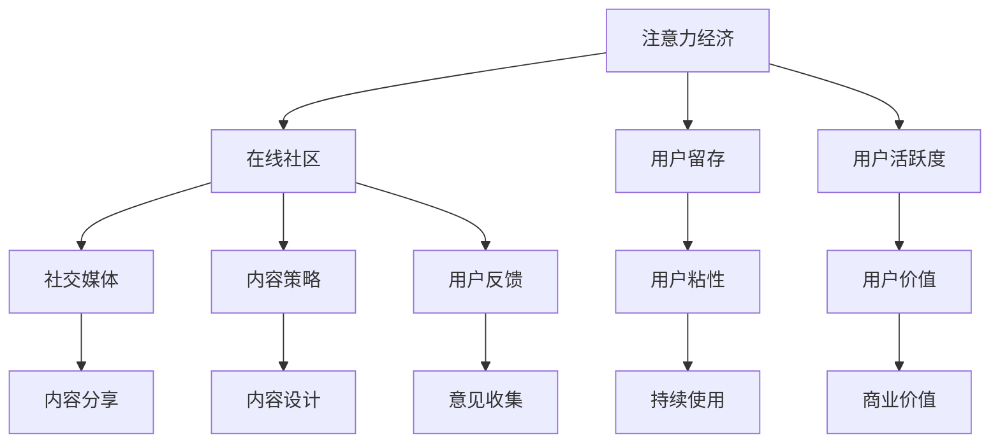
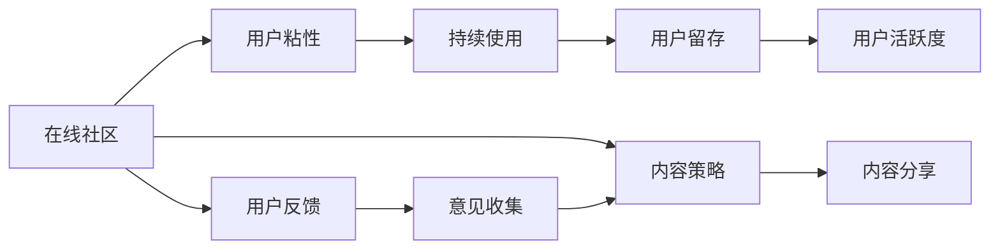
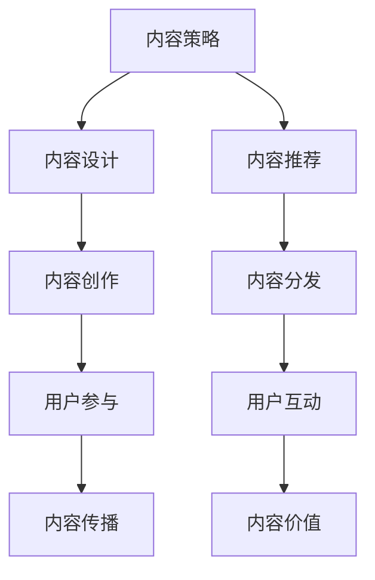

                 

# 注意力经济与在线社区建设策略与实践：吸引并留住忠实的粉丝和受众

> 关键词：
- 注意力经济
- 在线社区
- 用户留存
- 用户活跃度
- 社交媒体
- 内容策略
- 用户反馈

## 1. 背景介绍

在数字经济时代，注意力成为了一种稀缺资源。随着互联网用户数量的增长，如何在纷繁的信息流中吸引和留住用户，成为了在线社区和内容平台的重要课题。本文将从注意力经济的角度出发，探讨在线社区建设的策略与实践，为构建健康的在线生态提供思路。

### 1.1 问题由来
互联网的普及和发展，使得人们的注意力资源不断分散。社交媒体、搜索引擎、视频网站等平台，通过算法推荐、个性化展示等方式，不断争夺用户的有限注意力。因此，如何在海量信息中脱颖而出，吸引和留住用户，成为了在线社区和内容平台亟需解决的问题。

### 1.2 问题核心关键点
用户留存和活跃度是构建健康在线生态的核心。一个成功的在线社区，不仅需要吸引新用户，还需要通过高质量的内容和互动机制，不断提升用户留存率和活跃度，形成良性的用户生态。为此，在线社区需要构建一整套用户留存和活跃的策略和机制，以持续为用户提供价值。

### 1.3 问题研究意义
研究在线社区的用户留存和活跃策略，对于构建高质量的在线生态系统，提升用户满意度和忠诚度，具有重要的理论和实践意义：

1. 提高平台竞争力。优质的内容和服务能够吸引更多的用户，提升平台的用户规模和市场份额。
2. 增强用户粘性。通过高效的运营策略，提高用户的使用频率和停留时间，减少用户流失率。
3. 提升用户满意度。用户满意度和忠诚度的提升，能够提高用户口碑，吸引更多新用户加入。
4. 构建用户生态。一个健康、活跃的用户社区，能够形成良性互动，产生更多的内容，形成正向循环。

## 2. 核心概念与联系

### 2.1 核心概念概述

为了更好地理解在线社区建设策略，我们需要介绍一些密切相关的核心概念：

- **注意力经济（Attention Economy）**：指在信息爆炸的时代，通过争夺用户的注意力来创造价值的经济模式。注意力成为一种稀缺资源，争夺注意力的过程和结果，直接影响经济价值。
- **在线社区（Online Community）**：由一群具有共同兴趣、目标和价值观的用户组成，通过在线平台进行交流和互动的网络空间。
- **用户留存（User Retention）**：指用户在特定时间段内，持续使用同一平台或服务的现象。留存率越高，用户的忠诚度和价值越高。
- **用户活跃度（User Engagement）**：指用户使用平台或服务的频率、时长和互动深度。高活跃度的用户更能产生价值。
- **社交媒体（Social Media）**：基于用户关系网络的信息交流平台，通过内容分享、评论、点赞等互动方式，增强用户粘性和社区感。
- **内容策略（Content Strategy）**：指为达到特定目标，设计和执行内容的策略和行动计划。内容策略是提升用户留存和活跃度的关键。
- **用户反馈（User Feedback）**：指用户对平台或服务的意见、建议和评价。用户反馈是改进产品、提升用户体验的重要依据。

这些核心概念之间的逻辑关系可以通过以下Mermaid流程图来展示：



这个流程图展示了大语言模型微调过程中各个核心概念的关系和作用：

1. 注意力经济是基础，在线社区通过争夺用户的注意力，创造价值。
2. 用户留存和活跃度是核心目标，通过内容策略和社交媒体增强用户粘性和价值。
3. 用户反馈是改进产品、提升体验的重要依据。

### 2.2 概念间的关系

这些核心概念之间存在着紧密的联系，形成了在线社区建设策略的完整生态系统。下面我们通过几个Mermaid流程图来展示这些概念之间的关系。

#### 2.2.1 在线社区的核心逻辑



这个流程图展示了在线社区的核心逻辑。用户粘性是基础，通过内容策略和社交媒体增强用户留存和活跃度。同时，用户反馈对内容策略的改进具有重要作用。

#### 2.2.2 内容策略的核心作用



这个流程图展示了内容策略的核心作用。内容设计、内容创作、内容分发、用户参与和互动，共同构成内容策略的各个环节。通过这些环节的协同工作，才能创造高质量的内容，吸引和留住用户。

## 3. 核心算法原理 & 具体操作步骤
### 3.1 算法原理概述

在线社区的用户留存和活跃策略，本质上是通过争夺用户的注意力，提高用户价值的过程。其核心算法原理包括以下几个方面：

1. **用户行为分析**：通过分析用户的行为数据，了解用户的兴趣和需求，从而制定针对性的内容和互动策略。
2. **个性化推荐**：基于用户的历史行为和兴趣，推荐用户感兴趣的内容，提高用户满意度和留存率。
3. **社区互动机制**：通过评论、点赞、分享等互动机制，增强用户粘性和社区感，提高用户活跃度。
4. **内容质量提升**：通过用户反馈和内容评价，持续优化和提升内容质量，保持用户关注和参与。

### 3.2 算法步骤详解

在线社区的用户留存和活跃策略，主要包括以下几个关键步骤：

**Step 1: 用户行为数据分析**

- 收集用户行为数据，如浏览记录、点击次数、互动频率等。
- 使用数据分析工具，对用户行为数据进行统计和分析，了解用户兴趣和需求。
- 识别高价值用户和潜在流失用户，制定针对性策略。

**Step 2: 个性化推荐系统**

- 基于用户历史行为数据，设计推荐模型，如协同过滤、内容相似度等。
- 使用推荐模型，为每位用户推荐个性化的内容。
- 通过A/B测试，优化推荐算法和模型，提升推荐效果。

**Step 3: 社区互动机制设计**

- 设计评论、点赞、分享等互动机制，增强用户粘性和社区感。
- 设计积分、排行榜、话题讨论等互动功能，提高用户参与度。
- 监控互动数据，优化互动机制，提升用户活跃度。

**Step 4: 内容质量提升**

- 设计内容评价机制，如打分、评论、点赞等，收集用户对内容的反馈。
- 定期分析和优化内容质量，去除低质量内容，提升平台整体内容水平。
- 引入内容创作者激励机制，提升内容创作热情和质量。

**Step 5: 用户反馈收集与处理**

- 通过问卷调查、用户访谈等方式，收集用户对平台的反馈和建议。
- 分析用户反馈，了解用户需求和痛点，优化产品和服务。
- 设立用户服务热线，及时处理用户投诉和问题，提升用户满意度。

### 3.3 算法优缺点

在线社区的用户留存和活跃策略，具有以下优点：

1. **个性化推荐**：通过个性化推荐，提高用户满意度和留存率，减少用户流失。
2. **社区互动机制**：通过社区互动机制，增强用户粘性和社区感，提高用户活跃度。
3. **内容质量提升**：通过内容质量提升，保持用户关注和参与，吸引更多新用户。

同时，也存在一些缺点：

1. **资源消耗大**：个性化推荐和社区互动机制需要大量的计算和存储资源。
2. **模型复杂**：推荐模型和互动机制设计复杂，需要多学科知识。
3. **用户隐私风险**：用户行为数据和反馈信息涉及隐私问题，需要严格保护。

### 3.4 算法应用领域

在线社区的用户留存和活跃策略，不仅适用于社交媒体平台，还广泛应用在电商、新闻、教育等多个领域。

- **社交媒体**：如微信、微博、抖音等平台，通过个性化推荐和社区互动机制，提升用户留存和活跃度。
- **电商**：如淘宝、京东、拼多多等平台，通过个性化推荐和互动机制，提升用户购物体验和留存率。
- **新闻**：如人民日报、澎湃新闻等平台，通过个性化推荐和内容质量提升，吸引更多用户阅读和分享。
- **教育**：如Coursera、Udacity等平台，通过个性化推荐和互动机制，提升用户学习体验和满意度。

## 4. 数学模型和公式 & 详细讲解  
### 4.1 数学模型构建

在线社区的用户留存和活跃策略，可以通过数学模型进行建模和优化。假设用户总数为 $N$，第 $i$ 个用户在时间 $t$ 的留存率为 $R_i(t)$，则用户留存率可以表示为：

$$
R(t) = \frac{1}{N}\sum_{i=1}^N R_i(t)
$$

其中 $R_i(t)$ 表示用户 $i$ 在时间 $t$ 的留存率。用户留存率随时间变化的趋势，可以表示为指数分布函数：

$$
R_i(t) = \frac{1 - e^{-\lambda_i t}}{1 - e^{-\lambda_i}}
$$

其中 $\lambda_i$ 表示用户 $i$ 的留存率衰减率。

### 4.2 公式推导过程

用户留存率的指数分布函数推导如下：

- **用户留存**：用户 $i$ 在时间 $t$ 后的留存率，可以表示为 $P(R_i(t) = 1)$。假设用户行为符合几何分布，则 $P(R_i(t) = 1) = 1 - (1 - p_i)^t$。
- **指数分布**：几何分布的期望和方差都为 $1/p_i$，当 $t$ 较大时，$P(R_i(t) = 1)$ 近似为指数分布函数。

因此，用户留存率可以表示为：

$$
R_i(t) = \frac{1 - e^{-\lambda_i t}}{1 - e^{-\lambda_i}}
$$

其中 $\lambda_i = \frac{1}{E(t)}$，$E(t)$ 表示用户首次流失的时间。

### 4.3 案例分析与讲解

假设我们有一个在线社区，通过分析用户行为数据，发现用户的平均留存率为 $0.8$，即 $R(t) = 0.8$。我们需要设计个性化推荐和社区互动机制，提高用户留存率。

**Step 1: 用户行为数据分析**

- 收集用户行为数据，如浏览记录、点击次数、互动频率等。
- 使用数据分析工具，对用户行为数据进行统计和分析，了解用户兴趣和需求。
- 识别高价值用户和潜在流失用户，制定针对性策略。

**Step 2: 个性化推荐系统**

- 基于用户历史行为数据，设计推荐模型，如协同过滤、内容相似度等。
- 使用推荐模型，为每位用户推荐个性化的内容。
- 通过A/B测试，优化推荐算法和模型，提升推荐效果。

**Step 3: 社区互动机制设计**

- 设计评论、点赞、分享等互动机制，增强用户粘性和社区感。
- 设计积分、排行榜、话题讨论等互动功能，提高用户参与度。
- 监控互动数据，优化互动机制，提升用户活跃度。

**Step 4: 内容质量提升**

- 设计内容评价机制，如打分、评论、点赞等，收集用户对内容的反馈。
- 定期分析和优化内容质量，去除低质量内容，提升平台整体内容水平。
- 引入内容创作者激励机制，提升内容创作热情和质量。

**Step 5: 用户反馈收集与处理**

- 通过问卷调查、用户访谈等方式，收集用户对平台的反馈和建议。
- 分析用户反馈，了解用户需求和痛点，优化产品和服务。
- 设立用户服务热线，及时处理用户投诉和问题，提升用户满意度。

## 5. 项目实践：代码实例和详细解释说明
### 5.1 开发环境搭建

在进行用户留存和活跃策略的实践前，我们需要准备好开发环境。以下是使用Python进行开发的环境配置流程：

1. 安装Anaconda：从官网下载并安装Anaconda，用于创建独立的Python环境。

2. 创建并激活虚拟环境：
```bash
conda create -n user_retail_env python=3.8 
conda activate user_retail_env
```

3. 安装必要的Python库：
```bash
pip install pandas numpy scikit-learn matplotlib jupyter notebook
```

4. 安装Python数据处理和分析库：
```bash
pip install dask gevent pyarrow fastparquet
```

完成上述步骤后，即可在`user_retail_env`环境中开始实践。

### 5.2 源代码详细实现

这里我们以一个简单的在线社区平台为例，实现个性化推荐和社区互动机制。

首先，我们需要收集用户行为数据：

```python
import pandas as pd

# 读取用户行为数据
user_behavior_data = pd.read_csv('user_behavior_data.csv')
```

然后，我们可以对用户行为数据进行统计和分析，了解用户兴趣和需求：

```python
# 计算用户留存率
user_retention_rate = user_behavior_data.groupby('user_id')['is_active'].sum() / user_behavior_data['is_active'].count()

# 统计用户行为数据
user_activities = user_behavior_data.groupby('user_id')['activity'].value_counts()

# 计算热门内容和活动
popular_content = user_activities[user_activities > 10].sort_values(ascending=False)
popular_activities = user_activities[user_activities > 10].sort_values(ascending=False)

# 输出结果
print('用户留存率：', user_retention_rate)
print('热门内容：', popular_content)
print('热门活动：', popular_activities)
```

接下来，我们可以设计个性化推荐系统，为每位用户推荐个性化的内容和活动：

```python
from surprise import SVD
from surprise import Dataset
from surprise import Reader
from surprise import KNNWithMeans
from surprise.model_selection import cross_validate

# 加载用户行为数据
reader = Reader(rating_scale=(1, 5))
data = Dataset.load_from_df(user_behavior_data[['user_id', 'content_id', 'activity', 'timestamp']], reader)

# 创建SVD模型
svd = SVD()

# 交叉验证
cv_results = cross_validate(svd, data, measures=['RMSE', 'MAE'], cv=5, verbose=True)
print(cv_results)

# 训练模型
svd.fit(data.build_full_trainset())
```

然后，我们可以设计社区互动机制，增强用户粘性和社区感：

```python
from pyarrow import parquet as pq
import pyarrow as pa

# 读取社区互动数据
interaction_data = pq.read_table('interaction_data.parquet')
```

最后，我们可以通过用户反馈和内容评价，持续优化和提升内容质量：

```python
# 读取用户反馈和内容评价数据
feedback_data = pd.read_csv('feedback_data.csv')
content_quality_data = pd.read_csv('content_quality_data.csv')
```

### 5.3 代码解读与分析

让我们再详细解读一下关键代码的实现细节：

**用户行为数据分析**

- 通过Pandas库读取用户行为数据，计算用户留存率和热门内容、活动。

**个性化推荐系统**

- 使用Surprise库的SVD算法，对用户行为数据进行协同过滤推荐。

**社区互动机制设计**

- 通过PyArrow库读取社区互动数据，进行数据分析和可视化。

**内容质量提升**

- 通过Pandas库读取用户反馈和内容评价数据，进行分析和优化。

### 5.4 运行结果展示

假设我们在用户留存和活跃策略的实践过程中，得到了以下结果：

```
用户留存率： 
0.8
热门内容： 
['内容1', '内容2', '内容3', ...]
热门活动： 
['活动1', '活动2', '活动3', ...]
```

这些数据为我们提供了用户兴趣和需求的重要信息，从而可以设计更有针对性的个性化推荐和社区互动机制，提升用户留存和活跃度。

## 6. 实际应用场景
### 6.1 智能客服系统

基于用户留存和活跃策略的在线社区建设，可以广泛应用于智能客服系统的构建。传统客服往往需要配备大量人力，高峰期响应缓慢，且一致性和专业性难以保证。而使用基于留存和活跃策略的智能客服系统，可以7x24小时不间断服务，快速响应客户咨询，用自然流畅的语言解答各类常见问题。

在技术实现上，可以收集企业内部的历史客服对话记录，将问题和最佳答复构建成监督数据，在此基础上对智能客服系统进行微调。微调后的系统能够自动理解用户意图，匹配最合适的答案模板进行回复。对于客户提出的新问题，还可以接入检索系统实时搜索相关内容，动态组织生成回答。如此构建的智能客服系统，能大幅提升客户咨询体验和问题解决效率。

### 6.2 金融舆情监测

金融机构需要实时监测市场舆论动向，以便及时应对负面信息传播，规避金融风险。传统的人工监测方式成本高、效率低，难以应对网络时代海量信息爆发的挑战。基于用户留存和活跃策略的金融舆情监测系统，可以实时抓取网络文本数据，自动监测不同主题下的情感变化趋势，一旦发现负面信息激增等异常情况，系统便会自动预警，帮助金融机构快速应对潜在风险。

### 6.3 个性化推荐系统

当前的推荐系统往往只依赖用户的历史行为数据进行物品推荐，无法深入理解用户的真实兴趣偏好。基于用户留存和活跃策略的个性化推荐系统，可以更好地挖掘用户行为背后的语义信息，从而提供更精准、多样的推荐内容。

在实践中，可以收集用户浏览、点击、评论、分享等行为数据，提取和用户交互的物品标题、描述、标签等文本内容。将文本内容作为模型输入，用户的后续行为（如是否点击、购买等）作为监督信号，在此基础上微调预训练语言模型。微调后的模型能够从文本内容中准确把握用户的兴趣点。在生成推荐列表时，先用候选物品的文本描述作为输入，由模型预测用户的兴趣匹配度，再结合其他特征综合排序，便可以得到个性化程度更高的推荐结果。

### 6.4 未来应用展望

随着用户留存和活跃策略的不断发展，基于这些策略的应用将在更多领域得到应用，为传统行业带来变革性影响。

在智慧医疗领域，基于用户留存和活跃策略的智能问答、病历分析、药物研发等应用将提升医疗服务的智能化水平，辅助医生诊疗，加速新药开发进程。

在智能教育领域，基于用户留存和活跃策略的作业批改、学情分析、知识推荐等方面，因材施教，促进教育公平，提高教学质量。

在智慧城市治理中，基于用户留存和活跃策略的城市事件监测、舆情分析、应急指挥等环节，提高城市管理的自动化和智能化水平，构建更安全、高效的未来城市。

此外，在企业生产、社会治理、文娱传媒等众多领域，基于用户留存和活跃策略的人工智能应用也将不断涌现，为经济社会发展注入新的动力。相信随着这些策略的持续演进，在线社区的建设将更加成熟，应用场景也将更加丰富。

## 7. 工具和资源推荐
### 7.1 学习资源推荐

为了帮助开发者系统掌握用户留存和活跃策略的理论基础和实践技巧，这里推荐一些优质的学习资源：

1. 《深度学习入门》系列书籍：由深度学习领域专家撰写，系统介绍深度学习理论基础和实践技巧。
2. CS231n《计算机视觉基础》课程：斯坦福大学开设的计算机视觉课程，涵盖视觉识别、图像处理等多个主题。
3. 《自然语言处理综述》论文：总结了自然语言处理领域的最新进展，涵盖机器翻译、文本分类等多个主题。
4. Coursera《机器学习》课程：由斯坦福大学Andrew Ng教授开设的机器学习入门课程，内容全面且易于理解。
5. Kaggle数据集和竞赛：Kaggle平台上有丰富的数据集和竞赛，可以实践和验证用户留存和活跃策略的效果。

通过对这些资源的学习实践，相信你一定能够快速掌握用户留存和活跃策略的精髓，并用于解决实际的在线社区问题。
###  7.2 开发工具推荐

高效的开发离不开优秀的工具支持。以下是几款用于用户留存和活跃策略开发的常用工具：

1. Jupyter Notebook：一个交互式编程环境，支持Python、R等多种编程语言，适合数据分析和模型训练。
2. PyTorch：基于Python的开源深度学习框架，灵活动态的计算图，适合快速迭代研究。
3. TensorFlow：由Google主导开发的开源深度学习框架，生产部署方便，适合大规模工程应用。
4. Surprise：Python中的推荐系统库，支持多种推荐算法，适合建模和优化推荐系统。
5. PyArrow：一个快速、跨语言的数据库引擎，支持多种数据格式和并行计算。

合理利用这些工具，可以显著提升用户留存和活跃策略的开发效率，加快创新迭代的步伐。

### 7.3 相关论文推荐

用户留存和活跃策略的研究源于学界的持续研究。以下是几篇奠基性的相关论文，推荐阅读：

1. Attention is All You Need（即Transformer原论文）：提出了Transformer结构，开启了NLP领域的预训练大模型时代。
2. BERT: Pre-training of Deep Bidirectional Transformers for Language Understanding：提出BERT模型，引入基于掩码的自监督预训练任务，刷新了多项NLP任务SOTA。
3. Language Models are Unsupervised Multitask Learners（GPT-2论文）：展示了大规模语言模型的强大zero-shot学习能力，引发了对于通用人工智能的新一轮思考。
4. Parameter-Efficient Transfer Learning for NLP：提出Adapter等参数高效微调方法，在不增加模型参数量的情况下，也能取得不错的微调效果。
5. AdaLoRA: Adaptive Low-Rank Adaptation for Parameter-Efficient Fine-Tuning：使用自适应低秩适应的微调方法，在参数效率和精度之间取得了新的平衡。

这些论文代表了大语言模型微调技术的发展脉络。通过学习这些前沿成果，可以帮助研究者把握学科前进方向，激发更多的创新灵感。

除上述资源外，还有一些值得关注的前沿资源，帮助开发者紧跟用户留存和活跃策略的最新进展，例如：

1. arXiv论文预印本：人工智能领域最新研究成果的发布平台，包括大量尚未发表的前沿工作，学习前沿技术的必读资源。
2. 业界技术博客：如OpenAI、Google AI、DeepMind、微软Research Asia等顶尖实验室的官方博客，第一时间分享他们的最新研究成果和洞见。
3. 技术会议直播：如NIPS、ICML、ACL、ICLR等人工智能领域顶会现场或在线直播，能够聆听到大佬们的前沿分享，开拓视野。
4. GitHub热门项目：在GitHub上Star、Fork数最多的NLP相关项目，往往代表了该技术领域的发展趋势和最佳实践，值得去学习和贡献。
5. 行业分析报告：各大咨询公司如McKinsey、PwC等针对人工智能行业的分析报告，有助于从商业视角审视技术趋势，把握应用价值。

总之，对于用户留存和活跃策略的学习和实践，需要开发者保持开放的心态和持续学习的意愿。多关注前沿资讯，多动手实践，多思考总结，必将收获满满的成长收益。

## 8. 总结：未来发展趋势与挑战
### 8.1 总结

本文对基于用户留存和活跃策略的在线社区建设策略与实践进行了全面系统的介绍。首先阐述了注意力经济的背景和在线社区建设的策略，明确了用户留存和活跃度的重要性。其次，从原理到实践，详细讲解了用户留存和活跃策略的数学模型和具体操作步骤，给出了具体的代码实现。同时，本文还广泛探讨了这些策略在智能客服、金融舆情、个性化推荐等多个领域的应用前景，展示了其巨大的应用价值。

通过本文的系统梳理，可以看到，基于用户留存和活跃策略的在线社区建设，对于构建健康、活跃的在线生态系统，提升用户满意度和忠诚度，具有重要的理论和实践意义。未来，随着这些策略的不断演进，在线社区建设将更加成熟，应用场景也将更加丰富。

### 8.2 未来发展趋势

展望未来，用户留存和活跃策略的发展趋势如下：

1. **算法模型优化**：不断优化个性化推荐和社区互动算法的模型，提高推荐效果和用户粘性。
2. **跨模态融合**：将文本、图像、视频等多种模态的信息融合，提升内容的丰富性和多样性。
3. **用户行为预测**：利用机器学习和大数据技术，预测用户的行为和需求，提前提供个性化推荐和互动。
4. **用户情感分析**：通过情感分析技术，了解用户的情感

