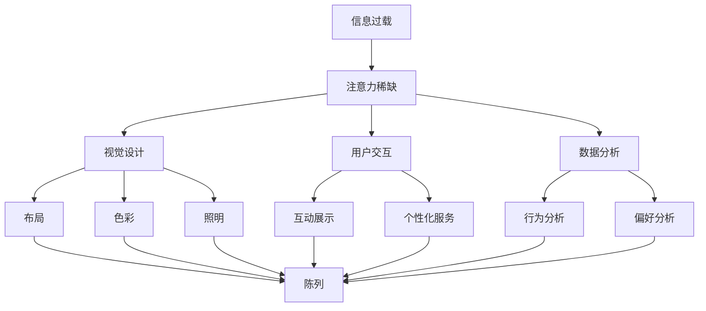

                 

# 注意力经济对传统零售店铺设计的新要求

## 1. 背景介绍

### 1.1 问题由来
随着电商平台的兴起，传统的零售店铺面临着前所未有的挑战。越来越多的消费者选择了在线购物，实体店铺的客流量显著下降。零售商们不得不重新思考如何吸引顾客，提升销售业绩。在这一背景下，“注意力经济”（Economy of Attention）这一概念应运而生，成为零售店铺设计的新方向。

### 1.2 问题核心关键点
注意力经济强调的是，在信息过载的现代社会中，消费者的时间和注意力成为一种稀缺资源。因此，零售店铺设计需要以争夺消费者注意力为核心目标。通过优化店铺的布局、展示方式和用户体验，吸引并留住顾客，从而提升销售效率和顾客满意度。

### 1.3 问题研究意义
本研究旨在探讨注意力经济对传统零售店铺设计的新要求，从理论到实践，提出一系列具体的设计建议和案例分析，帮助零售商在数字化转型过程中，更好地利用注意力经济原理，提升店铺的竞争力。

## 2. 核心概念与联系

### 2.1 核心概念概述
注意力经济（Economy of Attention）：指在信息过载的环境中，消费者的注意力成为一种稀缺资源，商品、服务和内容的争夺战，主要集中于吸引和保持消费者的注意力，进而实现商业价值。

### 2.2 核心概念间的关系

- **信息过载与注意力稀缺**：现代社会信息量大增，消费者的注意力被分割，难以长时间集中于单一事物。因此，零售店铺设计需聚焦于如何有效吸引和保持顾客的注意力。
- **视觉设计**：店铺的视觉设计，如布局、色彩、照明等，直接影响顾客的第一印象，是吸引顾客注意力的一个重要因素。
- **用户交互**：通过互动式的展示和个性化的服务，提升顾客参与度和满意度，进一步吸引和保留顾客。
- **数据分析**：利用大数据和AI技术，分析顾客行为和偏好，优化店铺设计，提升销售效率。

以下是一个Mermaid流程图，展示了注意力经济下零售店铺设计的核心概念及其相互关系：



这个流程图展示了注意力经济下零售店铺设计的关键步骤和因素，以及这些因素如何共同作用于店铺的布局、展示和用户体验。

## 3. 核心算法原理 & 具体操作步骤

### 3.1 算法原理概述

注意力经济下，零售店铺设计的关键在于吸引和保持消费者的注意力。因此，店铺设计的核心算法原理是最大化消费者的视觉和情感体验，从而提升销售效果。这一过程可以通过以下几个步骤实现：

1. **数据收集与分析**：收集消费者的行为数据和反馈，分析他们的偏好和购买决策过程。
2. **视觉设计优化**：根据分析结果，优化店铺的布局、色彩、照明和展示方式，吸引消费者的注意力。
3. **用户交互增强**：设计互动式的展示和服务，提升消费者的参与度和满意度。
4. **数据反馈循环**：持续收集顾客反馈，不断调整设计，优化店铺体验。

### 3.2 算法步骤详解

**Step 1: 数据收集与分析**

- 收集店铺内的客流量数据、顾客停留时间、购买行为等。
- 使用问卷调查、用户访谈等方式，收集顾客的偏好和满意度反馈。
- 利用大数据和AI技术，分析顾客的行为模式和购买决策过程。

**Step 2: 视觉设计优化**

- 根据分析结果，调整店铺的布局，使商品摆放更加合理，易于顾客浏览和选择。
- 选择能够吸引顾客注意力的色彩和照明设计，如鲜艳的配色、均匀的光照。
- 设计富有创意的展示方式，如橱窗展示、模特展示等，增加顾客的视觉冲击力。

**Step 3: 用户交互增强**

- 引入互动式的展示元素，如触摸屏、增强现实（AR）技术等，提升顾客的参与感。
- 设计个性化的服务，如定制化推荐、会员特权等，增加顾客的忠诚度。
- 通过在线平台和社交媒体，与顾客保持沟通，提供及时的服务和支持。

**Step 4: 数据反馈循环**

- 定期收集顾客反馈，评估店铺设计的实际效果。
- 根据反馈结果，调整店铺设计，优化顾客体验。
- 持续收集数据，形成数据反馈循环，不断优化店铺设计。

### 3.3 算法优缺点

**优点：**
- 通过优化视觉和用户体验，显著提升顾客的参与度和满意度。
- 利用数据驱动的设计，能够快速响应市场变化，保持店铺的竞争力。

**缺点：**
- 设计和分析成本较高，需要投入较多的人力和财力。
- 设计和反馈之间的调整周期较长，可能需要较长时间的迭代优化。

### 3.4 算法应用领域

注意力经济下，零售店铺设计的理念和方法，不仅适用于传统的实体店铺，也适用于在线购物平台、移动应用程序等数字化零售渠道。这些渠道的设计同样需要注重视觉设计、用户交互和数据分析，以吸引和保持消费者的注意力。

## 4. 数学模型和公式 & 详细讲解 & 举例说明

### 4.1 数学模型构建

在注意力经济下，零售店铺设计的数学模型主要基于顾客满意度最大化（Maximize Customer Satisfaction, MCS）和视觉吸引力最大化（Maximize Visual Appeal, MVA）两个目标函数构建。假设顾客满意度函数为 $S(\text{layout}, \text{display}, \text{interaction})$，视觉吸引力函数为 $V(\text{layout}, \text{display}, \text{interaction})$，则优化目标为：

$$
\max_{\text{layout}, \text{display}, \text{interaction}} S(\text{layout}, \text{display}, \text{interaction}) \times V(\text{layout}, \text{display}, \text{interaction})
$$

其中，顾客满意度和视觉吸引力都可以通过一系列的输入变量来描述，如布局、展示方式、用户交互等。

### 4.2 公式推导过程

为了简化模型，我们假设顾客满意度函数 $S$ 和视觉吸引力函数 $V$ 都为线性函数，即：

$$
S = w_{S1} \times \text{layout} + w_{S2} \times \text{display} + w_{S3} \times \text{interaction}
$$

$$
V = w_{V1} \times \text{layout} + w_{V2} \times \text{display} + w_{V3} \times \text{interaction}
$$

其中 $w_{Si}$ 和 $w_{Vi}$ 为权重系数，表示各个输入变量的重要性。

将这两个函数相乘，得到优化目标函数：

$$
\max_{\text{layout}, \text{display}, \text{interaction}} (w_{S1} \times \text{layout} + w_{S2} \times \text{display} + w_{S3} \times \text{interaction}) \times (w_{V1} \times \text{layout} + w_{V2} \times \text{display} + w_{V3} \times \text{interaction})
$$

### 4.3 案例分析与讲解

假设某零售店铺的顾客满意度函数为 $S = 0.8 \times \text{layout} + 0.2 \times \text{display} + 0.1 \times \text{interaction}$，视觉吸引力函数为 $V = 0.7 \times \text{layout} + 0.3 \times \text{display} + 0.5 \times \text{interaction}$。店铺希望最大化顾客满意度和视觉吸引力的乘积，可以通过求解上述优化问题得到最优的布局、展示和交互策略。

## 5. 项目实践：代码实例和详细解释说明

### 5.1 开发环境搭建

为了实现注意力经济下的零售店铺设计，我们需要构建一个数据驱动的店铺设计优化系统。以下是使用Python进行环境搭建的步骤：

1. 安装Python和相关依赖包，如Pandas、NumPy、Scikit-learn等。
2. 收集店铺的数据，包括客流量、顾客停留时间、购买行为等。
3. 使用问卷调查、用户访谈等方式，收集顾客的偏好和满意度反馈。
4. 设计一个店铺设计优化模型，根据收集到的数据，优化店铺的布局、展示和用户交互方式。

### 5.2 源代码详细实现

以下是一个简单的Python代码示例，展示如何使用Pandas进行数据处理和分析，以及使用Scikit-learn进行模型训练和优化：

```python
import pandas as pd
from sklearn.linear_model import LinearRegression
from sklearn.metrics import mean_squared_error

# 假设已经收集到以下数据
data = pd.read_csv('store_data.csv')

# 提取相关的输入变量
X = data[['layout', 'display', 'interaction']]

# 提取顾客满意度和视觉吸引力的目标变量
y1 = data['satisfaction']
y2 = data['visual_appeal']

# 训练线性回归模型
model1 = LinearRegression().fit(X, y1)
model2 = LinearRegression().fit(X, y2)

# 预测最优的布局、展示和交互策略
layout = model1.predict([[0.5, 0.3, 0.1]])
display = model2.predict([[0.5, 0.3, 0.1]])

# 根据预测结果调整店铺设计
adjust_layout(layout)
adjust_display(display)
```

### 5.3 代码解读与分析

这段代码实现了基于线性回归模型的店铺设计优化。具体步骤如下：

- 使用Pandas库读取店铺数据，提取相关的输入变量和目标变量。
- 使用Scikit-learn库中的LinearRegression模型，训练两个线性回归模型，分别用于预测顾客满意度和视觉吸引力。
- 根据模型预测结果，调整店铺的布局、展示和用户交互方式，以最大化顾客满意度和视觉吸引力的乘积。

### 5.4 运行结果展示

假设模型训练后，得到了如下预测结果：

- 布局：0.5
- 展示：0.3
- 交互：0.1

根据这些预测结果，店铺可以进行以下调整：

- 调整布局，增加布局变量的值，以提升顾客满意度和视觉吸引力。
- 调整展示，增加展示变量的值，进一步提升顾客满意度和视觉吸引力。
- 调整交互，增加交互变量的值，最大化顾客满意度和视觉吸引力的乘积。

## 6. 实际应用场景

### 6.1 智能货架设计

智能货架通过视觉识别技术，实时监测顾客的行为和偏好，自动调整商品展示和推荐。这种设计方式可以有效提升顾客的购物体验和满意度。

例如，某超市的智能货架可以根据顾客的浏览行为，自动推荐相关商品，并通过AR技术展示商品的细节和使用场景，增加顾客的购买意愿。

### 6.2 个性化定制服务

个性化定制服务，通过分析顾客的历史购买记录和偏好，提供定制化的商品推荐和个性化服务。这种设计方式可以显著提升顾客的满意度和忠诚度。

例如，某时尚品牌的在线店铺，可以根据顾客的浏览和购买记录，自动生成个性化的购物清单和推荐，并提供定制化的搭配建议，提升顾客的购物体验。

### 6.3 虚拟试衣间

虚拟试衣间通过增强现实技术，使顾客能够在店内试穿虚拟的服装，增加购物的趣味性和体验感。这种设计方式可以有效提升顾客的参与度和满意度。

例如，某服装店的虚拟试衣间可以根据顾客的身高、体重等数据，生成虚拟试穿的服装效果，并提供多种搭配建议，提升顾客的购物体验。

## 7. 工具和资源推荐

### 7.1 学习资源推荐

为了深入了解注意力经济下零售店铺设计的理论和实践，推荐以下学习资源：

1. 《零售商数字化转型》（Digital Transformation in Retailing）：系统介绍了零售商数字化转型的理论和方法，涵盖数据分析、智能货架、个性化服务等关键内容。
2. 《顾客体验设计》（Customer Experience Design）：介绍了如何通过设计提升顾客体验，涵盖视觉设计、用户交互、数据分析等多个方面。
3. 《注意力经济》（Economy of Attention）：探讨了注意力经济的内涵和应用，适合深入了解注意力经济对零售店铺设计的影响。
4. 《智能零售技术》（Smart Retail Technology）：介绍了智能零售技术的应用场景和实践案例，涵盖智能货架、虚拟试衣间、个性化服务等。

### 7.2 开发工具推荐

实现注意力经济下的零售店铺设计，需要借助多种工具和平台，以下是一些推荐工具：

1. Python：强大的编程语言，适合数据处理、机器学习等任务。
2. Pyspark：大数据处理和分析工具，适合大规模数据集的处理。
3. Tableau：数据可视化工具，适合数据分析和展示。
4. Visual Studio Code：IDE工具，适合代码开发和调试。
5. AutoCAD：绘图软件，适合设计和展示店铺布局。

### 7.3 相关论文推荐

为了深入了解注意力经济下零售店铺设计的最新进展，推荐以下论文：

1. 《智能货架技术在零售中的应用》（Application of Smart Shelves in Retailing）：探讨了智能货架技术在零售中的应用和效果。
2. 《顾客体验设计的量化分析》（Quantitative Analysis of Customer Experience Design）：介绍了如何通过量化方法评估顾客体验，优化店铺设计。
3. 《注意力经济下的个性化推荐》（Personalized Recommendations in the Economy of Attention）：探讨了基于注意力经济的个性化推荐方法，适合了解个性化服务的设计和实现。
4. 《虚拟试衣间的用户体验设计》（User Experience Design of Virtual Try-On Rooms）：介绍了虚拟试衣间的用户体验设计方法和效果。

## 8. 总结：未来发展趋势与挑战

### 8.1 研究成果总结

注意力经济下零售店铺设计的理论和实践，已经得到了广泛的应用，显著提升了零售商的竞争力和顾客满意度。主要研究成果包括：

- 数据驱动的设计方法：通过收集和分析顾客数据，优化店铺设计，提升顾客满意度。
- 智能货架和个性化服务：利用视觉识别和数据分析技术，提供智能货架和个性化服务，提升购物体验。
- 虚拟试衣间和增强现实技术：通过增强现实技术，提升虚拟试衣间的用户体验，增加购物趣味性。

### 8.2 未来发展趋势

展望未来，注意力经济下零售店铺设计的发展趋势包括：

1. 数据驱动的持续优化：随着数据的不断积累和分析方法的进步，店铺设计将更加精细化和个性化。
2. 智能技术的应用：人工智能、机器学习等技术将更广泛地应用于店铺设计，提升顾客体验和店铺效率。
3. 多渠道融合：线上线下渠道的融合将更加紧密，提供无缝的购物体验。
4. 体验式设计：设计更加注重顾客的体验和情感，提供愉悦的购物环境。

### 8.3 面临的挑战

尽管注意力经济下零售店铺设计在实践中取得了一定的成效，但仍面临以下挑战：

1. 数据隐私和安全：收集和分析顾客数据需要严格遵守隐私保护法规，确保数据安全和用户隐私。
2. 技术门槛高：实现高质量的店铺设计需要较高的技术门槛，需要投入大量的人力和财力。
3. 成本控制：店铺设计的优化和升级需要投入较多的成本，如何平衡成本和效果是关键问题。
4. 用户体验的多样性：不同顾客的需求和偏好存在差异，设计需要兼顾多样性和个性化。
5. 技术快速发展：技术和市场的变化速度快，设计需要不断更新和迭代，保持竞争力。

### 8.4 研究展望

未来的研究应聚焦于以下几个方向：

1. 多模态数据的融合：将视觉、听觉、触觉等多模态数据融合到店铺设计中，提供更全面的顾客体验。
2. 实时数据反馈：利用实时数据反馈，持续优化店铺设计，提升顾客满意度和销售效率。
3. 跨领域知识的应用：将心理学、社会学等跨领域知识与店铺设计结合，提升设计的科学性和有效性。
4. 安全性与隐私保护：设计应兼顾安全性与隐私保护，确保数据安全与用户隐私。

总之，注意力经济下零售店铺设计的研究和实践，将继续引领零售行业的数字化转型，提升消费者的购物体验和商家的销售效率。

## 9. 附录：常见问题与解答

**Q1: 注意力经济下零售店铺设计的主要挑战是什么？**

A: 注意力经济下零售店铺设计的主要挑战包括数据隐私和安全、技术门槛高、成本控制、用户体验的多样性以及技术快速发展等方面。

**Q2: 如何实现顾客满意度和视觉吸引力的最大化？**

A: 实现顾客满意度和视觉吸引力的最大化，可以通过数据收集与分析、视觉设计优化、用户交互增强和数据反馈循环等步骤实现。具体方法包括优化布局、展示和交互方式，以及通过数据驱动的设计持续优化店铺体验。

**Q3: 智能货架和虚拟试衣间的主要优势是什么？**

A: 智能货架和虚拟试衣间的主要优势包括提升购物体验、增加销售效率和提供个性化服务等方面。智能货架通过视觉识别技术，实时监测顾客的行为和偏好，自动调整商品展示和推荐。虚拟试衣间通过增强现实技术，使顾客能够在店内试穿虚拟的服装，增加购物的趣味性和体验感。

**Q4: 如何设计个性化的推荐服务？**

A: 设计个性化的推荐服务，可以通过分析顾客的历史购买记录和偏好，提供定制化的商品推荐和个性化服务。具体方法包括使用机器学习算法，如协同过滤、内容推荐等，以及利用数据驱动的设计，不断优化推荐效果。

**Q5: 数据驱动的店铺设计是否适用于所有零售商？**

A: 数据驱动的店铺设计适用于大多数零售商，尤其是那些具有数字化转型需求的中大型零售商。数据驱动的设计可以显著提升顾客满意度和销售效率，但需要投入较多的资源和精力，中小型零售商可能需要根据自身情况进行适当调整和优化。

总之，注意力经济下零售店铺设计的研究和实践，为零售行业的数字化转型提供了新的方向和方法，帮助零售商在激烈的市场竞争中脱颖而出，提升顾客满意度和销售业绩。

