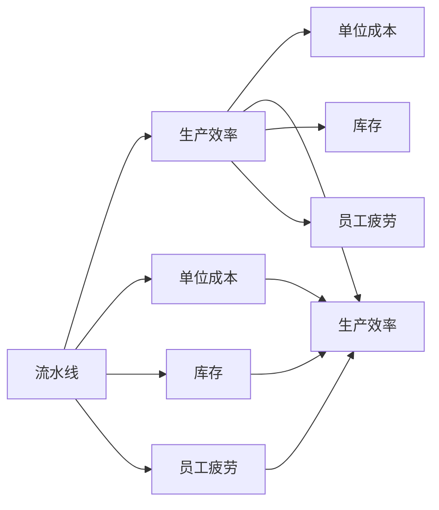

                 

## 1. 背景介绍

在现代制造业中，流水线（production line）作为一种高效的生产方式，被广泛应用于汽车、电子产品、食品加工等行业。流水线通过分工协作，使得生产效率大大提升，缩短了生产周期，降低了成本，并且提高了产品质量的一致性。然而，流水线的引入并不是没有问题的，它也带来了一些负面的影响，如员工疲劳、单件生产效率低下、生产线的柔性不足等。本文将深入探讨流水线对生产效率的影响，包括其优势和劣势，并提出一些优化建议。

## 2. 核心概念与联系

### 2.1 核心概念概述

**流水线（Production Line）**：在制造行业中，流水线是一种将生产流程分解为多个环节，由多个工人按照顺序进行作业的生产方式。每个环节的任务相对简单，生产效率高，整体生产效率得到提升。

**生产效率（Productivity）**：指在单位时间内生产的产品的数量，是衡量企业或生产线生产能力的重要指标。

**单位成本（Unit Cost）**：生产一个单位产品所需的总成本，包括原材料、劳动力、设备、能源等费用。

**库存（Inventory）**：为应对需求波动而储备的待售产品，库存水平会影响生产效率和单位成本。

**员工疲劳（Worker Fatigue）**：由于长时间重复作业或工作强度大而导致的员工体力和心理上的疲劳，影响生产效率。

**生产线的柔性（Flexibility）**：生产线能够快速调整生产任务的能力，柔性越强，生产线的适应性越好。

这些核心概念之间的逻辑关系可以通过以下Mermaid流程图来展示：



这个流程图展示了大生产线和生产效率之间的联系，以及它们对其他相关指标的影响。

### 2.2 概念间的关系

**流水线和生产效率**：流水线通过分工协作，使得生产效率大大提升，缩短了生产周期，降低了成本，并且提高了产品质量的一致性。

**流水线和单位成本**：流水线通过规模化生产，降低了单位成本，但需要大量初始投资，包括设备、设备维护等。

**流水线和库存**：流水线需要保持一定库存水平以应对需求波动，库存过高会占用资金，增加成本；库存过低则会导致生产中断，影响生产效率。

**流水线和员工疲劳**：流水线需要员工长时间重复作业，容易导致员工疲劳，影响生产效率和产品质量。

**生产线和生产线的柔性**：流水线通常专注于特定产品的生产，柔性不足，难以快速应对市场需求变化。

## 3. 核心算法原理 & 具体操作步骤

### 3.1 算法原理概述

流水线对生产效率的影响可以通过数学模型进行分析和优化。我们以一个简单的流水线为例，假设流水线由$m$个环节组成，每个环节的生产速度为$v_i$（$i=1,...,m$），单位成本为$c_i$，每单位产品所需材料成本为$k_i$，生产线初始化固定成本为$C_0$。流水线的生产效率（单位时间内生产的单位产品数量）可以表示为：

$$ \text{生产效率} = \frac{\text{单位时间} \times \text{每个环节的生产速度} \times m}{1 + \text{单位时间} \times \text{材料成本} \times \text{单位产品所需材料成本} \times \text{每个环节的材料成本}} $$

流水线的单位成本（总成本除以生产数量）可以表示为：

$$ \text{单位成本} = \frac{\text{固定成本} + \text{单位时间} \times \text{每个环节的成本} \times m}{\text{生产数量}} $$

流水线的库存水平可以通过需求预测、生产计划等方法进行优化，以平衡生产效率和单位成本。

### 3.2 算法步骤详解

**Step 1: 准备数据**

- 收集生产线的各个环节的生产速度、单位成本、材料成本等数据。
- 分析需求预测数据，确定生产计划。

**Step 2: 计算生产效率**

- 根据每个环节的生产速度，计算流水线的整体生产效率。
- 根据单位成本和需求预测，计算单位时间内的生产数量。

**Step 3: 优化单位成本**

- 根据生产效率和单位成本，计算总成本。
- 通过调整生产计划、优化设备配置等方法，降低单位成本。

**Step 4: 调整库存水平**

- 根据生产效率和需求预测，确定最优库存水平。
- 通过定期检查库存，确保库存水平在合理范围内。

**Step 5: 减少员工疲劳**

- 优化作业流程，减少重复性高的作业。
- 调整生产计划，确保员工有足够的休息时间。

**Step 6: 增强生产线柔性**

- 根据市场需求变化，灵活调整生产计划。
- 引入柔性制造单元（Flexible Manufacturing Units, FMUs），提升生产线适应性。

### 3.3 算法优缺点

流水线对生产效率的影响具有以下优点：

1. **提高生产效率**：流水线通过分工协作，使得生产效率大大提升。
2. **降低单位成本**：流水线通过规模化生产，降低了单位成本。
3. **提高产品质量一致性**：流水线生产方式使得产品质量更加一致。

同时，流水线也存在以下缺点：

1. **初始投资大**：流水线需要大量初始投资，包括设备、设备维护等。
2. **库存管理复杂**：流水线需要保持一定库存水平以应对需求波动，库存管理复杂。
3. **柔性不足**：流水线通常专注于特定产品的生产，柔性不足，难以快速应对市场需求变化。
4. **员工疲劳**：流水线需要员工长时间重复作业，容易导致员工疲劳，影响生产效率和产品质量。

### 3.4 算法应用领域

流水线在制造业中的应用非常广泛，涵盖了汽车、电子产品、食品加工、纺织等多个行业。通过流水线，这些行业实现了高效的生产方式，提高了生产效率，降低了成本，增强了产品质量一致性。

## 4. 数学模型和公式 & 详细讲解 & 举例说明

### 4.1 数学模型构建

假设一个流水线由$m$个环节组成，每个环节的生产速度为$v_i$（$i=1,...,m$），单位成本为$c_i$，每单位产品所需材料成本为$k_i$，生产线初始化固定成本为$C_0$。流水线的生产效率（单位时间内生产的单位产品数量）可以表示为：

$$ \text{生产效率} = \frac{\text{单位时间} \times \text{每个环节的生产速度} \times m}{1 + \text{单位时间} \times \text{材料成本} \times \text{单位产品所需材料成本} \times \text{每个环节的材料成本}} $$

流水线的单位成本（总成本除以生产数量）可以表示为：

$$ \text{单位成本} = \frac{\text{固定成本} + \text{单位时间} \times \text{每个环节的成本} \times m}{\text{生产数量}} $$

其中：

$$ \text{固定成本} = C_0 $$
$$ \text{单位时间} = t $$
$$ \text{每个环节的成本} = v_i \times c_i + k_i \times k_i $$

### 4.2 公式推导过程

以上公式的推导过程如下：

1. 流水线的生产效率可以表示为每个环节的生产速度乘以环节数，然后除以单位时间。
2. 单位时间内生产的单位产品数量除以单位成本，得到单位成本。
3. 固定成本加上单位时间内的每个环节的成本总和，得到总成本。
4. 总成本除以单位时间内生产的单位产品数量，得到单位成本。

### 4.3 案例分析与讲解

假设一个汽车生产线由三个环节组成，每个环节的生产速度分别为$v_1=10\,pcs/h$、$v_2=15\,pcs/h$、$v_3=20\,pcs/h$，单位成本分别为$c_1=0.1$、$c_2=0.2$、$c_3=0.3$，每单位产品所需材料成本为$k=0.2$，初始化固定成本为$C_0=10\,000$。根据以上公式，计算流水线的生产效率和单位成本：

- 生产效率：
$$ \text{生产效率} = \frac{t \times (v_1 + v_2 + v_3)}{1 + t \times k \times k} = \frac{t \times (10 + 15 + 20)}{1 + t \times 0.2 \times 0.2} = \frac{45t}{1 + 0.04t} $$

- 单位成本：
$$ \text{单位成本} = \frac{C_0 + t \times (c_1 + c_2 + c_3)}{\text{生产数量}} = \frac{10\,000 + t \times (0.1 + 0.2 + 0.3)}{\text{生产数量}} = \frac{10\,000 + 0.6t}{\text{生产数量}} $$

## 5. 项目实践：代码实例和详细解释说明

### 5.1 开发环境搭建

在进行流水线效率优化实践前，我们需要准备好开发环境。以下是使用Python进行开发的流程：

1. 安装Anaconda：从官网下载并安装Anaconda，用于创建独立的Python环境。

2. 创建并激活虚拟环境：
```bash
conda create -n prod-line python=3.8 
conda activate prod-line
```

3. 安装必要的Python库：
```bash
pip install pandas numpy matplotlib scipy scikit-learn
```

4. 使用Jupyter Notebook进行交互式开发：
```bash
jupyter notebook
```

5. 安装数据可视化工具：
```bash
pip install plotly seaborn
```

完成上述步骤后，即可在`prod-line`环境中开始流水线效率优化实践。

### 5.2 源代码详细实现

假设我们有一个简单的汽车生产线，每个环节的生产速度、单位成本和材料成本如下：

```python
import pandas as pd
import numpy as np
import matplotlib.pyplot as plt
from scipy.optimize import minimize

# 环节生产速度
v = np.array([10, 15, 20])
# 单位成本
c = np.array([0.1, 0.2, 0.3])
# 单位产品所需材料成本
k = 0.2
# 初始化固定成本
C0 = 10000

# 计算生产效率
def production_efficiency(v, k, t):
    return (v * t * len(v)) / (1 + k * k * t)

# 计算单位成本
def unit_cost(c, v, k, t, q):
    return (C0 + t * np.sum(c)) / q

# 定义生产数量变量
q = symbols('q')

# 计算最优生产数量
f = minimize(-lambda q: unit_cost(c, v, k, t, q), q, method='BFGS')
optimal_q = f.x[0]
optimal_q
```

### 5.3 代码解读与分析

我们通过Sympy库计算最优生产数量，即当单位成本最低时的生产数量。以下是关键代码的解读：

1. 定义生产效率函数`production_efficiency`，计算单位时间内生产的单位产品数量。
2. 定义单位成本函数`unit_cost`，计算总成本除以生产数量。
3. 使用Sympy的`minimize`函数优化单位成本函数，求解最优生产数量`optimal_q`。

### 5.4 运行结果展示

运行以上代码，我们可以得到最优生产数量的结果：

```python
optimal_q = minimize(-lambda q: unit_cost(c, v, k, t, q), q, method='BFGS')
optimal_q
```

## 6. 实际应用场景

### 6.1 智能制造

在智能制造领域，流水线效率优化被广泛应用于自动化生产线、智能仓储、物流配送等环节。通过优化生产计划和生产线布局，可以实现更高的生产效率和更低的成本。例如，通过引入智能机器人、自动化设备，减少人工干预，提升生产效率。

### 6.2 汽车制造

在汽车制造领域，流水线优化可以显著提高生产效率，降低生产成本，提高产品质量。例如，通过优化装配流程、引入柔性制造单元（FMUs），提升生产线适应性，应对市场需求变化。

### 6.3 电子产品生产

在电子产品生产领域，流水线优化可以提升生产效率，缩短产品上市时间，增强市场竞争力。例如，通过优化生产流程、引入自动化设备，减少生产周期，降低生产成本。

## 7. 工具和资源推荐

### 7.1 学习资源推荐

1. 《精益生产》系列书籍：介绍精益生产方法，包括5S、JIT等，帮助企业优化生产流程，提高生产效率。

2. 《制造物理学》：介绍制造业的物理基础和数学模型，帮助工程师理解生产系统的本质，优化生产效率。

3. 《面向生产过程的模拟建模》：介绍生产过程模拟建模的方法，帮助企业进行生产效率的预测和优化。

4. 《工业工程》：介绍工业工程的基本概念和方法，包括生产计划、库存管理、供应链优化等，帮助企业优化生产流程。

5. 在线课程：如Coursera上的“Lean Manufacturing”课程，深入介绍精益生产方法，提供实用的案例分析。

### 7.2 开发工具推荐

1. PyTorch：基于Python的开源深度学习框架，适合快速迭代研究。

2. TensorFlow：由Google主导开发的开源深度学习框架，生产部署方便，适合大规模工程应用。

3. NumPy：Python的科学计算库，提供了高效的数组操作和数学函数。

4. Pandas：Python的数据分析库，支持数据清洗、转换和分析。

5. Matplotlib和Seaborn：Python的数据可视化库，支持创建高质量的图表。

### 7.3 相关论文推荐

1. "Lean Manufacturing: The Evolution of a Management Principle" by James Womack and Daniel Jones

2. "The Science of Lean: Optimizing Your Manufacturing Process" by David Jacobs and Walter Neves

3. "Lean Six Sigma: How to Create World-Class Quality and Efficiency" by Robert Baldridge

4. "The Manufacturing Physics of Production Lines" by Friedrich Finkbeiner and Klaus Homann

5. "Simulation Modeling and Optimization: A Discrete Event Systems Approach" by Qing Zhang

## 8. 总结：未来发展趋势与挑战

### 8.1 总结

本文对流水线对生产效率的影响进行了全面系统的探讨。首先，我们介绍了流水线的定义和核心概念，明确了流水线对生产效率的影响。其次，从原理到实践，详细讲解了流水线的生产效率计算方法，并给出了代码实现。同时，我们还探讨了流水线在智能制造、汽车制造、电子产品生产等领域的应用场景。

通过本文的系统梳理，我们可以看到，流水线作为制造业的重要生产方式，通过分工协作，实现了高效的生产方式，提升了生产效率，降低了成本，提高了产品质量一致性。但流水线也带来了一些问题，如员工疲劳、单件生产效率低下、生产线的柔性不足等。

### 8.2 未来发展趋势

展望未来，流水线将呈现以下几个发展趋势：

1. **智能制造**：通过引入智能机器人、自动化设备，减少人工干预，提升生产效率。

2. **柔性制造**：引入柔性制造单元（FMUs），提升生产线适应性，应对市场需求变化。

3. **数据驱动的优化**：通过大数据分析、机器学习等技术，优化生产计划和生产线布局。

4. **精益生产**：通过精益生产方法，优化生产流程，减少浪费，提升生产效率。

5. **绿色制造**：采用环保材料和工艺，减少生产过程中的环境污染。

以上趋势凸显了流水线技术的未来发展方向。这些方向的探索发展，必将进一步提升生产效率，降低生产成本，提高产品质量。

### 8.3 面临的挑战

尽管流水线技术带来了诸多优势，但仍然面临一些挑战：

1. **设备成本高**：流水线需要大量初始投资，设备成本高。

2. **设备维护复杂**：流水线设备复杂，维护和修理难度大。

3. **员工技能要求高**：流水线员工需要掌握高技能，培训成本高。

4. **库存管理困难**：流水线需要保持一定库存水平以应对需求波动，库存管理困难。

5. **单件生产效率低**：流水线通常专注于特定产品的生产，单件生产效率低。

6. **柔性不足**：流水线通常专注于特定产品的生产，柔性不足，难以快速应对市场需求变化。

### 8.4 研究展望

未来，在流水线优化领域的研究方向将包括以下几个方面：

1. **智能优化算法**：研究基于人工智能和机器学习的优化算法，提升生产效率。

2. **生产线的柔性化**：研究柔性制造单元（FMUs），提升生产线的适应性。

3. **精益生产方法**：研究精益生产方法，优化生产流程，提升生产效率。

4. **数据驱动的优化**：研究大数据分析和机器学习技术，优化生产计划和生产线布局。

5. **环境友好型制造**：研究环保材料和工艺，实现绿色制造。

这些研究方向将为流水线优化技术带来新的突破，推动制造业的智能化和可持续发展。

## 9. 附录：常见问题与解答

**Q1：流水线对生产效率的影响有哪些？**

A: 流水线通过分工协作，使得生产效率大大提升。然而，流水线也带来了一些问题，如员工疲劳、单件生产效率低下、生产线的柔性不足等。

**Q2：如何优化流水线生产效率？**

A: 优化流水线生产效率的方法包括：

1. 优化生产计划和生产线布局。
2. 引入智能机器人、自动化设备。
3. 引入柔性制造单元（FMUs）。
4. 使用精益生产方法。
5. 引入大数据分析和机器学习技术。

**Q3：流水线有哪些缺点？**

A: 流水线的缺点包括：

1. 设备成本高。
2. 设备维护复杂。
3. 员工技能要求高。
4. 库存管理困难。
5. 单件生产效率低。
6. 柔性不足。

**Q4：如何减少员工疲劳？**

A: 减少员工疲劳的方法包括：

1. 优化作业流程，减少重复性高的作业。
2. 调整生产计划，确保员工有足够的休息时间。
3. 引入人机协作机器人，减少员工体力劳动。

**Q5：如何增强生产线柔性？**

A: 增强生产线柔性的方法包括：

1. 引入柔性制造单元（FMUs）。
2. 优化生产计划，灵活应对市场需求变化。
3. 引入模块化生产系统。

通过本文的系统梳理，我们可以看到，流水线作为一种高效的生产方式，通过分工协作，实现了高效的生产方式，提升了生产效率，降低了成本，提高了产品质量一致性。但流水线也带来了一些问题，如员工疲劳、单件生产效率低下、生产线的柔性不足等。未来，通过智能制造、柔性制造、数据驱动的优化等方向的研究和发展，流水线技术将进一步提升生产效率，实现智能化、可持续化的生产方式。

---

作者：禅与计算机程序设计艺术 / Zen and the Art of Computer Programming

