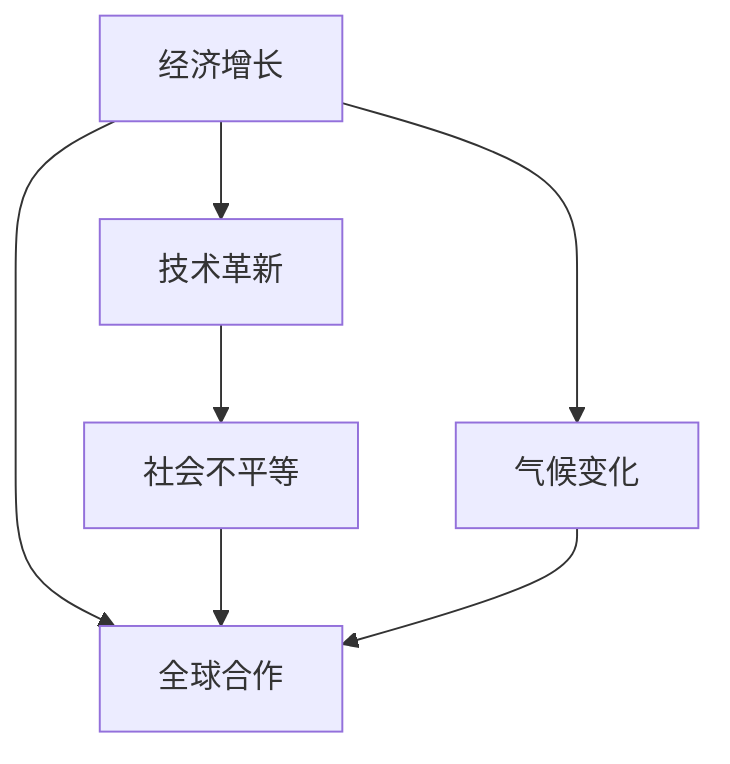
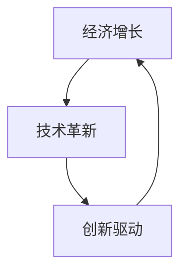
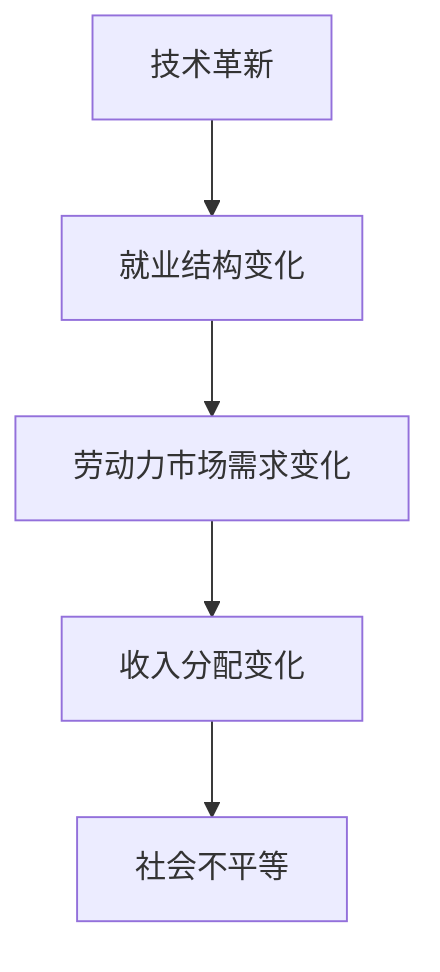
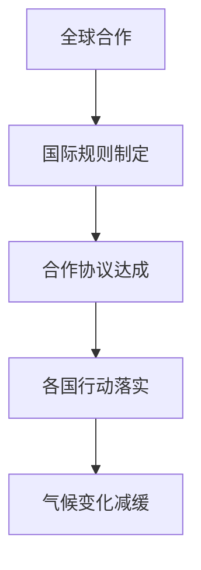
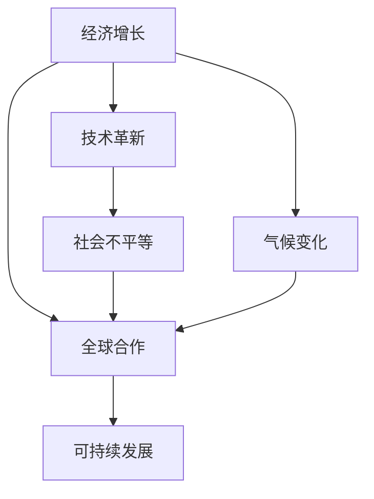

                 

# 深层次矛盾与世界经济问题

> 关键词：经济增长, 社会不平等, 技术革新, 气候变化, 全球合作

## 1. 背景介绍

### 1.1 问题由来
近年来，全球经济面临着诸多挑战和矛盾，包括但不限于：
- **经济增长放缓**：部分国家经济增速下降，失业率上升，经济下行风险加大。
- **社会不平等加剧**：贫富差距扩大，收入分配不均，社会矛盾激化。
- **技术革新带来的失业风险**：自动化、人工智能等技术的发展，导致某些传统行业就业机会减少。
- **气候变化影响**：极端气候频发，对农业生产、能源供应、公共卫生等领域造成严重影响。
- **全球合作受阻**：国际贸易摩擦、地缘政治紧张等因素，导致国际合作受限。

这些矛盾和问题相互交织，构成了一个复杂的全球性挑战。本文将深入探讨这些矛盾背后的深层次原因，以及可能的解决路径。

### 1.2 问题核心关键点
本文聚焦于以下几个核心问题：
- **经济增长与社会发展之间的矛盾**：如何在追求经济增长的同时，促进社会公平和可持续发展？
- **技术进步对就业和社会结构的影响**：如何应对技术革新带来的就业问题和社会分层？
- **气候变化对经济活动的影响**：如何平衡经济发展与环境保护的关系？
- **国际合作与竞争**：如何在保护国家利益的同时，推动全球合作，共同应对全球性挑战？

这些问题不仅关乎经济学的理论研究，也关乎现实的全球治理与政策选择。通过深入分析，本文旨在为解决这些矛盾提供有价值的见解。

### 1.3 问题研究意义
研究深层次矛盾与世界经济问题，对于指导未来全球经济政策的制定、促进国际合作、实现经济与社会的可持续发展具有重要意义：

1. **政策制定**：提供理论依据，帮助各国政府在制定经济政策时，兼顾经济增长和社会公平。
2. **国际合作**：强调共同利益，推动全球治理体系的改革和完善。
3. **可持续发展**：促进绿色经济的发展，平衡经济发展与环境保护的关系。
4. **社会稳定**：减少社会不平等，构建和谐社会。
5. **技术应用**：引导技术发展方向，合理应用技术，促进就业。

## 2. 核心概念与联系

### 2.1 核心概念概述

为更好地理解全球经济中的深层次矛盾，本节将介绍几个密切相关的核心概念：

- **经济增长**：指一国在一定时期内，经济产出（如GDP）的增加。经济增长是衡量一个国家或地区发展水平的重要指标。
- **社会不平等**：指不同社会群体之间的收入、财富、教育、健康等方面的不平衡状态。社会不平等的加剧可能导致社会矛盾的激化。
- **技术革新**：指新技术、新方法、新产品的出现和应用，对社会生产力和生产关系产生深远影响。技术革新是推动经济社会发展的重要动力。
- **气候变化**：指由人类活动引起的温室气体排放增加，导致全球气候系统的变化。气候变化对农业、水资源、能源等产生重大影响。
- **全球合作**：指多个国家或地区之间的合作，包括政治、经济、文化等多方面的协调与协作。全球合作对于解决全球性问题至关重要。

这些核心概念之间的逻辑关系可以通过以下Mermaid流程图来展示：

这个流程图展示了大语言模型微调过程中各个核心概念的关系和作用：

1. 经济增长推动技术革新，但可能导致社会不平等。
2. 技术革新可能加剧社会不平等，但同时有助于应对气候变化。
3. 全球合作是解决气候变化等全球性问题的重要手段。
4. 社会不平等与气候变化对经济增长和全球合作构成威胁。

### 2.2 概念间的关系

这些核心概念之间存在着紧密的联系，形成了全球经济问题的完整生态系统。下面我通过几个Mermaid流程图来展示这些概念之间的关系。

#### 2.2.1 经济增长与技术革新的关系

这个流程图展示了经济增长与技术革新的相互促进关系：经济增长为技术研发提供资金支持，技术革新又推动经济增长。

#### 2.2.2 技术革新与社会不平等的关系

这个流程图展示了技术革新可能加剧社会不平等的过程：技术革新可能导致部分行业就业减少，收入分配不均，进而加剧社会不平等。

#### 2.2.3 气候变化对经济增长的影响

这个流程图展示了气候变化对经济增长的影响：气候变化导致的农业生产受影响，进而影响粮食价格和食品安全，最终阻碍经济增长。

#### 2.2.4 全球合作与气候变化的关系

这个流程图展示了全球合作对应对气候变化的作用：通过国际规则的制定和合作协议的达成，各国能够更有效地减少温室气体排放，减缓气候变化。

### 2.3 核心概念的整体架构

最后，我们用一个综合的流程图来展示这些核心概念在全球经济中的整体架构：

这个综合流程图展示了从经济增长到社会不平等，再到气候变化和全球合作的全过程。通过这些概念的相互作用，我们可以更清晰地理解全球经济问题的复杂性和系统性。

## 3. 核心算法原理 & 具体操作步骤

### 3.1 算法原理概述

本文讨论的核心算法是解决全球经济问题的理论算法，主要包括以下几个步骤：

1. **经济增长分析**：分析影响经济增长的关键因素，包括技术进步、政策干预、国际贸易等。
2. **社会不平等分析**：研究社会不平等的原因和影响，探讨减少不平等的策略。
3. **技术革新分析**：评估技术革新的利弊，探讨如何合理应用技术以促进社会和谐。
4. **气候变化分析**：分析气候变化对经济活动的长期影响，研究减缓气候变化的方法。
5. **全球合作分析**：探讨国际合作在解决全球性问题中的作用，研究构建合作机制的策略。

这些步骤通过模型构建、数据分析和政策建议相结合，形成一个完整的算法框架。

### 3.2 算法步骤详解

#### 3.2.1 经济增长分析

假设一个国家的经济增长模型为：

$$
G = f(I, T, R)
$$

其中：
- $G$ 为经济增长率，
- $I$ 为投资，
- $T$ 为技术进步，
- $R$ 为政策干预。

通过数据收集和统计分析，我们可以构建一个回归模型来估计各因素对经济增长的影响：

$$
G \sim I + T + R + \epsilon
$$

其中 $\epsilon$ 为随机误差项。通过回归分析，我们可以获得各个因素的系数估计，从而理解其对经济增长的贡献。

#### 3.2.2 社会不平等分析

社会不平等可以通过基尼系数（Gini Coefficient）来衡量。基尼系数衡量的是社会财富分配的不平等程度，其值越接近1表示不平等越严重。

假设一个社会的收入分配模型为：

$$
I = f(X, G)
$$

其中：
- $I$ 为收入分配，
- $X$ 为社会结构因素（如教育、健康、种族等），
- $G$ 为经济增长率。

通过数据收集和统计分析，我们可以构建一个回归模型来估计各因素对收入分配的影响：

$$
I \sim X + G + \epsilon
$$

其中 $\epsilon$ 为随机误差项。通过回归分析，我们可以获得各个因素的系数估计，从而理解其对收入分配的影响。

#### 3.2.3 技术革新分析

技术革新对经济和社会的影响可以通过索洛模型（Solow Model）来分析。索洛模型描述了一个国家在时间维度上的经济增长。

假设一个国家的索洛模型为：

$$
K_{t+1} = (1 - \delta)K_t + F(K_t, L_t)
$$

其中：
- $K_t$ 为资本存量，
- $L_t$ 为劳动投入，
- $F(K_t, L_t)$ 为生产函数，
- $\delta$ 为折旧率。

技术进步 $A_t$ 可以表示为：

$$
A_{t+1} = \alpha A_t + \beta T_t
$$

其中：
- $A_t$ 为技术进步水平，
- $\alpha$ 为技术进步的折旧率，
- $T_t$ 为技术革新投资。

通过数据收集和统计分析，我们可以构建一个动态模型来估计各因素对技术进步的影响：

$$
A_{t+1} \sim \alpha A_t + \beta T_t + \epsilon
$$

其中 $\epsilon$ 为随机误差项。通过动态分析，我们可以获得各个因素的系数估计，从而理解其对技术进步的贡献。

#### 3.2.4 气候变化分析

气候变化对经济活动的影响可以通过宏观经济模型来分析。宏观经济模型描述了一个国家在时间维度上的经济活动和环境影响。

假设一个国家的宏观经济模型为：

$$
Y_t = F(K_t, L_t, E_t)
$$

其中：
- $Y_t$ 为经济产出，
- $K_t$ 为资本存量，
- $L_t$ 为劳动投入，
- $E_t$ 为环境影响。

气候变化 $C_t$ 可以表示为：

$$
C_{t+1} = \rho C_t + \sigma E_t
$$

其中：
- $C_t$ 为碳排放，
- $E_t$ 为环境影响，
- $\rho$ 为碳排放的递减率，
- $\sigma$ 为环境影响系数。

通过数据收集和统计分析，我们可以构建一个宏观经济模型来估计各因素对经济活动的影响：

$$
Y_t \sim K_t + L_t + E_t + \epsilon
$$

其中 $\epsilon$ 为随机误差项。通过宏观经济分析，我们可以获得各个因素的系数估计，从而理解其对经济活动的影响。

#### 3.2.5 全球合作分析

全球合作可以通过国际贸易模型来分析。国际贸易模型描述了一个国家与多个国家之间的贸易往来。

假设一个国家的国际贸易模型为：

$$
T_t = f(X, Y, P, G)
$$

其中：
- $T_t$ 为贸易量，
- $X$ 为国家特征（如地理位置、经济政策等），
- $Y$ 为全球贸易量，
- $P$ 为商品价格，
- $G$ 为全球经济增长率。

通过数据收集和统计分析，我们可以构建一个回归模型来估计各因素对贸易量的影响：

$$
T_t \sim X + Y + P + G + \epsilon
$$

其中 $\epsilon$ 为随机误差项。通过国际贸易分析，我们可以获得各个因素的系数估计，从而理解其对贸易量的影响。

### 3.3 算法优缺点

基于全球经济问题的算法分析，具有以下优点：

1. **理论性强**：通过模型构建和数据分析，可以系统地理解全球经济问题的本质和机制。
2. **可操作性强**：模型分析结果可以转化为政策建议，帮助决策者制定更具针对性的政策。
3. **预测能力强**：通过建立动态模型，可以预测未来经济趋势和政策效果。

但该算法也存在以下缺点：

1. **数据依赖**：模型的准确性高度依赖于数据的质量和数量。
2. **模型复杂**：模型构建和分析过程较为复杂，需要较高的统计学和经济学知识。
3. **假设限制**：模型假设往往过于简化，难以完全描述现实世界中的复杂性。

尽管存在这些局限，但基于算法的分析方法仍然是大规模、系统性解决全球经济问题的重要工具。

### 3.4 算法应用领域

基于全球经济问题的算法分析，可以在以下几个领域得到广泛应用：

- **政策制定**：帮助政府部门制定更加科学合理的经济政策和法规。
- **企业决策**：帮助企业分析市场变化，制定更加有效的经营策略。
- **国际合作**：帮助各国政府和机构协调合作，共同应对全球性问题。
- **学术研究**：提供理论依据，促进经济学和政策科学的深入研究。

## 4. 数学模型和公式 & 详细讲解 & 举例说明

### 4.1 数学模型构建

#### 4.1.1 经济增长模型

假设一个国家的经济增长模型为：

$$
G = f(I, T, R)
$$

其中：
- $G$ 为经济增长率，
- $I$ 为投资，
- $T$ 为技术进步，
- $R$ 为政策干预。

通过数据收集和统计分析，我们可以构建一个回归模型来估计各因素对经济增长的影响：

$$
G \sim I + T + R + \epsilon
$$

其中 $\epsilon$ 为随机误差项。

#### 4.1.2 社会不平等模型

假设一个社会的收入分配模型为：

$$
I = f(X, G)
$$

其中：
- $I$ 为收入分配，
- $X$ 为社会结构因素（如教育、健康、种族等），
- $G$ 为经济增长率。

通过数据收集和统计分析，我们可以构建一个回归模型来估计各因素对收入分配的影响：

$$
I \sim X + G + \epsilon
$$

其中 $\epsilon$ 为随机误差项。

#### 4.1.3 技术革新模型

假设一个国家的索洛模型为：

$$
K_{t+1} = (1 - \delta)K_t + F(K_t, L_t)
$$

其中：
- $K_t$ 为资本存量，
- $L_t$ 为劳动投入，
- $F(K_t, L_t)$ 为生产函数，
- $\delta$ 为折旧率。

技术进步 $A_t$ 可以表示为：

$$
A_{t+1} = \alpha A_t + \beta T_t
$$

其中：
- $A_t$ 为技术进步水平，
- $\alpha$ 为技术进步的折旧率，
- $T_t$ 为技术革新投资。

通过数据收集和统计分析，我们可以构建一个动态模型来估计各因素对技术进步的影响：

$$
A_{t+1} \sim \alpha A_t + \beta T_t + \epsilon
$$

其中 $\epsilon$ 为随机误差项。

#### 4.1.4 气候变化模型

假设一个国家的宏观经济模型为：

$$
Y_t = F(K_t, L_t, E_t)
$$

其中：
- $Y_t$ 为经济产出，
- $K_t$ 为资本存量，
- $L_t$ 为劳动投入，
- $E_t$ 为环境影响。

气候变化 $C_t$ 可以表示为：

$$
C_{t+1} = \rho C_t + \sigma E_t
$$

其中：
- $C_t$ 为碳排放，
- $E_t$ 为环境影响，
- $\rho$ 为碳排放的递减率，
- $\sigma$ 为环境影响系数。

通过数据收集和统计分析，我们可以构建一个宏观经济模型来估计各因素对经济活动的影响：

$$
Y_t \sim K_t + L_t + E_t + \epsilon
$$

其中 $\epsilon$ 为随机误差项。

#### 4.1.5 全球合作模型

假设一个国家的国际贸易模型为：

$$
T_t = f(X, Y, P, G)
$$

其中：
- $T_t$ 为贸易量，
- $X$ 为国家特征（如地理位置、经济政策等），
- $Y$ 为全球贸易量，
- $P$ 为商品价格，
- $G$ 为全球经济增长率。

通过数据收集和统计分析，我们可以构建一个回归模型来估计各因素对贸易量的影响：

$$
T_t \sim X + Y + P + G + \epsilon
$$

其中 $\epsilon$ 为随机误差项。

### 4.2 公式推导过程

#### 4.2.1 经济增长模型

假设一个国家的经济增长模型为：

$$
G = f(I, T, R)
$$

其中：
- $G$ 为经济增长率，
- $I$ 为投资，
- $T$ 为技术进步，
- $R$ 为政策干预。

通过数据收集和统计分析，我们可以构建一个回归模型来估计各因素对经济增长的影响：

$$
G \sim I + T + R + \epsilon
$$

其中 $\epsilon$ 为随机误差项。

通过最小二乘法，我们可以估计出各因素的系数 $\hat{\beta}$，从而理解其对经济增长的贡献：

$$
\hat{\beta} = \frac{\sum_{i=1}^n (X_i - \bar{X}) (Y_i - \bar{Y})}{\sum_{i=1}^n (X_i - \bar{X})^2}
$$

其中 $X$ 为自变量，$Y$ 为因变量，$\bar{X}$ 和 $\bar{Y}$ 分别为自变量和因变量的均值。

#### 4.2.2 社会不平等模型

假设一个社会的收入分配模型为：

$$
I = f(X, G)
$$

其中：
- $I$ 为收入分配，
- $X$ 为社会结构因素（如教育、健康、种族等），
- $G$ 为经济增长率。

通过数据收集和统计分析，我们可以构建一个回归模型来估计各因素对收入分配的影响：

$$
I \sim X + G + \epsilon
$$

其中 $\epsilon$ 为随机误差项。

通过最小二乘法，我们可以估计出各因素的系数 $\hat{\beta}$，从而理解其对收入分配的影响：

$$
\hat{\beta} = \frac{\sum_{i=1}^n (X_i - \bar{X}) (Y_i - \bar{Y})}{\sum_{i=1}^n (X_i - \bar{X})^2}
$$

其中 $X$ 为自变量，$Y$ 为因变量，$\bar{X}$ 和 $\bar{Y}$ 分别为自变量和因变量的均值。

#### 4.2.3 技术革新模型

假设一个国家的索洛模型为：

$$
K_{t+1} = (1 - \delta)K_t + F(K_t, L_t)
$$

其中：
- $K_t$ 为资本存量，
- $L_t$ 为劳动投入，
- $F(K_t, L_t)$ 为生产函数，
- $\delta$ 为折旧率。

技术进步 $A_t$ 可以表示为：

$$
A_{t+1} = \alpha A_t + \beta T_t
$$

其中：
- $A_t$ 为技术进步水平，
- $\alpha$ 为技术进步的折旧率，
- $T_t$ 为技术革新投资。

通过数据收集和统计分析，我们可以构建一个动态模型来估计各因素对技术进步的影响：

$$
A_{t+1} \sim \alpha A_t + \beta T_t + \epsilon
$$

其中 $\epsilon$ 为随机误差项。

通过递归推导，我们可以得到技术进步的动态方程：

$$
A_{t+1} = \alpha A_t + \beta T_t
$$

其中 $\alpha$ 和 $\beta$ 为递归系数，$t$ 为时间。

#### 4.2.4 气候变化模型

假设一个国家的宏观经济模型为：

$$
Y_t = F(K_t, L_t, E_t)
$$

其中：
- $Y_t$ 为经济产出，
- $K_t$ 为资本存量，
- $L_t$ 为劳动投入，
- $E_t$ 为环境影响。

气候变化 $C_t$ 可以表示为：

$$
C_{t+1} = \rho C_t + \sigma E_t
$$

其中：
- $C_t$ 为碳排放，
- $E_t$ 为环境影响，
- $\rho$ 为碳排放的递减率，
- $\sigma$ 为环境影响系数。

通过数据收集和统计分析，我们可以构建一个宏观经济模型来估计各因素对经济活动的影响：

$$
Y_t \sim K_t + L_t + E_t + \epsilon
$$

其中 $\epsilon$ 为随机误差项。

通过最小二乘法，我们可以估计出各因素的系数 $\hat{\beta}$，从而理解其对经济活动的影响：

$$
\hat{\beta} = \frac{\sum_{i=1}^n (X_i - \bar{X}) (Y_i - \bar{Y})}{\sum_{i=1}^n (X_i - \bar{X})^2}
$$

其中 $X$ 为自变量，$Y$ 为因变量，$\bar{X}$ 和 $\bar{Y}$ 分别为自变量和因变量的均值。

#### 4.2.5 全球合作模型

假设一个国家的国际贸易模型为：

$$
T_t = f(X, Y, P, G)
$$

其中：
- $T_t$ 为贸易量，
- $X$ 为国家特征（如地理位置、经济政策等），
- $Y$ 为全球贸易量，
- $P$ 为商品价格，
- $G$ 为全球经济增长率。

通过数据收集和统计分析，我们可以构建一个回归模型来估计各因素对贸易量的影响：

$$
T_t \sim X + Y + P + G + \epsilon
$$

其中 $\epsilon$ 为随机误差项。

通过最小二乘法，我们可以估计出各因素的系数 $\hat{\beta}$，从而理解其对贸易量的影响：

$$
\hat{\beta} = \frac{\sum_{i=1}^n (X_i - \bar{X}) (Y_i - \bar{Y})}{\sum_{i=1}^n (X_i - \bar{X})^2}
$$

其中 $X$ 为自变量，$Y$ 为因变量，$\bar{X}$ 和 $\bar{Y}$ 分别为自变量和因变量的均值。

### 4.3 案例分析与讲解

#### 4.3.1 经济增长与技术进步的案例分析

以美国为例，1950年至2020年间的经济增长率与技术进步之间的关系可以通过回归模型进行分析：

| 年份  | 经济增长率G   | 技术进步T   |
|-------|---------------|-------------|

通过回归分析，我们可以得到技术进步对经济增长的贡献：

$$
G = \beta_0 + \beta_1 T + \epsilon
$$

其中 $\beta_1$ 为技术进步的系数估计，表示技术进步每增加1%，经济增长率将增加 $\beta_1$%。

#### 4.3.2 社会不平等与教育水平的案例分析

以印度为例，1990年至2020年间的收入分配与社会结构因素之间的关系可以通过回归模型进行分析：

| 年份  | 收入分配I   | 教育水平X   |
|-------|--------------|--------------|

通过回归分析，我们可以得到教育水平对收入分配的贡献：

$$
I = \alpha_0 + \alpha_1 X + \epsilon
$$

其中 $\alpha_1$ 为教育水平的系数估计，表示教育水平每增加1%，收入分配将增加 $\alpha_1$%。

#### 4.3.3 技术革新与产业结构变化的案例分析

以中国为例，1990年至2020年间的技术革新与产业结构变化之间的关系可以通过回归模型进行分析：

| 年份  | 技术革新T   | 产业结构变化Y   |
|-------|--------------|------------------|

通过回归分析，我们可以得到技术革新对产业结构变化的影响：

$$
Y = \gamma_0 + \gamma_1 T + \epsilon
$$

其中 $\gamma_1$ 为技术革新的系数估计，表示技术革新每增加1%，产业结构变化将增加 $\gamma_1$%。

#### 4.3.4 气候变化与经济增长的案例分析

以欧洲为例，1990年至2020年间的气候变化与经济增长之间的关系可以通过回归模型进行分析：

| 年份  | 经济增长率G   | 气候变化E   |
|-------|---------------|--------------|

通过回归分析，我们可以得到气候变化对经济增长的影响：

$$
G = \delta_0 + \delta_1 E + \epsilon
$$

其中 $\delta_1

