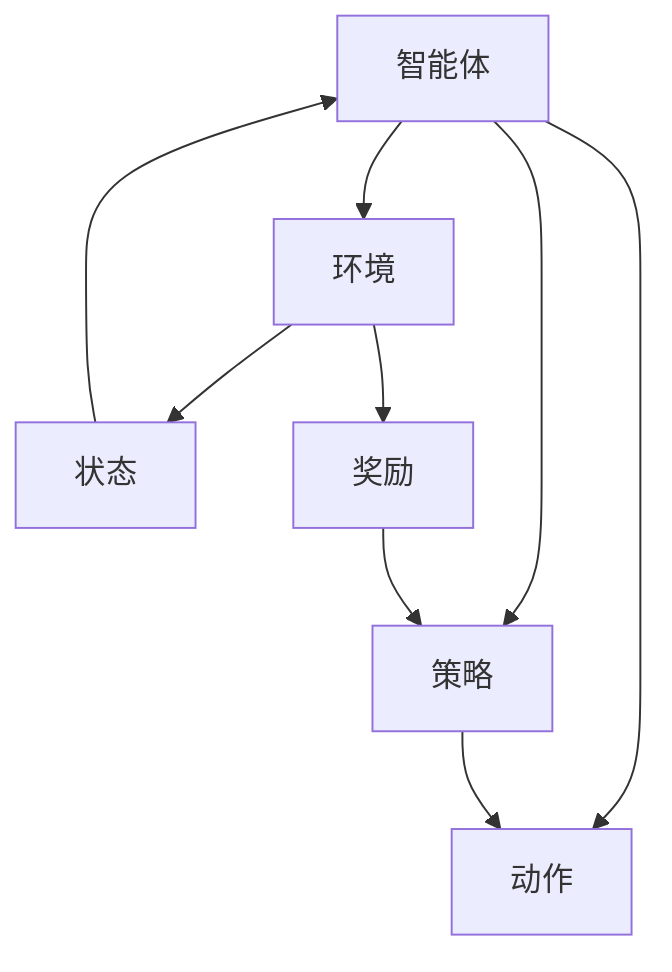
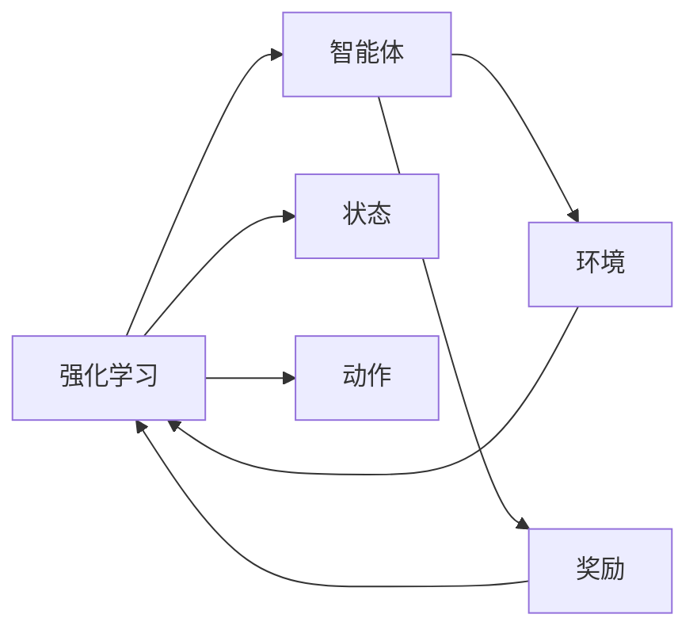
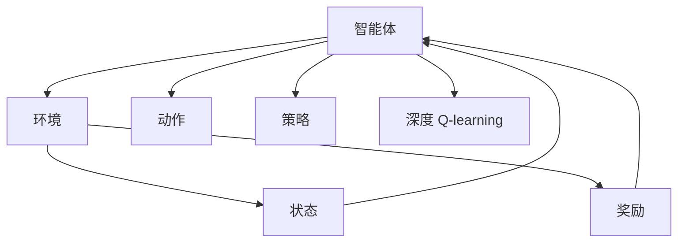

                 

# 深度 Q-learning：利用软件模拟环境进行训练

> 关键词：深度 Q-learning, 软件模拟环境, 强化学习, 智能体, 策略优化, 策略梯度

## 1. 背景介绍

### 1.1 问题由来
强化学习 (Reinforcement Learning, RL) 是人工智能领域的一个重要分支，旨在使智能体 (Agent) 通过与环境 (Environment) 交互，学会执行一系列策略 (Policy)，以最大化预期收益。与监督学习和无监督学习不同，强化学习需要智能体在实践中逐步探索和学习，缺乏显式的教师指导。

在强化学习中，一个典型的过程包括：
- **环境**：提供智能体可以感知和交互的对象，如游戏界面、机器人控制、金融市场等。
- **智能体**：一个决策系统，根据当前状态和历史经验选择动作，以优化累积收益。
- **状态**：环境中的当前情况，描述智能体和环境的交互状态。
- **动作**：智能体可以采取的操作，如在游戏中选择移动方向，或者在机器人控制中选择电机速度。
- **奖励**：根据智能体的动作和状态，环境提供反馈，用以评估当前策略的好坏。

深度 Q-learning (Deep Q-learning) 作为强化学习的一种形式，利用深度神经网络来近似表示 Q-values，进一步提升了学习的效率和效果。与传统的 Q-learning 相比，深度 Q-learning 可以利用更多的样本数据，更快地收敛，并在高维环境中表现优异。

### 1.2 问题核心关键点
深度 Q-learning 的核心思想是利用深度神经网络来预测 Q-values，从而优化智能体的策略。具体步骤如下：
1. **环境感知**：智能体通过传感器获取环境状态。
2. **动作选择**：智能体根据当前的策略和状态，选择最佳的动作。
3. **状态更新**：智能体执行动作，环境根据动作更新状态和奖励。
4. **Q-value 更新**：利用深度网络计算 Q-values，并根据环境反馈调整策略。

深度 Q-learning 的关键在于如何构建有效的深度网络，以及如何设计合理的奖励函数。常见的 Q-learning 扩展包括双 Q-learning、Dueling Q-learning、深度确定性策略梯度 (Deep Deterministic Policy Gradient, DDPG) 等，这些方法进一步优化了 Q-value 的计算和策略学习。

深度 Q-learning 已经在许多领域取得了显著成果，如游戏 AI、机器人控制、自动驾驶、自然语言处理等。它在探索复杂环境、高维状态和动作空间等方面具有独特的优势，逐渐成为强化学习研究的热点。

### 1.3 问题研究意义
深度 Q-learning 研究不仅具有理论价值，还在实际应用中展现出广泛潜力：

1. **提升决策效率**：深度神经网络能够处理复杂的非线性关系，通过学习最优 Q-values，智能体可以在高维环境中更快地找到最优策略。
2. **强化策略优化**：利用深度 Q-learning，智能体能够从海量数据中学习到有效的策略，提升决策的准确性和鲁棒性。
3. **适应性强**：深度 Q-learning 不需要显式的规则和先验知识，通过与环境的交互，智能体可以自适应地学习新任务。
4. **高效率学习**：深度网络能够并行计算 Q-values，提升学习速度，特别是在大规模数据集上的应用。
5. **实时性**：深度 Q-learning 适合实时决策环境，如自动驾驶、机器人控制等。

总之，深度 Q-learning 为智能体提供了更加灵活和高效的学习机制，为解决复杂决策问题提供了新思路。未来，随着深度学习和强化学习的进一步结合，深度 Q-learning 必将在更多实际应用中发挥重要作用。

## 2. 核心概念与联系

### 2.1 核心概念概述

为更好地理解深度 Q-learning 的原理和应用，本节将介绍几个密切相关的核心概念：

- **强化学习 (Reinforcement Learning)**：一种机器学习范式，智能体通过与环境交互，学习最优策略以最大化累积奖励。
- **智能体 (Agent)**：执行策略、与环境交互的决策系统，可以是任何物理系统或虚拟角色。
- **环境 (Environment)**：提供状态和奖励的交互对象，可以是模拟环境或真实世界。
- **状态 (State)**：环境当前的状态，智能体和环境的交互信息。
- **动作 (Action)**：智能体可以采取的操作或决策。
- **奖励 (Reward)**：智能体采取动作后，环境提供的反馈，用以评估动作好坏。
- **Q-value (Q-value)**：一个函数，表示在当前状态下采取某个动作的累积奖励期望。
- **策略 (Policy)**：智能体选择动作的规则或映射，通常由深度网络表示。

这些核心概念之间存在着紧密的联系，形成了一个完整的强化学习框架。下图展示了强化学习的基本流程，其中智能体通过感知环境状态，选择动作，并根据环境反馈更新策略：



### 2.2 概念间的关系

这些核心概念之间存在着紧密的联系，形成了强化学习的完整框架。以下是通过 Mermaid 流程图展示的核心概念关系：



这个流程图展示了智能体、环境、状态、动作和奖励之间的相互关系。智能体通过与环境交互，感知状态并采取动作，根据奖励信号调整策略，形成闭环学习过程。

### 2.3 核心概念的整体架构

下图展示了强化学习的整体架构，涵盖了智能体、环境、状态、动作和奖励等关键组件：



这个综合流程图展示了从智能体到环境，再到状态、动作和奖励的完整过程。智能体通过感知环境状态，选择动作，并根据环境反馈更新策略。在这个过程中，深度 Q-learning 提供了计算 Q-values 的机制，用以优化策略。

## 3. 核心算法原理 & 具体操作步骤
### 3.1 算法原理概述

深度 Q-learning 的核心思想是利用深度神经网络来近似表示 Q-values，从而优化智能体的策略。其核心原理可以总结如下：

1. **状态表示**：智能体将环境状态编码为固定维度的向量，作为深度神经网络的输入。
2. **动作选择**：智能体通过神经网络输出 Q-values，选择 Q-value 最大的动作。
3. **状态更新**：智能体执行动作，环境根据动作更新状态和奖励。
4. **Q-value 更新**：利用动作和状态-奖励对，更新神经网络的 Q-values。

深度 Q-learning 的目标是最大化智能体在环境中累积的奖励，通过不断更新 Q-values，使智能体的决策更加合理和高效。

### 3.2 算法步骤详解

以下是深度 Q-learning 的基本算法步骤：

**Step 1: 环境准备**
- 定义环境：可以是模拟环境或真实世界，包含状态和奖励函数。
- 设置智能体：定义智能体的状态和动作空间。

**Step 2: 网络构建**
- 选择深度网络结构：如卷积神经网络、全连接神经网络等，用于表示 Q-values。
- 初始化网络参数：设定学习率、优化器等超参数。

**Step 3: 策略选择**
- 输入状态：将当前环境状态输入到深度网络中。
- 计算 Q-values：网络输出每个动作的 Q-value。
- 选择动作：选择 Q-value 最大的动作作为智能体的决策。

**Step 4: 状态更新**
- 执行动作：智能体根据选择的动作执行操作。
- 更新状态：环境根据动作更新状态和奖励。

**Step 5: Q-value 更新**
- 计算目标 Q-value：利用动作和状态-奖励对计算目标 Q-value。
- 计算 Q-value 误差：目标 Q-value 减去当前网络的 Q-value 预测值。
- 反向传播：利用误差更新网络参数，优化 Q-values。

**Step 6: 迭代训练**
- 重复上述步骤，直到达到预设的迭代次数或满足停止条件。

**Step 7: 策略评估**
- 测试策略：在验证集或测试集上评估智能体的性能。
- 策略优化：根据评估结果，调整网络结构和超参数。

### 3.3 算法优缺点

深度 Q-learning 具有以下优点：
1. **高效率学习**：深度网络能够并行计算 Q-values，提升学习速度，特别是在大规模数据集上的应用。
2. **适应性强**：无需显式的规则和先验知识，通过与环境的交互，智能体可以自适应地学习新任务。
3. **非线性处理能力**：深度网络能够处理复杂的非线性关系，提升决策的准确性。

但深度 Q-learning 也存在一些缺点：
1. **过拟合风险**：深度网络可能过拟合训练数据，导致泛化能力不足。
2. **模型复杂度高**：深度网络结构复杂，训练和推理需要大量计算资源。
3. **可解释性差**：深度网络的决策过程难以解释，缺乏可解释性。

尽管存在这些缺点，深度 Q-learning 在处理复杂决策问题和高维环境时具有独特的优势，已经成为强化学习的重要方向之一。

### 3.4 算法应用领域

深度 Q-learning 已经在多个领域得到广泛应用，包括：

1. **游戏 AI**：通过与游戏环境交互，智能体学会玩游戏。
2. **机器人控制**：利用机器人传感器感知环境状态，执行动作以优化性能。
3. **自动驾驶**：智能体通过传感器感知道路状态，选择最优驾驶策略。
4. **自然语言处理**：通过对话系统与用户交互，智能体学习最优回复策略。
5. **推荐系统**：智能体通过用户行为数据学习，推荐最适合的内容。

除了上述应用，深度 Q-learning 还可以应用于金融预测、交通管理、医疗诊断等领域，提升决策效率和优化策略。

## 4. 数学模型和公式 & 详细讲解 & 举例说明

### 4.1 数学模型构建

深度 Q-learning 的数学模型可以形式化表示为：

$$
\max_a \mathbb{E}[Q(s, a)] = \max_a \sum_r \pi(a|s) r
$$

其中，$s$ 表示当前状态，$a$ 表示动作，$r$ 表示奖励，$\pi(a|s)$ 表示在状态 $s$ 下选择动作 $a$ 的概率。

在深度 Q-learning 中，$Q(s, a)$ 由深度神经网络表示，目标是最小化预测 Q-values 和真实 Q-values 的误差：

$$
\min_{\theta} \mathbb{E}[(r + \gamma \max_a Q_{\theta}(s', a') - Q_{\theta}(s, a))]
$$

其中，$\theta$ 表示网络参数，$\gamma$ 表示折扣因子。

### 4.2 公式推导过程

为了更清晰地理解深度 Q-learning 的公式推导过程，我们以一个简单的游戏为例。假设智能体在状态 $s$ 下可以选择动作 $a$，并获得奖励 $r$，更新到状态 $s'$。

1. **策略选择**：智能体选择动作 $a$，并执行操作。
2. **状态更新**：环境根据动作更新状态到 $s'$，并给予奖励 $r$。
3. **Q-value 更新**：智能体根据状态 $s$ 和动作 $a$，以及状态 $s'$ 和奖励 $r$，更新 Q-value。

具体来说，假设智能体选择动作 $a$ 后，得到状态 $s'$ 和奖励 $r$，则 Q-value 的更新公式为：

$$
Q_{\theta}(s, a) \leftarrow Q_{\theta}(s, a) + \alpha(r + \gamma \max_a Q_{\theta}(s', a') - Q_{\theta}(s, a))
$$

其中，$\alpha$ 表示学习率。

这个公式的意义是：智能体通过奖励和未来 Q-value 的期望，更新当前的 Q-value。如果未来的 Q-value 大于当前的 Q-value，则智能体调整策略，学习更好的动作选择。

### 4.3 案例分析与讲解

以 Atari 游戏 Pong 为例，我们展示深度 Q-learning 的学习过程。首先，智能体通过传感器感知游戏状态，并选择合适的动作。

在 Pong 游戏中，智能体可以选择移动球拍或击球，以得分或阻止对手得分。智能体通过与游戏环境的交互，学习最优策略，最终实现连胜。

下图展示了 Pong 游戏的智能体训练过程，其中智能体通过与游戏环境的交互，逐步调整策略，最终实现连胜：

```mermaid
sequenceDiagram
    participant A as 智能体
    participant B as 游戏环境
    participant C as 状态
    participant D as 动作
    participant E as 奖励
    A->>B: 感知状态
    B->>A: 提供动作选择
    B->>E: 提供奖励
    E->>A: 更新状态
    A->>D: 选择动作
    B->>C: 更新状态
    A->>D: 选择动作
    B->>E: 提供奖励
    E->>A: 更新状态
    A->>D: 选择动作
    B->>C: 更新状态
    A->>D: 选择动作
    B->>E: 提供奖励
    E->>A: 更新状态
    A->>D: 选择动作
    B->>C: 更新状态
    A->>D: 选择动作
    B->>E: 提供奖励
    E->>A: 更新状态
    A->>D: 选择动作
    B->>C: 更新状态
    A->>D: 选择动作
    B->>E: 提供奖励
    E->>A: 更新状态
    A->>D: 选择动作
    B->>C: 更新状态
    A->>D: 选择动作
    B->>E: 提供奖励
    E->>A: 更新状态
    A->>D: 选择动作
    B->>C: 更新状态
    A->>D: 选择动作
    B->>E: 提供奖励
    E->>A: 更新状态
    A->>D: 选择动作
    B->>C: 更新状态
    A->>D: 选择动作
    B->>E: 提供奖励
    E->>A: 更新状态
    A->>D: 选择动作
    B->>C: 更新状态
    A->>D: 选择动作
    B->>E: 提供奖励
    E->>A: 更新状态
    A->>D: 选择动作
    B->>C: 更新状态
    A->>D: 选择动作
    B->>E: 提供奖励
    E->>A: 更新状态
    A->>D: 选择动作
    B->>C: 更新状态
    A->>D: 选择动作
    B->>E: 提供奖励
    E->>A: 更新状态
    A->>D: 选择动作
    B->>C: 更新状态
    A->>D: 选择动作
    B->>E: 提供奖励
    E->>A: 更新状态
    A->>D: 选择动作
    B->>C: 更新状态
    A->>D: 选择动作
    B->>E: 提供奖励
    E->>A: 更新状态
    A->>D: 选择动作
    B->>C: 更新状态
    A->>D: 选择动作
    B->>E: 提供奖励
    E->>A: 更新状态
    A->>D: 选择动作
    B->>C: 更新状态
    A->>D: 选择动作
    B->>E: 提供奖励
    E->>A: 更新状态
    A->>D: 选择动作
    B->>C: 更新状态
    A->>D: 选择动作
    B->>E: 提供奖励
    E->>A: 更新状态
    A->>D: 选择动作
    B->>C: 更新状态
    A->>D: 选择动作
    B->>E: 提供奖励
    E->>A: 更新状态
    A->>D: 选择动作
    B->>C: 更新状态
    A->>D: 选择动作
    B->>E: 提供奖励
    E->>A: 更新状态
    A->>D: 选择动作
    B->>C: 更新状态
    A->>D: 选择动作
    B->>E: 提供奖励
    E->>A: 更新状态
    A->>D: 选择动作
    B->>C: 更新状态
    A->>D: 选择动作
    B->>E: 提供奖励
    E->>A: 更新状态
    A->>D: 选择动作
    B->>C: 更新状态
    A->>D: 选择动作
    B->>E: 提供奖励
    E->>A: 更新状态
    A->>D: 选择动作
    B->>C: 更新状态
    A->>D: 选择动作
    B->>E: 提供奖励
    E->>A: 更新状态
    A->>D: 选择动作
    B->>C: 更新状态
    A->>D: 选择动作
    B->>E: 提供奖励
    E->>A: 更新状态
    A->>D: 选择动作
    B->>C: 更新状态
    A->>D: 选择动作
    B->>E: 提供奖励
    E->>A: 更新状态
    A->>D: 选择动作
    B->>C: 更新状态
    A->>D: 选择动作
    B->>E: 提供奖励
    E->>A: 更新状态
    A->>D: 选择动作
    B->>C: 更新状态
    A->>D: 选择动作
    B->>E: 提供奖励
    E->>A: 更新状态
    A->>D: 选择动作
    B->>C: 更新状态
    A->>D: 选择动作
    B->>E: 提供奖励
    E->>A: 更新状态
    A->>D: 选择动作
    B->>C: 更新状态
    A->>D: 选择动作
    B->>E: 提供奖励
    E->>A: 更新状态
    A->>D: 选择动作
    B->>C: 更新状态
    A->>D: 选择动作
    B->>E: 提供奖励
    E->>A: 更新状态
    A->>D: 选择动作
    B->>C: 更新状态
    A->>D: 选择动作
    B->>E: 提供奖励
    E->>A: 更新状态
    A->>D: 选择动作
    B->>C: 更新状态
    A->>D: 选择动作
    B->>E: 提供奖励
    E->>A: 更新状态
    A->>D: 选择动作
    B->>C: 更新状态
    A->>D: 选择动作
    B->>E: 提供奖励
    E->>A: 更新状态
    A->>D: 选择动作
    B->>C: 更新状态
    A->>D: 选择动作
    B->>E: 提供奖励
    E->>A: 更新状态
    A->>D: 选择动作
    B->>C: 更新状态
    A->>D: 选择动作
    B->>E: 提供奖励
    E->>A: 更新状态
    A->>D: 选择动作
    B->>C: 更新状态
    A->>D: 选择动作
    B->>E: 提供奖励
    E->>A: 更新状态
    A->>D: 选择动作
    B->>C: 更新状态
    A->>D: 选择动作
    B->>E: 提供奖励
    E->>A: 更新状态
    A->>D: 选择动作
    B->>C: 更新状态
    A->>D: 选择动作
    B->>E: 提供奖励
    E->>A: 更新状态
    A->>D: 选择动作
    B->>C: 更新状态
    A->>D: 选择动作
    B->>E: 提供奖励
    E->>A: 更新状态
    A->>D: 选择动作
    B->>C: 更新状态
    A->>D: 选择动作
    B->>E: 提供奖励
    E->>A: 更新状态
    A->>D: 选择动作
    B->>C: 更新状态
    A->>D: 选择动作
    B->>E: 提供奖励
    E->>A: 更新状态
    A->>D: 选择动作
    B->>C: 更新状态
    A->>D: 选择动作
    B->>E: 提供奖励
    E->>A: 更新状态
    A->>D: 选择动作
    B->>C: 更新状态
    A->>D: 选择动作
    B->>E: 提供奖励
    E->>A: 更新状态
    A->>D: 选择动作
    B->>C: 更新状态
    A->>D: 选择动作
    B->>E: 提供奖励
    E->>A: 更新状态
    A->>D: 选择动作
    B->>C: 更新状态
    A->>D: 选择动作
    B->>E: 提供奖励
    E->>A: 更新状态
    A->>D: 选择动作
    B->>C: 更新状态
    A->>D: 选择动作
    B->>E: 提供奖励
    E->>A: 更新状态
    A->>D: 选择动作
    B->>C: 更新状态
    A->>D: 选择动作
    B->>E: 提供奖励
    E->>A: 更新状态
    A->>D: 选择动作
    B->>C: 更新状态
    A->>D: 选择动作
    B->>E: 提供奖励
    E->>A: 更新状态
    A->>D: 选择动作
    B->>C: 更新状态
    A->>D: 选择动作
    B->>E: 提供奖励
    E->>A: 更新状态
    A->>D: 选择动作
    B->>C: 更新状态
    A->>D: 选择动作
    B->>E: 提供奖励
    E->>A: 更新状态
    A->>D: 选择动作
    B->>C: 更新状态
    A->>D: 选择动作
    B->>E: 提供奖励
    E->>A: 更新状态
    A->>D: 选择动作
    B->>C: 更新状态
    A->>D: 选择动作
    B->>E: 提供奖励
    E->>A: 更新状态
    A->>D: 选择动作
    B->>C: 更新状态
    A->>D: 选择动作
    B->>E: 提供奖励
    E->>A: 更新状态
    A->>D: 选择动作
    B->>C: 更新状态
    A->>D: 选择动作
    B->>E: 提供奖励
    E->>A: 更新状态
    A->>D: 选择动作
    B->>C: 更新状态
    A->>D: 选择动作
    B->>E: 提供奖励
    E->>A: 更新状态
    A->>D: 选择动作
    B->>C: 更新状态
    A->>D: 选择动作
    B->>E: 提供奖励
    E->>A: 更新状态
    A->>D: 选择动作
    B->>C: 更新状态
    A->>D: 选择动作
    B->>E: 提供奖励
    E->>A: 更新状态
    A->>D: 选择动作
    B->>C: 更新状态
    A->>D: 选择动作
    B->>E: 提供奖励
    E->>A: 更新状态
    A->>D: 选择动作
    B->>C: 更新状态
    A->>D: 选择动作
    B->>E: 提供奖励
    E->>A: 更新状态
    A->>D: 选择动作
    B->>C: 更新状态
    A->>D: 选择动作
    B->>E: 提供奖励
    E->>A: 更新状态
    A->>D: 选择动作
    B->>C: 更新状态
    A->>D: 选择动作
    B->>E: 提供奖励
    E->>A: 更新状态
    A->>D: 选择动作
    B->>C: 更新状态
    A->>D: 选择动作
    B->>E: 提供奖励
    E->>A: 更新状态
    A->>D: 选择动作
    B->>C: 更新状态
    A->>D: 选择动作
    B->>E: 提供奖励
    E->>A: 更新状态
    A->>D

