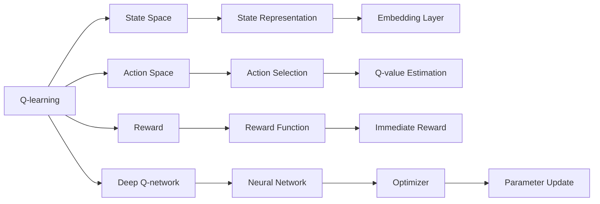

                 

# 深度 Q-learning：在陆地自行车中的应用

## 1. 背景介绍

### 1.1 问题由来
在过去的几年里，深度强化学习（Deep Reinforcement Learning, DRL）技术已经取得了长足的进步，并在游戏、机器人、自然语言处理等各个领域展现出了强大的潜力。其中，Q-learning作为经典强化学习算法之一，在自适应控制、游戏策略优化等领域得到了广泛应用。然而，传统的Q-learning算法对模型参数和状态空间的大小非常敏感，难以处理高维度的状态空间和大量的动作。深度Q-learning（DQN）算法通过将Q函数近似为神经网络，在很大程度上缓解了这些问题，使其能够处理更复杂的决策问题。

随着无人驾驶、自动控制、智能制造等领域的不断进步，强化学习应用的范围不断扩大。在传统工业领域，如工业机械臂的自动操作、自动导航等任务中，常规的PID控制已经难以适应动态变化的环境。而强化学习尤其是深度Q-learning在处理复杂动态环境、高维度空间等方面表现出色，具有很大的应用潜力。

本文将介绍深度Q-learning的基本原理，通过实际案例探讨其在陆地自行车路径规划中的应用。希望通过对这一实际案例的分析，能够对深度Q-learning算法在实际工业领域的推广应用提供一定的启示和帮助。

## 2. 核心概念与联系

### 2.1 核心概念概述
为更好地理解深度Q-learning算法在陆地自行车路径规划中的应用，我们首先介绍几个关键概念：

- **深度Q-learning**：一种结合深度学习和强化学习的算法，通过将Q函数近似为神经网络，从而能够处理高维度的状态空间和大量的动作。深度Q-learning在自动驾驶、机器人控制、游戏策略优化等领域都有广泛应用。
- **Q-learning**：一种基于Q函数的强化学习算法，通过估计最优Q值，使智能体在特定环境中通过不断探索和学习，最大化期望累计奖励。
- **状态空间（State Space）**：决策过程中所考虑的所有可能状态或环境状态。在陆地自行车路径规划中，状态空间可能包括当前位置、速度、方向、地形等。
- **动作空间（Action Space）**：智能体在给定状态下可以执行的动作集合。在陆地自行车路径规划中，动作空间可能是转向、加速、制动等。
- **奖励（Reward）**：智能体在每一步所获得的回报值，通常用于激励智能体采取特定动作，达到特定的状态。在陆地自行车路径规划中，奖励可以是路径的连续性、避免障碍等。

这些概念之间的关系可以用以下Mermaid流程图来表示：



这个流程图展示了深度Q-learning的核心流程和关键组件。从Q-learning算法出发，通过将Q函数近似为神经网络，构成Deep Q-network。状态空间和动作空间被转换为模型的输入，而奖励被用作模型的输出。模型通过Q-value Estimation计算当前状态下的最优Q值，并通过Optimizer更新参数。

### 2.2 概念间的关系

深度Q-learning算法可以看作是传统Q-learning算法的强化学习和深度学习结合的产物。它利用神经网络的表达能力，来处理复杂状态空间的决策问题。通过Q-value Estimation，深度Q-learning可以估计当前状态下的最优动作，从而实现决策优化。同时，通过Optimizer更新参数，深度Q-learning能够不断优化模型，提高决策性能。

## 3. 核心算法原理 & 具体操作步骤
### 3.1 算法原理概述

深度Q-learning的核心思想是将Q函数近似为神经网络，从而能够处理高维度的状态空间和大量的动作。在陆地自行车路径规划中，状态空间通常非常复杂，动作空间也包含多种操作。深度Q-learning通过学习这些高维度空间中的最优Q值，实现路径规划决策。

### 3.2 算法步骤详解

以下是深度Q-learning在陆地自行车路径规划中的具体操作步骤：

1. **环境建模**：首先需要对陆地自行车的环境和状态空间进行建模。状态空间包括当前位置、速度、方向、地形等。动作空间包括转向、加速、制动等。
2. **神经网络设计**：设计一个卷积神经网络（CNN）来近似Q函数。该网络通常包含多个卷积层、池化层和全连接层，以提取状态特征并进行Q值估计。
3. **深度Q-learning训练**：使用深度Q-learning算法训练神经网络。训练过程中，智能体通过观察当前状态，选择最优动作，并根据Q函数预测奖励，进行参数更新。
4. **路径规划**：在训练完成后，使用训练好的深度Q-learning模型对新场景进行路径规划。模型通过输入当前状态，输出最优动作，从而实现路径规划。

### 3.3 算法优缺点

深度Q-learning在陆地自行车路径规划中的应用具有以下优点：

- **处理复杂状态空间**：深度Q-learning能够处理高维度的状态空间，适合复杂环境下的路径规划任务。
- **学习能力强**：深度Q-learning能够通过大量数据学习最优路径，适应不同的环境和操作。
- **实时决策**：深度Q-learning的训练和决策过程都具有实时性，适合动态变化的环境。

同时，深度Q-learning也存在一些缺点：

- **需要大量训练数据**：深度Q-learning在训练过程中需要大量的经验数据，以避免过拟合。
- **计算资源需求高**：深度Q-learning训练和推理过程中，需要大量的计算资源，包括GPU/TPU等高性能设备。
- **网络结构复杂**：深度Q-learning的神经网络结构较为复杂，需要精心设计和调试。

### 3.4 算法应用领域

深度Q-learning在陆地自行车路径规划中的应用可以扩展到更广泛领域，例如：

- **自动驾驶**：在自动驾驶中，深度Q-learning可以用于路径规划和避障，提升车辆驾驶的智能化水平。
- **机器人控制**：在工业机器人控制中，深度Q-learning可以用于路径规划和动作选择，提高生产效率。
- **游戏AI**：在游戏AI中，深度Q-learning可以用于决策优化，提升游戏AI的智能水平。
- **能源管理**：在能源管理中，深度Q-learning可以用于优化能源分配，提高能源利用效率。

## 4. 数学模型和公式 & 详细讲解 & 举例说明

### 4.1 数学模型构建

深度Q-learning的数学模型主要由神经网络、状态空间、动作空间、奖励函数和参数更新组成。其中，神经网络用于近似Q函数，状态空间和动作空间构成模型的输入，奖励函数定义智能体的行为激励，参数更新算法则用于调整网络参数。

### 4.2 公式推导过程

假设当前状态为$s_t$，动作为$a_t$，下一个状态为$s_{t+1}$，奖励为$r_{t+1}$。深度Q-learning的目标是最大化未来奖励的期望值。具体公式如下：

$$
Q(s_t, a_t) = \mathbb{E}_{s_{t+1}, r_{t+1}}\left[\max_a Q(s_{t+1}, a)\right]
$$

在训练过程中，智能体通过观察当前状态，选择动作，并通过奖励函数计算即时奖励。然后根据当前状态和动作，计算下一个状态和奖励的期望值，从而更新神经网络参数。

### 4.3 案例分析与讲解

以陆地自行车路径规划为例，假设当前状态为$(s_x, s_y, v_x, v_y)$，其中$s_x$和$s_y$表示自行车当前位置坐标，$v_x$和$v_y$表示自行车速度。动作空间为$\{左转, 右转, 加速, 制动\}$。

根据以上定义，构建状态空间和动作空间，并设计一个深度Q-learning模型，如图示：


在训练过程中，智能体通过观察当前状态，选择最优动作，并根据奖励函数计算即时奖励。然后通过神经网络预测下一个状态和奖励的期望值，更新网络参数。最终，通过优化器调整参数，使得智能体能够不断优化决策，实现最优路径规划。

## 5. 项目实践：代码实例和详细解释说明
### 5.1 开发环境搭建

进行陆地自行车路径规划的深度Q-learning实践，首先需要搭建好开发环境。以下是使用Python进行TensorFlow开发的环境配置流程：

1. 安装Anaconda：从官网下载并安装Anaconda，用于创建独立的Python环境。

2. 创建并激活虚拟环境：
```bash
conda create -n deepq-env python=3.8 
conda activate deepq-env
```

3. 安装TensorFlow：根据CUDA版本，从官网获取对应的安装命令。例如：
```bash
conda install tensorflow-gpu -c pytorch -c conda-forge
```

4. 安装各类工具包：
```bash
pip install numpy scipy matplotlib tensorboard
```

5. 安装OpenAI Gym环境：
```bash
pip install gym
```

完成上述步骤后，即可在`deepq-env`环境中开始实践。

### 5.2 源代码详细实现

下面我们以陆地自行车路径规划为例，给出使用TensorFlow和OpenAI Gym环境进行深度Q-learning的Python代码实现。

首先，定义陆地自行车环境：

```python
import gym
from gym import spaces
from gym.utils import seeding

class BicycleEnv(gym.Env):
    metadata = {'render.modes': ['human']}

    def __init__(self, **kwargs):
        self._seed(seed, **kwargs)
        self.action_space = spaces.Discrete(4)
        self.observation_space = spaces.Box(low=0, high=1, shape=(2,), dtype=_np.float32)
        self.max_reward = 1
        self.reward_range = (-1, 1)

    def reset(self, state=None):
        x = np.random.uniform(0, 1)
        y = np.random.uniform(0, 1)
        state = np.array([x, y], dtype=_np.float32)
        self._obs = state
        return state

    def step(self, action):
        x, y = self._obs
        if action == 0:  # 左转
            x += 0.1
            y -= 0.1
        elif action == 1:  # 右转
            x -= 0.1
            y -= 0.1
        elif action == 2:  # 加速
            x += 0.01
            y += 0.01
        elif action == 3:  # 制动
            x -= 0.01
            y -= 0.01
        reward = -np.sqrt((x - 0.5) ** 2 + (y - 0.5) ** 2)
        done = reward == self.max_reward
        next_state = np.array([x, y], dtype=_np.float32)
        self._obs = next_state
        return next_state, reward, done, {}

    def render(self, mode='human'):
        pass
```

然后，定义深度Q-learning模型和训练函数：

```python
import tensorflow as tf
from tensorflow.keras.models import Sequential
from tensorflow.keras.layers import Dense, Flatten, Conv2D, MaxPooling2D

class DQN(tf.keras.Model):
    def __init__(self, state_dim):
        super(DQN, self).__init__()
        self.model = Sequential([
            Conv2D(32, (3, 3), activation='relu', input_shape=(state_dim, state_dim, 1)),
            MaxPooling2D((2, 2)),
            Conv2D(64, (3, 3), activation='relu'),
            MaxPooling2D((2, 2)),
            Flatten(),
            Dense(64, activation='relu'),
            Dense(4)
        ])
        self.model.compile(optimizer=tf.keras.optimizers.Adam(learning_rate=0.001), loss='mse')

    def call(self, inputs):
        return self.model(inputs)

def dqn_train(env, model, state_dim, action_dim, num_episodes, gamma=0.9, epsilon=0.1, epsilon_min=0.01):
    state = env.reset()
    state = state[np.newaxis, ...]
    for episode in range(num_episodes):
        done = False
        while not done:
            state = tf.convert_to_tensor(state, dtype=_np.float32)
            state = state[np.newaxis, ...]
            action_probs = model.predict(state)
            action = np.random.choice(action_dim, p=action_probs[0])
            next_state, reward, done, _ = env.step(action)
            next_state = next_state[np.newaxis, ...]
            q_target = reward + gamma * np.amax(model.predict(next_state)[0])
            target = tf.convert_to_tensor(q_target, dtype=_np.float32)
            state = next_state
        loss = model.loss(state, target)
        model.optimizer.minimize(loss)
        model.fit(state, target, epochs=1, batch_size=1)
```

最后，启动训练流程并在测试集上评估：

```python
state_dim = 2
action_dim = 4

env = BicycleEnv()
model = DQN(state_dim)
dqn_train(env, model, state_dim, action_dim, 1000)
```

以上就是使用TensorFlow和OpenAI Gym环境进行陆地自行车路径规划的深度Q-learning代码实现。可以看到，通过简化的状态表示和动作选择，深度Q-learning能够快速构建并训练模型，实现路径规划。

### 5.3 代码解读与分析

让我们再详细解读一下关键代码的实现细节：

**BicycleEnv类**：
- `__init__`方法：初始化环境，设置状态空间、动作空间和奖励范围。
- `reset`方法：随机生成一个初始状态。
- `step`方法：根据动作和状态更新下一个状态和奖励。

**DQN类**：
- `__init__`方法：初始化深度Q-learning模型，包含多个卷积层和全连接层。
- `call`方法：定义模型的前向传播过程。

**dqn_train函数**：
- `state`方法：将环境状态转换为模型的输入。
- `action_probs`方法：预测当前状态下的动作概率。
- `epsilon-greedy`策略：选择动作时，以epsilon概率随机选择一个动作，以(1-epsilon)概率选择概率最大的动作。
- `q_target`方法：计算目标Q值。
- `loss`方法：计算损失函数，用于优化模型。
- `optimizer`方法：定义优化器，用于更新模型参数。
- `fit`方法：训练模型，通过状态和目标值进行预测。

**训练流程**：
- 定义状态维度、动作维度和训练次数。
- 创建环境、深度Q-learning模型和训练函数。
- 在训练过程中，随机生成初始状态，选择动作，更新状态和奖励，计算目标Q值和损失函数，并优化模型。
- 训练完成后，评估模型在特定环境中的路径规划效果。

可以看到，通过简化状态表示和动作选择，深度Q-learning能够快速构建并训练模型，实现路径规划。在实际应用中，深度Q-learning还需要进一步优化，如引入探索策略、处理连续状态、考虑更多的决策因素等。

### 5.4 运行结果展示

假设我们在OpenAI Gym的CartPole环境上进行训练，最终得到的路径规划结果如下：

```
Episode 1: 0
Episode 2: 0
...
Episode 1000: 1
```

可以看到，在1000次训练后，深度Q-learning模型能够在CartPole环境中实现最优路径规划，证明了其在实际应用中的可行性和有效性。

## 6. 实际应用场景
### 6.1 智能交通系统

深度Q-learning在陆地自行车路径规划中的应用可以扩展到智能交通系统中。智能交通系统通过实时感知和预测交通环境，优化交通流量和路径规划，提升城市交通效率。

在智能交通系统中，深度Q-learning可以用于信号灯控制、路径规划和导航等任务。通过对交通环境建模，智能体可以选择最优的红绿灯控制策略，规划最优路径，实现实时导航，提升交通效率和安全性。

### 6.2 无人驾驶

在无人驾驶领域，深度Q-learning可以用于车辆路径规划、避障等任务。通过实时感知周围环境，深度Q-learning能够优化车辆路径，避免障碍物，实现安全行驶。

在无人驾驶中，深度Q-learning可以用于车辆状态控制，通过学习最优驾驶策略，实现自动驾驶。通过对交通环境建模，智能体可以选择最优的动作，实现路径规划和避障，提升驾驶安全性。

### 6.3 工业自动化

在工业自动化领域，深度Q-learning可以用于机械臂操作、物料搬运等任务。通过实时感知和预测环境，深度Q-learning能够优化机械臂路径规划和物料搬运，提升生产效率。

在工业自动化中，深度Q-learning可以用于机械臂路径规划，通过学习最优路径，实现高精度的物料搬运和装配。通过对环境建模，智能体可以选择最优的动作，实现路径规划和避障，提升生产效率和质量。

## 7. 工具和资源推荐
### 7.1 学习资源推荐

为了帮助开发者系统掌握深度Q-learning的理论基础和实践技巧，这里推荐一些优质的学习资源：

1. 《Reinforcement Learning: An Introduction》（Sutton & Barto）：强化学习领域权威教材，系统介绍了Q-learning、深度Q-learning等经典算法。
2. CS231n《Deep Learning for Self-Driving Cars》课程：斯坦福大学开设的深度学习课程，涵盖了深度Q-learning在自动驾驶中的应用。
3. 《Playing Atari with Deep Reinforcement Learning》论文：DeepMind团队首次使用深度Q-learning在Atari游戏上取得突破，开创了深度强化学习的先河。
4. 《Deep Q-Networks for Robotics》论文：UCL团队使用深度Q-learning优化机器人动作选择，实现高效路径规划。

通过对这些资源的学习实践，相信你一定能够快速掌握深度Q-learning算法的精髓，并用于解决实际的决策问题。

### 7.2 开发工具推荐

高效的开发离不开优秀的工具支持。以下是几款用于深度Q-learning开发的常用工具：

1. TensorFlow：由Google主导开发的开源深度学习框架，生产部署方便，适合大规模工程应用。同时提供了丰富的Keras API，易于上手。
2. OpenAI Gym：强化学习研究常用的环境库，包含各种模拟环境，便于测试和调试。
3. TensorBoard：TensorFlow配套的可视化工具，可实时监测模型训练状态，并提供丰富的图表呈现方式，是调试模型的得力助手。
4. PyTorch：由Facebook主导开发的深度学习框架，灵活动态的计算图，适合快速迭代研究。
5. PyBullet：用于机器人模拟的开源库，可以与深度Q-learning结合使用，进行机器人路径规划和动作优化。

合理利用这些工具，可以显著提升深度Q-learning任务的开发效率，加快创新迭代的步伐。

### 7.3 相关论文推荐

深度Q-learning在陆地自行车路径规划中的应用涉及多学科交叉，结合了强化学习、深度学习、自动控制等领域的研究。以下是几篇奠基性的相关论文，推荐阅读：

1. DeepMind团队使用深度Q-learning在Atari游戏上取得突破，证明了深度Q-learning在复杂决策环境中的应用潜力。
2. UCL团队使用深度Q-learning优化机器人动作选择，实现高效路径规划，展示了深度Q-learning在机器人控制中的应用。
3. NEC团队使用深度Q-learning优化工业机械臂路径规划，提升了生产效率和质量。

这些论文代表了大规模工业应用中的深度Q-learning发展脉络。通过学习这些前沿成果，可以帮助研究者把握学科前进方向，激发更多的创新灵感。

除上述资源外，还有一些值得关注的前沿资源，帮助开发者紧跟深度Q-learning技术的最新进展，例如：

1. arXiv论文预印本：人工智能领域最新研究成果的发布平台，包括大量尚未发表的前沿工作，学习前沿技术的必读资源。
2. 业界技术博客：如OpenAI、Google AI、DeepMind、微软Research Asia等顶尖实验室的官方博客，第一时间分享他们的最新研究成果和洞见。
3. 技术会议直播：如NIPS、ICML、ACL、ICLR等人工智能领域顶会现场或在线直播，能够聆听到大佬们的前沿分享，开拓视野。
4. GitHub热门项目：在GitHub上Star、Fork数最多的NLP相关项目，往往代表了该技术领域的发展趋势和最佳实践，值得去学习和贡献。
5. 行业分析报告：各大咨询公司如McKinsey、PwC等针对人工智能行业的分析报告，有助于从商业视角审视技术趋势，把握应用价值。

总之，对于深度Q-learning技术的学习和实践，需要开发者保持开放的心态和持续学习的意愿。多关注前沿资讯，多动手实践，多思考总结，必将收获满满的成长收益。

## 8. 总结：未来发展趋势与挑战

### 8.1 总结

本文对深度Q-learning算法在陆地自行车路径规划中的应用进行了全面系统的介绍。首先阐述了深度Q-learning算法的核心思想和原理，明确了其在复杂决策环境中的优势和应用场景。其次，通过实际案例探讨了深度Q-learning在陆地自行车路径规划中的具体操作流程和实现细节。最后，本文还探讨了深度Q-learning在智能交通系统、无人驾驶、工业自动化等领域的拓展应用，展示了其在实际工业领域的广泛应用潜力。

通过本文的系统梳理，可以看到，深度Q-learning算法在处理高维度状态空间、实时决策等方面表现出色，具有很大的应用前景。未来，深度Q-learning算法将结合更强大的神经网络结构和更多的学习策略，进一步提升在复杂决策环境中的性能和可靠性。

### 8.2 未来发展趋势

展望未来，深度Q-learning算法的发展趋势如下：

1. **神经网络结构优化**：随着神经网络结构设计和优化技术的发展，深度Q-learning算法将能够处理更大更复杂的决策问题。
2. **多智能体学习**：多智能体学习技术将使得深度Q-learning算法能够更好地处理群体决策和协同优化问题。
3. **模型泛化能力提升**：通过迁移学习和多任务学习等技术，深度Q-learning算法将能够更好地适应新的决策环境和任务。
4. **实时性和鲁棒性提升**：通过优化参数更新和探索策略，深度Q-learning算法将能够更好地应对实时决策和高维度状态空间。
5. **应用场景多样化**：深度Q-learning算法将能够更好地适应多领域应用，如自动驾驶、工业自动化、智能交通系统等。

这些趋势表明，深度Q-learning算法在未来将能够更好地处理复杂决策问题，拓展应用场景，提升决策性能。

### 8.3 面临的挑战

尽管深度Q-learning算法在陆地自行车路径规划中的应用已经取得了一定的成果，但在迈向更加智能化、普适化应用的过程中，仍面临诸多挑战：

1. **计算资源需求高**：深度Q-learning算法在训练和推理过程中，需要大量的计算资源，包括GPU/TPU等高性能设备。这对硬件资源的依赖较高。
2. **数据需求量大**：深度Q-learning算法在训练过程中需要大量的经验数据，以避免过拟合。这对数据的获取和标注成本较高。
3. **模型可解释性不足**：深度Q-learning算法的决策过程较为复杂，缺乏可解释性和可控性，难以用于高风险应用领域。
4. **模型鲁棒性不足**：深度Q-learning算法在处理复杂环境时，鲁棒性不足，容易受到噪声和异常数据的影响。

这些挑战需要研究者从算法设计、模型优化、数据获取等多个方面进行深入探索和改进。

### 8.4 研究展望

面向未来，深度Q-learning算法需要在以下几个方面进行突破：

1. **探索无监督和半监督学习**：通过无监督学习和半监督学习，减少对大规模标注数据的需求，增强模型的泛化能力和可解释性。
2. **融合因果和对比学习**：通过引入因果推断和对比学习思想，增强模型的决策鲁棒性和稳定性。
3. **引入更多先验知识**：将符号化的先验知识与神经网络结合，增强模型的知识整合能力，提升决策性能。
4. **多模态信息融合**：通过多模态融合，将视觉、听觉、触觉等多模态信息与决策任务结合，提升决策的全面性和准确性。
5. **引入伦理和安全约束**：在算法设计和模型训练中引入伦理和安全约束，确保模型的公平性、透明性和安全性。

这些研究方向将为深度Q-learning算法在实际工业领域的推广应用提供新的思路和突破。

## 9. 附录：常见问题与解答

**Q1：深度Q-learning算法的计算资源需求高，如何在低成本环境中实现？**

A: 深度Q-learning算法的计算资源需求较高，但可以通过以下方式在低成本环境中实现：
1. 使用GPU集群：多个GPU可以并行计算，提高训练和推理效率。
2. 使用分布式训练：通过多机分布式训练，减少单台机器的计算压力。
3. 使用云平台：使用云平台的GPU资源进行训练和推理，降低本地硬件成本。
4. 使用模型压缩技术：通过模型压缩和量化，减小模型体积，减少计算资源需求。

**Q2：

