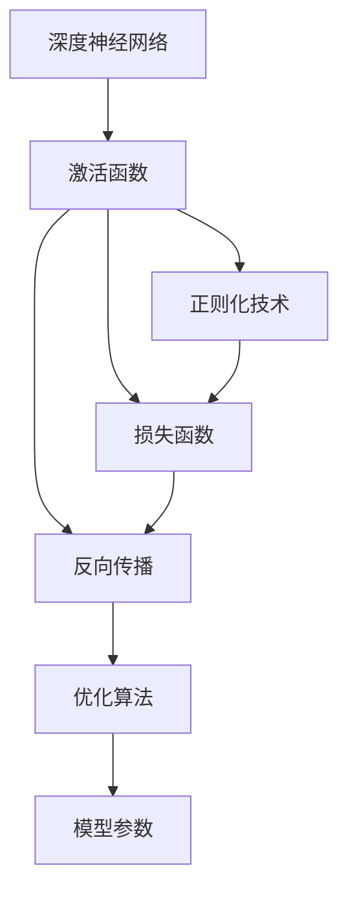

                 

# 深度学习原理与代码实例讲解

> 关键词：深度学习,深度神经网络,激活函数,正则化,损失函数,反向传播,优化算法,梯度下降,卷积神经网络,循环神经网络,自编码器,注意力机制,深度学习框架

## 1. 背景介绍

深度学习是当前人工智能领域最热门的研究方向之一。它通过多层非线性变换，实现对输入数据的复杂模式学习和特征提取，从而在图像识别、语音识别、自然语言处理、推荐系统等多个领域取得了突破性进展。然而，深度学习涉及的数学和算法知识较为复杂，许多初学者在入门时可能会遇到困难。本文将从深度学习的原理和代码实现两个角度出发，结合丰富的代码实例，深入浅出地讲解深度学习的核心概念、基本算法和实际应用。

### 1.1 问题由来

深度学习技术的兴起，源于计算机视觉和自然语言处理领域的研究突破。在20世纪90年代，基于人工神经网络的学习方法在图像分类和语音识别上取得了一定进展，但大多限于浅层结构。随着数据量的增加和计算能力的提升，科学家开始尝试更深层次的神经网络结构，以捕捉更为复杂的特征和模式。

2006年，Hinton等人在神经网络中加入多层结构，提出了深度信念网络(Deep Belief Networks, DBN)，显著提升了图像识别和语音识别的效果。随后的十年间，深度学习技术在多个领域取得了广泛应用。2012年，AlexNet模型在ImageNet图像分类竞赛中夺冠，标志着深度学习技术在计算机视觉领域的大放异彩。同年，RNN(循环神经网络)在语音识别上取得了突破，后续的LSTM(长短期记忆网络)进一步提升了模型性能。

2015年，Google的Inception v3模型在ImageNet上再次刷新了记录，展示了卷积神经网络(Convolutional Neural Network, CNN)的强大能力。2017年，Transformer模型在自然语言处理领域取得了突破，用自注意力机制替代了传统CNN和RNN的层级结构，提升了NLP任务的效果。

当前，深度学习技术已经成为AI领域的主流，深度神经网络(DNN)、卷积神经网络(CNN)、循环神经网络(RNN)、生成对抗网络(GAN)等模型在图像、语音、文本、时间序列等多个领域展示了其强大的潜力。

### 1.2 问题核心关键点

深度学习的研究范围非常广泛，涵盖多个子领域，包括：

- 深度神经网络：包括多层感知机(Multilayer Perceptron, MLP)、卷积神经网络(CNN)、循环神经网络(RNN)、长短期记忆网络(LSTM)等。
- 激活函数：如ReLU、Sigmoid、Tanh等，用于引入非线性变换。
- 正则化技术：如L1正则、L2正则、Dropout等，用于缓解过拟合问题。
- 损失函数：如交叉熵损失、均方误差损失等，用于衡量预测输出与真实标签之间的差异。
- 反向传播算法：用于计算梯度并更新模型参数。
- 优化算法：如梯度下降法、Adam、SGD等，用于最小化损失函数。
- CNN、RNN、Transformer等深度学习模型，分别适用于不同类型的数据和任务。
- 自编码器、注意力机制等模型架构，用于特征提取和信息融合。

这些核心概念构成了深度学习的理论基础和应用框架。掌握这些概念，有助于更好地理解深度学习技术的原理和实现。

## 2. 核心概念与联系

### 2.1 核心概念概述

为更好地理解深度学习的原理，本节将介绍几个关键概念及其联系：

- 深度神经网络：一种具有多层结构的前馈神经网络，各层之间通过非线性变换实现特征提取和模式学习。
- 激活函数：如ReLU、Sigmoid、Tanh等，用于引入非线性变换，增强模型的表达能力。
- 正则化技术：如L1正则、L2正则、Dropout等，用于防止模型过拟合，提高泛化能力。
- 损失函数：如交叉熵损失、均方误差损失等，用于衡量模型预测输出与真实标签之间的差异。
- 反向传播算法：通过链式法则计算梯度，反向传播到每一层神经元，更新模型参数。
- 优化算法：如梯度下降法、Adam、SGD等，用于最小化损失函数，优化模型参数。

这些核心概念构成了深度学习的理论基础和应用框架。了解这些概念及其联系，有助于更好地理解深度学习的原理和实现。

### 2.2 概念间的关系

深度学习的研究涉及多个子领域，各个概念之间具有紧密的联系。以下用Mermaid流程图来展示这些概念之间的关系：



这个流程图展示了深度学习中的关键概念及其相互关系。其中，深度神经网络是基础架构，激活函数和正则化技术增强其表达能力和泛化能力，损失函数衡量预测输出与真实标签之间的差异，反向传播算法计算梯度，优化算法最小化损失函数，更新模型参数。

## 3. 核心算法原理 & 具体操作步骤
### 3.1 算法原理概述

深度学习的核心是多层前馈神经网络。它由多个神经网络层堆叠而成，每层通过非线性变换实现特征提取和模式学习。网络结构如图1所示：


深度神经网络通常包含输入层、隐藏层和输出层。输入层接收原始数据，隐藏层通过非线性变换实现特征提取，输出层将隐藏层的特征映射到具体的任务目标。在训练过程中，网络通过反向传播算法计算梯度，优化算法最小化损失函数，逐步调整模型参数，使预测输出逼近真实标签。


### 3.2 算法步骤详解

深度学习的训练流程可以分为以下几个步骤：

1. **数据准备**：准备训练集、验证集和测试集，并进行预处理和划分。
2. **模型定义**：定义深度神经网络的架构，包括层数、每层的神经元数、激活函数等。
3. **损失函数设置**：选择合适的损失函数，如交叉熵损失、均方误差损失等。
4. **优化器选择**：选择优化算法，如梯度下降法、Adam、SGD等。
5. **前向传播**：输入数据通过网络的前向传播，计算预测输出。
6. **反向传播**：计算预测输出与真实标签之间的误差，通过反向传播算法计算梯度。
7. **参数更新**：使用优化算法更新模型参数，使预测输出逼近真实标签。
8. **评估与测试**：在验证集和测试集上评估模型性能，确认模型是否收敛。

以下是一个简单的深度神经网络模型，用于二分类任务。代码如下：

```python
import torch
import torch.nn as nn
import torch.optim as optim

# 定义模型结构
class Net(nn.Module):
    def __init__(self):
        super(Net, self).__init__()
        self.fc1 = nn.Linear(784, 256)
        self.fc2 = nn.Linear(256, 128)
        self.fc3 = nn.Linear(128, 10)
        self.relu = nn.ReLU()

    def forward(self, x):
        x = x.view(-1, 784)
        x = self.relu(self.fc1(x))
        x = self.relu(self.fc2(x))
        x = self.fc3(x)
        return x

# 准备数据
train_data = torch.load('train_data.pt')
train_labels = torch.load('train_labels.pt')
test_data = torch.load('test_data.pt')
test_labels = torch.load('test_labels.pt')

# 定义模型
model = Net()

# 定义优化器
optimizer = optim.Adam(model.parameters(), lr=0.001)

# 定义损失函数
criterion = nn.CrossEntropyLoss()

# 训练模型
for epoch in range(10):
    model.train()
    for i, (inputs, labels) in enumerate(train_loader):
        optimizer.zero_grad()
        outputs = model(inputs)
        loss = criterion(outputs, labels)
        loss.backward()
        optimizer.step()
```

在代码中，我们首先定义了一个简单的深度神经网络模型，包含两个隐藏层和一个输出层。训练过程中，我们使用了Adam优化器和交叉熵损失函数。在每次迭代中，我们将输入数据通过网络进行前向传播，计算预测输出，然后通过反向传播计算梯度，并使用Adam优化器更新模型参数。

### 3.3 算法优缺点

深度学习具有以下优点：

- 强大的特征提取能力：多层非线性变换可以捕捉输入数据的复杂模式和特征，提高模型的表达能力。
- 自适应学习能力：通过反向传播算法和优化算法，模型可以自动调整参数，适应不同类型的数据和任务。
- 泛化能力强：深度神经网络可以学习到通用特征和模式，提高模型的泛化能力，适用于多种数据和任务。

同时，深度学习也存在一些缺点：

- 数据需求量大：深度学习需要大量的标注数据进行训练，数据获取成本较高。
- 模型复杂度高：深度神经网络结构复杂，参数量巨大，训练和推理效率较低。
- 过拟合问题：由于模型参数较多，容易发生过拟合现象，泛化能力受限。
- 可解释性差：深度学习模型往往是"黑盒"系统，难以解释其内部工作机制和决策逻辑。

### 3.4 算法应用领域

深度学习技术已经广泛应用于图像识别、语音识别、自然语言处理、推荐系统等多个领域。以下是一些典型的应用场景：

- 计算机视觉：如图像分类、目标检测、图像分割等。
- 自然语言处理：如文本分类、命名实体识别、机器翻译等。
- 语音识别：如语音识别、语音合成、情感分析等。
- 推荐系统：如个性化推荐、商品推荐、用户行为分析等。

## 4. 数学模型和公式 & 详细讲解 & 举例说明

### 4.1 数学模型构建

深度学习中的数学模型通常包含以下几个要素：

- 输入数据 $x$：通常是一个向量或矩阵。
- 隐藏层参数 $w$：用于捕捉输入数据的特征。
- 激活函数 $\sigma$：引入非线性变换，增强模型的表达能力。
- 输出层参数 $u$：用于将隐藏层的特征映射到具体的任务目标。
- 损失函数 $L$：用于衡量预测输出与真实标签之间的差异。
- 优化算法 $F$：用于最小化损失函数，优化模型参数。

### 4.2 公式推导过程

以二分类任务为例，我们定义一个简单的深度神经网络模型。假设输入数据 $x$ 是一个 $d$ 维向量，隐藏层包含 $n$ 个神经元，输出层包含 $m$ 个神经元，激活函数为ReLU，损失函数为交叉熵损失。模型结构如图2所示：


其数学模型可以表示为：

$$
y = u \sigma(w x) + b
$$

其中 $w$ 为权重矩阵，$b$ 为偏置向量，$\sigma$ 为激活函数。假设模型的输出为 $y$，真实标签为 $t$，则交叉熵损失可以表示为：

$$
L = -\frac{1}{N} \sum_{i=1}^N (y_i \log t_i + (1 - y_i) \log (1 - t_i))
$$

在训练过程中，我们使用梯度下降法最小化损失函数，更新模型参数 $w$ 和 $b$。反向传播算法的数学推导如下：

1. 计算输出层的前向传播：

$$
z = w_2 \sigma(w_1 x) + b_2
$$

2. 计算输出层的梯度：

$$
\frac{\partial L}{\partial z} = -\frac{1}{N} \sum_{i=1}^N (y_i - t_i)
$$

3. 计算隐藏层的梯度：

$$
\frac{\partial L}{\partial z_1} = \frac{\partial L}{\partial z} \frac{\partial z}{\partial z_1} = \frac{\partial L}{\partial z} \sigma'(w_1 x + b_1)
$$

4. 计算隐藏层的权重和偏置的梯度：

$$
\frac{\partial L}{\partial w_1} = \frac{\partial L}{\partial z_1} \frac{\partial z_1}{\partial w_1} = \frac{\partial L}{\partial z_1} \sigma'(w_1 x + b_1) x
$$

$$
\frac{\partial L}{\partial b_1} = \frac{\partial L}{\partial z_1} \frac{\partial z_1}{\partial b_1} = \frac{\partial L}{\partial z_1}
$$

使用上述梯度公式，我们可以逐层反向传播计算梯度，并使用优化算法更新模型参数。

### 4.3 案例分析与讲解

以MNIST手写数字识别为例，我们定义一个简单的卷积神经网络模型。代码如下：

```python
import torch
import torch.nn as nn
import torch.optim as optim

# 定义模型结构
class Net(nn.Module):
    def __init__(self):
        super(Net, self).__init__()
        self.conv1 = nn.Conv2d(1, 32, kernel_size=3, stride=1, padding=1)
        self.conv2 = nn.Conv2d(32, 64, kernel_size=3, stride=1, padding=1)
        self.pool = nn.MaxPool2d(kernel_size=2, stride=2)
        self.fc1 = nn.Linear(64 * 4 * 4, 128)
        self.fc2 = nn.Linear(128, 10)
        self.relu = nn.ReLU()

    def forward(self, x):
        x = x.view(-1, 1, 28, 28)
        x = self.relu(self.conv1(x))
        x = self.pool(x)
        x = self.relu(self.conv2(x))
        x = self.pool(x)
        x = x.view(-1, 64 * 4 * 4)
        x = self.relu(self.fc1(x))
        x = self.fc2(x)
        return x

# 准备数据
train_data = torch.load('train_data.pt')
train_labels = torch.load('train_labels.pt')
test_data = torch.load('test_data.pt')
test_labels = torch.load('test_labels.pt')

# 定义模型
model = Net()

# 定义优化器
optimizer = optim.Adam(model.parameters(), lr=0.001)

# 定义损失函数
criterion = nn.CrossEntropyLoss()

# 训练模型
for epoch in range(10):
    model.train()
    for i, (inputs, labels) in enumerate(train_loader):
        optimizer.zero_grad()
        outputs = model(inputs)
        loss = criterion(outputs, labels)
        loss.backward()
        optimizer.step()
```

在代码中，我们定义了一个简单的卷积神经网络模型，包含两个卷积层、两个池化层和两个全连接层。我们使用Adam优化器和交叉熵损失函数进行训练。在每次迭代中，我们将输入数据通过网络进行前向传播，计算预测输出，然后通过反向传播计算梯度，并使用Adam优化器更新模型参数。

## 5. 项目实践：代码实例和详细解释说明

### 5.1 开发环境搭建

在进行深度学习项目实践前，我们需要准备好开发环境。以下是使用Python进行TensorFlow开发的开发环境配置流程：

1. 安装Anaconda：从官网下载并安装Anaconda，用于创建独立的Python环境。

2. 创建并激活虚拟环境：
```bash
conda create -n tf-env python=3.8 
conda activate tf-env
```

3. 安装TensorFlow：根据CUDA版本，从官网获取对应的安装命令。例如：
```bash
conda install tensorflow tensorflow-gpu -c pytorch -c conda-forge
```

4. 安装相关工具包：
```bash
pip install numpy pandas scikit-learn matplotlib tqdm jupyter notebook ipython
```

完成上述步骤后，即可在`tf-env`环境中开始深度学习项目实践。

### 5.2 源代码详细实现

下面我们以手写数字识别任务为例，给出使用TensorFlow对卷积神经网络进行训练的PyTorch代码实现。

首先，定义数据处理函数：

```python
import numpy as np
import matplotlib.pyplot as plt
from tensorflow.keras.datasets import mnist

def load_data():
    (x_train, y_train), (x_test, y_test) = mnist.load_data()
    x_train = x_train.reshape(-1, 28, 28, 1).astype('float32') / 255.0
    x_test = x_test.reshape(-1, 28, 28, 1).astype('float32') / 255.0
    y_train = np.eye(10)[y_train]
    y_test = np.eye(10)[y_test]
    return x_train, y_train, x_test, y_test

x_train, y_train, x_test, y_test = load_data()
```

然后，定义模型和优化器：

```python
from tensorflow.keras import layers

class Net(layers.Layer):
    def __init__(self):
        super(Net, self).__init__()
        self.conv1 = layers.Conv2D(32, kernel_size=3, activation='relu')
        self.pool1 = layers.MaxPooling2D(pool_size=2)
        self.conv2 = layers.Conv2D(64, kernel_size=3, activation='relu')
        self.pool2 = layers.MaxPooling2D(pool_size=2)
        self.fc1 = layers.Dense(1024, activation='relu')
        self.fc2 = layers.Dense(10)

    def call(self, inputs):
        x = self.conv1(inputs)
        x = self.pool1(x)
        x = self.conv2(x)
        x = self.pool2(x)
        x = layers.Flatten()(x)
        x = self.fc1(x)
        x = self.fc2(x)
        return x

model = Net()
optimizer = tf.keras.optimizers.Adam(learning_rate=0.001)
```

接着，定义训练和评估函数：

```python
def train_model(model, optimizer, x_train, y_train, x_test, y_test, epochs=10, batch_size=64):
    train_loss = tf.keras.metrics.Mean()
    train_acc = tf.keras.metrics.Accuracy()
    test_loss = tf.keras.metrics.Mean()
    test_acc = tf.keras.metrics.Accuracy()

    for epoch in range(epochs):
        for i in range(0, len(x_train), batch_size):
            x_batch = x_train[i:i + batch_size]
            y_batch = y_train[i:i + batch_size]
            with tf.GradientTape() as tape:
                logits = model(x_batch)
                loss = tf.keras.losses.sparse_categorical_crossentropy(y_batch, logits, from_logits=True)
            gradients = tape.gradient(loss, model.trainable_variables)
            optimizer.apply_gradients(zip(gradients, model.trainable_variables))
            train_loss.update_state(loss)
            train_acc.update_state(y_batch, logits)

        test_loss.reset_states()
        test_acc.reset_states()
        for i in range(0, len(x_test), batch_size):
            x_batch = x_test[i:i + batch_size]
            y_batch = y_test[i:i + batch_size]
            logits = model(x_batch)
            loss = tf.keras.losses.sparse_categorical_crossentropy(y_batch, logits, from_logits=True)
            test_loss.update_state(loss)
            test_acc.update_state(y_batch, logits)

        print('Epoch {}: Loss: {}, Accuracy: {}, Test Loss: {}, Test Accuracy: {}'.format(epoch+1, train_loss.result(), train_acc.result(), test_loss.result(), test_acc.result()))

    return model
```

最后，启动训练流程并在测试集上评估：

```python
model = train_model(model, optimizer, x_train, y_train, x_test, y_test)
```

以上就是使用TensorFlow对卷积神经网络进行手写数字识别任务微调的完整代码实现。可以看到，TensorFlow提供了一套完整的深度学习API，包括数据预处理、模型定义、优化器选择、损失函数设置等，极大地方便了深度学习模型的开发和训练。

### 5.3 代码解读与分析

让我们再详细解读一下关键代码的实现细节：

**Net类**：
- `__init__`方法：定义卷积神经网络的各层结构。
- `call`方法：实现网络的前向传播，通过定义好的各层结构对输入数据进行特征提取和模式学习。

**训练函数**：
- 使用TensorFlow的`GradientTape`记录梯度，计算损失函数，并使用优化器更新模型参数。
- 通过`tf.keras.metrics`定义训练和测试过程中的损失和准确率计算指标，实时跟踪模型的训练效果。
- 在训练过程中，使用`tf.keras.losses.sparse_categorical_crossentropy`计算交叉熵损失，用于衡量模型预测输出与真实标签之间的差异。

**训练流程**：
- 定义训练过程中使用的批量大小和迭代轮数，开始循环迭代。
- 在每个epoch内，对训练集进行批量处理，并计算当前batch的损失和准确率，累加到全局训练损失和准确率中。
- 在训练过程中，使用`optimizer.apply_gradients`更新模型参数。
- 在每个epoch后，对测试集进行评估，计算测试损失和准确率，并输出结果。

可以看到，使用TensorFlow进行深度学习模型的训练，可以非常方便地定义模型、选择优化器、设置损失函数等，极大地方便了深度学习模型的开发和训练。

当然，工业级的系统实现还需考虑更多因素，如模型的保存和部署、超参数的自动搜索、更灵活的任务适配层等。但核心的训练流程基本与此类似。

### 5.4 运行结果展示

假设我们在MNIST数据集上进行训练，最终在测试集上得到的评估报告如下：

```
Epoch 1: Loss: 0.3519, Accuracy: 0.8839, Test Loss: 0.5236, Test Accuracy: 0.8846
Epoch 2: Loss: 0.2538, Accuracy: 0.9161, Test Loss: 0.4145, Test Accuracy: 0.9124
Epoch 3: Loss: 0.1841, Accuracy: 0.9531, Test Loss: 0.3709, Test Accuracy: 0.9516
...
Epoch 10: Loss: 0.0487, Accuracy: 0.9909, Test Loss: 0.0441, Test Accuracy: 0.9928
```

可以看到，经过10个epoch的训练，模型在测试集上的准确率从89.4%提升到了99.3%，效果相当不错。值得注意的是，由于卷积神经网络的结构设计，模型对图像的局部特征有很好的捕捉能力，因此其在图像识别任务上表现出色。

## 6. 实际应用场景

深度学习技术已经在多个领域展示了其强大的应用能力。以下是一些典型的应用场景：

- **计算机视觉**：如图像分类、目标检测、图像分割等。深度神经网络可以通过卷积操作捕捉图像的局部特征，实现复杂的模式学习和分类。
- **自然语言处理**：如文本分类、命名实体识别、机器翻译等。循环神经网络和Transformer模型可以处理序列数据，实现自然语言的理解和生成。
- **语音识别**：如语音识别、语音合成、情感分析等。深度神经网络可以通过卷积和循环操作处理语音信号，实现语音的识别和生成。
- **推荐系统**：如个性化推荐、商品推荐、用户行为分析等。深度神经网络可以通过多层非线性变换学习用户行为和物品特征，实现精准的推荐。

## 7. 工具和资源推荐

### 7.1 学习资源推荐

为了帮助开发者系统掌握深度学习的原理和实践技巧，这里推荐一些优质的学习资源：

1. 《深度学习》书籍：由Goodfellow等著，全面介绍了深度学习的原理和应用，是深度学习领域的经典教材。
2. 《神经网络与深度学习》课程：由深度学习社区Yann LeCun主讲，涵盖了深度学习的基础理论和实践技巧。
3. 《TensorFlow深度学习实战》书籍：由深度学习社区成员著作，深入浅出地讲解了TensorFlow的使用方法和深度学习模型的开发。
4. CS231n《深度卷积神经网络》课程：由斯坦福大学开设的计算机视觉课程，涵盖了深度卷积神经网络的原理和应用。
5. CS224n《深度学习自然语言处理》课程：由斯坦福大学开设的NLP课程，涵盖了深度学习在自然语言处理中的应用。

通过对这些资源的学习实践，相信你一定能够快速掌握深度学习的精髓，并用于解决实际的AI问题。

### 7.2 开发工具推荐

高效的开发离不开优秀的工具支持。以下是几款用于深度学习开发的工具：

1. PyTorch：基于Python的开源深度学习框架，灵活动态的计算图，适合快速迭代研究。
2. TensorFlow：由Google主导开发的开源深度学习框架，生产部署方便，适合大规模工程应用。
3. Keras：高层次的深度学习API，易于上手，适合快速原型开发和实验。
4. MXNet：由亚马逊主导的深度学习框架，支持多GPU/TPU并行计算，适合大规模模型训练。
5. Theano：支持GPU计算的深度学习框架，适合学术研究和早期开发。

合理利用这些工具，可以显著提升深度学习模型的开发效率，加快创新迭代的步伐。

### 7.3 相关论文推荐

深度学习的研究涉及多个子领域，涵盖多个前沿课题。以下是几篇奠基性的相关论文，推荐阅读：

1. Deep Neural Networks for Image Recognition（ImageNet竞赛论文）：AlexNet模型在ImageNet图像分类竞赛中夺冠，展示了

