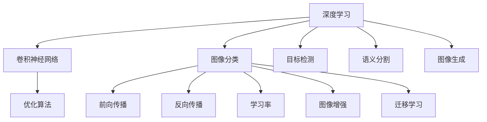
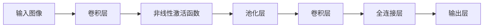
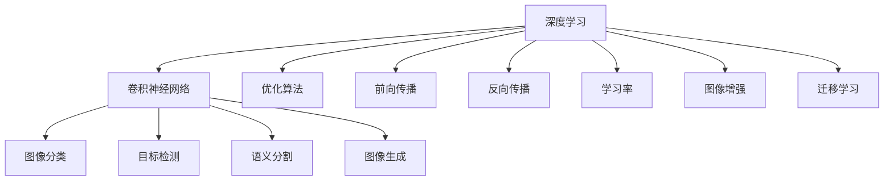
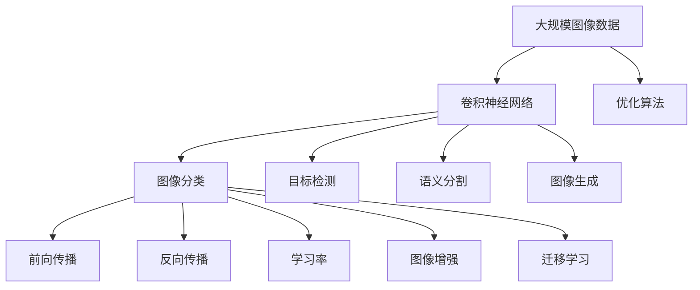

                 

# 深度学习在计算机视觉中的应用

> 关键词：深度学习, 计算机视觉, 卷积神经网络(CNN), 图像分类, 目标检测, 语义分割, 图像生成, 优化算法, 前向传播, 反向传播, 学习率, 图像增强, 迁移学习

## 1. 背景介绍

### 1.1 问题由来

随着深度学习技术的不断进步，计算机视觉领域取得了显著的成果。深度学习通过构建多层神经网络结构，自动学习数据中的复杂模式，实现了图像识别、目标检测、语义分割等诸多任务的突破。其中，卷积神经网络(CNN)因其强大的特征提取能力，成为计算机视觉领域的主流算法。

然而，尽管CNN在许多任务上取得了优异的表现，但其对于数据标注的需求较大，训练过程复杂，仍存在一些挑战。例如，训练数据集的大小和质量对于模型的性能有着重要影响，数据集的随机性和复杂性可能导致模型泛化能力不足。此外，训练过程中的计算资源和时间成本也较高，使得在大规模数据集上的模型训练成为一项巨大的挑战。

针对这些挑战，深度学习在计算机视觉中的应用也日益丰富。本博客将深入探讨深度学习在计算机视觉中的应用，详细阐述卷积神经网络的工作原理，介绍其在图像分类、目标检测、语义分割和图像生成等任务中的实践案例，并探讨优化算法、前向传播、反向传播、学习率、图像增强、迁移学习等核心概念，以期为计算机视觉领域的研究者和实践者提供全面的技术指导。

### 1.2 问题核心关键点

深度学习在计算机视觉中的应用主要集中在以下几个关键点：

1. 卷积神经网络：作为深度学习中最成功的网络结构之一，CNN在图像识别、目标检测、语义分割等任务中展现了强大的特征提取和模式识别能力。
2. 图像分类：CNN通过学习数据集的特征，实现对图像类别的准确分类。
3. 目标检测：CNN能够在图像中准确地检测并定位物体，常用于自动驾驶、安防监控等领域。
4. 语义分割：CNN能够将图像中的每个像素与对应的语义标签关联，实现图像的像素级分类。
5. 图像生成：通过生成对抗网络(GAN)等方法，CNN能够生成逼真且具有多样化特征的图像。
6. 优化算法：用于训练CNN的优化算法，包括梯度下降、Adam等，确保模型能够稳定收敛。
7. 前向传播和反向传播：CNN训练的基本过程，包括输入数据通过网络层的逐层传递和参数的更新。
8. 学习率：控制模型参数更新速度的关键超参数，对模型训练效果有着重要影响。
9. 图像增强：通过一系列数据增强技术，增加数据集的多样性，提升模型的泛化能力。
10. 迁移学习：利用预训练模型对新任务的微调，减少数据标注需求，加快模型训练速度。

这些关键点共同构成了深度学习在计算机视觉中的应用框架，使得计算机视觉技术在诸多领域中得以广泛应用。

### 1.3 问题研究意义

深度学习在计算机视觉中的应用，对于推动计算机视觉技术的进步和普及，具有重要意义：

1. 提升了图像识别的准确率和速度：CNN通过自动学习图像特征，显著提高了图像分类、目标检测等任务的精度和处理速度。
2. 拓展了计算机视觉的应用场景：如自动驾驶、医疗影像分析、社交媒体图像识别等，深度学习为计算机视觉技术在更多领域的应用提供了可能。
3. 减少了人工标注成本：利用迁移学习和预训练模型，可以在较少的标注数据上训练出高性能模型，降低数据标注成本。
4. 提升了模型泛化能力：通过图像增强和数据扩充，深度学习模型能够更好地适应不同场景和数据分布，提高模型泛化性能。
5. 促进了人工智能技术的产业化：计算机视觉技术的突破，推动了计算机视觉产品和服务在实际应用中的落地，加速了人工智能技术的产业化进程。

## 2. 核心概念与联系

### 2.1 核心概念概述

为更好地理解深度学习在计算机视觉中的应用，本节将介绍几个密切相关的核心概念：

1. 深度学习(Deep Learning)：利用多层神经网络结构，自动学习数据中的复杂模式，实现对数据的特征提取和模式识别。

2. 卷积神经网络(CNN)：基于卷积和池化操作的神经网络结构，广泛应用于图像分类、目标检测、语义分割等计算机视觉任务。

3. 图像分类(Image Classification)：将输入图像分为多个类别，常用交叉熵损失函数进行优化。

4. 目标检测(Object Detection)：识别并定位图像中的物体，通过回归和分类两种方法实现。

5. 语义分割(Semantic Segmentation)：将图像中的每个像素与对应的语义标签关联，实现像素级分类。

6. 图像生成(Image Generation)：通过生成对抗网络(GAN)等方法，生成逼真且具有多样化特征的图像。

7. 优化算法(Optimization Algorithm)：用于训练CNN的优化算法，包括梯度下降、Adam等。

8. 前向传播(Forward Propagation)：CNN训练的基本过程，包括输入数据通过网络层的逐层传递。

9. 反向传播(Backward Propagation)：通过计算损失函数的梯度，反向传播更新模型参数。

10. 学习率(Learning Rate)：控制模型参数更新速度的关键超参数，对模型训练效果有着重要影响。

11. 图像增强(Image Enhancement)：通过一系列数据增强技术，增加数据集的多样性，提升模型的泛化能力。

12. 迁移学习(Transfer Learning)：利用预训练模型对新任务的微调，减少数据标注需求，加快模型训练速度。

这些核心概念之间的逻辑关系可以通过以下Mermaid流程图来展示：



这个流程图展示了深度学习在计算机视觉中的应用框架，以及各个核心概念之间的关系：

1. 深度学习利用卷积神经网络结构，进行图像分类、目标检测、语义分割等任务。
2. 优化算法、前向传播、反向传播、学习率等技术，用于训练卷积神经网络模型。
3. 图像增强和迁移学习等技术，用于提高模型的泛化能力，减少数据标注需求。

### 2.2 概念间的关系

这些核心概念之间存在着紧密的联系，形成了深度学习在计算机视觉中的应用生态系统。下面我们通过几个Mermaid流程图来展示这些概念之间的关系。

#### 2.2.1 卷积神经网络的结构



这个流程图展示了卷积神经网络的结构。输入图像经过卷积层、非线性激活函数、池化层等多层网络逐层传递，最终输出分类结果。

#### 2.2.2 卷积神经网络的训练过程


这个流程图展示了卷积神经网络的训练过程。输入图像通过前向传播计算输出，然后计算损失函数，反向传播更新参数，并输出预测结果。最后，在验证集上进行评估，决定是否继续训练。

#### 2.2.3 深度学习在计算机视觉中的应用



这个综合流程图展示了深度学习在计算机视觉中的应用框架，以及各个核心概念之间的关系。

### 2.3 核心概念的整体架构

最后，我们用一个综合的流程图来展示这些核心概念在大语言模型微调过程中的整体架构：



这个综合流程图展示了从数据输入到模型输出的完整过程，各个核心概念在大规模图像数据上的作用和相互关系。通过这些流程图，我们可以更清晰地理解深度学习在计算机视觉中的应用过程，为后续深入讨论具体的技术细节奠定基础。

## 3. 核心算法原理 & 具体操作步骤
### 3.1 算法原理概述

深度学习在计算机视觉中的应用，核心在于利用卷积神经网络进行特征提取和模式识别。其基本原理可以概括为以下几个方面：

1. 卷积神经网络：利用卷积和池化操作，逐层提取图像的特征，学习高层次的抽象特征表示。
2. 图像分类：通过训练网络学习图像的特征表示，使用交叉熵损失函数进行优化，实现图像分类的任务。
3. 目标检测：通过回归和分类两种方法，实现对图像中物体的检测和定位。
4. 语义分割：通过像素级别的分类，将图像中的每个像素与对应的语义标签关联。
5. 图像生成：通过生成对抗网络等方法，生成逼真且具有多样化特征的图像。

这些算法原理共同构成了深度学习在计算机视觉中的应用基础，使得计算机视觉技术在图像处理和分析等领域取得了显著的成果。

### 3.2 算法步骤详解

深度学习在计算机视觉中的应用，一般包括以下几个关键步骤：

**Step 1: 准备数据集和模型**

- 收集大量的标注数据集，划分为训练集、验证集和测试集。
- 选择合适的卷积神经网络模型，如VGG、ResNet、Inception等，作为初始化参数。

**Step 2: 定义损失函数和优化器**

- 定义针对特定任务的损失函数，如交叉熵、均方误差等。
- 选择合适的优化器，如SGD、Adam等，设置学习率、批大小、迭代轮数等超参数。

**Step 3: 执行前向传播和反向传播**

- 将训练集数据分批次输入模型，前向传播计算损失函数。
- 反向传播计算参数梯度，根据设定的优化算法和学习率更新模型参数。
- 周期性在验证集上评估模型性能，根据性能指标决定是否触发Early Stopping。
- 重复上述步骤直到满足预设的迭代轮数或Early Stopping条件。

**Step 4: 测试和部署**

- 在测试集上评估训练好的模型性能，对比微调前后的精度提升。
- 使用训练好的模型对新图像进行推理预测，集成到实际的应用系统中。
- 持续收集新的图像数据，定期重新训练模型，以适应数据分布的变化。

以上是深度学习在计算机视觉中的应用的一般流程。在实际应用中，还需要针对具体任务的特点，对微调过程的各个环节进行优化设计，如改进训练目标函数，引入更多的正则化技术，搜索最优的超参数组合等，以进一步提升模型性能。

### 3.3 算法优缺点

深度学习在计算机视觉中的应用，具有以下优点：

1. 自动特征提取：利用卷积神经网络自动学习图像特征，减少了手动特征提取的时间和成本。
2. 高精度：卷积神经网络通过多层次的学习，能够实现对图像的高精度分类和识别。
3. 鲁棒性：通过迁移学习和正则化技术，可以提高模型的泛化能力，增强对噪声和干扰的鲁棒性。
4. 可解释性：利用可视化技术，可以理解卷积神经网络的内部机制，提高模型的可解释性。

同时，深度学习在计算机视觉中的应用也存在一些局限性：

1. 数据标注成本高：深度学习模型需要大量的标注数据进行训练，数据标注成本较高。
2. 计算资源消耗大：卷积神经网络在大规模数据集上的训练和推理，需要大量的计算资源和存储空间。
3. 训练时间长：深度学习模型训练时间较长，需要较多的计算资源和训练时间。
4. 模型复杂度高：卷积神经网络结构复杂，需要大量的参数和计算资源进行训练和推理。

尽管存在这些局限性，但深度学习在计算机视觉中的应用，仍然展现出巨大的潜力和应用前景，正在成为计算机视觉领域的主流技术。

### 3.4 算法应用领域

深度学习在计算机视觉中的应用，已经涵盖了以下几个主要领域：

1. 图像分类：通过卷积神经网络对图像进行分类，实现对不同物体的识别。
2. 目标检测：通过回归和分类方法，实现对图像中物体的检测和定位。
3. 语义分割：通过像素级别的分类，将图像中的每个像素与对应的语义标签关联。
4. 图像生成：通过生成对抗网络等方法，生成逼真且具有多样化特征的图像。
5. 图像修复和增强：通过卷积神经网络对图像进行修复和增强，提高图像质量和视觉体验。
6. 风格转换：通过卷积神经网络实现图像风格的转换，增强图像的艺术效果。
7. 超分辨率：通过卷积神经网络对图像进行超分辨率处理，提高图像的分辨率。

除了上述这些领域外，深度学习在计算机视觉中的应用还在不断拓展，为计算机视觉技术带来了新的突破。

## 4. 数学模型和公式 & 详细讲解  
### 4.1 数学模型构建

深度学习在计算机视觉中的应用，涉及多种数学模型和公式。以下将详细介绍这些数学模型和公式的构建过程。

### 4.2 公式推导过程

#### 4.2.1 卷积神经网络

卷积神经网络的基本结构包括卷积层、池化层和全连接层。这里以LeNet-5为例，推导卷积神经网络的数学模型：

**输入图像**：$x \in \mathbb{R}^{m \times n \times c}$，其中$m$、$n$、$c$分别为图像的高度、宽度和通道数。

**卷积层**：卷积核大小为$k \times k$，步长为$s$，输出特征图大小为$\frac{m}{s} \times \frac{n}{s} \times f$，其中$f$为卷积层的输出特征数。卷积操作可以表示为：

$$
\begin{aligned}
y^{(1)}_{i,j,k} &= \sum_{l=0}^{f-1} w^{(1)}_{k,l} * x_{i \times s + l, j \times s + k} + b^{(1)}_l \\
w^{(1)}_{k,l} &\in \mathbb{R}^{k \times k \times c \times f}, b^{(1)}_l \in \mathbb{R}^{f}
\end{aligned}
$$

其中，$w^{(1)}_{k,l}$为卷积核参数，$b^{(1)}_l$为偏置参数。$*$表示卷积运算。

**非线性激活函数**：将卷积层的输出作为非线性激活函数的输入，常用的激活函数包括ReLU、Sigmoid等。

**池化层**：对卷积层的输出进行池化操作，减少特征图的大小。常用的池化方式包括最大池化和平均池化，可以表示为：

$$
y^{(2)}_{i,j} = \max_{k,l} y^{(1)}_{i+k,j+l}
$$

**全连接层**：将池化层的输出通过全连接层进行分类，常用的全连接层激活函数为Softmax。

**输出层**：将全连接层的输出作为分类结果。

#### 4.2.2 图像分类

图像分类是深度学习在计算机视觉中的重要应用之一。通过卷积神经网络对图像进行分类，可以实现对不同物体的识别。以LeNet-5为例，推导图像分类的数学模型：

**输入图像**：$x \in \mathbb{R}^{m \times n \times c}$，其中$m$、$n$、$c$分别为图像的高度、宽度和通道数。

**卷积层和池化层**：对输入图像进行卷积和池化操作，得到特征图$y^{(2)} \in \mathbb{R}^{r \times s \times f}$。

**全连接层和输出层**：将特征图通过全连接层进行分类，输出分类结果。

**损失函数**：交叉熵损失函数可以表示为：

$$
L = -\frac{1}{N} \sum_{i=1}^{N} \sum_{j=1}^{C} y_j \log p_j
$$

其中，$N$为样本数量，$C$为类别数量，$y_j$为样本的真实标签，$p_j$为模型预测的类别概率。

**优化器**：常用的优化器包括SGD、Adam等，可以表示为：

$$
w_{i,j} \leftarrow w_{i,j} - \eta \nabla_{w_{i,j}}L
$$

其中，$\eta$为学习率，$\nabla_{w_{i,j}}L$为损失函数对权重$w_{i,j}$的梯度。

#### 4.2.3 目标检测

目标检测是深度学习在计算机视觉中的另一个重要应用。通过回归和分类两种方法，实现对图像中物体的检测和定位。以Faster R-CNN为例，推导目标检测的数学模型：

**输入图像**：$x \in \mathbb{R}^{m \times n \times c}$，其中$m$、$n$、$c$分别为图像的高度、宽度和通道数。

**RPN层**：通过RPN（Region Proposal Network）层提出候选区域，计算每个候选区域的特征向量$z$。

**分类器层**：对每个候选区域进行分类，得到物体类别概率$P$和边界框回归结果$\Delta R$。

**回归损失**：通过边界框回归损失函数计算物体位置偏移量。

**分类损失**：通过交叉熵损失函数计算物体类别概率。

**非极大值抑制(NMS)**：对多个候选框进行非极大值抑制，选取得分最高的候选框作为最终检测结果。

#### 4.2.4 语义分割

语义分割是深度学习在计算机视觉中的重要应用之一。通过像素级别的分类，将图像中的每个像素与对应的语义标签关联。以U-Net为例，推导语义分割的数学模型：

**输入图像**：$x \in \mathbb{R}^{m \times n \times c}$，其中$m$、$n$、$c$分别为图像的高度、宽度和通道数。

**编码器**：对输入图像进行编码，得到高层次特征图。

**解码器**：对编码器的输出进行解码，得到与输入图像大小相同的预测图像。

**损失函数**：常用的损失函数包括交叉熵损失函数和Dice损失函数。

**优化器**：常用的优化器包括SGD、Adam等。

#### 4.2.5 图像生成

图像生成是深度学习在计算机视觉中的另一个重要应用。通过生成对抗网络等方法，生成逼真且具有多样化特征的图像。以GAN为例，推导图像生成的数学模型：

**输入噪声**：$z \in \mathbb{R}^{z}$，其中$z$为噪声维度。

**生成器**：将噪声$z$作为输入，生成逼真图像$x_g$。

**判别器**：判断输入图像$x$是否为真实图像。

**损失函数**：GAN使用对抗损失函数进行优化，可以表示为：

$$
L_G = -\mathbb{E}_{z \sim p(z)}[D(G(z))], \quad L_D = \mathbb{E}_{x \sim p(x)}[D(x)] - \mathbb{E}_{z \sim p(z)}[D(G(z))]
$$

其中，$G$为生成器，$D$为判别器，$p(z)$为噪声分布，$p(x)$为真实图像分布。

**优化器**：常用的优化器包括Adam等。

### 4.3 案例分析与讲解

以下分别以图像分类、目标检测、语义分割和图像生成为例，详细介绍深度学习在计算机视觉中的应用。

#### 4.3.1 图像分类

以LeNet-5为例，进行图像分类的案例分析与讲解：

**数据集准备**：使用MNIST数据集，包含60000个训练样本和10000个测试样本，每个样本的大小为28x28像素。

**模型搭建**：构建LeNet-5卷积神经网络，包含2个卷积层、3个全连接层和1个输出层。

**模型训练**：使用交叉熵损失函数和Adam优化器，训练模型30个epoch。

**模型测试**：在测试集上评估模型性能，计算准确率和损失函数。

#### 4.3.2 目标检测

以Faster R-CNN为例，进行目标检测的案例分析与讲解：

**数据集准备**：使用PASCAL VOC数据集，包含20000个训练样本和12000个测试样本，每个样本的大小为256x256像素。

**模型搭建**：构建Faster R-CNN卷积神经网络，包含RPN层和分类器层。

**模型训练**：使用交叉熵损失函数和RMSProp优化器，训练模型12个epoch。

**模型测试**：在测试集上评估模型性能，计算平均精度均值（AP）和召回率。

#### 4.3.3 语义分割

以U-Net为例，进行语义分割的案例分析与讲解：

**数据集准备**：使用PASCAL VOC数据集，包含20000个训练样本和12000个测试样本，每个样本的大小为256x256像素。

**模型搭建**：构建U-Net卷积神经网络，包含编码器和解码器。

**模型训练**：使用交叉熵损失函数和Adam优化器，训练模型30个epoch。

**模型测试**：在测试集上评估模型性能，计算Dice系数和像素精度。

#### 4.3.4 图像生成

以GAN为例，进行图像生成的案例分析与讲解：

**数据集准备**：使用MNIST数据集，包含60000个训练样本，每个样本的大小为28x28像素。

**模型搭建**：构建GAN模型，包含生成器和判别器。

**模型训练**：使用对抗损失函数和Adam优化器，训练模型100个epoch。

**模型测试**：生成随机噪声样本，通过生成器生成图像，评估图像质量。

## 5. 项目实践：代码实例和详细解释说明
### 5.1 开发环境搭建

在进行深度学习在计算机视觉中的应用实践前，我们需要准备好开发环境。以下是使用Python进行TensorFlow和Keras开发的环境配置流程：

1. 安装Anaconda：从官网下载并安装Anaconda，用于创建独立的Python环境。

2. 创建并激活虚拟环境：
```bash
conda create -n tf-env python=3.8 
conda activate tf-env
```

3. 安装TensorFlow和Keras：
```bash
conda install tensorflow==2.6 
conda install keras
```

4. 安装各类工具包：
```bash
pip install numpy pandas scikit-learn matplotlib tqdm jupyter notebook ipython
```

完成上述步骤后，即可在`tf-env`环境中开始深度学习在计算机视觉中的应用实践。

### 5.2 源代码详细实现

下面我们以图像分类任务为例，给出使用TensorFlow和Keras进行深度学习在计算机视觉中的应用代码实现。

首先，导入必要的库和模块：

```python
import tensorflow as tf
from tensorflow.keras import layers, models
from tensorflow.keras.datasets import mnist
from tensorflow.keras.utils import to_categorical
```

然后，定义数据集和模型：

```python
# 加载MNIST数据集
(x_train, y_train), (x_test, y_test) = mnist.load_data()

# 数据预处理
x_train = x_train.reshape(-1, 28, 28, 1).astype('float32') / 255.0
x_test = x_test.reshape(-1, 28, 28, 1).astype('float32') / 255.0
y_train = to_categorical(y_train, 10)
y_test = to_categorical(y_test, 10)

# 定义模型
model = models.Sequential([
    layers.Conv2D(32, (3, 3), activation='relu', input_shape=(28, 28, 1)),
    layers.MaxPooling2D((2, 2)),
    layers.Conv2D(64, (3, 3), activation='relu'),
    layers.MaxPooling2D((2, 2)),
    layers.Flatten(),
    layers.Dense(128, activation='relu'),
    layers.Dense(10, activation='softmax')
])
```

接着，定义训练和评估函数：

```python
# 定义损失函数和优化器
loss_fn = tf.keras.losses.CategoricalCrossentropy()
optimizer = tf.keras.optimizers.Adam()


