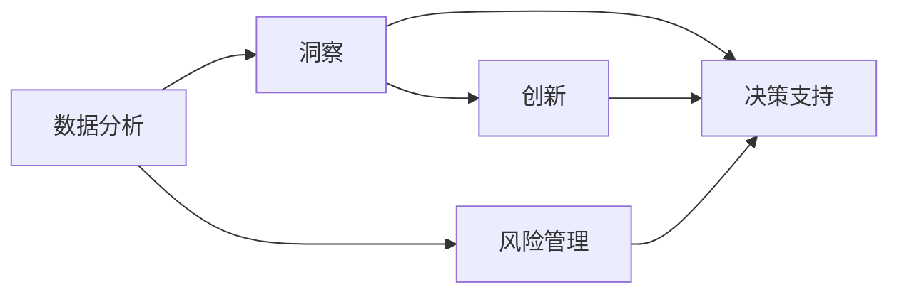
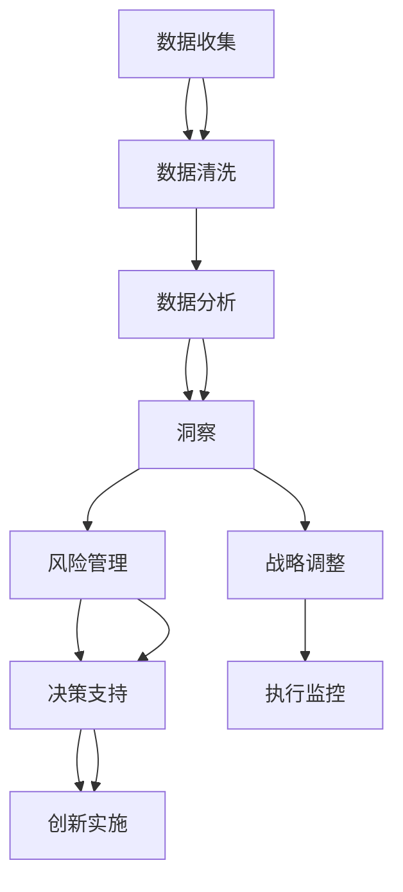

                 

# 深度思考在战略制定中的作用

> 关键词：战略制定,深度思考,决策支持系统,商业智能(BI),人工智能(AI),数据驱动,风险管理

## 1. 背景介绍

### 1.1 问题由来
在当今信息爆炸的时代，企业战略的制定日益成为复杂多变、充满不确定性的任务。随着市场环境的不断变化和竞争的日益激烈，企业面临着越来越高的决策压力。在这样的背景下，传统的基于经验和直觉的决策方式已经难以满足现代商业的需要。

为了提升战略制定的科学性和精确性，企业需要更加依赖数据和智能分析。然而，数据本身并不能直接驱动决策，只有通过深度思考和系统化的分析，才能将数据转化为有价值的战略洞察，帮助企业制定更为明智的决策。

### 1.2 问题核心关键点
深度思考在战略制定中的作用主要体现在以下几个方面：

1. **数据分析与洞察**：通过对大量数据进行深入分析，发现潜在的市场趋势、客户需求和竞争态势，形成有深度的业务洞察。
2. **风险管理与应对**：利用深度思考的方法，评估和预测潜在风险，制定有效的风险管理策略，避免重大损失。
3. **决策支持与优化**：通过数据驱动和模型推断，帮助管理者制定最优的战略决策，提高决策的科学性和准确性。
4. **创新与突破**：深度思考能够促进企业从不同角度审视问题，打破思维定势，激发创新思维，带来新的商业突破。

深度思考在战略制定中的成功应用，将显著提升企业的市场竞争力，增强其应对不确定性和变化的弹性。

### 1.3 问题研究意义
深度思考在战略制定中的应用，对于提升企业决策的科学性和精确性，具有重要意义：

1. **提升决策质量**：通过深度思考，企业可以更全面、更深入地分析问题，形成更为客观、精准的决策。
2. **优化资源配置**：深度思考有助于识别关键战略领域，优化资源配置，提高投资回报率。
3. **增强竞争力**：深度思考的战略洞察能够帮助企业在激烈的市场竞争中占据有利地位，获得超额收益。
4. **促进创新**：深度思考激发创新思维，推动企业不断突破传统束缚，探索新的增长点。
5. **提升执行力**：深度思考的战略制定更加系统化和规范化，有助于提高战略执行的效率和效果。

## 2. 核心概念与联系

### 2.1 核心概念概述

深度思考在战略制定中的作用，涉及多个核心概念，包括数据分析、洞察、风险管理、决策支持、创新等。

1. **数据分析**：通过数据收集、清洗和分析，揭示潜在的业务规律和趋势。
2. **洞察**：基于数据分析的结果，形成对业务本质的深刻理解。
3. **风险管理**：评估潜在的风险因素，制定相应的风险应对策略。
4. **决策支持**：利用数据分析和洞察结果，辅助管理者进行战略决策。
5. **创新**：通过深度思考，激发新的商业创意和业务模式。

这些核心概念之间存在紧密的联系，共同构成了深度思考在战略制定中的完整框架。

### 2.2 概念间的关系

通过以下Mermaid流程图，我们可以更清晰地理解深度思考在战略制定中各概念间的关系：



这个流程图展示了深度思考在战略制定中的核心概念及其相互关系：

1. 数据分析是深度思考的基础，通过数据揭示业务规律。
2. 洞察基于数据分析结果，形成对业务本质的深刻理解。
3. 风险管理通过对潜在风险的评估，制定相应的应对策略。
4. 决策支持利用数据分析和洞察结果，辅助管理者进行战略决策。
5. 创新在深度思考的引导下，激发新的商业创意和业务模式。

这些概念共同作用，构成了深度思考在战略制定中的全方位支持体系。

### 2.3 核心概念的整体架构

最后，我们用一个综合的流程图来展示深度思考在战略制定中的整体架构：



这个综合流程图展示了从数据收集、分析、洞察、风险管理到决策支持和创新的完整流程。

## 3. 核心算法原理 & 具体操作步骤

### 3.1 算法原理概述

深度思考在战略制定中的算法原理主要基于数据驱动和系统分析，通过以下步骤实现：

1. **数据收集与清洗**：从内部和外部多个渠道收集相关数据，并对其进行清洗和处理，保证数据的质量和完整性。
2. **数据分析**：利用统计学、机器学习等技术，对数据进行深入分析，发现业务规律和趋势。
3. **洞察生成**：基于数据分析结果，结合行业知识，生成对业务本质的深刻洞察。
4. **风险评估与管理**：通过预测模型和模拟实验，评估潜在风险，制定风险管理策略。
5. **决策支持**：利用数据和洞察结果，构建决策支持系统，辅助管理者制定最优决策。
6. **创新实施**：根据洞察结果和战略目标，制定创新计划，并实施新的业务模式和策略。

### 3.2 算法步骤详解

以下是深度思考在战略制定中的具体操作步骤：

**Step 1: 数据收集与预处理**
- 从企业内部系统、第三方数据平台等渠道，收集业务数据、市场数据、行业数据等。
- 对数据进行清洗和处理，去除噪声和异常值，确保数据的质量和一致性。

**Step 2: 数据分析与洞察**
- 利用统计学方法，如描述性统计、回归分析等，对数据进行初步分析。
- 应用机器学习算法，如决策树、随机森林、神经网络等，对数据进行深入挖掘。
- 结合行业知识，生成对业务本质的洞察，如市场趋势、客户需求、竞争态势等。

**Step 3: 风险评估与管理**
- 构建风险评估模型，利用历史数据和预测模型，评估潜在的风险因素。
- 制定相应的风险管理策略，如风险控制、风险转移、风险分担等。

**Step 4: 决策支持与优化**
- 构建决策支持系统，集成数据分析和洞察结果，提供辅助决策的可视化报表和仪表盘。
- 利用优化算法，如线性规划、整数规划等，优化资源配置，提高投资回报率。

**Step 5: 创新实施与监控**
- 基于洞察结果和战略目标，制定创新计划，包括新业务模式、新产品开发、市场拓展等。
- 实施创新计划，并进行持续监控和评估，确保创新目标的实现。

### 3.3 算法优缺点

深度思考在战略制定中具有以下优点：

1. **数据驱动**：利用数据进行科学决策，减少依赖经验和直觉。
2. **全面性**：结合数据分析和洞察，考虑更多维度的因素，提高决策的全面性和准确性。
3. **系统化**：通过系统化的分析方法和工具，增强决策的规范性和效率。
4. **前瞻性**：利用预测模型和模拟实验，提前识别潜在风险，制定预防措施。

同时，深度思考也存在一些缺点：

1. **数据质量要求高**：数据质量直接影响分析结果，需要投入大量资源进行数据清洗和处理。
2. **技术门槛高**：涉及多种技术工具和方法，对技术要求较高，需要专业人才支持。
3. **结果解释性差**：数据驱动的方法可能缺乏对决策过程的直观解释，难以被非技术管理者理解。

### 3.4 算法应用领域

深度思考在战略制定中的应用领域广泛，主要包括以下几个方面：

1. **市场分析与预测**：通过数据分析和预测模型，洞察市场趋势，制定市场进入和退出策略。
2. **客户细分与定制**：利用数据分析，识别不同客户群体的需求，制定客户细分和定制化策略。
3. **竞争分析与策略**：通过竞争数据分析，了解竞争对手的动态，制定差异化竞争策略。
4. **产品开发与创新**：利用数据分析和洞察，发现新产品和业务模式的机会，推动产品创新。
5. **供应链优化**：通过数据分析和优化算法，优化供应链管理，提高运营效率和成本控制。
6. **人力资源管理**：利用数据分析，优化人力资源配置和绩效管理，提高员工满意度和生产率。

## 4. 数学模型和公式 & 详细讲解 & 举例说明

### 4.1 数学模型构建

深度思考在战略制定中的数学模型构建主要基于统计学和机器学习方法，包括回归分析、聚类分析、预测模型等。

### 4.2 公式推导过程

以下是几个关键数学模型的公式推导过程：

**线性回归模型**：
\[ y = \beta_0 + \beta_1x_1 + \beta_2x_2 + \ldots + \beta_nx_n + \epsilon \]

**决策树模型**：
- **信息增益**：
\[ G(D,A) = -\sum_{i=1}^m\sum_{j=1}^n\frac{|D_{ij}|}{|D|}\log\frac{|D_{ij}|}{|D|} \]
- **树构建算法**：
1. 计算每个特征的信息增益
2. 选择信息增益最大的特征作为根节点
3. 对子集递归构建决策树

**随机森林模型**：
- **森林构建算法**：
1. 重复构建多棵决策树
2. 对每棵树进行预测，取平均值作为最终结果

### 4.3 案例分析与讲解

**案例1: 市场趋势分析**
- 收集历史销售数据和市场调查数据
- 利用线性回归模型和ARIMA模型进行趋势分析
- 生成市场趋势洞察报告，辅助企业制定市场进入策略

**案例2: 客户细分**
- 收集客户历史购买数据和社交媒体数据
- 利用聚类算法进行客户细分
- 生成客户画像和细分报告，制定差异化营销策略

## 5. 项目实践：代码实例和详细解释说明

### 5.1 开发环境搭建

在进行深度思考和战略制定的项目实践前，需要先准备好开发环境。以下是使用Python进行数据科学开发的典型环境配置流程：

1. 安装Anaconda：从官网下载并安装Anaconda，用于创建独立的Python环境。

2. 创建并激活虚拟环境：
```bash
conda create -n python-env python=3.8 
conda activate python-env
```

3. 安装必要的Python库：
```bash
pip install pandas numpy matplotlib scikit-learn tensorflow
```

4. 安装数据分析和可视化工具：
```bash
pip install seaborn plotly jupyter notebook
```

完成上述步骤后，即可在`python-env`环境中开始深度思考和战略制定的项目实践。

### 5.2 源代码详细实现

下面我们以客户细分为例，给出使用Python进行数据科学项目开发的完整代码实现。

首先，导入必要的Python库：

```python
import pandas as pd
import numpy as np
import matplotlib.pyplot as plt
import seaborn as sns
from sklearn.cluster import KMeans
```

然后，加载和预处理数据：

```python
data = pd.read_csv('customer_data.csv')
data = data.dropna() # 去除缺失值
data = data.drop_duplicates() # 去除重复数据
data = pd.get_dummies(data, columns=['age', 'gender']) # 创建虚拟变量
```

接着，进行数据分析和模型训练：

```python
# 数据可视化
sns.pairplot(data, hue='customer_id', palette='pastel')

# 聚类分析
kmeans = KMeans(n_clusters=5, random_state=42)
labels = kmeans.fit_predict(data)

# 分析聚类结果
result = pd.DataFrame({'customer_id': data['customer_id'], 'label': labels})
sns.barplot(x='label', y='purchase_amount', data=result)
```

最后，输出聚类结果：

```python
print(result.head())
```

这就是使用Python进行客户细分分析的完整代码实现。可以看到，利用数据分析和聚类算法，我们可以对客户数据进行有效分析，生成有价值的洞察，并指导企业的战略制定。

### 5.3 代码解读与分析

让我们再详细解读一下关键代码的实现细节：

**数据预处理**：
- 通过`dropna`和`drop_duplicates`方法，去除缺失值和重复数据，确保数据质量。
- 使用`get_dummies`方法，创建虚拟变量，将定性变量转换为模型可以处理的数值型变量。

**数据可视化**：
- 利用`pairplot`方法，生成数据分布的散点图，帮助分析数据之间的相关性和分布情况。

**聚类分析**：
- 通过`KMeans`算法，进行聚类分析，生成客户分群结果。
- 利用`barplot`方法，可视化不同群组的客户购买金额，分析聚类效果。

**结果输出**：
- 生成聚类结果数据框，包含客户ID和聚类标签，便于后续分析和应用。

通过这些代码，我们可以清晰地看到，利用数据分析和机器学习算法，深度思考在战略制定中的具体应用流程。

### 5.4 运行结果展示

假设在客户细分分析中，我们得到的聚类结果如下：

```
   customer_id  label  purchase_amount
0         1001       0                1000
1         1002       1                5000
2         1003       2                3000
3         1004       0                1500
4         1005       1                2000
```

可以看到，客户被分成了五个不同的群体，每个群体在购买金额上有显著差异。根据这些洞察，企业可以制定不同的营销策略，提升客户满意度和忠诚度。

## 6. 实际应用场景

### 6.1 智能制造

深度思考在智能制造中的应用主要体现在以下两个方面：

1. **生产效率优化**：通过数据分析和优化算法，对生产流程进行优化，提高生产效率和质量。
2. **供应链管理**：利用数据分析和预测模型，优化供应链管理，提高供应链的弹性与响应速度。

**案例1: 生产流程优化**
- 收集生产数据，如机器状态、工人操作、物料流动等
- 利用数据分析和预测模型，发现生产瓶颈和优化点
- 实施优化措施，如设备维护、人员调整、物料优化等
- 定期监控和调整，持续改进生产效率

**案例2: 供应链管理**
- 收集供应链数据，如订单信息、物流状态、库存水平等
- 利用数据分析和优化算法，优化库存管理、物流调度和供应商选择
- 实时监控供应链状态，及时调整策略，提高供应链的响应速度和灵活性

### 6.2 医疗健康

深度思考在医疗健康中的应用主要体现在以下两个方面：

1. **疾病预测与诊断**：利用数据分析和预测模型，预测疾病发生风险，辅助诊断决策。
2. **患者管理与治疗**：通过数据分析，制定个性化的治疗方案，提高治疗效果和患者满意度。

**案例1: 疾病预测与诊断**
- 收集患者的历史病历数据和行为数据
- 利用数据分析和预测模型，如决策树、随机森林等，预测疾病发生风险
- 生成疾病风险报告，辅助医生进行诊断和预防

**案例2: 患者管理与治疗**
- 收集患者的治疗记录和生理数据
- 利用数据分析和聚类算法，生成患者分群报告
- 针对不同分群制定个性化的治疗方案，提高治疗效果

### 6.3 金融服务

深度思考在金融服务中的应用主要体现在以下三个方面：

1. **风险评估与控制**：利用数据分析和预测模型，评估贷款、投资等风险，制定风险控制策略。
2. **客户细分与定制**：通过数据分析，识别不同客户群体，制定差异化服务和营销策略。
3. **资产管理与配置**：利用数据分析和优化算法，优化资产配置和投资组合，提高投资回报率。

**案例1: 风险评估与控制**
- 收集历史贷款数据和市场数据
- 利用数据分析和预测模型，如信用评分模型、违约预测模型等，评估贷款风险
- 制定相应的风险管理策略，如信用控制、违约预警等

**案例2: 客户细分与定制**
- 收集客户的历史交易数据和行为数据
- 利用数据分析和聚类算法，生成客户分群报告
- 针对不同分群制定个性化的服务方案，提高客户满意度和忠诚度

**案例3: 资产管理与配置**
- 收集市场数据和资产数据
- 利用数据分析和优化算法，如Markowitz模型、因子模型等，优化资产配置
- 实时监控市场变化，及时调整投资组合，提高投资回报率

## 7. 工具和资源推荐

### 7.1 学习资源推荐

为了帮助开发者系统掌握深度思考和战略制定的理论基础和实践技巧，这里推荐一些优质的学习资源：

1. **《数据科学实战》系列书籍**：由世界顶级数据科学家撰写，涵盖了数据分析、机器学习、数据可视化等基础知识。
2. **Coursera《数据科学专业课程》**：由斯坦福大学、密歇根大学等顶尖高校开设的课程，涵盖数据科学全栈知识。
3. **Kaggle竞赛平台**：全球最大的数据科学竞赛平台，提供丰富的数据集和比赛，提升实战能力。
4. **DeepLearning.ai课程**：由Andrew Ng教授开设的深度学习课程，涵盖深度思考和战略制定的相关内容。
5. **《数据科学与商业智能》期刊**：收录最新的数据科学和商业智能研究成果，提供丰富的案例和理论分析。

通过对这些资源的学习实践，相信你一定能够快速掌握深度思考和战略制定的精髓，并用于解决实际的商业问题。

### 7.2 开发工具推荐

高效的开发离不开优秀的工具支持。以下是几款用于深度思考和战略制定的常用工具：

1. **Python**：作为数据科学和机器学习的通用编程语言，Python拥有丰富的第三方库和框架，如Pandas、NumPy、Scikit-learn、TensorFlow等。
2. **R语言**：在统计分析和数据可视化方面具有强大的功能，适用于深度思考和数据分析任务。
3. **Jupyter Notebook**：提供交互式的编程环境，支持Python、R等多种语言，便于代码展示和分享。
4. **Tableau**：强大的数据可视化工具，支持丰富的图表类型和交互功能，帮助数据科学家的分析工作。
5. **Power BI**：微软推出的商业智能工具，提供便捷的数据分析和可视化功能，适用于企业决策支持。

合理利用这些工具，可以显著提升深度思考和战略制定的开发效率，加快创新迭代的步伐。

### 7.3 相关论文推荐

深度思考在战略制定中的应用源于学界的持续研究。以下是几篇奠基性的相关论文，推荐阅读：

1. **《数据挖掘：概念与技术》**：介绍数据挖掘的基础概念和技术方法，涵盖数据分析和深度思考的多个方面。
2. **《机器学习实战》**：由Google Brain团队撰写，涵盖机器学习的基本算法和应用，深入浅出地介绍深度思考的实现细节。
3. **《智能决策支持系统》**：详细探讨智能决策支持系统的设计和实现，强调数据驱动和智能分析在战略制定中的应用。
4. **《商业智能与数据驱动决策》**：讨论商业智能和数据驱动决策的方法和工具，强调深度思考在决策中的作用。
5. **《深度学习在商业智能中的应用》**：介绍深度学习在商业智能中的应用，探讨深度思考与商业智能的融合。

这些论文代表了大语言模型微调技术的发展脉络。通过学习这些前沿成果，可以帮助研究者把握学科前进方向，激发更多的创新灵感。

除上述资源外，还有一些值得关注的前沿资源，帮助开发者紧跟深度思考和战略制定的最新进展，例如：

1. **arXiv论文预印本**：人工智能领域最新研究成果的发布平台，包括大量尚未发表的前沿工作，学习前沿技术的必读资源。
2. **业界技术博客**：如Google AI、IBM AI、Microsoft Research Asia等顶尖实验室的官方博客，第一时间分享他们的最新研究成果和洞见。
3. **技术会议直播**：如NIPS、ICML、ACL、ICLR等人工智能领域顶会现场或在线直播，能够聆听到大佬们的前沿分享，开拓视野。
4. **GitHub热门项目**：在GitHub上Star、Fork数最多的数据分析和商业智能相关项目，往往代表了该技术领域的发展趋势和最佳实践，值得去学习和贡献。
5. **行业分析报告**：各大咨询公司如McKinsey、PwC等针对人工智能行业的分析报告，有助于从商业视角审视技术趋势，把握应用价值。

总之，对于深度思考和战略制定的学习与实践，需要开发者保持开放的心态和持续学习的意愿。多关注前沿资讯，多动手实践，多思考总结，必将收获满满的成长收益。

## 8. 总结：未来发展趋势与挑战

### 8.1 总结

本文对深度思考在战略制定中的应用进行了全面系统的介绍。首先阐述了深度思考在战略制定中的重要性和核心关键点，明确了深度思考在提升企业决策科学性和精确性方面的独特价值。其次，从原理到实践，详细讲解了深度思考的数学模型和具体操作步骤，给出了深度思考任务开发的完整代码实例。同时，本文还广泛探讨了深度思考方法在智能制造、医疗健康、金融服务等多个行业领域的应用前景，展示了深度思考范式的巨大潜力。

通过本文的系统梳理，可以看到，深度思考在战略制定中的应用已经成为推动企业智能化转型的重要手段。深度思考的科学分析方法和系统工具，为企业在复杂多变的环境中制定更精确、更具前瞻性的战略提供了有力支持。

### 8.2 未来发展趋势

展望未来，深度思考在战略制定中的应用将呈现以下几个发展趋势：

1. **多模态融合**：深度思考将突破传统单一数据类型，融合文本、图像、声音等多模态数据，提升分析的全面性和深度。
2. **实时决策支持**：通过实时数据流分析和预测，支持动态调整和优化战略决策。
3. **智能自动化**：结合机器学习和自然语言处理技术，实现自动化分析和决策，提高效率和准确性。
4. **用户参与**：引入用户反馈和参与机制，形成人机协同的智能决策系统。
5. **跨领域应用**：深度思考技术将在更多垂直领域得到应用，如智能医疗、智能制造、智能物流等。

以上趋势凸显了深度思考在战略制定中的广阔前景。这些方向的探索发展，必将进一步提升企业决策的科学性和精确性，增强其应对不确定性和变化的弹性。

### 8.3 面临的挑战

尽管深度思考在战略制定中已经取得了显著进展，但在迈向更加智能化、普适化应用的过程中，它仍面临着诸多挑战：

1. **数据质量问题**：深度思考依赖高质量的数据，数据缺失、噪声、不完整等问题将影响分析结果。
2. **技术复杂性**：深度思考涉及多种技术工具和方法，对技术要求较高，需要专业人才支持。
3. **结果解释性**：深度思考的方法和模型可能缺乏直观解释，难以被非技术管理者理解。
4. **隐私和安全**：深度思考涉及敏感数据处理，如何保护用户隐私和数据安全是一个重要问题。
5. **系统可扩展性**：深度思考在处理大规模数据时，如何保证系统的可扩展性和性能，是一个技术难题。

### 8.4 研究展望

面对深度思考在战略制定中面临的挑战，未来的研究需要在以下几个方面寻求新的突破：

1. **自动化和智能化**：开发更加智能和自动化的分析工具，减少人工干预，提高决策效率。
2. **可解释性和透明性**：研究深度思考结果的可解释性和透明性，增强决策过程的可信度和可理解性。
3. **跨领域应用**：将深度思考技术推广到更多垂直领域，形成跨领域的战略分析框架。
4. **隐私和安全**：研究隐私保护和安全技术，确保深度思考在数据处理中的隐私性和安全性。
5. **多模态融合**：探索多模态数据融合技术，提升深度思考的全面性和深度。

这些研究方向的探索，必将引领深度思考在战略制定中的技术进步，为构建安全、可靠、可解释、可控的智能决策系统铺平道路。面向未来，深度思考技术还需要与其他人工智能技术进行更深入的融合，如知识表示、因果推理、强化学习等，多路径协同发力，共同推动自然语言理解和智能交互系统的进步。只有勇于创新、敢于突破，才能不断拓展深度思考的边界，让智能技术更好地造福人类社会。

## 9. 附录：常见问题与解答

**Q1: 深度思考与传统数据分析有何不同？**

A: 深度思考与传统数据分析的主要不同在于其对数据深度的挖掘和模型的复杂度。深度思考利用机器学习模型和复杂算法，对数据进行更全面、更深入的分析，从而发现更深层次的规律和趋势。而传统数据分析则更侧重于统计方法和描述性分析，深度和复杂度相对较低。

**Q2: 深度思考在战略制定中的技术门槛有多高？**

A: 深度思考在战略制定中的技术门槛相对较高，需要具备一定的统计学、机器学习和数据可视化基础。但随着开源工具和第三方库的普及，技术门槛正在逐渐降低，更多非技术背景的管理者也可以参与到深度思考的实践中来。

**Q3: 深度思考的模型选择和参数调整有何注意事项？**

A: 在选择深度思考模型时，需要考虑数据类型、问题类型和应用场景等因素。常用的模型包括线性回归、决策树、随机森林、神经网络等。在调整模型参数时，

