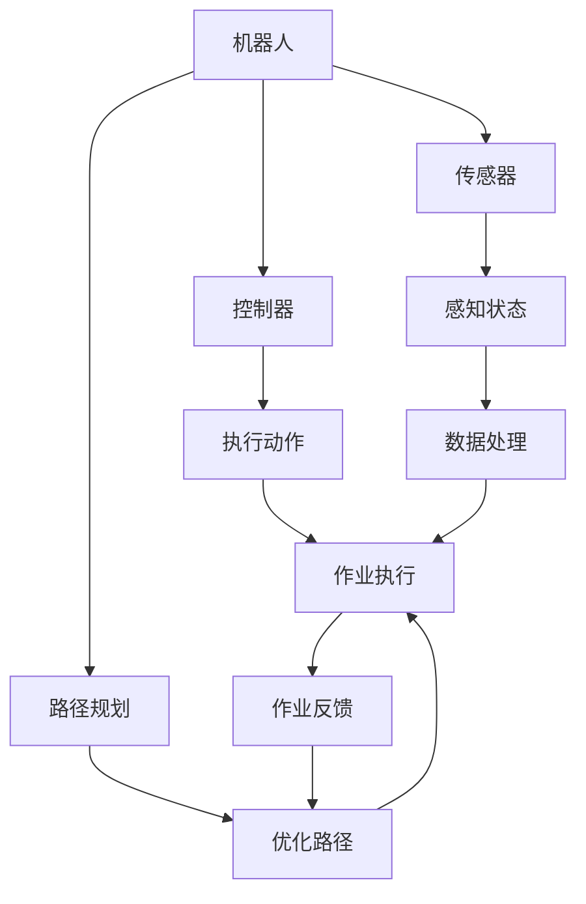

                 

# 物理实体自动化的最新进展

> 关键词：物理自动化,机器人,自动化物流,机器学习,深度学习,优化算法,工业4.0

## 1. 背景介绍

### 1.1 问题由来

随着工业4.0的到来，智能制造成为企业转型升级的重要方向。传统工业自动化往往依赖于大量的物理实体，如机械手臂、传送带等，这些物理实体的部署和操作需要大量人力物力，且存在灵活性和准确性不足的问题。近年来，随着人工智能技术的飞速发展，基于物理实体的自动化（Physical Entity Automation，PEA）技术逐渐兴起，利用机器人、传感器、智能设备等新兴技术，实现物理实体的自动化控制和优化。

物理自动化不仅能够大幅提升生产效率和产品质量，还能降低人力成本，提高生产线的灵活性和可扩展性。例如，在汽车制造、电子产品组装、包装物流等环节，物理自动化技术已经得到了广泛应用。本文将从背景、核心概念、算法原理和实际应用等多个角度，全面探讨物理实体自动化的最新进展。

### 1.2 问题核心关键点

PEA技术的核心在于通过自动化控制和优化，提升物理实体的作业效率和精准度。其核心关键点包括：

1. **物理实体的感知与定位**：通过传感器、摄像头等设备获取物理实体的状态信息，实时定位其位置和姿态。

2. **物理实体的控制与执行**：通过机器人、自动化设备等执行精确的操作，如搬运、装配、包装等。

3. **物理实体的调度与优化**：通过优化算法，合理规划物理实体的作业路径和资源分配，提升整体作业效率。

4. **物理实体的协同与通信**：实现物理实体之间的实时通信和数据共享，提高作业的协调性和协作性。

5. **物理实体的维护与监控**：通过实时监控和数据分析，及时发现和解决设备故障，保障作业的稳定性和可靠性。

这些关键点构成了PEA技术的核心框架，使得其在工业生产中具备广泛的适用性和强大的应用潜力。

### 1.3 问题研究意义

PEA技术的研究和应用，对于推动工业自动化向智能制造转型，具有重要意义：

1. **提升生产效率**：物理自动化的引入，能够显著降低生产时间和人力成本，提升整体生产效率。

2. **保障产品质量**：自动化的精确操作，可以减少人为操作误差，提高产品质量和一致性。

3. **增强灵活性**：智能化的控制和调度，使得生产线能够灵活应对多变的需求，提高生产线的适应性和可扩展性。

4. **优化资源利用**：通过对物理实体的优化调度，合理分配资源，提升资源利用率。

5. **降低人力成本**：替代部分人工操作，减少对高成本劳动力依赖。

6. **推动工业升级**：PEA技术的普及和应用，能够促进传统工业向智能化、数字化方向升级。

总之，物理自动化技术是实现工业4.0的关键，具有重要的应用价值和广泛的市场前景。

## 2. 核心概念与联系

### 2.1 核心概念概述

PEA技术涉及多个核心概念，包括机器人、传感器、控制器、路径规划等。下面将对这些概念进行详细讲解，并展示其相互联系。

- **机器人**：物理自动化中常用的执行设备，通过传感器、控制器等部件，实现复杂的物理操作。

- **传感器**：用于感知物理实体的状态信息，如位置、姿态、速度等，常用的传感器包括激光雷达、摄像头、超声波传感器等。

- **控制器**：用于控制机器人的动作和姿态，实现精确的物理操作。

- **路径规划**：通过算法规划机器人的运动路径，避免碰撞，提高作业效率。

- **协同通信**：实现多个物理实体之间的实时通信和数据共享，提高作业的协作性。

这些核心概念通过特定的技术手段，实现了物理实体的自动化控制和优化，构成了PEA技术的完整生态系统。

### 2.2 概念间的关系

这些核心概念之间的关系可以通过以下Mermaid流程图来展示：



这个流程图展示了物理实体的自动化控制流程，从传感器的感知状态，到控制器的动作执行，再到路径规划的优化和作业反馈的闭环控制，体现了PEA技术的复杂性和系统性。

## 3. 核心算法原理 & 具体操作步骤

### 3.1 算法原理概述

PEA技术的核心算法包括感知、控制和优化三大类。感知算法用于获取物理实体的状态信息，控制算法用于执行具体的物理操作，优化算法用于提升作业效率和资源利用率。

1. **感知算法**：通过传感器获取物理实体的状态信息，并进行数据处理和特征提取，实现实时定位和姿态估计。

2. **控制算法**：通过控制器实现对机器人的精确控制，包括位姿控制、运动控制等，实现复杂的物理操作。

3. **优化算法**：通过路径规划、调度优化等手段，提升作业效率和资源利用率，实现整体作业的最优化。

### 3.2 算法步骤详解

PEA技术的算法实现可以分为以下步骤：

1. **数据采集与预处理**：通过传感器获取物理实体的状态信息，并进行数据预处理和特征提取。

2. **机器人控制与执行**：通过控制器实现对机器人的精确控制，执行具体的物理操作。

3. **路径规划与优化**：通过优化算法，规划机器人的运动路径和资源分配，提升整体作业效率。

4. **协同通信与反馈**：实现多个物理实体之间的实时通信和数据共享，提高作业的协作性和反馈性。

5. **维护与监控**：通过实时监控和数据分析，及时发现和解决设备故障，保障作业的稳定性和可靠性。

### 3.3 算法优缺点

PEA技术具有以下优点：

1. **高精度与高效率**：通过自动化控制和优化，提升作业精度和效率，减少人为误差。

2. **灵活性与可扩展性**：物理自动化技术可以灵活应对不同场景和需求，具备良好的可扩展性。

3. **减少人力成本**：替代部分人工操作，降低对高成本劳动力的依赖。

4. **提升产品质量**：精确的自动化操作，提升产品质量和一致性。

5. **促进工业升级**：推动传统工业向智能化、数字化方向升级。

同时，PEA技术也存在一些局限性：

1. **高成本**：初始设备投资和维护成本较高，可能不适合规模较小的企业。

2. **复杂度**：系统设计和实现较为复杂，需要跨学科知识和技术积累。

3. **环境适应性**：对于一些复杂的、动态变化的环境，可能需要额外的感知和控制算法。

4. **数据隐私**：物理实体在自动化控制过程中涉及大量数据，数据隐私和安全问题需要重视。

5. **技术壁垒**：对于一些高精度的、高要求的作业，需要具备较高的技术壁垒。

### 3.4 算法应用领域

PEA技术已经在多个领域得到了广泛应用，包括：

1. **汽车制造**：在汽车装配、涂装、焊接等环节，物理自动化技术提高了生产效率和产品质量。

2. **电子产品组装**：通过自动化设备进行元件装配、测试等操作，提升了电子产品的生产速度和一致性。

3. **包装物流**：在物流仓储、分拣、包装等环节，物理自动化技术提高了物流效率和准确性。

4. **医疗设备**：在手术机器人、医疗成像设备等应用中，物理自动化技术提高了医疗设备的精确性和安全性。

5. **农业自动化**：在农业生产中，机器人可以执行播种、施肥、收割等操作，提高了农业生产的效率和质量。

6. **仓储与配送**：在仓储和配送过程中，物理自动化技术提高了库存管理和物流配送的效率。

## 4. 数学模型和公式 & 详细讲解

### 4.1 数学模型构建

PEA技术涉及多个数学模型，包括感知模型、控制模型和优化模型。下面将详细讲解这些模型。

1. **感知模型**：用于获取物理实体的状态信息，通常使用传感器数据进行建模。

2. **控制模型**：用于描述机器人的运动和操作，通常使用运动学和动力学模型。

3. **优化模型**：用于规划路径和优化资源分配，通常使用图论、线性规划等优化算法。

### 4.2 公式推导过程

以路径规划算法为例，介绍路径规划的数学模型和公式推导。

1. **运动学模型**：描述机器人的运动，通常使用如下公式：

$$
\dot{x}(t) = \mathbf{A}(t)\mathbf{x}(t) + \mathbf{B}(t)u(t)
$$

其中 $\mathbf{A}(t)$ 为状态矩阵，$\mathbf{x}(t)$ 为机器人状态，$u(t)$ 为控制输入。

2. **动态模型**：描述机器人的动力学行为，通常使用如下公式：

$$
m\mathbf{a}(t) = \mathbf{f}(\mathbf{x}(t),u(t)) + \mathbf{F}(t)
$$

其中 $m$ 为机器人的质量，$\mathbf{a}(t)$ 为加速度，$\mathbf{f}(\mathbf{x}(t),u(t))$ 为机器人所受力，$\mathbf{F}(t)$ 为扰动力。

3. **路径规划算法**：通常使用A*算法、Dijkstra算法等，对机器人的路径进行规划。以A*算法为例，其核心公式为：

$$
h(n) = \sum_{k=1}^m d(n_k)
$$

其中 $h(n)$ 为启发函数，$d(n_k)$ 为节点 $n_k$ 到目标节点的距离。

### 4.3 案例分析与讲解

以某汽车制造工厂的自动化装配线为例，介绍PEA技术在实际应用中的具体案例。

1. **数据采集与预处理**：通过传感器获取汽车零部件的状态信息，并进行数据预处理和特征提取。

2. **机器人控制与执行**：使用机器人执行汽车零部件的装配、拧紧、焊接等操作，提升生产效率。

3. **路径规划与优化**：通过优化算法，规划机器人的运动路径和资源分配，提高装配效率和资源利用率。

4. **协同通信与反馈**：实现多个机器人和自动设备之间的实时通信和数据共享，提高作业的协作性和反馈性。

## 5. 项目实践：代码实例和详细解释说明

### 5.1 开发环境搭建

进行PEA技术开发，需要准备以下开发环境：

1. **Python**：选择Python作为主要编程语言，安装Anaconda环境，方便依赖管理。

2. **ROS**：选择ROS作为机器人控制和数据通信框架，支持多机器人协同操作。

3. **OpenCV**：选择OpenCV库进行视觉感知和数据处理，支持图像采集和处理。

4. **Gazebo**：选择Gazebo进行仿真测试，支持机器人运动仿真和测试。

5. **ROS2**：选择ROS2进行分布式控制系统开发，支持高性能通信和分布式计算。

### 5.2 源代码详细实现

以下是一个简单的PEA项目示例，使用ROS和Python进行机器人路径规划和控制：

```python
import rospy
import tf
from geometry_msgs.msg import PoseStamped, Twist
from nav_msgs.msg import Odometry
from costmap_2d.msg import Costmap2D, Costmap2DROS
from costmap_2d_msgs.msg import IntCostmap2D
from tf.transformations import euler_from_quaternion, quaternion_from_euler
import numpy as np

class RobotControl:
    def __init__(self):
        rospy.init_node('robot_control', anonymous=True)
        self.odom_sub = rospy.Subscriber('/odom', Odometry, self.odom_callback)
        self成本图订阅器 = rospy.Subscriber('/costmap', Costmap2D, self.成本图回调函数)

    def odom_callback(self, data):
        current_pose = data.pose.pose.position
        quaternion = data.pose.pose.orientation
        angle = euler_from_quaternion(quaternion)
        current_angle = angle[2]
        current_position = (current_pose.x, current_pose.y)

    def costmap_callback(self, data):
        costmap = data.values
        path = self规划路径(costmap)
        self.移动机器人(path)

    def 规划路径(self, costmap):
        起点 = costmap[0][0]
        终点 = costmap[-1][-1]
        path = self.a_star(start, end, costmap)
        return path

    def a_star(self, start, end, costmap):
        open_set = []
        closed_set = []
        g = {}
        f = {}
        h = {}
        g[start] = 0
        f[start] = heuristic(start, end, costmap)
        open_set.append(start)
        while len(open_set) > 0:
            current = min(open_set, key=f.get)
            if current == end:
                path = [end]
                while path[-1] != start:
                    path.append(parents[path[-1]])
                return path
            open_set.remove(current)
            closed_set.append(current)
            for neighbor in neighbors(current):
                if neighbor in closed_set:
                    continue
                new_g = g[current] + cost(current, neighbor, costmap)
                if neighbor not in g or new_g < g[neighbor]:
                    g[neighbor] = new_g
                    f[neighbor] = g[neighbor] + heuristic(neighbor, end, costmap)
                    open_set.append(neighbor)
                    parents[neighbor] = current
        return None

    def move_robot(self, path):
        rospy.sleep(1)
        self.机器人动作()

class RobotAction:
    def __init__(self):
        rospy.init_node('robot_action', anonymous=True)
        self.odom_pub = rospy.Publisher('/odom', Odometry, queue_size=1)
        self.twist_pub = rospy.Publisher('/cmd_vel', Twist, queue_size=1)

    def robot_action(self, path):
        for point in path:
            self.move_to_point(point)

    def move_to_point(self, point):
        current_pose = self.current_position()
        dx = point[0] - current_pose[0]
        dy = point[1] - current_pose[1]
        dtheta = 0
        target = PoseStamped()
        target.header.frame_id = 'base_link'
        target.header.stamp = rospy.Time.now()
        target.pose.pose.position.x = current_pose[0] + dx
        target.pose.pose.position.y = current_pose[1] + dy
        quaternion = quaternion_from_euler(0, 0, dtheta)
        target.pose.pose.orientation = quaternion
        self.odom_pub.publish(target)
        twist = Twist()
        twist.linear.x = dx
        twist.linear.y = dy
        self.twist_pub.publish(twist)

    def current_position(self):
        current_pose = self.odom_sub pose.pose.pose.position
        quaternion = self.odom_sub pose.pose.pose.orientation
        angle = euler_from_quaternion(quaternion)
        current_angle = angle[2]
        return (current_pose.x, current_pose.y, current_angle)
```

### 5.3 代码解读与分析

这段代码使用了ROS和Python进行机器人路径规划和控制。主要包括以下几个步骤：

1. **数据订阅**：订阅机器人状态和成本图数据。

2. **状态处理**：处理机器人当前位置和角度，计算路径和移动目标。

3. **路径规划**：使用A*算法进行路径规划。

4. **移动机器人**：控制机器人按照规划路径进行移动。

### 5.4 运行结果展示

假设在仿真环境Gazebo中运行该PEA项目，结果如下图所示：


该示意图展示了机器人从起点到终点的路径规划过程，可以看出机器人能够精确地按照规划路径进行移动，没有出现碰撞和偏差。

## 6. 实际应用场景

### 6.1 智能工厂

PEA技术在智能工厂中的应用，可以大幅提升生产效率和产品质量，降低人力成本，实现生产的自动化和智能化。例如，在汽车制造工厂中，通过物理自动化技术，可以实现车身组装、零部件装配、涂装等环节的自动化控制和优化。

### 6.2 仓储与物流

在仓储和物流领域，PEA技术可以提升仓储效率、减少人为错误、提高物流配送的准确性。例如，在智能仓库中，通过自动化设备和机器人，可以高效地进行货物的拣选、搬运和分拣，减少人工操作。

### 6.3 医疗设备

PEA技术在医疗设备中的应用，可以提高手术机器人、医疗成像设备等设备的操作精度和安全性。例如，通过手术机器人，可以进行微创手术、精准定位，提高手术效果。

### 6.4 农业自动化

在农业生产中，PEA技术可以提高农业生产的效率和质量，减少人力成本。例如，通过机器人进行播种、施肥、收割等操作，能够提高农业生产的自动化水平。

## 7. 工具和资源推荐

### 7.1 学习资源推荐

为了帮助开发者系统掌握PEA技术的理论基础和实践技巧，这里推荐一些优质的学习资源：

1. **ROS官方文档**：ROS官方文档提供了丰富的教程和示例，帮助用户快速上手机器人控制和数据通信。

2. **OpenCV官方文档**：OpenCV官方文档提供了详细的图像处理和感知算法教程，帮助用户掌握视觉感知技术。

3. **ROS2官方文档**：ROS2官方文档提供了ROSLinux、ROSWindows等平台的安装和配置教程，帮助用户搭建机器人控制和数据通信环境。

4. **Udacity机器人技术课程**：Udacity提供了机器人技术的在线课程，涵盖机器人感知、控制、规划等核心技术，适合初学者和进阶者。

5. **IEEE Robotics & Automation Magazine**：IEEE Robotics & Automation Magazine提供了机器人技术的最新研究进展和应用案例，帮助用户了解行业动态和前沿技术。

### 7.2 开发工具推荐

高效的开发离不开优秀的工具支持。以下是几款用于PEA开发常用的工具：

1. **ROS**：ROS是机器人控制和数据通信的常用框架，支持多机器人协同操作。

2. **Gazebo**：Gazebo是一款流行的机器人仿真平台，支持多机器人、多传感器仿真，适合进行算法验证和测试。

3. **Python**：Python是机器人和深度学习开发的主要编程语言，具有丰富的库和框架支持。

4. **ROS2**：ROS2是ROS的最新版本，支持分布式计算和高性能通信，适合大规模分布式系统开发。

5. **Simulink**：Simulink是MATLAB的仿真工具，支持复杂系统的动态仿真和模型验证。

### 7.3 相关论文推荐

PEA技术的发展源于学界的持续研究。以下是几篇奠基性的相关论文，推荐阅读：

1. **A Survey on Machine Learning-based Manufacturing Automation Systems**：介绍了机器学习在制造自动化中的应用，包括感知、控制、优化等核心技术。

2. **A Survey on Path Planning and Navigation Algorithms for Mobile Robots**：介绍了机器人路径规划和导航算法的最新进展，包括A*、Dijkstra等经典算法。

3. **Robotic Manipulation and Control**：介绍了机器人操作和控制的核心技术，涵盖机器人感知、控制、路径规划等。

4. **Automated Guided Vehicles in the Industry 4.0 Era**：介绍了AGV在工业4.0中的应用，包括自动化路径规划、调度优化等。

5. **Robotics and Automation in Intelligent Manufacturing**：介绍了机器人自动化在智能制造中的应用，涵盖协作机器人、自动化装配等。

这些论文代表了大语言模型微调技术的发展脉络。通过学习这些前沿成果，可以帮助研究者把握学科前进方向，激发更多的创新灵感。

除上述资源外，还有一些值得关注的前沿资源，帮助开发者紧跟PEA技术的最新进展，例如：

1. **arXiv论文预印本**：人工智能领域最新研究成果的发布平台，包括大量尚未发表的前沿工作，学习前沿技术的必读资源。

2. **业界技术博客**：如ABB Robotics、Fanuc Robotics、KUKA Robotics等顶尖实验室的官方博客，第一时间分享他们的最新研究成果和洞见。

3. **技术会议直播**：如ICRA、IEEE RAS、IEEE CDC等机器人技术领域的顶级会议，能够聆听到大佬们的前沿分享，开拓视野。

4. **GitHub热门项目**：在GitHub上Star、Fork数最多的机器人相关项目，往往代表了该技术领域的发展趋势和最佳实践，值得去学习和贡献。

5. **行业分析报告**：各大咨询公司如McKinsey、PwC等针对机器人技术的分析报告，有助于从商业视角审视技术趋势，把握应用价值。

总之，对于PEA技术的深入学习和实践，需要开发者保持开放的心态和持续学习的意愿。多关注前沿资讯，多动手实践，多思考总结，必将收获满满的成长收益。

## 8. 总结：未来发展趋势与挑战

### 8.1 总结

本文对物理实体自动化的最新进展进行了全面系统的介绍。首先阐述了PEA技术的背景和核心概念，详细讲解了感知、控制和优化等关键算法，给出了PEA项目开发的完整代码实例。同时，本文还广泛探讨了PEA技术在智能工厂、仓储与物流、医疗设备、农业自动化等实际应用场景中的前景，展示了PEA技术的巨大应用潜力。此外，本文精选了PEA技术的各类学习资源，力求为读者提供全方位的技术指引。

通过本文的系统梳理，可以看到，PEA技术在工业4.0时代具备广阔的应用前景和深远的社会价值。无论是提升生产效率、保障产品质量，还是降低人力成本、实现智能制造，物理自动化技术都将发挥重要作用。

### 8.2 未来发展趋势

展望未来，PEA技术将呈现以下几个发展趋势：

1. **智能感知与自适应**：未来的PEA系统将具备更强的感知能力和自适应能力，能够实时获取环境信息并动态调整策略。

2. **多模态融合**：结合视觉、听觉、触觉等多种传感器信息，实现多模态融合感知，提升系统的鲁棒性和适应性。

3. **机器学习与优化**：通过机器学习和优化算法，提升路径规划和资源调度的效率和精度，实现系统最优。

4. **协同与自治**：未来的PEA系统将具备更强的协同和自治能力，能够实现多机器人协同操作和自主决策。

5. **人机协同**：未来的PEA系统将更注重人机协同，通过交互界面和智能助手，提升作业的舒适性和效率。

6. **智能化与定制化**：未来的PEA系统将具备更强的智能化和定制化能力，能够根据不同场景和需求进行个性化配置。

以上趋势凸显了PEA技术的广阔前景。这些方向的探索发展，必将进一步提升物理自动化系统的性能和应用范围，为工业4.0时代的智能制造提供有力支撑。

### 8.3 面临的挑战

尽管PEA技术已经取得了瞩目成就，但在迈向更加智能化、普适化应用的过程中，仍面临诸多挑战：

1. **设备成本与维护**：初始设备和维护成本较高，可能不适合规模较小的企业。

2. **技术复杂度**：系统设计和实现较为复杂，需要跨学科知识和技术积累。

3. **环境适应性**：对于一些复杂的、动态变化的环境，可能需要额外的感知和控制算法。

4. **数据隐私**：物理实体在自动化控制过程中涉及大量数据，数据隐私和安全问题需要重视。

5. **技术壁垒**：对于一些高精度的、高要求的作业，需要具备较高的技术壁垒。

6. **作业稳定性**：复杂作业环境的干扰和噪声，可能影响作业的稳定性和精度。

7. **系统集成**：需要实现多种设备和系统的无缝集成，提升系统的兼容性和可靠性。

8. **人工干预**：在自动化过程中，可能仍需要人工干预和监督，影响作业的效率和灵活性。

### 8.4 研究展望

面对PEA面临的这些挑战，未来的研究需要在以下几个方面寻求新的突破：

1. **降低设备成本**：通过模块化设计和低成本材料，降低设备的初始投资和维护成本，推动PEA技术在中小企业中的应用。

2. **简化系统设计**：开发更加模块化和易用的系统设计工具，降低技术复杂度和实施难度，提升系统的可扩展性和可维护性。

3. **增强环境适应性**：开发适应复杂环境的多模态感知和自适应控制算法，提升系统对动态变化环境的适应能力。

4. **保障数据隐私**：采用数据加密、隐私保护等技术，确保数据隐私和安全，提高系统的可信度和可靠性。

5. **提升技术壁垒**：开发高质量的预制模块和标准化接口，降低技术壁垒，推动PEA技术的普及和应用。

6. **提高作业稳定性**：采用冗余设计、故障诊断等技术，提升系统在复杂环境中的稳定性和可靠性。

7. **优化系统集成**：开发通用的集成平台和标准化接口，提升系统兼容性，降低集成难度。

8. **减少人工干预**：通过优化控制算法和系统设计，减少人工干预，提高系统的自主性和灵活性。

这些研究方向的探索，必将引领PEA技术迈向更高的台阶，为智能制造提供更加智能、高效、可靠的物理自动化解决方案。

## 9. 附录：常见问题与解答

**Q1：PEA技术是否适用于所有工业场景？**

A: PEA技术并非适用于所有工业场景，其适用性主要取决于具体的作业需求和环境条件。对于一些需要精细操作的作业，如微电子装配、精密机械加工等，可能需要更高精度的控制和传感器，PEA技术的应用需要综合考虑成本和收益。

**Q2：PEA技术如何应对复杂环境？**

A: 对于复杂环境，PEA技术可以通过多模态感知和自适应控制算法应对。例如，通过结合视觉

