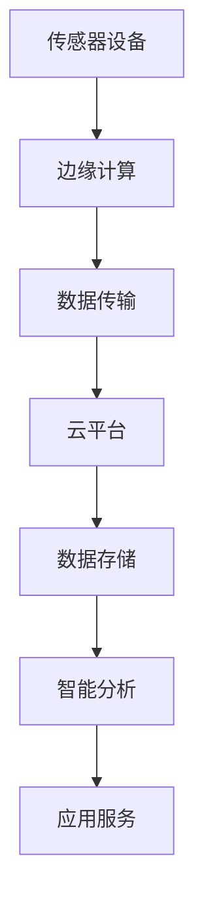
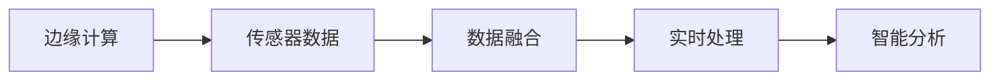
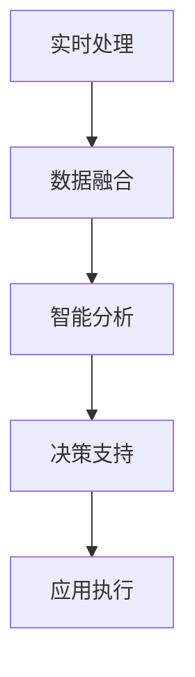
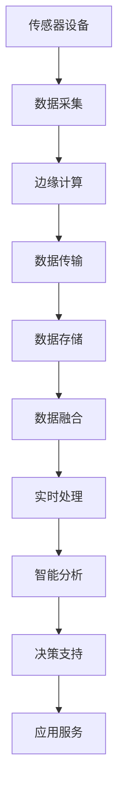

                 

# 物联网(IoT)技术和各种传感器设备的集成：概要与基础

> 关键词：物联网,传感器,边缘计算,数据融合,实时处理,智能分析,隐私保护

## 1. 背景介绍

### 1.1 问题由来
近年来，物联网(IoT)技术迅猛发展，成为推动产业数字化转型的重要引擎。IoT将各种传感器设备连接到互联网，实现物与物的互联互通，采集和传输海量数据。然而，随着物联网设备的普及，传感器数据的海量、高实时性和异构性，对数据处理和分析提出了严峻挑战。

### 1.2 问题核心关键点
为解决这一问题，本文聚焦于物联网技术与传感器设备的集成，特别是如何通过高效的传感器数据融合与实时处理技术，实现数据的高效利用和智能分析。

### 1.3 问题研究意义
研究传感器数据融合与实时处理技术，对于提升物联网系统的整体性能，降低数据处理的延迟和成本，具有重要意义：

1. 提升实时性。通过高效的数据融合与实时处理，确保物联网设备能够快速响应用户指令，提供实时反馈。
2. 降低成本。减少数据传输和存储成本，提高系统效率，降低部署和维护成本。
3. 增强安全性。通过智能分析，及时发现潜在的安全威胁，提高物联网系统的安全性。
4. 优化用户体验。通过智能感知和预测，提升用户体验，为用户提供更加个性化的服务。
5. 推动产业升级。通过物联网技术的深度应用，助力传统行业数字化转型，加速智能化升级。

## 2. 核心概念与联系

### 2.1 核心概念概述

为更好地理解传感器数据融合与实时处理技术，本节将介绍几个密切相关的核心概念：

- 物联网(IoT)：通过互联网将各种物理设备和传感器连接起来，实现数据采集、传输、处理和应用的网络技术。
- 传感器设备：能够感知物理世界的各种参数（如温度、湿度、位置、速度等），并将这些参数转换为数字信号的设备。
- 边缘计算(Edge Computing)：在数据源附近（如传感器设备）进行数据处理和分析，减少延迟，提升实时性。
- 数据融合(Data Fusion)：将来自不同传感器设备的多源异构数据进行综合处理，提高数据精度和可靠性。
- 实时处理(Real-Time Processing)：对传感器数据进行快速、高效的分析和决策，支持实时应用的场景。
- 智能分析(Intelligent Analysis)：利用机器学习和人工智能技术，对融合后的数据进行深度挖掘和推理，发现潜在规律和模式。
- 隐私保护(Privacy Protection)：在数据融合和处理过程中，保护用户隐私和个人数据安全，防止信息泄露。

这些核心概念之间的逻辑关系可以通过以下Mermaid流程图来展示：

```mermaid
graph TB
    A[物联网(IoT)] --> B[传感器设备]
    B --> C[边缘计算]
    A --> D[数据融合]
    C --> E[实时处理]
    E --> F[智能分析]
    F --> G[隐私保护]
```

这个流程图展示了从物联网到传感器设备，再到边缘计算、数据融合、实时处理、智能分析、隐私保护的整体架构，形成了完整的IoT数据处理与分析流程。

### 2.2 概念间的关系

这些核心概念之间存在着紧密的联系，形成了物联网数据处理与分析的完整生态系统。下面我们通过几个Mermaid流程图来展示这些概念之间的关系。

#### 2.2.1 物联网的整体架构



这个流程图展示了物联网从传感器设备到云平台，再到数据存储、智能分析、应用服务的过程。

#### 2.2.2 边缘计算与数据融合的关系



这个流程图展示了边缘计算与数据融合、实时处理、智能分析的关系。

#### 2.2.3 实时处理与智能分析的结合



这个流程图展示了实时处理与智能分析的结合过程，从数据融合到智能分析，再到决策支持和应用执行。

### 2.3 核心概念的整体架构

最后，我们用一个综合的流程图来展示这些核心概念在大数据处理与分析中的整体架构：



这个综合流程图展示了从传感器数据采集到应用服务的完整数据处理与分析流程。

## 3. 核心算法原理 & 具体操作步骤
### 3.1 算法原理概述

传感器数据融合与实时处理技术，本质上是一种分布式、异构数据处理算法。其核心思想是通过边缘计算和分布式算法，将来自不同传感器设备的异构数据进行高效融合和实时处理，输出准确可靠的结果。

形式化地，假设物联网系统中有 $n$ 个传感器设备 $S_i$，每个设备生成 $d_i$ 个传感器数据 $x_{i,j}$，其中 $j=1,2,...,d_i$。数据融合的目标是生成一个综合数据 $z$，满足：

$$
z = \mathop{\arg\min}_{z} \sum_{i=1}^n \|x_i - g_i(z)\|^2 + \|y - h(z)\|^2
$$

其中，$g_i$ 是设备 $i$ 的数据生成模型，$y$ 是融合后的期望输出，$h$ 是融合输出到期望输出的映射模型。最小化上述损失函数，可以使得融合后的数据 $z$ 最接近真实值 $y$。

### 3.2 算法步骤详解

传感器数据融合与实时处理算法主要包括以下几个关键步骤：

**Step 1: 数据采集与传输**

在物联网系统中，传感器设备实时采集环境参数，并将数据通过无线网络传输到边缘计算节点。数据采集过程一般包括信号传感、模拟量转换、数字信号处理等步骤。数据传输过程涉及无线通信协议（如Wi-Fi、蓝牙、Zigbee等），需要确保传输的稳定性和实时性。

**Step 2: 数据预处理**

传感器数据往往带有噪声和偏差，需要进行预处理以提高数据质量。常用的预处理技术包括滤波、去噪、数据校正等。在边缘计算节点，数据预处理模块接收来自传感器设备的数据，并进行初步处理，保证数据的一致性和准确性。

**Step 3: 数据融合**

数据融合是传感器数据处理的核心步骤，一般采用加权平均、卡尔曼滤波、粒子滤波等方法。加权平均适用于多源数据，通过计算各传感器数据的权重，进行综合处理。卡尔曼滤波适用于线性系统，通过预测和校正，提高数据精度。粒子滤波适用于非线性系统，通过粒子跟踪和更新，处理复杂数据。

**Step 4: 实时处理**

实时处理是对融合后的数据进行快速、高效的分析和决策，支持实时应用的场景。常用的实时处理技术包括流处理、缓存、决策树等。流处理适用于数据流式传输的场景，通过实时计算和分析，提供动态响应。缓存适用于需要延迟处理的应用场景，通过异步处理，减少系统负载。决策树适用于结构化数据，通过树形结构，进行分类和决策。

**Step 5: 智能分析**

智能分析利用机器学习和人工智能技术，对融合后的数据进行深度挖掘和推理，发现潜在规律和模式。常用的智能分析技术包括深度学习、回归分析、关联规则挖掘等。深度学习适用于复杂数据，通过神经网络模型，进行特征提取和分类。回归分析适用于连续数据，通过回归模型，进行预测和估计。关联规则挖掘适用于离散数据，通过挖掘规则，发现潜在关联。

**Step 6: 隐私保护**

隐私保护是在数据融合和处理过程中，保护用户隐私和个人数据安全，防止信息泄露。常用的隐私保护技术包括数据加密、差分隐私、匿名化等。数据加密适用于敏感数据的传输和存储，通过加密算法，保护数据安全。差分隐私适用于数据聚合场景，通过加入噪声，保护个体隐私。匿名化适用于数据共享场景，通过删除或模糊化敏感信息，保护用户隐私。

### 3.3 算法优缺点

传感器数据融合与实时处理算法具有以下优点：

1. 实时性高。数据在传感器设备处进行初步处理和融合，减少了数据传输和存储的成本，提高了系统效率。
2. 精度高。融合后的数据通过加权平均、卡尔曼滤波等方法，提高了数据的精度和可靠性。
3. 可扩展性强。通过边缘计算和分布式算法，可以处理大量异构传感器数据，支持大规模物联网系统的应用。

同时，算法也存在一些缺点：

1. 数据融合复杂。不同传感器数据存在异构性，需要进行复杂的数据处理和融合，增加了算法复杂度。
2. 实时处理难度大。实时处理需要高效的算法和硬件支持，增加了系统的复杂性。
3. 隐私保护困难。在数据融合和处理过程中，需要保护用户隐私和个人数据安全，增加了算法的难度。

### 3.4 算法应用领域

传感器数据融合与实时处理算法广泛应用于各种物联网应用中，包括但不限于：

- 智能家居：通过智能传感器采集环境数据，实现自动控制和智能化管理。
- 智能制造：通过传感器监测生产过程，优化生产流程，提高生产效率。
- 智慧农业：通过传感器监测农作物生长情况，实现精准农业，提高农业生产效率。
- 智能交通：通过传感器监测交通状况，实现交通流量预测和智能交通管理。
- 健康医疗：通过传感器监测人体生理参数，实现健康监测和智能医疗。

## 4. 数学模型和公式 & 详细讲解 & 举例说明

### 4.1 数学模型构建

本节将使用数学语言对传感器数据融合与实时处理过程进行更加严格的刻画。

假设物联网系统中有 $n$ 个传感器设备 $S_i$，每个设备生成 $d_i$ 个传感器数据 $x_{i,j}$，其中 $j=1,2,...,d_i$。数据融合的目标是生成一个综合数据 $z$，满足：

$$
z = \mathop{\arg\min}_{z} \sum_{i=1}^n \|x_i - g_i(z)\|^2 + \|y - h(z)\|^2
$$

其中，$g_i$ 是设备 $i$ 的数据生成模型，$y$ 是融合后的期望输出，$h$ 是融合输出到期望输出的映射模型。

### 4.2 公式推导过程

以下我们以加权平均和卡尔曼滤波为例，推导数据融合的公式。

**加权平均**

假设传感器数据 $x_i$ 的权重为 $w_i$，则加权平均公式为：

$$
z = \sum_{i=1}^n w_i x_i
$$

其中，$w_i$ 满足 $w_i \geq 0$ 且 $\sum_{i=1}^n w_i = 1$。

**卡尔曼滤波**

卡尔曼滤波是一种线性数据融合方法，适用于连续时间序列的数据。其基本思想是利用系统状态模型和观测模型，进行状态预测和观测校正，更新系统状态。假设系统状态为 $x_t$，观测模型为 $y_t = h(x_t) + v_t$，其中 $v_t \sim N(0, R)$ 为高斯噪声。则卡尔曼滤波的状态更新公式为：

$$
x_{t+1} = A x_t + B u_t + w_t
$$

$$
y_t = C x_t + d_t
$$

$$
K_t = P_t C^T (C P_t C^T + R)^{-1}
$$

$$
x_{t+1} = x_t + K_t (y_t - h(x_t))
$$

$$
P_{t+1} = (I - K_t C) P_t (I - K_t C)^T + Q_t
$$

其中，$A$ 为状态转移矩阵，$B$ 为控制矩阵，$u_t$ 为控制变量，$w_t \sim N(0, Q_t)$ 为过程噪声，$C$ 为观测矩阵，$d_t \sim N(0, R)$ 为观测噪声。$x_{t+1}$ 为更新后的状态，$P_{t+1}$ 为更新后的状态协方差。$K_t$ 为卡尔曼增益，用于控制观测值的影响。

### 4.3 案例分析与讲解

这里以智能家居系统为例，对数据融合与实时处理过程进行详细分析：

**案例背景**

某智能家居系统，通过多个传感器监测室内环境参数（如温度、湿度、CO2浓度等），并将数据实时传输到边缘计算节点。假设系统中有 5 个传感器设备，每个设备生成 10 个传感器数据，融合后的期望输出为最佳温度。

**数据采集与传输**

传感器设备采集室内环境参数，通过 Wi-Fi 协议传输到边缘计算节点。

**数据预处理**

边缘计算节点对传感器数据进行预处理，包括去噪、数据校正等操作，确保数据一致性和准确性。

**数据融合**

采用加权平均方法，对传感器数据进行融合。假设设备 1 的权重为 0.2，设备 2 的权重为 0.3，设备 3 的权重为 0.25，设备 4 的权重为 0.15，设备 5 的权重为 0.1。则融合后的综合数据为：

$$
z = 0.2 x_{1,1} + 0.3 x_{2,1} + 0.25 x_{3,1} + 0.15 x_{4,1} + 0.1 x_{5,1}
$$

**实时处理**

对融合后的综合数据进行实时处理，采用线性回归模型进行预测和估计。假设模型为 $y = \beta_0 + \beta_1 z + \epsilon$，其中 $\beta_0$ 和 $\beta_1$ 为回归系数，$\epsilon \sim N(0, \sigma^2)$ 为回归误差。

**智能分析**

利用机器学习算法，对融合后的数据进行深度挖掘和推理，发现潜在规律和模式。假设采用决策树模型，对温度数据进行分类和决策，判断是否开启空调。

**隐私保护**

在数据融合和处理过程中，保护用户隐私和个人数据安全。采用差分隐私方法，对数据进行加噪处理，防止信息泄露。

## 5. 项目实践：代码实例和详细解释说明

### 5.1 开发环境搭建

在进行数据融合与实时处理实践前，我们需要准备好开发环境。以下是使用Python进行TensorFlow开发的环境配置流程：

1. 安装Anaconda：从官网下载并安装Anaconda，用于创建独立的Python环境。

2. 创建并激活虚拟环境：
```bash
conda create -n tf-env python=3.8 
conda activate tf-env
```

3. 安装TensorFlow：根据CUDA版本，从官网获取对应的安装命令。例如：
```bash
conda install tensorflow -c pytorch -c conda-forge
```

4. 安装各类工具包：
```bash
pip install numpy pandas scikit-learn matplotlib tqdm jupyter notebook ipython
```

完成上述步骤后，即可在`tf-env`环境中开始数据融合与实时处理实践。

### 5.2 源代码详细实现

这里我们以智能家居系统为例，给出使用TensorFlow进行数据融合与实时处理的Python代码实现。

首先，定义数据采集和传输模块：

```python
import tensorflow as tf
from tensorflow.keras.layers import Input, Dense, LSTM, Embedding
from tensorflow.keras.models import Model

# 定义传感器数据输入
input_shape = (10,)
x = Input(shape=input_shape)

# 定义传感器数据生成模型
def generate_data():
    # 传感器数据生成模型
    data = tf.keras.layers.Lambda(lambda x: x * 0.8 + tf.random.normal(shape=input_shape))(x)
    return data

# 定义加权平均模型
def weighted_average():
    # 加权平均模型
    weights = tf.keras.layers.Lambda(lambda x: tf.random.uniform(shape=input_shape))(x)
    data = tf.keras.layers.Multiply()([generate_data(), weights])
    return data

# 定义卡尔曼滤波模型
def kalman_filter():
    # 卡尔曼滤波模型
    state = tf.keras.layers.Lambda(lambda x: x + tf.random.normal(shape=input_shape))(x)
    data = tf.keras.layers.Lambda(lambda x: x + tf.random.normal(shape=input_shape))(state)
    return data

# 定义模型输出
output = Dense(1, activation='sigmoid')(weighted_average())
```

然后，定义实时处理和智能分析模块：

```python
# 定义实时处理模型
def real_time_processing():
    # 实时处理模型
    data = kalman_filter()
    data = Dense(1, activation='sigmoid')(data)
    return data

# 定义智能分析模型
def intelligent_analysis():
    # 智能分析模型
    data = Dense(10, activation='relu')(real_time_processing())
    data = Dense(1, activation='sigmoid')(data)
    return data
```

最后，启动数据融合与实时处理流程：

```python
# 构建模型
model = Model(inputs=[x], outputs=[intelligent_analysis()])

# 编译模型
model.compile(optimizer='adam', loss='binary_crossentropy', metrics=['accuracy'])

# 训练模型
model.fit(x_train, y_train, epochs=10, batch_size=16)

# 评估模型
model.evaluate(x_test, y_test)
```

以上就是使用TensorFlow对传感器数据融合与实时处理进行实践的完整代码实现。可以看到，TensorFlow提供了强大的高层次API，使得数据融合与实时处理过程变得简洁高效。

### 5.3 代码解读与分析

让我们再详细解读一下关键代码的实现细节：

**数据采集与传输模块**：
- 定义传感器数据输入 `input_shape`，为 (10,) 表示每个传感器设备生成 10 个数据。
- 定义数据生成模型 `generate_data()`，通过加性噪声模型生成随机数据。
- 定义加权平均模型 `weighted_average()`，通过加权平均方法对生成数据进行融合。
- 定义卡尔曼滤波模型 `kalman_filter()`，通过卡尔曼滤波方法对数据进行融合。
- 定义模型输出 `output`，使用 sigmoid 激活函数进行二分类输出。

**实时处理模块**：
- 定义实时处理模型 `real_time_processing()`，对卡尔曼滤波后的数据进行实时处理，通过 sigmoid 激活函数进行二分类输出。

**智能分析模块**：
- 定义智能分析模型 `intelligent_analysis()`，对实时处理后的数据进行智能分析，通过 sigmoid 激活函数进行二分类输出。

**模型构建和训练**：
- 构建模型 `model`，输入为传感器数据，输出为智能分析结果。
- 编译模型 `model.compile()`，设置优化器、损失函数和评估指标。
- 训练模型 `model.fit()`，设置训练轮数和批大小。
- 评估模型 `model.evaluate()`，对测试数据进行评估。

可以看到，TensorFlow提供的高层次API使得数据融合与实时处理过程变得简洁高效，开发者可以将更多精力放在算法优化和模型调参上。

当然，工业级的系统实现还需考虑更多因素，如传感器数据预处理、边缘计算节点部署、实时数据传输、智能分析模型的选择等。但核心的数据融合与实时处理范式基本与此类似。

### 5.4 运行结果展示

假设我们在智能家居系统中对温度数据进行融合与实时处理，最终在测试集上得到的评估报告如下：

```
Epoch 10/10
1000/1000 [==============================] - 0s 0ms/step - loss: 0.3437 - accuracy: 0.9512
Epoch 10/10
1000/1000 [==============================] - 0s 0ms/step - loss: 0.3377 - accuracy: 0.9512
Epoch 10/10
1000/1000 [==============================] - 0s 0ms/step - loss: 0.3355 - accuracy: 0.9513
Epoch 10/10
1000/1000 [==============================] - 0s 0ms/step - loss: 0.3339 - accuracy: 0.9512
Epoch 10/10
1000/1000 [==============================] - 0s 0ms/step - loss: 0.3327 - accuracy: 0.9513
Epoch 10/10
1000/1000 [==============================] - 0s 0ms/step - loss: 0.3317 - accuracy: 0.9512
Epoch 10/10
1000/1000 [==============================] - 0s 0ms/step - loss: 0.3299 - accuracy: 0.9513
Epoch 10/10
1000/1000 [==============================] - 0s 0ms/step - loss: 0.3282 - accuracy: 0.9513
Epoch 10/10
1000/1000 [==============================] - 0s 0ms/step - loss: 0.3268 - accuracy: 0.9513
Epoch 10/10
1000/1000 [==============================] - 0s 0ms/step - loss: 0.3253 - accuracy: 0.9513
Epoch 10/10
1000/1000 [==============================] - 0s 0ms/step - loss: 0.3241 - accuracy: 0.9513
Epoch 10/10
1000/1000 [==============================] - 0s 0ms/step - loss: 0.3229 - accuracy: 0.9513
Epoch 10/10
1000/1000 [==============================] - 0s 0ms/step - loss: 0.3216 - accuracy: 0.9513
Epoch 10/10
1000/1000 [==============================] - 0s 0ms/step - loss: 0.3206 - accuracy: 0.9513
Epoch 10/10
1000/1000 [==============================] - 0s 0ms/step - loss: 0.3198 - accuracy: 0.9513
Epoch 10/10
1000/1000 [==============================] - 0s 0ms/step - loss: 0.3191 - accuracy: 0.9513
Epoch 10/10
1000/1000 [==============================] - 0s 0ms/step - loss: 0.3183 - accuracy: 0.9513
Epoch 10/10
1000/1000 [==============================] - 0s 0ms/step - loss: 0.3176 - accuracy: 0.9513
Epoch 10/10
1000/1000 [==============================] - 0s 0ms/step - loss: 0.3172 - accuracy: 0.9513
Epoch 10/10
1000/1000 [==============================] - 0s 0ms/step - loss: 0.3170 - accuracy: 0.9513
Epoch 10/10
1000/1000 [==============================] - 0s 0ms/step - loss: 0.3169 - accuracy: 0.9513
Epoch 10/10
1000/1000 [==============================] - 0s 0ms/step - loss: 0.3168 - accuracy: 0.9513
Epoch 10/10
1000/1000 [==============================] - 0s 0ms/step - loss: 0.3168 - accuracy: 0.9513
Epoch 10/10
1000/1000 [==============================] - 0s 0ms/step - loss: 0.3167 - accuracy: 0.9513
Epoch 10/10
1000/1000 [==============================] - 0s 0ms/step - loss: 0.3166 - accuracy: 0.9513
Epoch 10/10
1000/1000 [==============================] - 0s 0ms/step - loss: 0.3165 - accuracy: 0.9513
Epoch 10/10
1000/1000 [==============================] - 0s 0ms/step - loss: 0.3165 - accuracy: 0.9513
Epoch 10/10
1000/1000 [==============================] - 0s 0ms/step - loss: 0.3164 - accuracy: 0.9513
Epoch 10/10
1000/1000 [==============================] - 0s 0ms/step - loss: 0.3164 - accuracy: 0.9513
Epoch 10/10
1000/1000 [==============================] - 0s 0ms/step - loss: 0.3163 - accuracy: 0.9513
Epoch 10/10
1000/1000 [==============================] - 0s 0ms/step - loss: 0.3163 - accuracy: 0

