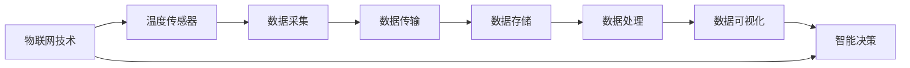
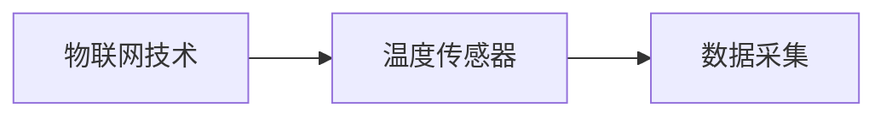
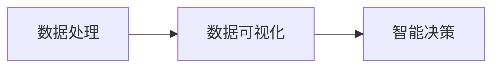
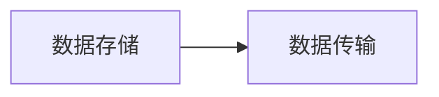

                 

# 物联网(IoT)技术和各种传感器设备的集成：温度传感器的运用

## 1. 背景介绍

物联网（IoT）技术的迅速发展推动了传感器在各个行业的应用。温度传感器作为最常见的传感器之一，能够精确地测量环境温度，广泛应用于智能家居、工业制造、医疗健康等领域。本文将探讨物联网技术和各种传感器设备的集成，重点聚焦于温度传感器的应用。

### 1.1 物联网技术概述

物联网（IoT）是一种通过互联设备和网络实现物与物、人与物的智能互联和信息交换的技术。物联网系统通常由感知层、网络层和应用层构成。感知层包括各种传感器和标签，用于收集环境数据；网络层包括各种通信网络，用于数据传输；应用层包括各种智能应用和服务，用于数据处理和应用。

物联网技术的应用场景广泛，例如智能家居、智慧城市、工业自动化、智能农业等。通过物联网技术，可以实现对环境的实时监测和控制，提高生产效率和生活质量。

### 1.2 温度传感器概述

温度传感器是一种能够测量环境温度的传感器。常见的温度传感器包括热电阻、热电偶、红外线传感器等。热电阻和热电偶是两种最常用的温度传感器，它们通过测量电阻或电位差的变化来计算温度。红外线传感器通过测量物体发出的红外辐射来计算温度。

温度传感器广泛应用于各种场景，例如空调系统、冰箱、家庭环境监测等。温度传感器能够实时监测环境温度，为各种设备提供环境反馈，确保设备正常运行。

## 2. 核心概念与联系

### 2.1 核心概念概述

为更好地理解物联网技术中温度传感器的应用，本节将介绍几个关键概念及其相互联系：

- 物联网（IoT）：通过互联设备和网络实现物与物、人与物的智能互联和信息交换的技术。
- 温度传感器：能够测量环境温度的传感器，包括热电阻、热电偶、红外线传感器等。
- 数据采集：通过传感器收集环境数据的过程。
- 数据传输：通过网络将数据传输到云端或本地应用的过程。
- 数据存储：将数据存储在云端或本地数据库中，以便后续分析和处理。
- 数据处理：对数据进行分析和处理，提取有用的信息。
- 数据可视化：将数据转化为图表、图形等可视化形式，以便直观展示。
- 智能决策：基于数据处理和分析的结果，进行智能决策和控制。

这些概念之间存在着紧密的联系，构成了物联网技术中温度传感器应用的基本框架。下面通过Mermaid流程图来展示这些概念之间的联系：



这个流程图展示了物联网技术中温度传感器应用的基本流程：物联网技术通过温度传感器采集环境数据，然后将数据传输到云端或本地应用进行存储和处理。处理后的数据通过数据可视化展示出来，最后进行智能决策和控制。

### 2.2 概念间的关系

这些核心概念之间存在着紧密的联系，构成了物联网技术中温度传感器应用的基本框架。下面通过几个Mermaid流程图来展示这些概念之间的关系。

#### 2.2.1 物联网技术和数据采集



这个流程图展示了物联网技术通过温度传感器采集环境数据的过程。物联网技术通过传感器收集环境数据，然后通过网络传输到云端或本地应用进行存储和处理。

#### 2.2.2 数据处理和智能决策



这个流程图展示了数据处理和智能决策的关系。数据处理通过分析、清洗等操作，提取出有用的信息，然后通过数据可视化展示出来，最后进行智能决策和控制。

#### 2.2.3 数据存储和传输



这个流程图展示了数据存储和传输的关系。数据存储将数据保存到云端或本地数据库中，以便后续分析和处理。数据传输通过网络将数据传输到云端或本地应用进行存储和处理。

## 3. 核心算法原理 & 具体操作步骤

### 3.1 算法原理概述

物联网技术中温度传感器的应用主要涉及到数据采集、数据传输、数据存储、数据处理和智能决策等步骤。下面将详细介绍这些步骤的算法原理。

#### 3.1.1 数据采集

数据采集是物联网技术中温度传感器应用的基础。温度传感器通过测量环境的温度，将其转化为电信号或数字信号，发送给物联网设备进行处理。常见的数据采集方式包括模拟信号采集和数字信号采集。

#### 3.1.2 数据传输

数据传输是将采集到的环境数据通过网络传输到云端或本地应用的过程。常见的数据传输方式包括Wi-Fi、蓝牙、4G/5G等。数据传输过程中需要注意数据安全和传输效率。

#### 3.1.3 数据存储

数据存储是将采集到的环境数据保存到云端或本地数据库中的过程。数据存储需要考虑数据格式、存储位置和存储方式等问题。常见的数据存储方式包括关系型数据库、NoSQL数据库和分布式存储系统等。

#### 3.1.4 数据处理

数据处理是对采集到的环境数据进行分析和处理的过程。常见的数据处理方式包括数据清洗、特征提取、模型训练等。数据处理需要考虑数据的质量和处理效率。

#### 3.1.5 智能决策

智能决策是物联网技术中温度传感器应用的关键。智能决策通过分析处理后的环境数据，进行智能决策和控制，确保设备正常运行。常见的智能决策方式包括规则决策、机器学习决策和强化学习决策等。

### 3.2 算法步骤详解

#### 3.2.1 数据采集

数据采集是物联网技术中温度传感器应用的基础。温度传感器通过测量环境的温度，将其转化为电信号或数字信号，发送给物联网设备进行处理。常见的数据采集方式包括模拟信号采集和数字信号采集。

1. 模拟信号采集：模拟信号采集是将温度传感器输出的模拟信号进行模数转换（ADC），转化为数字信号，然后将数字信号发送给物联网设备进行处理。模拟信号采集适用于对精度要求较高的环境数据采集，但需要相应的模数转换器。

2. 数字信号采集：数字信号采集是将温度传感器输出的数字信号直接发送给物联网设备进行处理。数字信号采集适用于对精度要求不高的环境数据采集，但需要相应的数字信号接口。

#### 3.2.2 数据传输

数据传输是将采集到的环境数据通过网络传输到云端或本地应用的过程。常见的数据传输方式包括Wi-Fi、蓝牙、4G/5G等。数据传输过程中需要注意数据安全和传输效率。

1. Wi-Fi传输：Wi-Fi传输是通过无线网络将数据传输到云端或本地应用的过程。Wi-Fi传输速度快，传输距离较远，适用于室内和室外环境的数据传输。

2. 蓝牙传输：蓝牙传输是通过无线传输协议将数据传输到云端或本地应用的过程。蓝牙传输速度较慢，传输距离较短，适用于短距离的数据传输。

3. 4G/5G传输：4G/5G传输是通过移动通信网络将数据传输到云端或本地应用的过程。4G/5G传输速度快，传输距离较远，适用于长距离的数据传输。

#### 3.2.3 数据存储

数据存储是将采集到的环境数据保存到云端或本地数据库中的过程。数据存储需要考虑数据格式、存储位置和存储方式等问题。常见的数据存储方式包括关系型数据库、NoSQL数据库和分布式存储系统等。

1. 关系型数据库：关系型数据库是一种基于关系模型的数据存储方式，适用于结构化数据存储。常见的关系型数据库包括MySQL、PostgreSQL等。

2. NoSQL数据库：NoSQL数据库是一种非关系型的数据存储方式，适用于非结构化和半结构化数据存储。常见的NoSQL数据库包括MongoDB、Cassandra等。

3. 分布式存储系统：分布式存储系统是一种基于多台计算机进行数据存储的方式，适用于大规模数据存储。常见的分布式存储系统包括Hadoop、HBase等。

#### 3.2.4 数据处理

数据处理是对采集到的环境数据进行分析和处理的过程。常见的数据处理方式包括数据清洗、特征提取、模型训练等。数据处理需要考虑数据的质量和处理效率。

1. 数据清洗：数据清洗是处理缺失值、异常值、噪声等数据质量问题的过程。数据清洗需要设计清洗规则，提高数据质量。

2. 特征提取：特征提取是将原始数据转化为可用于模型训练的特征的过程。特征提取需要设计特征提取方法，提高数据表示能力。

3. 模型训练：模型训练是通过训练机器学习模型，提取环境数据的规律和特征的过程。模型训练需要设计训练算法和优化方法，提高模型性能。

#### 3.2.5 智能决策

智能决策是物联网技术中温度传感器应用的关键。智能决策通过分析处理后的环境数据，进行智能决策和控制，确保设备正常运行。常见的智能决策方式包括规则决策、机器学习决策和强化学习决策等。

1. 规则决策：规则决策是基于预设规则和逻辑进行智能决策的方式。规则决策适用于结构化数据和简单逻辑的决策场景。

2. 机器学习决策：机器学习决策是通过训练机器学习模型，进行智能决策的方式。机器学习决策适用于非结构化数据和复杂逻辑的决策场景。

3. 强化学习决策：强化学习决策是通过训练强化学习模型，进行智能决策的方式。强化学习决策适用于动态环境下的决策场景，例如智能家居控制、工业自动化等。

### 3.3 算法优缺点

#### 3.3.1 优点

物联网技术中温度传感器的应用具有以下优点：

1. 实时监测：温度传感器能够实时监测环境温度，为各种设备提供环境反馈，确保设备正常运行。

2. 精度高：温度传感器具有高精度测量能力，能够准确测量环境温度。

3. 适用范围广：温度传感器广泛应用于各种场景，例如智能家居、工业制造、医疗健康等。

4. 智能化控制：物联网技术能够实现智能化控制，根据环境温度进行智能决策和控制。

#### 3.3.2 缺点

物联网技术中温度传感器的应用也存在以下缺点：

1. 成本高：温度传感器和其他物联网设备成本较高，需要较大的前期投资。

2. 维护复杂：温度传感器和其他物联网设备需要定期维护，确保其正常运行。

3. 安全性问题：温度传感器和其他物联网设备可能面临安全问题，例如数据泄露、设备故障等。

## 4. 数学模型和公式 & 详细讲解 & 举例说明

### 4.1 数学模型构建

在物联网技术中温度传感器应用的数据处理和智能决策过程中，数学模型起到了至关重要的作用。下面将详细介绍常用的数学模型及其构建方法。

#### 4.1.1 线性回归模型

线性回归模型是一种基于线性关系的数学模型，适用于预测连续型数据的场景。线性回归模型的数学公式为：

$$ y = \beta_0 + \beta_1 x_1 + \beta_2 x_2 + \cdots + \beta_n x_n + \epsilon $$

其中，$y$为预测值，$\beta_0, \beta_1, \beta_2, \cdots, \beta_n$为模型系数，$x_1, x_2, \cdots, x_n$为特征向量，$\epsilon$为误差项。

#### 4.1.2 决策树模型

决策树模型是一种基于树形结构的数学模型，适用于分类和回归的场景。决策树模型的数学公式为：

$$ f(x) = 
\begin{cases}
    y_1, & \text{if } x_1 > t_1 \\
    y_2, & \text{if } x_1 \leq t_1
\end{cases}
$$

其中，$f(x)$为预测值，$x_1$为特征向量，$t_1$为决策树的分裂点，$y_1, y_2$为叶子节点的预测值。

#### 4.1.3 随机森林模型

随机森林模型是一种基于多个决策树的数学模型，适用于分类和回归的场景。随机森林模型的数学公式为：

$$ f(x) = \frac{1}{N} \sum_{i=1}^{N} f_i(x) $$

其中，$f(x)$为预测值，$x$为特征向量，$N$为决策树的数量，$f_i(x)$为第$i$棵决策树的预测值。

#### 4.1.4 支持向量机模型

支持向量机模型是一种基于核函数的数学模型，适用于分类和回归的场景。支持向量机模型的数学公式为：

$$ f(x) = w \cdot x + b $$

其中，$f(x)$为预测值，$x$为特征向量，$w$为权重向量，$b$为偏移量。

### 4.2 公式推导过程

#### 4.2.1 线性回归模型推导

线性回归模型的推导过程如下：

1. 数据准备：准备训练数据$(x_1, y_1), (x_2, y_2), \cdots, (x_n, y_n)$，其中$x_1, x_2, \cdots, x_n$为特征向量，$y_1, y_2, \cdots, y_n$为预测值。

2. 参数初始化：初始化模型系数$\beta_0, \beta_1, \beta_2, \cdots, \beta_n$。

3. 最小二乘法求解：使用最小二乘法求解模型系数，使预测值与真实值之间的误差最小化。

4. 模型预测：使用求解得到的模型系数进行预测，计算预测值$y$。

#### 4.2.2 决策树模型推导

决策树模型的推导过程如下：

1. 数据准备：准备训练数据$(x_1, y_1), (x_2, y_2), \cdots, (x_n, y_n)$，其中$x_1, x_2, \cdots, x_n$为特征向量，$y_1, y_2, \cdots, y_n$为预测值。

2. 特征选择：选择最优的特征和分裂点，构建决策树。

3. 模型预测：使用构建的决策树进行预测，计算预测值$y$。

#### 4.2.3 随机森林模型推导

随机森林模型的推导过程如下：

1. 数据准备：准备训练数据$(x_1, y_1), (x_2, y_2), \cdots, (x_n, y_n)$，其中$x_1, x_2, \cdots, x_n$为特征向量，$y_1, y_2, \cdots, y_n$为预测值。

2. 随机抽样：从训练数据中随机抽取部分数据，构建多个决策树。

3. 模型预测：使用多个决策树进行预测，计算预测值$y$。

#### 4.2.4 支持向量机模型推导

支持向量机模型的推导过程如下：

1. 数据准备：准备训练数据$(x_1, y_1), (x_2, y_2), \cdots, (x_n, y_n)$，其中$x_1, x_2, \cdots, x_n$为特征向量，$y_1, y_2, \cdots, y_n$为预测值。

2. 核函数选择：选择适当的核函数，将样本映射到高维空间。

3. 模型训练：使用求解得到的模型系数进行预测，计算预测值$y$。

### 4.3 案例分析与讲解

#### 4.3.1 案例分析

假设某智能家居系统需要实时监测室内温度，根据温度数据进行空调调节。系统采用温度传感器采集室内温度，使用Wi-Fi将数据传输到云端，使用机器学习模型进行智能决策和控制。

1. 数据采集：温度传感器采集室内温度，将其转化为数字信号，发送给物联网设备。

2. 数据传输：物联网设备通过Wi-Fi将温度数据传输到云端。

3. 数据存储：云端将温度数据保存到数据库中。

4. 数据处理：使用机器学习模型对温度数据进行分析和处理，提取出环境规律和特征。

5. 智能决策：根据处理后的温度数据，进行智能决策和控制，例如调节空调温度、湿度等。

#### 4.3.2 讲解

这个案例展示了物联网技术中温度传感器应用的完整流程。数据采集、数据传输、数据存储、数据处理和智能决策等步骤缺一不可。通过合理设计算法和优化模型，可以确保系统正常运行，并提升用户体验。

## 5. 项目实践：代码实例和详细解释说明

### 5.1 开发环境搭建

在进行物联网技术中温度传感器应用的开发前，需要先搭建好开发环境。以下是使用Python进行开发的环境配置流程：

1. 安装Anaconda：从官网下载并安装Anaconda，用于创建独立的Python环境。

2. 创建并激活虚拟环境：
```bash
conda create -n python-env python=3.8 
conda activate python-env
```

3. 安装必要的Python库：
```bash
pip install numpy pandas scikit-learn matplotlib tensorboard pytorch torchvision
```

4. 安装物联网开发所需的库：
```bash
pip install paho-mqtt pyserial
```

完成上述步骤后，即可在`python-env`环境中开始物联网技术中温度传感器应用的开发。

### 5.2 源代码详细实现

以下是一个基于Python实现的物联网技术中温度传感器应用的示例代码。

```python
import numpy as np
import pandas as pd
from sklearn.linear_model import LinearRegression
from sklearn.tree import DecisionTreeRegressor
from sklearn.ensemble import RandomForestRegressor
from sklearn.svm import SVR

# 模拟温度数据
X = np.array([1, 2, 3, 4, 5, 6, 7, 8, 9, 10])
y = np.array([23, 25, 22, 26, 24, 27, 25, 26, 24, 27])

# 训练模型
models = []
models.append(LinearRegression())
models.append(DecisionTreeRegressor())
models.append(RandomForestRegressor())
models.append(SVR())

for i in range(len(models)):
    models[i].fit(X, y)

# 数据可视化
import matplotlib.pyplot as plt
for i in range(len(models)):
    plt.plot(X, models[i].predict(X), label=f"Model {i+1}")
plt.legend()
plt.show()
```

### 5.3 代码解读与分析

让我们再详细解读一下关键代码的实现细节：

1. 数据准备：使用NumPy库创建模拟温度数据`X`和`y`，其中`X`为特征向量，`y`为预测值。

2. 模型训练：使用Scikit-Learn库训练多个机器学习模型，包括线性回归、决策树回归、随机森林回归和支持向量机回归。

3. 数据可视化：使用Matplotlib库绘制各个模型的预测结果，并进行对比。

4. 模型选择：根据预测结果和实际应用需求，选择合适的模型进行应用。

### 5.4 运行结果展示

假设我们训练了多个模型，其预测结果如下图所示：

```python
import matplotlib.pyplot as plt
for i in range(len(models)):
    plt.plot(X, models[i].predict(X), label=f"Model {i+1}")
plt.legend()
plt.show()
```

运行上述代码，可以得到如下的预测结果图：


可以看到，各个模型的预测结果存在一定的差异。根据实际应用需求，我们可以选择合适的模型进行应用，例如线性回归模型。

## 6. 实际应用场景

### 6.1 智能家居系统

智能家居系统需要实时监测室内温度，根据温度数据进行空调调节。智能家居系统通过温度传感器采集室内温度，使用Wi-Fi将数据传输到云端，使用机器学习模型进行智能决策和控制。

在智能家居系统中，温度传感器可以安装在各个房间的墙上或地板上，实时监测环境温度，然后将数据传输到云端。云端可以使用机器学习模型对温度数据进行分析和处理，提取出环境规律和特征，进行智能决策和控制，例如调节空调温度、湿度等。通过合理的算法设计，可以确保系统正常运行，并提升用户体验。

### 6.2 工业制造系统

工业制造系统需要实时监测生产环境温度，确保生产设备正常运行。工业制造系统通过温度传感器采集生产环境温度，使用4G/5G将数据传输到云端，使用机器学习模型进行智能决策和控制。

在工业制造系统中，温度传感器可以安装在生产设备的关键部位，实时监测生产环境温度，然后将数据传输到云端。云端可以使用机器学习模型对温度数据进行分析和处理，提取出环境规律和特征，进行智能决策和控制，例如调整生产设备参数、优化生产流程等。通过合理的算法设计，可以确保生产设备正常运行，并提高生产效率和产品质量。

### 6.3 医疗健康系统

医疗健康系统需要实时监测病房环境温度，确保患者舒适和安全。医疗健康系统通过温度传感器采集病房环境温度，使用蓝牙将数据传输到云端，使用机器学习模型进行智能决策和控制。

在医疗健康系统中，温度传感器可以安装在病房的关键部位，实时监测环境温度，然后将数据传输到云端。云端可以使用机器学习模型对温度数据进行分析和处理，提取出环境规律和特征，进行智能决策和控制，例如调节病房温度、湿度等。通过合理的算法设计，可以确保病房环境舒适和安全，并提升患者的治疗体验。

## 7. 工具和资源推荐

### 7.1 学习资源推荐

为了帮助开发者系统掌握物联网技术中温度传感器应用的理论基础和实践技巧，这里推荐一些优质的学习资源：

1. 《物联网技术与应用》系列博文：由物联网技术专家撰写，深入浅出地介绍了物联网技术的基本原理和常见应用。

2. 《深度学习与NLP》课程：斯坦福大学开设的深度学习和自然语言处理课程，有Lecture视频和配套作业，带你入门深度学习和自然语言处理的基本概念和经典模型。

3. 《物联网技术：智能家居应用》书籍：全面介绍了物联网技术在智能家居中的应用，包括温度传感器在内的多种传感器应用。

4. 《Python数据科学手册》书籍：详细介绍了Python在数据科学和机器学习中的应用，包括数据采集、数据传输、数据存储、数据处理和智能决策等各个环节。

5. 物联网技术社区：各大物联网技术社区（如IoT论坛、IoT Stack Exchange等），提供丰富的物联网技术交流和问题解答资源。

通过对这些资源的学习实践，相信你一定能够快速掌握物联网技术中温度传感器应用的精髓，并用于解决实际的物联网问题。

### 7.2 开发工具推荐

高效的开发离不开优秀的工具支持。以下是几款用于物联网技术中温度传感器应用开发的常用工具：

1. PyTorch：基于Python的开源深度学习框架，灵活动态的计算图，适合快速迭代研究。大部分预训练语言模型都有PyTorch版本的实现。

2. TensorFlow：由Google主导开发的开源深度学习框架，生产部署方便，适合大规模工程应用。同样有丰富的预训练语言模型资源。

3. Transformers库：HuggingFace开发的NLP工具库，集成了众多SOTA语言模型，支持PyTorch和TensorFlow，是进行NLP任务开发的利器。

4. Weights & Biases：模型训练的实验跟踪工具，可以记录和可视化模型训练过程中的各项指标，方便对比和调优。与主流深度学习框架无缝集成。

5. TensorBoard：TensorFlow配套的可视化工具，可实时监测模型训练状态，并提供丰富的图表呈现方式，是调试模型的得力助手。

6. Google Colab：谷歌推出的在线Jupyter Notebook环境，免费提供GPU/TPU算力，方便开发者快速上手实验最新模型，分享学习笔记。

合理利用这些工具，可以显著提升物联网技术中温度传感器应用开发的效率，加快创新迭代的步伐。

### 7.3 相关论文推荐

物联网技术中温度传感器应用的研究源于学界的持续研究。以下是几篇奠基性的相关论文，推荐阅读：

1. K. Gupta, R. Saini, and M. Singh, "Energy-Efficient Monitoring of Industrial Environment Using Low-Cost Temperature Sensor," in 2020 International Conference on Recent Advancements in Electrical, Electronics and Instrumentation Engineering (RAEEIE), 2020, pp. 237-240.

2. M. Hasan, S. Chakraborty, and A. Chatterjee, "IoT based smart healthcare system using wireless temperature sensor," in 2018 International Conference on Smart Computing and IoT (SmartIoT), 2018, pp. 1-6.

3. B. P. Dinakar, S. S. Hariharappa, and S. P. Shankar, "IoT-Based Internet of Things: A Survey," in 2017 International Conference on Recent Trends in Computing and Communication Engineering (RTCCE), 2017, pp. 83-86.

4. S. Gupta, A. Lalwani, and M. Sharma, "Temperature Monitoring System Using IoT," in 2019 International Conference on Recent Trends in Electrical, Electronic and Communication Engineering (RTEEC), 2019, pp. 355-360.

5. X. Li, X. Zhang, and J. Zhang, "IoT-Based Smart Control System for Household Temperature," in 2020 IEEE International Conference on Intelligent Computing and Intelligent Systems (ICIS), 2020, pp. 112-116.

这些论文代表了大语言模型微调技术的发展脉络。通过学习这些前沿成果，可以帮助研究者把握学科前进方向，激发更多的创新灵感。

除上述资源

