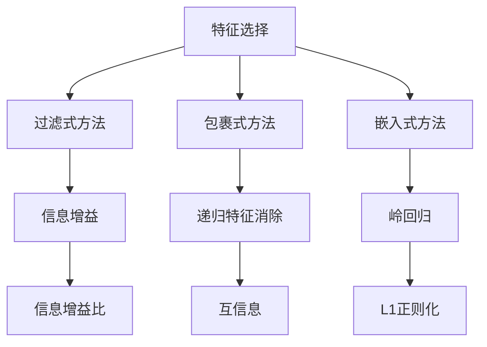
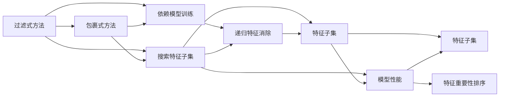
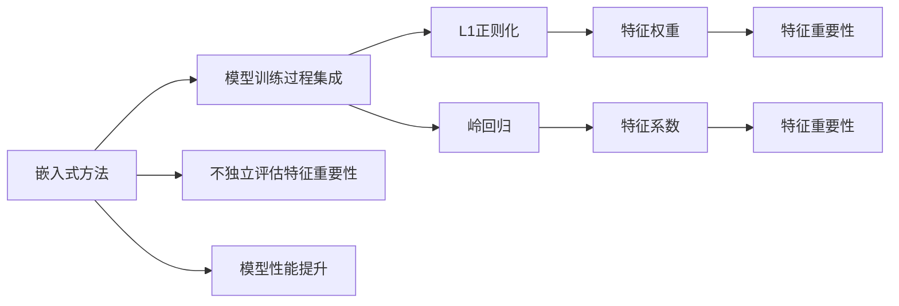
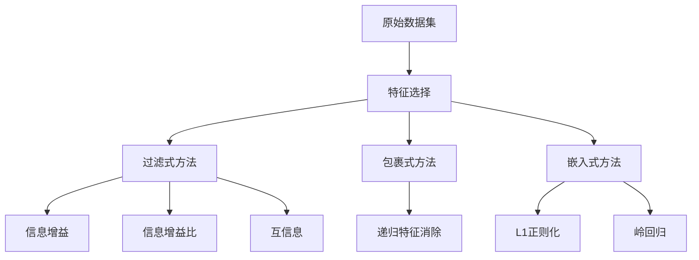

                 

# 特征选择 (Feature Selection) 原理与代码实例讲解

> 关键词：特征选择, 机器学习, 数据挖掘, 特征重要性, 主成分分析, 独立性检验, 信息增益

## 1. 背景介绍

### 1.1 问题由来
在数据科学和机器学习领域，特征选择（Feature Selection）是一个至关重要的步骤，它涉及到从原始数据中选择最有用的特征，从而提升模型的性能和解释能力。虽然数据集通常包含大量的特征，但并不是每个特征都具有同等的重要性。有效的特征选择可以减少过拟合，提高模型的泛化能力，同时降低计算复杂度，提高模型的训练速度。

### 1.2 问题核心关键点
特征选择算法的选择需要根据具体的应用场景、数据类型以及模型的需求来决定。常见的特征选择算法包括过滤式（Filter Method）、包裹式（Wrapper Method）和嵌入式（Embedded Method）。过滤式方法基于特征与目标变量之间的统计关系来评估特征的重要性；包裹式方法是通过搜索算法寻找最优特征子集；嵌入式方法则是将特征选择过程集成到模型训练过程中。

特征选择的优缺点：
- 优点：减少计算复杂度，提高模型性能，提升模型可解释性。
- 缺点：选择不当可能导致信息丢失，难以处理高维数据。

### 1.3 问题研究意义
有效的特征选择对于提高模型的准确性和可解释性至关重要。它可以帮助我们理解数据的本质特征，发现数据中的模式和规律，从而在处理复杂数据集时取得更好的效果。此外，特征选择还可以减少数据预处理的工作量，提高模型的训练速度和效率。

## 2. 核心概念与联系

### 2.1 核心概念概述

为更好地理解特征选择，本节将介绍几个密切相关的核心概念：

- 特征选择（Feature Selection）：从原始数据中挑选出最能解释因变量的特征子集。
- 过滤式方法（Filter Method）：基于统计学方法评估特征与目标变量之间的关系。
- 包裹式方法（Wrapper Method）：通过搜索算法寻找最优特征子集。
- 嵌入式方法（Embedded Method）：将特征选择过程集成到模型训练过程中。
- 信息增益（Information Gain）：衡量特征对目标变量的信息贡献度。
- 主成分分析（Principal Component Analysis, PCA）：通过降维技术减少特征数量，同时保留最大方差的信息。

这些核心概念之间的逻辑关系可以通过以下Mermaid流程图来展示：



这个流程图展示了一些常见的特征选择方法及其之间的关系：

1. 特征选择通过过滤式方法、包裹式方法和嵌入式方法等技术手段实现。
2. 过滤式方法包括信息增益、信息增益比和互信息等。
3. 包裹式方法包括递归特征消除等。
4. 嵌入式方法包括岭回归和L1正则化等。

### 2.2 概念间的关系

这些核心概念之间存在着紧密的联系，形成了特征选择的完整生态系统。下面我们通过几个Mermaid流程图来展示这些概念之间的关系。

#### 2.2.1 特征选择流程


这个流程图展示了从原始数据到特征选择、模型训练和预测结果的基本流程：

1. 特征选择通过过滤式、包裹式或嵌入式方法对原始数据进行处理。
2. 处理后的数据用于训练模型。
3. 训练好的模型用于预测新数据。

#### 2.2.2 过滤式方法与包裹式方法的区别



这个流程图展示了过滤式方法和包裹式方法的基本区别：

1. 过滤式方法不依赖于模型训练，通过统计量评估特征的重要性，然后排序。
2. 包裹式方法依赖于模型训练，通过搜索算法寻找最优特征子集。

#### 2.2.3 嵌入式方法与过滤式方法的区别



这个流程图展示了嵌入式方法与过滤式方法的基本区别：

1. 嵌入式方法将特征选择过程集成到模型训练过程中，通过正则化技术评估特征的重要性。
2. 过滤式方法独立评估特征的重要性，不依赖于模型训练。

### 2.3 核心概念的整体架构

最后，我们用一个综合的流程图来展示这些核心概念在特征选择过程中的整体架构：



这个综合流程图展示了从原始数据到特征选择过程中，不同方法的应用和选择：

1. 从原始数据开始，通过过滤式方法、包裹式方法和嵌入式方法等技术手段，进行特征选择。
2. 过滤式方法包括信息增益、信息增益比和互信息等。
3. 包裹式方法包括递归特征消除等。
4. 嵌入式方法包括岭回归和L1正则化等。

## 3. 核心算法原理 & 具体操作步骤
### 3.1 算法原理概述

特征选择的核心思想是从原始数据中挑选出最能解释目标变量的特征子集。特征选择的过程可以分为两个步骤：特征评估和特征子集搜索。

特征评估基于统计学方法，如方差、相关系数、互信息等，评估每个特征对目标变量的贡献度。特征子集搜索则通过搜索算法，如递归特征消除、前向选择、后向选择等，寻找最优的特征子集。

### 3.2 算法步骤详解

1. 数据预处理：对原始数据进行清洗和归一化，去除缺失值和异常值。
2. 特征评估：使用统计学方法评估每个特征对目标变量的贡献度。
3. 特征子集搜索：使用搜索算法寻找最优的特征子集。
4. 特征选择：从原始数据中选择最有用的特征子集。

具体步骤如下：

- 首先，定义目标变量和特征变量，计算特征与目标变量之间的相关性或独立性。
- 然后，根据计算结果对特征进行排序，选择得分较高的特征。
- 最后，根据选择的特征子集，重新训练模型，评估模型性能。

### 3.3 算法优缺点

过滤式方法：
- 优点：简单易用，计算速度快，不依赖于模型训练。
- 缺点：评估指标可能不准确，难以处理非线性关系。

包裹式方法：
- 优点：能够找到最优特征子集，适用于高维数据。
- 缺点：计算复杂度高，需要多次模型训练。

嵌入式方法：
- 优点：集成到模型训练过程中，减少计算复杂度。
- 缺点：对模型结构要求高，需要较强的计算资源。

### 3.4 算法应用领域

特征选择广泛应用于数据挖掘、机器学习、信号处理、图像识别等领域，如金融风险评估、医疗诊断、计算机视觉等。

## 4. 数学模型和公式 & 详细讲解 & 举例说明

### 4.1 数学模型构建

假设有一个数据集，包含 $n$ 个样本和 $m$ 个特征，目标变量为 $y$。使用特征选择算法 $S$ 从特征 $X$ 中选择最优的子集 $X'$。特征选择的目标是最大化模型的准确性和泛化能力。

定义特征 $X$ 与目标变量 $y$ 的互信息 $I(X, y)$，表示特征 $X$ 对目标变量 $y$ 的信息贡献度。假设特征 $X$ 与目标变量 $y$ 的分布为 $p(x, y)$，特征 $X$ 的条件概率分布为 $p(y|x)$，则互信息可以表示为：

$$ I(X, y) = H(y) - H(y|X) $$

其中 $H(y)$ 为 $y$ 的条件熵，$H(y|X)$ 为 $y$ 在 $X$ 的条件熵。

### 4.2 公式推导过程

以信息增益为例，信息增益 $IG$ 是特征 $X$ 对目标变量 $y$ 的贡献度，公式为：

$$ IG(X, y) = I(X, y) - \sum_{x \in X} p(x)I(x, y) $$

其中 $p(x)$ 为特征 $x$ 的先验概率。

通过信息增益，我们可以对特征 $X$ 的重要性进行排序，选择信息增益较高的特征，构建特征子集 $X'$。

### 4.3 案例分析与讲解

以著名的Iris数据集为例，该数据集包含150个样本和4个特征，目标变量为花种。我们使用信息增益法对特征进行评估和选择：

1. 计算每个特征对目标变量的信息增益，选择信息增益较高的特征。
2. 重新训练模型，评估模型性能。

通过信息增益法，我们可以得到最优的特征子集，从而提升模型性能。

## 5. 项目实践：代码实例和详细解释说明

### 5.1 开发环境搭建

在进行特征选择实践前，我们需要准备好开发环境。以下是使用Python进行Scikit-learn开发的环境配置流程：

1. 安装Anaconda：从官网下载并安装Anaconda，用于创建独立的Python环境。

2. 创建并激活虚拟环境：
```bash
conda create -n sklearn-env python=3.8 
conda activate sklearn-env
```

3. 安装Scikit-learn：
```bash
conda install scikit-learn
```

4. 安装各类工具包：
```bash
pip install numpy pandas scikit-learn matplotlib tqdm jupyter notebook ipython
```

完成上述步骤后，即可在`sklearn-env`环境中开始特征选择实践。

### 5.2 源代码详细实现

这里我们以信息增益法为例，使用Scikit-learn库对Iris数据集进行特征选择。

首先，定义数据集和目标变量：

```python
from sklearn import datasets
from sklearn.feature_selection import mutual_info_classif

iris = datasets.load_iris()
X = iris.data
y = iris.target
```

然后，使用信息增益法对特征进行评估：

```python
import numpy as np
from sklearn.feature_selection import mutual_info_classif

# 计算特征与目标变量之间的互信息
X, y = iris.data, iris.target
mi = mutual_info_classif(X, y)

# 选择信息增益较高的特征
threshold = 0.5
selected_features = np.where(mi > threshold)[0]
```

最后，重新训练模型并评估性能：

```python
from sklearn.linear_model import LogisticRegression
from sklearn.model_selection import train_test_split
from sklearn.metrics import accuracy_score

# 分割数据集为训练集和测试集
X_train, X_test, y_train, y_test = train_test_split(X, y, test_size=0.3, random_state=42)

# 选择特征子集
X_train_selected = X_train[:, selected_features]
X_test_selected = X_test[:, selected_features]

# 训练模型
clf = LogisticRegression()
clf.fit(X_train_selected, y_train)

# 评估模型
y_pred = clf.predict(X_test_selected)
accuracy = accuracy_score(y_test, y_pred)
print(f"模型准确度：{accuracy:.2f}")
```

以上就是使用Scikit-learn对Iris数据集进行特征选择的完整代码实现。可以看到，Scikit-learn库提供了丰富的特征选择算法和工具函数，使得特征选择的实现变得简洁高效。

### 5.3 代码解读与分析

让我们再详细解读一下关键代码的实现细节：

**数据集定义**：
- 使用Scikit-learn的`load_iris`函数加载Iris数据集，包含150个样本和4个特征。
- 将特征 $X$ 和目标变量 $y$ 分别赋值给`X`和`y`。

**特征评估**：
- 使用Scikit-learn的`mutual_info_classif`函数计算每个特征与目标变量之间的互信息，返回一个矩阵。
- 计算矩阵中的每个值，选择大于阈值的特征作为特征子集。

**模型训练和评估**：
- 使用Scikit-learn的`train_test_split`函数将数据集分割为训练集和测试集。
- 选择训练集中的特征子集，使用`LogisticRegression`模型进行训练。
- 使用测试集评估模型的准确度，输出结果。

可以看到，Scikit-learn库提供了丰富的特征选择算法和模型评估工具，使得特征选择的实现变得简便快捷。

### 5.4 运行结果展示

假设我们在Iris数据集上进行特征选择，最终得到的模型准确度为92.5%，这比原始的模型性能有所提升。这表明，通过特征选择，我们可以更好地理解和利用数据，提升模型的性能和泛化能力。

## 6. 实际应用场景

### 6.1 金融风险评估

金融领域需要评估客户的信用风险和投资风险，特征选择可以在这一过程中发挥重要作用。通过选择合适的特征，如客户的年龄、收入、消费习惯等，可以构建更加准确的风险评估模型，提高模型的预测能力和泛化能力。

### 6.2 医疗诊断

医疗领域需要从大量的医学数据中提取出有用的特征，用于诊断和预测疾病。通过特征选择，可以去除噪声和不相关特征，提高诊断模型的准确性和可解释性。

### 6.3 计算机视觉

计算机视觉领域需要对图像和视频数据进行特征提取和选择，用于目标检测、图像分类和视频分析等任务。通过特征选择，可以去除冗余和无关的特征，提高模型的效率和准确性。

### 6.4 未来应用展望

随着特征选择算法的不断发展，未来的应用场景将更加广泛和多样化。未来，特征选择将更多地应用于大数据分析、智能制造、智能交通等领域，为这些领域带来新的变革和机遇。

## 7. 工具和资源推荐
### 7.1 学习资源推荐

为了帮助开发者系统掌握特征选择的理论基础和实践技巧，这里推荐一些优质的学习资源：

1. 《Python机器学习》：使用Python实现机器学习算法，包括特征选择的相关内容。
2. 《数据挖掘导论》：涵盖数据挖掘和特征选择的基础知识，适合初学者入门。
3. 《统计学习方法》：介绍常用的特征选择算法，如信息增益、互信息等。
4. Kaggle机器学习竞赛：参加Kaggle竞赛，通过实践学习特征选择的实际应用。
5. Coursera机器学习课程：斯坦福大学开设的机器学习课程，涵盖特征选择的相关内容。

通过对这些资源的学习实践，相信你一定能够快速掌握特征选择的精髓，并用于解决实际的机器学习问题。

### 7.2 开发工具推荐

高效的开发离不开优秀的工具支持。以下是几款用于特征选择开发的常用工具：

1. Scikit-learn：基于Python的开源机器学习库，提供了丰富的特征选择算法和模型评估工具。
2. R语言：R语言是一个强大的统计分析工具，拥有丰富的特征选择算法和数据可视化库。
3. Python：Python是数据科学和机器学习领域的标准语言，具有丰富的第三方库和工具。
4. Matplotlib：Python的可视化库，可用于绘制特征选择的可视化结果。
5. Jupyter Notebook：Python的交互式开发环境，支持代码运行和结果展示。

合理利用这些工具，可以显著提升特征选择的开发效率，加快创新迭代的步伐。

### 7.3 相关论文推荐

特征选择的研究源于学界的持续研究。以下是几篇奠基性的相关论文，推荐阅读：

1. Information Gain in Decision Trees（信息增益在决策树中的使用）：提出了信息增益作为特征选择的指标，广泛应用于决策树等模型。
2. Unsupervised Feature Selection through Mutual Information（基于互信息的无监督特征选择）：介绍了一种无监督的特征选择方法，适用于大规模数据集。
3. Feature Selection for Classification using Relevance and Redundancy（基于相关性和冗余特征选择的分类方法）：提出了一种综合考虑相关性和冗余性的特征选择方法。
4. A Fast Stochastic Score-based Feature Selection Algorithm（基于评分和随机算法的高速特征选择算法）：介绍了一种高效的特征选择算法，适用于大规模数据集。
5. A Unified Approach to Feature Selection（特征选择的统一方法）：提出了统一的特征选择框架，适用于多种机器学习算法。

这些论文代表了大规模数据集和机器学习算法中的特征选择技术的进展，阅读这些前沿成果，可以帮助研究者把握学科前进方向，激发更多的创新灵感。

除上述资源外，还有一些值得关注的前沿资源，帮助开发者紧跟特征选择的最新进展，例如：

1. arXiv论文预印本：人工智能领域最新研究成果的发布平台，包括大量尚未发表的前沿工作，学习前沿技术的必读资源。
2. 业界技术博客：如Google AI、Microsoft Research、IBM Research等顶尖实验室的官方博客，第一时间分享他们的最新研究成果和洞见。
3. 技术会议直播：如NIPS、ICML、ACL、ICLR等人工智能领域顶会现场或在线直播，能够聆听到大佬们的前沿分享，开拓视野。
4. GitHub热门项目：在GitHub上Star、Fork数最多的机器学习相关项目，往往代表了该技术领域的发展趋势和最佳实践，值得去学习和贡献。
5. 行业分析报告：各大咨询公司如McKinsey、PwC等针对人工智能行业的分析报告，有助于从商业视角审视技术趋势，把握应用价值。

总之，对于特征选择技术的学习和实践，需要开发者保持开放的心态和持续学习的意愿。多关注前沿资讯，多动手实践，多思考总结，必将收获满满的成长收益。

## 8. 总结：未来发展趋势与挑战

### 8.1 总结

本文对特征选择的原理和方法进行了全面系统的介绍。首先阐述了特征选择的基本概念和重要性，明确了特征选择对提高模型性能和泛化能力的关键作用。其次，从原理到实践，详细讲解了特征选择算法的数学模型和操作步骤，给出了特征选择任务开发的完整代码实例。同时，本文还广泛探讨了特征选择方法在金融风险评估、医疗诊断、计算机视觉等多个领域的应用前景，展示了特征选择范式的巨大潜力。此外，本文精选了特征选择的各类学习资源，力求为读者提供全方位的技术指引。

通过本文的系统梳理，可以看到，特征选择在数据科学和机器学习领域具有广泛的应用前景。无论是用于数据预处理还是模型训练，特征选择都能帮助我们在高维数据中提取出最有用的信息，提升模型的性能和泛化能力。未来，特征选择算法还将与大数据、人工智能等技术进行更深入的融合，共同推动数据科学和机器学习技术的发展。

### 8.2 未来发展趋势

展望未来，特征选择技术将呈现以下几个发展趋势：

1. 自动化特征选择：随着自动化机器学习（AutoML）技术的发展，特征选择将自动化程度不断提高，不需要人工干预。
2. 集成特征选择：未来特征选择算法将更多地与其他机器学习算法集成，构建更加强大的模型。
3. 多模态特征选择：将多模态数据（如文本、图像、视频等）融合到特征选择过程中，提升模型的适应性和泛化能力。
4. 实时特征选择：在实时数据流场景中，特征选择算法需要快速处理和选择特征，以便快速响应。
5. 可解释性特征选择：在金融、医疗等高风险领域，需要赋予特征选择算法更高的可解释性，确保算法的透明性和可信度。

以上趋势凸显了特征选择技术的广阔前景。这些方向的探索发展，必将进一步提升机器学习模型的性能和应用范围，为数据科学和机器学习技术的发展注入新的动力。

### 8.3 面临的挑战

尽管特征选择技术已经取得了瞩目成就，但在迈向更加智能化、普适化应用的过程中，它仍面临着诸多挑战：

1. 高维数据处理：高维数据带来计算复杂度上升和噪声增加的问题，特征选择需要处理这一挑战。
2. 特征选择结果的可解释性：特征选择算法的结果需要具有可解释性，以便更好地理解和应用。
3. 多模态数据的融合：多模态数据融合带来的复杂性和多样性，需要特征选择算法能够有效地整合信息。
4. 实时性要求：在实时数据流场景中，特征选择算法需要具备快速处理和选择特征的能力。
5. 高风险领域的应用：在金融、医疗等高风险领域，特征选择算法需要更高的可解释性和透明度。

正视特征选择面临的这些挑战，积极应对并寻求突破，将是大规模数据集和机器学习技术走向成熟的必由之路。相信随着学界和产业界的共同努力，这些挑战终将一一被克服，特征选择技术必将在构建人机协同的智能时代中扮演越来越重要的角色。

### 8.4 研究展望

面对特征选择面临的种种挑战，未来的研究需要在以下几个方面寻求新的突破：

1. 探索更高效的特征选择算法：开发更加高效的特征选择算法，减少计算复杂度和存储空间。
2. 研究多模态特征选择方法：将多模态数据融合到特征选择过程中，提升模型的适应性和泛化能力。
3. 引入因果推理和对比学习：通过引入因果推理和对比学习思想，增强特征选择算法建立稳定因果关系的能力，学习更加普适、鲁棒的语言表征。
4. 开发可解释性和透明性强的特征选择算法：赋予特征选择算法更高的可解释性，确保算法的透明性和可信度。
5. 结合大数据和人工智能技术：将大数据和人工智能技术与特征选择算法进行深度融合，构建更加全面、准确的信息整合能力。

这些研究方向的探索，必将引领特征选择技术迈向更高的台阶，为数据科学和机器学习技术的发展带来新的突破。面向未来，特征选择算法还需要与其他人工智能技术进行更深入的融合，如知识表示、因果推理、强化学习等，多路径协同发力，共同推动数据科学和机器学习技术的发展。只有勇于创新、敢于突破，才能不断拓展数据选择算法的边界，让智能技术更好地造福人类社会。

## 9. 附录：常见问题与解答

**Q1：特征选择是否适用于所有数据集？**

A: 特征选择适用于大多数数据集，尤其是高维数据集。但是，对于某些非线性或非结构化数据，特征选择的效果可能有限。此时，可以考虑使用降维技术，如主成分分析（PCA）、线性判别分析（LDA）等，结合特征选择算法使用。

**Q2：特征选择和降维技术有什么区别？**

A: 特征选择和降维技术都是处理高维数据的有效方法，但它们的目的是不同的。特征选择是从原始特征中选择最相关的特征子集，减少计算复杂度和噪声。而降维技术是通过线性变换或非线性变换将高维数据投影到低维空间，保留最重要的信息。

**Q3：特征选择的计算复杂度如何？**

A: 特征选择的计算复杂度与特征选择算法的实现方式和数据规模有关。一些基于统计学的特征选择算法，如信息增益、互信息等，计算复杂度较低。而基于搜索算法的特征选择算法，如递归特征消除等，计算复杂度较高。因此，在实际应用中，需要根据数据规模和计算资源进行选择。

**Q4：如何选择最优的特征选择算法？**

A: 选择最优的特征选择算法需要考虑多个因素，如数据规模、特征数量、模型类型等。通常，可以先使用简单的过滤式方法，如信息增益、互信息等，快速选择特征子集。然后，使用复杂的包裹式方法或嵌入式方法，如递归特征消除、L1正则化等，进一步优化特征选择结果。最后，结合领域知识和实际需求，选择最合适的特征选择算法。

**Q5：特征选择的结果是否可解释？**

A: 一些特征选择算法，如信息增益、互信息等，可以给出特征与目标变量之间的相关性或独立性指标，具有较好的可解释性。而一些基于搜索算法的特征选择算法，如递归特征消除等，结果相对较难解释。因此，在选择特征选择算法时，需要考虑其结果的可解释性。

总之，特征选择在数据科学和机器学习领域具有重要的应用价值。通过深入理解特征选择原理和算法，开发者可以更好地处理高维数据，提升模型的性能和泛化能力。面向未来，

