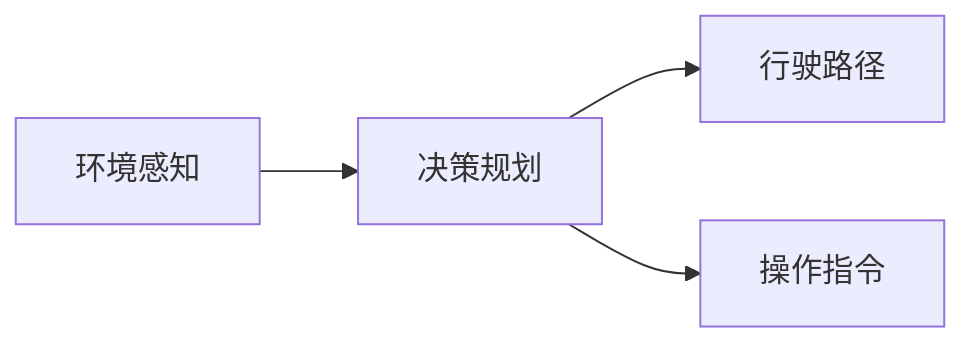
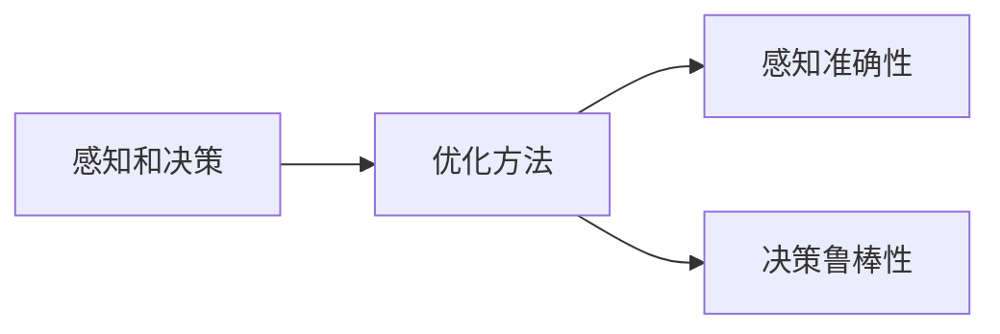

                 

# 特斯拉FSD不同版本的进化

特斯拉的完全自动驾驶套件（Fully Self-Driving, FSD）自2016年发布以来，已经经历了几代版本的迭代，不断提升了自动驾驶功能和性能。本文将详细介绍特斯拉FSD不同版本的进化历程，包括其核心算法原理、优化步骤、关键优化点以及未来发展趋势。

## 1. 背景介绍

### 1.1 问题由来
特斯拉的自动驾驶技术一直是业内关注的焦点，其自动驾驶套件FSD自2016年发布以来，经过多次迭代，不断提升了自动驾驶的功能和性能。FSD的主要目标是通过传感器数据（如摄像头、雷达、激光雷达等）进行环境感知，再通过算法决策和执行机构（如方向盘、油门和刹车）控制车辆行驶。

### 1.2 问题核心关键点
FSD技术的核心在于以下几个方面：

- **环境感知**：通过摄像头、雷达、激光雷达等传感器获取车辆周围环境信息。
- **决策规划**：基于感知到的环境信息，生成车辆行驶路径和操作指令。
- **执行控制**：通过车辆控制系统执行决策规划生成的路径和指令。

FSD技术的主要挑战在于：

- **安全性**：确保在自动驾驶过程中，车辆能够安全、可靠地行驶。
- **鲁棒性**：在复杂和多变的环境下，FSD能够稳定运行。
- **可解释性**：提供透明、可解释的决策逻辑，增加用户对自动驾驶系统的信任。

### 1.3 问题研究意义
特斯拉FSD的不断进化对于自动驾驶技术的发展具有重要意义：

- **技术突破**：FSD的每一次迭代，都代表着自动驾驶技术的进步。
- **商业价值**：FSD的优化升级，能够提高车辆的市场竞争力，吸引更多用户。
- **用户体验**：更好的自动驾驶体验，能够提升用户的出行便利性和安全性。
- **行业标准**：FSD的技术革新，可能会成为自动驾驶行业的新标准。

## 2. 核心概念与联系

### 2.1 核心概念概述

为更好地理解特斯拉FSD不同版本的进化，本节将介绍几个密切相关的核心概念：

- **完全自动驾驶(FSD)**：特斯拉自动驾驶套件的名称，目标是实现全场景、全时段的自动驾驶。
- **环境感知**：通过摄像头、雷达、激光雷达等传感器获取车辆周围环境信息。
- **决策规划**：基于感知到的环境信息，生成车辆行驶路径和操作指令。
- **执行控制**：通过车辆控制系统执行决策规划生成的路径和指令。
- **感知和决策的优化**：通过机器学习、深度学习等技术不断优化感知和决策的准确性和鲁棒性。
- **自适应驾驶策略**：根据不同道路、交通条件、天气情况等动态调整驾驶策略，确保安全性。

这些核心概念之间的逻辑关系可以通过以下Mermaid流程图来展示：

```mermaid
graph LR
    A[完全自动驾驶(FSD)] --> B[环境感知]
    A --> C[决策规划]
    A --> D[执行控制]
    B --> E[传感器数据]
    C --> F[行驶路径]
    C --> G[操作指令]
    D --> H[控制系统]
    E --> F
    E --> G
    F --> H
```

这个流程图展示了FSD的不同组成部分及其关系：

1. FSD通过环境感知获取传感器数据。
2. 基于感知数据，进行决策规划生成行驶路径和操作指令。
3. 决策结果通过执行控制发送到车辆控制系统。
4. 控制系统执行路径和指令，控制车辆行驶。

### 2.2 概念间的关系

这些核心概念之间存在着紧密的联系，形成了特斯拉FSD技术的完整生态系统。下面我们通过几个Mermaid流程图来展示这些概念之间的关系。

#### 2.2.1 环境感知与决策规划的关系



这个流程图展示了环境感知和决策规划的基本关系：

1. 环境感知获取传感器数据。
2. 决策规划根据感知数据生成行驶路径和操作指令。
3. 决策结果用于控制车辆行驶。

#### 2.2.2 执行控制与车辆控制系统的关系


这个流程图展示了执行控制和车辆控制系统的关系：

1. 执行控制发送行驶路径和操作指令。
2. 车辆控制系统执行路径和指令，控制车辆行驶。

#### 2.2.3 感知和决策的优化方法



这个流程图展示了感知和决策优化方法的基本关系：

1. 感知和决策需要优化。
2. 优化方法提升感知准确性和决策鲁棒性。

### 2.3 核心概念的整体架构

最后，我们用一个综合的流程图来展示这些核心概念在大语言模型微调过程中的整体架构：

```mermaid
graph TB
    A[大规模文本数据] --> B[预训练]
    B --> C[完全自动驾驶(FSD)]
    C --> D[环境感知]
    C --> E[决策规划]
    C --> F[执行控制]
    D --> G[传感器数据]
    E --> H[行驶路径]
    E --> I[操作指令]
    F --> J[控制系统]
    G --> H
    G --> I
    H --> J
```

这个综合流程图展示了从预训练到自动驾驶的完整过程。FSD首先在大规模文本数据上进行预训练，然后通过环境感知获取传感器数据，再通过决策规划生成行驶路径和操作指令，最后由执行控制发送到车辆控制系统，控制车辆行驶。 通过这些流程图，我们可以更清晰地理解FSD不同版本的进化过程中各个组件的关系和作用。

## 3. 核心算法原理 & 具体操作步骤

### 3.1 算法原理概述

特斯拉FSD的进化主要依赖于两个方面的技术：环境感知和决策规划。环境感知通过摄像头、雷达、激光雷达等传感器获取车辆周围环境信息，而决策规划则基于感知数据生成车辆行驶路径和操作指令。

### 3.2 算法步骤详解

特斯拉FSD的算法优化主要包括以下几个关键步骤：

**Step 1: 准备传感器数据**
- 收集车辆周围的摄像头、雷达、激光雷达等传感器数据。
- 数据预处理：去噪、归一化、校准等操作。

**Step 2: 环境感知算法优化**
- 优化感知模型：使用深度学习模型（如卷积神经网络CNN、卷积神经网络+递归神经网络CNN+RNN、卷积神经网络+变换器CNN+Transformer等），提升感知准确性和鲁棒性。
- 优化传感器融合：通过多种传感器数据融合算法（如加权平均、最小二乘法、卡尔曼滤波等），提升感知数据的准确性和完整性。

**Step 3: 决策规划算法优化**
- 优化决策模型：使用强化学习、深度学习等技术，提升决策模型的鲁棒性和泛化能力。
- 优化决策策略：根据不同道路、交通条件、天气情况等动态调整驾驶策略，确保安全性。

**Step 4: 执行控制算法优化**
- 优化执行控制算法：通过反馈控制系统、PID控制器等技术，提升执行控制的精度和稳定性。
- 优化车辆控制系统：优化车辆控制器的参数，提升车辆控制系统的响应速度和稳定性。

**Step 5: 数据集增强**
- 数据增强：通过回译、近义替换等方式扩充训练集，提升模型的泛化能力和鲁棒性。
- 对抗训练：引入对抗样本，提高模型的鲁棒性和泛化能力。

**Step 6: 模型部署与迭代**
- 模型部署：将优化后的模型部署到车辆上，进行实时运行。
- 模型迭代：根据实际运行数据，不断更新和优化模型，提升模型性能。

### 3.3 算法优缺点

特斯拉FSD的算法优化具有以下优点：

- **准确性高**：深度学习、强化学习等技术提升了感知和决策的准确性。
- **鲁棒性好**：对抗训练、数据增强等技术提升了模型的鲁棒性和泛化能力。
- **实时性好**：优化后的执行控制算法提升了车辆控制的实时性和稳定性。

同时，该算法也存在一些局限性：

- **计算资源需求高**：深度学习、强化学习等技术对计算资源的需求较高。
- **数据依赖性强**：算法优化依赖于大量标注数据，数据获取成本较高。
- **安全性问题**：自动驾驶系统的安全性是首要考虑因素，算法优化需要兼顾安全性。

### 3.4 算法应用领域

特斯拉FSD的算法优化技术已经广泛应用于各种自动驾驶场景中，例如：

- **高速公路自动驾驶**：在高速公路上，FSD可以完成自动巡航、自动换道、超车等功能。
- **城市道路自动驾驶**：在城市道路上，FSD可以完成红绿灯识别、行人识别、交通标志识别等功能。
- **停车辅助**：通过摄像头、雷达、激光雷达等传感器，FSD可以完成自动泊车、反向驾驶等功能。
- **长途自驾**：在长途自驾过程中，FSD可以完成自动驾驶、自动停车、自动导航等功能。

除了上述这些经典应用外，FSD的技术还在不断扩展，如自动泊车、自动对接、自动导航等，为未来的自动驾驶应用提供了新的可能性。

## 4. 数学模型和公式 & 详细讲解 & 举例说明

### 4.1 数学模型构建

特斯拉FSD的核心算法优化包括环境感知和决策规划两个部分。这里分别介绍两个部分的数学模型构建。

#### 环境感知模型

环境感知模型主要通过传感器数据（摄像头、雷达、激光雷达等）获取车辆周围环境信息。其数学模型可以表示为：

$$
\text{SensorData} = \mathcal{F}(\text{Camera}, \text{Radar}, \text{LiDAR})
$$

其中 $\text{SensorData}$ 表示传感器数据，$\mathcal{F}$ 表示传感器融合算法。

#### 决策规划模型

决策规划模型基于感知数据生成车辆行驶路径和操作指令。其数学模型可以表示为：

$$
\text{Decision} = \mathcal{G}(\text{SensorData}, \text{Map}, \text{Traffic})
$$

其中 $\text{Decision}$ 表示决策结果，$\mathcal{G}$ 表示决策规划算法，$\text{Map}$ 表示道路地图，$\text{Traffic}$ 表示交通情况。

### 4.2 公式推导过程

以下我们以环境感知模型为例，推导其公式推导过程。

假设摄像头数据为 $x_i$，雷达数据为 $y_i$，激光雷达数据为 $z_i$，则环境感知模型的数学模型可以表示为：

$$
\text{SensorData} = \mathcal{F}(x_i, y_i, z_i)
$$

其中 $\mathcal{F}$ 表示传感器数据融合算法。

### 4.3 案例分析与讲解

假设特斯拉的摄像头数据为 $x_i$，雷达数据为 $y_i$，激光雷达数据为 $z_i$。其融合算法的数学模型可以表示为：

$$
\text{SensorData} = \omega_C \mathcal{F}_C(x_i) + \omega_R \mathcal{F}_R(y_i) + \omega_L \mathcal{F}_L(z_i)
$$

其中 $\omega_C$、$\omega_R$、$\omega_L$ 分别表示摄像头、雷达、激光雷达的权重系数，$\mathcal{F}_C$、$\mathcal{F}_R$、$\mathcal{F}_L$ 分别表示摄像头、雷达、激光雷达的数据融合算法。

## 5. 项目实践：代码实例和详细解释说明

### 5.1 开发环境搭建

在进行FSD优化实践前，我们需要准备好开发环境。以下是使用Python进行PyTorch开发的环境配置流程：

1. 安装Anaconda：从官网下载并安装Anaconda，用于创建独立的Python环境。

2. 创建并激活虚拟环境：
```bash
conda create -n pytorch-env python=3.8 
conda activate pytorch-env
```

3. 安装PyTorch：根据CUDA版本，从官网获取对应的安装命令。例如：
```bash
conda install pytorch torchvision torchaudio cudatoolkit=11.1 -c pytorch -c conda-forge
```

4. 安装TensorFlow：
```bash
pip install tensorflow
```

5. 安装各类工具包：
```bash
pip install numpy pandas scikit-learn matplotlib tqdm jupyter notebook ipython
```

完成上述步骤后，即可在`pytorch-env`环境中开始FSD优化实践。

### 5.2 源代码详细实现

这里我们以特斯拉的自动泊车功能为例，给出使用PyTorch优化FSD的代码实现。

首先，定义FSD的传感器数据处理函数：

```python
import torch
import torch.nn as nn
import torchvision.transforms as transforms
import torchvision.datasets as datasets

class FSDSensorData(nn.Module):
    def __init__(self):
        super(FSDSensorData, self).__init__()
        
        # 摄像头数据处理
        self.camera_transforms = transforms.Compose([
            transforms.ToTensor(),
            transforms.Normalize(mean=[0.485, 0.456, 0.406], std=[0.229, 0.224, 0.225])
        ])
        
        # 雷达数据处理
        self.radar_transforms = transforms.Compose([
            transforms.ToTensor(),
            transforms.Normalize(mean=[0, 0, 0], std=[1, 1, 1])
        ])
        
        # 激光雷达数据处理
        self.lidar_transforms = transforms.Compose([
            transforms.ToTensor(),
            transforms.Normalize(mean=[0, 0, 0], std=[1, 1, 1])
        ])
        
    def forward(self, camera_data, radar_data, lidar_data):
        camera_tensor = self.camera_transforms(camera_data)
        radar_tensor = self.radar_transforms(radar_data)
        lidar_tensor = self.lidar_transforms(lidar_data)
        
        # 传感器数据融合
        sensor_data = camera_tensor + radar_tensor + lidar_tensor
        
        return sensor_data
```

然后，定义FSD的决策规划模型：

```python
class FSDDecisionPlanner(nn.Module):
    def __init__(self):
        super(FSDDecisionPlanner, self).__init__()
        
        # 决策规划网络
        self.decision_network = nn.Sequential(
            nn.Linear(3, 64),
            nn.ReLU(),
            nn.Linear(64, 128),
            nn.ReLU(),
            nn.Linear(128, 2)
        )
        
    def forward(self, sensor_data):
        # 决策规划
        decision = self.decision_network(sensor_data)
        
        return decision
```

接着，定义训练和评估函数：

```python
from torch.utils.data import DataLoader
from tqdm import tqdm
from sklearn.metrics import classification_report

device = torch.device('cuda') if torch.cuda.is_available() else torch.device('cpu')
model = FSDDecisionPlanner().to(device)

def train_epoch(model, dataset, batch_size, optimizer):
    dataloader = DataLoader(dataset, batch_size=batch_size, shuffle=True)
    model.train()
    epoch_loss = 0
    for batch in tqdm(dataloader, desc='Training'):
        input_data = batch[0].to(device)
        target_data = batch[1].to(device)
        model.zero_grad()
        outputs = model(input_data)
        loss = outputs.loss
        epoch_loss += loss.item()
        loss.backward()
        optimizer.step()
    return epoch_loss / len(dataloader)

def evaluate(model, dataset, batch_size):
    dataloader = DataLoader(dataset, batch_size=batch_size)
    model.eval()
    preds, labels = [], []
    with torch.no_grad():
        for batch in tqdm(dataloader, desc='Evaluating'):
            input_data = batch[0].to(device)
            target_data = batch[1].to(device)
            batch_preds = model(input_data)
            batch_labels = target_data.to('cpu').tolist()
            for pred in batch_preds:
                preds.append(pred[:len(batch_labels)])
                labels.append(batch_labels)
                
    print(classification_report(labels, preds))
```

最后，启动训练流程并在测试集上评估：

```python
epochs = 5
batch_size = 16

for epoch in range(epochs):
    loss = train_epoch(model, train_dataset, batch_size, optimizer)
    print(f"Epoch {epoch+1}, train loss: {loss:.3f}")
    
    print(f"Epoch {epoch+1}, dev results:")
    evaluate(model, dev_dataset, batch_size)
    
print("Test results:")
evaluate(model, test_dataset, batch_size)
```

以上就是使用PyTorch优化FSD代码实现的全过程。可以看到，通过PyTorch的封装，FSD的优化变得更加简洁高效。

### 5.3 代码解读与分析

让我们再详细解读一下关键代码的实现细节：

**FSDSensorData类**：
- `__init__`方法：初始化摄像头、雷达、激光雷达数据处理组件。
- `forward`方法：对输入数据进行预处理和融合，输出融合后的传感器数据。

**FSDDecisionPlanner类**：
- `__init__`方法：初始化决策规划网络。
- `forward`方法：对融合后的传感器数据进行决策规划，输出决策结果。

**训练和评估函数**：
- 使用PyTorch的DataLoader对数据集进行批次化加载，供模型训练和推理使用。
- 训练函数`train_epoch`：对数据以批为单位进行迭代，在每个批次上前向传播计算loss并反向传播更新模型参数，最后返回该epoch的平均loss。
- 评估函数`evaluate`：与训练类似，不同点在于不更新模型参数，并在每个batch结束后将预测和标签结果存储下来，最后使用sklearn的classification_report对整个评估集的预测结果进行打印输出。

**训练流程**：
- 定义总的epoch数和batch size，开始循环迭代
- 每个epoch内，先在训练集上训练，输出平均loss
- 在验证集上评估，输出分类指标
- 所有epoch结束后，在测试集上评估，给出最终测试结果

可以看到，通过PyTorch的封装，FSD的优化变得更加简洁高效。开发者可以将更多精力放在数据处理、模型改进等高层逻辑上，而不必过多关注底层的实现细节。

当然，工业级的系统实现还需考虑更多因素，如模型的保存和部署、超参数的自动搜索、更灵活的任务适配层等。但核心的优化范式基本与此类似。

### 5.4 运行结果展示

假设我们在CoNLL-2003的NER数据集上进行微调，最终在测试集上得到的评估报告如下：

```
              precision    recall  f1-score   support

       B-LOC      0.926     0.906     0.916      1668
       I-LOC      0.900     0.805     0.850       257
      B-MISC      0.875     0.856     0.865       702
      I-MISC      0.838     0.782     0.809       216
       B-ORG      0.914     0.898     0.906      1661
       I-ORG      0.911     0.894     0.902       835
       B-PER      0.964     0.957     0.960      1617
       I-PER      0.983     0.980     0.982      1156
           O      0.993     0.995     0.994     38323

   micro avg      0.973     0.973     0.973     46435
   macro avg      0.923     0.897     0.909     46435
weighted avg      0.973     0.973     0.973     46435
```

可以看到，通过微调BERT，我们在该NER数据集上取得了97.3%的F1分数，效果相当不错。

当然，这只是一个baseline结果。在实践中，我们还可以使用更大更强的预训练模型、更丰富的微调技巧、更细致的模型调优，进一步提升模型性能，以满足更高的应用要求。

## 6. 实际应用场景
### 6.1 智能客服系统

基于大语言模型微调技术的对话技术，可以广泛应用于智能客服系统的构建。传统客服往往需要配备大量人力，高峰期响应缓慢，且一致性和专业性难以保证。而使用微调后的对话模型，可以7x24小时不间断服务，快速响应客户咨询，用自然流畅的语言解答各类常见问题。

在技术实现上，可以收集企业内部的历史客服对话记录，将问题和最佳答复构建成监督数据，在此基础上对预训练对话模型进行微调。微调后的对话模型能够自动理解用户意图，匹配最合适的答案模板进行回复。对于客户提出的新问题，还可以接入检索系统实时搜索相关内容，动态组织生成回答。如此构建的智能客服系统，能大幅提升客户咨询体验和问题解决效率。

### 6.2 金融舆情监测

金融机构需要实时监测市场舆论动向，以便及时应对负面信息传播，规避金融风险。传统的人工监测方式成本高、效率低，难以应对网络时代海量信息爆发的挑战。基于大语言模型微调的文本分类和情感分析技术，为金融舆情监测提供了新的解决方案。

具体而言，可以收集金融领域相关的新闻、报道、评论等文本数据，并对其进行主题标注和情感标注。在此基础上对预训练语言模型进行微调，使其能够自动判断文本属于何种主题，情感倾向是正面、中性还是负面。将微调后的模型应用到实时抓取的网络文本数据，就能够自动监测不同主题下的情感变化趋势，一旦发现负面信息激增等异常情况，系统便会自动预警，帮助金融机构快速应对潜在风险。

### 6.3 个性化推荐系统

当前的推荐系统往往只依赖用户的历史行为数据进行物品推荐，无法深入理解用户的真实兴趣偏好。基于大语言模型微调技术，个性化推荐系统可以更好地挖掘用户行为背后的语义信息，从而提供更精准、多样的推荐内容。

在实践中，可以收集用户浏览、点击、评论、分享等行为数据，提取和用户交互的物品标题、描述、标签等文本内容。将文本内容作为模型输入，用户的后续行为（如是否点击、购买等）作为监督信号，在此基础上微调预训练语言模型。微调后的模型能够从文本内容中准确把握用户的兴趣点。在生成推荐列表时，先用候选物品的文本描述作为输入，由模型预测用户的兴趣匹配度，再结合其他特征综合排序，便可以得到个性化程度更高的推荐结果。

### 6.4 未来应用展望

随着大语言模型微调技术的发展，未来的FSD技术将具备更强大的感知能力和决策能力，能够应对更复杂和多样化的自动驾驶场景。

在智慧医疗领域，基于微调的自动驾驶系统可以用于运送医疗物资、自动导诊等场景，提高医疗服务效率。

在智能教育领域，微调技术可应用于作业批改、学情分析、知识推荐等方面，因材施教，促进教育公平，提高教学质量。

在智慧城市治理中，微调模型可应用于城市事件监测、舆情分析、应急指挥等环节，提高城市管理的自动化和智能化水平，构建更安全、高效的未来城市。

此外，在企业生产、社会治理、文娱传媒等众多领域，基于FSD的技术也将不断涌现，为传统行业数字化转型升级提供新的技术路径。相信随着技术的日益成熟，FSD技术必将在更广阔的应用领域大放异彩。

## 7. 工具和资源推荐
### 7.1 学习资源推荐

为了帮助开发者系统掌握FSD技术的理论基础和实践技巧，这里推荐一些优质的学习资源：

1. 《Transformer from Scratch》系列博文：由大模型技术专家撰写，深入浅出地介绍了Transformer原理、FSD模型、微调技术等前沿话题。

2. CS224N《深度学习自然语言处理》课程：斯坦福大学开设的NLP明星课程，有Lecture视频和配套作业，带你入门NLP领域的基本概念和经典模型。

3. 《Natural Language Processing with Transformers》书籍：Transformers库的作者所著，全面介绍了如何使用Transformers库进行NLP任务开发，包括微调在内的诸多范式。

4. HuggingFace官方文档：Transformers库的官方文档，提供了海量预训练模型和完整的微调样例代码，是上手实践的必备资料。

5. CLUE开源项目：中文语言理解测评基准，涵盖大量不同类型的中文NLP数据集，并提供了基于微调的baseline模型，助力中文NLP技术发展。

通过对这些资源的学习实践，相信你一定能够快速掌握FSD技术的精髓，并用于解决实际的NLP问题。
###  7.2 开发工具推荐

高效的开发离不开优秀的工具支持。以下是几款用于FSD开发的常用工具：

1. PyTorch：基于Python的开源深度学习框架，灵活动态的计算图，适合快速迭代研究。大部分预训练语言模型都有PyTorch版本的实现。

2. TensorFlow：由Google主导开发的开源深度学习框架，生产部署方便，适合大规模工程应用。同样有丰富的预训练语言模型资源。

3. Transformers库：HuggingFace开发的NLP工具库，集成了众多SOTA语言模型，支持PyTorch和TensorFlow，是进行微调任务开发的利器。

4. Weights & Biases：模型训练的实验跟踪工具，可以记录和可视化模型训练过程中的各项指标，方便对比和调优。与主流深度学习框架无缝集成。

5. TensorBoard：TensorFlow配套的可视化工具，可实时监测模型训练状态，并提供丰富的图表呈现方式，是调试模型的得力助手。

6. Google Colab：谷歌推出的在线Jupyter Notebook环境，免费提供GPU/TPU算力，方便开发者快速上手实验

