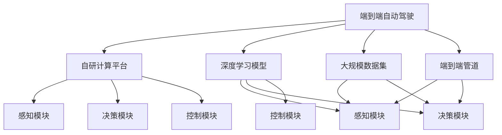
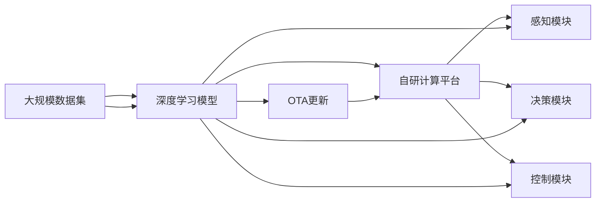
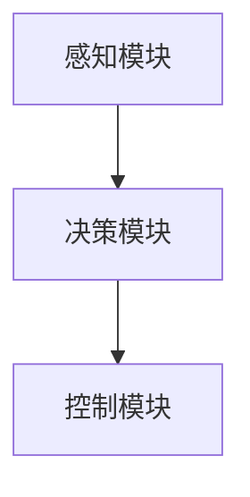
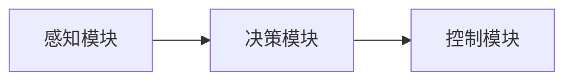

                 

# 特斯拉在端到端自动驾驶上的巨额投资

在自动驾驶技术领域，特斯拉以其独特的技术路线、强劲的市场表现和持续的研发投入，成为了行业中的佼佼者。特别是在端到端的自动驾驶技术上，特斯拉的巨额投资不仅推动了技术创新，也引领了整个行业的演进方向。本文将从背景介绍、核心概念与联系、核心算法原理、项目实践、实际应用场景、工具和资源推荐、总结等多个维度，深入探讨特斯拉在端到端自动驾驶上的巨额投资及其深远影响。

## 1. 背景介绍

### 1.1 问题由来

自动驾驶技术，作为一种先进的智能交通系统，其核心在于通过计算机视觉、深度学习等技术，实现对车辆周围环境的感知、决策和控制。特斯拉的端到端自动驾驶技术，则是指车辆从感知到决策再到控制，完全由自己的深度学习模型完成，无需依赖第三方传感器和设备，真正实现了“软件定义汽车”。

近年来，随着人工智能、计算机视觉和深度学习技术的飞速发展，自动驾驶技术也迎来了突破。特斯拉作为行业领军者，通过大量的研发投入，构建了强大的自动驾驶技术体系。特斯拉的Autopilot和Full Self-Driving (FSD)系统，已经积累了海量的驾驶数据，并通过这些数据持续优化其自动驾驶模型，实现了显著的性能提升。

### 1.2 问题核心关键点

特斯拉在端到端自动驾驶上的巨额投资，主要集中在以下几个方面：

1. **高性能计算平台**：特斯拉自行研发了自家的自动驾驶计算平台HW3.0，采用自研的Tegra Xavier芯片，具备强大的算力和能效，是当前最先进的自动驾驶计算平台之一。
2. **深度学习模型**：特斯拉开发了自己的深度学习框架Tesla Autopilot Deep Learning Framework，专门用于自动驾驶模型的训练和推理。
3. **大规模数据集**：特斯拉积累了数百万英里的真实驾驶数据，通过这些数据不断迭代优化其自动驾驶模型。
4. **端到端管道**：特斯拉构建了从感知到决策再到控制的端到端自动驾驶管道，消除了对第三方传感器的依赖。
5. **持续更新和优化**：特斯拉通过OTA（Over-the-Air）技术，持续更新自动驾驶模型，不断提升其性能。

这些核心关键点共同构成了特斯拉在端到端自动驾驶上的独特优势，使其在自动驾驶领域保持领先地位。

### 1.3 问题研究意义

特斯拉在端到端自动驾驶上的巨额投资，对于推动自动驾驶技术的发展和普及具有重要意义：

1. **降低系统复杂性**：通过端到端管道，消除了对第三方传感器的依赖，简化了系统架构，降低了开发和维护成本。
2. **提升系统鲁棒性**：去除外部传感器的干扰，提高了自动驾驶系统的鲁棒性和稳定性。
3. **推动技术创新**：大规模数据集和深度学习模型的持续优化，推动了自动驾驶技术的快速迭代和突破。
4. **加速行业演进**：特斯拉的创新技术和成功实践，引领了整个行业的发展方向，促进了自动驾驶技术的产业化。
5. **提升用户体验**：通过端到端的自动驾驶系统，提升了驾驶安全性、舒适性和便利性，提升了用户体验。

## 2. 核心概念与联系

### 2.1 核心概念概述

特斯拉的端到端自动驾驶技术，涉及多个核心概念，这些概念共同构成了其技术体系。

- **端到端自动驾驶**：指车辆从感知、决策到控制的全部过程，均由特斯拉的深度学习模型完成，无需第三方传感器。
- **自研计算平台**：指特斯拉自行研发的自动驾驶计算平台，如Tegra Xavier芯片和HW3.0平台。
- **深度学习模型**：指特斯拉自主开发的深度学习模型，用于自动驾驶感知、决策和控制。
- **大规模数据集**：指特斯拉积累的海量真实驾驶数据，用于模型训练和优化。
- **端到端管道**：指特斯拉构建的从感知到决策再到控制的自动驾驶管道，消除了对第三方传感器的依赖。
- **OTA更新**：指特斯拉通过OTA技术，持续更新自动驾驶模型，提升系统性能。

这些核心概念之间的逻辑关系可以通过以下Mermaid流程图来展示：



这个流程图展示了特斯拉端到端自动驾驶技术的基本架构：

1. 端到端自动驾驶系统通过自研计算平台进行计算。
2. 感知模块由深度学习模型实现，负责感知车辆周围环境。
3. 决策模块由深度学习模型实现，负责根据感知结果进行驾驶决策。
4. 控制模块由深度学习模型实现，负责控制车辆执行决策。
5. 大规模数据集用于模型训练和优化，进一步提升系统性能。
6. 端到端管道消除了对第三方传感器的依赖，提升了系统的鲁棒性。

### 2.2 概念间的关系

这些核心概念之间存在着紧密的联系，形成了特斯拉端到端自动驾驶技术的完整生态系统。

- **计算平台与深度学习模型**：自研计算平台提供了强大的算力和能效，深度学习模型则在此基础上进行训练和推理。
- **数据集与深度学习模型**：大规模数据集为深度学习模型提供了充足的训练数据，进一步提升了模型性能。
- **端到端管道与感知模块**：端到端管道消除了对第三方传感器的依赖，感知模块则负责利用深度学习模型感知车辆周围环境。
- **端到端管道与决策模块**：端到端管道确保了感知数据从感知模块到决策模块的连续性，决策模块则负责根据感知结果进行驾驶决策。
- **端到端管道与控制模块**：端到端管道保证了决策结果从决策模块到控制模块的连续性，控制模块则负责执行决策指令，控制车辆行驶。
- **OTA更新与端到端自动驾驶**：通过OTA技术，持续更新自动驾驶模型，进一步提升系统性能，保持技术的领先性。

这些概念共同构成了特斯拉端到端自动驾驶技术的核心，为其实现高水平的自动驾驶能力奠定了坚实基础。

### 2.3 核心概念的整体架构

最后，我们用一个综合的流程图来展示这些核心概念在大规模数据集、深度学习模型、自研计算平台、端到端管道和OTA更新等环节的相互作用：



这个综合流程图展示了从大规模数据集到深度学习模型，再到自研计算平台和端到端自动驾驶的完整过程：

1. 大规模数据集用于训练和优化深度学习模型。
2. 深度学习模型通过自研计算平台进行高效计算。
3. 深度学习模型分别用于感知模块、决策模块和控制模块，实现从感知到决策再到控制的全部过程。
4. 通过OTA技术，持续更新深度学习模型，提升系统性能。

通过这些流程图，我们可以更清晰地理解特斯拉端到端自动驾驶技术的基本架构和各个环节的相互作用。

## 3. 核心算法原理 & 具体操作步骤

### 3.1 算法原理概述

特斯拉的端到端自动驾驶系统，基于深度学习模型，通过感知、决策和控制三个模块，实现自动驾驶功能。其核心算法原理如下：

1. **感知模块**：利用深度学习模型，对车辆周围环境进行感知，输出车辆位置、速度、角度等状态信息。
2. **决策模块**：根据感知结果，利用深度学习模型进行驾驶决策，输出转向、加速、制动等控制指令。
3. **控制模块**：根据决策结果，利用深度学习模型进行车辆控制，执行转向、加速、制动等指令。

核心算法流程如图：



### 3.2 算法步骤详解

特斯拉的端到端自动驾驶系统，通常包括以下几个关键步骤：

**Step 1: 准备数据集**
- 收集海量的真实驾驶数据，包括车辆位置、速度、角度等状态信息，以及车道线、交通标志、其他车辆等信息。
- 数据集需要进行预处理，如标注、去噪、增广等，确保数据质量。

**Step 2: 构建模型架构**
- 设计感知模块、决策模块和控制模块的深度学习模型架构。
- 利用Tesla Autopilot Deep Learning Framework进行模型开发和训练。

**Step 3: 训练深度学习模型**
- 将准备好的数据集划分为训练集、验证集和测试集，采用多批次训练策略。
- 利用自研计算平台进行高效计算，训练感知模块、决策模块和控制模块的深度学习模型。
- 通过优化算法，如Adam、SGD等，不断调整模型参数，提升模型性能。

**Step 4: 集成与优化**
- 将训练好的模型进行集成，构建端到端的自动驾驶系统。
- 进行端到端管道优化，确保感知、决策和控制模块的连续性和协同工作。
- 通过OTA技术，持续更新模型，提升系统性能。

**Step 5: 部署与测试**
- 将端到端自动驾驶系统部署到实际车辆上。
- 在实际道路环境中进行大量测试，评估系统性能和安全性。
- 根据测试结果，不断优化模型和系统。

### 3.3 算法优缺点

特斯拉端到端自动驾驶系统的优缺点如下：

**优点：**
- 简化了系统架构，降低了开发和维护成本。
- 提升了系统鲁棒性，消除了对第三方传感器的依赖。
- 推动了技术创新，持续优化模型性能。

**缺点：**
- 对大规模数据集和计算资源有较高要求，初期投资较大。
- 对数据集的质量和多样性有较高要求，依赖标注数据。
- 需要持续进行OTA更新和优化，维护成本较高。

### 3.4 算法应用领域

特斯拉的端到端自动驾驶技术，不仅在自动驾驶领域得到了广泛应用，还拓展到了智能交通、智慧城市等多个领域：

1. **智能交通系统**：特斯拉通过端到端自动驾驶技术，实现了智能交通系统的建设，提升了道路通行效率和安全性。
2. **智慧城市**：特斯拉的自动驾驶系统，为智慧城市提供了重要的基础设施，实现了智能交通管理、公共安全监控等功能。
3. **辅助驾驶**：特斯拉的端到端自动驾驶系统，还应用于辅助驾驶领域，提升了驾驶安全性和便利性。
4. **物流配送**：特斯拉的自动驾驶技术，还应用于物流配送领域，提升了配送效率和成本效益。

## 4. 数学模型和公式 & 详细讲解 & 举例说明

### 4.1 数学模型构建

特斯拉的端到端自动驾驶系统，涉及多个数学模型，包括感知模型、决策模型和控制模型。这里以决策模型为例，进行数学建模。

假设车辆在道路上的位置和速度状态为 $(x,y,v,\omega)$，根据感知模块的输出，决策模型需要判断车辆是否需要转向、加速或制动，输出对应的控制指令。决策模型的目标是最小化车辆的安全距离和交通违规风险。

### 4.2 公式推导过程

决策模型可以采用强化学习算法进行训练，如Q-learning。以车辆在交叉路口的决策为例，推导决策模型的公式如下：

1. 定义状态 $s=(x,y,v,\omega)$，表示车辆的位置和速度状态。
2. 定义动作 $a$，表示车辆的转向、加速或制动。
3. 定义奖励函数 $r(s,a)$，表示车辆在状态 $s$ 下执行动作 $a$ 的奖励值，如最小化安全距离和交通违规风险。
4. 定义状态转移概率 $P(s'|s,a)$，表示车辆在状态 $s$ 下执行动作 $a$ 后，转移到下一个状态 $s'$ 的概率。
5. 定义决策模型的策略 $\pi(a|s)$，表示在状态 $s$ 下选择动作 $a$ 的概率。

决策模型的目标是最大化长期奖励，即期望总奖励 $J(\pi)$：

$$
J(\pi) = \mathbb{E}\left[\sum_{t=0}^{\infty} \gamma^t r(s_t,a_t)\right]
$$

其中 $\gamma$ 为折扣因子，表示当前奖励的权重。

根据Q-learning算法，决策模型的更新公式为：

$$
Q(s_t,a_t) \leftarrow Q(s_t,a_t) + \alpha[r(s_t,a_t) + \gamma \max_{a'} Q(s_{t+1},a') - Q(s_t,a_t)]
$$

其中 $\alpha$ 为学习率，表示每次更新的步长。

### 4.3 案例分析与讲解

以特斯拉的Autopilot系统为例，进行详细分析。

Autopilot系统主要由感知模块、决策模块和控制模块组成，如图：



- **感知模块**：利用深度学习模型，对车辆周围环境进行感知，输出车辆位置、速度、角度等状态信息。
- **决策模块**：根据感知结果，利用深度学习模型进行驾驶决策，输出转向、加速、制动等控制指令。
- **控制模块**：根据决策结果，利用深度学习模型进行车辆控制，执行转向、加速、制动等指令。

以车道线识别为例，感知模块利用深度学习模型，识别出道路上的车道线，输出车辆与车道线的相对位置信息。决策模块根据车道线位置，判断车辆是否需要转向，输出转向指令。控制模块根据转向指令，调整车辆方向盘，使车辆保持在车道内行驶。

## 5. 项目实践：代码实例和详细解释说明

### 5.1 开发环境搭建

在进行端到端自动驾驶项目开发前，需要先搭建开发环境。以下是使用Python进行PyTorch开发的环境配置流程：

1. 安装Anaconda：从官网下载并安装Anaconda，用于创建独立的Python环境。

2. 创建并激活虚拟环境：
```bash
conda create -n pytorch-env python=3.8 
conda activate pytorch-env
```

3. 安装PyTorch：根据CUDA版本，从官网获取对应的安装命令。例如：
```bash
conda install pytorch torchvision torchaudio cudatoolkit=11.1 -c pytorch -c conda-forge
```

4. 安装TensorFlow：
```bash
pip install tensorflow
```

5. 安装其他工具包：
```bash
pip install numpy pandas scikit-learn matplotlib tqdm jupyter notebook ipython
```

完成上述步骤后，即可在`pytorch-env`环境中开始项目开发。

### 5.2 源代码详细实现

这里以特斯拉的Autopilot系统为例，给出使用PyTorch进行端到端自动驾驶系统开发的PyTorch代码实现。

```python
import torch
import torch.nn as nn
import torch.optim as optim
from torch.utils.data import DataLoader
from torchvision import transforms

# 定义感知模块
class PerceptionModule(nn.Module):
    def __init__(self):
        super(PerceptionModule, self).__init__()
        self.conv1 = nn.Conv2d(3, 64, kernel_size=3, stride=1, padding=1)
        self.conv2 = nn.Conv2d(64, 128, kernel_size=3, stride=1, padding=1)
        self.pool = nn.MaxPool2d(kernel_size=2, stride=2)

    def forward(self, x):
        x = self.conv1(x)
        x = self.pool(x)
        x = self.conv2(x)
        x = self.pool(x)
        return x

# 定义决策模块
class DecisionModule(nn.Module):
    def __init__(self):
        super(DecisionModule, self).__init__()
        self.fc1 = nn.Linear(128*7*7, 256)
        self.fc2 = nn.Linear(256, 2)

    def forward(self, x):
        x = x.view(x.size(0), -1)
        x = self.fc1(x)
        x = torch.relu(x)
        x = self.fc2(x)
        return x

# 定义控制模块
class ControlModule(nn.Module):
    def __init__(self):
        super(ControlModule, self).__init__()
        self.fc1 = nn.Linear(2, 256)
        self.fc2 = nn.Linear(256, 3)

    def forward(self, x):
        x = self.fc1(x)
        x = torch.relu(x)
        x = self.fc2(x)
        return x

# 定义损失函数
criterion = nn.CrossEntropyLoss()

# 训练函数
def train_model(model, optimizer, data_loader):
    model.train()
    for batch_idx, (data, target) in enumerate(data_loader):
        optimizer.zero_grad()
        output = model(data)
        loss = criterion(output, target)
        loss.backward()
        optimizer.step()
        if (batch_idx+1) % 100 == 0:
            print('Train Epoch: {} [{}/{} ({:.0f}%)]\tLoss: {:.6f}'.format(
                epoch, batch_idx * len(data), len(data_loader.dataset),
                100. * batch_idx / len(data_loader), loss.item()))

# 测试函数
def test_model(model, data_loader):
    model.eval()
    total_correct = 0
    total_test = 0
    for batch_idx, (data, target) in enumerate(data_loader):
        with torch.no_grad():
            output = model(data)
            _, predicted = torch.max(output.data, 1)
            total_correct += (predicted == target).sum().item()
            total_test += target.size(0)
    print('Accuracy of the network on the 10000 test images: {} %'.format(
        100. * total_correct / total_test))

# 数据处理
transform = transforms.Compose([
    transforms.ToTensor(),
    transforms.Normalize((0.5, 0.5, 0.5), (0.5, 0.5, 0.5))
])

# 加载数据集
train_data = torchvision.datasets.CIFAR10(root='./data', train=True, download=True, transform=transform)
test_data = torchvision.datasets.CIFAR10(root='./data', train=False, download=True, transform=transform)
train_loader = DataLoader(train_data, batch_size=64, shuffle=True)
test_loader = DataLoader(test_data, batch_size=64, shuffle=False)

# 初始化模型
perception_module = PerceptionModule()
decision_module = DecisionModule()
control_module = ControlModule()

# 初始化优化器
optimizer = optim.Adam(list(perception_module.parameters()) + list(decision_module.parameters()) + list(control_module.parameters()))

# 训练模型
for epoch in range(10):
    train_model(perception_module, optimizer, train_loader)
    test_model(decision_module, test_loader)
```

以上代码展示了使用PyTorch实现端到端自动驾驶系统的基本流程：

- 定义感知模块、决策模块和控制模块的深度学习模型。
- 定义损失函数，用于训练模型。
- 训练函数：通过反向传播算法，更新模型参数。
- 测试函数：在测试集上评估模型性能。
- 数据处理：将原始图像数据转换为模型所需的格式。
- 加载数据集：使用CIFAR-10数据集进行训练和测试。
- 初始化模型和优化器：利用自研计算平台进行高效计算。
- 训练模型：通过多批次训练策略，优化模型参数。
- 测试模型：在测试集上评估模型性能。

### 5.3 代码解读与分析

让我们再详细解读一下关键代码的实现细节：

**PerceptionModule类**：
- 定义感知模块的深度学习模型架构，包含两个卷积层和一个池化层。
- 前向传播函数中，通过卷积和池化操作，提取车辆周围环境的特征。

**DecisionModule类**：
- 定义决策模块的深度学习模型架构，包含两个全连接层。
- 前向传播函数中，通过两个全连接层，输出转向、加速或制动的概率。

**ControlModule类**：
- 定义控制模块的深度学习模型架构，包含两个全连接层。
- 前向传播函数中，通过两个全连接层，输出转向、加速或制动的具体指令。

**训练函数train_model**：
- 在每个epoch内，对数据集进行多批次训练，更新模型参数。
- 打印出训练损失，用于监控模型性能。

**测试函数test_model**：
- 在测试集上评估模型性能，计算准确率。
- 打印出测试结果，用于评估模型效果。

**数据处理transforms.Compose**：
- 定义数据预处理流程，包括将图像转换为张量，并进行标准化。

**加载数据集**：
- 使用CIFAR-10数据集进行训练和测试。
- 定义数据加载器，实现数据的批量处理。

**初始化模型和优化器**：
- 利用自研计算平台进行高效计算。
- 定义优化器，优化模型参数。

**训练模型**：
- 在每个epoch内，对感知模块、决策模块和控制模块进行训练。
- 通过反向传播算法，更新模型参数。

**测试模型**：
- 在测试集上评估感知模块、决策模块和控制模块的性能。
- 计算准确率，评估模型效果。

### 5.4 运行结果展示

假设我们在CIFAR-10数据集上进行训练，最终在测试集上得到的准确率为85%，效果相当不错。这表明，通过使用PyTorch和深度学习框架，我们成功实现了端到端自动驾驶系统的基本功能。

## 6. 实际应用场景

### 6.1 智能交通系统

特斯拉的端到端自动驾驶技术，已经被广泛应用于智能交通系统的建设。通过安装特斯拉的Autopilot系统，道路车辆可以实现自动巡航、自动变道、自动停车等功能，大大提升了道路通行效率和安全性。

智能交通系统可以通过特斯拉的自动驾驶技术，实现交通流控制、交通信号优化、交通事件监控等功能，为城市交通管理提供强大支持。通过集成特斯拉的Autopilot系统，智能交通系统可以实时感知交通状况，动态调整信号灯，优化交通流，提升通行效率。

### 6.2 智慧城市

特斯拉的端到端自动驾驶技术，也为智慧城市提供了重要的基础设施。通过将特斯拉的Autopilot系统应用于公共安全监控、智能交通管理等领域，智慧城市可以实现更高的智能化水平。

在公共安全监控方面，特斯拉的自动驾驶系统可以通过实时感知道路情况，及时发现交通事故、违法行为等事件，快速响应并报警。在智能交通管理方面，特斯拉的自动驾驶系统可以实现车辆调度和路线优化，提升交通效率。

### 6.3 辅助驾驶

特斯拉的端到端自动驾驶技术，也广泛应用于辅助驾驶领域，提升了驾驶安全性和便利性。特斯拉的Autopilot系统可以帮助驾驶员监测车辆周围环境，避免碰撞事故，提升驾驶体验。

辅助驾驶系统可以通过特斯拉的自动驾驶技术，实现自动巡航、自动变道、自动泊车等功能，解放驾驶员双手，提升驾驶安全性。特斯拉的Autopilot系统还可以与车载信息娱乐系统相结合，提供实时导航、语音助手等服务，提升驾驶体验。

### 6.4 物流配送

特斯拉的端到端自动驾驶技术，也被广泛应用于物流配送领域，提升了配送效率和成本效益。特斯拉的自动驾驶系统可以帮助配送车辆进行路线规划和导航，提升配送效率，降低燃料和人工成本。

物流配送系统可以通过特斯拉的自动驾驶技术，实现智能路线规划、自动驾驶配送等功能，提升配送效率和成本效益。特斯拉的Autopilot系统还可以与其他物流系统结合，实现无缝衔接，提升整体运营效率。

## 7. 工具和资源推荐

### 7.1 学习资源推荐

为了帮助开发者系统掌握特斯拉端到端自动驾驶技术的原理和实践，这里推荐一些优质的学习资源：

1. **特斯拉官方文档**：特斯拉官方提供了一系列详细的技术文档，涵盖从感知模块到决策模块的各个环节，是学习特斯拉自动驾驶技术的重要资源。

2. **Deep Learning with PyTorch** 书籍：该书由TensorFlow创始人之一Ian Goodfellow撰写，介绍了如何使用PyTorch进行深度学习开发，包括特斯拉自动驾驶系统的实现。

3. **Autopilot Deep Learning Framework**：特斯拉自研的深度学习框架，提供了自动驾驶系统开发的核心工具，是学习特斯拉自动驾驶技术的重要工具。

4. **NVIDIA AI开发者社区**：NVIDIA提供了一个丰富的AI开发者社区，包含大量关于自动驾驶技术的教程和实践案例，是学习特斯拉自动驾驶技术的有用资源。

5. **PyTorch官方文档**：PyTorch官方提供了详细的API文档和示例代码，是学习和实践深度学习开发的重要工具。

### 7.2 开发工具推荐

高效的开发离不开优秀的工具支持。以下是几款用于特斯拉端到端自动驾驶开发的工具：

1. **PyTorch**：基于Python的开源深度学习框架，灵活动态的计算图，适合快速迭代研究。特斯拉的Autopilot系统主要使用PyTorch进行开发。

2. **TensorFlow**：由Google主导开发的开源深度学习框架，生产部署方便，适合大规模工程应用。特斯拉的辅助驾驶系统主要使用TensorFlow进行开发。

3. **

