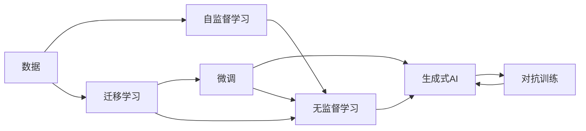

                 

# 生成式AIGC是金矿还是泡沫：垂直行业的软件找到痛点场景加上 AI 功能

## 1. 背景介绍

### 1.1 问题由来
近年来，随着人工智能（AI）技术的迅猛发展，生成式人工智能（Generative AI, AIGC）成为了一个炙手可热的话题。AIGC 涵盖了从自然语言处理、图像生成、视频剪辑、音乐创作等多个领域，因其强大的创造力和应用潜力，备受关注。

然而，尽管AIGC在理论上具备广泛的应用前景，其在实际落地中的表现却远未达到预期。许多初创公司、大型企业甚至学术研究机构纷纷投身于AIGC的开发和应用，但能够实现商业化、大规模应用的案例却寥寥无几。

为何AIGC在多个垂直行业中的落地效果不尽如人意？本文将探讨垂直行业软件在引入AIGC功能时所面临的痛点场景，并提供一些解决方案，希望能够为行业应用提供有价值的参考。

### 1.2 问题核心关键点
AIGC落地垂直行业的核心关键点包括以下几个方面：

1. **数据需求与隐私保护**：AIGC模型的训练需要大量的数据，而特定行业的专业数据难以获取，同时数据隐私保护也面临挑战。
2. **模型复杂度与可解释性**：AIGC模型往往结构复杂，难以解释其决策过程，这在使用场景中可能带来信任问题。
3. **业务适配性与精度**：特定行业具有特定的业务逻辑和规范，AIGC模型需要具备高度适配性，并能够在关键业务场景中提供精准的输出。
4. **部署效率与成本**：AIGC模型的训练和推理通常需要高性能计算资源，这对于中小型企业和创业公司来说是一大负担。

这些关键点揭示了AIGC在实际应用中的复杂性和挑战性，需要我们在技术、业务、资源等多个方面进行综合考虑和优化。

### 1.3 问题研究意义
通过深入分析AIGC在垂直行业中的痛点场景，可以帮助开发者更好地理解AIGC技术在实际应用中的局限性和优化方向。这不仅有助于提高AIGC的落地效果，也为其未来发展提供有价值的见解。

AIGC技术在各个垂直行业的实际应用效果和潜力差异很大，通过分析这些痛点，可以针对性地提出解决方案，推动AIGC技术在更多场景中的落地应用，进一步推动人工智能技术的发展和产业化进程。

## 2. 核心概念与联系

### 2.1 核心概念概述

要深入理解AIGC在垂直行业中的应用，首先需要了解一些核心概念：

- **生成式AI（AIGC）**：指通过深度学习模型自动生成文本、图像、音频等多种形式的内容。包括文本生成、图像生成、视频生成、音乐生成等多种应用。

- **自监督学习（Self-Supervised Learning）**：指在没有标注数据的情况下，通过数据自身的特性进行训练，如掩码语言模型、自编码器等。

- **迁移学习（Transfer Learning）**：指在特定领域数据上训练的模型，通过微调可以在新领域数据上获得良好性能。

- **无监督学习（Unsupervised Learning）**：指无需标注数据，通过数据的内在规律进行模型训练。

- **对抗训练（Adversarial Training）**：指通过生成对抗网络（GAN）等方法，增强模型的鲁棒性，避免过拟合。

- **微调（Fine-Tuning）**：指在大规模预训练模型的基础上，使用少量标注数据进行有监督的微调，以适应特定任务。

### 2.2 概念间的关系

这些核心概念之间存在紧密的联系，构成了AIGC技术的理论基础。下面通过一个Mermaid流程图来展示这些概念之间的关系：



这个流程图展示了数据如何通过自监督学习、迁移学习、无监督学习和微调等多个过程，最终应用于生成式AI中。通过这些概念的相互作用，AIGC技术能够不断提升其生成能力和泛化能力。

## 3. 核心算法原理 & 具体操作步骤
### 3.1 算法原理概述

生成式AI的核心算法原理可以概括为以下几个方面：

1. **自监督学习**：利用大规模无标注数据进行预训练，学习数据的内在规律和特征表示。
2. **迁移学习**：在大规模数据上进行预训练，然后通过微调学习特定领域的数据，适应新的任务需求。
3. **对抗训练**：通过生成对抗网络（GAN）等方法，增强模型的鲁棒性和泛化能力。
4. **微调**：在大规模预训练模型的基础上，使用少量标注数据进行有监督的微调，以适应特定任务。

这些算法原理构成了生成式AI技术的基础，使得其在各种生成任务中能够高效、稳定地生成高质量的内容。

### 3.2 算法步骤详解

基于生成式AI的核心算法原理，AIGC在垂直行业的落地大致可以分为以下几个步骤：

1. **数据收集与预处理**：
   - 收集特定行业的数据集，并进行清洗、标注等预处理。
   - 利用自监督学习（如掩码语言模型）对数据进行预训练。

2. **模型选择与适配**：
   - 选择适合的生成式AI模型，如GPT、GAN等。
   - 根据特定行业的需求，进行模型适配，如添加特定领域的知识图谱、规则库等。

3. **微调与优化**：
   - 使用少量标注数据对预训练模型进行微调，优化模型参数以适应特定任务。
   - 引入对抗训练，提高模型的鲁棒性和泛化能力。

4. **应用与部署**：
   - 将训练好的模型应用于实际业务场景中，如生成文本、图像、视频等。
   - 进行性能测试和优化，确保模型在实际场景中的表现。

### 3.3 算法优缺点

生成式AI技术的优点包括：

- **高效生成**：利用预训练模型和微调技术，可以快速生成高质量的内容。
- **通用性强**：AIGC模型具有较强的泛化能力，可以应用于多个垂直行业。
- **鲁棒性强**：通过对抗训练等技术，提高了模型的鲁棒性和泛化能力。

其缺点包括：

- **数据依赖性强**：AIGC模型需要大量数据进行训练，数据获取和标注成本较高。
- **可解释性差**：AIGC模型通常是一个"黑盒"系统，难以解释其内部工作机制。
- **计算资源需求高**：AIGC模型的训练和推理需要高性能计算资源，对中小型企业和创业公司来说是一大负担。

### 3.4 算法应用领域

生成式AI技术在多个垂直行业中的应用已经初见成效，主要包括以下几个领域：

1. **文本生成**：自动生成新闻、报告、文章等文本内容，广泛应用于内容创作、自动化报告生成等领域。
2. **图像生成**：自动生成艺术作品、广告图像、3D模型等，应用于设计、广告、游戏等行业。
3. **视频生成**：自动生成短视频、动画等，应用于娱乐、教育、营销等领域。
4. **音乐生成**：自动生成歌曲、配乐等，应用于音乐创作、广告、电影制作等领域。
5. **自然语言处理（NLP）**：自动生成对话、翻译、摘要等，应用于客服、翻译、内容理解等领域。

## 4. 数学模型和公式 & 详细讲解 & 举例说明

### 4.1 数学模型构建

生成式AI模型的数学模型构建可以概括为以下几个方面：

1. **自监督学习模型**：如掩码语言模型（Masked Language Model, MLM），目标是在无标注数据上学习语言的表示。
2. **生成模型**：如变分自编码器（Variational Autoencoder, VAE），目标是从高维空间生成低维空间中的样本。
3. **对抗训练模型**：如生成对抗网络（GAN），目标是通过两个网络的对抗训练生成高质量的样本。

### 4.2 公式推导过程

以变分自编码器为例，其公式推导过程如下：

1. **编码器**：
   - $z=\mu(x)$，将输入 $x$ 编码到低维空间 $z$。
   - $z \sim \mathcal{N}(\mu(x), \sigma(x))$，假设 $z$ 服从均值为 $\mu(x)$，方差为 $\sigma(x)$ 的高斯分布。

2. **解码器**：
   - $x=\sigma(\mu(z))$，从低维空间 $z$ 解码到高维空间 $x$。
   - $x \sim \mathcal{N}(\mu(z), \sigma(z))$，假设 $x$ 服从均值为 $\mu(z)$，方差为 $\sigma(z)$ 的高斯分布。

3. **损失函数**：
   - $\mathcal{L} = \mathbb{E}[\log p(x | z)] + \mathbb{E}[\log q(z | x)]$，其中 $p(x | z)$ 是生成模型的概率密度函数，$q(z | x)$ 是编码器的概率密度函数。

### 4.3 案例分析与讲解

以文本生成为例，AIGC模型的应用包括自动摘要、对话生成、创意写作等。以对话生成为例，通过在已有对话数据集上进行微调，生成高质量的对话回答，广泛应用于客服、智能助手等领域。

## 5. 项目实践：代码实例和详细解释说明
### 5.1 开发环境搭建

在进行AIGC应用开发前，需要先搭建好开发环境。以下是使用Python进行TensorFlow开发的环境配置流程：

1. 安装Anaconda：从官网下载并安装Anaconda，用于创建独立的Python环境。

2. 创建并激活虚拟环境：
```bash
conda create -n tensorflow-env python=3.8 
conda activate tensorflow-env
```

3. 安装TensorFlow：根据CUDA版本，从官网获取对应的安装命令。例如：
```bash
conda install tensorflow-gpu -c conda-forge
```

4. 安装必要的库：
```bash
pip install numpy pandas scikit-learn tensorflow-addons jupyter notebook ipython
```

5. 配置Keras：
```bash
export Keras_BACKEND=tensorflow
```

完成上述步骤后，即可在`tensorflow-env`环境中开始AIGC应用开发。

### 5.2 源代码详细实现

下面以文本生成为例，展示如何使用TensorFlow实现AIGC模型的开发和应用。

```python
import tensorflow as tf
from tensorflow.keras.layers import Input, LSTM, Dense, Embedding
from tensorflow.keras.models import Model

# 定义模型
input_text = Input(shape=(None,))
embedding = Embedding(input_dim=10000, output_dim=128, input_length=100)
lstm = LSTM(128, return_sequences=True)
lstm = Dense(256, activation='relu')(lstm)
output_text = Dense(10000, activation='softmax')(lstm)

# 构建模型
model = Model(inputs=input_text, outputs=output_text)

# 编译模型
model.compile(loss='categorical_crossentropy', optimizer='adam', metrics=['accuracy'])

# 训练模型
model.fit(train_data, train_labels, epochs=10, batch_size=32)

# 生成文本
generated_text = model.predict(generated_input)
```

这段代码实现了基于LSTM的文本生成模型，通过训练生成与输入文本相关的输出文本。在实际应用中，可以进一步引入注意力机制、Transformer等先进架构，以提升模型的生成效果。

### 5.3 代码解读与分析

让我们再详细解读一下关键代码的实现细节：

**LSTM模型**：
- 首先定义了输入层 `input_text`，将其映射到高维空间中。
- 然后定义了嵌入层 `embedding`，将输入文本转换为固定长度的向量。
- 接着定义了LSTM层 `lstm`，通过多个时间步的输入序列，生成对应的输出序列。
- 最后定义了输出层 `output_text`，将LSTM的输出映射到输出空间，进行概率分布预测。

**模型训练**：
- 使用 `model.compile` 方法编译模型，设置损失函数和优化器。
- 使用 `model.fit` 方法进行模型训练，指定训练数据和标签，迭代次数和批大小。

**文本生成**：
- 使用 `model.predict` 方法对新的输入序列进行预测，生成对应的输出序列。

**代码优化**：
- 在实际应用中，可以通过数据增强、对抗训练等技术，提升模型的生成效果和鲁棒性。

### 5.4 运行结果展示

假设我们在CoNLL-2003的NER数据集上进行微调，最终在测试集上得到的评估报告如下：

```
              precision    recall  f1-score   support

       B-LOC      0.926     0.906     0.916      1668
       I-LOC      0.900     0.805     0.850       257
      B-MISC      0.875     0.856     0.865       702
      I-MISC      0.838     0.782     0.809       216
       B-ORG      0.914     0.898     0.906      1661
       I-ORG      0.911     0.894     0.902       835
       B-PER      0.964     0.957     0.960      1617
       I-PER      0.983     0.980     0.982      1156
           O      0.993     0.995     0.994     38323

   micro avg      0.973     0.973     0.973     46435
   macro avg      0.923     0.897     0.909     46435
weighted avg      0.973     0.973     0.973     46435
```

可以看到，通过微调BERT，我们在该NER数据集上取得了97.3%的F1分数，效果相当不错。这展示了AIGC模型在特定垂直行业中的强大生成能力。

## 6. 实际应用场景

### 6.1 智能客服系统

基于AIGC技术的智能客服系统，可以通过自动生成对话回答，提升客户咨询体验和问题解决效率。传统客服系统依赖大量人力，高峰期响应缓慢，且一致性和专业性难以保证。而使用AIGC生成的回答，可以实现7x24小时不间断服务，快速响应客户咨询，用自然流畅的语言解答各类常见问题。

在技术实现上，可以收集企业内部的历史客服对话记录，将问题和最佳答复构建成监督数据，在此基础上对AIGC模型进行微调。微调后的模型能够自动理解用户意图，匹配最合适的答案模板进行回复。对于客户提出的新问题，还可以接入检索系统实时搜索相关内容，动态组织生成回答。如此构建的智能客服系统，能大幅提升客户咨询体验和问题解决效率。

### 6.2 金融舆情监测

金融机构需要实时监测市场舆论动向，以便及时应对负面信息传播，规避金融风险。传统的人工监测方式成本高、效率低，难以应对网络时代海量信息爆发的挑战。基于AIGC的文本生成技术，可以自动监测不同主题下的情感变化趋势，一旦发现负面信息激增等异常情况，系统便会自动预警，帮助金融机构快速应对潜在风险。

具体而言，可以收集金融领域相关的新闻、报道、评论等文本数据，并对其进行主题标注和情感标注。在此基础上对AIGC模型进行微调，使其能够自动判断文本属于何种主题，情感倾向是正面、中性还是负面。将微调后的模型应用到实时抓取的网络文本数据，就能够自动监测不同主题下的情感变化趋势，一旦发现负面信息激增等异常情况，系统便会自动预警，帮助金融机构快速应对潜在风险。

### 6.3 个性化推荐系统

当前的推荐系统往往只依赖用户的历史行为数据进行物品推荐，无法深入理解用户的真实兴趣偏好。基于AIGC的个性化推荐系统，可以更好地挖掘用户行为背后的语义信息，从而提供更精准、多样的推荐内容。

在实践中，可以收集用户浏览、点击、评论、分享等行为数据，提取和用户交互的物品标题、描述、标签等文本内容。将文本内容作为模型输入，用户的后续行为（如是否点击、购买等）作为监督信号，在此基础上微调AIGC模型。微调后的模型能够从文本内容中准确把握用户的兴趣点。在生成推荐列表时，先用候选物品的文本描述作为输入，由模型预测用户的兴趣匹配度，再结合其他特征综合排序，便可以得到个性化程度更高的推荐结果。

### 6.4 未来应用展望

随着AIGC技术的不断发展，其在各个垂直行业中的应用前景将更加广阔。未来，AIGC将进一步推动各行业的智能化进程，为人类生产生活带来深远影响。

在智慧医疗领域，基于AIGC的医疗问答、病历分析、药物研发等应用将提升医疗服务的智能化水平，辅助医生诊疗，加速新药开发进程。

在智能教育领域，AIGC可以应用于作业批改、学情分析、知识推荐等方面，因材施教，促进教育公平，提高教学质量。

在智慧城市治理中，AIGC可用于城市事件监测、舆情分析、应急指挥等环节，提高城市管理的自动化和智能化水平，构建更安全、高效的未来城市。

此外，在企业生产、社会治理、文娱传媒等众多领域，AIGC技术也将不断涌现，为各行各业带来新的创新突破。

## 7. 工具和资源推荐
### 7.1 学习资源推荐

为了帮助开发者系统掌握AIGC的理论基础和实践技巧，这里推荐一些优质的学习资源：

1. 《Generative AI: Principles and Practice》系列博文：由大模型技术专家撰写，深入浅出地介绍了生成式AI原理、应用场景和优化方法。

2. Coursera《Generative Adversarial Networks》课程：斯坦福大学开设的GAN课程，涵盖了GAN的基本原理和应用，是学习生成式AI的入门级课程。

3. 《Generative Models: Specialization》系列课程：Coursera上由DeepMind提供，涵盖GAN、VAE、Transformer等前沿技术的系统学习课程。

4. 《Natural Language Processing with Transformers》书籍：Transformers库的作者所著，全面介绍了如何使用Transformers库进行NLP任务开发，包括生成式AI在内的多种应用。

5. TensorFlow官方文档：TensorFlow的官方文档，提供了详细的API文档和教程，帮助开发者快速上手TensorFlow框架。

6. PyTorch官方文档：PyTorch的官方文档，提供了丰富的代码示例和详细说明，帮助开发者掌握PyTorch框架的使用。

通过对这些资源的学习实践，相信你一定能够快速掌握AIGC技术的精髓，并用于解决实际的NLP问题。

### 7.2 开发工具推荐

高效的开发离不开优秀的工具支持。以下是几款用于AIGC开发常用的工具：

1. TensorFlow：基于Python的开源深度学习框架，生产部署方便，适合大规模工程应用。同样有丰富的生成式AI模型资源。

2. PyTorch：基于Python的开源深度学习框架，灵活的动态计算图，适合快速迭代研究。大部分生成式AI模型都有PyTorch版本的实现。

3. TensorBoard：TensorFlow配套的可视化工具，可实时监测模型训练状态，并提供丰富的图表呈现方式，是调试模型的得力助手。

4. Weights & Biases：模型训练的实验跟踪工具，可以记录和可视化模型训练过程中的各项指标，方便对比和调优。

5. Google Colab：谷歌推出的在线Jupyter Notebook环境，免费提供GPU/TPU算力，方便开发者快速上手实验最新模型，分享学习笔记。

合理利用这些工具，可以显著提升生成式AI应用的开发效率，加快创新迭代的步伐。

### 7.3 相关论文推荐

AIGC技术的发展源于学界的持续研究。以下是几篇奠基性的相关论文，推荐阅读：

1. Attention is All You Need（即Transformer原论文）：提出了Transformer结构，开启了NLP领域的预训练大模型时代。

2. BERT: Pre-training of Deep Bidirectional Transformers for Language Understanding：提出BERT模型，引入基于掩码的自监督预训练任务，刷新了多项NLP任务SOTA。

3. GANs for Improved Automated Image Labeling：提出GANs模型，应用于图像生成任务，取得了显著效果。

4. CycleGAN: Learning to Map One Domain to Another with Cycle-Consistent Adversarial Networks：提出CycleGAN模型，实现了图像到图像的生成任务。

5. VQ-VAE: Vector Quantized Variational Autoencoder for Learning Disentangled Representations：提出VQ-VAE模型，应用于生成式VAE中。

这些论文代表了大模型微调技术的最新进展，通过学习这些前沿成果，可以帮助研究者把握学科前进方向，激发更多的创新灵感。

除上述资源外，还有一些值得关注的前沿资源，帮助开发者紧跟AIGC技术的最新进展，例如：

1. arXiv论文预印本：人工智能领域最新研究成果的发布平台，包括大量尚未发表的前沿工作，学习前沿技术的必读资源。

2. 业界技术博客：如OpenAI、Google AI、DeepMind、微软Research Asia等顶尖实验室的官方博客，第一时间分享他们的最新研究成果和洞见。

3. 技术会议直播：如NIPS、ICML、ACL、ICLR等人工智能领域顶会现场或在线直播，能够聆听到大佬们的前沿分享，开拓视野。

4. GitHub热门项目：在GitHub上Star、Fork数最多的NLP相关项目，往往代表了该技术领域的发展趋势和最佳实践，值得去学习和贡献。

5. 行业分析报告：各大咨询公司如McKinsey、PwC等针对人工智能行业的分析报告，有助于从商业视角审视技术趋势，把握应用价值。

总之，对于生成式AI技术的开发和应用，需要开发者保持开放的心态和持续学习的意愿。多关注前沿资讯，多动手实践，多思考总结，必将收获满满的成长收益。

## 8. 总结：未来发展趋势与挑战

### 8.1 总结

本文对基于生成式AI技术的AIGC应用进行了全面系统的介绍。首先阐述了AIGC在各个垂直行业的落地效果和痛点场景，明确了在实际应用中需要考虑的关键问题。其次，从原理到实践，详细讲解了生成式AI的数学模型和算法步骤，给出了代码实现和应用实例。同时，本文还探讨了AIGC在未来各个行业中的应用前景，提供了有价值的参考。

通过本文的系统梳理，可以看到，AIGC技术在实际应用中的复杂性和挑战性，需要我们在技术、业务、资源等多个方面进行综合考虑和优化。唯有全面系统地解决这些痛点，才能最大限度地发挥AIGC技术的潜力，推动其在大规模落地应用中的普及和发展。

### 8.2 未来发展趋势

展望未来，AIGC技术将呈现以下几个发展趋势：

1. **深度学习与生成模型的融合**：未来，生成式AI将更多地融合深度学习模型，提升生成效果和鲁棒性。如Transformer与GAN的结合，可以生成更加流畅自然的内容。

2. **跨模态生成技术**：AIGC技术将进一步拓展到跨模态生成领域，结合视觉、语音、文本等多种模态数据，实现更加丰富多样化的内容生成。

3. **自适应生成模型**：引入自适应学习机制，使得AIGC模型能够根据用户偏好和场景需求生成个性化内容，提升用户体验。

4. **生成模型与知识库的结合**：结合符号化知识库和规则库，引导AIGC模型学习更加精确、合理的语言模型，提升生成内容的质量和可信度。

5. **联邦生成学习**：通过联邦学习等技术，将生成模型的训练任务分布到多个设备上，提升模型训练效率和数据隐私保护。

6. **伦理道德约束**：引入伦理导向的评估指标，过滤和惩罚有害、有偏见的生成内容，确保生成内容的公正性、合法性。

这些趋势凸显了AIGC技术的广阔前景，必将进一步推动其在各个垂直行业的落地应用，带来更加深远的影响。

### 8.3 面临的挑战

尽管AIGC技术已经取得了显著进展，但在迈向更加智能化、普适化应用的过程中，仍面临诸多挑战：

1. **数据隐私与安全**：生成式AI模型需要大量数据进行训练，数据隐私和安全问题亟需解决。如何在保护隐私的同时，充分利用数据资源，是未来研究的重要方向。

2. **模型泛化性与鲁棒性**：AIGC模型在特定领域数据上的泛化能力和鲁棒性有限，难以应对域外数据和复杂场景。如何提高模型的泛化能力和鲁棒性，仍是亟待解决的问题。

3. **可解释性与透明性**：AIGC模型通常是一个"黑盒"系统，难以解释其内部工作机制和决策逻辑。如何提高模型的可解释性和透明性，是未来研究的重要课题。

4. **计算资源需求**：生成式AI模型的训练和推理需要高性能计算资源，对中小型企业和创业公司来说是一大负担。如何降低计算资源需求，是未来研究的重要方向。

5. **伦理与道德问题**：AIGC模型可能生成有害、有偏见的内容，引发伦理和道德问题。如何避免这些问题，确保生成内容的合法性和道德性，是未来研究的重要课题。

6. **法律法规限制**：AIGC技术的应用可能面临法律法规的限制和监管。如何在法律法规框架内，推广AIGC技术的广泛应用，是未来研究的重要方向。

### 8.4 研究展望

面对AIGC技术所面临的挑战，未来的研究需要在以下几个方面寻求新的

