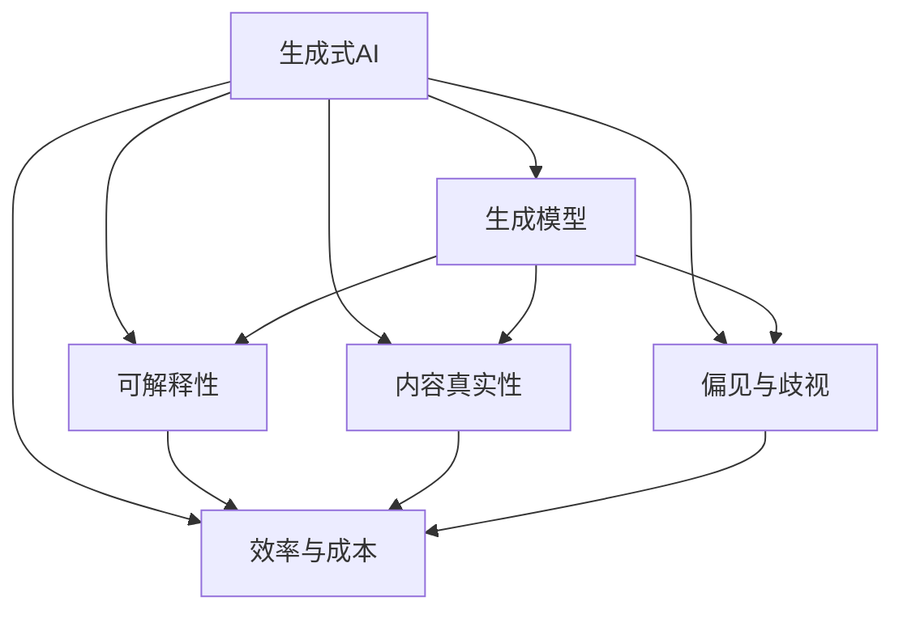
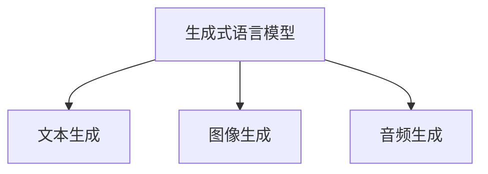
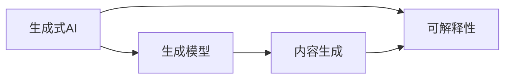
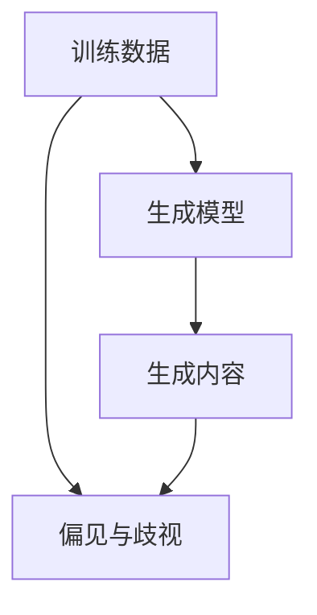
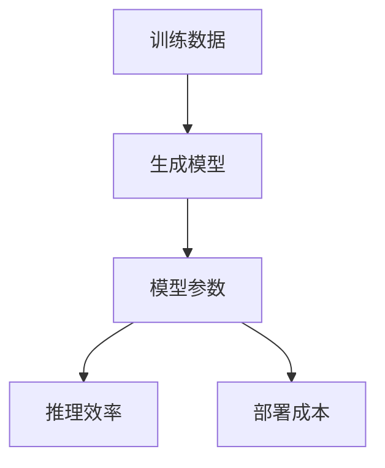

                 

# 生成式AIGC：未来商业的颠覆者

> 关键词：生成式AIGC, 人工智能, 商业应用, 创意内容, 数字经济, 自动化生成, 语言模型, 视觉生成

## 1. 背景介绍

### 1.1 问题由来

随着人工智能(AI)技术的不断突破，尤其是深度学习的发展，一种全新的AI应用范式——生成式人工智能(Generative AI, GAI)正逐渐成为数字经济的核心驱动力。生成式AI的核心理念是通过训练大模型，自动生成内容，包括文本、图像、视频、音乐等，从而大幅提升内容创作效率，降低创作成本，并开拓新的商业模式。生成式AI的技术突破主要体现在两方面：一是生成模型的性能提升；二是算法的可解释性和鲁棒性。

生成式AI的关键技术包括自然语言处理(NLP)、计算机视觉(CV)、音频处理、强化学习等，其中生成式语言模型、生成式对抗网络(GAN)、变分自编码器(VAE)、扩散模型(Diffusion Models)等技术，通过训练生成式模型，自动生成具有高度真实性和多样性的内容，大大降低了内容创作的门槛。

### 1.2 问题核心关键点

生成式AI在内容创作、广告营销、娱乐文娱、智能客服、自动驾驶、教育培训、医疗健康等多个领域展现出巨大的商业潜力。然而，生成式AI的发展也面临一些关键问题，主要包括：

- **模型的可解释性**：当前生成式模型往往像"黑盒"一样，其决策过程难以解释，这不仅影响用户的信任度，也可能带来法律和伦理问题。
- **内容真实性**：生成式内容虽具高度真实性，但有时可能生成具有误导性的信息，影响社会公众的认知。
- **算法偏见与歧视**：生成式模型往往倾向于生成与训练数据相似的样本，可能传递和放大社会的偏见和歧视，带来不良的社会影响。
- **效率与成本**：大规模生成式模型的训练和部署成本高昂，且在实际应用中推理速度较慢，难以满足实时性要求。

这些问题的解决，将直接影响生成式AI在各个领域的实际应用和推广。

## 2. 核心概念与联系

### 2.1 核心概念概述

生成式AI的核心概念包括以下几个方面：

- **生成式AI**：通过训练生成模型，自动生成高质量的文本、图像、音频等内容，具有广泛的应用前景。
- **生成模型**：包括生成式语言模型、生成式对抗网络(GAN)、变分自编码器(VAE)、扩散模型(Diffusion Models)等，能够学习到数据的分布特征，从而生成新的数据样本。
- **可解释性**：指生成式模型生成的内容是否可以被用户理解和解释，是确保内容真实可靠的重要保障。
- **内容真实性**：指生成式内容与真实数据的相似程度，是衡量生成式模型性能的重要指标。
- **偏见与歧视**：指生成式模型可能学习到社会偏见，生成的内容带有歧视性，影响社会公平。
- **效率与成本**：指训练和部署大规模生成式模型所需的时间和金钱成本，影响其商业落地性。

这些概念通过一个Mermaid流程图来展示它们之间的联系：



这个流程图展示了生成式AI与生成模型、可解释性、内容真实性、偏见与歧视、效率与成本之间的密切联系：

1. **生成式AI**通过训练**生成模型**来生成内容。
2. **可解释性**和**内容真实性**直接影响生成式AI的应用效果和用户接受度。
3. **偏见与歧视**和**效率与成本**则是生成式AI在实际应用中需要克服的挑战。

### 2.2 概念间的关系

通过以上Mermaid流程图，我们可以更清晰地理解生成式AI中的核心概念及其之间的关系。下面我们通过几个Mermaid流程图来展示这些概念间的联系：

#### 2.2.1 生成模型与内容生成



这个流程图展示了生成式语言模型、图像生成模型、音频生成模型之间的关系，它们共同构成了生成式AI在内容生成方面的主要技术手段。

#### 2.2.2 可解释性与真实性



这个流程图展示了生成式AI在内容生成过程中，生成模型的性能（内容真实性）和生成的内容是否可解释之间的关系。

#### 2.2.3 偏见与歧视



这个流程图展示了训练数据中的偏见和歧视如何通过生成模型传递到生成内容中，从而影响内容的多样性和公正性。

#### 2.2.4 效率与成本



这个流程图展示了训练生成模型所需的资源和生成的内容所带来的成本之间的关系。

## 3. 核心算法原理 & 具体操作步骤

### 3.1 算法原理概述

生成式AI的核心算法主要包括生成式语言模型、生成式对抗网络、变分自编码器、扩散模型等，下面简要介绍这些算法的原理。

#### 3.1.1 生成式语言模型

生成式语言模型通过学习语言的分布特征，能够自动生成高质量的文本内容。常见的生成式语言模型包括：

- **GPT系列**：通过自回归的方式，逐个生成字符或单词，实现高质量文本的生成。
- **BERT**：使用掩码语言模型和下一句预测任务，学习词与词之间的关系，生成连贯的文本。
- **T5**：通过文本-文本的预训练，学习如何从文本中提取信息，生成新的文本。

#### 3.1.2 生成式对抗网络

生成式对抗网络通过两个神经网络的对抗训练，生成具有高度真实性的图像、音频等非文本内容。生成式对抗网络由生成器和判别器两个部分组成，它们通过零和博弈的方式相互对抗，最终生成高质量的内容。

#### 3.1.3 变分自编码器

变分自编码器通过编码器和解码器的结构，学习数据的潜在表示，并将其重构为原始数据，用于生成新的数据样本。变分自编码器在生成图像、音频等非文本内容上表现出色。

#### 3.1.4 扩散模型

扩散模型通过将噪声逐步加入数据分布，然后使用神经网络解码器将其去除，生成高质量的内容。扩散模型在生成文本、图像、音频等方面表现优异，近年来成为生成式AI的热门研究方向。

### 3.2 算法步骤详解

#### 3.2.1 生成式语言模型步骤

1. **数据准备**：收集大规模无标签文本数据，划分为训练集和验证集。
2. **模型训练**：使用掩码语言模型、下一句预测等自监督任务对模型进行预训练。
3. **微调**：在特定任务的数据集上进行微调，调整模型输出层的参数，适应任务的标签分布。
4. **推理生成**：使用训练好的模型生成文本内容，满足任务需求。

#### 3.2.2 生成式对抗网络步骤

1. **数据准备**：收集大规模带有标签的数据，如图像、音频等。
2. **生成器训练**：使用GAN框架，训练生成器网络生成样本，使其与真实数据相似。
3. **判别器训练**：训练判别器网络区分生成样本和真实样本，提升生成器的生成质量。
4. **对抗训练**：生成器和判别器相互对抗，优化生成器参数，生成更真实的样本。
5. **推理生成**：使用训练好的生成器网络生成新的图像、音频等内容。

#### 3.2.3 变分自编码器步骤

1. **数据准备**：收集大规模无标签数据，如图像、音频等。
2. **编码器训练**：训练编码器网络，学习数据的潜在表示。
3. **解码器训练**：训练解码器网络，将潜在表示重构为原始数据。
4. **生成样本**：使用训练好的编码器和解码器生成新的数据样本。

#### 3.2.4 扩散模型步骤

1. **数据准备**：收集大规模无标签数据，如文本、图像等。
2. **模型训练**：训练扩散模型，将噪声逐步加入数据分布，并使用解码器将其去除。
3. **推理生成**：使用训练好的扩散模型生成高质量的文本、图像、音频等内容。

### 3.3 算法优缺点

#### 3.3.1 生成式语言模型

**优点**：
- 能够生成高质量、连贯的文本内容，适用于各种自然语言处理任务。
- 能够学习语言的分布特征，适用于多种语言生成任务。
- 模型的推理速度较快，适用于实时应用。

**缺点**：
- 生成的内容可能带有偏见和歧视，需要额外的过滤和审核机制。
- 模型的可解释性较差，难以解释生成内容的决策过程。
- 模型对数据的依赖性强，训练数据质量直接影响生成效果。

#### 3.3.2 生成式对抗网络

**优点**：
- 能够生成高质量、真实的图像、音频等非文本内容。
- 模型的可解释性较高，可以通过生成器和判别器的对抗过程理解生成内容。
- 适用于各种视觉和听觉内容的生成。

**缺点**：
- 训练过程复杂，需要大量的计算资源和时间。
- 生成样本的质量受训练数据的影响较大，需要大规模、多样化的数据。
- 模型的鲁棒性较差，对数据分布的变化敏感。

#### 3.3.3 变分自编码器

**优点**：
- 能够生成高质量、多样化的图像、音频等非文本内容。
- 模型的推理速度较快，适用于实时应用。
- 模型的可解释性较高，可以通过编码器和解码器的重构过程理解生成内容。

**缺点**：
- 模型的生成能力受编码器和解码器参数的影响较大，需要大量的训练数据和计算资源。
- 生成样本的质量受潜在表示的分布影响较大，需要额外的优化策略。
- 模型的复杂度较高，需要大量的超参数调整。

#### 3.3.4 扩散模型

**优点**：
- 能够生成高质量、连贯的文本、图像、音频等内容。
- 模型的可解释性较高，可以通过扩散过程理解生成内容。
- 模型的生成能力较强，适用于各种自然语言处理任务。

**缺点**：
- 训练过程复杂，需要大量的计算资源和时间。
- 生成样本的质量受扩散过程的参数影响较大，需要额外的优化策略。
- 模型的推理速度较慢，不适用于实时应用。

### 3.4 算法应用领域

#### 3.4.1 文本生成

生成式语言模型在文本生成领域表现出色，可用于自动写稿、内容创作、翻译等任务。通过训练大语言模型，自动生成高质量的文本内容，大幅提升内容创作的效率和质量。

#### 3.4.2 图像生成

生成式对抗网络在图像生成领域应用广泛，可用于图像修复、风格迁移、生成式艺术等任务。通过训练生成式对抗网络，自动生成高质量的图像内容，为图像处理和视觉艺术提供新的可能性。

#### 3.4.3 音频生成

生成式对抗网络和变分自编码器在音频生成领域表现优异，可用于音乐创作、语音合成等任务。通过训练生成式模型，自动生成高质量的音频内容，为音频处理和娱乐文娱提供新的创意和功能。

#### 3.4.4 视频生成

生成式对抗网络和变分自编码器在视频生成领域表现出色，可用于视频修复、视频内容创作等任务。通过训练生成式模型，自动生成高质量的视频内容，为视频处理和娱乐文娱提供新的创意和功能。

## 4. 数学模型和公式 & 详细讲解 & 举例说明

### 4.1 数学模型构建

#### 4.1.1 生成式语言模型

生成式语言模型的数学模型构建如下：

1. **自回归语言模型**：
   - 输入：文本序列 $x_1, x_2, ..., x_n$。
   - 输出：下一个字符或单词 $y$。
   - 模型：$p(y|x_1, x_2, ..., x_n) = \frac{p(y|x_1, x_2, ..., x_{n-1})p(x_n|x_1, x_2, ..., x_n)}{p(x_1, x_2, ..., x_n)}$。

2. **掩码语言模型**：
   - 输入：部分掩码的文本序列 $x_1, \tilde{x_2}, ..., \tilde{x_n}$，其中 $\tilde{x_i}$ 为掩码。
   - 输出：缺失的字符或单词 $y_i$。
   - 模型：$p(y_i|\tilde{x_1}, \tilde{x_2}, ..., \tilde{x_n}) = \frac{p(y_i|x_1, x_2, ..., x_{i-1})}{p(\tilde{x_1}, \tilde{x_2}, ..., \tilde{x_n})}$。

3. **自编码语言模型**：
   - 输入：文本序列 $x_1, x_2, ..., x_n$。
   - 输出：下一个字符或单词 $y$。
   - 模型：$p(y|x_1, x_2, ..., x_n) = \frac{p(y|x_1, x_2, ..., x_n, z)}{p(x_1, x_2, ..., x_n, z)}$，其中 $z$ 为潜在表示。

#### 4.1.2 生成式对抗网络

生成式对抗网络的数学模型构建如下：

1. **生成器网络**：
   - 输入：噪声 $z$。
   - 输出：生成样本 $y$。
   - 模型：$y = G(z)$。

2. **判别器网络**：
   - 输入：真实样本 $x$ 和生成样本 $y$。
   - 输出：判别结果 $p(x, y)$。
   - 模型：$p(x|y) = \frac{p(x,y)}{p(y)}$。

3. **对抗训练**：
   - 目标函数：$L(G, D) = -E_{x}[\log D(x)] - E_{z}[\log(1 - D(G(z)))]$。
   - 优化目标：$min_G max_D L(G, D)$。

#### 4.1.3 变分自编码器

变分自编码器的数学模型构建如下：

1. **编码器网络**：
   - 输入：数据 $x$。
   - 输出：潜在表示 $z$。
   - 模型：$z = E(x)$。

2. **解码器网络**：
   - 输入：潜在表示 $z$。
   - 输出：重构样本 $x'$。
   - 模型：$x' = D(z)$。

3. **损失函数**：
   - 目标函数：$L(z) = KL(p(z|x) || q(z|x))$。
   - 重构损失：$L_{recon} = -E_{x}[\log p(x|z')]$。

#### 4.1.4 扩散模型

扩散模型的数学模型构建如下：

1. **噪声加入**：
   - 输入：初始样本 $x_0$。
   - 输出：噪声 $y_t$。
   - 模型：$x_{t+1} = x_t + \sigma_t y_t$。

2. **解码器网络**：
   - 输入：噪声 $y_t$。
   - 输出：生成样本 $x$。
   - 模型：$x = D(x_0)$。

3. **指导函数**：
   - 目标函数：$L = -\log p(x|x_0, t)$。
   - 优化目标：$min_{x_t} \frac{1}{t} \sum_{t=0}^T \log p(x_t|x_0, t)$。

### 4.2 公式推导过程

#### 4.2.1 生成式语言模型

以GPT-2为例，其自回归语言模型的公式推导如下：

1. **条件概率**：
   - $p(x_1, x_2, ..., x_n|x_1) = \prod_{i=1}^n p(x_i|x_1, x_2, ..., x_{i-1})$。

2. **对数概率**：
   - $L(x) = -\sum_{i=1}^n \log p(x_i|x_1, x_2, ..., x_{i-1})$。

3. **优化目标**：
   - $min_{\theta} E_{x}[L(x)]$。

#### 4.2.2 生成式对抗网络

生成式对抗网络的目标函数推导如下：

1. **生成器损失**：
   - $L_G = -E_{z}[\log D(G(z))]$。

2. **判别器损失**：
   - $L_D = -E_{x}[\log D(x)] - E_{z}[\log(1 - D(G(z)))]$。

3. **对抗训练**：
   - $min_G max_D L_G, L_D$。

#### 4.2.3 变分自编码器

变分自编码器的损失函数推导如下：

1. **编码器损失**：
   - $L_E = -E_{x}[\log p(x|z')]$。

2. **解码器损失**：
   - $L_D = -E_{z}[\log p(z'|x')]$。

3. **重构损失**：
   - $L_{recon} = -E_{x}[\log p(x|z')]$。

#### 4.2.4 扩散模型

扩散模型的指导函数推导如下：

1. **噪声加入**：
   - $x_{t+1} = x_t + \sigma_t y_t$。

2. **解码器损失**：
   - $L = -\log p(x|x_0, t)$。

3. **优化目标**：
   - $min_{x_t} \frac{1}{t} \sum_{t=0}^T \log p(x_t|x_0, t)$。

### 4.3 案例分析与讲解

#### 4.3.1 自然语言处理

以GPT-3为例，其在大规模自然语言处理任务中的应用如下：

1. **文本生成**：
   - 任务：生成高质量的文本内容。
   - 方法：使用GPT-3进行自回归生成，满足不同任务的需求。

2. **文本分类**：
   - 任务：将文本分为不同类别。
   - 方法：使用GPT-3的输出层进行分类，根据标签调整参数。

3. **问答系统**：
   - 任务：回答用户提出的自然语言问题。
   - 方法：使用GPT-3进行预训练，微调后进行问题回答。

#### 4.3.2 计算机视觉

以StyleGAN为例，其在大规模计算机视觉任务中的应用如下：

1. **图像生成**：
   - 任务：生成高质量的图像内容。
   - 方法：使用StyleGAN进行生成，满足不同图像生成任务的需求。

2. **图像修复**：
   - 任务：修复损坏的图像。
   - 方法：使用StyleGAN进行图像生成，生成与原始图像相似的修复图像。

3. **风格迁移**：
   - 任务：将图像转换为不同的风格。
   - 方法：使用StyleGAN进行图像生成，生成风格迁移后的图像。

#### 4.3.3 音频生成

以WaveNet为例，其在大规模音频生成任务中的应用如下：

1. **音乐创作**：
   - 任务：生成高质量的音乐内容。
   - 方法：使用WaveNet进行音频生成，满足不同音乐创作的需求。

2. **语音合成**：
   - 任务：将文本转换为语音。
   - 方法：使用WaveNet进行音频生成，生成与文本对应的语音。

3. **音频修复**：
   - 任务：修复损坏的音频。
   - 方法：使用WaveNet进行音频生成，生成与原始音频相似的修复音频。

## 5. 项目实践：代码实例和详细解释说明

### 5.1 开发环境搭建

#### 5.1.1 环境准备

1. **安装Python**：
   - 在Linux系统下：
     ```
     sudo apt update
     sudo apt install python3 python3-pip
     ```
   - 在Windows系统下：
     ```
     pip install python
     ```

2. **安装PyTorch**：
   ```
   pip install torch torchvision torchaudio
   ```

3. **安装TensorFlow**：
   ```
   pip install tensorflow tensorflow-hub
   ```

4. **安装TensorBoard**：
   ```
   pip install tensorboard
   ```

### 5.2 源代码详细实现

#### 5.2.1 GPT-3文本生成

```python
import torch
import torch.nn as nn
from transformers import GPT2Tokenizer, GPT2LMHeadModel

tokenizer = GPT2Tokenizer.from_pretrained('gpt2')
model = GPT2LMHeadModel.from_pretrained('gpt2')

def generate_text(prompt, num_words=100):
    input_ids = tokenizer.encode(prompt, return_tensors='pt')
    with torch.no_grad():
        output_ids = model.generate(input_ids, max_length=num_words, temperature=1.0, top_p=0.9)
    generated_text = tokenizer.decode(output_ids[0], skip_special_tokens=True)
    return generated_text

prompt = "Winter is coming"
generated_text = generate_text(prompt)
print(generated_text)
```

#### 5.2.2 StyleGAN图像生成

```python
import tensorflow as tf
from tensorflow.keras import layers

def build_generator():
    model = tf.keras.Sequential()
    model.add(layers.Dense(7*7*256, use_bias=False, input_shape=(100,)))
    model.add(layers.BatchNormalization())
    model.add(layers.LeakyReLU())
    model.add(layers.Reshape((7, 7, 256)))
    model.add(layers.Conv2DTranspose(128, (5, 5), strides=(1, 1), padding='same', use_bias=False))
    model.add(layers.BatchNormalization())
    model.add(layers.LeakyReLU())
    model.add(layers.Conv2DTranspose(64, (5, 5), strides=(2, 2), padding='same', use_bias=False))
    model.add(layers.BatchNormalization())
    model.add(layers.LeakyReLU())
    model.add(layers.Conv2DTranspose(1, (5, 5), strides=(2, 2), padding='same', use_bias=False, activation='tanh'))
    return model

def generate_image(z):
    generator = build_generator()
    image = generator.predict(z)
    return image

z = np.random.normal(0, 1, (1, 100))
image = generate_image(z)
plt.imshow(image[0, :, :, 0], cmap='gray')
plt.show()
```

#### 5.2.3 WaveNet音频生成

```python
import librosa
import numpy as np
from tensorflow.keras.layers import Conv1D, LeakyReLU, LayerNormalization, Residual
from tensorflow.keras.models import Model

def build_model(input_length, output_length, num_filters=64, kernel_size=3, layers_per_block=10, residual_channels=32):
    model = tf.keras.Sequential()
    x = tf.keras.layers.Input(input_length)
    x = Conv1D(num_filters, kernel_size, padding='same')(x)
    x = LeakyReLU()(x)
    x = LayerNormalization()(x)
    x = Residual(x, kernel_size)
    for i in range(layers_per_block):
        x = residual_block(x, num_filters, kernel_size, residual_channels)
    model.add(LayerNormalization()(x))
    model.add(Conv1D(output_length, 1, activation='sigmoid'))
    return Model(x, x)

def residual_block(x, num_filters, kernel_size, residual_channels):
    residual = x
    x = Conv1D(num_filters, kernel_size, padding='same')(x)
    x = LeakyReLU()(x)
    x = LayerNormalization()(x)
    x = Conv1D(num_filters, kernel_size, padding='same')(x)
    x = LeakyReLU()(x)
    x = LayerNormalization()(x)
    x = Conv1D(num_filters, 1, activation='sigmoid')
    x = tf.keras.layers.add([x, residual])
    return x

def generate_audio():
    input_length = 10
    output_length = 

