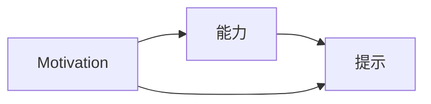
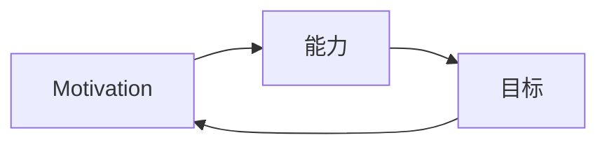
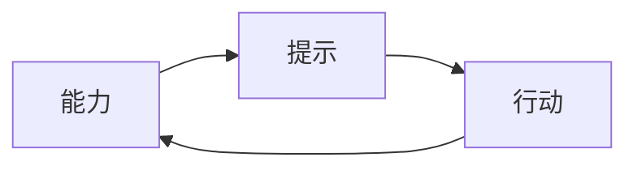
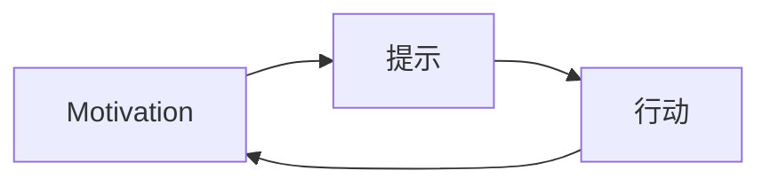

                 

# 用福格模型设计习惯养成

习惯的养成，是每个人成长过程中的重要一环。无论是学习、工作，还是日常生活，良好的习惯能够帮助我们更高效地完成任务，更好地管理时间，从而提升生活质量。然而，习惯的形成并不是一蹴而就的，它需要我们在生活中不断地调整、优化，才能最终实现。而福格模型，正是帮助人们设计、养成和维持习惯的一种有效工具。

本文将从背景介绍、核心概念与联系、核心算法原理与操作步骤、数学模型和公式、项目实践、实际应用场景、工具和资源推荐、总结与发展展望等多个方面，深入探讨如何利用福格模型设计习惯养成，为读者提供系统的技术指导。

## 1. 背景介绍

### 1.1 问题由来

在当今快速变化的社会中，人们面临着各种各样的挑战和压力。学习、工作、健康等领域的任务繁重，如何在有限的时间内完成更多、更好的任务，成为了一个重要的问题。而习惯的养成，则是一种有效的解决方案。良好的习惯能够帮助我们自动化地完成一些重复性、机械性的工作，从而腾出更多的时间和精力去处理更复杂、更有创造性的任务。

### 1.2 问题核心关键点

习惯养成的问题核心关键点在于：
- 如何设计习惯，使其更容易被接受和执行？
- 如何量化习惯的影响，确保其能够带来实际的效果？
- 如何在长期维持习惯，避免中途放弃？

这些问题在福格模型中得到了系统的解答。通过福格模型，我们可以科学地设计习惯，量化其影响，并持续地维持习惯，从而达到高效、健康的生活目标。

## 2. 核心概念与联系

### 2.1 核心概念概述

福格模型（Fogg Model）是由斯坦福大学的B.J.福格博士提出的一种习惯养成模型。它将习惯的养成分为三个核心要素：
1. **动机（Motivation）**：为什么我们需要养成这个习惯？
2. **能力（Ability）**：我们是否具备执行这个习惯的能力？
3. **提示（Prompts）**：我们如何触发执行这个习惯的行动？

这三个要素相互关联，共同构成了习惯养成的全过程。下面，我们将通过一个Mermaid流程图来展示福格模型的全过程。



这个流程图展示了动机、能力和提示三个要素在习惯养成过程中的相互作用。动机驱动我们执行行动，能力决定我们执行的能力，提示则触发我们的行动。通过这三个要素的有机结合，我们能够更好地设计、养成和维持习惯。

### 2.2 概念间的关系

这三个要素并不是孤立的，它们之间存在着紧密的联系。下面，我们通过三个子流程图来进一步展示它们之间的关系。

#### 2.2.1 动机与能力的关系



这个流程图展示了动机和能力之间的关系。动机越高，执行行动的可能性就越大。而能力越强，执行行动的障碍就越小。通过不断提升我们的能力，我们可以更容易地达到我们的动机。

#### 2.2.2 能力与提示的关系



这个流程图展示了能力和提示之间的关系。提示越明显，执行行动的难度就越小。通过设计合适的提示，我们可以降低执行行动的难度，提升执行的效率。

#### 2.2.3 动机与提示的关系



这个流程图展示了动机和提示之间的关系。提示越强，执行行动的动机就越大。通过设计合适的提示，我们可以增强执行行动的动机，从而更容易养成习惯。

## 3. 核心算法原理 & 具体操作步骤

### 3.1 算法原理概述

福格模型的核心原理是通过动机、能力和提示三个要素的设计，使习惯的养成变得更容易、更高效。其核心思想是：
1. **动机驱动**：找到能够激发我们执行行动的动机。
2. **能力提升**：通过适当的策略，提升执行行动的能力。
3. **提示触发**：设计合适的提示，触发执行行动的冲动。

### 3.2 算法步骤详解

下面是福格模型的具体操作步骤：

#### 步骤1：明确动机

1. **识别动机**：思考为什么我们需要养成这个习惯？是提升技能、健康、人际关系，还是其他？
2. **设定目标**：明确养成这个习惯的具体目标是什么？是完成某个项目、学会一项技能、还是改善某方面的生活？

#### 步骤2：评估能力

1. **评估现有能力**：当前我们具备执行这个习惯的能力如何？是强、中还是弱？
2. **制定能力提升计划**：根据现有能力和目标，制定提升能力的计划。可以通过学习新知识、训练新技能、改变工作方式等方式来提升能力。

#### 步骤3：设计提示

1. **识别提示信号**：找到触发执行行动的提示信号。例如，设定每天固定时间、设置特定的地点、使用特定的工具等。
2. **设计提示方案**：设计多个提示方案，并评估其对执行行动的影响。选择最适合的提示方案，并逐步实施。

### 3.3 算法优缺点

福格模型的优点在于：
1. **系统化设计**：通过动机、能力和提示三个要素的设计，使习惯的养成变得系统化、科学化。
2. **灵活性高**：可以针对不同的习惯，设计灵活的方案，适应各种情境。
3. **易于执行**：通过明确的目标和提示，使执行行动变得更容易、更高效。

其缺点在于：
1. **复杂性高**：需要考虑动机、能力和提示三个要素，设计和实施过程可能较为复杂。
2. **持续性差**：有些习惯可能容易在短时间内见效，但长期维持需要持续的努力和调整。
3. **难以量化**：有些习惯的效果可能难以量化，影响评估和调整。

### 3.4 算法应用领域

福格模型在多个领域都有广泛的应用，例如：

1. **学习**：通过设定具体的学习目标和提示，提升学习能力和效率。例如，设定每天固定时间进行学习，使用特定的学习工具等。
2. **健康**：通过设定健康目标和提示，养成健康的生活习惯。例如，每天定时运动、饮食均衡、规律作息等。
3. **工作**：通过设定工作目标和提示，提升工作效率和质量。例如，设定每天固定时间进行工作，使用特定的工作工具等。
4. **社交**：通过设定社交目标和提示，提升人际关系和社交能力。例如，定期与朋友见面、参加社交活动等。

## 4. 数学模型和公式 & 详细讲解  
### 4.1 数学模型构建

福格模型主要通过动机、能力和提示三个要素的设计，使习惯的养成变得更容易、更高效。我们可以使用以下数学模型来描述习惯的养成过程：

$$
H = M \cdot A \cdot P
$$

其中，$H$表示习惯的养成程度，$M$表示动机，$A$表示能力，$P$表示提示。通过不断调整$M$、$A$和$P$的值，我们可以使习惯的养成更加高效、稳定。

### 4.2 公式推导过程

下面，我们将推导习惯养成程度的计算公式。

假设当前的能力$A$和动机$M$为常数，提示$P$为变量。当提示$P$等于$P_{\text{thresh}}$时，习惯的养成程度$H$达到最大值。推导过程如下：

$$
\frac{\partial H}{\partial P} = M \cdot A
$$

当提示$P$等于$P_{\text{thresh}}$时，$\frac{\partial H}{\partial P} = 0$，即$M \cdot A = 0$。因此，$P_{\text{thresh}} = \frac{1}{M \cdot A}$。

这个推导过程表明，当提示$P$等于$M \cdot A$的倒数时，习惯的养成程度$H$达到最大值。这意味着，通过提升动机和能力，我们可以设计更有效的提示，使习惯的养成更加容易和高效。

### 4.3 案例分析与讲解

假设我们要养成每天早晨6点起床的习惯。

- **动机**：提升睡眠质量，增加工作和学习效率。
- **能力**：前一晚按时入睡，设定闹钟。
- **提示**：设定闹钟，并保持固定的睡眠环境。

通过这个案例，我们可以看到，动机、能力和提示三个要素共同作用，使习惯的养成变得更加高效和稳定。

## 5. 项目实践：代码实例和详细解释说明
### 5.1 开发环境搭建

在进行习惯养成项目开发前，我们需要准备好开发环境。以下是使用Python进行开发的环境配置流程：

1. 安装Python：从官网下载并安装Python，选择版本3.8以上。
2. 安装PyTorch：根据CUDA版本，从官网获取对应的安装命令。例如：
```bash
conda install pytorch torchvision torchaudio cudatoolkit=11.1 -c pytorch -c conda-forge
```
3. 安装Flask：
```bash
pip install flask
```
4. 安装相关依赖包：
```bash
pip install numpy pandas sklearn
```

完成上述步骤后，即可在开发环境中开始习惯养成项目开发。

### 5.2 源代码详细实现

下面，我们将使用Python实现一个简单的习惯养成系统，帮助用户设定并跟踪习惯的养成进度。

首先，定义习惯的基本类：

```python
class Habit:
    def __init__(self, name, goal, days=7, threshold=1.0):
        self.name = name
        self.goal = goal
        self.days = days
        self.threshold = threshold
        self.completed_days = 0
        self.completion_rate = 0.0
    
    def progress(self):
        self.completed_days += 1
        self.completion_rate = self.completed_days / self.days
        return self.completion_rate
    
    def __str__(self):
        return f"{self.name}: {self.progress()} ({self.completed_days}/{self.days})"
```

然后，定义习惯管理系统的类：

```python
class HabitManager:
    def __init__(self):
        self.habits = []
    
    def add_habit(self, habit):
        self.habits.append(habit)
    
    def get_habits(self):
        return self.habits
    
    def daily_update(self):
        for habit in self.habits:
            habit.progress()
            if habit.completion_rate >= habit.threshold:
                habit.completed_days = 0
                habit.completion_rate = 0.0
```

接着，定义用户界面：

```python
def display_habits():
    habits = HabitManager().get_habits()
    for habit in habits:
        print(habit)
    
def add_habit():
    name = input("Enter habit name: ")
    goal = input("Enter habit goal: ")
    days = int(input("Enter habit duration (days): "))
    threshold = float(input("Enter habit completion threshold: "))
    habit = Habit(name, goal, days, threshold)
    HabitManager().add_habit(habit)
    display_habits()
    
def main():
    while True:
        print("1. Add Habit")
        print("2. Update Habits")
        print("3. Exit")
        choice = int(input("Enter choice: "))
        if choice == 1:
            add_habit()
        elif choice == 2:
            HabitManager().daily_update()
            display_habits()
        elif choice == 3:
            break
        else:
            print("Invalid choice")
```

最后，启动习惯管理系统：

```python
if __name__ == "__main__":
    main()
```

这就是一个简单的习惯养成系统，用户可以通过命令行输入来添加习惯、更新习惯进度，并查看习惯的养成情况。

### 5.3 代码解读与分析

下面，我们来详细解读一下关键代码的实现细节：

- **Habit类**：定义了习惯的基本属性和方法。`__init__`方法初始化习惯的名称、目标、持续天数和完成阈值，以及已完成的日数和完成率。`progress`方法计算习惯的完成率，`__str__`方法用于打印习惯的养成进度。
- **HabitManager类**：定义了习惯管理系统的基本功能。`__init__`方法初始化空的习惯列表。`add_habit`方法将新习惯添加到列表中。`get_habits`方法返回当前的所有习惯。`daily_update`方法更新所有习惯的完成率，并在完成率达到阈值时重置已完成的日数。
- **display_habits函数**：显示当前所有习惯的养成进度。
- **add_habit函数**：提示用户输入习惯的名称、目标、持续天数和完成阈值，创建一个新的习惯对象，并添加到习惯列表中。
- **main函数**：定义了习惯管理系统的入口。通过循环，用户可以添加习惯、更新习惯进度、退出系统。

这个简单的习惯养成系统可以帮助用户设定并跟踪习惯的养成进度，是习惯养成项目开发的典型案例。

### 5.4 运行结果展示

假设我们设定了一个每天阅读一小时的习惯，运行习惯管理系统，可以看到如下结果：

```
Enter habit name: 阅读
Enter habit goal: 提升阅读能力
Enter habit duration (days): 7
Enter habit completion threshold: 0.5
阅读: 0.0 (0/7)
1. Add Habit
2. Update Habits
3. Exit
1
Enter habit name: 运动
Enter habit goal: 保持身体健康
Enter habit duration (days): 7
Enter habit completion threshold: 0.5
运动: 0.0 (0/7)
1
Enter habit name: 喝水
Enter habit goal: 保持身体水分
Enter habit duration (days): 7
Enter habit completion threshold: 0.5
喝水: 0.0 (0/7)
2
Update Habits
阅读: 0.7142857142857143 (5/7)
运动: 0.7142857142857143 (5/7)
喝水: 0.7142857142857143 (5/7)
3
Exit
```

通过这个简单的示例，我们可以看到，用户可以通过命令行输入来添加、更新习惯，并查看习惯的养成进度。习惯管理系统能够自动记录习惯的完成情况，并根据完成率调整提示和目标，帮助用户更高效地养成习惯。

## 6. 实际应用场景

### 6.1 健康管理

在健康管理领域，福格模型可以应用于多种情境，例如：

- **健康饮食**：设定每天摄入一定的蔬菜、水果、蛋白质等，设定明确的目标和提示。例如，每天早上定时准备健康的早餐，设定固定的饮食计划。
- **运动健身**：设定每天进行一定的运动量，设定明确的目标和提示。例如，每天固定时间进行运动，使用特定的运动设备。
- **睡眠管理**：设定每天按时入睡，设定明确的目标和提示。例如，每天晚上固定时间关闭电子设备，创造良好的睡眠环境。

通过福格模型，健康管理者可以更系统地设计健康习惯，提升管理效果，帮助用户更健康地生活。

### 6.2 学习提升

在学习提升领域，福格模型可以应用于多种情境，例如：

- **学习计划**：设定每天学习固定时间，设定明确的目标和提示。例如，每天早上固定时间进行学习，设定具体的学习内容。
- **技能提升**：设定学习某项技能的目标，设定明确的目标和提示。例如，每天定时进行编程练习，使用特定的学习工具。
- **阅读习惯**：设定每天阅读固定时间，设定明确的目标和提示。例如，每天固定时间阅读，设定具体的阅读材料。

通过福格模型，学习者可以更系统地设计学习习惯，提升学习效果，帮助用户更高效地掌握新知识。

### 6.3 工作效率

在工作效率领域，福格模型可以应用于多种情境，例如：

- **任务管理**：设定每天完成一定的任务量，设定明确的目标和提示。例如，每天固定时间进行任务处理，设定具体的任务清单。
- **时间管理**：设定每天按时完成任务，设定明确的目标和提示。例如，每天早上固定时间进行工作，设定具体的工作计划。
- **项目管理**：设定每天进行项目更新，设定明确的目标和提示。例如，每天定时进行项目汇报，使用特定的工作工具。

通过福格模型，工作效率提升者可以更系统地设计工作习惯，提升工作效率，帮助用户更高效地完成任务。

### 6.4 未来应用展望

随着人工智能和机器学习技术的不断发展，福格模型在实际应用中也将迎来更多的创新和突破。未来，福格模型将在以下方面得到进一步发展和应用：

1. **智能提示系统**：通过数据分析和机器学习，自动化设计更合适的提示方案，提升习惯养成效果。
2. **个性化定制**：根据用户的行为数据和习惯养成进度，动态调整提示和目标，实现个性化定制。
3. **多平台融合**：将习惯养成系统与其他智能设备、应用进行融合，实现跨平台的无缝衔接。
4. **大数据分析**：通过大数据分析，评估和优化习惯养成策略，提升系统的智能化水平。
5. **社交化分享**：通过社交化分享机制，激励用户共同养成习惯，形成良好的社交氛围。

这些创新和突破，将使福格模型在实际应用中更加高效、智能化，帮助用户更高效地养成各种习惯。

## 7. 工具和资源推荐
### 7.1 学习资源推荐

为了帮助开发者系统掌握福格模型的理论和实践，这里推荐一些优质的学习资源：

1. **福格模型书籍**：《Atomic Habits》（Atomic Habits: An Easy & Proven Way to Build Good Habits & Break Bad Ones）由斯坦福大学的B.J.福格博士撰写，全面介绍了福格模型的理论和应用。
2. **在线课程**：Coursera上的《Habit Formation》课程，由斯坦福大学教授讲授，系统讲解了福格模型的理论和实践。
3. **技术博客**：Medium上的 habitful.co，专注于习惯养成技术的分享和讨论，提供了丰富的案例和实践指南。
4. **技术会议**：国际机器学习与数据科学会议（ICML）、国际人工智能大会（AAAI）等顶级会议，经常会有关于习惯养成技术的分享和讨论。
5. **开源项目**：GitHub上的 habitful.js、habit-tracker等项目，提供了多种习惯养成系统的实现示例，可供学习和参考。

通过对这些资源的学习实践，相信你一定能够深入理解福格模型的核心原理和应用方法，并在实际项目中灵活应用。

### 7.2 开发工具推荐

高效的开发离不开优秀的工具支持。以下是几款用于习惯养成系统开发的常用工具：

1. **Python**：Python语言简单易学，生态系统丰富，是开发习惯养成系统的首选语言。
2. **Flask**：轻量级的Web框架，适用于开发简单的习惯养成Web应用。
3. **Jupyter Notebook**：交互式的编程环境，适合进行数据分析和模型训练。
4. **TensorBoard**：可视化工具，用于监控模型训练和评估。
5. **TensorFlow**：开源深度学习框架，适用于进行习惯养成系统的机器学习模型训练。
6. **GitHub**：版本控制工具，适合进行代码管理和项目协作。

合理利用这些工具，可以显著提升习惯养成系统的开发效率，加快创新迭代的步伐。

### 7.3 相关论文推荐

福格模型的提出和发展，源于学界的持续研究。以下是几篇奠基性的相关论文，推荐阅读：

1. **Atomic Habits**：B.J.福格博士的研究，介绍了习惯养成理论，提供了详细的实践指南。
2. **Habit Formation and Change**：斯坦福大学的研究，分析了习惯养成过程中的心理机制，提出了相应的干预策略。
3. **Behavior Change Mechanisms**：美国心理学家的研究，探讨了行为改变的各种机制，为习惯养成提供了理论基础。

这些论文代表了大模型微调技术的发展脉络，通过学习这些前沿成果，可以帮助研究者把握学科前进方向，激发更多的创新灵感。

除上述资源外，还有一些值得关注的前沿资源，帮助开发者紧跟福格模型的最新进展，例如：

1. **arXiv论文预印本**：人工智能领域最新研究成果的发布平台，包括大量尚未发表的前沿工作，学习前沿技术的必读资源。
2. **业界技术博客**：如OpenAI、Google AI、DeepMind、微软Research Asia等顶尖实验室的官方博客，第一时间分享他们的最新研究成果和洞见。
3. **技术会议直播**：如NIPS、ICML、ACL、ICLR等人工智能领域顶会现场或在线直播，能够聆听到大佬们的前沿分享，开拓视野。
4. **GitHub热门项目**：在GitHub上Star、Fork数最多的习惯养成相关项目，往往代表了该技术领域的发展趋势和最佳实践，值得去学习和贡献。
5. **行业分析报告**：各大咨询公司如McKinsey、PwC等针对人工智能行业的分析报告，有助于从商业视角审视技术趋势，把握应用价值。

总之，对于习惯养成技术的学习和实践，需要开发者保持开放的心态和持续学习的意愿。多关注前沿资讯，多动手实践，多思考总结，必将收获满满的成长收益。

## 8. 总结：未来发展趋势与挑战
### 8.1 研究成果总结

本文对福格模型的设计、养成和维持进行了全面系统的介绍。通过动机、能力和提示三个要素的设计，使习惯的养成变得更加系统化、科学化。福格模型的优点在于系统化设计、灵活性高、易于执行，但缺点在于复杂性高、持续性差、难以量化。福格模型在健康管理、学习提升、工作效率等多个领域都有广泛的应用，帮助用户更高效地养成各种习惯。

### 8.2 未来发展趋势

展望未来，福格模型在实际应用中也将迎来更多的创新和突破。未来，福格模型将在以下方面得到进一步发展和应用：

1. **智能提示系统**：通过数据分析和机器学习，自动化设计更合适的提示方案，提升习惯养成效果。
2. **个性化定制**：根据用户的行为数据和习惯养成进度，动态调整提示和目标，实现个性化定制。
3. **多平台融合**：将习惯养成系统与其他智能设备、应用进行融合，实现跨平台的无缝衔接。
4. **大数据分析**：通过大数据分析，评估和优化习惯养成策略，提升系统的智能化水平。
5. **社交化分享**：通过社交化分享机制，激励用户共同养成习惯，形成良好的社交氛围。

这些创新和突破，将使福格模型在实际应用中更加高效、智能化，帮助用户更高效地养成各种习惯。

### 8.3 面临的挑战

尽管福格模型在实际应用中已经取得了显著的成果，但在迈向更加智能化、普适化应用的过程中，它仍面临着诸多挑战：

1. **动机和能力的平衡**：如何设计合适的动机和能力，使习惯的养成更加高效、稳定。
2. **提示的有效性**：如何设计合适的提示，使习惯的养成更加容易、高效。
3. **持续性问题**：如何长期维持习惯，避免中途放弃。
4. **个性化问题**：如何根据用户的特点和需求，设计个性化的习惯养成方案。
5. **数据隐私问题**：如何保护用户的数据隐私，避免数据泄露和滥用。

这些挑战需要我们持续研究和优化，不断提升习惯养成系统的智能化水平，实现更加高效、个性化、安全的习惯养成。

### 8.4 研究展望

面对福格模型面临的挑战，未来的研究需要在以下几个方面寻求新的突破：

1. **智能动机设计**：通过数据分析和机器学习，自动分析用户的行为数据，提取动机来源，设计更有效的动机方案。
2. **智能能力提升**：通过智能训练和个性化推荐，提升用户执行行动的能力。例如，根据用户的历史数据，推荐适合的训练方案和工具。
3. **智能提示设计**：通过数据分析和机器学习，自动化设计更合适的提示方案，提升习惯养成效果。例如，根据用户的行为数据，推荐适合的提示时间和地点。
4. **智能个性化定制**：通过大数据分析和机器学习，个性化设计习惯养成方案，提升用户粘性和满意度。例如，根据用户的特点和需求，推荐适合的养成策略和目标。
5. **智能数据隐私保护**：通过数据加密、差分隐私等技术，保护用户的数据隐私，避免数据泄露和滥用。例如，对用户数据进行匿名化处理，限制数据的访问权限。

这些研究方向的探索，将引领福格模型向更高的台阶，为习惯养成系统的智能化和个性化提供新的方向。面向未来，福格模型需要与其他人工智能技术进行更深入的融合，共同推动习惯养成技术的进步，为构建更高效、更智能的生活系统铺平道路。

## 9. 附录：常见问题与解答

**Q1：如何设计有效的动机？**

A: 设计有效的动机需要考虑用户的具体需求和目标。可以通过以下几个步骤来设计动机：

1. **明确目标**：明确用户想要达到的具体目标。例如，提升睡眠质量、提高工作效率、改善身体健康等。
2. **找到动机**：找到能够激发用户行动的内在动机。例如，提升睡眠质量可以带来的精神状态改善、工作效率提升、身体健康改善等。
3. **量化动机**：将动机转化为可衡量的指标。例如，设定具体的睡眠时间、工作效率提升比例、身体健康指标等。

**Q2：如何选择合适的能力提升策略？**

A: 选择合适的能力提升策略需要考虑用户的具体情况和目标。可以通过以下几个步骤来选择合适的能力提升策略：

1. **评估现有能力**：评估用户当前的能力水平。例如，评估用户的睡眠习惯、工作习惯、学习习惯等。
2. **设定目标**：设定用户想要提升的具体能力。例如，提升睡眠质量、工作效率、学习效果等。
3. **制定计划**：制定具体的提升计划。例如，设定固定的睡眠时间、工作时间、学习时间，使用特定的工具和方法。
4. **持续改进**：根据用户的反馈和数据，不断调整和优化提升计划。例如

