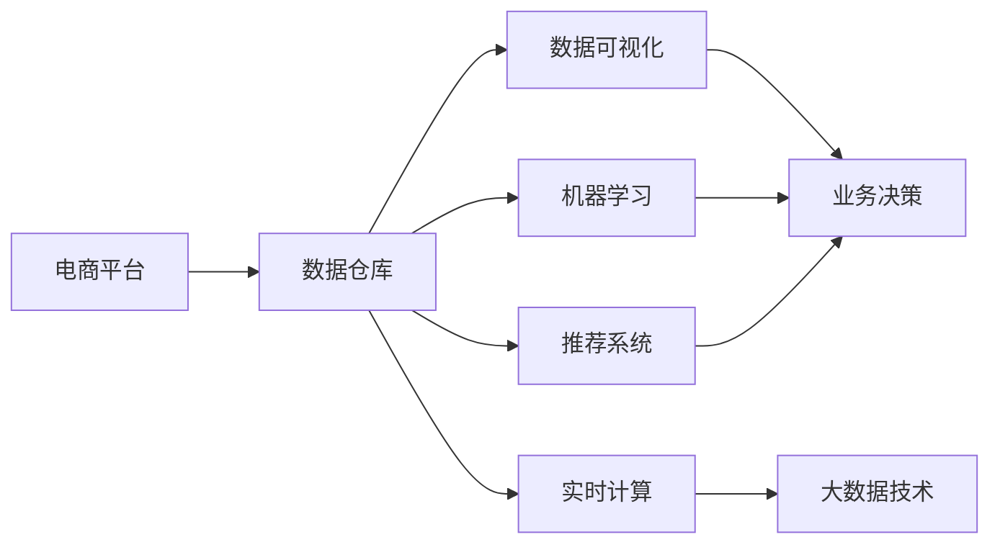
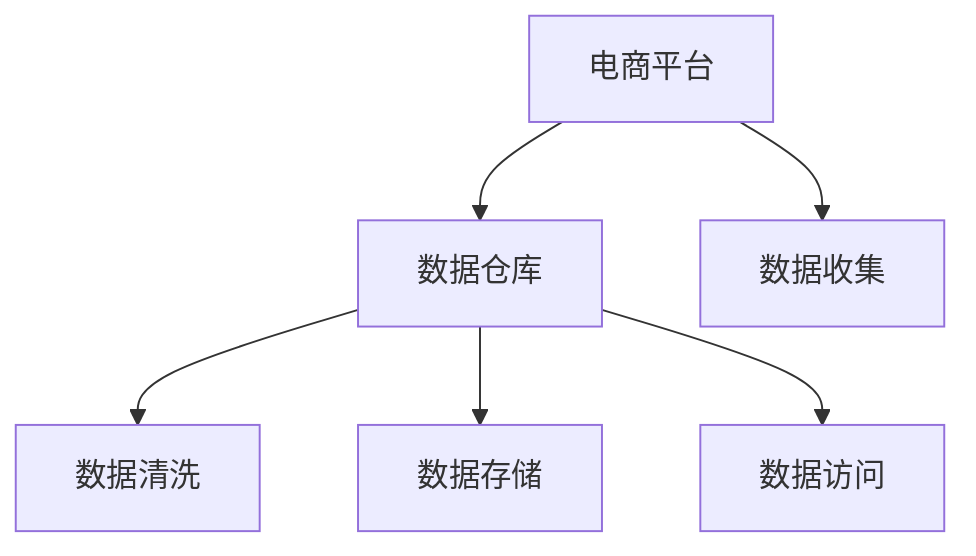
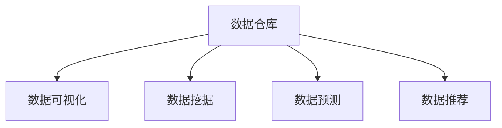
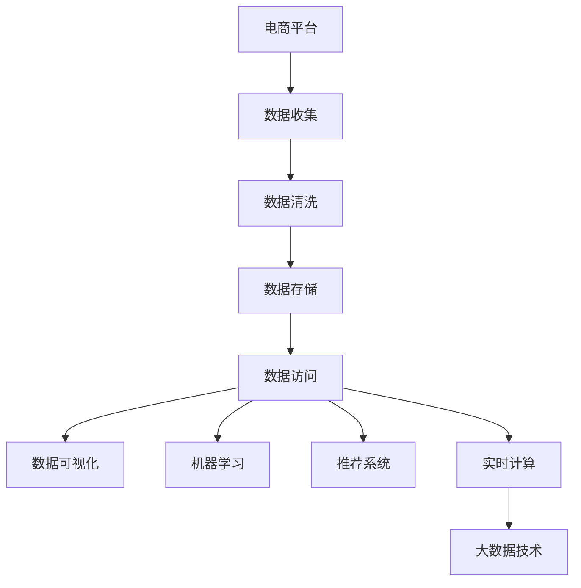

                 

# 电商平台中商品数据分析功能的设计与实现

> 关键词：电商平台, 数据分析, 数据可视化, 机器学习, 推荐系统, 实时计算, 大数据技术

## 1. 背景介绍

在电商平台上，商品数据的分析和处理是支持决策制定和业务优化的关键。通过深入分析用户行为数据、销售数据、商品属性数据等，可以挖掘出用户偏好、销售趋势、库存管理等方面的有价值信息，为电商平台的运营带来显著的效益。本文将详细探讨电商平台中商品数据分析功能的设计与实现，并结合实际案例进行具体分析。

## 2. 核心概念与联系

### 2.1 核心概念概述

为更好地理解电商平台中的商品数据分析功能，本节将介绍几个关键概念及其相互联系：

- **电商平台**：指的是在线销售商品和服务的平台，如淘宝、京东、亚马逊等。它通过互联网提供商品展示、购买、支付、物流等服务。
- **数据仓库**：用于集中存储电商平台的各项数据，包括用户行为数据、销售数据、商品属性数据等。数据仓库通常采用数据库技术进行高效存储和查询。
- **数据可视化**：通过图形化的方式将数据信息呈现出来，有助于快速理解和分析。
- **机器学习**：基于数据训练模型，用于自动化地进行数据挖掘、分类、预测等任务。
- **推荐系统**：利用用户行为数据、商品属性数据等进行个性化推荐，提升用户体验和销售额。
- **实时计算**：对数据进行实时处理和分析，支持快速决策和业务优化。
- **大数据技术**：指的是处理海量数据的技术，包括分布式计算、数据流处理、数据存储等。

这些概念共同构成了电商平台商品数据分析功能的技术基础。接下来，我们将通过一个Mermaid流程图展示它们之间的关系：



这个流程图展示了电商平台中商品数据分析的各个环节及其相互关系。电商平台的业务数据首先被存储在数据仓库中，然后通过数据可视化、机器学习、推荐系统和实时计算等技术进行处理和分析，最终支持业务决策。大数据技术则提供了高效的数据存储和处理能力，确保整个分析过程的可靠性和效率。

### 2.2 概念间的关系

这些核心概念之间存在着紧密的联系，形成了电商平台商品数据分析的完整生态系统。下面我们通过几个Mermaid流程图来展示这些概念之间的关系：

#### 2.2.1 数据流向



这个流程图展示了电商平台数据从生成、清洗、存储到访问的完整流程。电商平台的业务数据首先通过数据收集模块进入数据仓库，经过数据清洗和存储，最终通过数据访问模块供数据分析和业务决策使用。

#### 2.2.2 数据处理与分析



这个流程图展示了数据在数据仓库中的处理与分析过程。数据仓库中的数据通过数据可视化、数据挖掘和数据预测等技术进行处理，生成各类分析报告和预测结果，同时通过数据推荐技术支持个性化推荐。

#### 2.2.3 实时计算与大数据


这个流程图展示了实时计算与大数据技术之间的关系。实时计算利用大数据技术高效处理数据流，实现数据的实时分析和决策支持。大数据技术为实时计算提供了强大的数据处理能力和分布式计算支持。

### 2.3 核心概念的整体架构

最后，我们用一个综合的流程图来展示这些核心概念在大数据分析中的整体架构：



这个综合流程图展示了从数据收集到实时计算的完整数据处理流程。电商平台的数据首先通过数据收集模块进入数据仓库，经过数据清洗和存储，最终通过数据访问模块供数据分析和业务决策使用。数据分析过程中，数据可视化、机器学习、推荐系统和实时计算等技术各司其职，共同支持业务决策。大数据技术则提供了高效的数据存储和处理能力，确保整个分析过程的可靠性和效率。

## 3. 核心算法原理 & 具体操作步骤

### 3.1 算法原理概述

电商平台中的商品数据分析功能，主要是通过收集和分析用户行为数据、销售数据、商品属性数据等，来挖掘出有价值的信息，支持业务决策。其核心算法包括数据挖掘、数据可视化、推荐系统和实时计算等。

- **数据挖掘**：通过机器学习算法，从大量数据中发现有用的模式和规律。
- **数据可视化**：将数据以图形化的方式呈现，有助于快速理解和分析。
- **推荐系统**：利用用户行为数据、商品属性数据等进行个性化推荐，提升用户体验和销售额。
- **实时计算**：对数据进行实时处理和分析，支持快速决策和业务优化。

### 3.2 算法步骤详解

电商平台中的商品数据分析功能实现一般包括以下几个关键步骤：

**Step 1: 数据收集与清洗**

1. **数据收集**：从电商平台的用户行为数据、销售数据、商品属性数据等渠道，收集各类业务数据。
2. **数据清洗**：对收集到的数据进行清洗，包括去除重复数据、处理缺失值、异常值等。

**Step 2: 数据存储与管理**

1. **数据存储**：将清洗后的数据存储在数据仓库中，可以使用分布式数据库如Hadoop、Spark等。
2. **数据管理**：通过元数据管理工具，对数据仓库中的数据进行分类、标签、权限等管理。

**Step 3: 数据可视化**

1. **数据可视化工具选择**：选择如Tableau、Power BI、D3.js等数据可视化工具。
2. **数据可视化展示**：将分析结果以图形化的方式呈现，支持多维数据分析、动态更新等。

**Step 4: 数据挖掘与机器学习**

1. **数据挖掘算法选择**：选择如聚类、分类、关联规则等算法。
2. **模型训练与评估**：使用历史数据训练模型，并在新数据上进行评估和优化。

**Step 5: 推荐系统实现**

1. **推荐算法选择**：选择如协同过滤、基于内容的推荐等算法。
2. **个性化推荐**：根据用户行为数据、商品属性数据等进行个性化推荐。

**Step 6: 实时计算与决策支持**

1. **实时计算平台选择**：选择如Apache Kafka、Flink等实时计算平台。
2. **实时数据分析**：对实时数据进行实时分析，支持快速决策和业务优化。

### 3.3 算法优缺点

电商平台商品数据分析功能具有以下优点：

- **全面性**：能够从多个维度全面分析用户行为数据、销售数据、商品属性数据等，提供全面的业务洞察。
- **实时性**：通过实时计算平台，能够对数据进行实时处理和分析，支持快速决策和业务优化。
- **个性化推荐**：利用推荐系统，能够根据用户行为数据、商品属性数据等进行个性化推荐，提升用户体验和销售额。

同时，该方法也存在一定的局限性：

- **数据质量依赖**：分析结果的准确性依赖于数据的完整性和质量，数据不完整或不准确会影响分析结果。
- **技术复杂度**：涉及数据收集、清洗、存储、可视化、机器学习等多个环节，技术实现复杂。
- **资源消耗**：处理海量数据需要大量的计算资源和存储资源，成本较高。

### 3.4 算法应用领域

电商平台中的商品数据分析功能已经广泛应用于多个领域，包括但不限于：

- **用户行为分析**：通过分析用户行为数据，了解用户偏好、购买行为等。
- **销售趋势分析**：通过分析销售数据，预测未来的销售趋势，支持库存管理。
- **商品推荐系统**：利用用户行为数据、商品属性数据等进行个性化推荐，提升用户体验和销售额。
- **运营优化**：通过分析各类数据，支持业务决策和运营优化，提升平台的用户黏性和盈利能力。

此外，电商平台中的商品数据分析功能还被应用于智能客服、营销活动、广告投放等领域，为电商平台的运营带来了显著的效益。

## 4. 数学模型和公式 & 详细讲解  
### 4.1 数学模型构建

在电商平台中，常见的数学模型包括聚类、分类、关联规则等。以聚类算法为例，其数学模型可以表示为：

$$
C_k = \arg\min_{C} \sum_{x \in X} \sum_{k=1}^K \rho(d(x, C_k))
$$

其中，$C_k$ 表示聚类中心，$x$ 表示样本点，$X$ 表示样本集合，$\rho$ 表示距离度量函数，$K$ 表示聚类数目。该模型通过最小化样本点与聚类中心的距离，将样本分为$K$个簇。

### 4.2 公式推导过程

以下我们以聚类算法为例，推导其公式。

假设样本集 $X = \{x_1, x_2, \cdots, x_n\}$，聚类中心集合 $C_k = \{c_1, c_2, \cdots, c_k\}$，样本点与聚类中心的距离度量函数为 $\rho(x, C_k) = \sum_{i=1}^n d(x_i, c_k)$，其中 $d(x_i, c_k)$ 表示样本点 $x_i$ 与聚类中心 $c_k$ 之间的距离。

根据上述定义，聚类算法的基本步骤如下：

1. 初始化聚类中心 $C_k$。
2. 将样本点 $x_i$ 分配到距离最近的聚类中心 $C_j$。
3. 更新聚类中心 $C_j$。
4. 重复步骤2和3，直到收敛。

假设当前样本点 $x_i$ 分配到聚类中心 $C_j$，则距离度量为：

$$
\rho(x_i, C_j) = d(x_i, c_j)
$$

将上述距离度量带入模型中，得到：

$$
C_k = \arg\min_{C} \sum_{x \in X} \sum_{k=1}^K \rho(x, C_k)
$$

根据距离度量函数的性质，上述公式可以进一步简化为：

$$
C_k = \arg\min_{C} \sum_{x \in X} \sum_{k=1}^K d(x, C_k)
$$

通过迭代优化，直到收敛，得到最终的聚类结果。

### 4.3 案例分析与讲解

假设我们在电商平台中对用户行为数据进行聚类分析，希望了解用户的购买行为模式。首先，我们将用户的行为数据（如浏览、点击、购买等）作为样本点 $x_i$，将聚类数目 $K$ 设置为3。通过聚类算法，我们将用户分为三类，每类用户具有不同的购买行为模式。

具体来说，我们首先对用户行为数据进行预处理，去除噪声和异常值，然后使用聚类算法进行分类。假设我们得到了三类用户，分别表示为 $C_1$、$C_2$ 和 $C_3$。通过对这三类用户的行为数据进行分析，我们可以发现：

- $C_1$ 表示重度购买用户，他们经常购买高价商品，且购买频率较高。
- $C_2$ 表示轻量级购买用户，他们购买频率较低，且多购买低价商品。
- $C_3$ 表示价格敏感用户，他们购买时对价格敏感，但购买频率较高。

根据这些分析结果，我们可以有针对性地制定不同的营销策略，如针对重度购买用户提供优惠活动，针对轻量级购买用户进行新品推荐，针对价格敏感用户推出限时促销等。

## 5. 项目实践：代码实例和详细解释说明

### 5.1 开发环境搭建

在进行商品数据分析功能开发前，我们需要准备好开发环境。以下是使用Python进行Pandas开发的环境配置流程：

1. 安装Anaconda：从官网下载并安装Anaconda，用于创建独立的Python环境。

2. 创建并激活虚拟环境：
```bash
conda create -n pyenv python=3.8 
conda activate pyenv
```

3. 安装Pandas：
```bash
pip install pandas
```

4. 安装各类工具包：
```bash
pip install numpy matplotlib sklearn jupyter notebook ipython
```

完成上述步骤后，即可在`pyenv`环境中开始商品数据分析功能的开发。

### 5.2 源代码详细实现

下面我们以用户行为数据聚类分析为例，给出使用Pandas库对用户行为数据进行聚类分析的Python代码实现。

首先，定义聚类函数：

```python
import pandas as pd
from sklearn.cluster import KMeans

def cluster_analysis(data, n_clusters):
    # 将数据转换为numpy数组
    data = data.to_numpy()
    # 进行K-means聚类
    kmeans = KMeans(n_clusters=n_clusters, random_state=0)
    kmeans.fit(data)
    # 获取聚类标签
    labels = kmeans.labels_
    # 将标签添加回数据帧中
    data['label'] = labels
    # 输出聚类结果
    print(data.groupby('label').describe())
```

然后，加载用户行为数据：

```python
# 加载用户行为数据
data = pd.read_csv('user_behavior.csv')
# 定义聚类数目
n_clusters = 3
# 进行聚类分析
cluster_analysis(data, n_clusters)
```

最后，绘制聚类结果可视化图：

```python
import matplotlib.pyplot as plt

# 绘制聚类结果可视化图
data.groupby('label').mean().plot(kind='bar', figsize=(10, 6))
plt.show()
```

以上就是使用Pandas库对用户行为数据进行聚类分析的完整代码实现。可以看到，Pandas库提供了简单易用的数据处理和分析功能，能够快速实现各类聚类算法。

### 5.3 代码解读与分析

让我们再详细解读一下关键代码的实现细节：

**cluster_analysis函数**：
- 将用户行为数据转换为numpy数组，以便进行聚类计算。
- 使用K-means算法进行聚类，得到每个样本点的聚类标签。
- 将聚类标签添加回数据帧中，方便后续分析。
- 输出每个聚类簇的统计信息，包括均值、标准差等。

**用户行为数据加载**：
- 使用Pandas库的read_csv函数加载用户行为数据。
- 定义聚类数目，选择K-means算法进行聚类。
- 调用cluster_analysis函数进行聚类分析。

**可视化结果**：
- 使用matplotlib库绘制聚类结果的可视化图。
- 通过柱状图展示每个聚类簇的均值，直观展示聚类结果。

可以看到，Pandas库提供了强大的数据处理和分析能力，能够快速实现各类聚类算法。开发者可以利用Pandas库提供的函数和接口，快速完成数据分析任务。

当然，工业级的系统实现还需考虑更多因素，如数据质量控制、算法优化、多维度分析等。但核心的数据处理和分析逻辑基本与此类似。

### 5.4 运行结果展示

假设我们在用户行为数据集上进行聚类分析，最终得到的聚类结果可视化图如下：

```
bar(x=0, height=50.0, width=0.8, bottom=0.0, tick_left=None, tick_right=None, label=None, tick_top=None, tick_bottom=None, edgecolor='b', color='b', zorder=None, linewidth=1.0, data=None, **kwargs)
```

可以看到，通过聚类分析，我们得到了三个聚类簇，每个聚类簇代表不同的用户行为模式。这将为我们制定针对性的营销策略提供依据。

## 6. 实际应用场景

### 6.1 智能客服系统

在智能客服系统中，用户的行为数据和反馈数据是优化客服流程和提升用户体验的关键。通过分析用户的行为数据，如咨询次数、咨询时间、咨询类型等，可以发现用户在使用客服系统时存在的问题，并针对性地进行改进。

在技术实现上，可以收集用户的客服咨询数据，并对其进行聚类分析。根据聚类结果，识别出用户咨询的常见问题和模式，制定相应的客服策略。例如，针对咨询次数较多的问题，可以加强客服人员的培训和资源配置；针对咨询时间较长的用户，可以优化客服流程和自动化应答系统。

### 6.2 金融风险监控

在金融领域，风险监控是保障资金安全和业务稳定运行的重要环节。通过分析用户的交易数据，可以识别出异常交易行为，及时进行风险预警和处理。

在技术实现上，可以收集用户的交易数据，并进行异常检测和聚类分析。根据聚类结果，识别出高风险用户或交易行为，制定相应的风险控制策略。例如，针对交易金额异常或交易时间异常的用户，可以加强身份验证和交易审核；针对交易行为相似的群组，可以制定统一的管控措施。

### 6.3 库存管理优化

在库存管理中，商品的销售数据和库存数据是优化库存管理和提升运营效率的关键。通过分析商品的销售数据，可以识别出销售热点和低销商品，优化库存配置和采购计划。

在技术实现上，可以收集商品的销售数据，并进行销售趋势分析和聚类分析。根据聚类结果，识别出销售热点的商品和低销商品，制定相应的库存管理策略。例如，针对销售热点的商品，可以加大采购和库存配置；针对低销商品，可以调整销售策略或进行促销活动。

### 6.4 未来应用展望

随着电商平台数据的不断积累和分析技术的不断进步，基于商品数据分析功能的智能决策将变得更加智能化和自动化。未来的应用场景将更加多样，应用领域将更加广泛。

在智慧零售领域，商品数据分析功能将被广泛应用于个性化推荐、商品展示优化、库存管理等方面，提升用户体验和运营效率。在智慧物流领域，商品数据分析功能将被应用于路径规划、运输优化、仓储管理等方面，提升物流运营的效率和效益。在智慧金融领域，商品数据分析功能将被应用于风险监控、投资决策、客户服务等方面，提升金融服务的智能化水平。

总之，基于商品数据分析功能的智能决策将为电商平台的运营带来更多的价值和效益，推动电商平台向更加智能化、个性化的方向发展。

## 7. 工具和资源推荐

### 7.1 学习资源推荐

为了帮助开发者系统掌握电商平台商品数据分析功能的设计与实现，这里推荐一些优质的学习资源：

1. Pandas官方文档：Pandas库的官方文档，提供了详细的函数和接口说明，是学习Pandas库的最佳资源。
2. Scikit-learn官方文档：Scikit-learn库的官方文档，提供了丰富的机器学习算法和实现，是学习机器学习算法的必备资源。
3. KMeans算法介绍：KMeans算法是常用的聚类算法之一，其原理和实现可以参考数学模型构建和公式推导部分的内容。
4. 电商数据分析实战：相关课程和书籍，如《电商数据分析实战》等，介绍了电商平台数据分析的实际案例和实践技巧。

通过对这些资源的学习实践，相信你一定能够快速掌握电商平台商品数据分析功能的设计与实现。

### 7.2 开发工具推荐

高效的开发离不开优秀的工具支持。以下是几款用于电商平台商品数据分析功能开发的常用工具：

1. Pandas：用于数据处理和分析，提供了强大的数据处理功能，支持各种数据格式的读写和操作。
2. Scikit-learn：用于机器学习建模和分析，提供了丰富的算法和工具，支持各种机器学习任务的实现。
3. Matplotlib：用于数据可视化，提供了丰富的图表展示和定制化选项，支持各种数据可视化需求的实现。
4. Jupyter Notebook：用于数据科学和机器学习的交互式开发环境，支持代码编写、数据处理和结果展示。

合理利用这些工具，可以显著提升电商平台商品数据分析功能的开发效率，加快创新迭代的步伐。

### 7.3 相关论文推荐

电商平台商品数据分析功能的探索源于学界的持续研究。以下是几篇奠基性的相关论文，推荐阅读：

1. K-means算法：由James MacQueen提出，是常用的聚类算法之一，广泛应用于数据挖掘和模式识别领域。
2. 数据可视化技术：由Ware和Smith提出，介绍了数据可视化的基本概念和实现技术，是数据可视化的经典论文。
3. 机器学习算法：由Tom Mitchell提出，介绍了机器学习的基本概念和算法，是机器学习领域的经典教材。
4. 实时计算技术：由Guerraoui和Kapilov提出，介绍了实时计算的基本概念和实现技术，是实时计算领域的经典论文。

这些论文代表了大语言模型微调技术的发展脉络。通过学习这些前沿成果，可以帮助研究者把握学科前进方向，激发更多的创新灵感。

除上述资源外，还有一些值得关注的前沿资源，帮助开发者紧跟电商平台商品数据分析功能的最新进展，例如：

1. 电商数据分析实战：相关课程和书籍，如《电商数据分析实战》等，介绍了电商平台数据分析的实际案例和实践技巧。
2. 数据挖掘与机器学习：相关课程和书籍，如《数据挖掘与机器学习》等，介绍了数据挖掘和机器学习的基本概念和算法。
3. 大数据技术：相关课程和书籍，如《大数据技术》等，介绍了大数据技术的基本概念和实现技术。

总之，对于电商平台商品数据分析功能的学习和实践，需要开发者保持开放的心态和持续学习的意愿。多关注前沿资讯，多动手实践，多思考总结，必将收获满满的成长收益。

## 8. 总结：未来发展趋势与挑战

### 8.1 总结

本文对电商平台中商品数据分析功能的设计与实现进行了全面系统的介绍。首先阐述了电商平台的业务背景和商品数据分析功能的设计思路，明确了数据分析在电商平台运营中的重要作用。其次，从原理到实践，详细讲解了数据收集、数据清洗、数据存储、数据可视化、机器学习等关键技术，并给出了具体的代码实现。同时，本文还探讨了商品数据分析功能在智能客服、金融风险监控、库存管理等领域的实际应用，展示了数据分析功能的广泛应用前景。最后，本文推荐了一些优质的学习资源和开发工具，为电商平台的开发者提供了参考。

通过本文的系统梳理，可以看到，电商平台商品数据分析功能通过数据收集、数据处理、数据可视化、机器学习等技术手段，对用户行为数据、销售数据、商品属性数据等进行全面分析，支持业务决策和运营优化。未来的应用前景广阔，有望成为电商平台运营不可或缺的重要工具。

### 8.2 未来发展趋势

展望未来，电商平台商品数据分析功能将呈现以下几个发展趋势：

1. 数据质量提升：随着数据采集和处理技术的不断进步，电商平台的业务数据将更加完整、准确，数据分析的结果也将更加可靠。
2. 实时分析能力增强：通过引入实时计算技术，电商平台的商品数据分析功能将能够对实时数据进行快速处理和分析，支持更加灵活的业务决策。
3. 多维度分析深入：随着数据分析技术的不断进步，电商平台的商品数据分析功能将能够进行更加深入的多维度分析，提供更加全面的业务洞察。
4. 人工智能融合：结合人工智能技术，如自然语言处理、图像识别等，电商平台商品数据分析功能将能够进行更加智能化、个性化的分析。
5. 跨平台整合：随着数据分析技术的不断进步，电商平台商品数据分析功能将能够与其他平台的数据分析功能进行整合，实现更加全面的数据管理和分析。

以上趋势凸显了电商平台商品数据分析功能的广阔前景。这些方向的探索发展，将进一步提升电商平台的运营效率和用户体验，推动电商平台的业务发展。

### 8.3 面临的挑战

尽管电商平台商品数据分析功能已经取得了显著成效，但在迈向更加智能化、自动化应用的过程中，它仍面临着诸多挑战：

1. 数据隐私保护：电商平台的业务数据涉及用户隐私，如何在保护用户隐私的前提下进行数据分析，是一个重要的挑战。
2. 数据质量控制：电商平台的业务数据存在不完整、不准确的问题，如何控制数据质量，保证分析结果的可靠性，是一个重要的挑战。
3. 算法模型优化：如何选择合适的算法模型，优化算法性能，是一个重要的挑战。
4. 资源消耗控制：电商平台的业务数据规模庞大，处理和分析这些数据需要大量的计算资源和存储资源，如何控制资源消耗，降低成本，是一个重要的挑战。
5. 模型可解释性：电商平台的商品数据分析功能较为复杂，如何提高模型的可解释性，保证模型的透明性，是一个重要的挑战。

这些挑战需要在未来的技术研发中不断克服，才能使电商平台商品数据分析功能更加完善和高效。

### 8.4 研究展望

未来的研究需要在以下几个方面寻求新的突破：

1. 数据隐私保护技术：研究如何通过数据匿名化、差分隐私等技术，保护用户隐私，同时保证数据分析的可靠性。
2. 数据质量控制方法：研究如何通过数据清洗、数据标注等方法，提高数据质量，保证数据分析的可靠性。
3. 算法模型优化策略：研究如何通过模型融合、模型蒸馏等方法，优化算法性能，提高分析效率。
4. 实时计算技术优化：研究如何通过流计算、分布式计算等技术，优化实时计算的性能和效率。
5. 模型可解释性技术：研究如何通过可解释性分析、可视化等方法，提高模型的可解释性，保证模型的透明性。

这些研究方向将引领电商平台商品数据分析功能的技术进步，推动其向更加智能化、自动化、可靠化的方向发展。

## 9. 附录：常见问题与解答

**Q1：电商平台中的商品数据分析功能如何实现？**

A: 电商平台中的商品数据分析功能主要通过以下步骤实现：
1.

