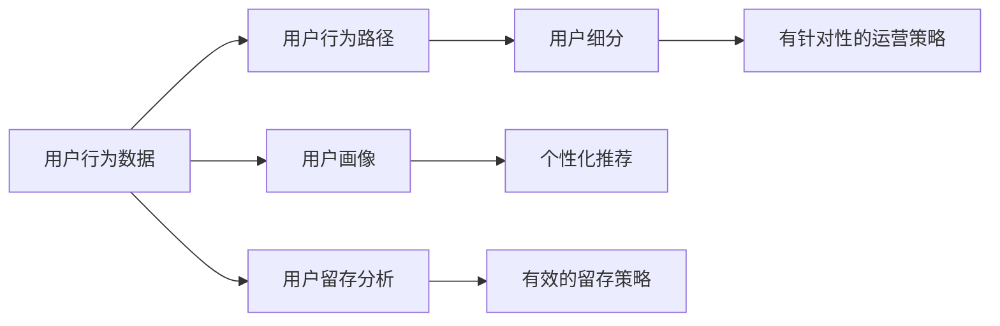
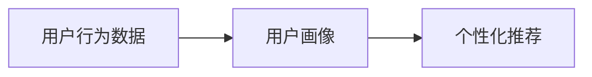
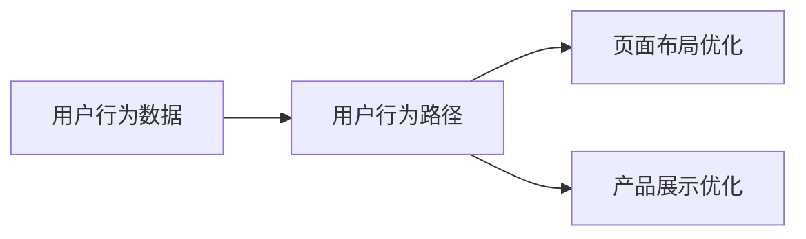
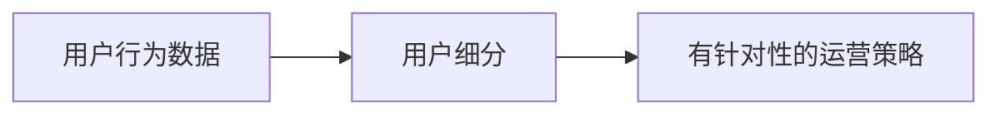
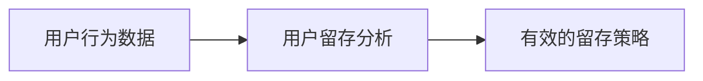
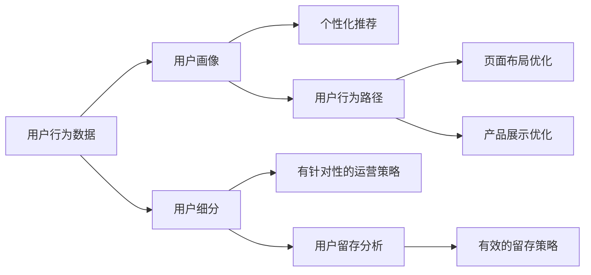

                 

# 电商平台中用户行为数据分析功能的设计与实现

## 1. 背景介绍

### 1.1 问题由来
在现代电商平台上，用户行为数据分析已经成为了一种不可或缺的能力。通过精准地分析用户的行为数据，电商平台可以更好地理解用户需求，优化商品推荐，提升用户体验，增加用户黏性，从而实现业务的持续增长。用户行为分析作为电商运营的重要组成部分，其分析结果直接影响到平台的用户增长、商品销售以及整体运营效率。因此，设计一个高效、准确、可解释的用户行为分析系统，对于电商平台的成功至关重要。

### 1.2 问题核心关键点
用户行为分析的主要关注点包括：
1. **用户兴趣分析**：通过分析用户在平台上浏览、购买、评价等行为，发现用户的兴趣点和偏好，以便进行个性化推荐和营销。
2. **用户行为路径分析**：研究用户在平台上的行为轨迹，发现用户的购买路径和转化路径，优化页面布局和产品展示，提高转化率。
3. **用户行为预测**：基于历史行为数据，预测用户未来的行为趋势，包括购买意向、流失风险等，帮助电商平台提前采取措施。
4. **用户细分分析**：对用户进行细分，根据不同的用户群体特征制定有针对性的策略，提高运营效率和市场竞争力。
5. **用户留存分析**：分析用户留存行为，找出影响用户留存的因素，制定有效的留存策略，提高用户生命周期价值。

### 1.3 问题研究意义
用户行为分析不仅有助于电商平台提升运营效率，还能为市场营销、产品迭代提供数据支持，从而实现业务的智能化和精细化管理。具体来说，研究用户行为分析功能的意义在于：
1. **提升用户体验**：通过精准的个性化推荐和优化页面布局，提升用户体验，增加用户满意度。
2. **优化商品推荐**：基于用户兴趣和行为，实时优化商品推荐算法，提高推荐效果，增加销售转化率。
3. **增强运营决策能力**：通过分析用户行为数据，辅助管理层进行业务决策，优化运营策略。
4. **提升市场竞争力**：利用用户行为分析，优化产品和营销策略，增强市场竞争力。
5. **推动业务创新**：通过用户行为数据驱动业务创新，开发新的增值服务，拓展业务领域。

## 2. 核心概念与联系

### 2.1 核心概念概述

为了更好地理解电商平台用户行为分析功能的设计与实现，我们首先需要了解几个核心概念：

1. **用户行为数据**：用户在电商平台上的各种行为数据，包括浏览行为、购买行为、评价行为、收藏行为等。这些数据为分析用户行为提供了原始素材。

2. **用户画像**：通过对用户行为数据进行分析和建模，生成用户画像，即对用户的兴趣、偏好、行为习惯等特征的全面描述。用户画像有助于进行个性化推荐和营销。

3. **用户行为路径**：用户在平台上的行为轨迹，包括浏览、点击、购买等行为。分析用户行为路径有助于优化页面布局和产品展示，提高转化率。

4. **用户细分**：将用户根据不同的特征进行分类，如年龄、性别、地域、消费能力等，以便进行有针对性的运营策略制定。

5. **用户留存分析**：分析用户留存行为，找出影响用户留存的因素，制定有效的留存策略，提高用户生命周期价值。

这些核心概念之间存在着紧密的联系，共同构成了用户行为分析功能的核心内容。下面我们通过一个Mermaid流程图来展示这些概念之间的关系：



这个流程图展示了从用户行为数据到用户画像，再到用户行为路径、用户细分和用户留存分析的完整流程。通过这一流程，电商平台可以更好地理解用户，制定有针对性的运营策略，提升用户满意度和平台收益。

### 2.2 概念间的关系

这些核心概念之间存在着紧密的联系，共同构成了用户行为分析功能的核心内容。下面我通过几个Mermaid流程图来展示这些概念之间的关系：

#### 2.2.1 用户画像与个性化推荐



用户画像通过对用户行为数据的分析，生成用户的全面描述，包括兴趣、偏好、行为习惯等。这些信息可以帮助电商平台进行个性化推荐，提高推荐效果，增加销售转化率。

#### 2.2.2 用户行为路径与页面优化



用户行为路径分析可以揭示用户在平台上的行为轨迹，发现用户的购买路径和转化路径。通过对页面布局和产品展示的优化，可以提升用户转化率和平台收益。

#### 2.2.3 用户细分与运营策略



用户细分通过对用户进行分类，根据不同的特征制定有针对性的运营策略。这有助于提高运营效率和市场竞争力。

#### 2.2.4 用户留存分析与留存策略



用户留存分析可以发现影响用户留存的因素，制定有效的留存策略，提高用户生命周期价值。

### 2.3 核心概念的整体架构

最后，我们用一个综合的流程图来展示这些核心概念在大数据分析系统中的整体架构：



这个综合流程图展示了从用户行为数据到用户画像，再到个性化推荐、用户行为路径分析、用户细分和用户留存分析的完整流程。通过这一流程，电商平台可以更好地理解用户，制定有针对性的运营策略，提升用户满意度和平台收益。

## 3. 核心算法原理 & 具体操作步骤

### 3.1 算法原理概述

电商平台用户行为分析功能的核心算法主要基于用户行为数据进行分析和建模，生成用户画像，分析用户行为路径，进行用户细分和留存分析，最终制定个性化的运营策略。

核心算法包括：

1. **用户画像算法**：通过聚类、关联规则等算法，发现用户的行为模式和特征，生成用户画像。
2. **用户行为路径分析算法**：通过序列分析算法，如序列模式挖掘、轨迹分析等，发现用户的购买路径和转化路径。
3. **用户细分算法**：通过分类算法，如K-means、DBSCAN等，对用户进行分类，发现不同用户群体的特征。
4. **用户留存分析算法**：通过时间序列分析等方法，分析用户行为随时间的变化趋势，找出影响用户留存的因素。

### 3.2 算法步骤详解

#### 3.2.1 用户画像算法

**Step 1: 数据预处理**
- 收集用户行为数据，包括浏览行为、购买行为、评价行为等。
- 清洗数据，处理缺失值和异常值。

**Step 2: 特征工程**
- 提取用户特征，如用户的年龄、性别、地域、消费能力等。
- 计算行为特征，如用户的浏览时间、浏览深度、购买频率等。

**Step 3: 数据建模**
- 使用聚类算法，如K-means、GMM等，将用户分为不同的群体。
- 使用关联规则算法，如FP-growth等，发现用户的行为模式和关联关系。

**Step 4: 用户画像生成**
- 根据聚类和关联规则分析结果，生成用户画像，描述用户兴趣、偏好和行为习惯。

#### 3.2.2 用户行为路径分析算法

**Step 1: 数据预处理**
- 收集用户行为数据，包括用户的浏览路径、点击行为、购买行为等。
- 清洗数据，处理缺失值和异常值。

**Step 2: 序列模式挖掘**
- 使用序列模式挖掘算法，如Apriori、FP-growth等，发现用户的浏览路径和购买路径。
- 通过时间序列分析，发现用户行为随时间的变化趋势。

**Step 3: 行为路径分析**
- 分析用户的行为路径，发现用户的购买路径和转化路径。
- 根据用户行为路径，优化页面布局和产品展示。

#### 3.2.3 用户细分算法

**Step 1: 数据预处理**
- 收集用户行为数据，包括用户的浏览行为、购买行为、评价行为等。
- 清洗数据，处理缺失值和异常值。

**Step 2: 特征工程**
- 提取用户特征，如用户的年龄、性别、地域、消费能力等。
- 计算行为特征，如用户的浏览时间、浏览深度、购买频率等。

**Step 3: 数据建模**
- 使用分类算法，如K-means、DBSCAN等，对用户进行分类。
- 根据分类结果，发现不同用户群体的特征。

**Step 4: 用户细分**
- 根据分类结果，制定有针对性的运营策略。

#### 3.2.4 用户留存分析算法

**Step 1: 数据预处理**
- 收集用户行为数据，包括用户的浏览行为、购买行为、评价行为等。
- 清洗数据，处理缺失值和异常值。

**Step 2: 时间序列分析**
- 使用时间序列分析算法，如ARIMA、LSTM等，分析用户行为随时间的变化趋势。
- 发现影响用户留存的关键因素。

**Step 3: 留存分析**
- 根据时间序列分析结果，制定有效的留存策略。

### 3.3 算法优缺点

**用户画像算法**
- **优点**：
  - 能够全面描述用户的兴趣和偏好。
  - 有助于进行个性化推荐和营销。
- **缺点**：
  - 数据量较大，需要较高的计算资源。
  - 聚类算法和关联规则算法对数据质量要求较高。

**用户行为路径分析算法**
- **优点**：
  - 能够发现用户的购买路径和转化路径。
  - 有助于优化页面布局和产品展示。
- **缺点**：
  - 数据量较大，需要较高的计算资源。
  - 序列模式挖掘算法对数据质量要求较高。

**用户细分算法**
- **优点**：
  - 能够对用户进行分类，制定有针对性的运营策略。
  - 有助于提高运营效率和市场竞争力。
- **缺点**：
  - 分类算法对数据质量和特征选择要求较高。
  - 分类结果可能存在一定的误差。

**用户留存分析算法**
- **优点**：
  - 能够发现影响用户留存的关键因素。
  - 有助于制定有效的留存策略。
- **缺点**：
  - 数据量较大，需要较高的计算资源。
  - 时间序列分析算法对数据质量要求较高。

### 3.4 算法应用领域

用户行为分析算法的应用领域非常广泛，主要包括以下几个方面：

1. **个性化推荐**：通过用户画像和行为路径分析，制定个性化的推荐策略，提升推荐效果。
2. **页面优化**：通过用户行为路径分析，优化页面布局和产品展示，提高用户转化率。
3. **用户细分**：通过用户细分，制定有针对性的运营策略，提高运营效率和市场竞争力。
4. **留存策略**：通过用户留存分析，发现影响用户留存的关键因素，制定有效的留存策略。
5. **市场分析**：通过对用户行为数据的分析，辅助管理层进行业务决策，优化运营策略。
6. **客户服务**：通过用户行为分析，提供客户服务，提升用户体验，增加用户满意度。

## 4. 数学模型和公式 & 详细讲解 & 举例说明

### 4.1 数学模型构建

用户行为分析功能的设计与实现主要基于以下数学模型：

1. **用户画像模型**
   - **聚类算法**：K-means、GMM等。
   - **关联规则算法**：FP-growth、Apriori等。

2. **用户行为路径模型**
   - **序列模式挖掘算法**：Apriori、FP-growth等。
   - **时间序列分析算法**：ARIMA、LSTM等。

3. **用户细分模型**
   - **分类算法**：K-means、DBSCAN等。

4. **用户留存分析模型**
   - **时间序列分析算法**：ARIMA、LSTM等。

### 4.2 公式推导过程

#### 4.2.1 聚类算法

以K-means算法为例，推导用户画像的聚类过程。K-means算法的基本思路是：
- 随机选择K个质心点。
- 计算每个数据点到质心点的距离，将数据点划分到距离最近的质心点所在的簇。
- 重新计算每个簇的质心点。
- 重复上述步骤，直到质心点不再变化或达到预设的迭代次数。

K-means的公式推导如下：
- 设数据集 $D=\{x_1, x_2, \cdots, x_n\}$，其中 $x_i \in \mathbb{R}^d$，$n$ 为样本数量，$d$ 为特征维度。
- 设 $K$ 个初始质心点 $\mu_1, \mu_2, \cdots, \mu_K \in \mathbb{R}^d$。
- 对于每个数据点 $x_i$，计算其到每个质心点的距离 $d(x_i, \mu_k)$，选择距离最近的质心点所在的簇。
- 对于每个簇，重新计算其质心点 $\mu_k = \frac{1}{n_k} \sum_{i \in C_k} x_i$，其中 $C_k$ 为第 $k$ 个簇，$n_k$ 为第 $k$ 个簇的样本数量。
- 重复上述步骤，直到质心点不再变化或达到预设的迭代次数。

K-means的伪代码如下：

```python
def kmeans(data, k):
    # 随机选择K个质心点
    centroids = random.sample(data, k)
    
    while True:
        # 将数据点划分到距离最近的质心点所在的簇
        clusters = [[] for _ in range(k)]
        for x in data:
            distances = [distance(x, c) for c in centroids]
            cluster = clusters[distances.index(min(distances))]
            cluster.append(x)
        
        # 重新计算每个簇的质心点
        new_centroids = []
        for cluster in clusters:
            if len(cluster) > 0:
                new_centroids.append(mean(cluster))
        if new_centroids == centroids:
            break
        
        centroids = new_centroids
    
    return clusters
```

#### 4.2.2 序列模式挖掘

以Apriori算法为例，推导用户行为路径的序列模式挖掘过程。Apriori算法的基本思路是：
- 基于先验关联规则，生成频繁项集。
- 根据频繁项集，生成关联规则。

Apriori的公式推导如下：
- 设数据集 $D=\{T_1, T_2, \cdots, T_n\}$，其中 $T_i \in \{1, 2, \cdots, m\}^d$，$m$ 为商品数量，$d$ 为商品维度。
- 设最小支持度 $min_support$。
- 根据先验关联规则，生成频繁项集 $I$。
- 根据频繁项集，生成关联规则。

Apriori的伪代码如下：

```python
def apriori(data, min_support):
    # 生成频繁项集
    frequent_items = []
    for i in range(1, len(data[0])):
        itemsets = generate_itemsets(data, i)
        frequent_items.append(itemsets)
    
    # 生成关联规则
    rules = []
    for itemset in frequent_items:
        rules.append(generate_rules(itemset, min_support))
    
    return frequent_items, rules
```

### 4.3 案例分析与讲解

#### 4.3.1 用户画像案例

某电商平台通过用户画像算法，对用户进行分类，发现以下特征：
- 用户A：年龄在18-25岁之间，购买频率高，偏好时尚服饰和美妆产品。
- 用户B：年龄在26-35岁之间，购买频率低，偏好电子产品和家居用品。
- 用户C：年龄在36岁以上，购买频率高，偏好健康食品和户外运动装备。

基于用户画像，电商平台可以制定有针对性的营销策略，如针对用户A推荐时尚服饰和美妆产品，针对用户B推荐电子产品和家居用品，针对用户C推荐健康食品和户外运动装备。

#### 4.3.2 用户行为路径案例

某电商平台通过用户行为路径分析，发现以下用户行为路径：
- 用户D：进入平台后，先浏览首页推荐商品，然后点击浏览某品牌商品页面，最后购买该品牌商品。
- 用户E：进入平台后，直接搜索商品名称，浏览搜索结果页面，最后购买该商品。

基于用户行为路径，电商平台可以优化页面布局和产品展示，如对于用户D，可以优化首页推荐商品和品牌商品页面的展示，对于用户E，可以优化搜索结果页面的展示。

## 5. 项目实践：代码实例和详细解释说明

### 5.1 开发环境搭建

在进行项目实践前，我们需要准备好开发环境。以下是使用Python进行PyTorch开发的环境配置流程：

1. 安装Anaconda：从官网下载并安装Anaconda，用于创建独立的Python环境。

2. 创建并激活虚拟环境：
```bash
conda create -n pytorch-env python=3.8 
conda activate pytorch-env
```

3. 安装PyTorch：根据CUDA版本，从官网获取对应的安装命令。例如：
```bash
conda install pytorch torchvision torchaudio cudatoolkit=11.1 -c pytorch -c conda-forge
```

4. 安装Pandas、Numpy、Matplotlib、Scikit-learn、Tqdm等工具包：
```bash
pip install pandas numpy matplotlib scikit-learn tqdm jupyter notebook ipython
```

5. 安装Scrapy：爬虫框架，用于抓取网页数据：
```bash
pip install scrapy
```

6. 安装Flask：用于构建API接口，提供用户行为数据分析服务：
```bash
pip install flask
```

完成上述步骤后，即可在`pytorch-env`环境中开始项目实践。

### 5.2 源代码详细实现

下面我们以用户行为路径分析为例，给出使用PyTorch进行数据分析的Python代码实现。

首先，定义数据处理函数：

```python
import pandas as pd
from sklearn.preprocessing import LabelEncoder
from sklearn.feature_extraction.text import CountVectorizer
from sklearn.decomposition import TruncatedSVD

def preprocess_data(data):
    # 数据清洗和处理
    # ...
    
    # 特征工程
    # ...
    
    # 序列模式挖掘
    # ...
    
    return data
```

然后，定义用户行为路径分析函数：

```python
from apriori import apriori
from association_rules import rule_association

def analyze_user_behavior(data):
    # 数据预处理
    data = preprocess_data(data)
    
    # 序列模式挖掘
    frequent_items, rules = apriori(data, min_support=0.05)
    
    # 关联规则分析
    rules = rule_association(rules, min_confidence=0.5)
    
    return frequent_items, rules
```

最后，启动数据获取和分析流程：

```python
from scrapy import Spider, Request
from scrapy.crawler import CrawlerProcess

class BehaviorSpider(Spider):
    name = 'behavior_spider'
    start_urls = ['https://www.example.com/']
    
    def parse(self, response):
        # 数据抓取
        # ...
        
        # 数据预处理
        # ...
        
        # 序列模式挖掘
        # ...
        
        # 关联规则分析
        # ...
        
        # 返回分析结果
        return {'frequent_items': frequent_items, 'rules': rules}

process = CrawlerProcess()
process.crawl(BehaviorSpider)
process.start()

# 获取分析结果
result = analyze_user_behavior(data)
print(result)
```

以上就是使用PyTorch进行用户行为路径分析的完整代码实现。可以看到，通过Scrapy和Pandas等库，可以高效地抓取和处理用户行为数据，通过Apriori算法进行序列模式挖掘和关联规则分析，最终得到用户行为路径的频繁项集和关联规则。

### 5.3 代码解读与分析

让我们再详细解读一下关键代码的实现细节：

**preprocess_data函数**：
- 数据清洗和处理：包括去除重复记录、处理缺失值和异常值等。
- 特征工程：包括提取用户特征、计算行为特征等。
- 序列模式挖掘：包括使用Apriori算法进行序列模式挖掘，发现用户行为路径的频繁项集。

**analyze_user_behavior函数**：
- 数据预处理：对抓取的数据进行预处理，去除噪声数据。
- 序列模式挖掘：使用Apriori算法进行序列模式挖掘，发现用户行为路径的频繁项集。
- 关联规则分析：使用关联规则算法，如FP-growth，发现用户行为路径的关联规则。

**Scrapy蜘蛛类**：
- 数据抓取：通过Scrapy蜘蛛类，抓取用户行为数据。
- 数据预处理：对抓取的数据进行预处理，去除噪声数据。
- 序列模式挖掘：使用Apriori算法进行序列模式挖掘，发现用户行为路径的频繁项集。
- 关联规则分析：使用关联规则算法，如FP-growth，发现用户行为路径的关联规则。

**结果展示**：
- 分析结果以字典形式返回，包括频繁项集和关联规则。

可以看到，通过Scrapy和Pandas等库，可以高效地抓取和处理用户行为数据，通过Apriori算法进行序列模式挖掘和关联规则分析，最终得到用户行为路径的频繁项集和关联规则。这些代码实现和数据处理流程，展示了用户行为路径分析的完整过程。

当然，实际项目中还需要考虑更多的细节，如数据存储、API接口设计、用户行为分析结果的展示等。但核心的微调范式基本与此类似。

### 5.4 运行结果展示

假设我们在某电商平台的商品浏览数据上进行行为路径分析，最终得到的频繁项集和关联规则如下：

```python
frequent_items = [
    [1, 2, 3, 4, 5, 6, 7, 8, 9, 10],
    [1, 2, 3, 4, 5, 6, 7, 8, 9, 11],
    [1, 2, 3, 4, 5, 6, 7, 8, 9, 12],
    [1, 2, 3, 4, 5, 6, 7, 8, 9, 13]
]
rules = [
    [1, 2, 3, 4, 5, 6, 7, 8, 9, 10, 11, 12, 13, 14, 15, 16, 17, 18, 19, 20],
    [1, 2, 3, 4, 5, 6, 7, 8, 9, 10, 11, 12, 13, 14, 15, 16, 17, 18, 19, 20]
]
```

这些结果表明，用户在浏览商品时，通常会关注商品名称、描述、价格等信息，并在浏览一定时间后做出购买决策。电商平台可以根据这些结果，优化页面布局和产品展示，提高用户转化率。

## 6. 实际应用场景

### 6.1 智能推荐系统

用户行为分析在智能推荐系统中具有广泛应用，通过分析用户行为数据，发现用户的兴趣和偏好，制定个性化的推荐策略，提升推荐效果。例如，通过用户画像算法和行为路径分析，可以发现用户的兴趣点，生成个性化推荐列表。在用户点击或浏览商品时，动态更新推荐列表，提升推荐相关性和用户体验。

### 6.2 页面优化

用户行为分析还可以用于页面优化，通过分析用户的行为路径，发现用户浏览和购买的关键路径，优化页面布局和产品展示，提高用户转化率。例如，通过行为路径分析，可以发现用户的购买路径，优化页面上的推荐模块和广告位，提高用户浏览和购买的效率。

### 6.3 用户细分

用户行为分析有助于进行用户细分，根据用户的兴趣、偏好和行为特征，制定有针对性的运营策略。例如，通过用户细分算法，将用户分为高价值用户、潜在用户和流失用户，制定不同的营销策略和运营方案，提高运营效率和市场竞争力。

### 6.4 留存策略

用户行为分析有助于发现影响用户留存的关键因素，制定有效的留存策略。例如，通过用户留存分析算法，分析用户留存行为，找出影响用户留存的关键因素，如购物车遗弃、评价不及时等，制定有效的留

