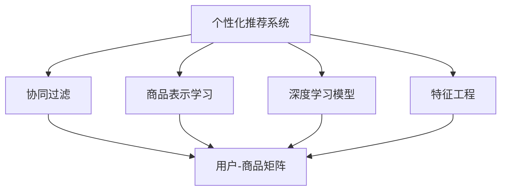
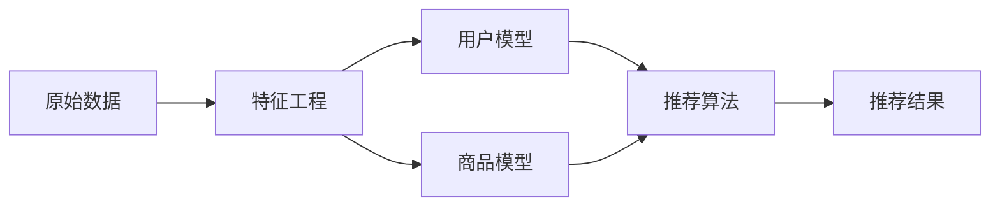
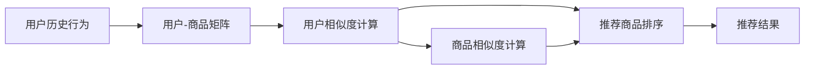
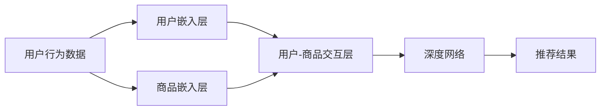

                 

## 1. 背景介绍

在现代电子商务时代，电商平台已经成为了消费者获取商品信息、进行购买决策的主要渠道。随着用户需求的不断变化，如何提升电商平台的商品供给能力，满足用户个性化的购物需求，成为了电商平台面临的重要挑战。个性化商品推荐系统（Personalized Item Recommendation System）通过对用户行为的深度分析，精准预测用户可能感兴趣的商品，从而大幅提升用户的购物体验和电商平台的商品转化率。

### 1.1 问题由来

电商平台需要面对数以亿计的用户，每个用户都有其独特的购物习惯和偏好。传统的商品推荐系统往往基于简单的统计分析，如商品共现、基于用户的评分等，难以应对复杂多变的用户需求。而个性化推荐系统通过深度学习和用户行为数据的建模，能够更准确地预测用户兴趣，为用户推荐个性化的商品，极大地提高了用户的购物体验和平台的用户黏性。

个性化推荐系统在大电商平台上得到了广泛应用，如亚马逊、淘宝、京东等，通过分析用户的历史浏览、点击、购买等行为，向用户推荐商品，显著提升了平台的用户转化率和销售额。但随着电商平台的不断发展，个性化推荐系统的技术挑战也越来越多。如何更好地整合多维度的用户数据，挖掘用户深层次的需求，提升推荐效果，成为了一个亟待解决的难题。

### 1.2 问题核心关键点

个性化推荐系统的工作原理可以简单概括为：通过学习用户的历史行为数据，构建用户兴趣模型，从而预测用户可能感兴趣的商品，并进行推荐。具体来说，核心关键点包括以下几个方面：

- 用户兴趣建模：通过分析用户的行为数据，建立用户兴趣模型，以捕捉用户的潜在需求。
- 商品表示学习：将商品表示为易于建模的形式，如词向量、图像特征等，便于与用户模型进行匹配。
- 推荐算法设计：选择合适的推荐算法，将用户模型与商品表示进行匹配，生成推荐列表。
- 评估和优化：通过评估推荐效果，不断优化模型，提升推荐质量。

## 2. 核心概念与联系

### 2.1 核心概念概述

为更好地理解个性化推荐系统的技术原理，本节将介绍几个关键概念：

- **个性化推荐系统（Personalized Recommendation System）**：通过学习用户的历史行为数据，构建用户兴趣模型，从而预测用户可能感兴趣的商品，并进行推荐的技术系统。
- **协同过滤（Collaborative Filtering）**：通过分析用户和商品之间的交互行为，构建用户兴趣模型，从而推荐与用户兴趣相似的商品。
- **商品表示学习（Item Representation Learning）**：将商品表示为易于建模的形式，如词向量、图像特征等，便于与用户模型进行匹配。
- **深度学习模型（Deep Learning Model）**：利用深度神经网络模型，从大规模数据中学习用户和商品的深层次表示，提升推荐效果。
- **特征工程（Feature Engineering）**：通过特征提取和处理，将原始数据转化为模型能够有效处理的特征向量。

这些概念之间的联系可以通过以下Mermaid流程图来展示：



这个流程图展示了个性化推荐系统的核心概念及其之间的关系：

1. 个性化推荐系统主要通过协同过滤、商品表示学习、深度学习模型、特征工程等技术手段，构建用户兴趣模型。
2. 协同过滤通过分析用户和商品之间的交互行为，构建用户兴趣模型，从而推荐与用户兴趣相似的商品。
3. 商品表示学习将商品表示为易于建模的形式，如词向量、图像特征等，便于与用户模型进行匹配。
4. 深度学习模型利用神经网络模型，从大规模数据中学习用户和商品的深层次表示，提升推荐效果。
5. 特征工程通过特征提取和处理，将原始数据转化为模型能够有效处理的特征向量。

这些概念共同构成了个性化推荐系统的技术架构，使得系统能够更好地满足用户的个性化需求。

### 2.2 概念间的关系

这些核心概念之间存在着紧密的联系，形成了个性化推荐系统的完整生态系统。下面我们通过几个Mermaid流程图来展示这些概念之间的关系。

#### 2.2.1 个性化推荐系统的基本架构



这个流程图展示了个性化推荐系统从原始数据到推荐结果的基本流程：

1. 原始数据经过特征工程处理，转化为特征向量。
2. 用户模型和商品模型分别通过用户行为数据和商品属性数据进行训练。
3. 推荐算法将用户模型和商品模型进行匹配，生成推荐列表。
4. 推荐结果用于指导用户进行下一步操作，如点击、购买等。

#### 2.2.2 协同过滤算法流程



这个流程图展示了协同过滤算法的基本流程：

1. 用户历史行为数据构建用户-商品矩阵。
2. 计算用户之间的相似度，找出与目标用户兴趣相似的用户。
3. 计算商品之间的相似度，找出与目标用户兴趣相似的商品。
4. 根据用户和商品的相似度，进行推荐商品排序，生成推荐结果。

#### 2.2.3 深度学习推荐模型流程



这个流程图展示了深度学习推荐模型的基本流程：

1. 用户行为数据经过用户嵌入层和商品嵌入层，转化为高维向量表示。
2. 用户嵌入和商品嵌入通过用户-商品交互层进行匹配，生成用户-商品交互向量。
3. 用户-商品交互向量输入深度网络，进行特征提取和匹配。
4. 深度网络输出推荐结果，用于指导用户进行下一步操作。

## 3. 核心算法原理 & 具体操作步骤

### 3.1 算法原理概述

个性化推荐系统的核心算法可以大致分为两种：协同过滤和基于内容的推荐。协同过滤通过分析用户和商品之间的交互行为，构建用户兴趣模型，从而推荐与用户兴趣相似的商品。基于内容的推荐则通过商品属性特征，匹配用户和商品之间的相似度，进行推荐。

#### 3.1.1 协同过滤算法

协同过滤算法的核心思想是通过分析用户和商品之间的交互行为，构建用户兴趣模型，从而推荐与用户兴趣相似的商品。协同过滤算法可以分为两种：基于用户的协同过滤和基于物品的协同过滤。

基于用户的协同过滤算法（User-based Collaborative Filtering）通过计算用户之间的相似度，找出与目标用户兴趣相似的用户，并根据这些用户的历史行为数据，预测目标用户可能感兴趣的商品。其基本流程如下：

1. 构建用户-商品矩阵 $U \times I$，其中 $U$ 为用户数，$I$ 为商品数。
2. 计算用户之间的相似度 $S$，通常使用余弦相似度、皮尔逊相关系数等。
3. 根据相似度 $S$，找出与目标用户 $u$ 兴趣相似的用户集 $N(u)$。
4. 对于用户集 $N(u)$ 中的每个用户 $v$，计算用户 $v$ 对商品 $i$ 的评分 $R_{vi}$。
5. 对商品 $i$ 的评分进行加权求和，得到目标用户 $u$ 对商品 $i$ 的预测评分 $R_u(i)$。
6. 对预测评分进行排序，生成推荐列表。

基于物品的协同过滤算法（Item-based Collaborative Filtering）通过计算商品之间的相似度，找出与目标用户兴趣相似的商品，并根据这些商品的历史行为数据，预测目标用户可能感兴趣的商品。其基本流程如下：

1. 构建用户-商品矩阵 $U \times I$，其中 $U$ 为用户数，$I$ 为商品数。
2. 计算商品之间的相似度 $S$，通常使用余弦相似度、皮尔逊相关系数等。
3. 根据相似度 $S$，找出与目标用户兴趣相似的商品集 $I(u)$。
4. 对于商品集 $I(u)$ 中的每个商品 $i$，计算用户 $u$ 对商品 $i$ 的评分 $R_{ui}$。
5. 对商品 $i$ 的评分进行加权求和，得到目标用户 $u$ 对商品 $i$ 的预测评分 $R_u(i)$。
6. 对预测评分进行排序，生成推荐列表。

#### 3.1.2 基于内容的推荐算法

基于内容的推荐算法通过分析商品的特征，匹配用户和商品之间的相似度，进行推荐。其基本流程如下：

1. 构建商品特征向量 $I \times F$，其中 $I$ 为商品数，$F$ 为特征维度。
2. 计算用户和商品之间的相似度 $S$，通常使用余弦相似度、欧式距离等。
3. 对商品特征向量进行加权求和，得到目标用户 $u$ 对商品 $i$ 的预测评分 $R_u(i)$。
4. 对预测评分进行排序，生成推荐列表。

#### 3.1.3 深度学习推荐模型

深度学习推荐模型通过构建用户嵌入和商品嵌入，学习用户和商品的深层次表示，进行推荐。其基本流程如下：

1. 构建用户行为数据集 $U \times I$，其中 $U$ 为用户数，$I$ 为商品数。
2. 通过用户嵌入层和商品嵌入层，将用户行为数据转化为高维向量表示。
3. 通过用户-商品交互层，将用户嵌入和商品嵌入进行匹配，生成用户-商品交互向量。
4. 输入深度网络，进行特征提取和匹配。
5. 深度网络输出推荐结果，用于指导用户进行下一步操作。

### 3.2 算法步骤详解

#### 3.2.1 协同过滤算法的详细实现

基于用户的协同过滤算法可以通过以下Python代码实现：

```python
import numpy as np

# 用户-商品矩阵
R = np.array([[5, 4, 0, 0], 
             [4, 0, 5, 0], 
             [0, 5, 4, 0],
             [0, 0, 0, 5]])

# 计算用户之间的相似度
def similarity(u, v):
    return np.dot(R[u], R[v])

# 找出与目标用户兴趣相似的用户集
def neighbors(u):
    scores = np.dot(R[u], R)
    idx = np.argsort(scores)[::-1]
    return idx[:5]

# 计算目标用户对商品的评分
def predict(v):
    return np.dot(R[v], R)

# 生成推荐列表
def recommend(u):
    u_neighbors = neighbors(u)
    scores = predict(u_neighbors)
    return u_neighbors, scores

# 测试推荐结果
recommend(0)
```

#### 3.2.2 深度学习推荐模型的详细实现

深度学习推荐模型可以通过TensorFlow或PyTorch等框架实现。以下是一个基于TensorFlow的深度学习推荐模型的实现示例：

```python
import tensorflow as tf
import numpy as np

# 用户-商品矩阵
R = np.array([[5, 4, 0, 0], 
             [4, 0, 5, 0], 
             [0, 5, 4, 0],
             [0, 0, 0, 5]])

# 构建用户嵌入层和商品嵌入层
user_embeddings = tf.keras.layers.Embedding(input_dim=R.shape[0], output_dim=10)(R)
item_embeddings = tf.keras.layers.Embedding(input_dim=R.shape[1], output_dim=10)(R)

# 构建用户-商品交互层
interaction_layer = tf.keras.layers.Dot(axes=1, normalize=True)([user_embeddings, item_embeddings])

# 构建深度网络
model = tf.keras.Sequential([
    interaction_layer,
    tf.keras.layers.Dense(128, activation='relu'),
    tf.keras.layers.Dense(1, activation='sigmoid')
])

# 编译模型
model.compile(optimizer='adam', loss='binary_crossentropy', metrics=['accuracy'])

# 训练模型
model.fit(user_embeddings, item_embeddings, epochs=10, batch_size=16)

# 生成推荐结果
def recommend(u):
    u_neighbor = user_embeddings[np.argmax(similarity(u, u_neighbor))]
    scores = model.predict(item_embeddings).flatten()
    return u_neighbor, scores
```

#### 3.2.3 基于内容的推荐算法的详细实现

基于内容的推荐算法可以通过以下Python代码实现：

```python
import numpy as np

# 商品特征向量
I = np.array([[1, 0, 0, 1],
             [0, 1, 0, 0],
             [1, 0, 0, 0],
             [0, 0, 1, 0]])

# 计算用户和商品之间的相似度
def similarity(u, i):
    return np.dot(I[u], I[i])

# 生成推荐列表
def recommend(u):
    scores = np.dot(I[u], I)
    return np.argmax(scores)

# 测试推荐结果
recommend(0)
```

### 3.3 算法优缺点

#### 3.3.1 协同过滤算法的优缺点

协同过滤算法的优点包括：

- 简单易实现：协同过滤算法原理简单，易于理解和实现。
- 无需商品属性信息：协同过滤算法不需要商品的详细属性信息，只依赖于用户和商品之间的交互行为。
- 可扩展性强：协同过滤算法可以处理大规模数据集，能够应用于实时推荐系统。

协同过滤算法的缺点包括：

- 冷启动问题：新用户或新商品没有历史交互记录，无法进行推荐。
- 稀疏性问题：用户和商品之间的交互行为往往比较稀疏，导致协同过滤算法的推荐效果受限。
- 过拟合问题：协同过滤算法容易过拟合，推荐结果可能不准确。

#### 3.3.2 基于内容的推荐算法的优缺点

基于内容的推荐算法的优点包括：

- 不依赖于用户行为数据：基于内容的推荐算法只需要商品的特征信息，不需要用户的交互记录。
- 易于解释：基于内容的推荐算法能够直观地解释推荐结果的依据。
- 不依赖于用户行为：基于内容的推荐算法可以应用于新用户和新商品，解决了冷启动问题。

基于内容的推荐算法的缺点包括：

- 商品属性信息要求高：商品的特征信息需要全面且准确，否则推荐效果可能不佳。
- 适用于商品丰富度高的场景：基于内容的推荐算法适用于商品种类较多的场景，对于商品种类较少的场景，推荐效果可能有限。
- 缺少用户个性化信息：基于内容的推荐算法无法充分利用用户的个性化需求，推荐效果可能不理想。

#### 3.3.3 深度学习推荐模型的优缺点

深度学习推荐模型的优点包括：

- 能够捕捉深层次特征：深度学习推荐模型能够学习用户和商品的深层次特征，提升了推荐效果。
- 能够处理稀疏数据：深度学习推荐模型能够处理稀疏数据，提升了推荐效果。
- 适用于大规模数据集：深度学习推荐模型可以处理大规模数据集，能够应用于实时推荐系统。

深度学习推荐模型的缺点包括：

- 训练复杂度高：深度学习推荐模型需要大量的标注数据和计算资源，训练复杂度高。
- 需要专家干预：深度学习推荐模型需要专家进行特征工程和模型调参，否则可能出现过拟合等问题。
- 需要处理高维数据：深度学习推荐模型需要处理高维数据，计算复杂度高。

## 4. 数学模型和公式 & 详细讲解 & 举例说明

### 4.1 数学模型构建

#### 4.1.1 协同过滤的数学模型

协同过滤算法的核心是用户-商品矩阵 $R \in \mathbb{R}^{U \times I}$，其中 $U$ 为用户数，$I$ 为商品数。协同过滤算法的目标是预测用户对商品的评分，即计算用户 $u$ 对商品 $i$ 的评分 $R_{ui}$。

协同过滤算法通常使用基于用户的协同过滤算法和基于物品的协同过滤算法。基于用户的协同过滤算法通过计算用户之间的相似度，找出与目标用户兴趣相似的用户集 $N(u)$，并根据这些用户的历史行为数据，预测目标用户可能感兴趣的商品。基于物品的协同过滤算法通过计算商品之间的相似度，找出与目标用户兴趣相似的商品集 $I(u)$，并根据这些商品的历史行为数据，预测目标用户可能感兴趣的商品。

#### 4.1.2 基于内容的推荐模型的数学模型

基于内容的推荐模型通过分析商品的特征，匹配用户和商品之间的相似度，进行推荐。假设商品特征向量 $I \in \mathbb{R}^{I \times F}$，其中 $I$ 为商品数，$F$ 为特征维度。用户-商品矩阵 $R \in \mathbb{R}^{U \times I}$，其中 $U$ 为用户数，$I$ 为商品数。基于内容的推荐模型的目标是计算用户 $u$ 对商品 $i$ 的评分 $R_{ui}$。

基于内容的推荐模型通常使用余弦相似度、欧式距离等相似度度量方法。假设商品特征向量为 $I_i$，用户特征向量为 $U_u$，则用户和商品之间的相似度为：

$$
\text{similarity}(u,i) = \text{cosine}(I_i, U_u) = \frac{I_i \cdot U_u}{\|I_i\|\|U_u\|}
$$

用户 $u$ 对商品 $i$ 的预测评分 $R_{ui}$ 为：

$$
R_{ui} = \sum_{j=1}^F (I_i[j] \cdot U_u[j])
$$

#### 4.1.3 深度学习推荐模型的数学模型

深度学习推荐模型通过构建用户嵌入和商品嵌入，学习用户和商品的深层次表示，进行推荐。假设用户行为数据集 $R \in \mathbb{R}^{U \times I}$，其中 $U$ 为用户数，$I$ 为商品数。用户嵌入层和商品嵌入层的输出为 $U_{user} \in \mathbb{R}^{U \times H}$ 和 $I_{item} \in \mathbb{R}^{I \times H}$，其中 $H$ 为嵌入维度。用户-商品交互层输出用户-商品交互向量 $I_{ui} \in \mathbb{R}^{H}$。深度网络输出推荐结果 $R_{ui} \in \mathbb{R}$。

深度学习推荐模型的目标是学习用户嵌入和商品嵌入，并计算用户 $u$ 对商品 $i$ 的预测评分 $R_{ui}$。假设用户嵌入和商品嵌入分别为 $U_u$ 和 $I_i$，则用户 $u$ 对商品 $i$ 的预测评分 $R_{ui}$ 为：

$$
R_{ui} = \sigma(\sum_{j=1}^H I_i[j] \cdot U_u[j])
$$

其中 $\sigma$ 为激活函数，通常使用 sigmoid 函数。

### 4.2 公式推导过程

#### 4.2.1 协同过滤算法的公式推导

基于用户的协同过滤算法通过计算用户之间的相似度，找出与目标用户兴趣相似的用户集，并根据这些用户的历史行为数据，预测目标用户可能感兴趣的商品。假设用户-商品矩阵 $R \in \mathbb{R}^{U \times I}$，其中 $U$ 为用户数，$I$ 为商品数。计算用户之间的相似度时，通常使用余弦相似度、皮尔逊相关系数等。

基于用户的协同过滤算法的数学公式推导如下：

1. 计算用户之间的相似度：

$$
\text{similarity}(u,v) = \frac{\sum_{i=1}^I R_{ui} R_{vi}}{\sqrt{\sum_{i=1}^I R_{ui}^2} \sqrt{\sum_{i=1}^I R_{vi}^2}}
$$

2. 找出与目标用户兴趣相似的用户集：

$$
N(u) = \text{argsort(similarity(u,v))}
$$

3. 计算目标用户对商品的评分：

$$
R_u(i) = \sum_{v \in N(u)} R_{vi}
$$

4. 对预测评分进行排序，生成推荐列表。

#### 4.2.2 基于内容的推荐算法的公式推导

基于内容的推荐算法通过分析商品的特征，匹配用户和商品之间的相似度，进行推荐。假设商品特征向量 $I \in \mathbb{R}^{I \times F}$，其中 $I$ 为商品数，$F$ 为特征维度。用户-商品矩阵 $R \in \mathbb{R}^{U \times I}$，其中 $U$ 为用户数，$I$ 为商品数。基于内容的推荐算法的数学公式推导如下：

1. 计算用户和商品之间的相似度：

$$
\text{similarity}(u,i) = \frac{\sum_{j=1}^F I_i[j] \cdot U_u[j]}{\sqrt{\sum_{j=1}^F I_i[j]^2} \sqrt{\sum_{j=1}^F U_u[j]^2}}
$$

2. 生成推荐列表：

$$
R_{ui} = \sum_{j=1}^F (I_i[j] \cdot U_u[j])
$$

#### 4.2.3 深度学习推荐模型的公式推导

深度学习推荐模型通过构建用户嵌入和商品嵌入，学习用户和商品的深层次表示，进行推荐。假设用户行为数据集 $R \in \mathbb{R}^{U \times I}$，其中 $U$ 为用户数，$I$ 为商品数。用户嵌入层和商品嵌入层的输出为 $U_{user} \in \mathbb{R}^{U \times H}$ 和 $I_{item} \in \mathbb{R}^{I \times H}$，其中 $H$ 为嵌入维度。用户-商品交互层输出用户-商品交互向量 $I_{ui} \in \mathbb{R}^{H}$。深度网络输出推荐结果 $R_{ui} \in \mathbb{R}$。深度学习推荐模型的数学公式推导如下：

1. 构建用户嵌入层和商品嵌入层：

$$
U_{user} = \text{embedding}(R_u), I_{item} = \text{embedding}(R_i)
$$

2. 构建用户-商品交互层：

$$
I_{ui} = \text{dot}(U_{user}, I_{item})
$$

3. 输入深度网络：

$$
R_{ui} = \sigma(\sum_{j=1}^H I_i[j] \cdot U_u[j])
$$

其中 $\sigma$ 为激活函数，通常使用 sigmoid 函数。

### 4.3 案例分析与讲解

#### 4.3.1 协同过滤算法的案例分析

假设有一用户-商品矩阵 $R$，其中 $U=3$，$I=4$。对于用户 $u=0$，计算与 $u$ 兴趣相似的用户集 $N(u)$，并根据这些用户的历史行为数据，预测 $u$ 可能感兴趣的商品。

1. 计算用户之间的相似度：

$$
\text{similarity}(0,1) = \frac{5 \cdot 5}{\sqrt{5^2} \sqrt{5^2}} = 1
$$

$$
\text{similarity}(0,2) = \frac{0 \cdot 5}{\sqrt{0^2} \sqrt{5^2}} = 0
$$

$$
\text{similarity}(0,3) = \frac{0 \cdot 5}{\sqrt{0^2} \sqrt{5^2}} = 0
$$

2. 找出与目标用户兴趣相似的用户集：

$$
N(0) = \text{argsort(similarity(0,v))} = [1]
$$

3. 计算目标用户对商品的评分：

$$
R_0(i) = 5
$$

4. 对预测评分进行排序，生成推荐列表：

$$
\text{recommend}(0) = [1]
$$

#### 4.3.2 基于内容的推荐算法的案例分析

假设有一商品特征向量 $I$，其中 $I=3$，$F=2$。对于用户 $u=0$，计算与 $u$ 兴趣相似的商品集 $I(u)$，并根据这些商品的历史行为数据，预测 $u$ 可能感兴趣的商品。

1. 计算用户和商品之间的相似度：

$$
\text{similarity}(0,1) = \frac{1 \cdot 1}{\sqrt{1^2} \sqrt{1^2}} = 1
$$

$$
\text{similarity}(0,2) = \frac{0 \cdot 0}{\sqrt{0^2} \sqrt{0^2}} = 0
$$

$$
\text{similarity}(0,3) = \frac{1 \cdot 0}{\sqrt{1^2} \sqrt{0^2}} = 0
$$

2. 生成推荐列表：

$$
R_{01} = 

