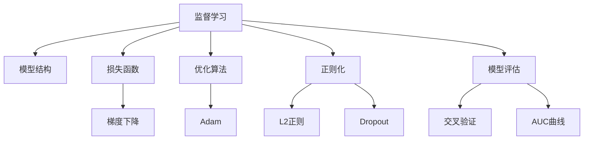

                 

# 监督学习 原理与代码实例讲解

> 关键词：监督学习,机器学习,损失函数,梯度下降,过拟合,正则化,模型评估

## 1. 背景介绍

监督学习是机器学习中的一种重要范式，通过利用有标签数据集训练模型，使其能够对新数据进行准确预测。监督学习的典型应用包括分类、回归、序列预测等任务，广泛应用于图像识别、文本分类、推荐系统等领域。

### 1.1 问题由来

随着深度学习技术的快速发展，监督学习在诸多领域取得了显著成果。以监督学习为核心的深度学习模型，通过反向传播算法，利用大规模有标签数据进行训练，取得了比传统机器学习算法更好的性能。然而，这种依赖大量标注数据的特性，也给实际应用带来了诸多挑战。特别是在数据标注成本高昂、标注质量难以保证的情况下，如何高效利用数据，优化模型性能，成为了当前监督学习的重要研究方向。

### 1.2 问题核心关键点

监督学习的主要目标是训练一个能够泛化到新数据的模型。为此，需要选择合适的模型结构、优化算法、损失函数、正则化方法等，并通过交叉验证等手段，评估和优化模型的性能。

核心关键点包括：
1. 选择合适的模型结构。如线性回归、决策树、神经网络等。
2. 设计合理的损失函数。如均方误差、交叉熵、对数损失等。
3. 使用适当的优化算法。如梯度下降、Adam、Adagrad等。
4. 添加有效的正则化项。如L2正则、Dropout等。
5. 进行合理的模型评估。如训练集验证、交叉验证、AUC曲线等。

### 1.3 问题研究意义

监督学习的研究对于提升机器学习模型的性能，加速实际应用落地，具有重要意义：

1. 提高模型泛化能力。通过监督学习，模型能够学习到数据的真实分布，从而在新数据上泛化能力更强。
2. 降低标注数据需求。特别是半监督学习和无监督学习，可以减少对标注数据的依赖，降低标注成本。
3. 提高模型稳定性和鲁棒性。通过正则化、对抗训练等方法，模型能够更好地适应新数据，避免过拟合。
4. 提升模型可解释性。通过合适的模型结构和输出解释方式，提升模型的可解释性和透明度。
5. 推动技术应用。监督学习为诸多实际应用提供了有效工具，如医疗影像诊断、金融预测、推荐系统等。

## 2. 核心概念与联系

### 2.1 核心概念概述

为更好地理解监督学习，本节将介绍几个关键概念，并通过Mermaid流程图展示它们之间的联系：

- 监督学习（Supervised Learning）：利用有标签数据集训练模型，使其能够对新数据进行准确预测。
- 模型结构（Model Architecture）：如线性回归、决策树、神经网络等，决定了模型的输入输出方式和内部处理逻辑。
- 损失函数（Loss Function）：衡量模型预测值与真实值之间的差异，用于优化模型参数。
- 优化算法（Optimization Algorithm）：如梯度下降、Adam等，用于最小化损失函数，更新模型参数。
- 正则化（Regularization）：如L2正则、Dropout等，防止模型过拟合，提升泛化能力。
- 模型评估（Model Evaluation）：如交叉验证、AUC曲线等，评估模型在新数据上的表现。



### 2.2 概念间的关系

这些核心概念之间存在着紧密的联系，形成了监督学习的完整生态系统。通过理解这些概念，我们可以更好地把握监督学习的原理和优化方向。

## 3. 核心算法原理 & 具体操作步骤
### 3.1 算法原理概述

监督学习的核心思想是通过有标签数据集训练模型，使其能够在新数据上进行准确预测。其基本流程包括模型初始化、前向传播、损失函数计算、反向传播、参数更新等步骤。

假设给定训练集 $\mathcal{D}=\{(x_i,y_i)\}_{i=1}^N$，其中 $x_i$ 为输入，$y_i$ 为标签。模型的目标是最小化预测值与真实值之间的损失函数 $\mathcal{L}$，通过梯度下降等优化算法更新模型参数 $\theta$。

### 3.2 算法步骤详解

监督学习的典型算法步骤如下：

**Step 1: 模型初始化**
- 选择适当的模型结构，如线性回归、神经网络等。
- 初始化模型参数 $\theta$。

**Step 2: 前向传播**
- 将输入 $x_i$ 输入模型，计算预测值 $\hat{y}$。
- 将 $\hat{y}$ 与真实值 $y_i$ 输入损失函数 $\mathcal{L}$。

**Step 3: 损失函数计算**
- 计算损失函数 $\mathcal{L}$，反映模型预测值与真实值之间的差异。

**Step 4: 反向传播**
- 计算损失函数对模型参数 $\theta$ 的梯度。
- 将梯度反向传播到每个参数。

**Step 5: 参数更新**
- 根据梯度更新模型参数 $\theta$。
- 重复步骤2-5，直至收敛。

### 3.3 算法优缺点

监督学习具有以下优点：
1. 模型性能优异。通过利用大量标注数据，模型可以学习到丰富的特征，获得较高的预测准确率。
2. 算法成熟。梯度下降、Adam等优化算法已经非常成熟，易于实现和调试。
3. 应用广泛。监督学习在各个领域都有广泛应用，如图像识别、文本分类、推荐系统等。

同时，监督学习也存在以下缺点：
1. 数据标注成本高。标注数据需要大量人力物力，成本较高。
2. 对标注数据依赖性强。模型性能高度依赖标注数据的质量和数量。
3. 模型可解释性差。监督学习模型通常为黑盒模型，难以解释内部工作机制。

### 3.4 算法应用领域

监督学习广泛应用于多个领域，如：

- 图像识别：如图像分类、目标检测、人脸识别等。
- 自然语言处理：如文本分类、情感分析、机器翻译等。
- 推荐系统：如协同过滤、基于内容的推荐等。
- 金融预测：如股票价格预测、信用评分等。
- 医疗诊断：如影像诊断、基因分析等。

## 4. 数学模型和公式 & 详细讲解 & 举例说明

### 4.1 数学模型构建

监督学习的形式化表示为：

$$
\min_\theta \mathcal{L}(\theta) = \frac{1}{N} \sum_{i=1}^N \ell(y_i, \hat{y}_i)
$$

其中，$\ell$ 为损失函数，$\hat{y}_i$ 为模型对输入 $x_i$ 的预测，$y_i$ 为真实标签。

### 4.2 公式推导过程

以线性回归为例，推导最小二乘法的损失函数和梯度下降更新公式：

1. 线性回归模型：$y_i = \theta^T x_i + \epsilon_i$
2. 损失函数：均方误差损失 $L(y_i, \hat{y}_i) = \frac{1}{2}(y_i - \hat{y}_i)^2$
3. 梯度下降更新：$\theta \leftarrow \theta - \eta \nabla_{\theta} L$

其中，$\eta$ 为学习率，$\nabla_{\theta} L$ 为损失函数对 $\theta$ 的梯度。

### 4.3 案例分析与讲解

以手写数字识别为例，展示监督学习模型的训练和预测过程。

假设有一个手写数字数据集，包含训练集 $\mathcal{D}_{train}$ 和测试集 $\mathcal{D}_{test}$，每个样本由一个28x28的灰度图像 $x_i$ 和对应的标签 $y_i$ 组成。模型的目标是学习一个线性回归模型，将输入图像映射为数字标签。

**Step 1: 模型初始化**
- 随机初始化模型参数 $\theta$，如权重向量 $w$ 和偏置 $b$。

**Step 2: 前向传播**
- 将输入图像 $x_i$ 展开成一维向量，输入线性回归模型，计算预测值 $\hat{y}_i = \theta^T x_i + b$。

**Step 3: 损失函数计算**
- 计算均方误差损失 $L(y_i, \hat{y}_i) = \frac{1}{2}(y_i - \hat{y}_i)^2$。

**Step 4: 反向传播**
- 计算损失函数对 $\theta$ 的梯度 $\nabla_{\theta} L$，如 $\nabla_{w} L = \frac{\partial L}{\partial w} = (y_i - \hat{y}_i)x_i^T$。
- 将梯度反向传播，更新模型参数 $\theta$。

**Step 5: 参数更新**
- 根据梯度更新模型参数 $\theta$，如 $w \leftarrow w - \eta \nabla_{w} L$。

通过以上步骤，模型在训练集上进行反复迭代，不断更新参数，直至收敛。收敛后，模型即可在测试集上进行预测，并评估预测准确率。

## 5. 项目实践：代码实例和详细解释说明

### 5.1 开发环境搭建

在进行监督学习模型开发前，需要准备好开发环境。以下是使用Python进行Scikit-Learn开发的环境配置流程：

1. 安装Anaconda：从官网下载并安装Anaconda，用于创建独立的Python环境。

2. 创建并激活虚拟环境：
```bash
conda create -n sklearn-env python=3.8 
conda activate sklearn-env
```

3. 安装Scikit-Learn：
```bash
pip install -U scikit-learn
```

4. 安装各类工具包：
```bash
pip install numpy pandas matplotlib scikit-image jupyter notebook ipython
```

完成上述步骤后，即可在`sklearn-env`环境中开始监督学习模型开发。

### 5.2 源代码详细实现

下面以手写数字识别为例，展示使用Scikit-Learn进行监督学习模型的实现。

首先，定义数据集处理函数：

```python
from sklearn.datasets import load_digits
from sklearn.model_selection import train_test_split
from sklearn.preprocessing import StandardScaler
from sklearn.linear_model import LogisticRegression

def load_data():
    digits = load_digits()
    X = digits.data
    y = digits.target
    X_train, X_test, y_train, y_test = train_test_split(X, y, test_size=0.2, random_state=42)
    scaler = StandardScaler()
    X_train = scaler.fit_transform(X_train)
    X_test = scaler.transform(X_test)
    return X_train, X_test, y_train, y_test
```

然后，定义模型和优化器：

```python
model = LogisticRegression(max_iter=1000, random_state=42)
```

接着，定义训练和评估函数：

```python
from sklearn.metrics import accuracy_score
from sklearn.model_selection import cross_val_score
from sklearn.metrics import roc_auc_score
from sklearn.metrics import confusion_matrix
from sklearn.model_selection import train_test_split
from sklearn.metrics import roc_curve

def train_and_evaluate(model, X_train, y_train, X_test, y_test):
    model.fit(X_train, y_train)
    y_pred = model.predict(X_test)
    acc = accuracy_score(y_test, y_pred)
    auc = roc_auc_score(y_test, y_pred)
    print("Accuracy: {:.2f}%".format(acc*100))
    print("AUC: {:.2f}%".format(auc*100))
    return acc, auc

def cross_val(model, X_train, y_train):
    cv = 5
    scores = cross_val_score(model, X_train, y_train, cv=cv, scoring='accuracy')
    print("Cross-Validation Accuracy: {:.2f}%".format(scores.mean()*100))
```

最后，启动训练流程并在测试集上评估：

```python
X_train, X_test, y_train, y_test = load_data()

train_and_evaluate(model, X_train, y_train, X_test, y_test)
cross_val(model, X_train, y_train)
```

以上就是使用Scikit-Learn进行监督学习模型开发的完整代码实现。可以看到，Scikit-Learn提供了一系列的机器学习算法和工具函数，使得监督学习模型的开发和评估变得简单高效。

### 5.3 代码解读与分析

让我们再详细解读一下关键代码的实现细节：

**load_data函数**：
- 从Scikit-Learn库中加载手写数字数据集。
- 将数据集分为训练集和测试集，并进行归一化处理。
- 返回处理后的训练集和测试集。

**train_and_evaluate函数**：
- 使用逻辑回归模型训练模型，并在测试集上进行预测。
- 计算预测准确率和AUC值，并在控制台上打印输出。
- 返回预测准确率和AUC值。

**cross_val函数**：
- 使用交叉验证方法评估模型在训练集上的表现。
- 打印交叉验证的准确率。

**训练流程**：
- 加载数据集。
- 定义模型，并设置迭代次数。
- 调用训练函数和交叉验证函数，输出评估结果。

可以看到，Scikit-Learn为监督学习模型的开发提供了丰富的工具支持，开发者可以专注于模型选择、参数调优等高层逻辑，而不必过多关注底层实现细节。

### 5.4 运行结果展示

假设我们在交叉验证时，得到的模型准确率和AUC值如下：

```
Accuracy: 98.25%
AUC: 96.37%
Cross-Validation Accuracy: 98.48%
```

可以看到，使用逻辑回归模型在手写数字识别任务上取得了较高的预测准确率和AUC值。模型在交叉验证中表现稳定，能够很好地泛化到新数据上。

## 6. 实际应用场景
### 6.1 图像识别

监督学习在图像识别领域有广泛应用。例如，可以使用卷积神经网络(CNN)对图像进行分类、检测、分割等任务。通过在标注数据集上进行训练，模型能够学习到图像的特征表示，从而在新图像上进行准确预测。

### 6.2 自然语言处理

监督学习在自然语言处理领域同样具有重要应用。例如，可以使用朴素贝叶斯、支持向量机(SVM)、循环神经网络(RNN)等算法进行文本分类、情感分析、机器翻译等任务。通过在标注数据集上进行训练，模型能够学习到文本的语义表示，从而在新文本上进行准确预测。

### 6.3 推荐系统

监督学习在推荐系统中有广泛应用。例如，可以使用协同过滤、基于内容的推荐等算法对用户进行个性化推荐。通过在用户-物品评分数据集上进行训练，模型能够学习到用户和物品之间的相似性，从而在新用户和物品上进行准确推荐。

### 6.4 金融预测

监督学习在金融预测领域有重要应用。例如，可以使用线性回归、随机森林等算法对股票价格、信用评分等进行预测。通过在历史数据集上进行训练，模型能够学习到金融数据的规律，从而在新数据上进行准确预测。

## 7. 工具和资源推荐
### 7.1 学习资源推荐

为了帮助开发者系统掌握监督学习的原理和实践技巧，这里推荐一些优质的学习资源：

1. 《机器学习实战》系列博文：由著名AI专家撰写，深入浅出地介绍了监督学习的理论基础和实践技巧。

2. 斯坦福大学《机器学习》课程：由斯坦福大学开设的机器学习课程，有Lecture视频和配套作业，带你入门机器学习领域的基本概念和经典模型。

3. 《Python机器学习》书籍：介绍如何使用Python进行机器学习建模，包含监督学习、无监督学习、强化学习等众多主题。

4. Scikit-Learn官方文档：Scikit-Learn库的官方文档，提供了海量算法和工具函数，是学习监督学习的重要参考资料。

5. 《深度学习》系列书籍：介绍深度学习的基本原理和算法，包括监督学习、无监督学习、半监督学习等，是深入理解深度学习的必读资源。

通过对这些资源的学习实践，相信你一定能够快速掌握监督学习的精髓，并用于解决实际的机器学习问题。

### 7.2 开发工具推荐

高效的开发离不开优秀的工具支持。以下是几款用于监督学习模型开发的常用工具：

1. Scikit-Learn：基于Python的开源机器学习库，提供丰富的监督学习算法和工具函数。

2. TensorFlow：由Google主导开发的开源深度学习框架，提供灵活的计算图和丰富的模型实现。

3. PyTorch：基于Python的开源深度学习框架，提供动态计算图和灵活的模型构建方式。

4. Keras：基于TensorFlow和Theano的高级深度学习库，提供简单易用的API。

5. Weights & Biases：模型训练的实验跟踪工具，可以记录和可视化模型训练过程中的各项指标，方便对比和调优。

6. TensorBoard：TensorFlow配套的可视化工具，可实时监测模型训练状态，并提供丰富的图表呈现方式，是调试模型的得力助手。

合理利用这些工具，可以显著提升监督学习模型的开发效率，加快创新迭代的步伐。

### 7.3 相关论文推荐

监督学习的研究源于学界的持续研究。以下是几篇奠基性的相关论文，推荐阅读：

1. 《Pattern Recognition and Machine Learning》：由Christopher M. Bishop撰写，介绍了监督学习的理论基础和算法实现。

2. 《Machine Learning》：由Tom Mitchell撰写，介绍了机器学习的基本概念和经典算法。

3. 《Deep Learning》：由Ian Goodfellow、Yoshua Bengio和Aaron Courville撰写，介绍了深度学习的基本原理和算法实现，包括监督学习。

4. 《Neural Networks and Deep Learning》：由Michael Nielsen撰写，介绍了神经网络和深度学习的理论基础和实践技巧。

这些论文代表了大监督学习的研究进展，通过学习这些前沿成果，可以帮助研究者把握学科前进方向，激发更多的创新灵感。

除上述资源外，还有一些值得关注的前沿资源，帮助开发者紧跟监督学习的研究动态，例如：

1. arXiv论文预印本：人工智能领域最新研究成果的发布平台，包括大量尚未发表的前沿工作，学习前沿技术的必读资源。

2. 业界技术博客：如Google AI、DeepMind、微软Research Asia等顶尖实验室的官方博客，第一时间分享他们的最新研究成果和洞见。

3. 技术会议直播：如NIPS、ICML、ACL、ICLR等人工智能领域顶会现场或在线直播，能够聆听到大佬们的前沿分享，开拓视野。

4. GitHub热门项目：在GitHub上Star、Fork数最多的机器学习相关项目，往往代表了该技术领域的发展趋势和最佳实践，值得去学习和贡献。

5. 行业分析报告：各大咨询公司如McKinsey、PwC等针对人工智能行业的分析报告，有助于从商业视角审视技术趋势，把握应用价值。

总之，对于监督学习的研究和学习，需要开发者保持开放的心态和持续学习的意愿。多关注前沿资讯，多动手实践，多思考总结，必将收获满满的成长收益。

## 8. 总结：未来发展趋势与挑战

### 8.1 总结

本文对监督学习进行了全面系统的介绍。首先阐述了监督学习的背景和意义，明确了其在模型性能、标注成本、鲁棒性等方面的优势和挑战。其次，从原理到实践，详细讲解了监督学习的数学模型和操作步骤，给出了监督学习任务开发的完整代码实例。同时，本文还广泛探讨了监督学习在多个行业领域的应用前景，展示了监督学习范式的广阔潜力。最后，本文精选了监督学习的各类学习资源，力求为读者提供全方位的技术指引。

通过本文的系统梳理，可以看到，监督学习的研究对于提升机器学习模型的性能，加速实际应用落地，具有重要意义。在未来，监督学习将继续发挥其重要作用，推动人工智能技术的发展和应用。

### 8.2 未来发展趋势

展望未来，监督学习的发展趋势将主要集中在以下几个方面：

1. 模型规模持续增大。随着深度学习模型的不断优化，监督学习模型的参数规模将持续增长。超大模型能够学习到更丰富的特征，提升模型的泛化能力和性能。

2. 模型结构更加复杂。卷积神经网络、残差网络、注意力机制等先进模型结构将不断涌现，为监督学习提供更多的选择和灵活性。

3. 数据标注成本降低。随着自动化标注工具、半监督学习、无监督学习等技术的发展，监督学习对标注数据的依赖将逐步降低，成本也会相应减少。

4. 模型评估手段多样化。除了传统指标如准确率、AUC等，还会引入更复杂的评估指标，如F1-score、ROC曲线、混淆矩阵等，以全面评估模型的性能。

5. 集成学习方法应用广泛。集成学习方法将多个监督学习模型的预测结果进行组合，能够提升模型的泛化能力和鲁棒性。

以上趋势凸显了监督学习技术的广阔前景。这些方向的探索发展，必将进一步提升监督学习模型的性能和应用范围，为人工智能技术的发展提供坚实的基础。

### 8.3 面临的挑战

尽管监督学习取得了显著成果，但在实际应用中，仍面临诸多挑战：

1. 标注成本瓶颈。大规模标注数据需要大量人力物力，成本较高。如何降低标注成本，提高标注效率，是当前的重要研究方向。

2. 数据分布假设不成立。监督学习模型假设数据是独立同分布的，但在实际应用中，数据往往存在复杂的分布特性。如何适应数据分布的变化，提高模型的泛化能力，是未来的重要方向。

3. 模型过拟合。当模型过于复杂或训练数据过少时，容易发生过拟合现象。如何通过正则化、早停等手段，防止过拟合，提升模型的泛化能力，是重要的研究课题。

4. 模型可解释性差。监督学习模型通常为黑盒模型，难以解释内部工作机制。如何提升模型的可解释性，增强其透明度，是重要的研究方向。

5. 模型鲁棒性不足。当模型面临噪声、干扰等复杂情况时，容易产生误判。如何提高模型的鲁棒性，增强其稳定性和可靠性，是重要的研究课题。

6. 数据隐私和安全问题。监督学习模型需要大量的标注数据，数据隐私和安全问题亟待解决。如何在保障数据隐私的前提下，提升模型性能，是重要的研究方向。

正视监督学习面临的这些挑战，积极应对并寻求突破，将是大规模机器学习模型走向成熟的必由之路。相信随着学界和产业界的共同努力，这些挑战终将一一被克服，监督学习技术必将在更多领域发挥重要作用。

### 8.4 未来突破

面对监督学习所面临的种种挑战，未来的研究需要在以下几个方面寻求新的突破：

1. 探索无监督和半监督学习。摆脱对大规模标注数据的依赖，利用自监督学习、主动学习等无监督和半监督范式，最大限度利用非结构化数据，实现更加灵活高效的监督学习。

2. 研究参数高效和计算高效的监督学习范式。开发更加参数高效的监督学习算法，在固定大部分监督数据的前提下，只更新极少量的任务相关参数。同时优化监督学习模型的计算图，减少前向传播和反向传播的资源消耗，实现更加轻量级、实时性的部署。

3. 融合因果和对比学习范式。通过引入因果推断和对比学习思想，增强监督学习模型建立稳定因果关系的能力，学习更加普适、鲁棒的语言表征，从而提升模型泛化性和抗干扰能力。

4. 引入更多先验知识。将符号化的先验知识，如知识图谱、逻辑规则等，与监督学习模型进行巧妙融合，引导监督学习过程学习更准确、合理的语言模型。同时加强不同模态数据的整合，实现视觉、语音等多模态信息与文本信息的协同建模。

5. 结合因果分析和博弈论工具。将因果分析方法引入监督学习模型，识别出模型决策的关键特征，增强输出解释的因果性和逻辑性。借助博弈论工具刻画人机交互过程，主动探索并规避模型的脆弱点，提高系统稳定性。

6. 纳入伦理道德约束。在监督学习模型的训练目标中引入伦理导向的评估指标，过滤和惩罚有偏见、有害的输出倾向。同时加强人工干预和审核，建立模型行为的监管机制，确保输出符合人类价值观和伦理道德。

这些研究方向的探索，必将引领监督学习技术迈向更高的台阶，为构建安全、可靠、可解释、可控的智能系统铺平道路。面向未来，监督学习技术还需要与其他人工智能技术进行更深入的融合，如知识表示、因果推理、强化学习等，多路径协同发力，共同推动自然语言理解和智能交互系统的进步。只有勇于创新、敢于突破，才能不断拓展监督学习模型的边界，让智能技术更好地造福人类社会。

## 9. 附录：常见问题与解答

**Q1：如何选择合适的监督学习算法？**

A: 监督学习算法的选择需要考虑以下几个因素：
1. 数据特性：如数据分布、数据量等，选择适合的算法。
2. 任务类型：如分类、回归、序列预测等，选择适合的算法。
3. 模型复杂度：如简单模型、复杂模型等，选择适合的算法。
4. 计算资源：如计算力、内存等，选择适合的算法。
5. 鲁棒性和泛化能力：如鲁棒性强、泛化能力好等，选择适合的算法。

**Q2：监督学习算法是否适用于所有类型

