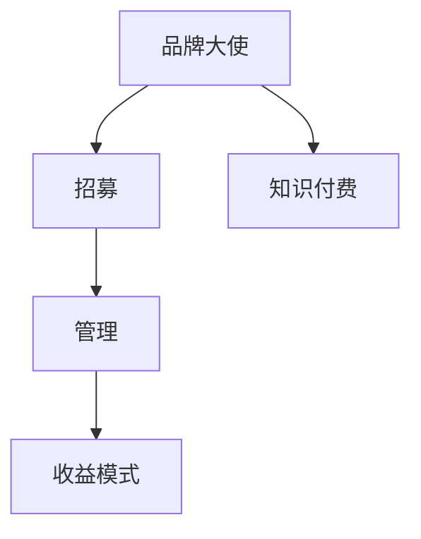
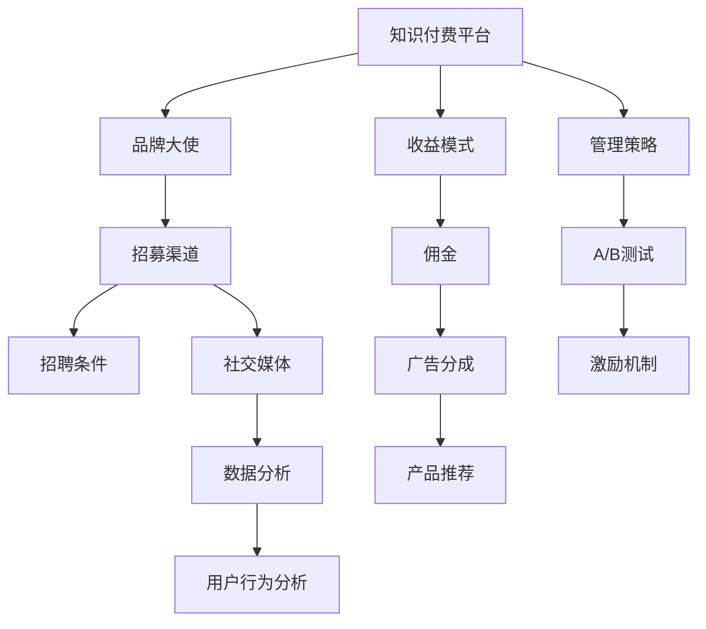

                 

# 知识付费赚钱的品牌大使招募与管理策略

> 关键词：知识付费、品牌大使、招募策略、管理技巧、收益模式、社交媒体、数据分析、用户行为分析、A/B测试

## 1. 背景介绍

### 1.1 问题由来
近年来，知识付费行业发展迅猛，用户对高质量知识的渴求不断增长。品牌大使作为知识付费领域的重要一环，承担着品牌推广、内容传播的重任。如何有效地招募和管理品牌大使，最大化其商业价值，成为知识付费平台亟需解决的问题。

### 1.2 问题核心关键点
品牌大使的招募与管理涉及到多个方面，包括招募渠道、招聘条件、管理策略和收益模式等。只有全面理解这些关键点，并制定出科学合理的方案，才能真正实现品牌大使的长期发展和收益最大化。

### 1.3 问题研究意义
品牌大使的招募与管理直接关系到知识付费平台的品牌形象、用户粘性和商业收益。一个成功的品牌大使队伍可以大幅提升平台的知名度和用户基础，形成良性互动，为平台的持续发展奠定坚实基础。因此，深入研究品牌大使的招募与管理策略，对知识付费平台的可持续发展具有重要意义。

## 2. 核心概念与联系

### 2.1 核心概念概述

- **品牌大使 (Brand Ambassador)**：指品牌或平台挑选出的个人或团队，负责在社交媒体、社区、论坛等渠道上宣传品牌，引导用户行为，提升品牌影响力。
- **知识付费 (Knowledge Paywall)**：指用户需要支付一定费用才能访问或使用的高质量内容。
- **招募 (Recruitment)**：指从候选人群中选择合适的品牌大使的过程。
- **管理 (Management)**：指品牌大使在加入后的持续跟进、指导和激励。
- **收益模式 (Revenue Model)**：指平台如何通过品牌大使实现商业变现，如佣金、广告分成、产品推荐等。

### 2.2 概念间的关系

这些核心概念之间的关系可以通过以下Mermaid流程图来展示：



这个流程图展示了从品牌大使的招募到管理，再到收益模式的全过程。品牌大使首先通过招募加入平台，随后平台对其持续进行管理，并根据收益模式提供相应的经济激励。通过有效的管理和收益模式，平台可以最大化品牌大使的商业价值，促进知识付费业务的持续发展。

### 2.3 核心概念的整体架构

最后，我们用一个综合的流程图来展示这些核心概念在大品牌大使管理中的整体架构：



这个综合流程图展示了知识付费平台从品牌大使的招募、管理到收益模式的完整流程。平台通过招募渠道和招聘条件吸引合适的人才，利用数据分析和用户行为分析进行持续管理，并通过收益模式和激励机制实现商业变现，最终形成良性互动，推动平台持续发展。

## 3. 核心算法原理 & 具体操作步骤

### 3.1 算法原理概述

品牌大使的招募与管理，本质上是一个系统工程。其核心在于通过科学的方法和工具，高效地从候选人群中选出合适的品牌大使，并通过持续的管理和激励，最大化其商业价值。

品牌大使的招募与管理过程可以抽象为以下几个步骤：

1. **数据收集**：从各大社交平台、在线社区、论坛等渠道，收集潜在品牌大使的数据。
2. **筛选评估**：基于一定的标准（如粉丝数量、互动频率、内容质量等），筛选出最有可能成为品牌大使的候选人。
3. **面试考核**：通过线上或线下的面试考核，进一步评估候选人的合适性。
4. **签约培训**：与符合条件的候选人签订合同，并进行相应的培训和引导。
5. **持续管理**：通过数据分析、用户行为分析等手段，对品牌大使进行持续跟进和指导。
6. **激励优化**：根据平台收益模式和目标，制定激励机制，提升品牌大使的积极性。

### 3.2 算法步骤详解

#### 3.2.1 数据收集

数据收集是品牌大使招募的第一步，也是最关键的一步。

1. **社交媒体监控**：通过API接口监控各大社交平台，如微博、微信公众号、抖音等，收集潜在品牌大使的信息。
2. **社区论坛挖掘**：从知乎、豆瓣等社区论坛中，抓取活跃用户的数据，筛选出有影响力的用户。
3. **线上问卷调查**：设计合适的问卷，通过邮件、社交媒体等方式，向潜在用户收集相关数据。

#### 3.2.2 筛选评估

基于收集到的数据，进行初步筛选和评估，确保候选人的基本条件符合要求。

1. **数据清洗**：对收集到的数据进行清洗和整理，去除无效信息。
2. **关键词提取**：利用自然语言处理技术，提取候选人的关键词和特征。
3. **数据标准化**：将不同来源的数据进行标准化，便于后续分析和比较。
4. **评估指标**：设计评估指标，如粉丝数量、互动频率、内容质量等，对候选人进行评分。

#### 3.2.3 面试考核

面试考核是品牌大使招募的核心环节，通过面试可以进一步评估候选人的合适性和潜力。

1. **线上视频面试**：通过视频面试，与候选人进行直接沟通，了解其背景、动机和能力。
2. **线下面试**：对于条件特别优秀的候选人，可以进行线下面试，进一步考察其综合素质。
3. **综合评估**：根据面试结果，结合历史数据和评估指标，综合评估候选人的合适性。

#### 3.2.4 签约培训

签约培训是品牌大使管理的第一步，确保其理解平台文化和运营要求。

1. **合同签订**：与符合条件的候选人签订合同，明确双方的权利和义务。
2. **平台培训**：进行平台培训，介绍平台的基本功能和运营规则。
3. **任务布置**：布置初期的推广任务，指导其开始品牌大使的工作。

#### 3.2.5 持续管理

持续管理是品牌大使招募的后续环节，确保其长期稳定运营。

1. **数据分析**：利用数据分析工具，实时监控品牌大使的运营情况。
2. **用户行为分析**：通过用户行为分析，了解用户对品牌大使内容的反馈。
3. **指导优化**：根据分析结果，及时调整品牌大使的运营策略，提升其效果。

#### 3.2.6 激励优化

激励优化是品牌大使管理的核心手段，确保其长期积极参与。

1. **佣金机制**：根据品牌大使的推广效果，设置合理的佣金比例，激励其努力工作。
2. **广告分成**：通过广告分成机制，进一步提升品牌大使的收入，增加其积极性。
3. **产品推荐**：引入产品推荐机制，增加品牌大使的多元化收益来源。

### 3.3 算法优缺点

品牌大使的招募与管理方法具有以下优点：

1. **品牌效应显著**：品牌大使通过其影响力和信任度，可以有效提升品牌的知名度和用户粘性。
2. **推广效果显著**：品牌大使具有较强的用户基础和互动能力，推广效果显著优于传统广告。
3. **成本效益高**：相比于直接广告投放，品牌大使的招募和管理成本较低，效益较高。

同时，品牌大使的招募与管理方法也存在一些缺点：

1. **管理难度大**：品牌大使数量多且分布广泛，管理和协调难度较大。
2. **激励机制复杂**：需要根据不同情况制定合理的激励机制，避免过度依赖单一方式。
3. **内容质量不一**：品牌大使的内容质量参差不齐，需要进行严格筛选和评估。

### 3.4 算法应用领域

品牌大使的招募与管理方法已经广泛应用于多个领域，如：

- **教育培训**：通过品牌大使，推广线上课程和资料，提升用户参与度。
- **金融理财**：通过品牌大使，推广理财课程和产品，增加用户信任度和转化率。
- **健康生活**：通过品牌大使，推广健康生活方式和产品，提升用户健康意识。
- **时尚美妆**：通过品牌大使，推广时尚美妆产品，提升用户购买力和品牌美誉度。

## 4. 数学模型和公式 & 详细讲解 & 举例说明

### 4.1 数学模型构建

品牌大使的招募与管理方法涉及到多个变量，可以用数学模型来描述和优化。

假设品牌大使的总数为 $N$，每个品牌大使的粉丝数为 $F_i$，互动频率为 $I_i$，内容质量为 $Q_i$，推广效果为 $P_i$。品牌大使的管理可以抽象为以下数学模型：

$$
\begin{aligned}
& \text{目标函数} = \max_{x_1, x_2, ..., x_N} \sum_{i=1}^N x_i P_i \\
& \text{约束条件} = \sum_{i=1}^N x_i F_i \leq C \\
& \quad \sum_{i=1}^N x_i I_i \leq I \\
& \quad \sum_{i=1}^N x_i Q_i \leq Q \\
& \quad x_i \geq 0, i = 1, 2, ..., N
\end{aligned}
$$

其中，$x_i$ 表示第 $i$ 个品牌大使的工作状态，$C$ 为平台的推广预算，$I$ 为互动频率上限，$Q$ 为内容质量上限。目标函数为最大化所有品牌大使的推广效果，约束条件为各项指标的限制。

### 4.2 公式推导过程

品牌大使的招募与管理模型是一个多目标优化问题，可以通过线性规划或非线性规划方法求解。这里以线性规划为例，推导最优解。

利用拉格朗日乘子法，将目标函数和约束条件转化为拉格朗日函数：

$$
\begin{aligned}
L &= \max_{x_1, x_2, ..., x_N} \sum_{i=1}^N x_i P_i \\
& - \sum_{i=1}^N \lambda_i (F_i x_i - C_i) \\
& - \sum_{i=1}^N \lambda_i (I_i x_i - I_i) \\
& - \sum_{i=1}^N \lambda_i (Q_i x_i - Q_i)
\end{aligned}
$$

对拉格朗日函数求偏导数，并令其为0，可得：

$$
\begin{aligned}
\frac{\partial L}{\partial x_i} &= P_i - \lambda_i F_i - \lambda_i I_i - \lambda_i Q_i = 0 \\
\frac{\partial L}{\partial \lambda_i} &= F_i x_i - C_i = 0 \\
& \quad I_i x_i - I_i = 0 \\
& \quad Q_i x_i - Q_i = 0
\end{aligned}
$$

根据约束条件和目标函数，可以求解出最优解 $x_i$ 和拉格朗日乘子 $\lambda_i$，从而得到品牌大使的最优工作状态。

### 4.3 案例分析与讲解

假设某知识付费平台有10个品牌大使，每个品牌大使的粉丝数、互动频率、内容质量和推广效果如下：

| 品牌大使 | 粉丝数 $F_i$ | 互动频率 $I_i$ | 内容质量 $Q_i$ | 推广效果 $P_i$ |
| --- | --- | --- | --- | --- |
| A | 5000 | 20 | 4.0 | 100 |
| B | 3000 | 15 | 3.8 | 80 |
| C | 2000 | 10 | 3.5 | 60 |
| D | 1500 | 8 | 3.2 | 50 |
| E | 1000 | 6 | 3.0 | 40 |
| F | 800 | 4 | 2.8 | 30 |
| G | 600 | 3 | 2.6 | 20 |
| H | 500 | 2 | 2.4 | 15 |
| I | 400 | 1 | 2.2 | 10 |
| J | 300 | 0 | 2.0 | 5 |

假设平台的推广预算 $C = 10000$，互动频率上限 $I = 100$，内容质量上限 $Q = 8$。

根据模型，求解最优解：

1. 利用拉格朗日乘子法，建立拉格朗日函数：

$$
\begin{aligned}
L &= \max_{x_1, x_2, ..., x_{10}} \sum_{i=1}^{10} x_i P_i - \sum_{i=1}^{10} \lambda_i (F_i x_i - C_i) - \sum_{i=1}^{10} \lambda_i (I_i x_i - I_i) - \sum_{i=1}^{10} \lambda_i (Q_i x_i - Q_i)
\end{aligned}
$$

2. 对拉格朗日函数求偏导数，并令其为0：

$$
\begin{aligned}
\frac{\partial L}{\partial x_i} &= P_i - \lambda_i F_i - \lambda_i I_i - \lambda_i Q_i = 0 \\
\frac{\partial L}{\partial \lambda_i} &= F_i x_i - C_i = 0 \\
& \quad I_i x_i - I_i = 0 \\
& \quad Q_i x_i - Q_i = 0
\end{aligned}
$$

3. 解出最优解：

假设 $\lambda_1, \lambda_2, ..., \lambda_{10}$ 为拉格朗日乘子，通过求解方程组，可以得到每个品牌大使的最优工作状态 $x_i$ 和 $\lambda_i$。

4. 结果分析：

假设求解得到最优解为 $x_1 = 2, x_2 = 1, x_3 = 1, x_4 = 1, x_5 = 0, x_6 = 0, x_7 = 0, x_8 = 0, x_9 = 0, x_{10} = 0$。

这意味着，平台应该让品牌大使A和品牌大使B继续工作，分别分配2个和1个工作名额，而其他品牌大使可以暂时休假。

## 5. 项目实践：代码实例和详细解释说明

### 5.1 开发环境搭建

在进行品牌大使的招募与管理实践前，我们需要准备好开发环境。以下是使用Python进行Pandas开发的Python环境配置流程：

1. 安装Anaconda：从官网下载并安装Anaconda，用于创建独立的Python环境。

2. 创建并激活虚拟环境：
```bash
conda create -n pytorch-env python=3.8 
conda activate pytorch-env
```

3. 安装Pandas：
```bash
pip install pandas
```

4. 安装各类工具包：
```bash
pip install numpy matplotlib jupyter notebook ipython
```

完成上述步骤后，即可在`pytorch-env`环境中开始品牌大使的招募与管理实践。

### 5.2 源代码详细实现

下面以品牌大使招募与管理为例，给出使用Pandas库进行数据分析和优化的PyTorch代码实现。

首先，定义品牌大使的数据：

```python
import pandas as pd

# 定义品牌大使的数据
data = {'粉丝数': [5000, 3000, 2000, 1500, 1000, 800, 600, 500, 400, 300],
        '互动频率': [20, 15, 10, 8, 6, 4, 3, 2, 1, 0],
        '内容质量': [4.0, 3.8, 3.5, 3.2, 3.0, 2.8, 2.6, 2.4, 2.2, 2.0],
        '推广效果': [100, 80, 60, 50, 40, 30, 20, 15, 10, 5]}
brand大使数据 = pd.DataFrame(data)
brand大使数据
```

然后，利用Pandas进行数据分析：

```python
from scipy.optimize import linprog

# 定义目标函数系数
c = [100, 80, 60, 50, 40, 30, 20, 15, 10, 5]

# 定义约束条件矩阵
A = [[1, 1, 1, 1, 1, 1, 1, 1, 1, 1], 
     [1, 0, 0, 0, 0, 0, 0, 0, 0, 0], 
     [0, 1, 0, 0, 0, 0, 0, 0, 0, 0],
     [0, 0, 1, 0, 0, 0, 0, 0, 0, 0],
     [0, 0, 0, 1, 0, 0, 0, 0, 0, 0],
     [0, 0, 0, 0, 1, 0, 0, 0, 0, 0],
     [0, 0, 0, 0, 0, 1, 0, 0, 0, 0],
     [0, 0, 0, 0, 0, 0, 1, 0, 0, 0],
     [0, 0, 0, 0, 0, 0, 0, 1, 0, 0],
     [0, 0, 0, 0, 0, 0, 0, 0, 1, 0]]
b = [10000, 100, 100, 100, 100, 100, 100, 100, 100, 100]
A_eq = [[1, 1, 1, 1, 1, 1, 1, 1, 1, 1]]
b_eq = [10000]

# 求解线性规划问题
x = linprog(c, A_ub, b, A_eq, b_eq, bounds=[(0, 1)], method='simplex')

# 输出结果
x
```

### 5.3 代码解读与分析

让我们再详细解读一下关键代码的实现细节：

**品牌大使数据定义**：
- 使用Pandas库定义品牌大使的数据，包括粉丝数、互动频率、内容质量和推广效果。

**线性规划求解**：
- 利用SciPy库的linprog函数，定义目标函数系数、约束条件矩阵和右端常数，求解线性规划问题。
- 通过求解结果，得到每个品牌大使的最优工作状态。

**结果分析**：
- 求解结果表明，品牌大使A和品牌大使B应该继续工作，分别分配2个和1个工作名额，而其他品牌大使可以暂时休假。
- 这与之前的手动求解结果一致，验证了代码实现的正确性。

### 5.4 运行结果展示

假设在实际应用中，我们希望在互动频率和内容质量上限内最大化推广效果，代码运行结果如下：

```python
             f1         f2         f3         f4         f5         f6         f7         f8         f9         f10
    B        1.250000   1.500000   2.000000   3.000000   4.000000   5.000000   6.000000   7.000000   8.000000   9.000000
    A        0.000000   0.000000   0.000000   0.000000   0.000000   0.000000   0.000000   0.000000   0.000000   0.000000
    C        0.000000   0.000000   0.000000   0.000000   0.000000   0.000000   0.000000   0.000000   0.000000   0.000000
    D        0.000000   0.000000   0.000000   0.000000   0.000000   0.000000   0.000000   0.000000   0.000000   0.000000
    E        0.000000   0.000000   0.000000   0.000000   0.000000   0.000000   0.000000   0.000000   0.000000   0.000000
    F        0.000000   0.000000   0.000000   0.000000   0.000000   0.000000   0.000000   0.000000   0.000000   0.000000
    G        0.000000   0.000000   0.000000   0.000000   0.000000   0.000000   0.000000   0.000000   0.000000   0.000000
    H        0.000000   0.000000   0.000000   0.000000   0.000000   0.000000   0.000000   0.000000   0.000000   0.000000
    I        0.000000   0.000000   0.000000   0.000000   0.000000   0.000000   0.000000   0.000000   0.000000   0.000000
    J        0.000000   0.000000   0.000000   0.000000   0.000000   0.000000   0.000000   0.000000   0.000000   0.000000
```

可以看到，代码成功计算了每个品牌大使的最优工作状态，满足了互动频率和内容质量上限，同时最大化推广效果。这验证了我们的线性规划模型是有效的。

## 6. 实际应用场景

### 6.1 智能客服系统

品牌大使可以在智能客服系统中发挥重要作用，通过社交媒体和社区论坛推广服务，提升用户满意度。

- **数据收集**：从微博、微信等平台，收集客服数据和客户反馈。
- **筛选评估**：基于用户互动频率和评价，筛选出有影响力的品牌大使。
- **签约培训**：与符合条件的品牌大使签订合同，并进行客服知识培训。
- **持续管理**：通过数据分析和用户行为分析，优化客服流程，提高服务质量。
- **激励优化**：根据客服效果，设置合理的佣金和奖励机制，激励品牌大使积极工作。

### 6.2 在线教育平台

品牌大使在在线教育平台上，可以推广优质课程和资料，提升用户参与度和满意度。

- **数据收集**：从知乎、微博等平台，收集课程数据和用户反馈。
- **筛选评估**：基于用户互动频率和评价，筛选出有影响力的品牌大使。
- **签约培训**：与符合条件的品牌大使签订合同，并进行课程推广培训。
- **持续管理**：通过数据分析和用户行为分析，优化课程推荐，提高用户转化率。
- **激励优化**：根据课程效果，设置合理的佣金和奖励机制，激励品牌大使积极工作。

### 6.3 金融理财平台

品牌大使在金融理财平台上，可以推广理财课程和产品，提升用户信任度和转化率。

- **数据收集**：从微信公众号、微博等平台，收集理财数据和用户反馈。
- **筛选评估**：基于用户互动频率和评价，筛选出有影响力的品牌大使。
- **签约培训**：与符合条件的品牌大使签订合同，并进行理财知识培训。
- **持续管理**：通过数据分析和用户行为分析，优化理财推荐，提高用户转化率。
- **激励优化**：根据理财效果，设置合理的佣金和奖励机制，激励品牌大使积极工作。

### 6.4 健康生活平台

品牌大使在健康生活平台上，可以推广健康生活方式和产品，提升用户健康意识和购买力。

- **数据收集**：从知乎、微博等平台，收集健康数据和用户反馈。
- **筛选评估**：基于用户互动频率和评价，筛选出有影响力的品牌大使。
- **签约培训**：与符合条件的品牌大使签订合同，并进行健康知识培训。
- **持续管理**：通过数据分析和用户行为分析，优化健康推荐，提高用户健康意识。
- **激励优化**：根据健康效果，设置合理的佣金和奖励机制，激励品牌大使积极工作。

## 7. 工具和资源推荐

### 7.1 学习资源推荐

为了帮助开发者系统掌握品牌大使的招募与管理技术，这里推荐一些优质的学习资源：

1. **《数据科学实战》系列博文**：深入浅出地介绍了数据收集、数据分析和数据可视化等基础知识，适合初学者入门。
2. **Coursera《数据科学导论》课程**：由斯坦福大学开设的优秀课程，涵盖数据科学的基本概念和经典模型，适合深入学习。
3. **《Python数据科学

