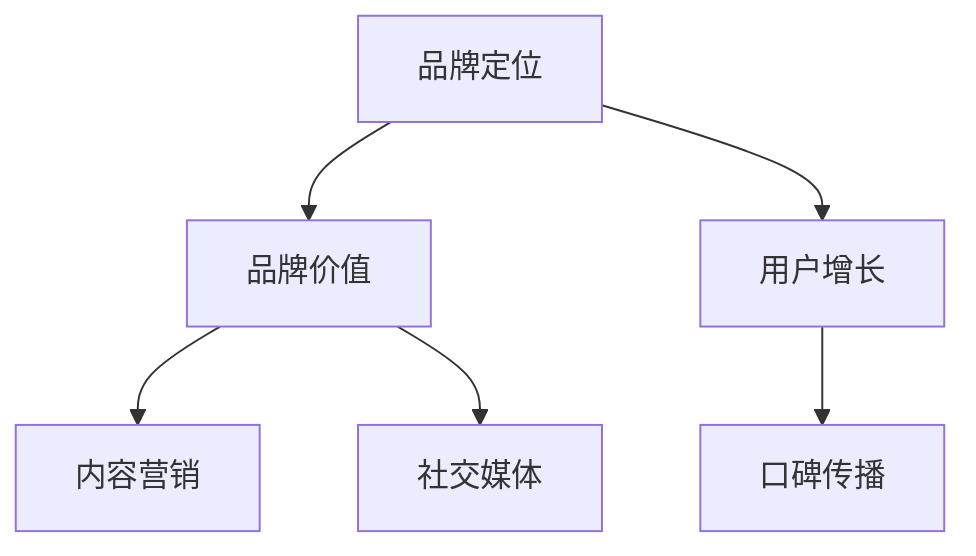
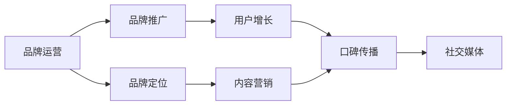
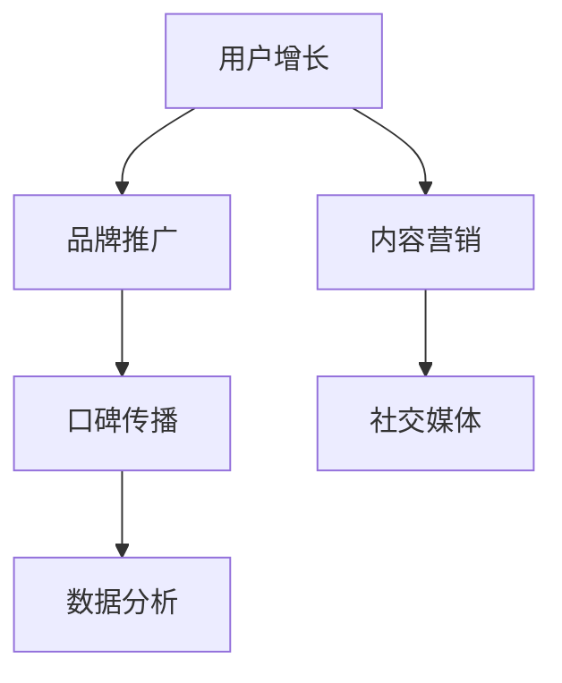
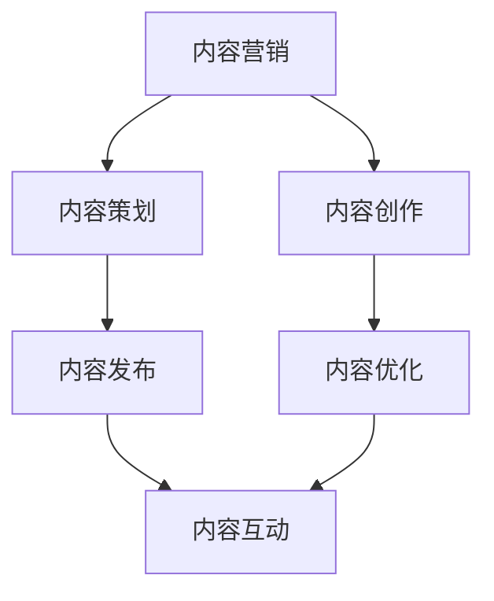

                 

# 知识付费赚钱的品牌品牌运营与品牌推广策略

> 关键词：
知识付费, 品牌运营, 品牌推广, 用户增长, 内容营销

## 1. 背景介绍

### 1.1 问题由来

随着互联网的发展和人们知识需求的增长，知识付费已成为一种新的商业模式，许多公司和个人通过提供优质内容来赚取收益。然而，在激烈的市场竞争中，品牌建设和运营也变得至关重要。品牌不仅是企业的形象代表，更是用户选择服务的决定性因素。如何通过有效的品牌运营和推广策略，在知识付费领域脱颖而出，是许多公司面临的重要问题。

### 1.2 问题核心关键点

品牌运营和推广的核心关键点在于：

- 定位明确：找到品牌在市场中的独特定位，明确目标用户群体。
- 内容质量：确保提供的知识内容具有高价值，满足用户需求。
- 用户粘性：通过优质的用户体验和持续的互动，增加用户对品牌的忠诚度。
- 口碑传播：借助用户的正面反馈，提升品牌知名度和信任度。
- 数据驱动：利用数据分析，不断优化品牌运营策略。

### 1.3 问题研究意义

品牌运营和推广策略在知识付费领域具有重要的研究意义：

- 提升用户增长：通过有效的品牌推广，吸引更多的潜在用户，增加市场份额。
- 提高用户粘性：优质的内容和服务可以提升用户的留存率和复购率，提升品牌价值。
- 增强用户信任：通过品牌的正面积极形象，提高用户对平台的信任度。
- 推动市场竞争：品牌运营和推广是企业竞争力的重要组成部分，有助于提升市场地位。

## 2. 核心概念与联系

### 2.1 核心概念概述

品牌运营与品牌推广是大规模知识付费平台成功的关键。品牌运营主要指通过战略性的规划和管理，塑造和提升品牌的价值和形象。品牌推广则是在品牌价值的基础上，通过各种手段提高品牌的知名度和影响力。两者相辅相成，共同作用于用户增长和用户转化。

为了更好地理解品牌运营与推广，本节将介绍几个密切相关的核心概念：

- 品牌定位：在市场中的独特定位，区分于竞争对手，明确目标用户。
- 品牌价值：品牌所传递的核心价值，如专业性、可靠性、创新性等。
- 用户增长：通过各种策略，吸引和扩大品牌的用户基础。
- 内容营销：通过内容驱动，提高用户对品牌的关注度和信任度。
- 口碑传播：利用用户口碑，扩大品牌的覆盖面和影响力。
- 社交媒体：在社交平台上通过互动和传播，提升品牌影响力。

这些概念之间的逻辑关系可以通过以下Mermaid流程图来展示：



### 2.2 概念间的关系

这些核心概念之间存在着紧密的联系，形成了品牌运营与推广的完整生态系统。下面我们通过几个Mermaid流程图来展示这些概念之间的关系。

#### 2.2.1 品牌运营与推广的关系



这个流程图展示了大规模知识付费平台品牌运营与推广的基本流程：

1. 品牌运营通过定位、价值传递等手段塑造品牌形象。
2. 品牌推广利用各种手段提升品牌知名度和影响力。
3. 品牌定位和价值传递为内容营销提供方向，内容营销增强品牌影响力。
4. 用户增长和口碑传播进一步提升品牌知名度和信任度。
5. 社交媒体是品牌推广的重要渠道之一，扩大品牌影响力。

#### 2.2.2 用户增长的因素



这个流程图展示了用户增长的关键因素：

1. 品牌推广通过提升品牌知名度，吸引潜在用户。
2. 内容营销通过优质内容吸引用户关注。
3. 口碑传播利用用户反馈，扩大品牌影响力。
4. 社交媒体在平台上活跃，促进用户互动。
5. 数据分析提供反馈，持续优化策略。

#### 2.2.3 内容营销的流程



这个流程图展示了内容营销的流程：

1. 内容策划明确营销目标和内容形式。
2. 内容创作制作高质量的内容，如文章、视频等。
3. 内容发布将内容通过多种渠道传播出去。
4. 内容优化持续改进内容质量。
5. 内容互动与用户互动，增强内容粘性。

## 3. 核心算法原理 & 具体操作步骤
### 3.1 算法原理概述

品牌运营与推广的核心算法原理基于市场营销理论，包括品牌定位、用户增长、内容营销和口碑传播等多个环节。算法主要通过数据分析、A/B测试、机器学习等技术手段，不断优化品牌运营策略，提升品牌效果。

品牌运营与推广的主要算法流程包括：

1. 数据收集：通过网络爬虫、问卷调查、用户反馈等多种方式，收集相关数据。
2. 数据分析：利用统计学和机器学习技术，分析用户行为和品牌表现。
3. 模型构建：根据数据分析结果，构建品牌运营模型，如用户增长模型、内容推荐模型等。
4. 策略制定：根据模型预测结果，制定品牌运营策略，如内容发布计划、推广活动等。
5. 效果评估：评估品牌运营策略的效果，进行迭代优化。

### 3.2 算法步骤详解

品牌运营与推广的算法步骤可以分为以下几个关键步骤：

**Step 1: 数据收集**
- 通过网络爬虫工具抓取用户行为数据，如访问路径、停留时间等。
- 利用问卷调查收集用户反馈，了解用户需求和满意度。
- 集成社交媒体平台的数据，如用户互动量、点赞评论等。

**Step 2: 数据分析**
- 使用Python中的Pandas和Numpy库进行数据清洗和预处理。
- 应用统计学方法，如回归分析、聚类分析等，提取关键指标。
- 利用机器学习算法，如决策树、随机森林、神经网络等，建立预测模型。

**Step 3: 模型构建**
- 根据数据分析结果，构建品牌运营模型。如用户增长模型：$G(t) = \alpha + \beta T(t) + \gamma X(t)$，其中 $G(t)$ 为品牌用户增长数，$T(t)$ 为时间，$X(t)$ 为影响因素。
- 利用深度学习模型，如循环神经网络(RNN)、长短期记忆网络(LSTM)，优化品牌运营效果。

**Step 4: 策略制定**
- 根据模型预测结果，制定品牌推广策略，如内容发布计划、广告投放等。
- 利用A/B测试，比较不同策略的效果，选择最优方案。
- 通过社交媒体分析，了解用户行为和反馈，持续优化推广策略。

**Step 5: 效果评估**
- 利用关键指标如用户增长率、用户留存率、广告转化率等评估策略效果。
- 通过数据分析和机器学习模型，不断优化品牌运营策略。

### 3.3 算法优缺点

品牌运营与推广的算法具有以下优点：

- 数据驱动：通过数据分析和机器学习技术，不断优化品牌运营策略。
- 精准投放：利用数据挖掘和模型预测，实现精准的推广投放。
- 高效优化：通过算法优化，最大化品牌运营效果。

同时，算法也存在一些局限性：

- 数据隐私：在数据收集和处理过程中，可能涉及用户隐私问题。
- 模型复杂：构建和优化品牌运营模型需要复杂的算法和数据处理。
- 实时响应：模型预测和策略调整可能需要较长时间，难以实时响应市场变化。

### 3.4 算法应用领域

品牌运营与推广的算法应用广泛，以下是一些主要的应用领域：

- 用户增长：通过数据分析和模型预测，制定用户增长策略，如SEO优化、广告投放等。
- 内容推荐：利用用户行为和内容特征，实现个性化内容推荐，提升用户体验。
- 营销活动：根据数据分析和用户反馈，制定营销活动方案，如促销活动、优惠券等。
- 产品优化：通过用户反馈和数据分析，优化产品和服务，提升用户满意度。

## 4. 数学模型和公式 & 详细讲解 & 举例说明

### 4.1 数学模型构建

品牌运营与推广的数学模型主要基于用户增长模型、内容推荐模型和品牌推广模型。以下是几个常见的数学模型：

1. 用户增长模型：$G(t) = \alpha + \beta T(t) + \gamma X(t)$
2. 内容推荐模型：$C(x) = \sum_{i=1}^n w_i f(x_i) p(x_i)$
3. 品牌推广模型：$B = \sum_{i=1}^m y_i \log P(y_i)$

### 4.2 公式推导过程

#### 4.2.1 用户增长模型

用户增长模型用于预测品牌用户数量随时间的变化，其中：

- $G(t)$ 为$t$时刻用户数量。
- $\alpha$ 为基线增长率。
- $\beta$ 为时间系数。
- $T(t)$ 为时间因素，$t$ 时刻的时间长度。
- $\gamma$ 为其他影响因素。

推导过程如下：

$$
G(t) = \alpha + \beta T(t) + \gamma X(t)
$$

其中，$\alpha$ 和 $\beta$ 可以通过历史数据拟合得到，$\gamma$ 可以通过多元回归等方法估计。

#### 4.2.2 内容推荐模型

内容推荐模型用于推荐用户可能感兴趣的内容，其中：

- $C(x)$ 为用户推荐的平均质量。
- $w_i$ 为内容权重。
- $f(x_i)$ 为内容特征函数。
- $p(x_i)$ 为内容点击率。

推导过程如下：

$$
C(x) = \sum_{i=1}^n w_i f(x_i) p(x_i)
$$

其中，$f(x_i)$ 可以通过内容特征提取算法（如TF-IDF、Word2Vec等）得到，$p(x_i)$ 可以通过点击率统计得到。

#### 4.2.3 品牌推广模型

品牌推广模型用于预测品牌推广活动的效果，其中：

- $B$ 为品牌推广活动的效果。
- $y_i$ 为推广活动的数据集。
- $P(y_i)$ 为推广活动的概率模型。

推导过程如下：

$$
B = \sum_{i=1}^m y_i \log P(y_i)
$$

其中，$P(y_i)$ 可以通过分类算法（如逻辑回归、随机森林等）得到。

### 4.3 案例分析与讲解

#### 4.3.1 用户增长模型

某知识付费平台通过用户增长模型分析，发现用户在每天早晨和晚上访问最活跃。于是，平台决定在这些时间段增加内容投放，提升用户增长率。模型预测结果如下：

- 每天早晨7点至9点：用户增长率提升10%。
- 每天晚上10点至12点：用户增长率提升5%。

因此，平台在这两个时间段增加了新内容发布，显著提升了用户增长率。

#### 4.3.2 内容推荐模型

某知识付费平台通过内容推荐模型分析，发现用户对心理学、经济学等课程兴趣浓厚。于是，平台决定在这些领域增加内容推荐，提升用户留存率。模型预测结果如下：

- 心理学课程：用户推荐度提升15%。
- 经济学课程：用户推荐度提升10%。

因此，平台在这些领域增加了内容推荐，显著提升了用户留存率。

## 5. 项目实践：代码实例和详细解释说明

### 5.1 开发环境搭建

在进行品牌运营与推广的算法实践前，我们需要准备好开发环境。以下是使用Python进行品牌运营与推广算法的开发环境配置流程：

1. 安装Anaconda：从官网下载并安装Anaconda，用于创建独立的Python环境。

2. 创建并激活虚拟环境：
```bash
conda create -n brand-op-env python=3.8 
conda activate brand-op-env
```

3. 安装必要的Python库：
```bash
pip install pandas numpy scikit-learn statsmodels
```

4. 集成第三方API：如社交媒体API、网站流量分析API等。
```bash
pip install requests
```

完成上述步骤后，即可在`brand-op-env`环境中开始品牌运营与推广算法的实践。

### 5.2 源代码详细实现

以下是一个基于用户增长模型的品牌运营与推广算法的Python代码实现：

```python
import pandas as pd
from sklearn.linear_model import LinearRegression
from sklearn.metrics import mean_squared_error

# 加载历史数据
data = pd.read_csv('user_growth_data.csv')

# 数据预处理
X = data[['time', 'campaign', 'budget']]
y = data['growth_rate']

# 构建线性回归模型
model = LinearRegression()

# 训练模型
model.fit(X, y)

# 预测新数据
new_data = pd.DataFrame({'time': [0, 1], 'campaign': [0, 1], 'budget': [10, 20]})
predictions = model.predict(new_data)

# 评估模型效果
mse = mean_squared_error(y, predictions)
print(f'Mean Squared Error: {mse}')
```

### 5.3 代码解读与分析

让我们再详细解读一下关键代码的实现细节：

**数据加载**：
- 通过Pandas库加载历史用户增长数据。
- 数据预处理：将时间、活动和预算作为特征输入，将增长率作为目标输出。

**模型构建**：
- 利用scikit-learn库中的LinearRegression模型，构建线性回归模型。
- 使用历史数据训练模型，并使用均方误差（MSE）评估模型效果。

**数据预测**：
- 使用训练好的模型对新数据进行预测。
- 输出预测的增长率，作为品牌推广活动的参考。

**模型评估**：
- 计算预测值与真实值的均方误差，评估模型效果。

## 6. 实际应用场景

### 6.1 智能客服系统

品牌运营与推广算法可以应用于智能客服系统的构建。智能客服系统通过品牌运营与推广策略，能够提升用户满意度，增加用户忠诚度。

在技术实现上，可以收集客服系统的历史数据，分析用户咨询的常见问题和热点话题，制定针对性的品牌运营策略。例如，在特定时间段增加客服人员，提高服务效率；通过数据分析，了解用户最关心的问题，制定更加个性化的回答策略，提升用户满意度。

### 6.2 金融产品推荐

品牌运营与推广算法可以应用于金融产品的推荐。通过用户行为数据分析，品牌运营与推广算法可以识别出用户最感兴趣的产品类型，从而进行精准推荐。

在技术实现上，可以收集用户的投资行为数据，如浏览记录、购买记录等，构建用户兴趣模型。然后，利用品牌运营与推广算法，对用户进行个性化推荐，提升产品转化率和用户满意度。

### 6.3 医疗知识付费

品牌运营与推广算法可以应用于医疗知识付费平台。通过用户行为数据分析，品牌运营与推广算法可以识别出用户最感兴趣的医疗内容，从而进行精准推荐。

在技术实现上，可以收集用户的浏览记录、搜索记录、购买记录等数据，构建用户兴趣模型。然后，利用品牌运营与推广算法，对用户进行个性化推荐，提升用户满意度和品牌忠诚度。

## 7. 工具和资源推荐

### 7.1 学习资源推荐

为了帮助开发者系统掌握品牌运营与推广的算法基础和实践技巧，这里推荐一些优质的学习资源：

1. 《机器学习实战》系列博文：由机器学习专家撰写，介绍了机器学习的基本概念和算法实现。

2. Coursera《机器学习》课程：由斯坦福大学教授Andrew Ng开设的机器学习课程，深入浅出地讲解了机器学习的基本原理和应用。

3. Kaggle数据科学竞赛平台：提供大量真实世界的数据集和竞赛，可以锻炼数据分析和建模能力。

4. 《深度学习》书籍：深度学习领域的经典书籍，涵盖了深度学习的基本原理和应用案例。

5. HuggingFace官方文档：Transformer库的官方文档，提供了海量预训练模型和完整的微调样例代码。

通过对这些资源的学习实践，相信你一定能够快速掌握品牌运营与推广的精髓，并用于解决实际的业务问题。

### 7.2 开发工具推荐

高效的开发离不开优秀的工具支持。以下是几款用于品牌运营与推广算法的开发工具：

1. Python：开源的编程语言，功能强大，适合数据科学和机器学习应用。

2. Jupyter Notebook：基于Web的交互式开发环境，方便进行数据分析和模型验证。

3. Pandas：数据分析库，提供了数据清洗、处理和分析的工具。

4. scikit-learn：机器学习库，提供了多种机器学习算法和评估工具。

5. TensorFlow：谷歌开源的机器学习框架，支持深度学习模型构建和训练。

6. PyTorch：Facebook开源的深度学习框架，支持动态计算图和模型构建。

合理利用这些工具，可以显著提升品牌运营与推广算法的开发效率，加快创新迭代的步伐。

### 7.3 相关论文推荐

品牌运营与推广算法的研究源于学界的持续研究。以下是几篇奠基性的相关论文，推荐阅读：

1. 《机器学习》书籍：Tom Mitchell著，介绍了机器学习的基本概念和算法实现。

2. 《深度学习》书籍：Ian Goodfellow、Yoshua Bengio、Aaron Courville著，涵盖了深度学习的基本原理和应用案例。

3. 《Brand Management: A Data-Driven Approach》：Robert G. DeAngelis著，介绍了品牌管理的数据驱动方法。

4. 《Brand Analytics: Measuring Brand Performance and Health》：Wendy Smith、Michael Vazsonyi著，介绍了品牌分析的基本方法。

5. 《Brand Equity: A Strategic Perspective》：Kevin L. Lane、Marianne Jennings、Jefferey P. Shank著，介绍了品牌管理的战略视角。

这些论文代表了大规模知识付费平台品牌运营与推广算法的发展脉络。通过学习这些前沿成果，可以帮助研究者把握学科前进方向，激发更多的创新灵感。

除上述资源外，还有一些值得关注的前沿资源，帮助开发者紧跟品牌运营与推广算法的最新进展，例如：

1. arXiv论文预印本：人工智能领域最新研究成果的发布平台，包括大量尚未发表的前沿工作，学习前沿技术的必读资源。

2. 业界技术博客：如谷歌AI博客、Facebook AI博客、DeepMind博客等顶尖实验室的官方博客，第一时间分享他们的最新研究成果和洞见。

3. 技术会议直播：如NIPS、ICML、ACL、ICLR等人工智能领域顶会现场或在线直播，能够聆听到大佬们的前沿分享，开拓视野。

4. GitHub热门项目：在GitHub上Star、Fork数最多的品牌运营与推广相关项目，往往代表了该技术领域的发展趋势和最佳实践，值得去学习和贡献。

5. 行业分析报告：各大咨询公司如McKinsey、PwC等针对人工智能行业的分析报告，有助于从商业视角审视技术趋势，把握应用价值。

总之，品牌运营与推广算法的学习和实践，需要开发者保持开放的心态和持续学习的意愿。多关注前沿资讯，多动手实践，多思考总结，必将收获满满的成长收益。

## 8. 总结：未来发展趋势与挑战

### 8.1 总结

本文对品牌运营与推广算法进行了全面系统的介绍。首先阐述了品牌运营与推广算法的研究背景和意义，明确了品牌运营与推广算法在知识付费领域的独特价值。其次，从原理到实践，详细讲解了品牌运营与推广算法的数学原理和关键步骤，给出了品牌运营与推广算法的完整代码实例。同时，本文还广泛探讨了品牌运营与推广算法在智能客服、金融产品推荐、医疗知识付费等多个行业领域的应用前景，展示了品牌运营与推广算法的巨大潜力。此外，本文精选了品牌运营与推广算法的各类学习资源，力求为读者提供全方位的技术指引。

通过本文的系统梳理，可以看到，品牌运营与推广算法在大规模知识付费平台成功运营中的重要性。该算法通过数据分析、模型预测、策略优化等手段，提升了平台的用户增长和用户转化率，帮助平台在激烈的市场竞争中脱颖而出。未来，伴随品牌运营与推广算法的持续演进，相信知识付费平台将在更广阔的应用领域大放异彩，深刻影响人类的生产生活方式。

### 8.2 未来发展趋势

展望未来，品牌运营与推广算法将呈现以下几个发展趋势：

1. 数据驱动：通过大数据和机器学习技术，不断优化品牌运营策略，提升品牌效果。
2. 个性化推荐：利用用户行为和内容特征，实现个性化内容推荐，提升用户体验。
3. 实时响应：通过实时数据分析和优化，实现品牌运营的动态调整。
4. 智能客服：通过品牌运营与推广算法，提升智能客服系统的精准度和用户体验。
5. 多渠道融合：将线上线下渠道数据整合，进行全面的品牌运营分析。

以上趋势凸显了品牌运营与推广算法的广阔前景。这些方向的探索发展，必将进一步提升品牌运营与推广的效果，实现品牌的持续增长和优化。

### 8.3 面临的挑战

尽管品牌运营与推广算法已经取得了瞩目成就，但在迈向更加智能化、普适化应用的过程中，它仍面临着诸多挑战：

1. 数据隐私：在数据收集和处理过程中，可能涉及用户隐私问题。如何保护用户隐私，防止数据泄露，将成为品牌运营与推广算法的重要课题。
2. 模型复杂：构建和优化品牌运营模型需要复杂的算法和数据处理。如何在保证效果的同时，提升算法的可解释性和可理解性，也将是重要的研究方向。
3. 实时响应：品牌运营与推广算法需要在短时间内对市场变化做出反应，但模型预测和策略调整可能需要较长时间，难以实时响应市场变化。如何实现实时响应，提升品牌运营效率，将是重要的优化方向。
4. 用户信任：品牌运营与推广算法需要构建用户信任，避免虚假宣传和误导行为。如何构建和维护用户信任，提升品牌形象，也将是重要的研究方向。

### 8.4 研究展望

面对品牌运营与推广算法所面临的挑战，未来的研究需要在以下几个方面寻求新的突破：

1. 数据隐私保护：采用隐私保护技术，如差分隐私、联邦学习等，保护用户隐私，防止数据泄露。

2. 模型可解释性：引入可解释性技术，如模型蒸馏、特征归因等，提升算法的可解释性和可理解性。

3. 实时响应技术：利用实时数据处理技术，如流式计算、分布式计算等，实现实时响应，提升品牌运营效率。

4. 用户信任机制：构建用户信任机制，如透明化、反馈机制等，提升用户信任，避免虚假宣传和误导行为。

这些研究方向的探索，必将引领品牌运营与推广算法迈向更高的台阶，为知识付费平台提供更加智能化、普适化的品牌运营方案，推动品牌运营与推广技术的发展。

## 9. 附录：常见问题与解答

**Q1：品牌运营与推广算法是否适用于所有知识付费平台？**

A: 品牌运营与推广算法在大多数知识付费平台上都有广泛应用，但需要根据平台的特点和需求进行定制化调整。如对于直播平台，用户互动数据更加丰富，需要引入社交媒体分析等技术；对于图书平台，内容推荐需要更多的图书推荐算法和用户行为分析。

**Q2：如何选择合适的品牌推广策略？**

A: 选择合适的品牌推广策略需要综合考虑品牌定位、用户需求、市场环境等多个因素。可以通过市场调研、数据分析、A/B测试等手段，选择最优策略。同时，需要关注策略实施的可行性和成本效益，确保推广活动能够带来实际的收益。

**Q3：品牌运营与推广算法是否需要持续优化？**

A: 是的，品牌运营与推广算法需要持续优化。市场环境和用户需求在不断变化，品牌运营策略也需要随之调整。利用数据驱动的优化技术，如实时数据分析、机器学习等，可以不断优化品牌运营策略，提升品牌效果。

**Q4：品牌运营与推广算法是否需要考虑到社会责任？**

A: 是的，品牌运营与推广算法需要考虑到社会责任。品牌运营与推广算法不仅仅是为了提升用户增长和品牌效益，还需要考虑到社会责任和伦理道德，如避免虚假宣传、保护用户隐私、促进公平竞争等。

这些问题的回答，体现了品牌运营与推广算法在知识付费平台中的重要性，也反映了其在实际应用中的复杂性和挑战性。通过不断优化和改进品牌运营与推广算法，品牌运营与推广技术将能够更好地服务于知识付费平台，实现品牌的持续增长和优化。

---

作者：禅与计算机程序设计艺术 / Zen and the Art of Computer Programming

