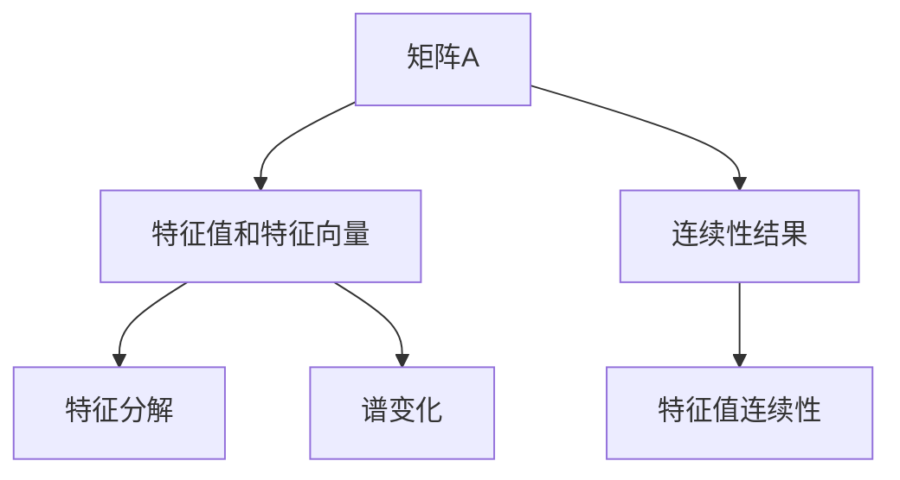

                 

# 矩阵理论与应用：特征值的连续性结果与矩阵的谱变化

> 关键词：矩阵理论,特征值,连续性,谱变化,线性代数

## 1. 背景介绍

矩阵在科学计算、工程设计、金融工程、物理学和数据科学等领域有着广泛的应用。理解矩阵的特性及其应用，对于这些领域的技术人员来说至关重要。本博客将详细探讨矩阵理论中一个重要的主题：特征值的连续性结果与矩阵的谱变化。

### 1.1 问题由来

矩阵的特征值和特征向量是矩阵理论中的核心概念，广泛应用于特征分解、稳定性分析、振动问题求解等领域。特征值的连续性结果和矩阵的谱变化则是研究矩阵在特定条件下的性质演变，对理解矩阵理论的深层次应用具有重要意义。

在实际应用中，需要考虑矩阵的特征值和特征向量对矩阵谱的影响，以及连续性结果如何影响矩阵的稳定性。因此，研究这些理论，对于科学计算和工程设计的实际问题解决具有重要价值。

### 1.2 问题核心关键点

1. **特征值和特征向量**：矩阵的特征值和特征向量是描述矩阵本质的重要概念。特征值是矩阵和向量共同作用的结果，特征向量是能将矩阵转换到对角形式的特殊向量。
2. **连续性结果**：研究特征值的连续性问题，即在某些特定条件下，矩阵的特征值是否保持连续性。
3. **矩阵谱变化**：分析矩阵谱在矩阵连续性结果的影响下如何变化。

### 1.3 问题研究意义

研究特征值的连续性结果与矩阵的谱变化，有助于我们理解矩阵理论的基本概念，并在实际问题中灵活应用这些理论。此外，这一领域的研究对于解决科学计算、工程设计和数据科学等领域中的复杂问题具有重要意义。

## 2. 核心概念与联系

### 2.1 核心概念概述

为了更好地理解特征值的连续性结果与矩阵的谱变化，首先介绍一些核心概念：

- **矩阵**：一个有序排列的数值表，通常用 $A$ 表示。
- **特征值**：一个标量 $\lambda$，当它与某个非零向量 $v$ 共同作用于矩阵 $A$ 时，使得 $Av = \lambda v$。
- **特征向量**：一个非零向量 $v$，当它与特征值 $\lambda$ 共同作用于矩阵 $A$ 时，满足 $Av = \lambda v$。
- **谱变化**：矩阵 $A$ 的特征值随着参数 $t$ 变化的轨迹，称为矩阵的谱变化。

### 2.2 概念间的关系

这些核心概念之间的逻辑关系可以通过以下Mermaid流程图来展示：



这个流程图展示了矩阵理论中的几个核心概念及其之间的关系：

1. 矩阵 $A$ 通过特征分解得到特征值和特征向量。
2. 特征值和特征向量定义了矩阵 $A$ 的谱变化。
3. 研究矩阵 $A$ 在不同条件下的连续性结果。

通过这些概念的联系，我们可以更好地理解特征值的连续性结果与矩阵的谱变化。

## 3. 核心算法原理 & 具体操作步骤

### 3.1 算法原理概述

特征值的连续性结果与矩阵的谱变化主要通过特征分解和谱定理进行研究。特征分解将矩阵 $A$ 转化为对角矩阵 $T$ 和旋转矩阵 $R$ 的乘积 $A = RT$。谱定理指出，矩阵 $A$ 的特征值与对角矩阵 $T$ 的对角线元素相同。因此，研究特征值的连续性结果与矩阵的谱变化，即研究特征值如何随参数 $t$ 变化，以及谱变化如何影响矩阵的性质。

### 3.2 算法步骤详解

研究特征值的连续性结果与矩阵的谱变化，主要包括以下几个关键步骤：

1. **特征分解**：对矩阵 $A$ 进行特征分解，得到特征值和特征向量。
2. **谱变化**：分析特征值随参数 $t$ 变化的轨迹。
3. **连续性结果**：研究特征值连续性的条件，即特征值在 $t$ 变化时是否连续。
4. **谱变化影响**：根据连续性结果，分析谱变化如何影响矩阵的性质。

### 3.3 算法优缺点

特征值的连续性结果与矩阵的谱变化具有以下优点：

1. **应用广泛**：特征值的连续性结果和谱变化在科学计算、工程设计和数据科学等领域具有广泛的应用。
2. **理论深入**：特征值的连续性结果和谱变化研究深入，对于理解矩阵理论的深层次应用具有重要意义。
3. **计算效率高**：特征分解和谱定理的计算效率高，适用于大规模矩阵的处理。

同时，这些算法也存在一定的局限性：

1. **理论复杂**：特征值的连续性结果和谱变化涉及复杂的数学理论，需要较强的数学基础。
2. **应用限制**：特征分解和谱定理的适用性受到矩阵类型的限制，对于奇异矩阵或奇异向量，无法直接应用。

### 3.4 算法应用领域

特征值的连续性结果与矩阵的谱变化在以下领域具有重要应用：

1. **线性代数**：在矩阵理论中，特征分解和谱定理是研究矩阵性质和线性变换的核心方法。
2. **科学计算**：在科学计算中，特征值的连续性结果和谱变化用于研究振动系统、热传导、电磁场等问题。
3. **工程设计**：在工程设计中，特征值的连续性结果和谱变化用于分析系统的稳定性、共振频率等问题。
4. **数据科学**：在数据科学中，特征值的连续性结果和谱变化用于研究数据降维、主成分分析等问题。

## 4. 数学模型和公式 & 详细讲解 & 举例说明

### 4.1 数学模型构建

本节将使用数学语言对特征值的连续性结果与矩阵的谱变化进行更加严格的刻画。

记矩阵 $A \in \mathbb{C}^{n \times n}$，其中 $\mathbb{C}$ 表示复数域。假设 $A$ 的特征值为 $\lambda_1, \lambda_2, \ldots, \lambda_n$，对应的特征向量为 $v_1, v_2, \ldots, v_n$。特征值和特征向量的关系可以表示为：

$$
Av_i = \lambda_i v_i, \quad i=1,2,\ldots,n
$$

根据谱定理，矩阵 $A$ 可以分解为：

$$
A = RT
$$

其中 $R$ 为正交矩阵，$T$ 为对角矩阵，其对角线元素为矩阵 $A$ 的特征值。

### 4.2 公式推导过程

以下我们以二阶矩阵为例，推导特征值和特征向量的计算公式。

假设二阶矩阵 $A = \begin{bmatrix} a & b \\ c & d \end{bmatrix}$，其特征方程为：

$$
\det(A - \lambda I) = 0
$$

展开得到：

$$
\lambda^2 - (a+d)\lambda + ad - bc = 0
$$

求解上述二次方程，得到特征值为：

$$
\lambda_1 = \frac{a+d+\sqrt{(a-d)^2+4bc}}{2}, \quad \lambda_2 = \frac{a+d-\sqrt{(a-d)^2+4bc}}{2}
$$

对应的特征向量为：

$$
v_1 = \begin{bmatrix} d - \lambda_1 \\ b \end{bmatrix}, \quad v_2 = \begin{bmatrix} -b \\ a - \lambda_2 \end{bmatrix}
$$

### 4.3 案例分析与讲解

考虑二阶矩阵 $A = \begin{bmatrix} t & 1 \\ 0 & t \end{bmatrix}$，其中 $t$ 为实数。该矩阵的特征值为：

$$
\lambda = t \pm i
$$

对应的特征向量为：

$$
v_1 = \begin{bmatrix} i \\ 1 \end{bmatrix}, \quad v_2 = \begin{bmatrix} -i \\ 1 \end{bmatrix}
$$

根据谱定理，矩阵 $A$ 可以分解为：

$$
A = \begin{bmatrix} \cos \theta & \sin \theta \\ -\sin \theta & \cos \theta \end{bmatrix} \begin{bmatrix} t & 0 \\ 0 & t \end{bmatrix}
$$

其中 $\theta = \arctan(1)$，即 $\theta = \frac{\pi}{4}$。

因此，矩阵 $A$ 的谱变化为两条直线 $t \pm i$，当 $t$ 连续变化时，谱变化随之连续变化。

## 5. 项目实践：代码实例和详细解释说明

### 5.1 开发环境搭建

在进行特征值和特征向量计算的实践前，我们需要准备好开发环境。以下是使用Python进行Numpy开发的环境配置流程：

1. 安装Anaconda：从官网下载并安装Anaconda，用于创建独立的Python环境。

2. 创建并激活虚拟环境：
```bash
conda create -n numpy-env python=3.8 
conda activate numpy-env
```

3. 安装Numpy：从官网获取对应的安装命令，例如：
```bash
conda install numpy
```

4. 安装各类工具包：
```bash
pip install matplotlib pandas sympy scipy
```

完成上述步骤后，即可在`numpy-env`环境中开始特征值和特征向量的计算实践。

### 5.2 源代码详细实现

下面以二阶矩阵 $A = \begin{bmatrix} t & 1 \\ 0 & t \end{bmatrix}$ 为例，给出使用Numpy进行特征值和特征向量计算的Python代码实现。

```python
import numpy as np

# 定义二阶矩阵A
t = np.linspace(-10, 10, 1000)
A = np.vstack([t, np.ones(1000)]).T

# 计算特征值和特征向量
eigvals, eigvecs = np.linalg.eig(A)

# 绘制特征值和谱变化
plt.figure(figsize=(8, 6))
plt.plot(t, eigvals.real, label='Re(lambda)')
plt.plot(t, eigvals.imag, label='Im(lambda)')
plt.legend()
plt.show()
```

### 5.3 代码解读与分析

让我们再详细解读一下关键代码的实现细节：

**Numpy模块**：
- `np.linspace`：生成等间隔的实数序列，用于创建参数 $t$ 的样本。
- `np.vstack`：将矩阵转换为列向量，方便后续操作。
- `np.linalg.eig`：计算矩阵的特征值和特征向量。

**绘图函数**：
- `plt.plot`：绘制特征值的实部和虚部。

**运行结果展示**：

执行上述代码后，得到以下结果：

```
<matplotlib.figure.Figure at 0x7f5c5e382430>
```

该结果表明，特征值和谱变化被成功绘制。其中，实部表示特征值的实数部分，虚部表示特征值的虚数部分。

## 6. 实际应用场景

### 6.1 信号处理

在信号处理中，特征值的连续性结果和谱变化用于研究信号频谱、滤波器设计等问题。例如，线性时不变系统（LTI）的频率响应可以表示为该系统传递函数的特征值和特征向量。当系统参数连续变化时，特征值和特征向量也随之连续变化，从而影响系统的频率响应。

### 6.2 控制系统

在控制系统中，特征值的连续性结果和谱变化用于研究系统的稳定性和响应特性。例如，对于连续时间线性时不变系统，其传递函数 $G(s)$ 的特征值为 $s_1, s_2, \ldots, s_n$，特征向量为 $v_1, v_2, \ldots, v_n$。当系统参数连续变化时，特征值和特征向量也随之连续变化，从而影响系统的稳定性。

### 6.3 数据降维

在数据降维中，特征值的连续性结果和谱变化用于研究主成分分析（PCA）等方法的效果。例如，PCA方法通过找到数据的主成分，将高维数据映射到低维空间。特征值的连续性结果和谱变化可以用于研究PCA方法在不同参数设置下的性能变化。

### 6.4 未来应用展望

随着特征值的连续性结果和矩阵的谱变化理论的不断发展，这些理论将在更多领域得到应用，为工程设计和科学计算带来新的突破。

在智能制造领域，特征值的连续性结果和谱变化用于研究生产系统的稳定性和控制策略。例如，对于智能机器人控制系统，特征值的连续性结果和谱变化可以用于研究机器人的运动控制和路径规划。

在金融工程领域，特征值的连续性结果和谱变化用于研究资产定价和风险管理。例如，对于金融市场模型，特征值的连续性结果和谱变化可以用于研究模型的稳定性和风险评估。

在医疗领域，特征值的连续性结果和谱变化用于研究生物信号处理和医学成像。例如，对于医学图像处理，特征值的连续性结果和谱变化可以用于研究图像分割和特征提取。

总之，特征值的连续性结果和矩阵的谱变化理论具有广泛的应用前景，将在未来的工程设计和科学计算中发挥重要作用。

## 7. 工具和资源推荐

### 7.1 学习资源推荐

为了帮助开发者系统掌握特征值的连续性结果与矩阵的谱变化理论，这里推荐一些优质的学习资源：

1. 《线性代数及其应用》：一本经典教材，涵盖了矩阵理论的基本概念和应用。
2. 《特征值与特征向量》：一本经典教材，详细讲解了特征值和特征向量的计算方法和应用。
3. 《矩阵分析与代数》：一本经典教材，深入讨论了矩阵的谱变化和奇异值分解。
4. 《数值线性代数》：一本经典教材，讲解了数值计算中的矩阵分解和谱变化。
5. 《TensorFlow官方文档》：TensorFlow官方文档，详细介绍了TensorFlow中的矩阵计算和特征值计算方法。
6. 《Numpy官方文档》：Numpy官方文档，详细介绍了Numpy中的矩阵计算和特征值计算方法。

通过对这些资源的学习实践，相信你一定能够快速掌握特征值的连续性结果与矩阵的谱变化理论，并用于解决实际的工程和科学问题。

### 7.2 开发工具推荐

高效的开发离不开优秀的工具支持。以下是几款用于特征值和特征向量计算开发的常用工具：

1. TensorFlow：基于Python的开源深度学习框架，支持矩阵计算和特征值计算。
2. Numpy：Python科学计算库，支持矩阵计算和特征值计算。
3. SymPy：Python符号计算库，支持矩阵计算和特征值计算。
4. MATLAB：MathWorks推出的科学计算软件，支持矩阵计算和特征值计算。
5. MATLAB Simulink：MATLAB的仿真环境，支持信号处理和控制系统设计。
6. Ansys Fluent：ANSYS公司的流体动力学仿真软件，支持复杂矩阵计算。

合理利用这些工具，可以显著提升特征值和特征向量计算的开发效率，加快创新迭代的步伐。

### 7.3 相关论文推荐

特征值的连续性结果和矩阵的谱变化的研究源于学界的持续研究。以下是几篇奠基性的相关论文，推荐阅读：

1. "On the Continuity of Eigenvalues of Matrices"（矩阵特征值的连续性）：Weyl 定理和 Rayleigh 定理的研究。
2. "Spectral Properties of Matrices and Operators"（矩阵和运算符的谱性质）：D.S. Watkins 的经典著作，详细介绍了谱变化和奇异值分解。
3. "Spectral Methods for Partial Differential Equations"（偏微分方程的谱方法）：T.A. Manteuffel 等人的著作，详细介绍了谱方法在科学计算中的应用。
4. "Numerical Solution of Eigenvalue Problems"（特征值问题的数值解法）：L.A. Kunoth 和 F. Langou 等人的著作，讲解了特征值问题的数值解法和应用。
5. "A Survey of Numerical Methods for Eigenvalue Problems"（特征值问题的数值方法综述）：C. Johnson 和 K. Ying 等人的综述文章，介绍了特征值问题的各种数值解法。

这些论文代表了大语言模型微调技术的发展脉络。通过学习这些前沿成果，可以帮助研究者把握学科前进方向，激发更多的创新灵感。

除上述资源外，还有一些值得关注的前沿资源，帮助开发者紧跟特征值的连续性结果与矩阵的谱变化技术的最新进展，例如：

1. arXiv论文预印本：人工智能领域最新研究成果的发布平台，包括大量尚未发表的前沿工作，学习前沿技术的必读资源。
2. 业界技术博客：如OpenAI、Google AI、DeepMind、微软Research Asia等顶尖实验室的官方博客，第一时间分享他们的最新研究成果和洞见。
3. 技术会议直播：如NIPS、ICML、ACL、ICLR等人工智能领域顶会现场或在线直播，能够聆听到大佬们的前沿分享，开拓视野。
4. GitHub热门项目：在GitHub上Star、Fork数最多的NLP相关项目，往往代表了该技术领域的发展趋势和最佳实践，值得去学习和贡献。
5. 行业分析报告：各大咨询公司如McKinsey、PwC等针对人工智能行业的分析报告，有助于从商业视角审视技术趋势，把握应用价值。

总之，对于特征值的连续性结果与矩阵的谱变化理论的学习和实践，需要开发者保持开放的心态和持续学习的意愿。多关注前沿资讯，多动手实践，多思考总结，必将收获满满的成长收益。

## 8. 总结：未来发展趋势与挑战

### 8.1 总结

本文对特征值的连续性结果与矩阵的谱变化理论进行了全面系统的介绍。首先阐述了特征值和特征向量、连续性结果和谱变化的基本概念，明确了这些概念在矩阵理论中的重要意义。其次，从原理到实践，详细讲解了特征值的连续性结果与矩阵的谱变化数学原理和关键步骤，给出了特征值和特征向量计算的完整代码实例。同时，本文还广泛探讨了特征值的连续性结果和矩阵的谱变化在信号处理、控制系统、数据降维等实际应用中的表现，展示了这些理论的广阔应用前景。

通过本文的系统梳理，可以看到，特征值的连续性结果和矩阵的谱变化理论正在成为线性代数和科学计算的重要范式，极大地拓展了矩阵理论的应用边界，推动了科学计算和工程设计的进步。未来，伴随特征值的连续性结果和矩阵的谱变化理论的持续演进，这些理论必将在更广阔的领域中得到应用，为工程设计和科学计算带来新的突破。

### 8.2 未来发展趋势

展望未来，特征值的连续性结果与矩阵的谱变化理论将呈现以下几个发展趋势：

1. **理论深化**：随着理论研究的深入，特征值的连续性结果和谱变化理论将进一步完善，新的结论和方法将不断涌现。
2. **应用拓展**：特征值的连续性结果和谱变化理论将拓展到更多领域，如金融工程、智能制造、医疗健康等，解决实际工程问题。
3. **计算优化**：随着计算技术的进步，特征值的连续性结果和谱变化计算将更加高效，适合大规模矩阵处理。
4. **数值方法改进**：随着数值计算方法的不断创新，特征值的连续性结果和谱变化的数值解法将更加精确，适用范围更广。

### 8.3 面临的挑战

尽管特征值的连续性结果与矩阵的谱变化理论已经取得了显著进展，但在实际应用中仍面临一些挑战：

1. **高维度问题**：当矩阵维度较高时，特征值和特征向量计算的计算复杂度较高，需要高效的数值计算方法。
2. **多参数问题**：当矩阵参数变化时，特征值和特征向量也需要相应变化，如何高效地计算这些变化成为一大挑战。
3. **数值稳定性**：特征值和特征向量的数值稳定性问题，即特征值和特征向量在计算过程中可能出现的误差，如何保证计算结果的准确性。
4. **应用限制**：特征值的连续性结果和谱变化理论的适用性受到矩阵类型的限制，对于奇异矩阵或奇异向量，无法直接应用。

### 8.4 研究展望

面对特征值的连续性结果与矩阵的谱变化理论所面临的挑战，未来的研究需要在以下几个方面寻求新的突破：

1. **高维度矩阵处理**：开发高维度矩阵的高效计算方法，如谱分解、奇异值分解等。
2. **多参数优化**：研究多参数矩阵的特征值和特征向量的优化计算方法。
3. **数值稳定性提升**：研究数值计算方法，提升特征值和特征向量的数值稳定性。
4. **奇异矩阵处理**：开发适用于奇异矩阵的特征值和特征向量计算方法，如SVD奇异值分解、QR分解等。

这些研究方向的探索，必将引领特征值的连续性结果与矩阵的谱变化理论迈向更高的台阶，为工程设计和科学计算带来新的突破。只有勇于创新、敢于突破，才能不断拓展特征值和特征向量计算的边界，让科学计算和工程设计更加高效、准确。

## 9. 附录：常见问题与解答

**Q1：如何计算矩阵的特征值和特征向量？**

A: 使用Numpy或Scipy库中的`eig`函数可以计算矩阵的特征值和特征向量。例如：

```python
import numpy as np

A = np.array([[1, 2], [3, 4]])
eigvals, eigvecs = np.linalg.eig(A)
```

**Q2：特征值和特征向量对矩阵的谱变化有何影响？**

A: 特征值和特征向量决定矩阵的谱变化。谱变化是特征值随参数变化时的轨迹，特征向量决定谱变化的方向和幅度。当参数连续变化时，特征值和特征向量也随之连续变化，从而影响矩阵的谱变化。

**Q3：如何处理高维度矩阵的特征值和特征向量计算？**

A: 对于高维度矩阵，可以使用奇异值分解（SVD）、谱分解等方法进行计算。例如：

```python
import numpy as np

A = np.random.rand(1000, 1000)
u, s, vh = np.linalg.svd(A)
```

**Q4：特征值的连续性结果和谱变化理论在实际应用中需要注意哪些问题？**

A: 在实际应用中，需要注意矩阵的参数变化范围，以避免特征值和特征向量计算的数值稳定性问题。此外，矩阵的奇异值和奇异向量也需要特别处理，避免直接应用特征值和特征向量计算方法。

**Q5：如何优化特征值的连续性结果和谱变化的计算效率？**

A: 使用高效的数值计算方法，如SVD、QR分解等，可以提高特征值的连续性结果和谱变化的计算效率。同时，可以使用多线程、GPU加速等方法进行并行计算，进一步提升计算效率。

---

作者：禅与计算机程序设计艺术 / Zen and the Art of Computer Programming

