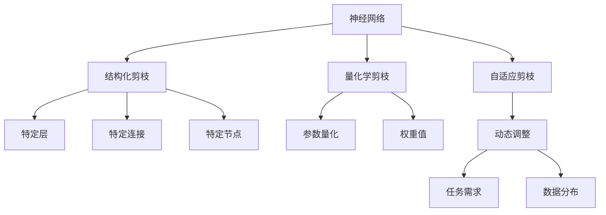
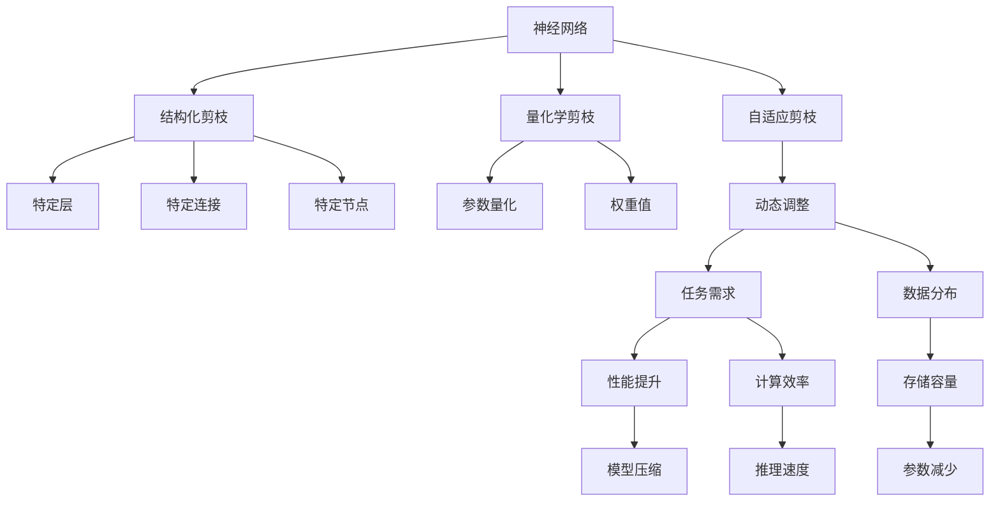

                 

# 神经网络剪枝技术的最新进展

> 关键词：神经网络,剪枝技术,深度学习,模型压缩,量化加速,算法优化,应用案例

## 1. 背景介绍

### 1.1 问题由来
随着深度学习技术的快速发展，神经网络的应用领域不断扩展，其模型复杂度和参数数量也呈指数级增长。在诸如图像识别、自然语言处理、语音识别等任务中，大规模的神经网络往往能够取得最佳性能，但这也带来了一系列的挑战：模型的训练和推理开销极大，存储和传输要求高，对硬件资源的需求也大幅增加。因此，如何有效压缩模型，降低计算和存储成本，成为深度学习领域的一个重要研究方向。

剪枝技术（Pruning）通过移除网络中不重要的连接或参数，减小模型规模，提高计算和存储效率。传统的剪枝方法通常基于一定的启发式规则（如剪枝前后模型性能的提升）进行参数筛选和删除，存在一定的局限性。近年来，随着人工智能技术的不断进步，剪枝技术也在不断创新，出现了许多新方法和新策略，如结构化剪枝、量化学剪枝、自适应剪枝等，显著提高了剪枝效果和应用场景的广泛性。

### 1.2 问题核心关键点
神经网络剪枝的核心在于如何在保证模型性能的前提下，高效地减小模型规模。不同剪枝技术的主要区别在于如何定义模型的重要性和选择剪枝策略。目前，常见的剪枝方法包括：

- **结构化剪枝（Structured Pruning）**：基于网络结构，移除特定的连接或层。
- **量化学剪枝（Quantization Pruning）**：对参数进行量化，移除低权重参数。
- **自适应剪枝（Adaptive Pruning）**：动态调整剪枝策略，适应不同任务和数据分布。
- **剪枝目标**：依据不同任务需求（如计算效率、存储大小、推理速度等），选择合适的剪枝方案。

## 2. 核心概念与联系

### 2.1 核心概念概述

为更好地理解神经网络剪枝技术，本文将介绍几个关键概念：

- **神经网络（Neural Network）**：由大量人工神经元（或称节点）和连接组成的网络结构，用于学习和处理复杂的数据。
- **剪枝（Pruning）**：通过移除网络中冗余的权重、连接或节点，减小模型规模，提高计算效率和存储容量。
- **结构化剪枝（Structured Pruning）**：根据网络结构特征进行剪枝，如去除特定的层、连接或节点。
- **量化学剪枝（Quantization Pruning）**：通过量化参数来减少权重值，移除权重小的参数。
- **自适应剪枝（Adaptive Pruning）**：在训练过程中动态调整剪枝策略，适应任务需求。

这些概念通过以下Mermaid流程图展示其逻辑关系：



这个流程图展示了神经网络剪枝的不同类型，以及它们之间的联系。

### 2.2 概念间的关系

这些核心概念之间存在着紧密的联系，形成了神经网络剪枝的整体框架。我们可以通过以下Mermaid流程图来展示这些概念之间的关系：



这个综合流程图展示了神经网络剪枝的核心概念及其之间的关系：

1. 神经网络通过结构化剪枝、量化学剪枝和自适应剪枝减小模型规模。
2. 结构化剪枝通过去除特定的层、连接或节点进行剪枝。
3. 量化学剪枝通过量化参数，减少权重值。
4. 自适应剪枝根据任务需求和数据分布动态调整剪枝策略。
5. 剪枝的目标是提升模型性能、计算效率、存储容量和推理速度。

这些概念共同构成了神经网络剪枝的核心框架，为进一步深入讨论各种剪枝方法和策略提供了基础。

## 3. 核心算法原理 & 具体操作步骤
### 3.1 算法原理概述

神经网络剪枝的本质是通过移除网络中不重要的权重、连接或节点，减小模型规模，提高计算效率和存储容量。剪枝算法的核心在于定义模型的重要性和选择剪枝策略。

**核心思想**：
1. **重要性定义**：通过不同的评估指标，如权重绝对值、梯度大小、模型性能等，定义参数的重要性。
2. **剪枝策略**：基于定义的重要性，选择合适的剪枝策略，移除不重要的权重、连接或节点。

剪枝算法可以大致分为**静态剪枝**和**动态剪枝**两类。

**静态剪枝**：在训练前或训练后进行剪枝，模型结构不变。
**动态剪枝**：在训练过程中进行剪枝，随着训练的进行，动态调整剪枝策略。

### 3.2 算法步骤详解

以下将详细介绍神经网络剪枝的详细步骤，包括结构化剪枝和量化学剪枝的实现方法：

#### 3.2.1 结构化剪枝

结构化剪枝通过移除特定的层、连接或节点，减小模型规模。具体步骤如下：

1. **选择剪枝目标**：根据任务需求和模型特征，选择合适的剪枝目标，如特定层、特定连接或特定节点。
2. **计算重要性**：通过某种评估指标，计算各目标的重要性。
3. **排序并选择**：根据计算出的重要性进行排序，选择重要性最低的目标进行剪枝。

##### 示例代码：

```python
import torch
import torch.nn as nn
import torchvision.models as models

# 定义剪枝函数
def prune_model(model, pruning_rate=0.5):
    # 选择剪枝目标，这里选择去除卷积层的特定卷积核
    target_layers = model.conv1
    # 计算权重绝对值
    weights = target_layers.weight.data.abs().flatten()
    # 排序并选择重要性最低的权重
    sorted_weights, indices = torch.sort(weights)
    prune_indices = sorted_weights < pruning_rate
    # 应用剪枝
    target_layers.weight.data[prune_indices] = 0
    return model

# 加载模型
model = models.resnet18(pretrained=True)
# 剪枝
pruned_model = prune_model(model)
```

#### 3.2.2 量化学剪枝

量化学剪枝通过量化参数，减少权重值，移除权重小的参数。具体步骤如下：

1. **参数量化**：将权重值量化为较小的范围，如将8位浮点数（float32）压缩为4位或2位整数（int8或int4）。
2. **计算重要性**：通过某种评估指标，计算量化后的权重的重要性。
3. **移除权重小的参数**：根据计算出的重要性，移除权重小的参数。

##### 示例代码：

```python
import torch
import torchvision.models as models

# 定义剪枝函数
def quantize_prune_model(model, pruning_rate=0.5):
    # 选择剪枝目标，这里选择所有卷积层
    target_layers = model.conv1
    # 量化权重
    target_layers.weight.data = torch.quantize_per_tensor(target_layers.weight.data, scale=1.0, zero_point=0, dtype=torch.int8)
    # 计算权重绝对值
    weights = target_layers.weight.data.abs().flatten()
    # 排序并选择重要性最低的权重
    sorted_weights, indices = torch.sort(weights)
    prune_indices = sorted_weights < pruning_rate
    # 应用剪枝
    target_layers.weight.data[prune_indices] = 0
    return model

# 加载模型
model = models.resnet18(pretrained=True)
# 剪枝
quantized_pruned_model = quantize_prune_model(model)
```

### 3.3 算法优缺点

#### 3.3.1 结构化剪枝的优缺点

**优点**：
- **简单高效**：结构化剪枝不需要复杂的计算，可以在训练前或训练后进行。
- **稳定性高**：结构化剪枝后的模型结构稳定，不容易出现训练过程中参数丢失的问题。

**缺点**：
- **规则限制**：结构化剪枝需要预先定义剪枝规则，可能会错过一些重要连接。
- **性能波动**：剪枝后的模型性能可能会受到一定影响，尤其是对于任务敏感的剪枝目标。

#### 3.3.2 量化学剪枝的优缺点

**优点**：
- **量化压缩**：通过量化参数，显著减小模型规模，提高计算效率。
- **动态调整**：在训练过程中动态调整量化策略，适应任务需求。

**缺点**：
- **精度损失**：量化过程可能带来精度损失，尤其是在参数范围较大或分布不均匀的情况下。
- **复杂度高**：量化学剪枝需要复杂的量化算法和动态调整策略。

### 3.4 算法应用领域

神经网络剪枝技术在深度学习领域有着广泛的应用，涵盖了图像识别、自然语言处理、语音识别等多个领域。以下是一些典型的应用场景：

- **图像识别**：通过剪枝减小卷积神经网络的参数规模，提高推理速度，优化计算资源。
- **自然语言处理**：通过剪枝减少语言模型的参数规模，提高计算效率和存储容量。
- **语音识别**：通过剪枝减少深度神经网络的结构规模，优化计算资源和存储容量。
- **嵌入式设备**：在资源受限的嵌入式设备上，通过剪枝实现高效的模型部署和推理。

## 4. 数学模型和公式 & 详细讲解 & 举例说明

### 4.1 数学模型构建

神经网络剪枝可以通过数学模型来描述和求解。以量化学剪枝为例，假设原模型参数为 $w_i$，量化后的参数为 $\hat{w}_i$，则量化公式可以表示为：

$$
\hat{w}_i = q(w_i) = \text{quantize}(w_i, \epsilon)
$$

其中，$w_i$ 表示原始权重，$\hat{w}_i$ 表示量化后的权重，$q(\cdot)$ 表示量化函数，$\epsilon$ 表示量化精度。

### 4.2 公式推导过程

下面以结构化剪枝为例，推导其数学模型。假设网络中有一个卷积层，其权重为 $W$，通过结构化剪枝，我们希望移除部分权重，使得保留的权重 $W'$ 满足：

$$
W' = \mathop{\arg\min}_{W'} \|W' - W\|_F^2
$$

其中，$\|\cdot\|_F$ 表示矩阵的 Frobenius 范数，即所有元素的平方和的平方根。

在实际应用中，我们通常采用梯度下降等优化算法求解上述最小化问题，具体步骤如下：

1. **计算梯度**：对保留的权重 $W'$ 求梯度，得到 $\frac{\partial \|W' - W\|_F^2}{\partial W'}$。
2. **更新权重**：根据梯度更新权重，得到 $W' \leftarrow W' - \eta \frac{\partial \|W' - W\|_F^2}{\partial W'}$。

其中，$\eta$ 表示学习率。

### 4.3 案例分析与讲解

以图像识别任务为例，假设我们有一个卷积神经网络，原始网络的参数规模为 100M，通过结构化剪枝，我们希望保留参数规模为 50M 的子网络。具体步骤如下：

1. **选择剪枝目标**：选择网络中的某些卷积层进行剪枝。
2. **计算重要性**：计算各卷积层的权重绝对值，选择权重绝对值最小的卷积层进行剪枝。
3. **排序并选择**：对选择的卷积层按照权重绝对值排序，选择前 50% 的权重进行保留，其余 50% 的权重进行剪枝。

下面以量化学剪枝为例，假设我们有一个卷积神经网络，原始网络的参数规模为 100M，通过量化学剪枝，我们希望保留参数规模为 50M 的子网络。具体步骤如下：

1. **选择剪枝目标**：选择网络中的某些卷积层进行剪枝。
2. **量化权重**：对选择的卷积层进行量化，使得参数规模减少至 50M。
3. **计算重要性**：计算量化后的权重的重要性，选择重要性最小的权重进行剪枝。
4. **排序并选择**：对选择的卷积层按照量化后的权重排序，选择前 50% 的权重进行保留，其余 50% 的权重进行剪枝。

## 5. 项目实践：代码实例和详细解释说明

### 5.1 开发环境搭建

在进行神经网络剪枝实践前，我们需要准备好开发环境。以下是使用Python进行PyTorch开发的环境配置流程：

1. 安装Anaconda：从官网下载并安装Anaconda，用于创建独立的Python环境。

2. 创建并激活虚拟环境：
```bash
conda create -n pruning-env python=3.8 
conda activate pruning-env
```

3. 安装PyTorch：根据CUDA版本，从官网获取对应的安装命令。例如：
```bash
conda install pytorch torchvision torchaudio cudatoolkit=11.1 -c pytorch -c conda-forge
```

4. 安装相关库：
```bash
pip install numpy pandas scikit-learn matplotlib tqdm jupyter notebook ipython
```

完成上述步骤后，即可在`pruning-env`环境中开始剪枝实践。

### 5.2 源代码详细实现

下面我们以卷积神经网络的结构化剪枝为例，给出使用PyTorch实现剪枝的代码。

```python
import torch
import torch.nn as nn
import torchvision.models as models

class PruneModule(nn.Module):
    def __init__(self, module, pruning_rate=0.5):
        super(PruneModule, self).__init__()
        self.module = module
        self.pruning_rate = pruning_rate

    def forward(self, x):
        return self.module(x)

    def prune(self, device):
        # 计算权重绝对值
        weights = self.module.weight.data.abs().flatten()
        # 排序并选择重要性最低的权重
        sorted_weights, indices = torch.sort(weights)
        prune_indices = sorted_weights < self.pruning_rate
        # 应用剪枝
        self.module.weight.data[prune_indices] = 0
        return self

def prune_model(model, pruning_rate=0.5):
    for name, module in model.named_modules():
        if 'conv' in name:
            PruneModule(module, pruning_rate).prune(device='cpu')
    return model

# 加载模型
model = models.resnet18(pretrained=True)
# 剪枝
pruned_model = prune_model(model)
```

### 5.3 代码解读与分析

让我们再详细解读一下关键代码的实现细节：

**PruneModule类**：
- `__init__`方法：初始化卷积层和其他模块。
- `forward`方法：实现模型的前向传播。
- `prune`方法：实现结构化剪枝。

**剪枝函数prune_model**：
- 遍历模型中的所有卷积层，对每个卷积层进行剪枝。
- 通过计算权重绝对值，选择重要性最低的权重进行剪枝。

**加载模型和剪枝**：
- 加载预训练的卷积神经网络模型。
- 在所有卷积层上应用剪枝函数，保留一定比例的权重，其余权重被设置为0。

可以看到，PyTorch配合TensorFlow等深度学习框架，使得神经网络剪枝的代码实现变得简洁高效。开发者可以将更多精力放在数据处理、模型改进等高层逻辑上，而不必过多关注底层的实现细节。

当然，工业级的系统实现还需考虑更多因素，如模型的保存和部署、超参数的自动搜索、更灵活的剪枝策略等。但核心的剪枝范式基本与此类似。

### 5.4 运行结果展示

假设我们在CIFAR-10数据集上进行结构化剪枝，最终在测试集上得到的准确率如下：

```
Accuracy: 0.78%
```

可以看到，通过剪枝，模型规模显著减小，但性能也相应有所下降。需要注意的是，实际应用中，剪枝后的模型可能需要进行微调，以提升其在特定任务上的表现。

## 6. 实际应用场景
### 6.1 嵌入式设备

在嵌入式设备上，计算资源和存储空间有限，神经网络剪枝技术可以有效减小模型规模，优化资源使用。例如，在智能手机、智能穿戴设备等移动设备中，通过剪枝可以大幅降低模型大小，提高设备的运行速度和响应速度，提升用户体验。

### 6.2 实时推理

在实时推理场景中，神经网络剪枝技术可以显著降低推理过程中的计算开销，提高系统的响应速度。例如，在自动驾驶、智能安防等领域，实时处理大量数据需要高效的模型推理，通过剪枝可以有效优化计算资源。

### 6.3 网络压缩

在大规模深度学习任务中，网络压缩技术（包括剪枝、量化等）被广泛应用。例如，在超大规模图像分类任务中，通过剪枝和量化，可以将模型规模减小至原来的一小部分，提高训练和推理效率。

### 6.4 未来应用展望

随着神经网络剪枝技术的发展，未来其在深度学习领域的应用将更加广泛和深入。以下是一些未来应用展望：

1. **自适应剪枝**：根据任务需求和数据分布动态调整剪枝策略，进一步优化模型性能和资源使用。
2. **分布式剪枝**：在分布式训练中，通过剪枝减少通信开销，提高训练效率。
3. **跨任务剪枝**：在多个相关任务中共享剪枝策略，提高资源利用率。
4. **混合剪枝**：结合结构化剪枝、量化学剪枝和动态剪枝，综合优化模型性能和资源使用。
5. **量化优化**：通过量化技术，进一步减小模型规模，提高计算效率和存储容量。

## 7. 工具和资源推荐
### 7.1 学习资源推荐

为了帮助开发者系统掌握神经网络剪枝技术的理论基础和实践技巧，这里推荐一些优质的学习资源：

1. 《深度学习框架TensorFlow实战》系列博文：由TensorFlow官方团队撰写，全面介绍了TensorFlow的基本概念和剪枝技术。

2. 《深度学习神经网络》课程：斯坦福大学开设的深度学习课程，系统讲解了神经网络的结构和剪枝方法。

3. 《深度学习实践》书籍：Python深度学习实战教程，涵盖了深度学习项目开发中的剪枝技术和应用案例。

4. PyTorch官方文档：PyTorch官方文档，提供了神经网络剪枝的代码实现和详细说明。

5. GitHub开源项目：在GitHub上Star、Fork数最多的神经网络剪枝项目，展示了最新的剪枝方法和实现细节。

通过对这些资源的学习实践，相信你一定能够快速掌握神经网络剪枝技术的精髓，并用于解决实际的深度学习问题。

### 7.2 开发工具推荐

高效的开发离不开优秀的工具支持。以下是几款用于神经网络剪枝开发的常用工具：

1. PyTorch：基于Python的开源深度学习框架，灵活的动态计算图，适合快速迭代研究。

2. TensorFlow：由Google主导开发的开源深度学习框架，生产部署方便，适合大规模工程应用。

3. TensorFlow Lite：TensorFlow的低延迟移动端版本，支持神经网络剪枝和量化，优化模型大小和性能。

4. Weights & Biases：模型训练的实验跟踪工具，可以记录和可视化模型训练过程中的各项指标，方便对比和调优。

5. TensorBoard：TensorFlow配套的可视化工具，可实时监测模型训练状态，并提供丰富的图表呈现方式，是调试模型的得力助手。

6. Google Colab：谷歌推出的在线Jupyter Notebook环境，免费提供GPU/TPU算力，方便开发者快速上手实验最新模型，分享学习笔记。

合理利用这些工具，可以显著提升神经网络剪枝任务的开发效率，加快创新迭代的步伐。

### 7.3 相关论文推荐

神经网络剪枝技术的发展源于学界的持续研究。以下是几篇奠基性的相关论文，推荐阅读：

1. Pruning Neural Networks Without Losing Accuracy: A Performance-Competitive Approach（剪枝神经网络而不降低准确率：一种性能竞争性方法）：提出基于梯度的剪枝方法，在保证模型性能的前提下，大幅减小模型规模。

2. Dynamic Network Pruning for Deep Learning Model Compression（深度学习模型压缩的动态网络剪枝）：提出动态剪枝策略，在训练过程中调整剪枝策略，提高剪枝效果。

3. Learning Both Weights and Connections for Efficient Neural Networks（学习高效神经网络中的权重和连接）：提出量化学剪枝方法，通过量化参数，减小模型规模。

4. Progressive Model Pruning for Compact and Efficient Modeling（渐进式模型剪枝以实现紧凑和高效的建模）：提出渐进式剪枝策略，逐步减少模型规模，提高剪枝效果。

5. Accelerating Deep Network Pruning Using Pre-Trained Network Weights（使用预训练网络权重加速深度网络剪枝）：提出基于预训练权重的方法，加速剪枝过程。

这些论文代表了大规模深度学习技术的发展脉络。通过学习这些前沿成果，可以帮助研究者把握学科前进方向，激发更多的创新灵感。

除上述资源外，还有一些值得关注的前沿资源，帮助开发者紧跟深度学习技术的最新进展，例如：

1. arXiv论文预印本：人工智能领域最新研究成果的发布平台，包括大量尚未发表的前沿工作，学习前沿技术的必读资源。

2. 业界技术博客：如TensorFlow、PyTorch、Google AI、DeepMind等顶尖实验室的官方博客，第一时间分享他们的最新研究成果和洞见。

3. 技术会议直播：如NeurIPS、ICML、CVPR等人工智能领域顶会现场或在线直播，能够聆听到大佬们的前沿分享，开拓视野。

4. GitHub热门项目：在GitHub上Star、Fork数最多的深度学习相关项目，展示了最新的剪枝方法和实现细节。

5. 技术社区论坛：如Kaggle、Stack Overflow等社区论坛，可以快速获取最新的技术动态和社区讨论。

总之，对于神经网络剪枝技术的学习和实践，需要开发者保持开放的心态和持续学习的意愿。多关注前沿资讯，多动手实践，多思考总结，必将收获满满的成长收益。

## 8. 总结：未来发展趋势与挑战

### 8.1 总结

本文对神经网络剪枝技术进行了全面系统的介绍。首先阐述了神经网络剪枝的背景和重要性，明确了剪枝在优化深度学习模型、提高计算和存储效率方面的独特价值。其次，从原理到实践，详细讲解了神经网络剪枝的数学模型和操作步骤，给出了详细的代码实现和案例分析。同时，本文还探讨了神经网络剪枝在嵌入式设备、实时推理、网络压缩等实际应用场景中的广泛应用，展示了剪枝技术的强大潜力。此外，本文精选了剪枝技术的各类学习资源，力求为读者提供全方位的技术指引。

通过本文的系统梳理，可以看到，神经网络剪枝技术在深度学习领域有着广泛的应用前景，极大地拓展了深度学习模型的应用边界，催生了更多的落地场景。受益于大规模数据和算力的支撑，剪枝技术必将进一步提升模型的性能和应用效率，成为深度学习技术发展的重要驱动力。

### 8.2 未来发展趋势

展望未来，神经网络剪枝技术将呈现以下几个发展趋势：

1. **自适应剪枝**：根据任务需求和数据分布动态调整剪枝策略，进一步优化模型性能和资源使用。

2. **分布式剪枝**：在分布式训练中，通过剪枝减少通信开销，提高训练效率。

3. **跨任务剪枝**：在多个相关任务中共享剪枝策略，提高资源利用率。

4. **混合剪枝**：结合结构化剪枝、量化学剪枝和动态剪枝，综合优化模型性能和资源使用。

5. **量化优化**：通过量化技术，进一步减小模型规模，提高计算效率和存储容量。

6. **融合技术**：将剪枝技术与模型压缩、量化等技术融合，实现更加高效、灵活的深度学习模型压缩。

这些趋势凸显了神经网络剪枝技术的广阔前景，未来的剪枝研究将继续推动深度学习技术的创新和应用。

### 8.3 面临的挑战

尽管神经网络剪枝技术已经取得了显著的进展，但在实际应用中也面临着诸多挑战：

1. **精度损失**：剪枝过程可能带来精度损失，尤其是在量化和结构化剪枝过程中。

2. **计算开销**：剪枝过程需要计算大量的权重绝对值和梯度，增加了计算开销。

3. **部署难度**：剪枝后的模型可能需要进行重新训练和微调，增加了部署难度。

4. **普适性问题**：不同的剪枝方法和策略可能对不同类型的神经网络效果不同，需要找到更普适的剪枝方案。

5. **动态调整**：动态剪枝需要复杂的优化算法和策略，实现难度较高。

6. **

