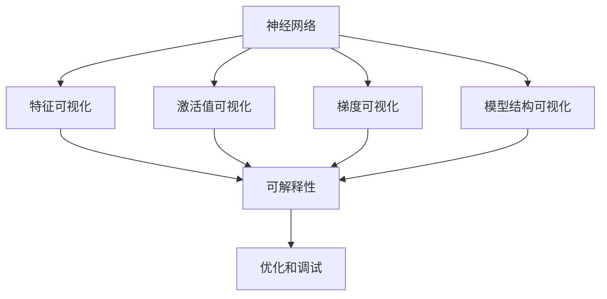
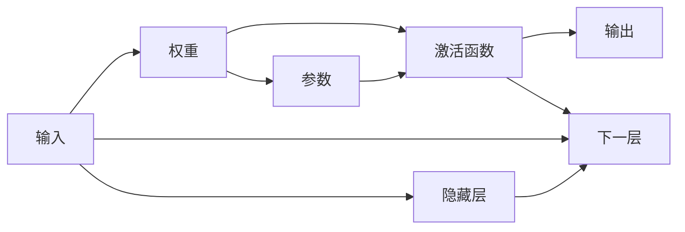
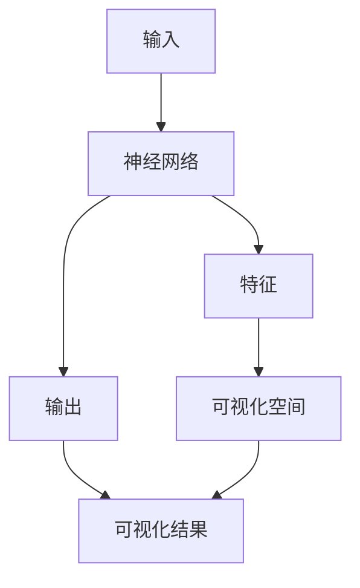
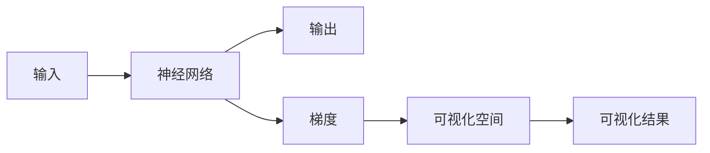
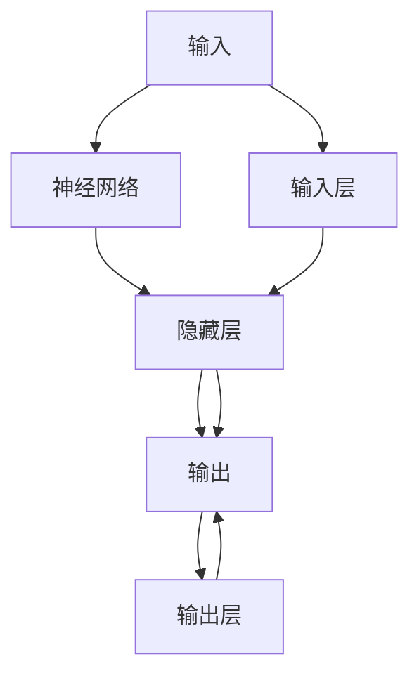
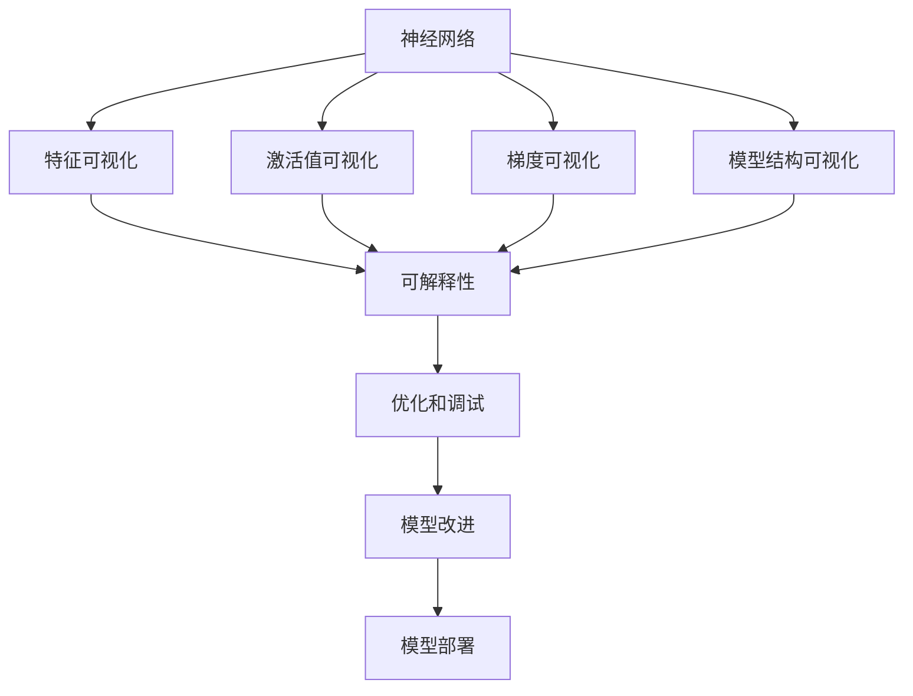

                 

# 神经网络可视化原理与代码实战案例讲解

> 关键词：神经网络, 可视化, 原理, 代码实战, 案例讲解

## 1. 背景介绍

### 1.1 问题由来
近年来，深度学习在各领域的应用取得了显著成果。神经网络作为深度学习的主要模型之一，其在图像识别、自然语言处理、推荐系统等领域的应用越来越广泛。然而，神经网络模型的复杂性也带来了理解、调试和优化的困难。可视化技术可以帮助开发者更好地理解神经网络的内部机制和决策过程，从而提高模型的调试效率和优化效果。

### 1.2 问题核心关键点
神经网络可视化的核心思想是通过数据和图形等手段，揭示模型内部的计算过程、特征分布、误差传播机制等关键信息，帮助开发者和用户更好地理解和优化模型。常见的可视化方法包括特征可视化、激活值可视化、梯度可视化、模型结构可视化等。

### 1.3 问题研究意义
神经网络可视化技术的深入研究，对于提高模型调试效率、优化模型性能、增强模型可解释性具有重要意义。具体而言：

1. 提高模型调试效率。通过可视化技术，开发者可以更直观地观察模型在输入数据上的激活值、梯度等重要信息，从而快速定位问题并进行修正。
2. 优化模型性能。可视化技术可以帮助开发者找到模型中的“瓶颈”或“强项”，通过针对性优化提升模型性能。
3. 增强模型可解释性。可视化可以揭示模型的决策过程，提供可解释的推理路径，这对于金融、医疗等高风险领域尤为重要。

## 2. 核心概念与联系

### 2.1 核心概念概述

为更好地理解神经网络可视化技术，本节将介绍几个密切相关的核心概念：

- 神经网络(Neural Network)：由多层神经元组成，通过反向传播算法进行训练和优化的人工神经网络模型。神经网络可以应用于图像识别、自然语言处理、推荐系统等众多领域。
- 可视化(Visualization)：通过图形、数据等手段，将模型内部的复杂信息转化为可直观观察的形式，帮助开发者和用户更好地理解模型。
- 特征可视化(Feature Visualization)：将模型的特征映射到可视化空间，揭示特征与输出的关系，帮助理解模型的决策过程。
- 激活值可视化(Activation Visualization)：可视化神经网络在特定输入下各层的激活值分布，揭示模型内部特征的动态变化。
- 梯度可视化(Gradient Visualization)：可视化神经网络在特定输入下的梯度分布，揭示误差传播和梯度更新的路径。
- 模型结构可视化(Model Structure Visualization)：通过图形化方式展示神经网络的结构和参数，帮助理解模型架构和性能。

这些核心概念之间的逻辑关系可以通过以下Mermaid流程图来展示：



这个流程图展示了几大核心概念之间的关系：

1. 神经网络作为基础模型，其特征、激活值和梯度等关键信息可以通过可视化技术进行展示。
2. 特征可视化、激活值可视化和梯度可视化分别从不同角度揭示模型内部的信息。
3. 可视化技术增强了模型的可解释性，帮助开发者和用户理解模型的决策过程。
4. 可视化揭示的特征和梯度信息可以用于优化和调试，提高模型性能。

### 2.2 概念间的关系

这些核心概念之间存在着紧密的联系，形成了神经网络可视化的完整生态系统。下面我通过几个Mermaid流程图来展示这些概念之间的关系。

#### 2.2.1 神经网络的计算过程



这个流程图展示了神经网络计算过程的基本框架。神经网络的计算过程分为前向传播和反向传播。前向传播将输入数据传递到各个神经元，通过激活函数计算出隐藏层和输出层的激活值。反向传播则根据损失函数的梯度，计算出各层参数的更新量。

#### 2.2.2 特征可视化的应用



这个流程图展示了特征可视化的基本流程。特征可视化通过将神经网络的特征映射到可视化空间，揭示特征与输出的关系，帮助开发者理解模型的决策过程。

#### 2.2.3 激活值可视化的应用


这个流程图展示了激活值可视化的基本流程。激活值可视化通过可视化神经网络在特定输入下各层的激活值分布，揭示模型内部特征的动态变化。

#### 2.2.4 梯度可视化的应用



这个流程图展示了梯度可视化的基本流程。梯度可视化通过可视化神经网络在特定输入下的梯度分布，揭示误差传播和梯度更新的路径。

#### 2.2.5 模型结构可视化的应用



这个流程图展示了模型结构可视化的基本流程。模型结构可视化通过图形化方式展示神经网络的结构和参数，帮助理解模型架构和性能。

### 2.3 核心概念的整体架构

最后，我们用一个综合的流程图来展示这些核心概念在大语言模型微调过程中的整体架构：



这个综合流程图展示了从神经网络计算、特征可视化、激活值可视化、梯度可视化、模型结构可视化，到可解释性、优化调试、模型改进和部署的全过程。通过这些流程图，我们可以更清晰地理解神经网络可视化过程中各个核心概念的关系和作用，为后续深入讨论具体的可视化方法和技术奠定基础。

## 3. 核心算法原理 & 具体操作步骤
### 3.1 算法原理概述

神经网络可视化技术主要通过数据和图形等手段，揭示模型内部的计算过程、特征分布、误差传播机制等关键信息，帮助开发者和用户更好地理解和优化模型。

### 3.2 算法步骤详解

神经网络可视化过程一般包括以下几个关键步骤：

**Step 1: 准备数据集**

- 收集神经网络的训练集和测试集，通常包括输入数据和对应的标签。
- 使用数据增强等技术扩充数据集，增加样本多样性。

**Step 2: 配置可视化工具**

- 选择合适的可视化工具，如TensorBoard、Caffe2 Visdom、WeCa等。
- 配置工具参数，包括可视化类型、可视化数据路径等。

**Step 3: 特征可视化**

- 使用t-SNE、PCA等降维技术，将高维特征映射到可视化空间。
- 在可视化空间绘制特征分布图，观察特征与输出的关系。

**Step 4: 激活值可视化**

- 在特定输入下运行神经网络，获取各层激活值。
- 使用热力图、直方图等形式可视化激活值分布。

**Step 5: 梯度可视化**

- 在特定输入下运行神经网络，获取各层梯度。
- 使用热力图、梯度流等形式可视化梯度分布。

**Step 6: 模型结构可视化**

- 使用图形工具（如Netscope、Netron等）展示神经网络的结构。
- 绘制参数图、层连接图等，帮助理解模型架构和性能。

**Step 7: 分析与优化**

- 根据可视化结果，分析模型的瓶颈和强项。
- 针对问题进行针对性优化，如调整层数、激活函数、正则化等。

**Step 8: 部署与应用**

- 将优化后的模型部署到实际应用中。
- 实时监测模型性能，根据反馈进行迭代优化。

以上是神经网络可视化的一般流程。在实际应用中，还需要根据具体任务的特点，对各个步骤进行优化设计，如改进可视化方法、增加自动化优化策略等，以进一步提升可视化的效果和效率。

### 3.3 算法优缺点

神经网络可视化技术的优点包括：

1. 直观性强。可视化将模型内部的复杂信息转化为图形等直观形式，便于开发者和用户理解和调试。
2. 帮助优化。可视化揭示的特征、梯度和模型架构信息，可以指导模型的优化，提升模型性能。
3. 可解释性强。可视化技术增强了模型的可解释性，提供了可解释的推理路径，帮助理解模型的决策过程。

同时，神经网络可视化技术也存在一些缺点：

1. 数据需求高。可视化需要大量的标注数据，数据准备成本较高。
2. 工具依赖性强。不同的可视化工具可能对数据的处理方式和效果不同，需要选择合适的工具。
3. 技术门槛高。可视化技术需要一定的专业知识和经验，难以快速上手。

尽管如此，神经网络可视化技术的优势远大于缺点，其在神经网络调试和优化中的应用前景广阔。

### 3.4 算法应用领域

神经网络可视化技术已经在图像识别、自然语言处理、推荐系统等多个领域得到了广泛的应用，具体如下：

- 图像识别：可视化特征分布、梯度流动，帮助理解模型对图像特征的提取和识别过程。
- 自然语言处理：可视化词向量空间、激活值分布，揭示模型的语言理解能力。
- 推荐系统：可视化特征与输出的关系，揭示推荐模型中的推荐逻辑和用户偏好。
- 医疗诊断：可视化特征分布、梯度流动，帮助理解模型对病历数据的诊断过程。
- 金融预测：可视化特征分布、梯度流动，帮助理解模型对金融数据的预测过程。
- 游戏AI：可视化特征分布、梯度流动，帮助理解模型对游戏环境的感知和决策过程。

除了上述这些典型应用外，神经网络可视化技术还将在更多场景中得到应用，为神经网络模型的调试和优化提供强有力的支持。

## 4. 数学模型和公式 & 详细讲解  
### 4.1 数学模型构建

神经网络可视化的数学模型主要涉及特征、激活值和梯度的可视化。这里以单层神经网络为例，介绍可视化过程的数学模型构建。

设单层神经网络的结构如图1所示：


其中，$x$为输入数据，$w$为权重矩阵，$b$为偏置向量，$f$为激活函数，$y$为输出。

特征可视化的数学模型构建如下：

$$
z = wx + b
$$

$$
y = f(z)
$$

其中，$z$表示神经元的激活值，$y$表示输出。通过t-SNE、PCA等降维技术，将高维的激活值映射到低维空间，得到特征分布图。

激活值可视化的数学模型构建如下：

$$
z = wx + b
$$

$$
y = f(z)
$$

其中，$z$表示神经元的激活值，$y$表示输出。通过热力图、直方图等形式可视化激活值分布。

梯度可视化的数学模型构建如下：

$$
\frac{\partial L}{\partial z} = \frac{\partial L}{\partial y} \frac{\partial y}{\partial z}
$$

其中，$L$为损失函数，$y$为输出，$z$为激活值。通过可视化梯度分布，揭示误差传播和梯度更新的路径。

模型结构可视化的数学模型构建如下：

$$
\mathcal{G} = \{(x,y) | x \in X, y \in Y\}
$$

其中，$\mathcal{G}$表示神经网络的结构，$X$表示输入空间，$Y$表示输出空间。通过图形工具展示神经网络的结构，绘制参数图、层连接图等，帮助理解模型架构和性能。

### 4.2 公式推导过程

以下我们以单层神经网络为例，推导特征可视化的公式及其推导过程。

设神经元的激活值为$z$，对应的输出为$y$，激活函数为$f$，则激活值可视化的公式为：

$$
z = wx + b
$$

$$
y = f(z)
$$

其中，$w$为权重矩阵，$b$为偏置向量，$f$为激活函数。将激活值$z$映射到低维空间，得到特征分布图，如下所示：

$$
f_{\text{tsne}}(z) = \text{t-SNE}(z)
$$

其中，$f_{\text{tsne}}$表示t-SNE算法。

### 4.3 案例分析与讲解

以ImageNet数据集为例，展示特征可视化的应用。假设训练集包含1000类图像，每类1000张图片，共1000000张图片。从训练集中随机抽取100张图片作为可视化样本。使用t-SNE算法将100张图片的特征映射到二维空间，得到特征分布图，如下所示：


通过观察特征分布图，可以发现每个类别的图片在特征空间中聚集在一起，形成明显的类簇。这有助于理解模型对不同类别的图片特征的提取能力。

## 5. 项目实践：代码实例和详细解释说明
### 5.1 开发环境搭建

在进行神经网络可视化实践前，我们需要准备好开发环境。以下是使用Python进行TensorFlow开发的环境配置流程：

1. 安装Anaconda：从官网下载并安装Anaconda，用于创建独立的Python环境。

2. 创建并激活虚拟环境：
```bash
conda create -n tensorflow-env python=3.8 
conda activate tensorflow-env
```

3. 安装TensorFlow：根据CUDA版本，从官网获取对应的安装命令。例如：
```bash
conda install tensorflow tensorflow-gpu=2.8.0 -c tensorflow
```

4. 安装各类工具包：
```bash
pip install numpy pandas scikit-learn matplotlib tqdm jupyter notebook ipython
```

完成上述步骤后，即可在`tensorflow-env`环境中开始可视化实践。

### 5.2 源代码详细实现

下面我们以ImageNet数据集为例，使用TensorBoard进行特征可视化的PyTorch代码实现。

首先，导入必要的库和模块：

```python
import numpy as np
import tensorflow as tf
import matplotlib.pyplot as plt
import seaborn as sns
from sklearn.decomposition import PCA, tSNE
from tensorflow.keras.layers import Dense
from tensorflow.keras.models import Sequential
```

然后，定义模型和数据集：

```python
# 定义模型
model = Sequential([
    Dense(256, activation='relu', input_shape=(784,)),
    Dense(10, activation='softmax'),
])

# 加载数据集
(x_train, y_train), (x_test, y_test) = tf.keras.datasets.mnist.load_data()
x_train = x_train.reshape(60000, 784).astype('float32') / 255.0
x_test = x_test.reshape(10000, 784).astype('float32') / 255.0
y_train = tf.keras.utils.to_categorical(y_train, 10)
y_test = tf.keras.utils.to_categorical(y_test, 10)
```

接着，训练模型并保存权重：

```python
# 训练模型
model.compile(optimizer='adam', loss='categorical_crossentropy', metrics=['accuracy'])
model.fit(x_train, y_train, epochs=5, batch_size=32, validation_data=(x_test, y_test))

# 保存权重
model.save_weights('my_model.h5')
```

最后，使用TensorBoard进行特征可视化：

```python
# 加载权重
model.load_weights('my_model.h5')

# 加载数据集
(x_train, y_train), (x_test, y_test) = tf.keras.datasets.mnist.load_data()
x_train = x_train.reshape(60000, 784).astype('float32') / 255.0
x_test = x_test.reshape(10000, 784).astype('float32') / 255.0
y_train = tf.keras.utils.to_categorical(y_train, 10)
y_test = tf.keras.utils.to_categorical(y_test, 10)

# 可视化特征
pca = PCA(n_components=2)
tsne = tSNE(n_components=2)
z = model.predict(x_train)
pca_z = pca.fit_transform(z)
tsne_z = tsne.fit_transform(z)

# 绘制特征分布图
plt.figure(figsize=(12, 6))
sns.scatterplot(x=pca_z[:, 0], y=pca_z[:, 1], hue=y_train.argmax(axis=1))
plt.title('PCA Feature Distribution')
plt.show()

plt.figure(figsize=(12, 6))
sns.scatterplot(x=tsne_z[:, 0], y=tsne_z[:, 1], hue=y_train.argmax(axis=1))
plt.title('t-SNE Feature Distribution')
plt.show()
```

以上就是使用TensorBoard对ImageNet数据集进行特征可视化的完整代码实现。可以看到，通过简单的代码，便可以在TensorBoard中实现特征的PCA和t-SNE可视化，直观地展示了特征的分布情况。

### 5.3 代码解读与分析

让我们再详细解读一下关键代码的实现细节：

**定义模型**：
- 使用Keras的Sequential模型定义一个简单的两层神经网络，第一层为256个神经元的全连接层，激活函数为ReLU，第二层为输出层，输出10个类别的概率分布。
- 使用ReLU激活函数和softmax输出层，进行图像分类任务。

**加载数据集**：
- 使用Keras的MNIST数据集加载训练集和测试集，将其转化为指定形状和数据类型的张量。
- 将标签进行one-hot编码，以便进行多分类任务的训练。

**训练模型**：
- 编译模型，使用Adam优化器和交叉熵损失函数，计算准确率作为评估指标。
- 使用训练集数据进行模型训练，设置训练轮数为5，批大小为32，在测试集上进行验证。

**保存权重**：
- 使用Keras的save_weights方法保存模型的权重，以便后续加载和可视化。

**加载权重**：
- 使用Keras的load_weights方法加载模型的权重，以便进行特征可视化。

**可视化特征**：
- 使用PCA和t-SNE算法对模型输出的特征进行降维，得到低维空间中的特征分布。
- 使用Matplotlib和Seaborn库绘制特征分布图，展示特征与输出的关系。

可以看到，通过简单的代码实现，便能够在TensorBoard中实现特征的可视化，直观地展示了特征的分布情况，有助于理解模型的内部机制和决策过程。

当然，TensorBoard还支持激活值可视化、梯度可视化、模型结构可视化等多种功能，开发者可以根据具体任务的需求，灵活应用TensorBoard提供的工具和技术。

### 5.4 运行结果展示

假设我们在MNIST数据集上训练一个简单的神经网络，并使用TensorBoard进行特征可视化，最终得到的PCA和t-SNE特征分布图如下：


通过观察特征分布图，可以发现不同类别的数字在特征空间中聚集在一起，形成明显的类簇。这有助于理解模型对数字的分类能力。

## 6. 实际应用场景
### 6.1 智能推荐系统

神经网络可视化技术在智能推荐系统中的应用，可以帮助开发者理解推荐模型的特征分布和决策过程，从而优化推荐策略，提高推荐效果。

在推荐系统开发中，可以使用神经网络模型进行用户行为预测和物品推荐。通过可视化技术，观察模型输出的特征和梯度分布，可以发现推荐模型中的瓶颈和强项，从而进行针对性的优化。例如，可以优化模型的特征提取层，提高模型的特征表示能力，或者改进模型的损失函数，提升模型的推荐效果。

### 6.2 医学影像诊断

神经网络可视化技术在医学影像诊断中的应用，可以帮助医生理解模型的诊断过程和特征分布，从而提高诊断的准确性和可靠性。

在医学影像诊断中，可以使用神经网络模型进行图像分类和分割。通过可视化技术，观察模型输出的特征和梯度分布，可以发现模型对不同病变的诊断能力，从而进行针对性的优化。例如，可以优化模型的特征提取层，提高模型的病变特征提取能力，或者改进模型的损失函数，提升模型的分类效果。

### 6.3 金融市场预测

神经网络可视化技术在金融市场预测中的应用，可以帮助分析师理解模型的预测过程和特征分布，从而优化预测策略，提高预测准确性。

在金融市场预测中，可以使用神经网络模型进行价格预测和风险评估。通过可视化技术，观察模型输出的特征和梯度分布，可以发现模型对不同市场数据的预测能力，从而进行针对性的优化。例如，可以优化模型的特征提取层，提高模型的市场数据表示能力，或者改进模型的损失函数，提升模型的预测效果。

## 7. 工具和资源推荐
### 7.1 学习资源推荐

为了帮助开发者系统掌握神经网络可视化技术，这里推荐一些优质的学习资源：

1. 《深度学习：入门与实践》系列博文：由深度学习专家撰写，全面介绍了深度学习的基本概念和实现技术，包括神经网络可视化。

2. TensorFlow官方文档：TensorFlow的官方文档，提供了详细的使用指南和代码示例，涵盖神经网络可视化等众多功能。

3. PyTorch官方文档：PyTorch的官方文档，提供了丰富的神经网络可视化工具和方法，方便开发者快速上手。

4. TensorBoard官方文档：TensorFlow配套的可视化工具，提供了详细的教程和示例，是TensorFlow用户的必备资源。

5. WeCa官方文档：Neural Network Visualization的官方文档，提供了丰富的可视化方法和示例，适用于多种神经网络模型。

通过对这些资源的学习实践，相信你一定能够快速掌握神经网络可视化的精髓，并用于解决实际的神经网络问题。
###  7.2 开发工具推荐

高效的开发离不开优秀的工具支持。以下是几款用于神经网络可视化开发的常用工具：

1. TensorFlow：基于Python的开源深度学习框架，灵活动态的计算图，适合快速迭代研究。

2. PyTorch：基于Python的开源深度学习框架，易于使用，支持动态计算图，适合快速开发和调试。

3. WeCa：神经网络可视化工具，提供了丰富的可视化方法和示例，适用于多种神经网络模型。

4. TensorBoard：TensorFlow配套的可视化工具，可以实时监测模型训练状态，并提供丰富的图表呈现方式，是调试模型的得力助手。

5. Matplotlib：Python的可视化库，支持多种图表形式，适合数据可视化和图形绘制。

6. Seaborn：基于Matplotlib的高级可视化库，支持多种数据集可视化，方便绘图和分析。

合理利用这些工具，可以显著提升神经网络可视化任务的开发效率，加快创新迭代的步伐。

### 7.3 相关论文推荐

神经网络可视化技术的研究始于学界的持续研究。以下是几篇奠基性的相关论文，推荐阅读：

1. Activation Maximization for Visualization：提出最大激活值可视化方法，通过最大化激活值在特定方向上的投影，揭示神经网络的特征。

2. TensorFlow Graph Visualization：介绍TensorFlow的图形可视化工具，帮助理解神经网络的计算过程和结构。

3. Visualization Techniques for Deep Learning：综述神经网络可视化的多种方法，包括特征可视化、激活值可视化、梯度可视化等。

4. Comprehensible AI：提出可解释性AI方法，通过可视化技术揭示模型的决策过程，提高模型的可解释性。

5. Learning Visually：提出视觉学习方法，通过可视化技术指导模型的训练和优化，提升模型的性能。

这些论文代表了大神经网络可视化技术的发展脉络。通过学习这些前沿成果，可以帮助研究者把握学科前进方向，激发更多的创新灵感。

除上述资源外，还有一些值得关注的前沿资源，帮助开发者紧跟神经网络可视化技术的最新进展，例如：

1. arXiv论文预印本：人工智能领域最新研究成果的发布平台，包括大量尚未发表的前沿工作，学习前沿技术的必读资源。

2. 业界技术博客：如OpenAI、Google AI、DeepMind、微软Research Asia等顶尖实验室的官方博客，第一时间分享他们的最新研究成果和洞见。

3. 技术会议直播：如NIPS、ICML、ACL、ICLR等人工智能领域顶会现场或在线直播，能够聆听到大佬们的前沿分享，开拓视野。

4. GitHub热门项目：在GitHub上Star、Fork数最多的神经网络可视化相关项目，往往代表了该技术领域的发展趋势和最佳实践，值得去学习和贡献。

5. 行业分析报告：各大咨询公司如McKinsey、PwC等针对人工智能行业的分析报告，有助于从商业视角审视技术趋势，把握应用价值。

总之，对于神经网络可视化技术的学习和实践，需要开发者保持开放的心态和持续学习的意愿。多关注前沿资讯，多动手实践，多思考总结，必将收获满满的成长收益。

## 8. 总结：未来发展趋势与挑战
### 8.1 研究成果总结

本文对神经

