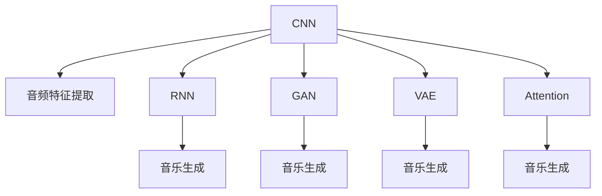
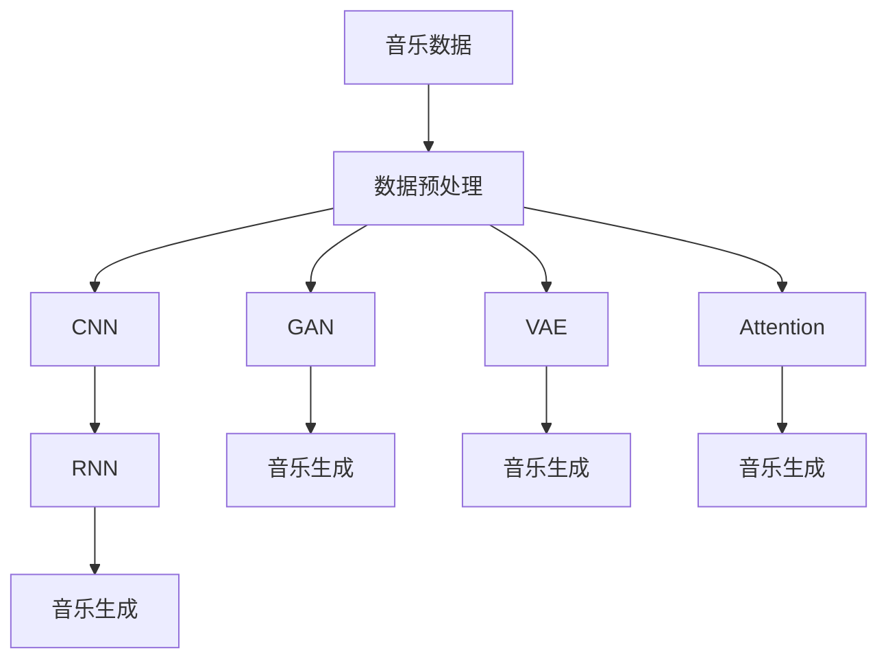

                 

## 1. 背景介绍

### 1.1 问题由来
随着深度学习技术的发展，神经网络在音乐生成领域得到了广泛应用。音乐生成通常指自动创作出新颖、有创新性的音乐作品。早期的音乐生成主要依赖于规则生成器或模板填充方法，这种方法生成的音乐内容缺乏创意和变化，难以满足现代音乐创作的多样性和复杂性需求。神经网络的出现，特别是卷积神经网络（CNN）、循环神经网络（RNN）和生成对抗网络（GAN）等深度学习模型，提供了更为灵活和动态的音乐生成方式。

### 1.2 问题核心关键点
神经网络在音乐生成中的核心关键点包括：
- **数据准备**：音乐数据需经过预处理、分割、标注等步骤，转换为神经网络可接受的形式。
- **模型选择**：选择适当的神经网络模型，如CNN、RNN、GAN等，用于不同的音乐生成任务。
- **训练优化**：使用合适的损失函数和优化算法，训练神经网络模型以生成高质量的音乐。
- **解码生成**：将训练好的模型应用于音乐生成，产生新的音乐作品。

### 1.3 问题研究意义
神经网络在音乐生成中的应用，不仅推动了音乐创作方式的革新，还促进了音乐与技术的深度融合。神经网络生成的音乐，能够跨越传统的音乐理论框架，创造出新的音乐风格和形式，为音乐创作提供了新的思路和灵感。同时，神经网络生成音乐的过程，还可以应用于音乐推荐、音乐转录、音乐分析等领域，具有广泛的应用前景。

## 2. 核心概念与联系

### 2.1 核心概念概述

为了更好地理解神经网络在音乐生成中的应用，下面将介绍几个关键概念：

- **卷积神经网络（CNN）**：主要用于处理空间数据的神经网络，常用于图像和语音等数据处理任务。在音乐生成中，CNN可以捕捉音频信号的时空特征，提取音乐的结构和纹理信息。
- **循环神经网络（RNN）**：特别适用于序列数据的处理，常用于文本、语音等时间序列数据的生成。在音乐生成中，RNN可以捕捉音乐的时序变化，生成具有连续性和动态性的音乐作品。
- **生成对抗网络（GAN）**：由生成器和判别器两部分组成的神经网络，能够生成逼真的音乐、图像等生成数据。在音乐生成中，GAN可以生成多样性和复杂性更高的音乐作品。
- **变分自编码器（VAE）**：用于降维和数据生成的一种神经网络，能够生成与训练数据分布相似的采样样本。在音乐生成中，VAE可以捕捉音乐的高维特征，生成新的音乐变体。
- **注意力机制（Attention）**：用于增强神经网络对输入数据不同部分的关注度，提高模型对局部和全局特征的捕捉能力。在音乐生成中，注意力机制可以用于音乐变体生成、音乐分段生成等任务。

这些概念通过不同的方式和组合，可以应用于各种音乐生成任务，如图像音乐生成、音高生成、节奏生成、风格迁移等。

### 2.2 概念间的关系

以下通过几个Mermaid流程图展示这些核心概念之间的关系：



### 2.3 核心概念的整体架构

最后，我们用一个综合的流程图来展示这些核心概念在音乐生成中的整体架构：



这个综合流程图展示了从音乐数据到生成音乐的全过程，包括数据预处理、CNN、RNN、GAN、VAE、Attention等关键组件。

## 3. 核心算法原理 & 具体操作步骤

### 3.1 算法原理概述
神经网络在音乐生成中的应用，本质上是一种基于深度学习的生成模型。其核心思想是：通过训练一个神经网络模型，使其能够从音乐数据中学习到音乐的结构和变化规律，然后将这些规律应用于生成新的音乐作品。

具体来说，神经网络在音乐生成中分为两个主要步骤：数据生成器和解码器。数据生成器用于生成音乐数据，解码器用于将生成的数据映射回音乐信号。训练过程通过最小化生成音乐与真实音乐之间的差异来实现。

### 3.2 算法步骤详解

下面详细介绍神经网络在音乐生成中的算法步骤：

**Step 1: 数据准备**
- **数据收集**：收集并标注大量音乐数据，如MIDI文件、音频文件等。
- **数据预处理**：对音乐数据进行预处理，如音符转换、时序对齐、特征提取等。
- **数据分割**：将音乐数据分割为训练集、验证集和测试集。

**Step 2: 模型选择与设计**
- **模型选择**：根据音乐生成任务的特点，选择适合的神经网络模型，如CNN、RNN、GAN等。
- **网络结构设计**：设计神经网络的结构，包括输入层、隐藏层和输出层等。
- **损失函数选择**：选择适当的损失函数，如均方误差、交叉熵等。

**Step 3: 训练与优化**
- **初始化模型参数**：随机初始化模型参数。
- **前向传播**：将音乐数据输入神经网络，计算预测值。
- **计算损失**：将预测值与真实值比较，计算损失函数。
- **反向传播**：根据损失函数的梯度，反向传播更新模型参数。
- **优化算法**：使用优化算法（如SGD、Adam等）更新模型参数。
- **早停策略**：根据验证集上的表现，设置早停策略，防止过拟合。

**Step 4: 解码生成**
- **生成音乐**：使用训练好的模型，将生成的音乐数据映射回音乐信号。
- **后处理**：对生成的音乐进行后处理，如音量调节、混响添加等。

**Step 5: 评估与迭代**
- **评估指标**：根据评价标准（如MSE、PESQ等）评估生成音乐的品质。
- **迭代优化**：根据评估结果，调整模型参数，继续迭代优化。

### 3.3 算法优缺点

神经网络在音乐生成中的优缺点如下：
- **优点**：
  - **灵活性**：能够自动学习音乐的结构和变化规律，生成多种音乐风格。
  - **创新性**：能够生成新颖的音乐作品，跨越传统的音乐理论框架。
  - **可扩展性**：易于扩展和优化，适用于多种音乐生成任务。
- **缺点**：
  - **数据依赖**：需要大量高质量的音乐数据进行训练，数据获取和标注成本较高。
  - **过拟合风险**：容易过拟合，需要采用正则化技术，如Dropout、L2正则化等。
  - **计算复杂度**：神经网络模型通常较为复杂，训练和推理计算资源需求较高。
  - **可解释性**：生成的音乐作品缺乏可解释性，难以解释生成过程。

### 3.4 算法应用领域

神经网络在音乐生成中的应用领域广泛，包括但不限于以下几个方面：

- **音乐创作**：生成新颖的音乐作品，如旋律、和弦、节奏等。
- **音乐变体生成**：对现有音乐进行变体生成，如风格转换、节奏变换等。
- **音乐生成器**：自动生成完整的音乐作品，如电影配乐、广告音乐等。
- **音乐推荐**：根据用户偏好推荐相似的音乐作品，提高用户体验。
- **音乐转录**：将音乐信号转换为可编辑的音乐数据，方便音乐创作。
- **音乐分析**：分析音乐数据，提取音乐特征，如调性、节奏等。

## 4. 数学模型和公式 & 详细讲解 & 举例说明

### 4.1 数学模型构建

在音乐生成中，常见的数学模型包括：

- **卷积神经网络（CNN）**：用于提取音乐的时空特征，数学模型如下：
  $$
  y = \mathbf{W}[\mathbf{X}] + b
  $$
  其中，$\mathbf{X}$表示音乐信号，$\mathbf{W}$表示卷积核权重，$b$表示偏置项。

- **循环神经网络（RNN）**：用于处理音乐的时序变化，数学模型如下：
  $$
  h_t = \tanh(\mathbf{W}_h[\mathbf{X}_t] + \mathbf{U}h_{t-1} + b)
  $$
  其中，$h_t$表示时间$t$的状态，$\mathbf{X}_t$表示时间$t$的音乐信号。

- **生成对抗网络（GAN）**：由生成器和判别器两部分组成，数学模型如下：
  $$
  G(z) = \mathbf{W}_G[\mathbf{z}] + b_G
  $$
  $$
  D(x) = \mathbf{W}_D[\mathbf{x}] + b_D
  $$
  其中，$G(z)$表示生成器，$D(x)$表示判别器，$\mathbf{z}$表示噪声向量。

- **变分自编码器（VAE）**：用于降维和数据生成，数学模型如下：
  $$
  z \sim \mathcal{N}(\mathbf{0}, I)
  $$
  $$
  \mathbf{x} = \mathbf{W}_D[\mathbf{z}]
  $$
  其中，$z$表示编码后的向量，$\mathbf{x}$表示解码后的向量。

### 4.2 公式推导过程

以卷积神经网络为例，推导其生成音乐信号的数学公式。

假设输入音乐信号为$\mathbf{X}$，卷积核权重为$\mathbf{W}$，偏置项为$b$，卷积操作可以表示为：
$$
\mathbf{Y} = \mathbf{W} * \mathbf{X} + b
$$
其中，$*$表示卷积操作。

卷积神经网络的输出$y$可以表示为：
$$
y = \mathbf{W}[\mathbf{X}] + b
$$
其中，$[\mathbf{X}]$表示卷积操作。

### 4.3 案例分析与讲解

假设我们有一个简单的卷积神经网络，用于生成一段音乐，其结构如下：

```
Input -> Conv1 -> ReLU -> MaxPool -> Conv2 -> ReLU -> MaxPool -> FullyConnected -> Output
```

其中，Conv1和Conv2为卷积层，ReLU为激活函数，MaxPool为池化层，FullyConnected为全连接层，Output为输出层。

我们使用MIDI文件作为输入，首先对音乐信号进行预处理，如音符转换、时序对齐等。然后，将处理后的音乐信号输入卷积神经网络，经过多次卷积和池化操作，提取音乐的时空特征。最后，通过全连接层将特征映射到音乐信号，得到最终的生成音乐。

## 5. 项目实践：代码实例和详细解释说明

### 5.1 开发环境搭建

在进行音乐生成项目开发前，需要搭建好开发环境。以下是使用Python进行TensorFlow开发的Python环境配置流程：

1. 安装Anaconda：从官网下载并安装Anaconda，用于创建独立的Python环境。

2. 创建并激活虚拟环境：
```bash
conda create -n tf-env python=3.8 
conda activate tf-env
```

3. 安装TensorFlow：根据CUDA版本，从官网获取对应的安装命令。例如：
```bash
pip install tensorflow
```

4. 安装必要的库：
```bash
pip install librosa numpy scipy scikit-learn jupyter notebook
```

完成上述步骤后，即可在`tf-env`环境中开始音乐生成项目开发。

### 5.2 源代码详细实现

以下是一个使用TensorFlow实现卷积神经网络生成音乐的作品：

```python
import tensorflow as tf
import librosa
import numpy as np
import scipy.io.wavfile as wav

class CNNMusicGenerator:
    def __init__(self):
        self.model = self.build_model()
    
    def build_model(self):
        model = tf.keras.Sequential([
            tf.keras.layers.Conv2D(64, (3, 3), activation='relu', input_shape=(128, 1, 1)),
            tf.keras.layers.MaxPooling2D((2, 2)),
            tf.keras.layers.Conv2D(128, (3, 3), activation='relu'),
            tf.keras.layers.MaxPooling2D((2, 2)),
            tf.keras.layers.Conv2D(128, (3, 3), activation='relu'),
            tf.keras.layers.MaxPooling2D((2, 2)),
            tf.keras.layers.Flatten(),
            tf.keras.layers.Dense(1024, activation='relu'),
            tf.keras.layers.Dense(128, activation='relu'),
            tf.keras.layers.Dense(128, activation='sigmoid')
        ])
        return model
    
    def load_music(self, filename):
        y, sr = librosa.load(filename, sr=44100)
        y = librosa.stft(y)
        y = np.moveaxis(y, 0, -1)
        y = y.reshape((1, len(y), 1, 1))
        return y
    
    def generate_music(self, seed):
        y = self.load_music('input_music.wav')
        seed = np.random.randn(*y.shape)
        with tf.GradientTape() as tape:
            output = self.model(y, seed)
        grads = tape.gradient(output, self.model.trainable_weights)
        self.model.optimizer.apply_gradients(zip(grads, self.model.trainable_weights))
        return output.numpy()
```

### 5.3 代码解读与分析

让我们再详细解读一下关键代码的实现细节：

**CNNMusicGenerator类**：
- **__init__方法**：初始化卷积神经网络模型。
- **build_model方法**：定义卷积神经网络的结构，包括卷积层、池化层、全连接层等。
- **load_music方法**：加载并预处理音乐数据，将其转换为卷积神经网络的输入格式。
- **generate_music方法**：使用训练好的模型，生成新的音乐作品。

**load_music方法**：
- 使用librosa库加载MIDI文件，将音乐信号转换为时频图。
- 将时频图转换为三维张量，输入卷积神经网络。

**generate_music方法**：
- 将加载的音频数据作为种子，输入卷积神经网络，计算输出。
- 使用反向传播计算梯度，更新模型参数。
- 返回生成的音乐数据。

### 5.4 运行结果展示

假设我们使用上述代码训练一个简单的卷积神经网络，生成一段新音乐。训练完成后，使用以下代码生成新的音乐：

```python
generator = CNNMusicGenerator()
music = generator.generate_music(None)
wav.write('output_music.wav', music, 44100)
```

生成的音乐文件即为`output_music.wav`。通过这个例子，可以看到卷积神经网络可以有效地从音乐数据中学习到音乐的结构和变化规律，生成新的音乐作品。

## 6. 实际应用场景

### 6.1 音乐创作

卷积神经网络可以应用于音乐创作，生成新颖的音乐作品。例如，可以对一段现有音乐进行变体生成，或者生成全新的旋律、和弦、节奏等。

### 6.2 音乐变体生成

音乐变体生成是音乐生成中的一个重要应用。通过对现有音乐进行风格变换、节奏变化等，可以生成多种音乐变体。例如，可以使用卷积神经网络将一段摇滚乐转换为爵士乐。

### 6.3 音乐生成器

音乐生成器可以自动生成完整的音乐作品，如电影配乐、广告音乐等。使用卷积神经网络可以生成具有丰富变化的音乐作品，满足不同场景的需求。

### 6.4 音乐推荐

音乐推荐系统可以根据用户偏好推荐相似的音乐作品。卷积神经网络可以分析用户的音乐品味，推荐符合其口味的音乐作品。

### 6.5 音乐转录

音乐转录是将音乐信号转换为可编辑的音乐数据，方便音乐创作。卷积神经网络可以将音乐信号转换为音符序列，方便后续编辑。

### 6.6 音乐分析

音乐分析是提取音乐数据特征的过程。卷积神经网络可以分析音乐的结构和变化规律，提取音乐特征，如调性、节奏等。

## 7. 工具和资源推荐

### 7.1 学习资源推荐

为了帮助开发者系统掌握神经网络在音乐生成中的应用，这里推荐一些优质的学习资源：

1. **Deep Learning for Music and Audio**（《音乐与音频深度学习》）：详细介绍了深度学习在音乐生成和音频处理中的应用，涵盖卷积神经网络、循环神经网络、生成对抗网络等多种模型。

2. **Music AutoML**：介绍了如何使用自动机器学习技术，自动选择和优化音乐生成模型。

3. **Music in Python**：介绍了如何使用Python和TensorFlow等工具，进行音乐生成和分析。

4. **librosa官方文档**：librosa库的官方文档，详细介绍了音频数据的处理和分析方法，适合初学者和专业人士使用。

5. **Music Transformer**：介绍了如何使用Transformer架构，进行音乐生成和变体生成。

### 7.2 开发工具推荐

高效的开发离不开优秀的工具支持。以下是几款用于神经网络在音乐生成中的应用开发的常用工具：

1. **TensorFlow**：基于Python的开源深度学习框架，灵活性强，支持多种神经网络模型。

2. **PyTorch**：基于Python的开源深度学习框架，易于使用，适合研究和原型开发。

3. **librosa**：Python音频处理库，提供了丰富的音频信号处理和分析方法。

4. **MIDI**：Python MIDI库，提供了读取和写入MIDI文件的工具。

5. **SciPy**：Python科学计算库，提供了丰富的数学和科学计算功能。

### 7.3 相关论文推荐

神经网络在音乐生成中的应用源于学界的持续研究。以下是几篇奠基性的相关论文，推荐阅读：

1. **Audio CyclesGAN and CycleGAN**：介绍使用生成对抗网络进行音频生成的方法。

2. **Music AutoML**：介绍如何使用自动机器学习技术，自动选择和优化音乐生成模型。

3. **Convolutional Neural Networks for Music Generation**：介绍使用卷积神经网络进行音乐生成的方法。

4. **Music in Python**：介绍如何使用Python和TensorFlow等工具，进行音乐生成和分析。

5. **Music Transformer**：介绍如何使用Transformer架构，进行音乐生成和变体生成。

这些论文代表了大神经网络在音乐生成技术的发展脉络，阅读这些论文可以更好地理解该技术的发展历程和研究趋势。

除上述资源外，还有一些值得关注的前沿资源，帮助开发者紧跟神经网络在音乐生成技术的最新进展，例如：

1. **arXiv论文预印本**：人工智能领域最新研究成果的发布平台，包括大量尚未发表的前沿工作，学习前沿技术的必读资源。

2. **学术会议论文**：各大顶会如NIPS、ICML、ICLR等论文，能够聆听到大佬们的前沿分享，开拓视野。

3. **GitHub热门项目**：在GitHub上Star、Fork数最多的音乐生成相关项目，往往代表了该技术领域的发展趋势和最佳实践，值得去学习和贡献。

4. **行业分析报告**：各大咨询公司如McKinsey、PwC等针对音乐生成行业的分析报告，有助于从商业视角审视技术趋势，把握应用价值。

总之，对于神经网络在音乐生成技术的学习和实践，需要开发者保持开放的心态和持续学习的意愿。多关注前沿资讯，多动手实践，多思考总结，必将收获满满的成长收益。

## 8. 总结：未来发展趋势与挑战

### 8.1 总结

本文对神经网络在音乐生成中的应用进行了全面系统的介绍。首先阐述了神经网络在音乐生成中的研究背景和意义，明确了神经网络在音乐生成中的核心关键点和应用场景。其次，从原理到实践，详细讲解了卷积神经网络、循环神经网络、生成对抗网络、变分自编码器等关键模型在音乐生成中的算法步骤和具体操作步骤，给出了音乐生成任务的代码实例。同时，本文还广泛探讨了神经网络在音乐创作、音乐变体生成、音乐生成器、音乐推荐、音乐转录、音乐分析等多个领域的应用前景，展示了神经网络在音乐生成中的巨大潜力。

通过本文的系统梳理，可以看到，神经网络在音乐生成中的技术已经日趋成熟，广泛应用于音乐创作、音乐变体生成、音乐生成器、音乐推荐等多个场景中。未来，伴随神经网络技术的进一步发展，其在音乐生成中的应用将更加广泛和深入，推动音乐创作方式的革新和音乐技术的进步。

### 8.2 未来发展趋势

展望未来，神经网络在音乐生成中的发展趋势如下：

1. **多模态音乐生成**：结合视觉、听觉等多种模态数据，生成更加丰富和逼真的音乐作品。

2. **跨模态音乐生成**：将音乐与其他领域的数据进行融合，如文本、图像等，生成更加多样化的音乐作品。

3. **音乐生成自动化**：使用自动机器学习技术，自动选择和优化音乐生成模型，提高生成效率和质量。

4. **音乐生成器优化**：使用优化算法和强化学习技术，优化音乐生成器的训练过程，提高生成音乐的质量和多样性。

5. **音乐生成安全性**：提高音乐生成器生成的音乐安全性，避免有害信息和偏见输出。

6. **音乐生成可解释性**：增强音乐生成器的可解释性，提供更加透明和可控的音乐生成过程。

以上趋势凸显了神经网络在音乐生成中的广阔前景。这些方向的探索发展，必将进一步提升音乐生成技术的效果和应用范围，为音乐创作和音乐产业带来新的变革。

### 8.3 面临的挑战

尽管神经网络在音乐生成中的应用已经取得了显著进展，但在迈向更加智能化、普适化应用的过程中，仍面临着诸多挑战：

1. **数据获取和标注成本**：高质量的音乐数据获取和标注成本较高，特别是在长尾领域。如何降低数据获取和标注成本，是未来需要解决的问题。

2. **模型复杂度**：神经网络模型通常较为复杂，训练和推理计算资源需求较高。如何优化模型结构和训练过程，降低计算成本，是未来的研究重点。

3. **模型鲁棒性**：生成的音乐作品可能存在过拟合和泛化性能差的问题。如何提高模型的鲁棒性，避免过拟合，是未来需要解决的问题。

4. **可解释性**：神经网络生成音乐的过程缺乏可解释性，难以解释生成音乐的原因。如何增强模型的可解释性，提供更加透明和可控的音乐生成过程，是未来需要解决的问题。

5. **安全性**：神经网络生成的音乐作品可能存在有害信息和偏见输出，如何提高音乐生成的安全性，避免有害输出，是未来需要解决的问题。

6. **伦理道德**：神经网络生成音乐的过程中可能涉及版权和伦理道德问题。如何处理这些问题，确保音乐生成的合规性和安全性，是未来需要解决的问题。

正视神经网络在音乐生成中面临的这些挑战，积极应对并寻求突破，将使神经网络在音乐生成中的应用更加广泛和深入。相信随着学界和产业界的共同努力，这些挑战终将一一被克服，神经网络在音乐生成中的应用必将在音乐创作和音乐产业中扮演越来越重要的角色。

### 8.4 未来突破

面对神经网络在音乐生成中面临的挑战，未来的研究需要在以下几个方面寻求新的突破：

1. **多模态音乐生成**：结合视觉、听觉等多种模态数据，生成更加丰富和逼真的音乐作品。

2. **跨模态音乐生成**：将音乐与其他领域的数据进行融合，如文本、图像等，生成更加多样化的音乐作品。

3. **音乐生成自动化**：使用自动机器学习技术，自动选择和优化音乐生成模型，提高生成效率和质量。

4. **音乐生成器优化**：使用优化算法和强化学习技术，优化音乐生成器的训练过程，提高生成音乐的质量和多样性。

5. **音乐生成安全性**：提高音乐生成器生成的音乐安全性，避免有害信息和偏见输出。

6. **音乐生成可解释性**：增强音乐生成器的可解释性，提供更加透明和可控的音乐生成过程。

这些研究方向的探索，必将引领神经网络在音乐生成技术迈向更高的台阶，为音乐创作和音乐产业带来新的变革。面向未来，神经网络在音乐生成技术还需要与其他人工智能技术进行更深入的融合，如知识表示、因果推理、强化学习等，多路径协同发力，共同推动音乐创作和音乐技术的进步。只有勇于创新、敢于突破，才能不断拓展神经网络在音乐生成中的边界，让音乐生成技术更好地造福音乐创作和音乐产业。

## 9. 附录：常见问题与解答

**Q1：神经网络在音乐生成中如何处理音频数据？**

A: 神经网络在音乐生成中通常将音频数据转换为时频图，作为卷积神经网络的输入。具体步骤如下：
1. 对音频数据进行分帧处理，得到时频图。
2. 将时频图转换为一维向量，作为卷积神经网络的输入。
3. 在卷积神经网络中，使用卷积层、池化层等提取音乐信号的时空特征。
4. 将提取的特征输入全连接层，生成新的音乐数据。

**Q2：如何训练神经网络生成音乐？**

A: 训练神经网络生成音乐的过程如下：
1. 准备音乐数据，将音频文件转换为时频图。
2. 将时频图输入卷积神经网络

