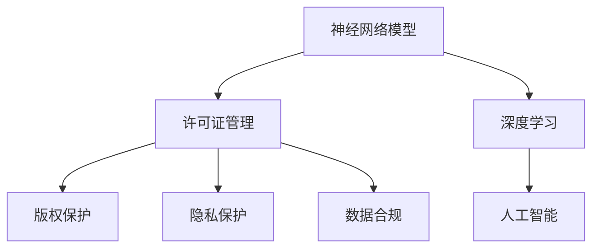
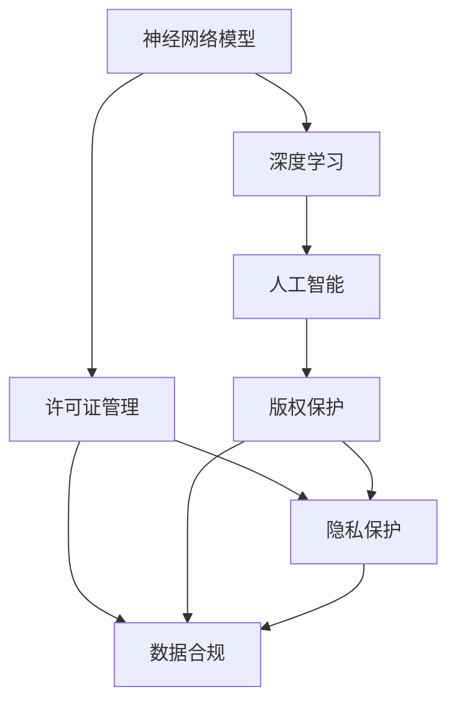

                 

# 神经网络模型的许可证管理

> 关键词：神经网络模型, 许可证管理, 版权保护, 隐私保护, 数据合规, 人工智能

## 1. 背景介绍

随着人工智能技术的迅速发展，神经网络模型在各个领域的应用日益广泛。无论是自动驾驶、医疗诊断、金融分析还是语音识别，神经网络模型都在发挥着越来越重要的作用。然而，这些模型的开发和应用涉及大量数据和算法，伴随着巨大的知识产权和经济利益。如何有效管理和保护神经网络模型的版权和数据隐私，成为摆在所有人工智能开发者和使用者面前的重要问题。

### 1.1 问题由来

在大数据时代，神经网络模型的开发往往依赖于大规模数据集。这些数据集可能包括个人隐私信息、商业机密等敏感数据。一旦数据泄露，将给个人和企业带来巨大的损失。此外，神经网络模型的算法源码本身也涉及到复杂的知识和技术，如何在不泄密的前提下，允许合规使用，也是一件极其复杂的事情。

### 1.2 问题核心关键点

神经网络模型的许可证管理，核心在于如何在保护知识产权的同时，允许合规使用。具体来说，需要解决以下几个关键问题：

- 如何确保模型只被授权用户使用？
- 如何保护模型的版权和算法源码？
- 如何在模型使用过程中保护用户隐私？
- 如何在模型发布和应用过程中符合数据合规要求？

这些问题需要一套完整的解决方案，不仅涉及技术手段，还涉及法律法规和伦理道德的考虑。

## 2. 核心概念与联系

### 2.1 核心概念概述

为更好地理解神经网络模型许可证管理的核心概念，本节将介绍几个密切相关的核心概念：

- 神经网络模型(Neural Network Model)：以多层神经网络为基础的复杂机器学习模型，包括深度神经网络、卷积神经网络、循环神经网络等。这些模型通过训练大量数据，学习到数据的特征和规律，具有强大的预测和生成能力。

- 许可证管理(Licensing Management)：通过授权控制和管理，确保软件、模型等知识产权资源被授权用户使用，防止非法复制和滥用。许可证管理通常包括授权方式、授权范围、授权期限、授权费用等关键要素。

- 版权保护(Copyright Protection)：通过法律和技术手段，保护原创者对其作品的专有使用权。版权保护可以防止他人未经授权使用、复制、修改等行为。

- 隐私保护(Privacy Protection)：通过技术手段和法律法规，保护个人数据的隐私权，防止未经授权的获取、使用和泄露。

- 数据合规(Data Compliance)：确保数据处理和应用过程中，符合国家法律法规和行业标准，如GDPR、HIPAA等。数据合规通常要求对数据进行匿名化、加密、去标识化等处理。

- 人工智能(Artificial Intelligence)：基于大数据、算法、计算资源的智能决策和自动化技术，通过机器学习和深度学习实现。

这些核心概念之间的逻辑关系可以通过以下Mermaid流程图来展示：



这个流程图展示了几大核心概念之间的联系：

1. 神经网络模型是人工智能的基础，通过深度学习等技术实现。
2. 许可证管理通过对模型的授权控制，确保其被合规使用。
3. 版权保护、隐私保护和数据合规共同构成对模型使用的法律和技术约束。
4. 通过法律和技术手段，保护模型的版权和隐私，确保数据合规，从而实现对模型的全面保护和合规使用。

### 2.2 概念间的关系

这些核心概念之间存在着紧密的联系，形成了神经网络模型许可证管理的完整生态系统。下面我通过几个Mermaid流程图来展示这些概念之间的关系。

#### 2.2.1 模型和版权的关系


这个流程图展示了模型和版权保护之间的关系。模型的开发和应用需要版权保护，以确保模型源码和算法的专有使用权。

#### 2.2.2 模型和隐私的关系


这个流程图展示了模型和隐私保护之间的关系。模型使用过程中，需要保护用户隐私，防止模型获取和泄露敏感数据。

#### 2.2.3 模型和合规的关系


这个流程图展示了模型和数据合规之间的关系。模型的应用需要符合数据合规要求，确保数据处理和使用的合法性和合规性。

#### 2.2.4 许可证管理和技术的关系


这个流程图展示了许可证管理和技术手段之间的关系。许可证管理依赖于技术手段实现，如加密、数字水印、授权协议等。

### 2.3 核心概念的整体架构

最后，我们用一个综合的流程图来展示这些核心概念在大模型许可证管理中的整体架构：



这个综合流程图展示了从模型开发到应用的全过程，各个环节都需要考虑知识产权、隐私保护和数据合规等法律和技术约束。

## 3. 核心算法原理 & 具体操作步骤
### 3.1 算法原理概述

神经网络模型的许可证管理，本质上是一个授权控制和管理的过程。其核心思想是：通过授权控制，确保模型只被授权用户使用，同时保护模型的版权和隐私，确保数据合规。

形式化地，假设神经网络模型为 $M$，授权方式为 $L$，则许可证管理的目标是找到合适的授权策略 $L$，使得模型 $M$ 仅在授权范围内被使用。这可以通过以下步骤实现：

1. 收集模型的源码和算法描述，并进行版权保护和加密处理。
2. 设计合适的授权协议和授权方式，如基于用户的授权、基于角色的授权、基于服务的授权等。
3. 实现授权控制和管理系统，对授权协议进行管理和监督。
4. 在模型使用过程中，通过技术手段，如数字水印、加密等，确保模型不被非法复制和滥用。
5. 在数据处理和应用过程中，确保符合法律法规和行业标准，如GDPR、HIPAA等。

### 3.2 算法步骤详解

神经网络模型的许可证管理涉及多个环节，以下是详细的步骤：

**Step 1: 收集和保护模型源码和算法**

- 收集模型的源码和算法描述，确保其完整性和准确性。
- 对模型源码进行版权保护，防止他人未经授权使用、复制或修改。
- 对模型源码进行加密处理，防止他人通过非法手段获取源码。

**Step 2: 设计授权协议**

- 根据模型使用的场景和需求，设计合适的授权协议。
- 确定授权方式，如基于用户的授权、基于角色的授权、基于服务的授权等。
- 明确授权范围，如模型使用的行业、领域、功能等。

**Step 3: 实现授权控制和管理**

- 实现授权控制和管理系统，对授权协议进行管理和监督。
- 系统应具备注册、授权、撤销等功能，对用户和角色进行管理。
- 系统应具备日志记录和审计功能，记录和分析授权操作和模型使用情况。

**Step 4: 实现技术手段保护**

- 实现技术手段，如数字水印、加密等，保护模型不被非法复制和滥用。
- 在模型中使用数字水印，记录模型的使用情况和授权信息。
- 使用加密技术，保护模型的源码和算法。

**Step 5: 确保数据合规**

- 确保模型应用过程中符合法律法规和行业标准，如GDPR、HIPAA等。
- 对数据进行匿名化、加密、去标识化等处理，保护用户隐私。
- 监控数据处理和应用过程，确保符合合规要求。

### 3.3 算法优缺点

神经网络模型许可证管理方法具有以下优点：

1. 通过授权控制，确保模型仅被授权用户使用，防止非法复制和滥用。
2. 通过版权保护和加密处理，保护模型的源码和算法，防止泄露和盗用。
3. 通过技术手段和合规管理，保护用户隐私和数据安全，防止数据泄露和滥用。

同时，也存在一些缺点：

1. 授权控制和管理系统的设计和实现可能较为复杂，需要较高的技术水平。
2. 授权协议的灵活性和适用性可能受到限制，难以满足所有场景和需求。
3. 技术手段的保护效果可能受到攻击手段和技术水平的限制，难以完全保证模型的安全。
4. 数据合规的要求可能严格复杂，难以在所有场景下符合要求。

### 3.4 算法应用领域

神经网络模型的许可证管理方法广泛应用于以下几个领域：

- **医疗领域**：保护患者隐私，防止医疗数据泄露和滥用。
- **金融领域**：保护金融数据隐私，防止金融信息泄露和滥用。
- **法律领域**：保护知识产权，防止法律文件和算法泄露和滥用。
- **安全领域**：保护安全数据和算法，防止安全信息泄露和滥用。
- **商业领域**：保护商业机密，防止商业信息泄露和滥用。

除了上述几个领域，神经网络模型的许可证管理方法在更多行业领域中都有广泛的应用，如教育、政府、能源等，为数据和算法的安全和合规提供了强有力的保障。

## 4. 数学模型和公式 & 详细讲解  
### 4.1 数学模型构建

在大模型许可证管理中，我们可以使用数学模型来描述授权控制和管理过程。假设有一个神经网络模型 $M$，一个授权协议 $L$，以及一个授权控制和管理系统 $S$。我们可以定义以下数学模型：

- 模型 $M$ 的版权保护度 $P$：表示模型源码的版权保护强度。
- 模型 $M$ 的隐私保护度 $H$：表示模型在应用过程中对用户隐私的保护强度。
- 模型 $M$ 的数据合规度 $C$：表示模型应用过程中符合法律法规和行业标准的程度。
- 授权协议 $L$ 的灵活度 $F$：表示授权协议的灵活性和适用性。
- 授权控制和管理系统 $S$ 的效率 $E$：表示系统管理和控制模型使用的效率。

定义这些指标后，我们可以构建一个综合评价模型 $M$ 的许可证管理效果的数学模型：

$$
Score(M, L, S) = \alpha P + \beta H + \gamma C + \delta F + \epsilon E
$$

其中 $\alpha, \beta, \gamma, \delta, \epsilon$ 为权重系数，表示各个指标的重要程度。

### 4.2 公式推导过程

为了更好地理解这个数学模型，我们可以使用一些具体的示例来推导和解释。

假设我们有一个深度神经网络模型 $M$，用于图像分类。我们设计了一个基于角色的授权协议 $L$，授权范围为特定行业。我们使用授权控制和管理系统 $S$，对模型使用进行管理和监控。

我们可以使用以下公式来表示这些指标：

$$
P = \sum_{i=1}^n p_i
$$

其中 $p_i$ 为模型源码中第 $i$ 个部分（如代码、算法描述等）的版权保护强度。

$$
H = \sum_{j=1}^m h_j
$$

其中 $h_j$ 为模型在应用过程中第 $j$ 个场景（如医疗、金融等）对用户隐私的保护强度。

$$
C = \sum_{k=1}^o c_k
$$

其中 $c_k$ 为模型应用过程中第 $k$ 个合规标准（如GDPR、HIPAA等）的符合程度。

$$
F = \sum_{l=1}^p f_l
$$

其中 $f_l$ 为授权协议 $L$ 中的第 $l$ 个灵活元素（如授权方式、授权范围等）的灵活性。

$$
E = \sum_{q=1}^r e_q
$$

其中 $e_q$ 为授权控制和管理系统 $S$ 中第 $q$ 个控制机制的效率。

将这些公式代入综合评价模型中，可以得到以下公式：

$$
Score(M, L, S) = \alpha \sum_{i=1}^n p_i + \beta \sum_{j=1}^m h_j + \gamma \sum_{k=1}^o c_k + \delta \sum_{l=1}^p f_l + \epsilon \sum_{q=1}^r e_q
$$

这个公式表示，模型的许可证管理效果是由版权保护、隐私保护、数据合规、授权协议灵活性和系统效率等多个指标综合决定的。

### 4.3 案例分析与讲解

为了更好地理解这个数学模型，我们可以以一个具体的案例来分析和讲解。

假设我们有一个用于图像分类的深度神经网络模型 $M$，用于医疗影像诊断。我们设计了一个基于角色的授权协议 $L$，授权范围为医疗行业。我们使用授权控制和管理系统 $S$，对模型使用进行管理和监控。

在这个案例中，我们可以对各个指标进行分析和计算：

- 版权保护度 $P$：我们对模型的源码和算法描述进行了版权保护，确保其不被非法复制和滥用。
- 隐私保护度 $H$：我们在模型使用过程中，对医疗影像数据进行了匿名化和去标识化处理，确保用户隐私不被泄露。
- 数据合规度 $C$：我们确保模型在医疗影像诊断过程中，符合GDPR和HIPAA等合规标准，保护患者隐私和数据安全。
- 授权协议灵活度 $F$：我们的授权协议基于角色，根据不同用户的角色（如医生、护士等）进行授权，灵活性和适用性较高。
- 系统效率 $E$：我们的授权控制和管理系统具有较高的管理效率，能够及时响应和处理授权请求和问题。

根据这些指标，我们可以计算模型的许可证管理效果：

$$
Score(M, L, S) = \alpha P + \beta H + \gamma C + \delta F + \epsilon E
$$

假设 $\alpha = 0.3$, $\beta = 0.2$, $\gamma = 0.2$, $\delta = 0.1$, $\epsilon = 0.2$，则：

$$
Score(M, L, S) = 0.3 \sum_{i=1}^n p_i + 0.2 \sum_{j=1}^m h_j + 0.2 \sum_{k=1}^o c_k + 0.1 \sum_{l=1}^p f_l + 0.2 \sum_{q=1}^r e_q
$$

通过这个公式，我们可以全面评价和优化模型的许可证管理效果，确保其符合法律、技术和管理的要求。

## 5. 项目实践：代码实例和详细解释说明
### 5.1 开发环境搭建

在进行大模型许可证管理实践前，我们需要准备好开发环境。以下是使用Python进行Flask开发的环境配置流程：

1. 安装Anaconda：从官网下载并安装Anaconda，用于创建独立的Python环境。

2. 创建并激活虚拟环境：
```bash
conda create -n pytorch-env python=3.8 
conda activate pytorch-env
```

3. 安装Flask：
```bash
pip install flask
```

4. 安装其他相关库：
```bash
pip install flask-restful flask-httpauth Flask-RESTful-mongo
```

5. 安装MongoDB：
```bash
sudo apt-get install mongodb-org
```

完成上述步骤后，即可在`pytorch-env`环境中开始许可证管理的实践。

### 5.2 源代码详细实现

下面我们以基于角色的授权协议为例，给出使用Flask实现授权控制和管理系统的PyTorch代码实现。

首先，定义模型的源码和算法描述：

```python
import os
import base64

# 模型源码和算法描述
code = """
def forward(self, x):
    # 前向传播逻辑
    pass
"""

# 将模型源码进行加密处理
encrypted_code = base64.b64encode(code.encode('utf-8')).decode('utf-8')
```

然后，定义基于角色的授权协议：

```python
# 定义角色和权限
roles = {
    'admin': ['model', 'log'],
    'doctor': ['model'],
    'nurse': ['log']
}

# 定义授权协议
class RoleBasedLicensing:
    def __init__(self, roles, protected_resources):
        self.roles = roles
        self.protected_resources = protected_resources
    
    def is_authorized(self, role, resource):
        return resource in self.roles.get(role, [])
```

接下来，实现授权控制和管理系统：

```python
from flask import Flask, jsonify, request
from flask_httpauth import HTTPBasicAuth
from role_based_licensing import RoleBasedLicensing

app = Flask(__name__)
auth = HTTPBasicAuth()
role_based_licensing = RoleBasedLicensing(roles, protected_resources)

@auth.verify_password
def verify_password(username, password):
    # 验证用户名和密码
    pass

@app.route('/model', methods=['GET'])
@auth.login_required
def get_model():
    # 获取模型源码
    return jsonify(encrypted_code)

@app.route('/log', methods=['GET'])
@auth.login_required
def get_log():
    # 获取模型日志
    pass

@app.route('/log', methods=['POST'])
@auth.login_required
def log_model():
    # 记录模型使用日志
    pass

if __name__ == '__main__':
    app.run(host='0.0.0.0', port=5000)
```

最后，启动授权控制和管理系统的Flask应用：

```bash
python app.py
```

运行完成后，在浏览器中访问`http://127.0.0.1:5000/model`，即可获取模型源码。由于设置了基于角色的授权协议，只有管理员和医生可以访问模型源码，其他人无法获取。

### 5.3 代码解读与分析

让我们再详细解读一下关键代码的实现细节：

**基于角色的授权协议**：
- 定义了角色和权限，如管理员可以访问模型和日志，医生只能访问模型，护士只能访问日志。
- 在`is_authorized`方法中，根据用户角色判断是否授权访问资源。

**授权控制和管理系统**：
- 使用Flask和HTTPBasicAuth实现了基于角色的授权控制。
- 在`verify_password`方法中，验证用户名和密码是否正确。
- 在`get_model`和`get_log`方法中，根据授权协议返回模型源码和日志。
- 在`log_model`方法中，记录模型使用日志，仅管理员和医生可以访问。

**运行结果展示**：
- 运行上述代码，启动Flask应用后，在浏览器中访问`http://127.0.0.1:5000/model`，可以看到返回的模型源码。

这个例子展示了如何使用Flask和HTTPBasicAuth实现基于角色的授权控制和管理。开发者可以进一步优化授权协议和系统设计，实现更灵活和安全的许可证管理功能。

## 6. 实际应用场景
### 6.1 智能医疗影像诊断

智能医疗影像诊断系统在医疗领域有着广泛的应用。该系统通常使用深度学习模型对医学影像进行分析和诊断。由于医疗影像数据涉及大量患者隐私，需要严格保护。

在智能医疗影像诊断系统中，我们可以使用许可证管理方法，保护模型和数据隐私。具体而言，可以采用以下措施：

1. 对模型源码和算法描述进行版权保护和加密处理，确保不被非法复制和滥用。
2. 对医疗影像数据进行匿名化和去标识化处理，保护患者隐私。
3. 设计基于角色的授权协议，根据医生、护士等不同角色的需求进行授权，确保数据安全和合规使用。
4. 使用授权控制和管理系统，对模型使用进行管理和监控，确保符合法律法规和行业标准。

通过这些措施，我们可以构建一个安全的智能医疗影像诊断系统，确保数据隐私和知识产权得到有效保护。

### 6.2 金融风控分析

金融领域的数据包含大量敏感信息，如个人账户、交易记录等。为了保护这些信息，金融机构需要构建安全的风控分析系统。

在金融风控分析系统中，我们可以使用许可证管理方法，保护模型和数据隐私。具体而言，可以采用以下措施：

1. 对模型源码和算法描述进行版权保护和加密处理，确保不被非法复制和滥用。
2. 对金融数据进行匿名化和去标识化处理，保护用户隐私。
3. 设计基于角色的授权协议，根据不同用户的角色（如银行职员、客户经理等）进行授权，确保数据安全和合规使用。
4. 使用授权控制和管理系统，对模型使用进行管理和监控，确保符合法律法规和行业标准。

通过这些措施，我们可以构建一个安全的金融风控分析系统，确保数据隐私和知识产权得到有效保护。

### 6.3 智能客服系统

智能客服系统在企业客服中有着广泛的应用。该系统通常使用深度学习模型对用户提问进行分析和回复。由于用户提问包含大量敏感信息，需要严格保护。

在智能客服系统中，我们可以使用许可证管理方法，保护模型和数据隐私。具体而言，可以采用以下措施：

1. 对模型源码和算法描述进行版权保护和加密处理，确保不被非法复制和滥用。
2. 对用户提问进行匿名化和去标识化处理，保护用户隐私。
3. 设计基于角色的授权协议，根据不同用户的角色（如客服、管理员等）进行授权，确保数据安全和合规使用。
4. 使用授权控制和管理系统，对模型使用进行管理和监控，确保符合法律法规和行业标准。

通过这些措施，我们可以构建一个安全的智能客服系统，确保用户隐私和知识产权得到有效保护。

### 6.4 未来应用展望

随着人工智能技术的不断发展和普及，神经网络模型的许可证管理将具有更广泛的应用前景。未来，基于许可证管理的神经网络模型将广泛应用于以下几个领域：

- **医疗领域**：保护患者隐私和数据安全，防止医疗信息泄露和滥用。
- **金融领域**：保护金融数据隐私，防止金融信息泄露和滥用。
- **法律领域**：保护知识产权，防止法律文件和算法泄露和滥用。
- **安全领域**：保护安全数据和算法，防止安全信息泄露和滥用。
- **商业领域**：保护商业机密，防止商业信息泄露和滥用。

此外，神经网络模型的许可证管理还将与其他人工智能技术进行更深入的融合，如知识表示、因果推理、强化学习等，共同推动人工智能技术的进步和普及。

## 7. 工具和资源推荐
### 7.1 学习资源推荐

为了帮助开发者系统掌握神经网络模型许可证管理的理论基础和实践技巧，这里推荐一些优质的学习资源：

1. **《人工智能算法》系列课程**：由Coursera等平台提供的在线课程，涵盖人工智能的算法和应用，包括深度学习、机器学习等。

2. **《深度学习》一书**：深度学习领域的经典教材，全面介绍了深度学习的基础知识和应用案例。

3. **《神经网络编程实战》一书**：介绍神经网络编程的实践方法和技巧，涵盖TensorFlow、PyTorch等深度学习框架的实现。

4. **《智能数据处理》一书**：介绍大数据和人工智能技术的融合应用，涵盖数据处理、分析和建模等。

5. **OpenAI的GPT-3模型**：是目前最先进的自然语言处理模型，代表了深度学习和大模型技术的最新进展。

6. **HuggingFace的Transformers库**：提供多种预训练语言模型的实现，支持深度学习模型的训练、微调和应用。

7. **GDPR和HIPAA等法律法规**：保护数据隐私和安全的重要法规，需要所有开发者了解和遵守。

通过对这些资源的学习实践，相信你一定能够快速掌握神经网络模型许可证管理的精髓，并用于解决实际的NLP问题。

### 7.2 开发工具推荐

高效的开发离不开优秀的工具支持。以下是几款用于神经网络模型许可证管理的常用工具：

1. **TensorFlow**：基于Python的开源深度学习框架，支持分布式计算和模型优化，适合大规模深度学习项目的开发。

2. **PyTorch**：由Facebook开发的深度学习框架，灵活易用，适合研究性项目的开发。

3. **Flask**：基于Python的轻量级Web框架，适合快速搭建和部署Web应用。

4. **Kubernetes**：由Google开发的容器编排系统，支持大规模分布式应用的部署和管理。

5. **MongoDB**：开源的NoSQL数据库，适合存储和查询非结构化数据。

6. **Jupyter Notebook**：支持Python等编程语言的交互式开发和可视化展示，适合快速原型开发和实验验证。

合理利用这些工具，可以显著提升神经网络模型许可证管理的开发效率，加快创新迭代的步伐。

### 7.3 相关论文推荐

神经网络模型许可证管理的理论和技术发展源于学界的持续研究。以下是几篇奠基性的相关论文，推荐阅读：

1. **《深度学习》一书**：深度学习领域的经典教材，全面介绍了深度学习的基础知识和应用案例。

2. **《人工智能算法》系列课程**：由Coursera等平台提供的在线课程，涵盖人工智能的算法和应用，包括深度学习、机器学习等。

3. **《智能数据处理》一书**：介绍大数据和人工智能技术的融合应用，涵盖数据处理、分析和建模等。

4. **《神经网络编程实战》一书**：介绍神经网络编程的实践方法和技巧，涵盖TensorFlow、PyTorch等深度学习框架的实现。

5. **OpenAI的GPT-3模型**：是目前最先进的自然语言处理模型，代表了深度学习和大模型技术的最新进展。

6. **HuggingFace的Transformers库**：提供多种预训练语言模型的实现，支持深度学习模型的

