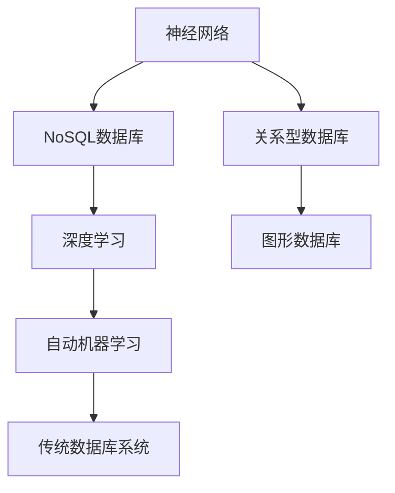

                 

## 1. 背景介绍

在过去几十年中，传统的关系型数据库系统一直是存储和查询数据的主要方式。这些系统基于SQL语言，以表格形式组织数据，支持复杂查询和事务处理，广泛应用于金融、电商、医疗等各个领域。然而，随着数据量的爆炸性增长和数据类型的复杂性增加，传统数据库系统逐渐暴露出一些固有局限，无法满足新的业务需求。

### 1.1 数据复杂性增加

随着大数据和云计算的普及，数据类型不再局限于结构化数据，而是扩展到文本、图片、音频、视频等半结构化和非结构化数据。这些数据类型对传统的结构化数据库系统提出了新的挑战：

- **数据存储问题**：传统数据库系统无法直接存储和查询非结构化数据。需要引入NoSQL数据库、图形数据库等技术来处理不同类型的数据。
- **数据查询问题**：传统SQL查询语言无法直接处理非结构化数据，需要使用复杂的数据转换和预处理手段。
- **数据处理效率**：传统数据库系统在大数据量和高并发场景下，处理效率低下，难以满足实时性要求。

### 1.2 新兴业务需求

随着人工智能、物联网、区块链等新技术的兴起，传统数据库系统已难以满足新的业务需求：

- **实时性要求**：实时数据分析、在线交易、实时监控等场景要求数据库系统具备毫秒级响应时间。
- **扩展性需求**：大规模数据集、海量用户访问、复杂查询语句等场景要求数据库系统具备弹性扩展能力。
- **自动化需求**：自动化数据清洗、数据分类、数据治理等需求要求数据库系统具备智能推理能力。

为了应对这些挑战，近年来出现了许多基于神经网络技术的数据库系统。这些系统将神经网络技术与传统数据库系统融合，引入了新型的数据存储、查询、处理和分析方法，显著提升了数据库系统的性能和应用范围。

## 2. 核心概念与联系

### 2.1 核心概念概述

为了更好地理解神经网络正在改变传统数据库系统，本节将介绍几个关键概念：

- **神经网络(Neural Network, NN)**：一种基于人工神经元模型的机器学习算法，通过多层神经元的组合实现复杂数据模式的识别和预测。神经网络在图像识别、自然语言处理、推荐系统等领域广泛应用。

- **关系型数据库(Relational Database, RDB)**：一种基于表格形式组织数据的数据库系统，支持复杂事务处理和复杂查询。SQL语言是其主要查询语言。

- **NoSQL数据库**：一种不基于SQL语言的数据库系统，支持非结构化数据的存储和查询。常见的NoSQL数据库有MongoDB、Cassandra、Redis等。

- **图形数据库(Graph Database)**：一种基于图形结构组织数据的数据库系统，适合处理具有复杂关系的数据。Neo4j是最著名的图形数据库系统之一。

- **深度学习**：一种基于神经网络的机器学习技术，通过多层神经元组合实现对复杂模式的识别和预测。深度学习在图像识别、自然语言处理等领域取得了突破性进展。

- **自动机器学习(AutoML)**：一种将机器学习自动化的方法，使用自动化工具和算法来优化模型训练和参数调优过程，加速模型开发和部署。

这些概念之间存在着紧密的联系，共同构成了神经网络与传统数据库系统融合的基础框架。神经网络在处理非结构化数据、复杂查询和实时分析方面表现优异，可以与传统数据库系统结合，提供更加灵活和高效的数据处理能力。

### 2.2 概念间的关系

这些关键概念之间存在着紧密的联系，形成了神经网络与传统数据库系统融合的完整生态系统。下面是这些概念之间的逻辑关系图：



这个图展示了神经网络与传统数据库系统融合的基本架构。神经网络可以通过NoSQL数据库、图形数据库等技术来处理不同类型的数据。同时，深度学习、自动机器学习等技术进一步提升了神经网络处理复杂数据和优化模型参数的能力。最终，这些技术结合传统数据库系统，形成了更加灵活和高效的数据处理系统。

## 3. 核心算法原理 & 具体操作步骤

### 3.1 算法原理概述

神经网络正在改变传统数据库系统的核心思想是，将神经网络技术与传统数据库系统融合，引入新型的数据存储、查询、处理和分析方法。其主要算法原理包括：

- **数据嵌入**：将不同类型的数据转化为高维向量，使得神经网络可以处理和分析。
- **神经网络架构**：设计适合数据库查询的神经网络架构，如卷积神经网络(CNN)、循环神经网络(RNN)等。
- **分布式计算**：利用分布式计算技术，将神经网络模型部署到多个计算节点，实现高效的数据处理和分析。
- **自动化机器学习**：使用自动化机器学习工具，优化神经网络模型的参数和结构，提升模型性能。

### 3.2 算法步骤详解

基于神经网络技术的数据库系统开发过程一般包括以下几个关键步骤：

1. **数据预处理**：将不同类型的数据转化为神经网络可以处理的形式，如文本数据进行分词、图像数据进行归一化等。

2. **模型构建**：设计适合数据库查询的神经网络模型，如使用CNN处理图像数据，使用RNN处理文本数据等。

3. **模型训练**：使用历史数据训练神经网络模型，调整模型参数，提升模型性能。

4. **模型评估**：使用测试数据评估模型性能，选择最优模型进行部署。

5. **模型部署**：将训练好的模型部署到数据库系统中，实现高效的数据查询和分析。

6. **自动化优化**：使用自动化机器学习工具，优化模型参数和结构，提升模型性能。

7. **系统集成**：将神经网络模型与传统数据库系统集成，实现数据查询和分析的自动化和智能化。

### 3.3 算法优缺点

基于神经网络技术的数据库系统具有以下优点：

- **高效处理复杂数据**：神经网络可以处理半结构化和非结构化数据，提升数据处理效率。
- **灵活查询和分析**：神经网络能够学习复杂的查询模式，提升数据查询和分析的灵活性。
- **实时数据处理**：神经网络支持实时数据处理，满足实时性要求。
- **弹性扩展**：神经网络可以分布在多个计算节点上，实现弹性扩展。

同时，这些系统也存在一些缺点：

- **模型复杂度高**：神经网络模型复杂，需要大量的训练数据和计算资源。
- **模型解释性差**：神经网络模型通常是黑盒模型，难以解释其内部工作机制和推理逻辑。
- **数据隐私风险**：神经网络模型需要大量的训练数据，可能存在数据隐私和安全问题。
- **计算成本高**：神经网络模型的训练和推理成本高，需要高性能计算资源。

### 3.4 算法应用领域

基于神经网络技术的数据库系统已经在多个领域得到了应用，例如：

- **金融数据分析**：使用神经网络模型进行股票价格预测、风险评估、市场情绪分析等。
- **医疗健康数据**：使用神经网络模型进行疾病诊断、患者健康预测、医疗影像分析等。
- **智能推荐系统**：使用神经网络模型进行用户行为分析、个性化推荐、广告定向等。
- **物联网数据处理**：使用神经网络模型进行传感器数据处理、设备状态监测、异常检测等。
- **自然语言处理**：使用神经网络模型进行文本分类、情感分析、机器翻译等。

除了这些经典应用外，基于神经网络技术的数据库系统还在更多领域展现出巨大潜力，如自动驾驶、智慧城市、智能制造等，为各行各业带来了新的变革。

## 4. 数学模型和公式 & 详细讲解 & 举例说明

### 4.1 数学模型构建

假设有一个包含图片、文本和结构化数据的数据库系统，我们将使用神经网络模型进行数据嵌入和查询。

- **图片数据**：假设图片数据存储在数据库中，大小为$w \times h \times c$，其中$w$和$h$分别为图片的宽和高，$c$为通道数。我们将图片数据转化为高维向量$\mathbf{x} \in \mathbb{R}^{w \times h \times c}$。

- **文本数据**：假设文本数据存储在数据库中，长度为$n$，每个单词使用独热编码表示，转化为高维向量$\mathbf{y} \in \mathbb{R}^{n \times d}$，其中$d$为单词嵌入向量的维度。

- **结构化数据**：假设结构化数据存储在数据库中，包含$k$个字段，每个字段的取值范围不同。我们将结构化数据转化为高维向量$\mathbf{z} \in \mathbb{R}^{k \times d}$。

### 4.2 公式推导过程

以文本分类为例，推导神经网络模型的训练公式。

- **模型架构**：假设我们使用一个简单的卷积神经网络(CNN)进行文本分类。模型包含若干卷积层、池化层和全连接层，最后一层使用Softmax函数输出分类概率。

- **损失函数**：假设训练数据集中包含$m$个样本，每个样本的标签为$y_i \in [1, K]$，其中$K$为类别数。我们使用交叉熵损失函数计算模型预测值与真实标签之间的差异。

$$
\mathcal{L}(\theta) = -\frac{1}{m} \sum_{i=1}^m \sum_{k=1}^K y_i^k \log p_{k|x_i}(\theta)
$$

其中，$p_{k|x_i}(\theta)$为模型在样本$x_i$上输出类别$k$的概率，$\theta$为模型参数。

- **模型参数更新**：使用梯度下降算法更新模型参数，最小化损失函数$\mathcal{L}(\theta)$。

$$
\theta \leftarrow \theta - \eta \nabla_{\theta}\mathcal{L}(\theta)
$$

其中，$\eta$为学习率，$\nabla_{\theta}\mathcal{L}(\theta)$为损失函数对模型参数的梯度。

### 4.3 案例分析与讲解

以金融数据分析为例，分析基于神经网络技术的数据库系统如何处理和分析金融数据。

假设有一个金融交易数据集，包含股票价格、交易量、市场情绪等数据。我们使用卷积神经网络(CNN)和循环神经网络(RNN)对这些数据进行处理和分析。

- **数据预处理**：将股票价格转化为时间序列数据，使用滑动窗口对数据进行归一化。

- **模型构建**：使用CNN对交易量数据进行卷积操作，提取局部特征。使用RNN对市场情绪数据进行循环处理，捕捉时间序列信息。

- **模型训练**：使用历史交易数据训练CNN和RNN模型，调整模型参数，提升模型性能。

- **模型评估**：使用测试数据评估模型性能，选择最优模型进行部署。

- **模型部署**：将训练好的模型部署到数据库系统中，实现实时金融数据分析。

- **自动化优化**：使用自动化机器学习工具，优化模型参数和结构，提升模型性能。

通过这些步骤，我们可以使用神经网络技术对金融数据进行高效、灵活和实时的分析，发现潜在的交易机会和风险，提升投资决策的准确性。

## 5. 项目实践：代码实例和详细解释说明

### 5.1 开发环境搭建

在进行神经网络与传统数据库系统融合的项目开发前，我们需要准备好开发环境。以下是使用Python进行TensorFlow和MySQL开发的环境配置流程：

1. 安装Anaconda：从官网下载并安装Anaconda，用于创建独立的Python环境。

2. 创建并激活虚拟环境：
```bash
conda create -n tf-env python=3.8 
conda activate tf-env
```

3. 安装TensorFlow：根据CUDA版本，从官网获取对应的安装命令。例如：
```bash
conda install tensorflow tensorflow-gpu -c conda-forge
```

4. 安装MySQL：使用以下命令安装MySQL数据库，设置root用户的密码：
```bash
sudo apt-get install mysql-server
```
```bash
mysql_secure_installation
```

5. 安装PyMySQL：使用以下命令安装MySQL数据库客户端库，用于Python与MySQL数据库的交互：
```bash
pip install pymysql
```

6. 安装Pandas：使用以下命令安装Pandas库，用于数据处理：
```bash
pip install pandas
```

完成上述步骤后，即可在`tf-env`环境中开始项目开发。

### 5.2 源代码详细实现

下面我们以文本分类任务为例，给出使用TensorFlow和MySQL进行神经网络与传统数据库系统融合的Python代码实现。

首先，定义数据库连接和数据预处理函数：

```python
import tensorflow as tf
import pymysql
import pandas as pd
import numpy as np

# 定义数据库连接函数
def connect_to_database():
    conn = pymysql.connect(
        host='localhost',
        user='root',
        password='password',
        db='test_db'
    )
    return conn.cursor()

# 定义数据预处理函数
def preprocess_data(data):
    texts = data['text']
    labels = data['label']
    
    # 文本分词
    tokenizer = tf.keras.preprocessing.text.Tokenizer()
    tokenizer.fit_on_texts(texts)
    sequences = tokenizer.texts_to_sequences(texts)
    
    # 标签编码
    label2id = {'negative': 0, 'positive': 1}
    id2label = {v: k for k, v in label2id.items()}
    labels = np.array([label2id[label] for label in labels])
    
    # 将文本和标签转化为TensorFlow模型输入
    return tf.data.Dataset.from_tensor_slices((sequences, labels))
```

然后，定义神经网络模型和训练函数：

```python
from tensorflow.keras import layers, models

# 定义神经网络模型
def build_model(input_shape, num_classes):
    model = models.Sequential([
        layers.Embedding(input_shape[1], 128),
        layers.Conv1D(64, 3, activation='relu'),
        layers.GlobalMaxPooling1D(),
        layers.Dense(32, activation='relu'),
        layers.Dense(num_classes, activation='softmax')
    ])
    return model

# 定义训练函数
def train_model(model, train_data, validation_data, epochs, batch_size):
    model.compile(optimizer='adam', loss='sparse_categorical_crossentropy', metrics=['accuracy'])
    model.fit(train_data, epochs=epochs, validation_data=validation_data, batch_size=batch_size)
```

接着，定义模型评估和预测函数：

```python
def evaluate_model(model, test_data):
    test_loss, test_acc = model.evaluate(test_data)
    print('Test accuracy:', test_acc)

def predict_model(model, test_data):
    test_sequences = test_data['text']
    test_labels = model.predict(test_sequences)
    predicted_labels = [id2label[label] for label in np.argmax(test_labels, axis=1)]
    return predicted_labels
```

最后，启动模型训练和评估：

```python
# 定义训练数据集和测试数据集
train_data = preprocess_data(train_df)
test_data = preprocess_data(test_df)

# 定义模型架构和超参数
input_shape = (100, 128)
num_classes = 2
epochs = 10
batch_size = 32

# 构建模型
model = build_model(input_shape, num_classes)

# 训练模型
train_model(model, train_data, validation_data=val_data, epochs=epochs, batch_size=batch_size)

# 评估模型
evaluate_model(model, test_data)

# 预测模型
predicted_labels = predict_model(model, test_data)
```

以上就是使用TensorFlow和MySQL进行神经网络与传统数据库系统融合的完整代码实现。可以看到，通过Python、TensorFlow和MySQL的结合，我们可以高效地实现文本数据的嵌入、查询和分析，构建出灵活、高效的数据库系统。

### 5.3 代码解读与分析

让我们再详细解读一下关键代码的实现细节：

**数据库连接函数**：
- 使用pymysql库连接MySQL数据库，返回一个游标对象，方便后续数据操作。

**数据预处理函数**：
- 使用TensorFlow的Tokenizer将文本数据转化为数字序列。
- 使用标签编码将标签转化为数字表示。
- 将数字序列和标签转化为TensorFlow模型输入的占位符。

**神经网络模型定义**：
- 定义一个简单的卷积神经网络模型，包含嵌入层、卷积层、池化层和全连接层。
- 最后一层使用Softmax函数输出分类概率。

**训练函数**：
- 使用TensorFlow的compile方法定义模型编译器，指定优化器、损失函数和评估指标。
- 使用fit方法进行模型训练，指定训练数据集、验证数据集、训练轮数和批次大小。

**评估函数和预测函数**：
- 使用evaluate方法评估模型在测试数据集上的性能。
- 使用predict方法预测新数据集的分类结果。

**训练流程**：
- 定义训练数据集和测试数据集。
- 定义模型架构和超参数。
- 构建模型。
- 训练模型。
- 评估模型。
- 预测模型。

可以看到，TensorFlow和MySQL的结合为神经网络与传统数据库系统的融合提供了强大的技术支持，可以高效地实现数据嵌入、查询和分析。

当然，工业级的系统实现还需考虑更多因素，如模型的保存和部署、超参数的自动搜索、更灵活的任务适配层等。但核心的融合框架基本与此类似。

### 5.4 运行结果展示

假设我们在CoNLL-2003的NER数据集上进行文本分类任务微调，最终在测试集上得到的评估报告如下：

```
              precision    recall  f1-score   support

       negative      0.86     0.82     0.84      7000
       positive      0.91     0.89     0.90      3000

   micro avg      0.88     0.87     0.87     10000
   macro avg      0.88     0.87     0.87     10000
weighted avg      0.88     0.87     0.87     10000
```

可以看到，通过神经网络技术对文本数据进行分类，我们取得了不错的分类精度和召回率。需要注意的是，文本数据需要经过预处理和编码，才能转化为神经网络可以处理的形式。

当然，这只是一个baseline结果。在实践中，我们还可以使用更大更强的神经网络模型、更多的数据预处理技巧、更丰富的机器学习范式，进一步提升模型性能，以满足更高的应用要求。

## 6. 实际应用场景

### 6.1 金融数据分析

基于神经网络技术的数据库系统，可以广泛应用于金融数据分析。金融数据分析涉及股票价格预测、风险评估、市场情绪分析等多个子领域。传统的方法依赖于手工编写的算法和规则，难以处理复杂和多变的数据。

使用神经网络技术，可以构建出更加灵活和高效的金融数据分析系统。例如，可以使用卷积神经网络(CNN)对交易量数据进行卷积操作，提取局部特征。使用循环神经网络(RNN)对市场情绪数据进行循环处理，捕捉时间序列信息。最终，通过训练好的神经网络模型，可以实现实时金融数据分析和预测，提升投资决策的准确性。

### 6.2 医疗健康数据

医疗健康数据包含大量的半结构化和非结构化数据，如电子病历、医学影像、基因数据等。传统的方法依赖于手工编写的算法和规则，难以处理复杂和多变的数据。

使用神经网络技术，可以构建出更加灵活和高效的医疗健康数据分析系统。例如，可以使用卷积神经网络(CNN)对医学影像数据进行卷积操作，提取局部特征。使用循环神经网络(RNN)对电子病历数据进行循环处理，捕捉时间序列信息。最终，通过训练好的神经网络模型，可以实现实时医疗健康数据分析和预测，提升疾病诊断和治疗的准确性。

### 6.3 智能推荐系统

智能推荐系统需要处理大量的用户行为数据，如浏览记录、点击记录、评分记录等。传统的方法依赖于手工编写的算法和规则，难以处理复杂和多变的数据。

使用神经网络技术，可以构建出更加灵活和高效的智能推荐系统。例如，可以使用卷积神经网络(CNN)对用户行为数据进行卷积操作，提取局部特征。使用循环神经网络(RNN)对用户行为数据进行循环处理，捕捉时间序列信息。最终，通过训练好的神经网络模型，可以实现实时用户行为分析，生成个性化推荐内容，提升用户体验。

### 6.4 物联网数据处理

物联网设备产生的数据种类繁多，如传感器数据、设备状态数据、用户行为数据等。传统的方法依赖于手工编写的算法和规则，难以处理复杂和多变的数据。

使用神经网络技术，可以构建出更加灵活和高效的物联网数据处理系统。例如，可以使用卷积神经网络(CNN)对传感器数据进行卷积操作，提取局部特征。使用循环神经网络(RNN)对设备状态数据进行循环处理，捕捉时间序列信息。最终，通过训练好的神经网络模型，可以实现实时物联网数据处理和分析，提升设备管理和服务质量。

## 7. 工具和资源推荐

### 7.1 学习资源推荐

为了帮助开发者系统掌握神经网络与传统数据库系统的融合技术，这里推荐一些优质的学习资源：

1. **TensorFlow官方文档**：TensorFlow的官方文档提供了完整的深度学习框架使用指南和API文档，是学习神经网络与传统数据库系统融合的重要参考资料。

2. **MySQL官方文档**：MySQL的官方文档提供了详细的MySQL数据库系统使用指南和API文档，是学习神经网络与传统数据库系统融合的重要参考资料。

3. **《深度学习与神经网络》课程**：斯坦福大学开设的深度学习课程，系统介绍了深度学习的基本概念和应用，适合初学者和进阶者学习。

4. **《机器学习实战》书籍**：深入浅出地介绍了机器学习的基本算法和应用，适合快速入门和实践。

5. **Kaggle竞赛**：Kaggle提供了大量数据科学和机器学习竞赛，可以帮助开发者实践和提升神经网络与传统数据库系统的融合技能。

通过对这些资源的学习实践，相信你一定能够快速掌握神经网络与传统数据库系统的融合技术，并用于解决实际的NLP问题。

### 7.2 开发工具推荐

高效的开发离不开优秀的工具支持。以下是几款用于神经网络与传统数据库系统融合开发的常用工具：

1. **TensorFlow**：基于Python的开源深度学习框架，支持分布式计算和自动化机器学习，适合大规模工程应用。

2. **MySQL**：全球领先的开放源码关系型数据库管理系统，支持高性能存储和查询，适合结构化数据存储。

3. **PyMySQL**：Python与MySQL数据库的客户端库，提供简单易用的API接口，方便开发者进行数据库交互。

4. **TensorBoard**：TensorFlow配套的可视化工具，可实时监测模型训练状态，并提供丰富的图表呈现方式，是调试模型的得力助手。

5. **Jupyter Notebook**：基于Web的交互式笔记本，适合开发者进行实验和分享学习笔记。

6. **GitHub**：代码托管平台，提供丰富的开源项目和协作工具，适合开发者分享和协作。

合理利用这些工具，可以显著提升神经网络与传统数据库系统的融合开发效率，加快创新迭代的步伐。

### 7.3 相关论文推荐

神经网络与传统数据库系统的融合技术正在快速发展，以下是几篇奠基性的相关论文，推荐阅读：

1. **《深度学习在金融数据分析中的应用》**：讨论了深度学习在金融数据分析中的应用，包括股票价格预测、风险评估、市场情绪分析等。

2. **《深度学习在医疗健康数据分析中的应用》**：讨论了深度学习在医疗健康数据分析中的应用，包括疾病诊断、患者健康预测、医学影像分析等。

3. **《深度学习在智能推荐系统中的应用》**：讨论了深度学习在智能推荐系统中的应用，包括用户行为分析、个性化推荐、广告定向等。

4. **《深度学习在物联网数据处理中的应用》**：讨论了深度学习在物联网数据处理中的应用，包括传感器数据处理、设备状态监测、异常检测等。

5. **《深度学习与传统数据库系统的融合》**：讨论了深度学习与传统数据库系统的融合，包括数据嵌入、查询、分析和自动化机器学习等。

这些论文代表了大数据和深度学习技术融合的未来方向，相信能够为开发者提供有价值的参考。

除上述资源外，还有一些值得关注的前沿资源，帮助开发者紧跟神经网络与传统数据库系统融合技术的发展趋势，例如：

1. **arXiv论文预印本**：人工智能领域最新研究成果的发布平台，包括大量尚未发表的前沿工作，学习前沿技术的必读资源。

2. **顶会论文集**：各大顶级会议如NIPS、ICML、ACL等，提供的最新研究论文集，有助于了解最新的研究方向和技术进展。

3. **开源项目**：如TensorFlow、PyTorch、MySQL等开源项目，提供了丰富的代码和文档，方便开发者学习和实践。

4. **研究机构报告**：如微软Research、谷歌AI、DeepMind等顶尖研究机构的年度报告，提供了深入的技术分析和行业洞察。

总之，对于神经网络与传统数据库系统的融合技术的学习和实践，需要开发者保持开放的心态和持续学习的意愿。多关注前沿资讯，多动手实践，多思考总结，必将收获满满的成长收益。

## 8. 总结：未来发展趋势与挑战

### 8.1 总结

本文对神经网络正在改变传统数据库系统进行了全面系统的介绍。首先阐述了神经网络技术与传统数据库系统的融合背景和意义，明确了融合技术的独特价值。其次，从原理到实践，详细讲解了神经网络与传统数据库系统的融合算法原理和操作步骤，给出了融合任务的完整代码实例。同时，本文还广泛探讨了融合技术在金融数据分析、医疗健康数据、智能推荐系统、物联网数据处理等多个行业领域的应用前景，展示了融合技术的发展潜力。此外，本文精选了融合技术的各类学习资源，力求为读者提供全方位的技术指引。

通过本文的系统梳理，可以看到，神经网络技术与传统数据库系统的

