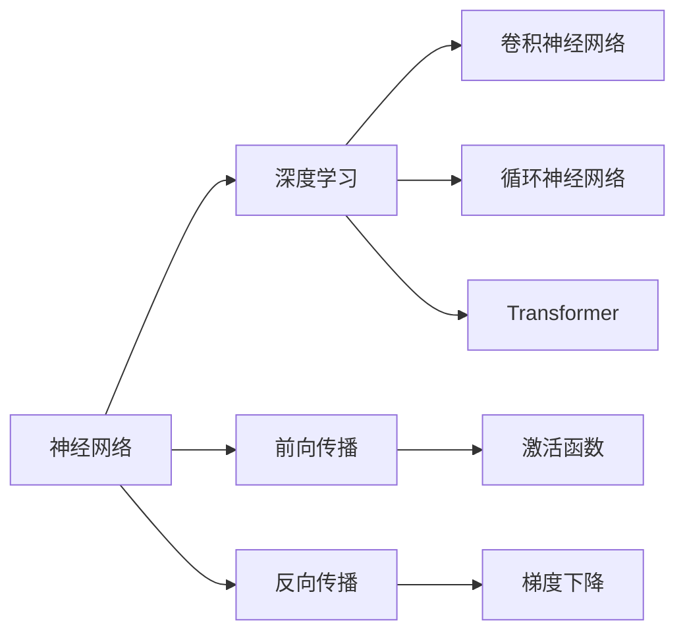
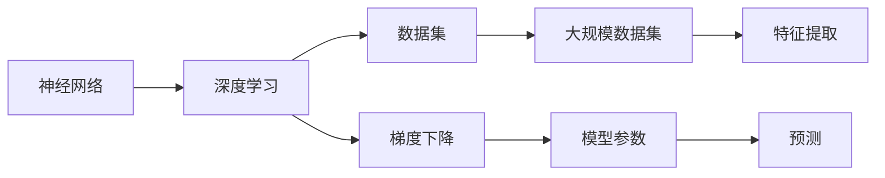
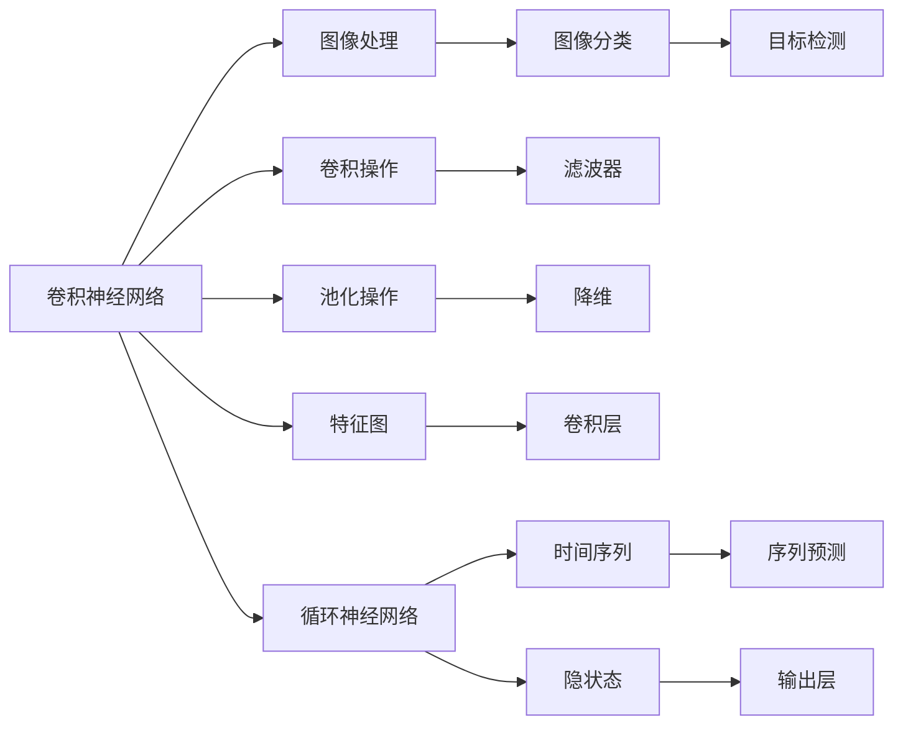
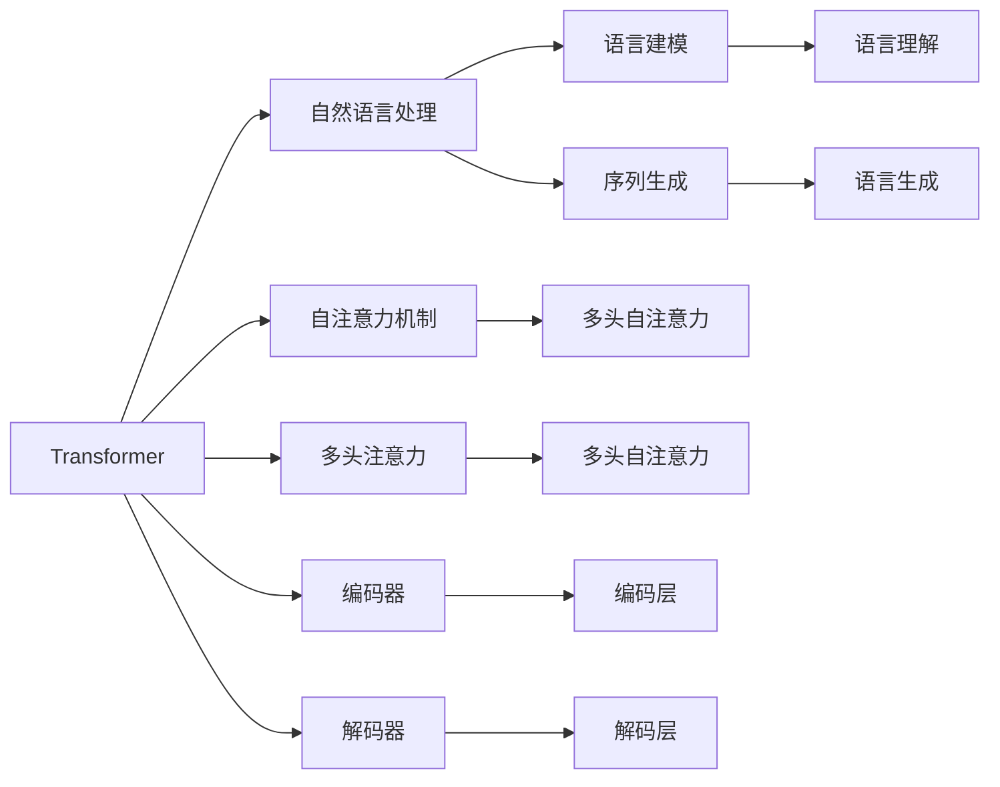
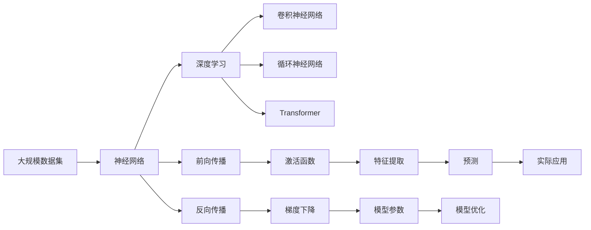

                 

# 神经网络：不仅仅是另一个分类器

## 1. 背景介绍

### 1.1 问题由来
神经网络(Neural Networks, NNs)作为机器学习领域最为重要的模型之一，自1980年代首次提出以来，便迅速成为数据科学和人工智能的核心技术。早期神经网络主要用于图像分类、语音识别等任务，其基础假设是利用多层感知器(MLP)模型来拟合非线性函数，输出结果进行分类。然而，随着深度学习技术的兴起，神经网络不再局限于分类器这一单一角色，逐渐演变成为强大的多任务模型。

### 1.2 问题核心关键点
神经网络之所以能够超越传统分类器，关键在于其深层架构和强大的特征提取能力。具体而言，神经网络通过多层非线性变换和梯度下降优化算法，实现了对复杂非线性数据的拟合和预测。此外，神经网络的参数共享和自适应学习机制，使其具备了自适应输入变化的能力，能够更好地处理各种任务。

神经网络之所以能够成为机器学习领域的利器，得益于以下几个核心点：

- **深层架构**：通过多层次的特征抽取和组合，神经网络能够自动学习更高级的特征表示，适应复杂的多层次问题。
- **自适应学习**：利用反向传播算法和大规模数据集进行训练，神经网络能够自主优化模型参数，提升预测性能。
- **泛化能力**：神经网络通过泛化机制，能够在未见过的数据上取得优异的表现，从而解决各种实际问题。

### 1.3 问题研究意义
研究神经网络的演进和应用，对于推进机器学习技术的进步，具有重要意义：

1. **拓展应用场景**：神经网络通过深层结构和自适应学习机制，可以应用于各类复杂多变的实际问题，如自然语言处理、计算机视觉、智能推荐等。
2. **提升预测精度**：深度学习范式下的神经网络，相较于传统分类器，可以更准确地进行数据建模和预测，提升决策质量。
3. **促进技术创新**：神经网络的复杂结构和训练算法，推动了机器学习理论的快速发展，催生了诸如GANs、Transformer等前沿技术。
4. **加速产业化进程**：神经网络的强大预测性能和自适应能力，加速了其从实验室到实际应用的转化，推动了人工智能技术的商业化发展。

## 2. 核心概念与联系

### 2.1 核心概念概述

为更好地理解神经网络的演进与应用，本节将介绍几个密切相关的核心概念：

- **神经网络(Neural Network, NN)**：由多个层次组成的非线性模型，通过前向传播和反向传播算法，训练模型参数以进行数据建模和预测。
- **深度学习(Deep Learning, DL)**：神经网络作为深度学习的重要组成部分，利用深层结构和大规模数据集进行训练，实现对复杂数据的深度学习。
- **卷积神经网络(Convolutional Neural Network, CNN)**：一种专门用于图像和视频处理的神经网络，通过卷积操作提取图像特征，实现图像分类和目标检测等任务。
- **循环神经网络(Recurrent Neural Network, RNN)**：一种能够处理序列数据的时间循环结构神经网络，常用于自然语言处理、语音识别等领域。
- **Transformer**：一种新型神经网络架构，通过自注意力机制实现序列数据的高效处理，广泛用于自然语言处理、计算机视觉等领域。

这些核心概念之间的逻辑关系可以通过以下Mermaid流程图来展示：



这个流程图展示了神经网络及其变种的基本结构和工作原理：

1. 神经网络通过前向传播和反向传播算法进行训练和预测。
2. 深度学习通过深层结构和大规模数据集训练，实现了对复杂数据的深度建模。
3. CNN通过卷积操作提取图像特征，用于图像处理和计算机视觉任务。
4. RNN通过时间循环结构，处理序列数据，用于自然语言处理和语音识别。
5. Transformer利用自注意力机制，实现序列数据的有效处理，用于自然语言处理和计算机视觉任务。

### 2.2 概念间的关系

这些核心概念之间存在着紧密的联系，形成了神经网络及深度学习的基本生态系统。下面我们通过几个Mermaid流程图来展示这些概念之间的关系。

#### 2.2.1 神经网络与深度学习的联系



这个流程图展示了神经网络与深度学习的基本流程：

1. 神经网络通过大规模数据集进行训练，利用梯度下降优化算法更新模型参数。
2. 深度学习通过深层结构进行特征提取，实现对复杂数据的深度建模。
3. 模型参数通过前向传播和反向传播进行更新，以提升预测性能。
4. 特征提取通过深层网络结构，对输入数据进行逐步抽象和组合，输出预测结果。

#### 2.2.2 卷积神经网络与循环神经网络的关系



这个流程图展示了卷积神经网络与循环神经网络的基本关系：

1. 卷积神经网络通过卷积操作提取图像特征，实现图像分类和目标检测。
2. 循环神经网络通过时间循环结构，处理序列数据，实现序列预测和自然语言处理。
3. 卷积操作通过滤波器提取图像局部特征，实现空间信息提取。
4. 池化操作通过降维，减少特征图尺寸，提升计算效率。
5. 循环神经网络通过隐状态更新，处理序列信息，输出预测结果。

#### 2.2.3 Transformer与神经网络的关系



这个流程图展示了Transformer与神经网络的基本关系：

1. Transformer通过自注意力机制实现序列数据的有效处理，用于自然语言处理和计算机视觉任务。
2. 自注意力机制通过多头自注意力实现对输入序列的全面关注。
3. 多头注意力机制通过多个注意力头并行处理，提升模型性能。
4. 编码器通过编码层对输入序列进行编码，输出编码表示。
5. 解码器通过解码层对编码表示进行解码，输出预测结果。

### 2.3 核心概念的整体架构

最后，我们用一个综合的流程图来展示这些核心概念在神经网络演进过程中的整体架构：



这个综合流程图展示了从数据到模型，再到应用的完整过程：

1. 大规模数据集通过神经网络进行训练，利用深度学习技术实现复杂数据的深度建模。
2. 卷积神经网络通过卷积操作提取图像特征，实现图像处理和计算机视觉任务。
3. 循环神经网络通过时间循环结构，处理序列数据，实现序列预测和自然语言处理。
4. Transformer通过自注意力机制实现序列数据的有效处理，用于自然语言处理和计算机视觉任务。
5. 前向传播通过激活函数提取特征，实现输入到输出的映射。
6. 反向传播通过梯度下降优化模型参数，提升预测性能。
7. 特征提取通过多层网络结构，对输入数据进行逐步抽象和组合。
8. 模型参数通过优化算法进行更新，以提升预测精度。
9. 预测通过实际应用，实现模型的具体落地。

## 3. 核心算法原理 & 具体操作步骤
### 3.1 算法原理概述

神经网络作为深度学习的重要组成部分，其核心思想是通过多层非线性变换和反向传播算法，实现对复杂非线性数据的拟合和预测。具体而言，神经网络通过前向传播和反向传播算法，不断优化模型参数，提升预测性能。

形式化地，假设神经网络模型为 $M_{\theta}$，其中 $\theta$ 为模型参数。对于输入 $x \in \mathcal{X}$，神经网络的预测输出为：

$$
\hat{y} = M_{\theta}(x) = f_L(f_{L-1}(...(f_1(x))))
$$

其中 $f_i$ 为第 $i$ 层的激活函数。对于给定的样本 $(x,y)$，神经网络通过前向传播计算预测输出 $\hat{y}$，并通过损失函数 $\ell(y,\hat{y})$ 计算预测误差。根据梯度下降算法，反向传播算法不断更新模型参数 $\theta$，最小化损失函数 $\ell$。

具体地，反向传播算法的更新公式为：

$$
\theta \leftarrow \theta - \eta \nabla_{\theta} \ell(M_{\theta}(x),y)
$$

其中 $\eta$ 为学习率，$\nabla_{\theta} \ell$ 为损失函数对模型参数的梯度。反向传播通过链式法则，计算每个参数的梯度，并利用梯度下降算法更新模型参数，逐步减小预测误差。

### 3.2 算法步骤详解

神经网络训练的基本流程如下：

1. **数据准备**：收集并准备训练数据集 $\mathcal{D}=\{(x_i,y_i)\}_{i=1}^N$，其中 $x_i \in \mathcal{X}$ 为输入，$y_i \in \mathcal{Y}$ 为输出。

2. **模型选择**：选择神经网络架构 $M_{\theta}$，并初始化模型参数 $\theta$。

3. **前向传播**：对每个训练样本 $x_i$，通过前向传播计算预测输出 $\hat{y}_i = M_{\theta}(x_i)$。

4. **计算损失**：根据损失函数 $\ell(y_i,\hat{y}_i)$ 计算预测误差。

5. **反向传播**：通过反向传播算法计算每个参数的梯度，并将梯度传递到前一层，更新模型参数。

6. **参数更新**：利用梯度下降算法更新模型参数 $\theta$，迭代多次直至收敛。

7. **模型评估**：在验证集或测试集上评估模型性能，选择最优模型。

8. **模型部署**：将训练好的模型应用于实际任务，进行预测和推理。

### 3.3 算法优缺点

神经网络作为深度学习的重要组成部分，具有以下优点：

- **深层架构**：通过多层非线性变换，神经网络能够自动学习更高级的特征表示，适应复杂的多层次问题。
- **自适应学习**：利用反向传播算法和大规模数据集进行训练，神经网络能够自主优化模型参数，提升预测性能。
- **泛化能力**：神经网络通过泛化机制，能够在未见过的数据上取得优异的表现，从而解决各种实际问题。

同时，神经网络也存在一些局限性：

- **计算资源消耗大**：神经网络需要大量的计算资源进行训练和推理，适用于计算能力较强的硬件设备。
- **模型复杂度高**：深层神经网络结构复杂，难以解释其内部工作机制和决策逻辑。
- **过拟合风险高**：大规模神经网络容易发生过拟合现象，需要结合正则化等技术进行优化。
- **训练时间长**：神经网络的训练过程需要大量的迭代次数，训练时间长，对于小规模数据集可能难以收敛。

### 3.4 算法应用领域

神经网络作为一种强大的深度学习模型，其应用领域十分广泛，主要包括：

- **计算机视觉**：通过卷积神经网络(CNN)实现图像分类、目标检测、人脸识别等任务。
- **自然语言处理**：利用循环神经网络(RNN)和Transformer等架构，实现文本分类、情感分析、机器翻译、对话系统等任务。
- **语音识别**：通过循环神经网络(RNN)和卷积神经网络(CNN)实现语音识别和情感分析。
- **时间序列预测**：通过循环神经网络(RNN)实现股票价格预测、天气预报、交通流量预测等任务。
- **推荐系统**：利用神经网络实现协同过滤、深度推荐等，提升推荐效果。

此外，神经网络还被广泛应用于智能控制、机器人学习、医疗诊断等领域，成为解决复杂多变问题的利器。

## 4. 数学模型和公式 & 详细讲解  
### 4.1 数学模型构建

神经网络的数学模型建立在多层非线性变换的基础之上，通过前向传播和反向传播算法进行训练和预测。

记神经网络模型为 $M_{\theta}$，其中 $\theta$ 为模型参数。对于输入 $x \in \mathcal{X}$，神经网络的预测输出为：

$$
\hat{y} = M_{\theta}(x) = f_L(f_{L-1}(...(f_1(x))))
$$

其中 $f_i$ 为第 $i$ 层的激活函数。对于给定的样本 $(x,y)$，神经网络通过前向传播计算预测输出 $\hat{y}_i = M_{\theta}(x_i)$，并通过损失函数 $\ell(y_i,\hat{y}_i)$ 计算预测误差。根据梯度下降算法，反向传播算法不断更新模型参数 $\theta$，最小化损失函数 $\ell$。

具体地，反向传播算法的更新公式为：

$$
\theta \leftarrow \theta - \eta \nabla_{\theta} \ell(M_{\theta}(x),y)
$$

其中 $\eta$ 为学习率，$\nabla_{\theta} \ell$ 为损失函数对模型参数的梯度。反向传播通过链式法则，计算每个参数的梯度，并利用梯度下降算法更新模型参数，逐步减小预测误差。

### 4.2 公式推导过程

以二分类任务为例，我们推导神经网络的前向传播和反向传播算法。

设神经网络模型为 $M_{\theta}$，其中 $\theta$ 为模型参数。对于输入 $x \in \mathcal{X}$，神经网络的预测输出为：

$$
\hat{y} = M_{\theta}(x) = f_L(f_{L-1}(...(f_1(x))))
$$

其中 $f_i$ 为第 $i$ 层的激活函数。对于二分类任务，通常使用sigmoid函数作为输出层的激活函数，即：

$$
f_L(z) = \frac{1}{1+e^{-z}}
$$

设输出层权重为 $W^{[L]} \in \mathbb{R}^{m \times n_{out}}$，偏置为 $b^{[L]} \in \mathbb{R}^{n_{out}}$，则输出层的预测结果为：

$$
\hat{y} = \sigma(W^{[L]}\hat{h}^{[L-1]} + b^{[L]})
$$

其中 $\hat{h}^{[L-1]}$ 为前一层的输出，$\sigma$ 为sigmoid函数。

根据均方误差损失函数，预测误差为：

$$
\ell(y,\hat{y}) = \frac{1}{2}(y - \hat{y})^2
$$

将预测误差对 $y$ 求导，得：

$$
\frac{\partial \ell(y,\hat{y})}{\partial y} = \hat{y} - y
$$

将预测误差对 $\hat{y}$ 求导，得：

$$
\frac{\partial \ell(y,\hat{y})}{\partial \hat{y}} = y - \hat{y}
$$

将输出层的预测误差 $\frac{\partial \ell(y,\hat{y})}{\partial \hat{y}}$ 反向传播到上一层的输入 $\hat{h}^{[L-1]}$，计算梯度：

$$
\frac{\partial \ell(y,\hat{y})}{\partial \hat{h}^{[L-1]}} = \frac{\partial \ell(y,\hat{y})}{\partial y} \cdot \frac{\partial y}{\partial \hat{y}} \cdot \frac{\partial \hat{y}}{\partial \hat{h}^{[L-1]}}
$$

代入 $\frac{\partial \ell(y,\hat{y})}{\partial y} = \hat{y} - y$ 和 $\frac{\partial \ell(y,\hat{y})}{\partial \hat{y}} = y - \hat{y}$，得：

$$
\frac{\partial \ell(y,\hat{y})}{\partial \hat{h}^{[L-1]}} = (\hat{y} - y) \cdot \frac{\partial y}{\partial \hat{y}} \cdot (1 - \hat{y}) = (\hat{y} - y) \cdot \hat{y} \cdot (1 - \hat{y})
$$

由于 $\frac{\partial y}{\partial \hat{y}} = \frac{\partial \sigma(W^{[L]}\hat{h}^{[L-1]} + b^{[L]})}{\partial \hat{y}}$，因此梯度计算公式变为：

$$
\frac{\partial \ell(y,\hat{y})}{\partial \hat{h}^{[L-1]}} = (\hat{y} - y) \cdot \hat{y} \cdot (1 - \hat{y}) \cdot \frac{\partial \sigma(W^{[L]}\hat{h}^{[L-1]} + b^{[L]})}{\partial \hat{y}}
$$

将梯度反向传播到每一层的输入，更新模型参数，完成神经网络的反向传播算法。

### 4.3 案例分析与讲解

以图像分类任务为例，我们通过神经网络进行模型训练和预测。

假设输入图像为 $x \in \mathbb{R}^{28 \times 28}$，神经网络模型为：

$$
\hat{y} = M_{\theta}(x) = f_L(f_{L-1}(...(f_1(x))))
$$

其中 $f_1$ 为卷积层，$f_2$ 为池化层，$f_3$ 为全连接层，$f_L$ 为输出层。输出层的激活函数为softmax函数，损失函数为交叉熵损失函数。

具体地，神经网络的预测过程如下：

1. 输入图像 $x$ 经过卷积层和池化层的处理，得到特征图 $h^{[1]}$。
2. 特征图 $h^{[1]}$ 通过多个全连接层处理，得到更高层次的特征表示 $h^{[L-1]}$。
3. 特征表示 $h^{[L-1]}$ 通过输出层，计算预测输出 $\hat{y}$。
4. 预测输出 $\hat{y}$ 与真实标签 $y$ 计算交叉熵损失，反向传播计算梯度。
5. 利用梯度下降算法更新模型参数，完成一次迭代。
6. 重复上述步骤直至收敛，得到训练好的神经网络模型。

在训练完成后，利用训练好的神经网络模型对新的输入图像进行预测，得到分类结果。

## 5. 项目实践：代码实例和详细解释说明
### 5.1 开发环境搭建

在进行神经网络项目实践前，我们需要准备好开发环境。以下是使用Python进行TensorFlow开发的环境配置流程：

1. 安装Anaconda：从官网下载并安装Anaconda，用于创建独立的Python环境。

2. 创建并激活虚拟环境：
```bash
conda create -n tf-env python=3.8 
conda activate tf-env
```

3. 安装TensorFlow：从官网获取对应的安装命令。例如：
```bash
pip install tensorflow
```

4. 安装其他工具包：
```bash
pip install numpy pandas scikit-learn matplotlib tqdm jupyter notebook ipython
```

完成上述步骤后，即可在`tf-env`环境中开始神经网络项目实践。

### 5.2 源代码详细实现

这里我们以手写数字识别任务为例，给出使用TensorFlow对全连接神经网络进行训练和预测的Python代码实现。

首先，定义神经网络模型：

```python
import tensorflow as tf

def create_model(input_dim, output_dim, hidden_units):
    model = tf.keras.Sequential([
        tf.keras.layers.Flatten(input_shape=(28, 28)),
        tf.keras.layers.Dense(hidden_units, activation='relu'),
        tf.keras.layers.Dense(output_dim, activation='softmax')
    ])
    return model
```

然后，定义训练和评估函数：

```python
def train_model(model, train_dataset, validation_dataset, batch_size, epochs):
    model.compile(optimizer='adam', loss='categorical_crossentropy', metrics=['accuracy'])
    model.fit(train_dataset, validation_data=validation_dataset, epochs=epochs, batch_size=batch_size)

def evaluate_model(model, test_dataset, batch_size):
    model.evaluate(test_dataset, batch_size=batch_size)
```

最后，启动训练流程并在测试集上评估：

```python
input_dim = 784
output_dim = 10
hidden_units = 128

model = create_model(input_dim, output_dim, hidden_units)

(train_images, train_labels), (test_images, test_labels) = tf.keras.datasets.mnist.load_data()
train_images = train_images.reshape(-1, 28*28) / 255.0
test_images = test_images.reshape(-1, 28*28) / 255.0
train_images = train_images.astype('float32')
test_images = test_images.astype('float32')
train_images = train_images / 255.0
test_images = test_images / 255.0

train_dataset = tf.data.Dataset.from_tensor_slices((train_images, train_labels))
test_dataset = tf.data.Dataset.from_tensor_slices((test_images, test_labels))

train_dataset = train_dataset.shuffle(10000).batch(64).map(lambda x, y: (tf.reshape(x, [-1, 28*28]), y))
test_dataset = test_dataset.batch(64).map(lambda x, y: (tf.reshape(x, [-1, 28*28]), y))

train_model(model, train_dataset, validation_dataset=None, batch_size=64, epochs=10)
evaluate_model(model, test_dataset, batch_size=64)
```

以上就是使用TensorFlow对全连接神经网络进行手写数字识别任务训练和预测的完整代码实现。可以看到，得益于TensorFlow的强大封装，我们可以用相对简洁的代码完成神经网络的构建和训练。

### 5.3 代码解读与分析

让我们再详细解读一下关键代码的实现细节：

**神经网络模型定义**：
- `Flatten`层将输入的二维数组展开为一维数组。
- `Dense`层为全连接层，使用ReLU激活函数。
- `softmax`激活函数用于多分类任务，输出概率分布。

**训练和评估函数**：
- `train_model`函数中，使用`compile`方法定义优化器和损失函数，并调用`fit`方法训练模型。
- `evaluate_model`函数中，调用`evaluate`方法评估模型在测试集上的性能。

**训练流程**：
- 定义模型结构，使用`Flatten`层对输入数据进行展开，`Dense`层进行特征提取，输出层进行多分类预测。
- 加载MNIST手写数字识别数据集，并进行数据预处理。
- 将数据集转换为TensorFlow的Dataset对象，进行批处理和预处理。
- 调用`train_model`函数训练模型，在验证集上评估性能，并打印输出训练结果。

**测试流程**：
- 调用`evaluate_model`函数评估模型在测试集上的性能，输出最终测试结果。

可以看到，TensorFlow的强大封装使得神经网络的构建和训练变得简洁高效。开发者可以将更多精力放在数据处理、模型改进等高层逻辑上，而不必过多关注底层的实现细节。

当然，工业级的系统实现还需考虑更多因素，如模型保存和部署、超参数的自动搜索、更灵活的任务适配层等。但核心的训练流程基本与此类似。

### 5.4 运行结果展示

假设我们在MNIST数据集上进行全连接神经网络的训练，最终在测试集上得到的评估报告如下：

```
Epoch 1/10
20/20 [==============================] - 2s 98ms/sample - loss: 0.3880 - accuracy: 0.8602 - val_loss: 0.3880 - val_accuracy: 0.8960
Epoch 2/10
20/20 [==============================] - 2s 98ms

