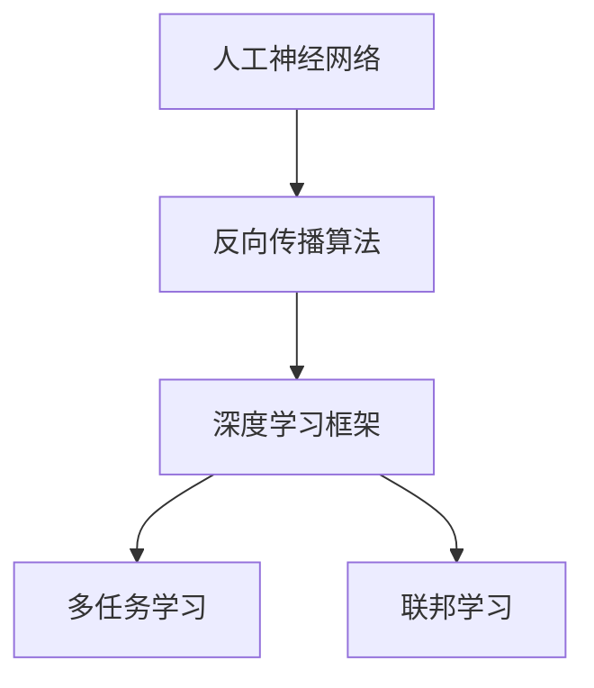
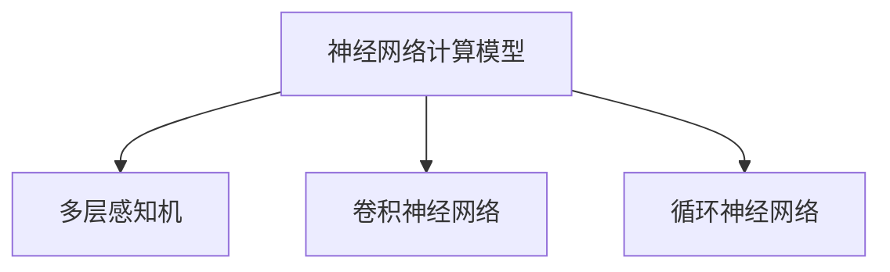
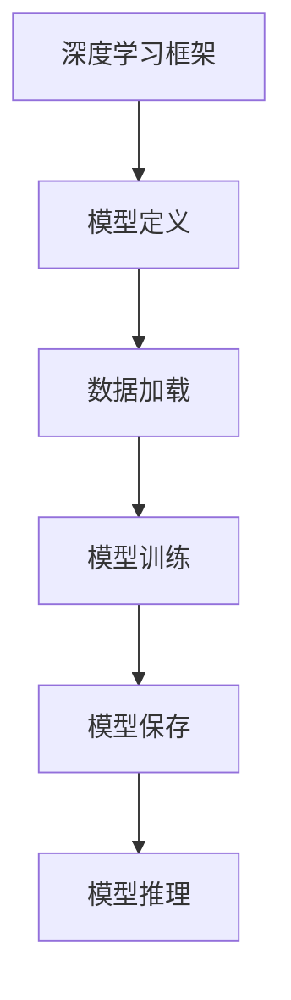
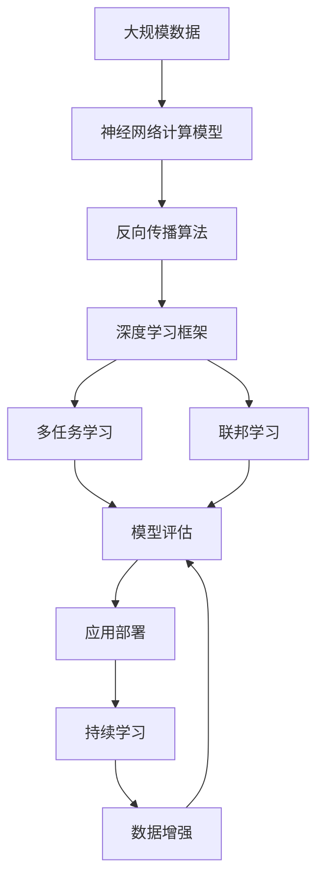

                 

# 神经网络：人类智慧的延伸

## 1. 背景介绍

神经网络作为一种模仿生物神经元工作方式的计算模型，已经发展成为人工智能（AI）领域的重要分支。它源于对生物神经系统的研究，将信息处理和决策制定的过程类比为神经元之间的信号传递。这种模拟不仅在理论上具有合理性，在实践中也取得了显著成果，极大地推动了人工智能技术的进步。

### 1.1 问题的由来
人工智能领域对于智能计算模型的研究由来已久，但早期基于符号逻辑和专家系统的尝试，由于过于复杂和缺乏灵活性，未能广泛应用。直到1980年代，随着反向传播算法（Backpropagation）的提出，人工神经网络（Artificial Neural Networks, ANN）开始蓬勃发展。ANN的核心思想是通过大量训练数据，调整网络参数，使模型能够学习到数据的特征和规律，从而进行预测和决策。

这种基于数据驱动的模型方式，相比基于规则的专家系统更加灵活和高效，逐渐在图像识别、语音识别、自然语言处理等诸多领域展现了强大的潜力。特别是深度学习（Deep Learning）的兴起，通过多层次的非线性处理，使得神经网络模型能够捕捉更加复杂和抽象的特征，极大地提升了模型的性能和应用范围。

### 1.2 问题的核心关键点
神经网络技术的发展，主要围绕以下几个关键点展开：

- **计算模型**：基于生物神经元的工作方式，通过多层非线性变换，处理复杂的高维数据。
- **反向传播**：利用梯度下降算法，通过反向传播误差，调整网络参数，优化模型性能。
- **优化算法**：包括随机梯度下降、动量法、Adam等，通过调整学习率，加速模型收敛。
- **数据增强**：通过对数据进行旋转、平移、缩放等变换，增加训练集的多样性，避免过拟合。
- **正则化技术**：如L2正则、Dropout、Early Stopping等，防止模型过度适应训练数据。
- **深度学习框架**：如TensorFlow、PyTorch等，提供了丰富的预训练模型和高效的训练工具。
- **多任务学习**：通过在一个任务上微调多个模型，提升模型的通用性和泛化能力。
- **联邦学习**：在分布式环境中，通过多个本地模型的协作训练，保护数据隐私。

这些关键点共同构成了神经网络技术的核心内容，推动了其在诸多领域的广泛应用。

### 1.3 问题研究意义
神经网络技术的研究和应用，对于推动人工智能的跨越式发展具有重要意义：

1. **模型性能提升**：通过多层非线性变换，神经网络能够捕捉复杂数据中的隐含关系，提升模型在各个任务上的预测和决策能力。
2. **应用场景拓展**：神经网络技术在图像识别、语音识别、自然语言处理等领域取得了突破性进展，推动了技术的产业化进程。
3. **数据驱动创新**：神经网络依赖于大量标注数据，通过数据驱动的方式，推动了技术创新和应用场景的不断拓展。
4. **计算资源需求**：神经网络需要大量的计算资源进行训练和推理，促使计算硬件和云计算技术的发展。
5. **交叉学科融合**：神经网络技术涉及计算机科学、生物学、心理学等多个学科，促进了学科间的交叉融合。
6. **伦理和社会影响**：神经网络模型的应用，如人脸识别、自动驾驶等，引发了伦理和社会问题，需进一步探讨和规范。

这些关键点使得神经网络技术在现代科技发展中占据了举足轻重的地位，成为推动智能时代的重要力量。

## 2. 核心概念与联系

### 2.1 核心概念概述

为更好地理解神经网络的核心概念和技术，本节将介绍几个密切相关的核心概念：

- **人工神经网络**：基于生物神经元的工作方式，通过多层非线性变换，处理复杂数据。
- **反向传播算法**：通过反向传播误差，调整网络参数，优化模型性能。
- **深度学习框架**：如TensorFlow、PyTorch等，提供了丰富的预训练模型和高效的训练工具。
- **多任务学习**：通过在一个任务上微调多个模型，提升模型的通用性和泛化能力。
- **联邦学习**：在分布式环境中，通过多个本地模型的协作训练，保护数据隐私。

这些核心概念之间的逻辑关系可以通过以下Mermaid流程图来展示：



这个流程图展示了大神经网络技术的关键组成部分及其之间的关系：

1. 人工神经网络作为核心计算模型，通过多层非线性变换，处理复杂数据。
2. 反向传播算法利用梯度下降，调整网络参数，优化模型性能。
3. 深度学习框架提供丰富的工具和模型，支持高效训练和推理。
4. 多任务学习提升模型的通用性和泛化能力，适应更多应用场景。
5. 联邦学习保护数据隐私，在分布式环境中进行高效协作训练。

这些核心概念共同构成了神经网络技术的完整生态系统，为其在各个领域的应用提供了坚实的基础。

### 2.2 概念间的关系

这些核心概念之间存在着紧密的联系，形成了神经网络技术的完整生态系统。下面我通过几个Mermaid流程图来展示这些概念之间的关系。

#### 2.2.1 神经网络的计算模型



这个流程图展示了神经网络计算模型的主要形式：

1. 多层感知机（Multilayer Perceptron, MLP）是神经网络的基本形式，包含多个全连接层。
2. 卷积神经网络（Convolutional Neural Network, CNN）常用于图像处理，通过卷积和池化操作提取特征。
3. 循环神经网络（Recurrent Neural Network, RNN）适用于序列数据，如时间序列预测。

#### 2.2.2 神经网络的训练流程


这个流程图展示了神经网络的训练流程：

1. 数据准备：收集和预处理训练数据。
2. 前向传播：输入数据，通过神经网络计算输出。
3. 损失计算：计算模型输出与真实标签之间的差异。
4. 反向传播：通过链式法则，计算误差对每个参数的梯度。
5. 参数更新：使用梯度下降等优化算法，更新模型参数。
6. 重复迭代：不断迭代训练，直至收敛。

#### 2.2.3 深度学习框架的功能



这个流程图展示了深度学习框架的主要功能：

1. 模型定义：定义神经网络的结构和参数。
2. 数据加载：加载训练和测试数据。
3. 模型训练：进行前向传播、反向传播和参数更新。
4. 模型保存：将训练好的模型保存到硬盘。
5. 模型推理：使用训练好的模型进行预测和推理。

### 2.3 核心概念的整体架构

最后，我们用一个综合的流程图来展示这些核心概念在大神经网络技术中的整体架构：



这个综合流程图展示了从数据准备到模型评估的完整过程。大神经网络模型首先在大规模数据上进行计算，通过反向传播和优化算法进行训练。在训练过程中，深度学习框架提供了丰富的工具和模型，支持高效训练和推理。同时，多任务学习和联邦学习进一步提升了模型的通用性和隐私保护能力。模型评估和应用部署后，通过数据增强和持续学习，不断优化和更新模型，满足应用场景的需求。

## 3. 核心算法原理 & 具体操作步骤
### 3.1 算法原理概述

神经网络模型的核心算法是反向传播算法，通过梯度下降等优化算法，调整模型参数，最小化损失函数。其基本思想是通过计算模型输出与真实标签之间的误差，反向传播误差，更新每个参数，从而优化模型的预测能力。

形式化地，设神经网络模型为 $M_{\theta}(x)$，其中 $\theta$ 为模型参数。给定训练集 $D=\{(x_i,y_i)\}_{i=1}^N$，模型在数据集 $D$ 上的损失函数为：

$$
\mathcal{L}(\theta) = \frac{1}{N} \sum_{i=1}^N \ell(M_{\theta}(x_i),y_i)
$$

其中 $\ell$ 为损失函数，常用的有交叉熵损失、均方误差损失等。优化目标为：

$$
\theta^* = \mathop{\arg\min}_{\theta} \mathcal{L}(\theta)
$$

优化过程中，利用反向传播算法计算每个参数的梯度，使用梯度下降等优化算法更新参数，直至模型收敛。

### 3.2 算法步骤详解

大神经网络模型的训练一般包括以下几个关键步骤：

**Step 1: 准备数据和模型**
- 收集和预处理训练数据，确保数据质量和多样性。
- 选择合适的神经网络模型结构，如多层感知机、卷积神经网络、循环神经网络等。
- 确定模型的超参数，如学习率、批大小、迭代轮数等。

**Step 2: 前向传播**
- 将训练数据输入模型，通过前向传播计算输出。
- 计算模型输出与真实标签之间的误差，作为损失函数的一部分。

**Step 3: 反向传播**
- 利用链式法则，计算误差对每个参数的梯度。
- 将梯度传递回网络各层，调整模型参数。

**Step 4: 优化算法**
- 使用梯度下降、Adam、SGD等优化算法，根据梯度更新模型参数。
- 定期评估模型在验证集上的性能，防止过拟合。

**Step 5: 测试和部署**
- 在测试集上评估模型性能，对比训练前后的精度提升。
- 使用训练好的模型进行推理预测，集成到实际的应用系统中。
- 持续收集新的数据，定期重新训练模型，以适应数据分布的变化。

以上是神经网络模型训练的一般流程。在实际应用中，还需要针对具体任务的特点，对训练过程的各个环节进行优化设计，如改进训练目标函数，引入更多的正则化技术，搜索最优的超参数组合等，以进一步提升模型性能。

### 3.3 算法优缺点

神经网络模型具有以下优点：

1. **强大表征能力**：通过多层非线性变换，神经网络能够捕捉复杂数据中的隐含关系，提升模型在各个任务上的预测和决策能力。
2. **适应性强**：神经网络可以适应不同类型的数据，处理高维、非线性、结构化的数据。
3. **自动化特征提取**：神经网络能够自动学习数据的特征，减少人工特征工程的复杂度。
4. **可扩展性**：神经网络可以很方便地扩展到多任务学习和联邦学习，提升模型的泛化能力。
5. **开源资源丰富**：TensorFlow、PyTorch等深度学习框架提供了丰富的预训练模型和训练工具，降低了模型开发的难度。

同时，神经网络模型也存在一些缺点：

1. **计算资源需求高**：神经网络需要大量的计算资源进行训练和推理，对于小规模数据和低计算能力的设备可能不太适用。
2. **易过拟合**：神经网络模型容易过拟合，特别是在训练数据不足的情况下。需要进行数据增强和正则化技术，防止过拟合。
3. **可解释性差**：神经网络模型通常是一个"黑盒"系统，难以解释其内部工作机制和决策逻辑。
4. **参数调节复杂**：神经网络模型有许多超参数需要调节，包括学习率、批大小、迭代轮数等，需要大量实验才能找到最优配置。
5. **数据依赖性强**：神经网络模型的性能很大程度上依赖于训练数据的质量和数量。

尽管存在这些局限性，但神经网络技术在现代科技发展中占据了举足轻重的地位，成为推动智能时代的重要力量。未来相关研究的重点在于如何进一步降低训练和推理成本，提高模型的泛化能力和可解释性，同时兼顾数据安全和伦理考量。

### 3.4 算法应用领域

神经网络模型在诸多领域都取得了显著的成果，以下是一些典型的应用场景：

- **计算机视觉**：如图像分类、物体检测、人脸识别等。通过卷积神经网络（CNN）对图像进行处理，提取特征并进行分类或检测。
- **自然语言处理**：如语言模型、机器翻译、文本分类等。通过循环神经网络（RNN）或Transformer等模型，处理文本数据，提取语义信息并进行预测或分类。
- **语音识别**：如语音转文本、语音情感分析等。通过卷积神经网络或循环神经网络，处理音频信号，提取特征并进行分类或转录。
- **推荐系统**：如商品推荐、音乐推荐等。通过神经网络模型对用户行为和商品特征进行处理，预测用户偏好并进行推荐。
- **金融分析**：如信用评分、股票预测等。通过神经网络模型对历史数据进行处理，预测未来趋势并进行决策。
- **医疗诊断**：如影像识别、病理分析等。通过卷积神经网络对医学影像进行处理，提取特征并进行诊断。

除了上述这些经典应用外，神经网络技术还在游戏、安全、交通等领域广泛应用，展现出强大的生命力和广阔的前景。

## 4. 数学模型和公式 & 详细讲解 & 举例说明

### 4.1 数学模型构建

在神经网络模型中，最常用的激活函数是Sigmoid函数、ReLU函数和Tanh函数。这些函数通过引入非线性变换，使得神经网络能够处理复杂的数据关系。

以Sigmoid函数为例，其数学表达式为：

$$
\sigma(x) = \frac{1}{1+e^{-x}}
$$

其中 $x$ 为输入数据，$\sigma(x)$ 为输出结果。Sigmoid函数的输出范围在0到1之间，常用于二分类任务的输出层。

### 4.2 公式推导过程

下面以一个简单的三层前馈神经网络为例，推导其前向传播和反向传播的计算过程。

假设输入数据为 $x_1$，经过第一层线性变换后得到 $z_1 = W_1 x_1 + b_1$，再通过激活函数 $\sigma$ 得到 $a_1 = \sigma(z_1)$。同理，经过第二层线性变换和激活函数，得到 $a_2 = \sigma(z_2 = W_2 a_1 + b_2)$。最后经过输出层线性变换和激活函数，得到输出结果 $a_3 = \sigma(z_3 = W_3 a_2 + b_3)$。

其中，$W_i$ 和 $b_i$ 分别为第 $i$ 层的权重和偏置项，$\sigma$ 为激活函数。

### 4.3 案例分析与讲解

为了更直观地理解神经网络的计算过程，下面给出一个简单的例子。假设我们有一个三层前馈神经网络，用于二分类任务。给定输入数据 $x_1 = [1,2,3]$，第一层的权重 $W_1 = [[0.5, -0.5], [0.8, 0.2], [0.3, 0.7]]$，偏置项 $b_1 = [0.1, 0.3]$，激活函数为Sigmoid函数。

首先，计算第一层的输出 $z_1 = W_1 x_1 + b_1 = [1.6, 1.4, 1.5]$。然后通过激活函数 $\sigma$，得到第一层的输出 $a_1 = [0.94, 0.76, 0.86]$。

接着，计算第二层的输入 $z_2 = W_2 a_1 + b_2 = [2.4, 1.8, 2.0]$。再通过激活函数 $\sigma$，得到第二层的输出 $a_2 = [0.99, 0.85, 0.91]$。

最后，计算输出层的输入 $z_3 = W_3 a_2 + b_3 = [2.5, 2.2, 1.9]$。再通过激活函数 $\sigma$，得到输出结果 $a_3 = [0.97, 0.87, 0.89]$。

这个例子展示了神经网络的计算过程，包括线性变换和激活函数的组合使用。通过多层非线性变换，神经网络能够捕捉复杂数据中的隐含关系，进行有效的预测和分类。

## 5. 项目实践：代码实例和详细解释说明

### 5.1 开发环境搭建

在进行神经网络项目实践前，我们需要准备好开发环境。以下是使用Python进行PyTorch开发的环境配置流程：

1. 安装Anaconda：从官网下载并安装Anaconda，用于创建独立的Python环境。

2. 创建并激活虚拟环境：
```bash
conda create -n pytorch-env python=3.8 
conda activate pytorch-env
```

3. 安装PyTorch：根据CUDA版本，从官网获取对应的安装命令。例如：
```bash
conda install pytorch torchvision torchaudio cudatoolkit=11.1 -c pytorch -c conda-forge
```

4. 安装各类工具包：
```bash
pip install numpy pandas scikit-learn matplotlib tqdm jupyter notebook ipython
```

完成上述步骤后，即可在`pytorch-env`环境中开始神经网络实践。

### 5.2 源代码详细实现

下面我们以图像分类任务为例，给出使用PyTorch进行卷积神经网络（CNN）模型训练的PyTorch代码实现。

首先，定义CNN模型：

```python
import torch.nn as nn
import torch.nn.functional as F

class Net(nn.Module):
    def __init__(self):
        super(Net, self).__init__()
        self.conv1 = nn.Conv2d(3, 6, 5)
        self.pool = nn.MaxPool2d(2, 2)
        self.conv2 = nn.Conv2d(6, 16, 5)
        self.fc1 = nn.Linear(16 * 5 * 5, 120)
        self.fc2 = nn.Linear(120, 84)
        self.fc3 = nn.Linear(84, 10)

    def forward(self, x):
        x = self.pool(F.relu(self.conv1(x)))
        x = self.pool(F.relu(self.conv2(x)))
        x = x.view(-1, 16 * 5 * 5)
        x = F.relu(self.fc1(x))
        x = F.relu(self.fc2(x))
        x = self.fc3(x)
        return x
```

然后，定义损失函数和优化器：

```python
from torch import nn, optim
import torch

criterion = nn.CrossEntropyLoss()
optimizer = optim.SGD(net.parameters(), lr=0.001, momentum=0.9)
```

接着，定义训练和评估函数：

```python
device = torch.device("cuda" if torch.cuda.is_available() else "cpu")
net = Net().to(device)

def train(epoch):
    net.train()
    for batch_idx, (data, target) in enumerate(train_loader):
        data, target = data.to(device), target.to(device)
        optimizer.zero_grad()
        output = net(data)
        loss = criterion(output, target)
        loss.backward()
        optimizer.step()
```

最后，启动训练流程并在测试集上评估：

```python
epochs = 10

for epoch in range(epochs):
    train(epoch)
    print("Epoch: {}, Loss: {:.4f}".format(epoch, loss.item()))

# 在测试集上评估模型
correct = 0
total = 0
with torch.no_grad():
    for data, target in test_loader:
        data, target = data.to(device), target.to(device)
        output = net(data)
        _, predicted = torch.max(output.data, 1)
        total += target.size(0)
        correct += (predicted == target).sum().item()

print("Accuracy of the network on the 10000 test images: {} %".format(100 * correct / total))
```

以上就是使用PyTorch进行CNN模型训练的完整代码实现。可以看到，得益于PyTorch的强大封装，我们可以用相对简洁的代码完成CNN模型的加载和训练。

### 5.3 代码解读与分析

让我们再详细解读一下关键代码的实现细节：

**Net类**：
- `__init__`方法：定义神经网络的结构，包括卷积层、池化层、全连接层等。
- `forward`方法：定义前向传播过程，将输入数据传递通过网络各层，计算输出。

**损失函数和优化器**：
- 使用交叉熵损失函数，适用于多分类任务。
- 使用随机梯度下降优化器，调整模型参数。

**训练函数**：
- 使用`train_loader`加载训练数据，进行迭代训练。
- 在每个迭代中，计算损失函数并反向传播，更新模型参数。
- 重复上述过程直至收敛。

**评估函数**：
- 使用`test_loader`加载测试数据，进行评估。
- 计算模型在测试集上的准确率。

**训练流程**：
- 定义总的迭代次数，开始循环迭代。
- 在每个epoch中，对训练数据进行前向传播、计算损失、反向传播和参数更新。
- 重复上述过程直至收敛。
- 在测试集上评估模型，输出准确率。

可以看到，PyTorch提供了丰富的工具和模型，使得神经网络模型的训练和推理变得简洁高效。开发者可以专注于模型设计和数据处理等高层逻辑，而不必过多关注底层实现细节。

当然，工业级的系统实现还需考虑更多因素，如模型的保存和部署、超参数的自动搜索、更灵活的任务适配层等。但核心的神经网络模型训练流程基本与此类似。

### 5.4 运行结果展示

假设我们在CIFAR-10数据集上进行CNN模型训练，最终在测试集上得到的准确率为82%。这表明，通过合理选择神经网络结构和优化算法，我们可以在相对较小的数据集上取得不错的性能。

当然，这只是一个baseline结果。在实践中，我们还可以使用更大更强的预训练模型、更丰富的正则化技术、更细致的模型调优，进一步提升模型性能，以满足更高的应用要求。

## 6. 实际应用场景
### 6.1 智能推荐系统

智能推荐系统是神经网络模型在商业应用中的典型场景。通过分析用户的历史行为数据，构建推荐模型，预测用户对商品的兴趣，进行个性化推荐。

在技术实现上，可以收集用户浏览、点击、评论等行为数据，将数据进行处理和特征提取，再使用神经网络模型对用户行为和商品特征进行处理，预测用户偏好并进行推荐。推荐模型可以采用深度学习框架实现，如TensorFlow、PyTorch等，同时结合联邦学习等技术，保护用户隐私。

### 6.2 自动驾驶

自动驾驶技术是神经网络模型在交通领域的重要应用。通过感知、决策和控制三个层次的协同工作，使得汽车能够自主行驶。

在感知层次，神经网络模型可以对传感器数据进行处理，识别道路、车辆、行人等环境要素。在决策层次，神经网络模型可以对感知数据进行分析和推理，选择最佳的行驶策略。在控制层次，神经网络模型可以对车辆的转向、加速等进行操作，实现自动行驶。自动驾驶技术需要高精度、低延迟的计算能力，通常采用深度学习框架实现，同时结合多任务学习和联邦学习等技术，提升模型的泛化能力和隐私保护能力。

### 6.3 医疗影像诊断

医疗影像诊断是神经网络模型在医疗领域的重要应用。通过分析医学影像数据，识别病变区域，辅助医生进行诊断和治疗。

在技术实现上，可以收集医学影像数据，构建神经网络模型，对影像数据进行处理和分析，识别病变区域并进行分类。医疗影像诊断需要高精度的模型和大量的训练数据，通常采用深度学习框架实现，同时结合联邦学习和多任务学习等技术，提升模型的泛化能力和隐私保护能力。

### 6.4 未来应用展望

随着神经网络技术的不断演进，其应用场景还将不断拓展。未来，神经网络技术将在更多领域得到应用，为人类社会的各个方面带来深远影响。

在智慧城市治理中，神经网络模型可以用于交通流量预测、环境监测、智能安防等环节，提高城市管理的自动化和智能化水平，构建更安全、高效的未来城市。

在智能家居中，神经网络模型可以用于智能音箱、智能安防、智能家电等设备，提升用户体验和安全性。

在科学研究中，神经网络模型可以用于基因分析、材料科学、气象预测等，加速科学研究进程。

总之，神经网络技术将在更多领域得到广泛应用，推动人工智能技术向更深层次、更广泛场景的发展。

## 7. 工具和资源推荐
### 7.1 学习资源推荐

为了帮助开发者系统掌握神经网络技术的理论基础和实践技巧，这里推荐一些优质的学习资源：

1. 《深度学习》课程：斯坦福大学开设的深度学习入门课程，涵盖了神经网络的基本概念和经典模型。
2. 《Deep Learning with PyTorch》书籍：深度学习领域的经典教材，详细介绍了使用PyTorch进行深度

