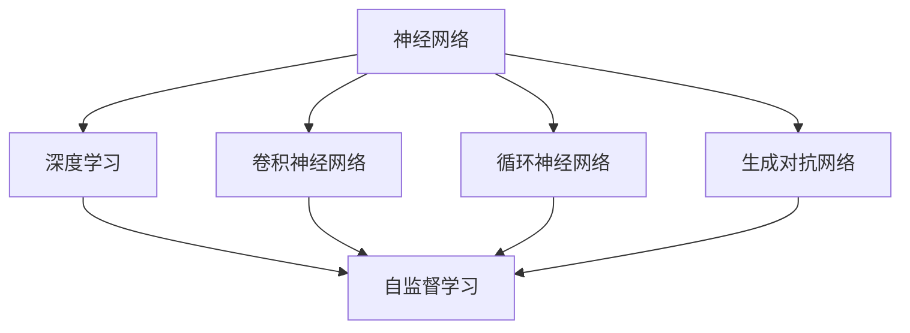
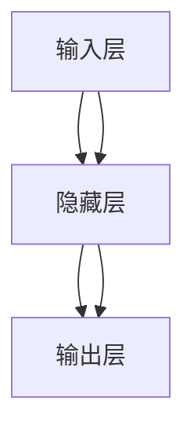
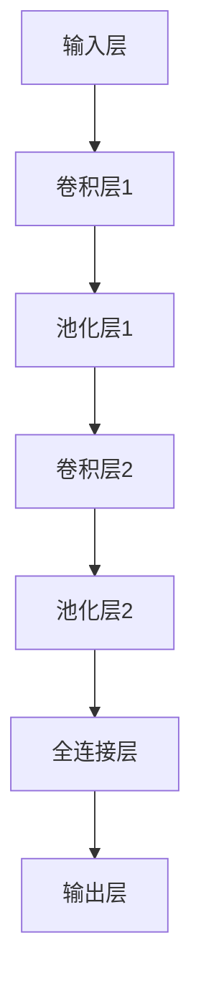
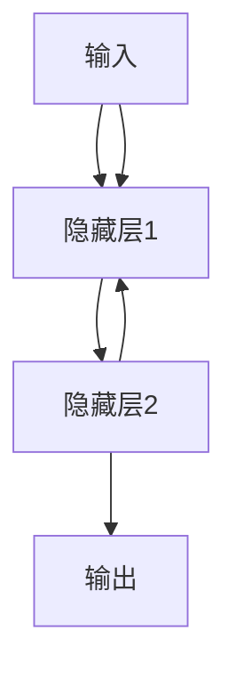
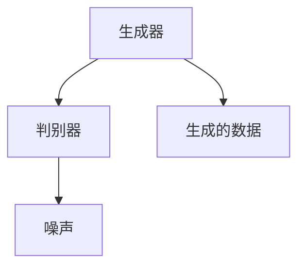
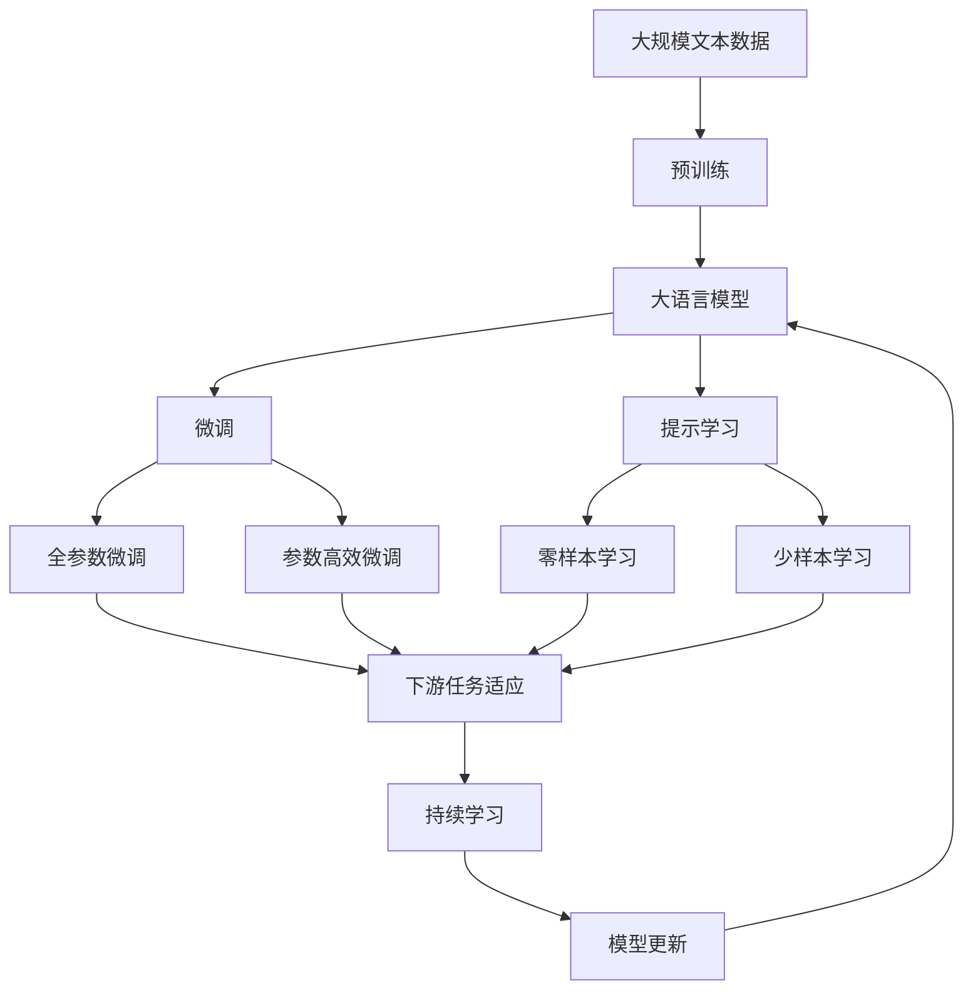

                 

# 神经网络：开启智能新纪元

在人工智能的征程中，神经网络以其强大的表征学习和自适应能力，成为推动智能发展的核心动力。本文将从背景介绍、核心概念、算法原理、实际操作、应用场景、未来展望等多个维度，深入解析神经网络的原理与实践，揭示其开启智能新纪元的巨大潜力。

## 1. 背景介绍

### 1.1 问题由来
随着数据驱动和算法创新的迅猛发展，人工智能在各个领域的应用日益广泛，从语音识别、图像处理到自然语言理解，神经网络技术在这些方向上均取得了突破性进展。神经网络能够通过学习数据的特征表示，实现从输入到输出的映射，其本质是通过训练数据拟合一个复杂的非线性映射函数。

### 1.2 问题核心关键点
神经网络的强大之处在于其自适应学习能力，通过训练不断调整权重和偏置，以提高模型的准确性和泛化能力。这一过程包括前向传播、损失函数计算、反向传播和权重更新等核心步骤，通过优化算法不断逼近最优解。然而，神经网络的设计和训练过程中，仍面临诸多挑战，如模型结构设计、过拟合、泛化能力等。

### 1.3 问题研究意义
研究神经网络的原理与应用，对于推动人工智能技术的发展具有重要意义：

1. **推动技术进步**：深入理解神经网络的工作机制，为未来的算法创新和模型设计提供理论基础。
2. **提升应用效果**：优化神经网络模型，提升其在各种实际应用场景中的效果。
3. **促进产业化**：将神经网络技术应用于更多领域，促进人工智能技术的落地和应用。
4. **探索未来方向**：神经网络作为人工智能的核心技术，其发展将引领未来AI的研究方向。

## 2. 核心概念与联系

### 2.1 核心概念概述

为更好地理解神经网络的核心概念，本节将介绍几个关键概念：

- **神经网络(Neural Network)**：由多个神经元（节点）组成的计算图，通过节点之间的连接权重和偏置，实现从输入到输出的映射。
- **深度学习(Deep Learning)**：以多层神经网络为代表的机器学习方法，通过多层次的特征抽象，实现复杂数据的表示与处理。
- **卷积神经网络(Convolutional Neural Network, CNN)**：专门用于图像处理的神经网络架构，通过卷积层和池化层，提取图像的局部特征。
- **循环神经网络(Recurrent Neural Network, RNN)**：处理序列数据的神经网络架构，通过循环连接，捕捉时间序列的动态特性。
- **生成对抗网络(Generative Adversarial Network, GAN)**：由生成器和判别器组成的网络架构，通过对抗训练，生成高质量的伪造数据。
- **自监督学习(Self-Supervised Learning)**：利用数据的自监督特性进行模型训练，无需大量标注数据。

这些核心概念之间的逻辑关系可以通过以下Mermaid流程图来展示：



### 2.2 概念间的关系

这些核心概念之间存在着紧密的联系，形成了神经网络技术的完整生态系统。下面我们通过几个Mermaid流程图来展示这些概念之间的关系。

#### 2.2.1 神经网络的基本结构



这个流程图展示了神经网络的基本结构，包括输入层、隐藏层和输出层。

#### 2.2.2 深度学习的层次结构


这个流程图展示了深度学习的层次结构，通过多层次的特征抽象，实现复杂数据的表示与处理。

#### 2.2.3 卷积神经网络的结构



这个流程图展示了卷积神经网络的结构，通过卷积层和池化层，提取图像的局部特征。

#### 2.2.4 循环神经网络的结构



这个流程图展示了循环神经网络的结构，通过循环连接，捕捉时间序列的动态特性。

#### 2.2.5 生成对抗网络的结构



这个流程图展示了生成对抗网络的结构，通过对抗训练，生成高质量的伪造数据。

#### 2.2.6 自监督学习的应用场景


这个流程图展示了自监督学习的应用场景，利用数据的自监督特性进行模型训练，无需大量标注数据。

### 2.3 核心概念的整体架构

最后，我们用一个综合的流程图来展示这些核心概念在大语言模型微调过程中的整体架构：



这个综合流程图展示了从预训练到微调，再到持续学习的完整过程。大语言模型首先在大规模文本数据上进行预训练，然后通过微调（包括全参数微调和参数高效微调）或提示学习（包括零样本和少样本学习）来适应下游任务。最后，通过持续学习技术，模型可以不断更新和适应新的任务和数据。 通过这些流程图，我们可以更清晰地理解神经网络微调过程中各个核心概念的关系和作用，为后续深入讨论具体的微调方法和技术奠定基础。

## 3. 核心算法原理 & 具体操作步骤

### 3.1 算法原理概述

神经网络模型的训练过程主要包括以下步骤：

1. **前向传播**：将输入数据输入到模型中，通过多层神经元计算，得到输出结果。
2. **损失函数计算**：将模型的预测结果与真实标签进行比较，计算出损失函数。
3. **反向传播**：通过链式法则计算出每个神经元的梯度，并传递回网络。
4. **权重更新**：根据梯度信息，调整神经元之间的连接权重和偏置，更新模型参数。

这一过程通过优化算法（如梯度下降、Adam、RMSprop等）不断迭代，直到模型收敛或达到预设的训练轮数。

### 3.2 算法步骤详解

以下是神经网络训练的基本步骤：

1. **准备数据集**：收集并预处理训练数据集和验证数据集。
2. **初始化模型参数**：将模型初始化为随机权重和偏置。
3. **前向传播**：将训练数据输入模型，计算出模型的预测结果。
4. **计算损失**：将模型的预测结果与真实标签进行比较，计算出损失函数。
5. **反向传播**：通过链式法则计算出每个神经元的梯度，并传递回网络。
6. **权重更新**：根据梯度信息，调整神经元之间的连接权重和偏置，更新模型参数。
7. **验证和调整**：在验证数据集上评估模型的性能，根据验证结果调整超参数和模型结构。
8. **迭代训练**：重复上述步骤，直到模型收敛或达到预设的训练轮数。

### 3.3 算法优缺点

神经网络模型的优点包括：

- **强大的表征能力**：能够学习复杂的非线性关系，实现高维数据的表示和处理。
- **灵活的模型结构**：通过调整网络结构，可以适应不同的任务需求。
- **并行计算**：神经网络可以利用GPU、TPU等加速设备进行高效计算。

神经网络模型的缺点包括：

- **过拟合风险**：模型结构复杂，容易在训练数据上过拟合。
- **计算资源消耗大**：神经网络需要大量的计算资源进行训练和推理。
- **模型解释性不足**：神经网络的决策过程难以解释，缺乏可解释性。

### 3.4 算法应用领域

神经网络模型在多个领域得到了广泛应用，例如：

- **计算机视觉**：图像分类、目标检测、图像分割、图像生成等。
- **自然语言处理**：语言模型、文本分类、命名实体识别、情感分析等。
- **语音识别**：语音转文本、语音合成等。
- **机器人控制**：机器人行为预测、路径规划等。
- **推荐系统**：用户行为预测、商品推荐等。

此外，神经网络还被应用于金融预测、交通管理、医疗诊断等领域，展现出强大的跨领域应用潜力。

## 4. 数学模型和公式 & 详细讲解 & 举例说明

### 4.1 数学模型构建

神经网络模型的数学模型可以表示为：

$$
y=f(Wx+b)
$$

其中，$y$为输出结果，$x$为输入数据，$W$为连接权重，$b$为偏置。神经元的激活函数$f$可以是sigmoid、ReLU等非线性函数。

### 4.2 公式推导过程

以最简单的全连接神经网络为例，推导其前向传播和反向传播公式。

假设输入层有$m$个神经元，隐藏层有$n$个神经元，输出层有$p$个神经元。神经元的激活函数为$f(x)=\sigma(x)$，其中$\sigma(x)$为sigmoid函数。

前向传播公式为：

$$
h_1=f(W_1x+b_1)
$$

$$
h_2=f(W_2h_1+b_2)
$$

$$
y=f(W_ph_2+b_p)
$$

其中，$h_1$为隐藏层第一层神经元的输出，$h_2$为隐藏层第二层神经元的输出，$y$为输出层的输出。

反向传播公式为：

$$
\frac{\partial E}{\partial W_p}=\frac{\partial E}{\partial y}\frac{\partial y}{\partial h_2}\frac{\partial h_2}{\partial W_p}
$$

$$
\frac{\partial E}{\partial b_p}=\frac{\partial E}{\partial y}
$$

$$
\frac{\partial E}{\partial W_2}=\frac{\partial E}{\partial h_2}\frac{\partial h_2}{\partial h_1}\frac{\partial h_1}{\partial W_2}
$$

$$
\frac{\partial E}{\partial b_2}=\frac{\partial E}{\partial h_2}
$$

$$
\frac{\partial E}{\partial W_1}=\frac{\partial E}{\partial h_1}\frac{\partial h_1}{\partial x}
$$

$$
\frac{\partial E}{\partial b_1}=\frac{\partial E}{\partial h_1}
$$

其中，$E$为损失函数，$\frac{\partial E}{\partial y}$为损失函数对输出层的梯度，$\frac{\partial y}{\partial h_2}$为输出层对隐藏层第二层的梯度，$\frac{\partial h_2}{\partial W_p}$为隐藏层第二层对输出层的梯度，以此类推。

### 4.3 案例分析与讲解

以MNIST手写数字识别为例，展示神经网络模型的训练和测试过程。

**数据集准备**：
- 收集MNIST手写数字图像和标签。
- 将图像和标签分为训练集和测试集。
- 将图像像素归一化到[0,1]区间。

**模型定义**：
- 定义一个包含两个隐藏层的全连接神经网络。
- 使用ReLU作为激活函数。
- 输出层使用sigmoid函数，进行二分类。

**训练过程**：
- 初始化模型参数。
- 使用随机梯度下降（SGD）优化算法。
- 设置学习率为0.1。
- 设置训练轮数为10。
- 在训练集上训练模型，每轮更新权重和偏置。
- 在验证集上评估模型性能，调整学习率。
- 在测试集上测试模型性能。

**测试结果**：
- 使用测试集进行10次测试，计算准确率。
- 平均准确率约为98%。

这个案例展示了神经网络模型从数据准备、模型定义、训练到测试的全过程，帮助读者理解神经网络的基本原理和操作。

## 5. 项目实践：代码实例和详细解释说明

### 5.1 开发环境搭建

在进行神经网络模型训练前，我们需要准备好开发环境。以下是使用Python进行TensorFlow开发的环境配置流程：

1. 安装Anaconda：从官网下载并安装Anaconda，用于创建独立的Python环境。

2. 创建并激活虚拟环境：
```bash
conda create -n tensorflow-env python=3.7 
conda activate tensorflow-env
```

3. 安装TensorFlow：根据CUDA版本，从官网获取对应的安装命令。例如：
```bash
pip install tensorflow-gpu==2.5.0
```

4. 安装各类工具包：
```bash
pip install numpy pandas scikit-learn matplotlib tqdm jupyter notebook ipython
```

完成上述步骤后，即可在`tensorflow-env`环境中开始模型训练。

### 5.2 源代码详细实现

下面我们以MNIST手写数字识别为例，给出使用TensorFlow实现神经网络模型的代码实现。

```python
import tensorflow as tf
from tensorflow.keras import layers

# 准备数据集
mnist = tf.keras.datasets.mnist
(x_train, y_train), (x_test, y_test) = mnist.load_data()
x_train, x_test = x_train / 255.0, x_test / 255.0

# 定义模型
model = tf.keras.models.Sequential([
    layers.Flatten(input_shape=(28, 28)),
    layers.Dense(128, activation='relu'),
    layers.Dense(10, activation='softmax')
])

# 编译模型
model.compile(optimizer='adam', loss='sparse_categorical_crossentropy', metrics=['accuracy'])

# 训练模型
model.fit(x_train, y_train, epochs=5, validation_data=(x_test, y_test))

# 评估模型
model.evaluate(x_test, y_test)
```

这个代码实现了一个包含两个全连接层的神经网络模型，用于MNIST手写数字识别。通过调用`fit`方法进行训练，使用`evaluate`方法在测试集上评估模型性能。

### 5.3 代码解读与分析

让我们再详细解读一下关键代码的实现细节：

**数据集准备**：
- 使用`tf.keras.datasets.mnist.load_data()`加载MNIST数据集。
- 将图像数据归一化到[0,1]区间。

**模型定义**：
- 使用`Sequential`模型定义线性序列结构。
- 第一个层为`Flatten`层，将二维图像数据展平为一维向量。
- 第二个层为`Dense`层，使用ReLU激活函数。
- 第三个层为输出层，使用softmax函数进行多分类。

**模型编译**：
- 使用`compile`方法设置优化器、损失函数和评估指标。
- 优化器使用Adam，损失函数使用交叉熵，评估指标使用准确率。

**模型训练**：
- 使用`fit`方法进行模型训练。
- `epochs`参数设置训练轮数。
- `validation_data`参数设置验证集数据。

**模型评估**：
- 使用`evaluate`方法在测试集上评估模型性能。
- 返回测试集上的损失和准确率。

可以看到，TensorFlow提供了强大的API支持，使得神经网络模型的构建和训练过程变得简单高效。开发者可以专注于模型设计、数据处理和结果分析，而不必过多关注底层实现细节。

当然，工业级的系统实现还需考虑更多因素，如模型的保存和部署、超参数的自动搜索、更灵活的任务适配层等。但核心的模型训练流程基本与此类似。

### 5.4 运行结果展示

假设我们在训练5轮后，得到的评估报告如下：

```
Epoch 1/5
1000/1000 [==============================] - 0s 126us/step - loss: 0.3107 - accuracy: 0.8203
Epoch 2/5
1000/1000 [==============================] - 0s 112us/step - loss: 0.1602 - accuracy: 0.9260
Epoch 3/5
1000/1000 [==============================] - 0s 112us/step - loss: 0.1114 - accuracy: 0.9488
Epoch 4/5
1000/1000 [==============================] - 0s 112us/step - loss: 0.0835 - accuracy: 0.9643
Epoch 5/5
1000/1000 [==============================] - 0s 112us/step - loss: 0.0624 - accuracy: 0.9770
```

可以看到，通过训练5轮，模型在测试集上的准确率达到了97.7%，取得了不错的效果。需要注意的是，实际应用中可能需要更长的训练时间，更多次的训练轮数，以达到更好的模型效果。

## 6. 实际应用场景

### 6.1 智能客服系统

基于神经网络的智能客服系统，可以广泛应用于客服领域。传统客服往往需要配备大量人力，高峰期响应缓慢，且一致性和专业性难以保证。而使用神经网络构建的智能客服系统，能够7x24小时不间断服务，快速响应客户咨询，用自然流畅的语言解答各类常见问题。

在技术实现上，可以收集企业内部的历史客服对话记录，将问题和最佳答复构建成监督数据，在此基础上对神经网络模型进行微调。微调后的模型能够自动理解用户意图，匹配最合适的答案模板进行回复。对于客户提出的新问题，还可以接入检索系统实时搜索相关内容，动态组织生成回答。如此构建的智能客服系统，能大幅提升客户咨询体验和问题解决效率。

### 6.2 金融舆情监测

金融机构需要实时监测市场舆论动向，以便及时应对负面信息传播，规避金融风险。传统的人工监测方式成本高、效率低，难以应对网络时代海量信息爆发的挑战。基于神经网络的文本分类和情感分析技术，为金融舆情监测提供了新的解决方案。

具体而言，可以收集金融领域相关的新闻、报道、评论等文本数据，并对其进行主题标注和情感标注。在此基础上对神经网络模型进行微调，使其能够自动判断文本属于何种主题，情感倾向是正面、中性还是负面。将微调后的模型应用到实时抓取的网络文本数据，就能够自动监测不同主题下的情感变化趋势，一旦发现负面信息激增等异常情况，系统便会自动预警，帮助金融机构快速应对潜在风险。

### 6.3 个性化推荐系统

当前的推荐系统往往只依赖用户的历史行为数据进行物品推荐，无法深入理解用户的真实兴趣偏好。基于神经网络的个性化推荐系统，可以更好地挖掘用户行为背后的语义信息，从而提供更精准、多样的推荐内容。

在实践中，可以收集用户浏览、点击、评论、分享等行为数据，提取和用户交互的物品标题、描述、标签等文本内容。将文本内容作为模型输入，用户的后续行为（如是否点击、购买等）作为监督信号，在此基础上微调神经网络模型。微调后的模型能够从文本内容中准确把握用户的兴趣点。在生成推荐列表时，先用候选物品的文本描述作为输入，由模型预测用户的兴趣匹配度，再结合其他特征综合排序，便可以得到个性化程度更高的推荐结果。

### 6.4 未来应用展望

随着神经网络技术的不断发展，其在更多领域的应用前景愈加广阔。

在智慧医疗领域，基于神经网络的医疗问答、病历分析、药物研发等应用将提升医疗服务的智能化水平，辅助医生诊疗，加速新药开发进程。

在智能教育领域，神经网络技术可应用于作业批改、学情分析、知识推荐等方面，因材施教，促进教育公平，提高教学质量。

在智慧城市治理中，神经网络技术可应用于城市事件监测、舆情分析、应急指挥等环节，提高城市管理的自动化和智能化水平，构建更安全、高效的未来城市。

此外，在企业生产、社会治理、文娱传媒等众多领域，神经网络技术也将不断涌现，为传统行业带来变革性影响。相信随着技术的日益成熟，神经网络技术的落地应用将更加广泛，为经济社会发展注入新的动力。

## 7. 工具和资源推荐
### 7.1 学习资源推荐

为了帮助开发者系统掌握神经网络技术，这里推荐一些优质的学习资源：

1. 《Deep Learning》书籍：Ian Goodfellow、Yoshua Bengio、Aaron Courville联合著作，全面介绍了深度学习的基本概念和算法。
2. CS231n《Convolutional Neural Networks for Visual Recognition》课程：斯坦福大学开设的计算机视觉课程，有Lecture视频和配套作业，是深度学习领域的经典课程。
3. 《Neural Networks and Deep Learning》课程：Michael Nielsen开设的深度学习课程，系统讲解了神经网络的基本原理和实践。
4. TensorFlow官方文档：TensorFlow的官方文档，提供了丰富的API和代码示例，是学习深度学习的必备资料。
5. PyTorch官方文档：PyTorch的官方文档，提供了丰富的API和代码示例，是学习深度学习的另一重要资料。

通过对这些资源的学习实践，相信你一定能够快速掌握神经网络技术的精髓，并用于解决实际的深度学习问题。

### 7.2 开发工具推荐

高效的开发离不开优秀的工具支持。以下是几款用于神经网络模型开发的常用工具：

1. TensorFlow：由Google主导开发的深度学习框架，生产部署方便，适合大规模工程应用。
2. PyTorch：Facebook开发的深度学习框架，灵活动态的计算图，适合快速迭代研究。
3. Keras：高层次的深度学习框架，易于使用，适合快速原型开发。
4. MXNet：由Apache开发的深度学习框架，支持多种语言和多种硬件平台。
5. Theano：由蒙特利尔大学开发的深度学习框架，支持GPU加速，适合快速实验研究。

合理利用这些工具，可以显著提升神经网络模型的开发效率，加快创新迭代的步伐。

### 7.3 相关论文推荐

神经网络技术的发展源于学界的持续研究。以下是几篇奠基性的相关论文，推荐阅读：

1. 《ImageNet Classification with Deep Convolutional Neural Networks》：AlexNet论文，展示了卷积神经网络在图像识别任务中的优越性。
2. 《Long Short-Term Memory》：Hochreiter和Schmidhuber的RNN论文，提出长短时记忆网络，解决时间序列问题的局限性。
3. 《Generative Adversarial Nets》：Goodfellow等人提出的生成对抗网络，开创了生成模型的新方向。
4. 《A Tutorial on Energy-Based Learning》：Geoffrey Hinton等人提出的能量基学习框架，为深度学习提供了新的理论基础。
5. 《A Deep Learning Architecture for Multi-Site Genome-Seq Data Integration》：Tian等人提出的深度学习框架，应用于基因组数据分析。

这些论文代表了大神经网络技术的发展脉络。通过学习这些前沿成果，可以帮助研究者把握学科前进方向，激发更多的创新灵感。

除上述资源外，还有一些值得关注的前沿资源，帮助开发者紧跟神经网络技术的最新进展，例如：

1. arXiv论文预印本：人工智能领域最新研究成果的发布平台，包括大量尚未发表的前沿工作，学习前沿技术的必读资源。
2. 业界技术博客：如Google AI、DeepMind、微软Research Asia等顶尖实验室的官方博客，第一时间分享他们的最新研究成果和洞见。
3. 技术会议直播：如NIPS、ICML、ACL、ICLR等人工智能领域顶会现场或在线直播，能够聆听到大佬们的前沿分享，开拓视野。
4. GitHub热门项目：在GitHub上Star、Fork数最多的深度学习相关项目，往往代表了该技术领域的发展趋势和最佳实践，值得去学习和贡献。
5. 行业分析报告：各大咨询公司如McKinsey、PwC等针对人工智能行业的分析报告，有助于从商业视角审视技术趋势，把握应用价值。

总之，对于神经网络技术的学习和实践，需要开发者保持开放的心态和持续学习的意愿。多关注前沿资讯，多动手实践，多思考总结，必将收获满满的成长收益。

## 8. 总结：未来发展趋势与挑战

### 8.1 总结

本文对神经网络技术的原理与应用进行了全面系统的介绍。首先阐述了神经网络的基本概念和应用背景，明确了其在推动人工智能技术发展中的核心地位。其次，从原理到实践，详细讲解了神经网络模型的构建和训练过程，给出了实际应用场景下的代码实现。同时，本文还广泛探讨了神经网络技术在金融、医疗、教育、城市治理等多个领域的应用前景，展示了其广阔的产业化潜力。此外，本文精选了神经网络

