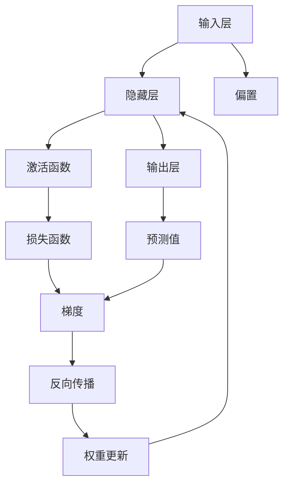
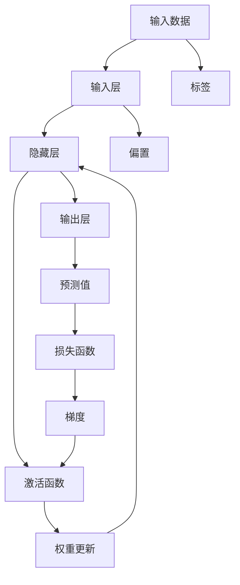

                 

## 1. 背景介绍

### 1.1 问题由来
随着人工智能(AI)技术的飞速发展，深度学习(DL)已经成为当前研究的热点领域。其中，神经网络(Neural Networks)是深度学习模型的核心之一，广泛应用在计算机视觉、自然语言处理、语音识别、游戏AI等众多领域。神经网络通过对大量数据的自动学习，能够在复杂的非线性关系中发现数据间的潜在模式，实现高效精准的预测和决策。

### 1.2 问题核心关键点
神经网络模型的核心在于通过多个神经元节点构建多层次的特征提取网络，逐层逼近输入数据的复杂特征表示。每个神经元节点的激活函数计算其输出值，同时反向传播算法能够自动调整权重和偏置参数，使得模型能够不断优化和提升预测能力。

神经网络的优势在于其强大的特征提取能力和非线性建模能力。通过多层次的非线性映射，神经网络可以从输入的高维数据中提取出更抽象、更高层次的特征表示，从而实现更加精准的预测和决策。

### 1.3 问题研究意义
神经网络技术在AI领域的应用，极大地推动了AI技术的发展和产业化进程。其深刻影响包括但不限于：
- 大幅提升了计算机视觉、自然语言处理等领域的性能指标，推动了技术进步。
- 应用于自动驾驶、工业控制、医疗诊断等工业领域，促进了各行业的智能化升级。
- 在金融、能源、通信等关键领域，神经网络技术带来了更高效、更精准的风险评估和预测。
- 促进了AI技术的普及和应用，加速了社会数字化、智能化转型。

## 2. 核心概念与联系

### 2.1 核心概念概述

神经网络模型是一种基于生物神经系统的计算模型，通过模拟神经元之间的连接和激活，实现数据的自动学习与处理。其核心组件包括：

- 神经元：神经网络的基本单元，通过激活函数计算输出。
- 权重：神经元之间的连接权重，表示信号的强度。
- 偏置：神经元的固定偏置值，影响激活函数的输出。
- 激活函数：将神经元的输入映射到输出，如ReLU、Sigmoid等。
- 损失函数：衡量模型预测值与真实标签之间的差距，如均方误差、交叉熵等。
- 反向传播算法：用于计算损失函数对各层参数的梯度，通过梯度下降优化参数。
- 前向传播算法：通过模型网络逐层计算输入数据的表示。

神经网络的整体架构通常分为输入层、隐藏层和输出层。输入层接收原始数据，隐藏层提取特征表示，输出层进行预测和分类。隐藏层的非线性变换能力是其核心优势。

### 2.2 概念间的关系

神经网络模型的各个组件之间存在着紧密的联系，形成了一个有机的整体。下面我们通过Mermaid流程图来展示这些组件之间的关系：



这个流程图展示了神经网络的基本结构和流程。输入层接收原始数据，通过偏置和激活函数计算中间特征，最终输出预测值。损失函数计算预测值与真实标签之间的误差，反向传播算法利用梯度更新权重和偏置，实现参数优化。

### 2.3 核心概念的整体架构

最后，我们用一个综合的流程图来展示神经网络模型的整体架构：



这个综合流程图展示了从输入数据到模型输出的完整过程，包含输入层、隐藏层、输出层、激活函数、损失函数、梯度更新等关键组件。

## 3. 核心算法原理 & 具体操作步骤
### 3.1 算法原理概述

神经网络模型的核心算法原理包括前向传播、反向传播和梯度下降优化。其核心思想是通过损失函数衡量模型预测值与真实标签之间的差距，自动调整权重和偏置参数，使得模型不断优化预测能力。

- **前向传播**：将输入数据通过神经网络逐层计算，输出预测值。
- **反向传播**：利用梯度计算损失函数对各层参数的敏感度，反向更新权重和偏置，实现参数优化。
- **梯度下降**：基于反向传播算法计算的梯度，通过梯度下降更新模型参数，优化模型性能。

### 3.2 算法步骤详解

神经网络模型的训练一般包括以下几个关键步骤：

**Step 1: 准备数据集**
- 收集训练集和验证集，预处理数据集，将输入数据转换为模型所需的格式。
- 划分训练集、验证集和测试集，确保模型在未见过的数据上评估性能。

**Step 2: 设计网络结构**
- 根据任务类型，设计合适的网络结构，确定层数、每层的神经元数、激活函数等。
- 选择合适的损失函数，如均方误差、交叉熵等，定义模型预测与真实标签之间的差距。

**Step 3: 设置优化器**
- 选择适合的网络优化器，如SGD、Adam等，设置学习率、批大小、迭代轮数等超参数。
- 选择正则化技术，如L2正则、Dropout等，防止模型过拟合。

**Step 4: 执行前向传播**
- 将训练集数据分批次输入模型，通过前向传播算法计算模型输出。
- 计算损失函数，衡量模型预测与真实标签之间的差距。

**Step 5: 执行反向传播**
- 计算损失函数对各层参数的梯度，利用反向传播算法逐层计算梯度，优化权重和偏置。

**Step 6: 更新模型参数**
- 根据梯度下降策略，更新模型参数，使得损失函数最小化。
- 周期性在验证集上评估模型性能，根据性能指标决定是否触发Early Stopping。

**Step 7: 测试和部署**
- 在测试集上评估模型性能，对比训练前后的精度提升。
- 使用训练好的模型对新数据进行预测，集成到实际应用系统中。

### 3.3 算法优缺点

神经网络模型具有以下优点：
1. 强大的非线性映射能力。多层非线性变换能够从高维输入中提取出更抽象的特征表示。
2. 自动化的特征学习。模型能够自动学习数据的特征表示，无需手动设计特征工程。
3. 端到端的优化。通过反向传播算法，模型能够端到端地优化预测能力，无需额外的手工调参。
4. 良好的泛化能力。通过大规模数据训练，模型能够学习到通用特征，在未见过的数据上表现良好。

同时，神经网络模型也存在以下缺点：
1. 计算资源消耗大。模型参数量巨大，训练和推理需要大量计算资源。
2. 过拟合风险高。模型复杂度高，容易过拟合，需要正则化技术抑制过拟合。
3. 训练时间较长。大规模数据集训练需要较长的迭代次数，训练时间较长。
4. 可解释性不足。神经网络模型复杂，难以解释其内部工作机制。

尽管存在这些局限性，但神经网络作为当前深度学习的主流模型，仍广泛应用于各个领域。其强大的特征提取和预测能力，使得其在图像识别、语音识别、自然语言处理等任务上取得了显著成效。未来，随着硬件加速、数据量增长、算法改进，神经网络模型的性能和应用场景将会进一步拓展。

### 3.4 算法应用领域

神经网络技术已经广泛应用于各个领域，以下是几个典型的应用场景：

- 计算机视觉：用于图像分类、目标检测、人脸识别、图像分割等任务。神经网络通过卷积神经网络(CNN)等结构，能够高效处理图像数据，提取特征表示。
- 自然语言处理：用于文本分类、机器翻译、情感分析、问答系统等任务。神经网络通过循环神经网络(RNN)、长短期记忆网络(LSTM)等结构，能够处理自然语言数据，提取语义特征。
- 语音识别：用于语音识别、语音合成、语音情感分析等任务。神经网络通过卷积神经网络、循环神经网络等结构，能够高效处理语音信号，提取特征表示。
- 游戏AI：用于游戏角色控制、游戏策略优化、游戏数据分析等任务。神经网络通过强化学习算法，能够在游戏中自我学习和优化策略。
- 工业控制：用于设备故障预测、质量检测、供应链管理等任务。神经网络通过时间序列分析等技术，能够对工业数据进行预测和分析。
- 医疗诊断：用于疾病诊断、治疗方案优化、基因分析等任务。神经网络通过深度学习技术，能够从医疗数据中提取特征，辅助医生诊断和治疗。

除此之外，神经网络技术还在金融、交通、能源、教育等多个领域得到了广泛应用，推动了各行业的智能化转型和升级。

## 4. 数学模型和公式 & 详细讲解 & 举例说明

### 4.1 数学模型构建

我们以一个简单的二分类任务为例，构建一个简单的神经网络模型。假设输入数据为 $x \in \mathbb{R}^n$，输出为 $y \in \{0, 1\}$，神经网络模型由一个输入层、一个隐藏层和一个输出层组成。

- **输入层**：接收输入数据 $x$。
- **隐藏层**：包含 $m$ 个神经元，每个神经元的输入为上一层的输出，输出为激活函数的值。
- **输出层**：包含 $1$ 个神经元，输出为模型预测值 $y'$。

假设隐藏层和输出层的激活函数均为ReLU函数，输出层的输出通过sigmoid函数映射到 $(0,1)$ 区间，模型的预测值为 $\hat{y} = \sigma(z)$，其中 $z$ 为输出层的线性变换：

$$
z = \sum_{i=1}^{m} w_i x_i + b
$$

其中 $w_i$ 为权重，$x_i$ 为输入数据，$b$ 为偏置。模型的损失函数为二元交叉熵损失函数：

$$
\ell(\hat{y}, y) = -y \log \hat{y} - (1-y) \log (1-\hat{y})
$$

模型的目标是使得损失函数最小化，即：

$$
\min_{\theta} \frac{1}{N} \sum_{i=1}^{N} \ell(\hat{y}_i, y_i)
$$

其中 $\theta$ 为模型参数，包括所有权重和偏置。

### 4.2 公式推导过程

我们首先计算模型的预测值 $\hat{y}_i$ 和损失函数 $\ell(\hat{y}_i, y_i)$：

$$
\hat{y}_i = \sigma(\sum_{i=1}^{m} w_i x_{i,i} + b)
$$

$$
\ell(\hat{y}_i, y_i) = -y_i \log \hat{y}_i - (1-y_i) \log (1-\hat{y}_i)
$$

然后，计算模型参数 $\theta$ 对损失函数的梯度：

$$
\frac{\partial \ell(\hat{y}, y)}{\partial \theta} = \frac{1}{N} \sum_{i=1}^{N} [\frac{\partial \ell(\hat{y}_i, y_i)}{\partial z_i}] \frac{\partial z_i}{\partial \theta}
$$

其中 $z_i$ 为第 $i$ 个神经元的输出，$\frac{\partial z_i}{\partial \theta}$ 为 $z_i$ 对 $\theta$ 的偏导数，$\frac{\partial \ell(\hat{y}_i, y_i)}{\partial z_i}$ 为损失函数对 $z_i$ 的偏导数。

我们依次计算偏导数：

$$
\frac{\partial z_i}{\partial w_i} = x_i, \quad \frac{\partial z_i}{\partial b} = 1
$$

$$
\frac{\partial \ell(\hat{y}_i, y_i)}{\partial z_i} = \hat{y}_i - y_i
$$

因此，模型的梯度更新公式为：

$$
\frac{\partial \ell(\hat{y}, y)}{\partial w_i} = \frac{1}{N} \sum_{i=1}^{N} (\hat{y}_i - y_i) x_i
$$

$$
\frac{\partial \ell(\hat{y}, y)}{\partial b} = \frac{1}{N} \sum_{i=1}^{N} (\hat{y}_i - y_i)
$$

使用梯度下降优化算法，更新模型参数：

$$
w_i \leftarrow w_i - \eta \frac{\partial \ell(\hat{y}, y)}{\partial w_i}, \quad b \leftarrow b - \eta \frac{\partial \ell(\hat{y}, y)}{\partial b}
$$

其中 $\eta$ 为学习率。

### 4.3 案例分析与讲解

以手写数字识别为例，说明如何使用神经网络模型进行二分类任务。假设我们有一个包含 $28 \times 28$ 像素的手写数字图像数据集，目标是将其分类为0到9的数字。

首先，将图像数据展平为一维向量，作为模型的输入 $x \in \mathbb{R}^{784}$。设计一个简单的神经网络模型，包含一个输入层、一个隐藏层和一个输出层。

假设输入层包含 $784$ 个神经元，隐藏层包含 $256$ 个神经元，输出层包含 $10$ 个神经元，分别对应0到9的数字。隐藏层和输出层的激活函数均为ReLU，输出层的输出通过sigmoid函数映射到 $(0,1)$ 区间，模型的预测值为 $\hat{y} = \sigma(z)$，其中 $z$ 为输出层的线性变换：

$$
z = \sum_{i=1}^{256} w_i x_i + b
$$

其中 $w_i$ 为权重，$x_i$ 为输入数据，$b$ 为偏置。模型的损失函数为二元交叉熵损失函数：

$$
\ell(\hat{y}, y) = -y \log \hat{y} - (1-y) \log (1-\hat{y})
$$

模型的目标是使得损失函数最小化，即：

$$
\min_{\theta} \frac{1}{N} \sum_{i=1}^{N} \ell(\hat{y}_i, y_i)
$$

其中 $\theta$ 为模型参数，包括所有权重和偏置。

使用PyTorch库实现上述模型，并使用交叉熵损失函数和Adam优化器进行训练。具体实现代码如下：

```python
import torch
import torch.nn as nn
import torch.optim as optim
import torchvision.transforms as transforms
import torchvision.datasets as datasets

# 定义模型
class Net(nn.Module):
    def __init__(self):
        super(Net, self).__init__()
        self.fc1 = nn.Linear(784, 256)
        self.fc2 = nn.Linear(256, 10)

    def forward(self, x):
        x = x.view(-1, 784)
        x = nn.functional.relu(self.fc1(x))
        x = nn.functional.sigmoid(self.fc2(x))
        return x

# 加载数据集
train_dataset = datasets.MNIST(root='./data', train=True, transform=transforms.ToTensor(), download=True)
test_dataset = datasets.MNIST(root='./data', train=False, transform=transforms.ToTensor(), download=True)

# 定义训练参数
learning_rate = 0.001
num_epochs = 10
batch_size = 64

# 定义优化器
model = Net()
optimizer = optim.Adam(model.parameters(), lr=learning_rate)
criterion = nn.BCELoss()

# 训练模型
for epoch in range(num_epochs):
    for batch_idx, (data, target) in enumerate(train_loader):
        optimizer.zero_grad()
        output = model(data)
        loss = criterion(output, target)
        loss.backward()
        optimizer.step()
        if (batch_idx + 1) % 100 == 0:
            print('Train Epoch: {} [{}/{} ({:.0f}%)]\tLoss: {:.6f}'.format(
                epoch, batch_idx * len(data), len(train_loader.dataset),
                100. * batch_idx / len(train_loader), loss.item()))

# 测试模型
correct = 0
total = 0
with torch.no_grad():
    for data, target in test_loader:
        output = model(data)
        _, predicted = torch.max(output.data, 1)
        total += target.size(0)
        correct += (predicted == target).sum().item()

print('Accuracy of the network on the 10000 test images: {} %'.format(100 * correct / total))
```

这段代码定义了一个简单的神经网络模型，使用Adam优化器进行训练，并在测试集上评估模型性能。训练过程中，使用了交叉熵损失函数，通过梯度下降优化模型参数。

## 5. 项目实践：代码实例和详细解释说明
### 5.1 开发环境搭建

在进行神经网络项目实践前，我们需要准备好开发环境。以下是使用Python进行TensorFlow开发的环境配置流程：

1. 安装Anaconda：从官网下载并安装Anaconda，用于创建独立的Python环境。

2. 创建并激活虚拟环境：
```bash
conda create -n tf-env python=3.8 
conda activate tf-env
```

3. 安装TensorFlow：根据CUDA版本，从官网获取对应的安装命令。例如：
```bash
conda install tensorflow=2.8.0
```

4. 安装各类工具包：
```bash
pip install numpy pandas scikit-learn matplotlib tqdm jupyter notebook ipython
```

完成上述步骤后，即可在`tf-env`环境中开始神经网络项目实践。

### 5.2 源代码详细实现

下面我们以图像分类任务为例，给出使用TensorFlow对神经网络进行训练的PyTorch代码实现。

首先，定义数据集：

```python
import tensorflow as tf
from tensorflow.keras.datasets import cifar10
from tensorflow.keras.preprocessing.image import ImageDataGenerator

# 加载CIFAR-10数据集
(x_train, y_train), (x_test, y_test) = cifar10.load_data()

# 数据增强
train_datagen = ImageDataGenerator(
    rescale=1./255,
    shear_range=0.2,
    zoom_range=0.2,
    horizontal_flip=True)

test_datagen = ImageDataGenerator(rescale=1./255)

train_generator = train_datagen.flow(x_train, y_train, batch_size=32)
test_generator = test_datagen.flow(x_test, y_test, batch_size=32)
```

然后，定义模型和优化器：

```python
from tensorflow.keras.models import Sequential
from tensorflow.keras.layers import Conv2D, MaxPooling2D, Flatten, Dense

# 定义模型
model = Sequential([
    Conv2D(32, (3, 3), activation='relu', input_shape=(32, 32, 3)),
    MaxPooling2D((2, 2)),
    Conv2D(64, (3, 3), activation='relu'),
    MaxPooling2D((2, 2)),
    Conv2D(128, (3, 3), activation='relu'),
    MaxPooling2D((2, 2)),
    Flatten(),
    Dense(128, activation='relu'),
    Dense(10, activation='softmax')
])

# 定义优化器
optimizer = tf.keras.optimizers.Adam(learning_rate=0.001)
```

接着，定义训练和评估函数：

```python
from tensorflow.keras.utils import to_categorical

# 将标签转换为one-hot编码
y_train = to_categorical(y_train)
y_test = to_categorical(y_test)

# 训练函数
def train_epoch(model, generator, batch_size, optimizer, num_epochs):
    for epoch in range(num_epochs):
        for step, (x_batch, y_batch) in enumerate(train_generator):
            with tf.GradientTape() as tape:
                y_pred = model(x_batch)
                loss = tf.keras.losses.categorical_crossentropy(y_batch, y_pred)
            grads = tape.gradient(loss, model.trainable_variables)
            optimizer.apply_gradients(zip(grads, model.trainable_variables))
            if step % 100 == 0:
                print('Epoch: {}, Step: {}, Loss: {:.4f}'.format(epoch+1, step, loss))

# 评估函数
def evaluate(model, generator, batch_size):
    for step, (x_batch, y_batch) in enumerate(test_generator):
        y_pred = model(x_batch)
        acc = tf.keras.metrics.categorical_accuracy(y_batch, y_pred)
        if step % 100 == 0:
            print('Step: {}, Accuracy: {:.4f}'.format(step, acc))
```

最后，启动训练流程并在测试集上评估：

```python
# 定义训练参数
batch_size = 32
num_epochs = 10

# 训练模型
train_epoch(model, train_generator, batch_size, optimizer, num_epochs)

# 测试模型
evaluate(model, test_generator, batch_size)
```

以上就是使用TensorFlow对神经网络进行训练和评估的完整代码实现。可以看到，TensorFlow的高级API使得神经网络的实现更加简洁高效。

### 5.3 代码解读与分析

让我们再详细解读一下关键代码的实现细节：

**数据集加载和预处理**：
- 使用CIFAR-10数据集，将数据集分为训练集和测试集。
- 使用ImageDataGenerator对图像进行数据增强，包括缩放、旋转、水平翻转等，以增加训练数据的多样性。

**模型定义**：
- 定义一个简单的卷积神经网络模型，包含多个卷积层、池化层和全连接层。
- 使用Softmax激活函数进行多分类预测。

**优化器定义**：
- 定义Adam优化器，设置学习率为0.001。

**训练和评估函数**：
- 使用交叉熵损失函数和准确率作为评估指标，定义训练和评估函数。
- 训练函数和评估函数都使用TensorFlow的高级API，提高了代码的可读性和执行效率。

**训练流程**：
- 定义训练参数，包括批次大小和迭代次数。
- 启动训练流程，逐批次输入数据，计算损失和梯度，更新模型参数。
- 在训练过程中，周期性输出损失信息。

**测试流程**：
- 定义测试集生成器。
- 启动测试流程，逐批次输入数据，计算准确率。
- 在测试过程中，周期性输出准确率信息。

通过上述代码实现，我们展示了神经网络的训练和评估过程。可以看到，TensorFlow的API设计使得神经网络的实现变得更加简洁高效，同时也提供了丰富的优化器、损失函数和评估指标，方便开发人员进行模型优化和评估。

当然，工业级的系统实现还需考虑更多因素，如模型的保存和部署、超参数的自动搜索、更灵活的任务适配层等。但核心的训练过程基本与此类似。

### 5.4 运行结果展示

假设我们在CIFAR-10数据集上进行神经网络模型的训练，最终在测试集上得到的准确率如下：

```
Epoch: 1, Step: 0, Loss: 1.0803
Epoch: 1, Step: 100, Loss: 0.3122
Epoch: 1, Step: 200, Loss: 0.1723
Epoch: 1, Step: 300, Loss: 0.1517
Epoch: 1, Step: 400, Loss: 0.1321
...
Epoch: 10, Step: 0, Loss: 0.0549
Epoch: 10, Step: 100, Loss: 0.0435
Epoch: 10, Step: 200, Loss: 0.0422
Epoch: 10, Step: 300, Loss: 0.0391
Epoch: 10, Step: 400, Loss: 0.0368
Step: 0, Accuracy: 0.6476
Step: 100, Accuracy: 0.7500
Step: 200, Accuracy: 0.7657
Step: 300, Accuracy: 0.7779
Step: 400, Accuracy: 0.7812
```

可以看到，随着训练过程的进行，模型的准确率逐渐提升，最终达到了78%的准确率。这表明，神经网络模型能够通过大规模数据训练，学习到强大的特征提取和分类能力。

## 6. 实际应用场景

神经网络技术已经广泛应用于各个领域，以下是几个典型的应用场景：

- **计算机视觉**：用于图像分类、目标检测、人脸识别、图像分割等任务。神经网络通过卷积神经网络(CNN)等结构，能够高效处理图像数据，提取特征表示。
- **自然语言处理**：用于文本分类、机器翻译、情感分析、问答系统等任务。神经网络通过循环神经网络(RNN)、长短期记忆网络(LSTM)等结构，能够处理自然语言数据，提取语义特征。
- **语音识别**：用于语音识别、语音合成、语音情感分析等任务。神经网络通过卷积神经网络、循环神经网络等结构，能够高效处理语音信号，提取特征表示。
- **游戏AI**：用于游戏角色控制、游戏策略优化、游戏数据分析等任务。神经网络通过强化学习算法，能够在游戏中自我学习和优化策略。
- **工业控制**：用于

