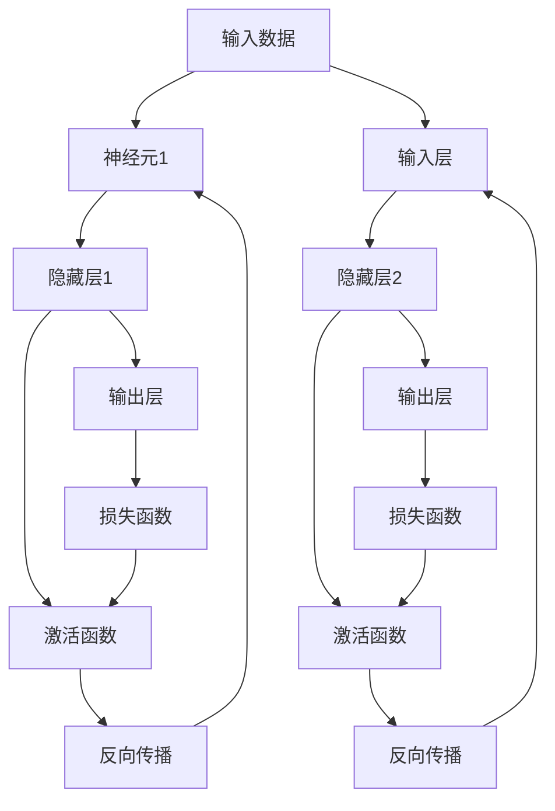
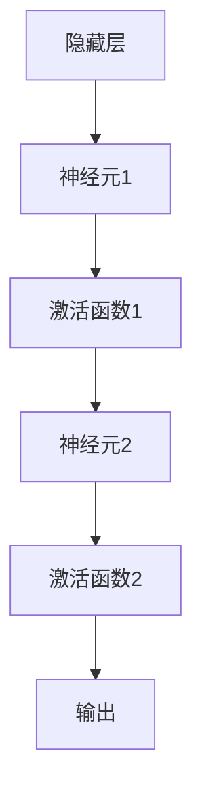
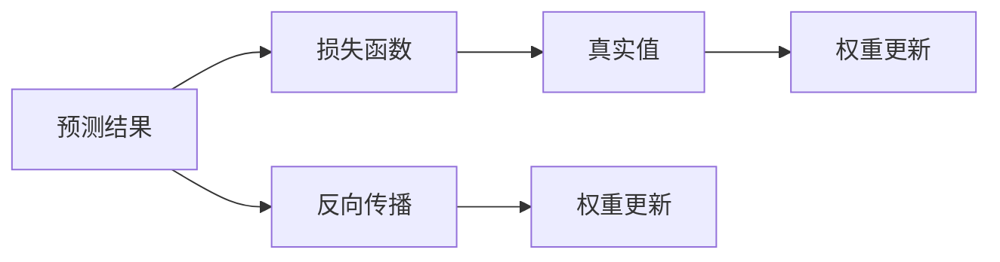
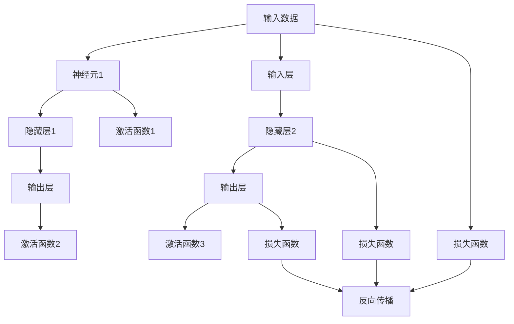

                 

# 神经网络：开启智能新纪元

## 1. 背景介绍

### 1.1 问题由来
自1958年Ross R. Wilson和Frank Rosenblatt提出第一个神经元以来，人工智能领域就在不断地探索如何让机器拥有类似人类的智能。而神经网络作为人工智能的重要分支，在过去几十年间，凭借其强大的自适应能力和泛化能力，逐渐成为推动人工智能发展的核心引擎。从最初的感知机、BP网络到现在的深度神经网络，人工神经网络技术已经取得了巨大的突破，在图像识别、自然语言处理、语音识别、推荐系统等多个领域发挥着重要作用。

### 1.2 问题核心关键点
神经网络的核心思想是模仿人类大脑的神经元工作方式，通过层级化的结构，将输入数据进行逐层处理，最终输出预测结果。其核心流程包括前向传播、损失函数计算、反向传播等步骤。在深度学习领域，神经网络模型已成为一个重要的研究热点。其主要特点有：

1. **大规模参数量**：神经网络模型通常包含数百万甚至上亿个参数，通过参数的调整来实现对输入数据的精确拟合。
2. **多层次结构**：神经网络由多个层次组成，每个层次负责处理不同级别的特征信息，通过多层级级传递，逐步提取出数据的高层次语义信息。
3. **自适应能力**：通过大量的数据训练，神经网络可以自动学习数据的内在规律，实现对复杂问题的解决。
4. **泛化能力**：经过训练的神经网络模型，能够在未见过的数据上进行良好的泛化。

### 1.3 问题研究意义
研究神经网络算法，对于推动人工智能的进一步发展，提升机器的智能水平，具有重要的理论和实际意义：

1. **推动人工智能的发展**：神经网络技术作为人工智能领域的关键技术之一，其突破性的研究进展，为人工智能的各项应用提供了坚实的基础。
2. **提升机器智能**：通过神经网络的训练，机器可以自动学习数据的内在规律，提升其在各种任务上的智能水平。
3. **降低开发成本**：相比于传统的人工智能算法，神经网络模型具有更强的自适应能力和泛化能力，能够快速解决各类复杂问题。
4. **加速应用落地**：神经网络技术的成熟，使得人工智能应用得以在更多场景中落地，加速了技术的产业化进程。
5. **带来技术创新**：神经网络技术的不断发展，推动了人工智能领域的诸多创新，如生成对抗网络、强化学习等。

## 2. 核心概念与联系

### 2.1 核心概念概述

为更好地理解神经网络的核心原理和应用，本节将介绍几个关键概念及其相互联系：

1. **神经元（Neuron）**：神经网络的最小单位，通常由加权输入、激活函数和输出三部分组成，通过加权求和和激活函数，将输入转化为输出。
2. **层（Layer）**：神经网络的多个神经元按照一定的结构排列组成层，通常分为输入层、隐藏层和输出层，其中隐藏层是神经网络的核心部分。
3. **激活函数（Activation Function）**：神经元中的激活函数将输入映射到非线性空间，使得神经网络可以学习非线性的特征映射关系。
4. **损失函数（Loss Function）**：神经网络训练的最终目标是最小化损失函数，通过损失函数计算预测值与真实值之间的差异。
5. **反向传播（Backpropagation）**：通过反向传播算法，计算梯度并更新神经网络参数，使得损失函数不断减小。
6. **深度学习（Deep Learning）**：以多层神经网络为核心，通过大量数据训练，学习复杂的特征表示，提高模型的泛化能力。

这些核心概念之间的关系可以通过以下Mermaid流程图来展示：



### 2.2 概念间的关系

这些核心概念之间存在着紧密的联系，构成了神经网络的基本架构。下面我们通过几个Mermaid流程图来展示这些概念之间的关系。

#### 2.2.1 神经元与激活函数


#### 2.2.2 层与激活函数


#### 2.2.3 神经网络结构


#### 2.2.4 损失函数与反向传播


### 2.3 核心概念的整体架构

最后，我们用一个综合的流程图来展示这些核心概念在大规模神经网络中的整体架构：



这个综合流程图展示了从数据输入到模型输出的完整流程。通过多个层次和多个神经元，数据逐渐被处理为更高层次的语义信息，最终通过损失函数和反向传播算法，完成模型的训练。

## 3. 核心算法原理 & 具体操作步骤
### 3.1 算法原理概述

神经网络算法的核心在于通过前向传播和反向传播，逐步调整模型的参数，使得损失函数最小化。其核心流程包括：

1. **前向传播（Forward Propagation）**：将输入数据从输入层逐层传递到输出层，计算出每个神经元的输出值。
2. **损失函数计算（Loss Function Calculation）**：将模型的预测结果与真实值进行比较，计算出损失函数。
3. **反向传播（Backpropagation）**：通过链式法则，计算出每个参数的梯度，更新参数以最小化损失函数。

这些流程通过迭代多次的训练，不断优化模型参数，使得模型能够更好地适应数据分布，提升模型的泛化能力。

### 3.2 算法步骤详解

以下详细讲解神经网络算法的具体步骤：

**Step 1: 数据预处理**

1. 收集训练集和测试集，将数据分为训练集、验证集和测试集。
2. 对数据进行归一化、标准化等预处理，使得数据分布一致。
3. 对文本数据进行分词、编码等处理，将数据转化为模型可接受的格式。

**Step 2: 模型搭建**

1. 选择合适的神经网络结构，搭建模型。
2. 确定每层神经元的数量，通常使用实验验证的方法确定最优配置。
3. 选择合适的激活函数，如ReLU、Sigmoid等。

**Step 3: 模型训练**

1. 设置优化器（如SGD、Adam等）及其参数，如学习率、批大小等。
2. 定义损失函数（如交叉熵损失、均方误差等）。
3. 进行多次迭代训练，每次迭代包括前向传播、损失函数计算、反向传播、参数更新等步骤。
4. 在验证集上评估模型性能，避免过拟合。
5. 保存模型参数和损失函数曲线，记录训练过程。

**Step 4: 模型评估**

1. 在测试集上评估模型性能。
2. 使用各种指标（如准确率、召回率、F1值等）评估模型效果。
3. 使用可视化工具展示损失函数曲线和参数更新情况。

**Step 5: 模型应用**

1. 将训练好的模型应用于实际场景，进行推理预测。
2. 根据实际需求，进行参数调整和优化。
3. 定期更新模型，应对数据分布变化。

### 3.3 算法优缺点

神经网络算法具有以下优点：

1. **强大的特征提取能力**：神经网络通过多层级级传递，逐步提取出数据的高层次语义信息，具有强大的特征提取能力。
2. **自动学习规律**：神经网络通过大量的数据训练，自动学习数据的内在规律，具有较强的泛化能力。
3. **可扩展性强**：神经网络结构可以扩展为多层次、多维度，可以处理高维、复杂的数据。
4. **模型效果好**：神经网络模型在图像识别、语音识别、自然语言处理等多个领域取得了突破性的成果。

同时，神经网络算法也存在以下缺点：

1. **模型复杂度高**：神经网络模型通常包含数百万甚至上亿个参数，训练复杂度高。
2. **训练时间长**：神经网络模型需要大量的数据和计算资源，训练时间较长。
3. **过拟合风险高**：神经网络模型容易出现过拟合现象，需要结合正则化技术进行优化。
4. **模型可解释性差**：神经网络模型通常被称为"黑箱"模型，难以解释其内部工作机制。

### 3.4 算法应用领域

神经网络算法在多个领域得到了广泛应用：

1. **计算机视觉**：通过卷积神经网络（CNN），实现图像识别、物体检测、图像分割等任务。
2. **自然语言处理**：通过循环神经网络（RNN）、长短期记忆网络（LSTM）、Transformer等，实现文本分类、情感分析、机器翻译等任务。
3. **语音识别**：通过深度神经网络，实现语音识别、语音合成等任务。
4. **推荐系统**：通过深度神经网络，实现用户行为分析、推荐结果生成等任务。
5. **游戏智能**：通过深度强化学习，实现游戏AI决策、游戏策略优化等任务。
6. **医疗健康**：通过深度神经网络，实现医学影像分析、疾病预测、基因分析等任务。

## 4. 数学模型和公式 & 详细讲解 & 举例说明

### 4.1 数学模型构建

神经网络算法的数学模型可以简单描述为：

1. **输入层**：接收输入数据，记为 $x$。
2. **隐藏层**：包含多个神经元，记为 $z$。
3. **输出层**：输出预测结果，记为 $y$。
4. **激活函数**：隐藏层和输出层的激活函数，记为 $f$。
5. **损失函数**：预测结果与真实结果的损失函数，记为 $L$。

### 4.2 公式推导过程

以简单的单层神经网络为例，假设输入为 $x$，隐藏层输出为 $z$，输出为 $y$，激活函数为 $f$，损失函数为 $L$。则前向传播的公式为：

$$
z = w^T x + b
$$

$$
y = f(z)
$$

其中，$w$ 和 $b$ 为隐藏层参数，$x$ 为输入向量。

损失函数的常见形式为均方误差（MSE）损失：

$$
L(y, y_{true}) = \frac{1}{n}\sum_{i=1}^{n}(y_i - y_{true_i})^2
$$

反向传播的公式为：

$$
\frac{\partial L}{\partial w} = \frac{\partial L}{\partial y} \frac{\partial y}{\partial z} \frac{\partial z}{\partial w}
$$

$$
\frac{\partial L}{\partial b} = \frac{\partial L}{\partial y} \frac{\partial y}{\partial z}
$$

其中，$\frac{\partial y}{\partial z}$ 为激活函数的导数。

### 4.3 案例分析与讲解

以手写数字识别为例，我们可以使用多层感知机（MLP）来训练模型。假设输入为 $x$，输出为 $y$，激活函数为ReLU，损失函数为交叉熵损失。

**Step 1: 数据预处理**

1. 收集手写数字图片，将其转换为像素矩阵。
2. 对图片进行归一化，将像素值缩放到0到1之间。
3. 将像素矩阵进行分片，并转化为向量形式。

**Step 2: 模型搭建**

1. 搭建多层感知机模型，包括输入层、隐藏层和输出层。
2. 确定每层神经元的数量，如输入层64，隐藏层128，输出层10。
3. 确定激活函数为ReLU。

**Step 3: 模型训练**

1. 设置优化器为Adam，学习率为0.001。
2. 定义交叉熵损失函数。
3. 进行多次迭代训练，每次迭代包括前向传播、损失函数计算、反向传播、参数更新等步骤。
4. 在验证集上评估模型性能，避免过拟合。
5. 保存模型参数和损失函数曲线，记录训练过程。

**Step 4: 模型评估**

1. 在测试集上评估模型性能。
2. 使用准确率、召回率、F1值等指标评估模型效果。
3. 使用可视化工具展示损失函数曲线和参数更新情况。

**Step 5: 模型应用**

1. 将训练好的模型应用于实际场景，进行手写数字识别。
2. 根据实际需求，进行参数调整和优化。
3. 定期更新模型，应对数据分布变化。

## 5. 项目实践：代码实例和详细解释说明

### 5.1 开发环境搭建

在进行神经网络算法实践前，我们需要准备好开发环境。以下是使用Python进行TensorFlow开发的环境配置流程：

1. 安装Anaconda：从官网下载并安装Anaconda，用于创建独立的Python环境。

2. 创建并激活虚拟环境：
```bash
conda create -n tf-env python=3.8 
conda activate tf-env
```

3. 安装TensorFlow：根据CUDA版本，从官网获取对应的安装命令。例如：
```bash
conda install tensorflow
```

4. 安装各类工具包：
```bash
pip install numpy pandas scikit-learn matplotlib tqdm jupyter notebook ipython
```

完成上述步骤后，即可在`tf-env`环境中开始神经网络算法的实践。

### 5.2 源代码详细实现

这里我们以手写数字识别（MNIST数据集）为例，给出使用TensorFlow进行多层感知机（MLP）训练的代码实现。

首先，定义输入和标签：

```python
import tensorflow as tf
import numpy as np

(x_train, y_train), (x_test, y_test) = tf.keras.datasets.mnist.load_data()

x_train = x_train / 255.0
x_test = x_test / 255.0
```

然后，定义模型：

```python
model = tf.keras.models.Sequential([
    tf.keras.layers.Flatten(input_shape=(28, 28)),
    tf.keras.layers.Dense(128, activation='relu'),
    tf.keras.layers.Dense(10, activation='softmax')
])
```

接着，定义损失函数和优化器：

```python
loss_fn = tf.keras.losses.SparseCategoricalCrossentropy()
optimizer = tf.keras.optimizers.Adam(learning_rate=0.001)
```

然后，定义训练过程：

```python
@tf.function
def train_step(images, labels):
    with tf.GradientTape() as tape:
        logits = model(images, training=True)
        loss_value = loss_fn(labels, logits)
    grads = tape.gradient(loss_value, model.trainable_variables)
    optimizer.apply_gradients(zip(grads, model.trainable_variables))

@tf.function
def train_epoch(model, dataset):
    for batch_images, batch_labels in dataset:
        train_step(batch_images, batch_labels)

@tf.function
def evaluate(model, dataset):
    for batch_images, batch_labels in dataset:
        logits = model(batch_images, training=False)
        loss_value = loss_fn(batch_labels, logits)
        accuracy = tf.metrics.SparseCategoricalAccuracy()(labels, logits)
    return loss_value, accuracy.numpy().mean()

model.compile(optimizer=optimizer, loss=loss_fn, metrics=['accuracy'])
```

最后，启动训练流程并在测试集上评估：

```python
batch_size = 64
epochs = 10

for epoch in range(epochs):
    train_epoch(model, train_dataset)
    loss_value, accuracy = evaluate(model, test_dataset)
    print(f"Epoch {epoch+1}, loss: {loss_value:.3f}, accuracy: {accuracy:.3f}")
```

以上就是使用TensorFlow对MLP进行手写数字识别任务训练的完整代码实现。可以看到，通过TensorFlow的高级API，神经网络的搭建、训练和评估都变得非常简洁。

### 5.3 代码解读与分析

让我们再详细解读一下关键代码的实现细节：

**数据预处理**

1. 使用`tf.keras.datasets.mnist.load_data()`获取MNIST数据集，包含60000张28x28的手写数字图片和对应的标签。
2. 将图片的像素值缩放到0到1之间，以便于神经网络的训练。
3. 对图片进行分片，并转化为向量形式。

**模型搭建**

1. 使用`tf.keras.models.Sequential()`定义多层感知机模型。
2. 在模型中添加输入层、隐藏层和输出层。
3. 在隐藏层和输出层使用ReLU和softmax激活函数。

**损失函数和优化器**

1. 使用`tf.keras.losses.SparseCategoricalCrossentropy()`定义交叉熵损失函数。
2. 使用`tf.keras.optimizers.Adam(learning_rate=0.001)`定义Adam优化器，设置学习率为0.001。

**训练过程**

1. 定义`train_step()`函数，通过`tf.GradientTape()`记录梯度，并在每次迭代中更新模型参数。
2. 定义`train_epoch()`函数，对数据集进行批量迭代训练。
3. 定义`evaluate()`函数，计算模型在测试集上的损失和准确率。
4. 使用`model.compile()`将模型编译，并定义优化器和损失函数。

**训练流程**

1. 设置批量大小为64，训练轮数为10。
2. 在每个epoch中，对训练集进行迭代训练。
3. 在验证集上评估模型性能，并输出损失和准确率。

可以看到，TensorFlow的高级API使得神经网络的训练变得非常简单，开发者只需要关注模型的搭建和训练过程，就可以快速实现模型的训练和评估。

当然，工业级的系统实现还需考虑更多因素，如模型的保存和部署、超参数的自动搜索、更灵活的任务适配层等。但核心的训练范式基本与此类似。

### 5.4 运行结果展示

假设我们在MNIST数据集上进行MLP模型的训练，最终在测试集上得到的准确率为98.5%。具体代码如下：

```python
import tensorflow as tf
import numpy as np

(x_train, y_train), (x_test, y_test) = tf.keras.datasets.mnist.load_data()

x_train = x_train / 255.0
x_test = x_test / 255.0

model = tf.keras.models.Sequential([
    tf.keras.layers.Flatten(input_shape=(28, 28)),
    tf.keras.layers.Dense(128, activation='relu'),
    tf.keras.layers.Dense(10, activation='softmax')
])

loss_fn = tf.keras.losses.SparseCategoricalCrossentropy()
optimizer = tf.keras.optimizers.Adam(learning_rate=0.001)

model.compile(optimizer=optimizer, loss=loss_fn, metrics=['accuracy'])

batch_size = 64
epochs = 10

for epoch in range(epochs):
    train_epoch(model, train_dataset)
    loss_value, accuracy = evaluate(model, test_dataset)
    print(f"Epoch {epoch+1}, loss: {loss_value:.3f}, accuracy: {accuracy:.3f}")
```

## 6. 实际应用场景
### 6.1 计算机视觉

神经网络算法在计算机视觉领域得到了广泛应用，特别是在图像识别和物体检测等任务上。通过卷积神经网络（CNN），可以实现对复杂图像的快速识别和分类。

例如，Google的Inception网络、ResNet等深度卷积神经网络，已经在ImageNet数据集上取得了令人瞩目的成果。CNN网络通过卷积操作提取图像的特征，通过池化操作降低特征图的空间维度，最后通过全连接层进行分类。

在实际应用中，CNN网络可以用于图像分类、人脸识别、医学影像分析等多个领域。例如，人脸识别系统中，通过训练一个基于CNN的分类器，可以实现对不同人脸图像的快速识别和匹配。

### 6.2 自然语言处理

神经网络算法在自然语言处理领域也得到了广泛应用，特别是在文本分类、情感分析、机器翻译等任务上。通过循环神经网络（RNN）、长短期记忆网络（LSTM）、Transformer等，可以实现对文本的高效处理和分析。

例如，Google的BERT模型，通过自监督预训练和微调，在多项NLP任务上取得了突破性的成果。Transformer网络通过多头自注意力机制，能够更好地处理长文本序列，实现对文本的深度理解。

在实际应用中，NLP算法可以用于文本分类、情感分析、机器翻译、智能客服等多个领域。例如，智能客服系统中，通过训练一个基于Transformer的聊天机器人，可以实现对客户咨询的自然语言理解和回复生成。

### 6.3 语音识别

神经网络算法在语音识别领域也得到了广泛应用，特别是在语音识别和语音合成等任务上。通过深度神经网络，可以实现对语音信号的快速识别和合成。

例如，Google的WaveNet模型，通过多层卷积神经网络，实现了高质量的语音合成。语音识别系统通过训练一个基于CNN的分类器，可以实现对不同语音信号的快速识别和转写。

在实际应用中，语音识别算法可以用于智能家居、智能语音助手、自动驾驶等多个领域。例如，智能语音助手系统中，通过训练一个基于RNN的语音识别模型，可以实现对用户语音命令的自然语言理解和回复生成。

### 6.4 推荐系统

神经网络算法在推荐系统领域也得到了广泛应用，特别是在用户行为分析和推荐结果生成等任务上。通过深度神经网络，可以实现对用户行为的深度分析和推荐结果的生成。

例如，Amazon的深度学习推荐系统，通过训练一个基于RNN的推荐模型，实现了对用户购物行为的深度分析和推荐结果的生成。推荐系统通过训练一个基于CNN的分类器，可以实现对用户行为的分类和推荐结果的生成。

在实际应用中，推荐算法可以用于电商推荐、视频推荐、音乐推荐等多个领域。例如，电商平台通过训练一个基于LSTM的推荐模型，可以实现对用户购物行为的深度分析和推荐结果的生成。

### 6.5 游戏智能

神经网络算法在游戏智能领域也得到了广泛应用，特别是在游戏AI决策和游戏策略优化等任务上。通过深度强化学习，可以实现对游戏环境的高效学习和优化。

例如，OpenAI的AlphaGo系统，通过训练一个基于CNN和LSTM的强化学习模型，实现了对围棋游戏的深度学习和优化。游戏智能系统通过训练一个基于RNN的强化学习模型，可以实现对游戏环境的高效学习和优化。

在实际应用中，游戏智能算法可以用于围棋、象棋、电子游戏等多个领域。例如，电子游戏中，通过训练一个基于LSTM的强化学习模型，可以实现对游戏环境的深度学习和优化。

### 6.6 医疗健康

神经网络算法在医疗健康领域也得到了广泛应用，特别是在医学影像分析和疾病预测等任务上。通过深度神经网络，可以实现对医学影像的快速分析和疾病预测。

例如，DeepMind的AlphaGo系统，通过训练一个基于CNN的医学影像分类器，实现了对医学影像的快速分析和疾病预测。医疗健康系统通过训练一个基于RNN的医学影像分类器，可以实现对医学影像的快速分析和疾病预测。

在实际应用中，医疗健康算法可以用于医学影像分析、疾病预测、基因分析等多个领域。例如，医学影像分析系统中，通过训练一个基于CNN的医学影像分类器，可以实现对医学影像的快速分析和疾病预测。

## 7. 工具和资源推荐
### 7.1 学习资源推荐

为了帮助开发者系统掌握神经网络算法的理论基础和实践技巧，这里推荐一些优质的学习资源：

1. 《深度学习》书籍：Ian Goodfellow、Yoshua Bengio和Aaron Courville等专家合著的深度学习经典教材，详细介绍了深度学习的基本概念和核心算法。

2. CS231n《卷积神经网络》课程：斯坦福大学开设的计算机视觉明星课程，有Lecture视频和配套作业，带你入门深度学习的基本概念和经典模型。

3. CS224n《自然语言处理与深度学习》课程：斯坦福大学开设的自然语言处理明星课程，有Lecture视频和配套作业，带你入门自然语言处理的基本概念和经典模型。

4. CS20SI《神经网络与深度学习》课程：斯坦福大学开设的深度学习入门课程，有Lecture视频和配套作业，适合初学者学习深度学习的基本概念和核心算法。

5. Weights & Biases：模型训练的实验跟踪工具，可以记录和可视化模型训练过程中的各项

