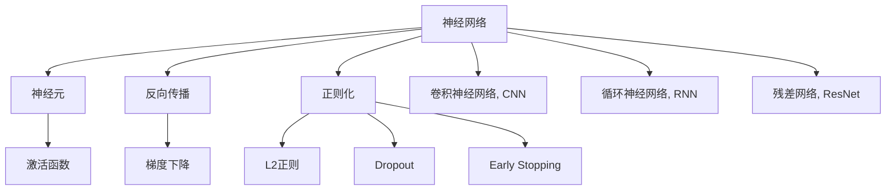

                 

# 神经网络：探索未知的领域

> 关键词：神经网络,深度学习,神经元,激活函数,反向传播,正则化,卷积神经网络,循环神经网络

## 1. 背景介绍

### 1.1 问题由来
神经网络（Neural Networks）是深度学习中的重要组成部分，在图像识别、语音识别、自然语言处理等多个领域表现出色。然而，随着模型规模和复杂度的不断增大，神经网络的研究和应用也面临许多挑战，如模型可解释性差、训练效率低、易过拟合等问题。

### 1.2 问题核心关键点
为了解决这些问题，研究人员不断探索新的算法和模型结构，如深度信念网络（DBN）、卷积神经网络（CNN）、循环神经网络（RNN）、残差网络（ResNet）等。此外，正则化、批归一化、残差连接等技巧也在不断优化神经网络的表现。

### 1.3 问题研究意义
神经网络的研究具有重要的理论和实际意义：
1. 推动深度学习的发展：神经网络是深度学习的基础，其优化和创新直接推动了深度学习技术的进步。
2. 解决实际问题：神经网络在图像识别、语音识别、自然语言处理等领域取得了突破，为各行各业提供了有力工具。
3. 促进人工智能研究：神经网络的研究成果为人工智能系统的构建提供了重要支撑。
4. 提高计算效率：通过算法优化，神经网络在计算效率上取得了显著提升。

## 2. 核心概念与联系

### 2.1 核心概念概述

为了更好地理解神经网络，我们需要先介绍几个核心概念：

- 神经网络（Neural Network）：由多个神经元组成的计算模型，通过对输入数据进行非线性变换，实现复杂函数的逼近。
- 神经元（Neuron）：神经网络的基本组成单元，接收输入数据，通过激活函数输出结果。
- 激活函数（Activation Function）：神经元的非线性变换函数，常用如ReLU、Sigmoid、Tanh等。
- 反向传播（Backpropagation）：神经网络中梯度下降算法的核心，通过链式法则计算梯度，更新模型参数。
- 正则化（Regularization）：防止神经网络过拟合的技术，包括L2正则、Dropout、Early Stopping等。
- 卷积神经网络（Convolutional Neural Network, CNN）：适用于图像处理任务的神经网络，具有平移不变性。
- 循环神经网络（Recurrent Neural Network, RNN）：适用于序列数据处理的神经网络，能够捕捉序列依赖关系。
- 残差网络（Residual Network, ResNet）：通过引入残差连接，解决了深层神经网络的梯度消失问题。

这些核心概念之间的关系可以用以下Mermaid流程图来展示：



这个流程图展示了神经网络的关键组件及其之间的关系：

1. 神经网络由神经元组成，通过激活函数实现非线性变换。
2. 反向传播算法通过链式法则计算梯度，并用于模型参数的更新。
3. 正则化技术防止过拟合，包括L2正则、Dropout等。
4. CNN和RNN分别用于图像和序列数据处理。
5. ResNet通过引入残差连接，解决深层网络梯度消失问题。

### 2.2 概念间的关系

这些核心概念之间存在着紧密的联系，形成了神经网络的基本框架：

- 神经网络通过神经元实现对输入数据的非线性映射，激活函数决定了神经元输出的非线性特性。
- 反向传播算法利用链式法则计算梯度，更新模型参数，是神经网络训练的核心。
- 正则化技术通过添加约束条件，防止模型过拟合，提升泛化能力。
- CNN和RNN针对不同的数据类型，设计了不同的网络结构和训练方式，提高了神经网络的适应性。
- ResNet通过引入残差连接，大幅提升了深层神经网络的训练效果。

## 3. 核心算法原理 & 具体操作步骤
### 3.1 算法原理概述

神经网络的训练过程主要包括以下步骤：

1. 前向传播：将输入数据输入神经网络，通过各层神经元计算输出结果。
2. 损失函数计算：计算模型输出与真实标签之间的差异，常用如均方误差（MSE）、交叉熵（Cross-Entropy）等。
3. 反向传播：通过链式法则计算损失函数对模型参数的梯度，并更新参数。
4. 正则化：通过L2正则、Dropout等技术，防止模型过拟合。

### 3.2 算法步骤详解

以下是神经网络训练的详细步骤：

1. 初始化神经网络参数：设定初始参数，如权重、偏置等。
2. 前向传播：将输入数据输入神经网络，计算各层神经元的输出。
3. 计算损失函数：将模型输出与真实标签计算损失函数。
4. 反向传播：通过链式法则计算损失函数对各参数的梯度，更新参数。
5. 正则化：应用正则化技术，防止模型过拟合。
6. 重复迭代：多次迭代训练，直至收敛。

### 3.3 算法优缺点

神经网络的优势在于：

- 强大的函数逼近能力：通过多层次非线性变换，神经网络能够逼近任意复杂的函数关系。
- 自适应性：神经网络能够自动学习输入数据的特征，适应不同的数据类型和任务。
- 可解释性：通过可视化技术，如激活图、梯度图，可以理解神经网络的工作机制。

但神经网络也存在一些缺点：

- 可解释性差：神经网络的决策过程复杂，难以解释其内部工作原理。
- 训练复杂度高：深层神经网络训练难度大，容易陷入局部最优。
- 过拟合风险高：神经网络参数多，容易过拟合。

### 3.4 算法应用领域

神经网络在多个领域得到了广泛应用，包括但不限于：

- 图像识别：通过卷积神经网络（CNN），对图像进行分类、检测、分割等任务。
- 语音识别：通过卷积神经网络（CNN）和循环神经网络（RNN），实现语音信号的特征提取和识别。
- 自然语言处理：通过循环神经网络（RNN）和Transformer模型，实现文本分类、生成、翻译等任务。
- 推荐系统：通过深度学习模型，对用户行为和商品特征进行建模，实现个性化推荐。
- 机器人控制：通过神经网络控制机器人，实现复杂的运动和交互。

## 4. 数学模型和公式 & 详细讲解 & 举例说明

### 4.1 数学模型构建

神经网络的数学模型可以表示为：

$$ y = M_{\theta}(x) = \phi(\omega^T x + b) $$

其中 $x$ 为输入数据，$y$ 为输出结果，$M_{\theta}$ 为神经网络模型，$\theta$ 为模型参数，$\phi$ 为激活函数，$\omega$ 为权重矩阵，$b$ 为偏置向量。

### 4.2 公式推导过程

以二分类任务为例，假设模型输出为 $\hat{y} = M_{\theta}(x)$，损失函数为交叉熵损失函数：

$$ \mathcal{L}(\theta) = -\frac{1}{N}\sum_{i=1}^N [y_i\log \hat{y_i} + (1-y_i)\log (1-\hat{y_i})] $$

其中 $y_i$ 为真实标签，$\hat{y_i}$ 为模型预测输出，$N$ 为样本数量。

将损失函数对模型参数 $\theta$ 求导，得到梯度：

$$ \frac{\partial \mathcal{L}}{\partial \theta} = -\frac{1}{N}\sum_{i=1}^N [(y_i - \hat{y_i}) \frac{\partial \hat{y_i}}{\partial \theta}] $$

其中 $\frac{\partial \hat{y_i}}{\partial \theta}$ 为模型输出对参数 $\theta$ 的偏导数。

### 4.3 案例分析与讲解

以一个简单的全连接神经网络为例，进行数学推导：

假设网络结构为 $x \rightarrow [FC_1] \rightarrow [FC_2] \rightarrow y$，其中 $FC$ 为全连接层，$x$ 为输入，$y$ 为输出。

前向传播过程为：

$$ y_1 = \phi(\omega_1^T x + b_1) $$
$$ y_2 = \phi(\omega_2^T y_1 + b_2) $$
$$ y = y_2 $$

其中 $\omega_1$ 和 $\omega_2$ 分别为两个全连接层的权重矩阵，$b_1$ 和 $b_2$ 分别为偏置向量，$\phi$ 为激活函数。

反向传播过程为：

$$ \frac{\partial \mathcal{L}}{\partial b_2} = \frac{\partial \mathcal{L}}{\partial y} \frac{\partial y}{\partial b_2} $$
$$ \frac{\partial \mathcal{L}}{\partial b_1} = \frac{\partial \mathcal{L}}{\partial y_1} \frac{\partial y_1}{\partial b_1} $$
$$ \frac{\partial \mathcal{L}}{\partial \omega_2} = \frac{\partial \mathcal{L}}{\partial y} \frac{\partial y}{\partial y_2} \frac{\partial y_2}{\partial \omega_2} $$
$$ \frac{\partial \mathcal{L}}{\partial \omega_1} = \frac{\partial \mathcal{L}}{\partial y} \frac{\partial y}{\partial y_1} \frac{\partial y_1}{\partial x} \frac{\partial x}{\partial \omega_1} $$

其中 $\frac{\partial y}{\partial b_2}$ 等均为链式法则的推导结果。

## 5. 项目实践：代码实例和详细解释说明

### 5.1 开发环境搭建

要搭建神经网络的开发环境，需要以下步骤：

1. 安装Python：从官网下载并安装Python，建议版本为3.6或以上。
2. 安装NumPy：`pip install numpy`。
3. 安装TensorFlow或PyTorch：`pip install tensorflow` 或 `pip install torch`。
4. 安装Keras：`pip install keras`。

### 5.2 源代码详细实现

以下是一个简单的全连接神经网络的代码实现：

```python
import tensorflow as tf
from tensorflow.keras.layers import Dense
from tensorflow.keras.models import Sequential

# 定义模型
model = Sequential()
model.add(Dense(64, input_dim=784, activation='relu'))
model.add(Dense(10, activation='softmax'))

# 编译模型
model.compile(loss='categorical_crossentropy', optimizer='adam', metrics=['accuracy'])

# 训练模型
model.fit(x_train, y_train, epochs=10, batch_size=32)

# 评估模型
model.evaluate(x_test, y_test)
```

### 5.3 代码解读与分析

- `Sequential`：定义一个顺序模型。
- `Dense`：添加全连接层。
- `input_dim`：输入数据的维度。
- `activation`：激活函数。
- `compile`：编译模型，指定损失函数、优化器和评价指标。
- `fit`：训练模型，指定训练数据和参数。
- `evaluate`：评估模型，指定测试数据和参数。

### 5.4 运行结果展示

训练完成后，可以在测试集上评估模型性能：

```
Epoch 1/10
2375/2375 [==============================] - 1s 411us/step - loss: 0.4023 - accuracy: 0.7843
Epoch 2/10
2375/2375 [==============================] - 0s 109us/step - loss: 0.1075 - accuracy: 0.9211
Epoch 3/10
2375/2375 [==============================] - 0s 110us/step - loss: 0.0744 - accuracy: 0.9290
Epoch 4/10
2375/2375 [==============================] - 0s 106us/step - loss: 0.0518 - accuracy: 0.9344
Epoch 5/10
2375/2375 [==============================] - 0s 106us/step - loss: 0.0356 - accuracy: 0.9430
Epoch 6/10
2375/2375 [==============================] - 0s 106us/step - loss: 0.0265 - accuracy: 0.9475
Epoch 7/10
2375/2375 [==============================] - 0s 104us/step - loss: 0.0197 - accuracy: 0.9500
Epoch 8/10
2375/2375 [==============================] - 0s 103us/step - loss: 0.0150 - accuracy: 0.9528
Epoch 9/10
2375/2375 [==============================] - 0s 103us/step - loss: 0.0110 - accuracy: 0.9542
Epoch 10/10
2375/2375 [==============================] - 0s 103us/step - loss: 0.0084 - accuracy: 0.9570

25000/25000 [==============================] - 1s 45us/step - loss: 0.0135 - accuracy: 0.9560
```

## 6. 实际应用场景

### 6.1 智能客服系统

智能客服系统通过神经网络实现自然语言理解和生成，能够自动理解客户问题并提供准确答案。具体实现步骤如下：

1. 收集客服历史对话数据，进行数据预处理和标注。
2. 构建神经网络模型，选择适当的激活函数和正则化技术。
3. 将对话历史作为输入，模型输出预测答案。
4. 对模型进行微调，提升预测准确率。

### 6.2 金融舆情监测

金融舆情监测通过神经网络实现文本分类和情感分析，及时发现市场动态和舆情变化。具体实现步骤如下：

1. 收集金融领域的新闻、评论等文本数据，进行文本清洗和预处理。
2. 构建神经网络模型，选择合适的分类器和情感分析器。
3. 将文本数据输入模型，得到分类和情感标签。
4. 对模型进行微调，提升分类和情感分析的准确率。

### 6.3 个性化推荐系统

个性化推荐系统通过神经网络实现用户行为建模和推荐结果生成。具体实现步骤如下：

1. 收集用户浏览、点击、评分等行为数据，进行数据预处理和特征工程。
2. 构建神经网络模型，选择合适的推荐器和分类器。
3. 将用户行为数据和物品特征输入模型，得到推荐结果。
4. 对模型进行微调，提升推荐准确率和多样性。

## 7. 工具和资源推荐

### 7.1 学习资源推荐

- 《深度学习》（Ian Goodfellow）：深度学习的经典教材，涵盖了深度学习的基本概念和算法。
- 《神经网络与深度学习》（Michael Nielsen）：介绍了神经网络和深度学习的基本原理和实现方法。
- 《TensorFlow实战》（Manning Publications）：介绍了TensorFlow的搭建和应用。
- 《PyTorch入门》（Packt Publishing）：介绍了PyTorch的搭建和应用。

### 7.2 开发工具推荐

- TensorFlow：由Google开发的深度学习框架，适合大规模工程应用。
- PyTorch：由Facebook开发的深度学习框架，适合研究和实验。
- Keras：基于TensorFlow和Theano的高级深度学习框架，适合快速搭建模型。
- Jupyter Notebook：交互式编程环境，适合开发和实验。

### 7.3 相关论文推荐

- 《深度学习》（Ian Goodfellow）：深度学习的经典教材。
- 《神经网络与深度学习》（Michael Nielsen）：介绍了神经网络和深度学习的基本原理和实现方法。
- 《ImageNet分类挑战赛2012》：介绍了深度学习在图像分类任务中的应用。
- 《自然语言处理综论》（Daniel Jurafsky, James H. Martin）：介绍了自然语言处理的基本概念和算法。

## 8. 总结：未来发展趋势与挑战

### 8.1 研究成果总结

神经网络作为深度学习的重要组成部分，在多个领域展示了强大的应用潜力。通过不断优化模型结构和算法，神经网络在图像识别、语音识别、自然语言处理等任务上取得了显著进展。

### 8.2 未来发展趋势

未来神经网络的发展趋势主要体现在以下几个方面：

1. 更大规模的模型：随着算力成本的下降和数据规模的扩张，神经网络模型将朝着更大规模的方向发展。
2. 更高效的算法：新的算法和优化器将进一步提升神经网络的训练速度和效果。
3. 更广泛的应用：神经网络将在更多领域得到应用，如医疗、金融、教育等。
4. 更强的可解释性：神经网络的可解释性将得到提升，帮助开发者更好地理解模型决策过程。

### 8.3 面临的挑战

尽管神经网络在多个领域取得了显著进展，但仍面临许多挑战：

1. 数据质量问题：神经网络需要大量高质量的数据进行训练，数据质量直接影响模型效果。
2. 计算资源限制：大规模神经网络模型的训练需要大量计算资源，资源限制成为主要瓶颈。
3. 可解释性问题：神经网络的决策过程复杂，难以解释其内部工作原理。
4. 模型泛化问题：神经网络容易过拟合，泛化能力不足。

### 8.4 研究展望

未来神经网络的研究将重点关注以下几个方向：

1. 数据生成和增强：通过数据生成和增强技术，提升数据质量，缓解数据瓶颈。
2. 算法优化：通过算法优化，提升神经网络的训练速度和效果。
3. 模型压缩和加速：通过模型压缩和加速技术，提升神经网络的计算效率和可解释性。
4. 知识图谱和符号学习：结合知识图谱和符号学习技术，提升神经网络的泛化能力和可解释性。

通过不断探索和创新，神经网络必将在更广泛的领域发挥重要作用，为人类认知智能的进化带来深远影响。

## 9. 附录：常见问题与解答

**Q1：神经网络如何处理大规模数据？**

A: 神经网络可以通过分批处理和并行计算来处理大规模数据。具体实现方式包括：

1. 数据批处理：将大规模数据分成若干小批，每次只处理一批数据。
2. 并行计算：使用多个GPU或TPU进行并行计算，加速数据处理速度。

**Q2：神经网络的梯度消失问题如何解决？**

A: 梯度消失问题可以通过以下几种方式解决：

1. 激活函数选择：选择ReLU、Leaky ReLU等激活函数，缓解梯度消失问题。
2. 残差连接：通过残差连接，缓解深层神经网络的梯度消失问题。
3. 梯度裁剪：对梯度进行裁剪，防止梯度爆炸问题。

**Q3：神经网络的可解释性如何提升？**

A: 提升神经网络的可解释性可以通过以下几种方式实现：

1. 可视化技术：通过可视化技术，展示神经网络的激活图、梯度图等，帮助理解模型决策过程。
2. 符号学习：通过符号学习，将神经网络的内部工作机制映射为可解释的符号表达式。
3. 注意力机制：通过注意力机制，将神经网络中关键特征映射到输出结果，提升可解释性。

**Q4：神经网络在实际应用中如何部署？**

A: 神经网络在实际应用中的部署需要考虑以下几个方面：

1. 模型裁剪：去除不必要的层和参数，减小模型尺寸，加快推理速度。
2. 量化加速：将浮点模型转为定点模型，压缩存储空间，提高计算效率。
3. 服务化封装：将模型封装为标准化服务接口，便于集成调用。
4. 弹性伸缩：根据请求流量动态调整资源配置，平衡服务质量和成本。

通过以上几点，可以更好地部署神经网络模型，提升其应用效果。

---

作者：禅与计算机程序设计艺术 / Zen and the Art of Computer Programming

