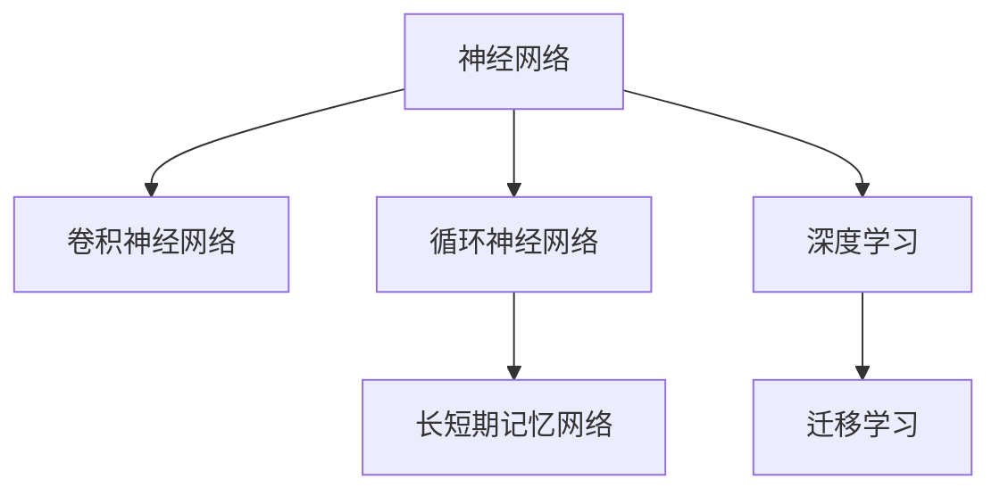
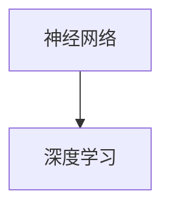

                 

# 神经网络：改变世界的技术

## 1. 背景介绍

### 1.1 问题由来
随着人工智能技术的发展，神经网络在过去几十年间成为了改变世界的重要力量。从图像识别、语音处理到自然语言处理、游戏人工智能，神经网络在各个领域都展现出了强大的应用潜力。然而，这些成功背后的理论基础和核心技术究竟是什么？如何构建和训练神经网络？本文将深入探讨这些问题，并展示神经网络如何塑造未来科技的发展。

### 1.2 问题核心关键点
神经网络是一种模拟人脑神经元之间连接的计算模型。它由大量的人工神经元（或称为节点）组成，通过一系列数学计算和参数更新，能够学习复杂的数据模式和规律。神经网络的核心要素包括：

1. 层（Layers）：神经网络通常由多个层组成，每一层负责处理特定类型的数据。
2. 激活函数（Activation Functions）：用于引入非线性变换，增强网络的表达能力。
3. 损失函数（Loss Functions）：用于衡量模型预测结果与真实结果之间的差距。
4. 优化算法（Optimization Algorithms）：用于更新模型参数，最小化损失函数。
5. 正则化技术（Regularization Techniques）：防止过拟合，提高模型泛化能力。
6. 超参数调优（Hyperparameter Tuning）：调整网络结构和参数设置，优化模型性能。

### 1.3 问题研究意义
研究神经网络的原理与应用，对于理解人工智能技术的本质、推动科学研究的进步、促进产业界的创新发展具有重要意义：

1. 理论基础：深入探讨神经网络的核心概念和算法原理，为后续的研究和应用奠定坚实基础。
2. 技术突破：掌握神经网络训练和调优的高级技巧，加速科研创新和工程实践。
3. 应用落地：展示神经网络在实际场景中的高效应用，推动科技成果转化为实际生产力。
4. 行业影响：分析神经网络对各个行业的深远影响，揭示其对未来科技发展的巨大潜力。

## 2. 核心概念与联系

### 2.1 核心概念概述

为了更好地理解神经网络，本节将介绍几个关键概念及其相互联系：

- 神经网络（Neural Networks）：通过模拟生物神经元间的连接和信号传递，实现复杂数据的处理和分析。
- 卷积神经网络（Convolutional Neural Networks, CNNs）：针对图像、视频等空间数据的特殊网络结构，能够自动提取特征。
- 循环神经网络（Recurrent Neural Networks, RNNs）：用于处理序列数据，如时间序列、自然语言等，具有记忆功能。
- 长短期记忆网络（Long Short-Term Memory, LSTMs）：一种特殊的RNN结构，能够有效地处理长序列数据。
- 深度学习（Deep Learning）：基于神经网络的高级学习技术，通过多层非线性变换，实现对复杂模式的识别和预测。
- 迁移学习（Transfer Learning）：将一个领域的知识迁移到另一个领域，加速新任务的训练过程。

这些概念之间的联系可以通过以下Mermaid流程图来展示：



这个流程图展示了神经网络与相关概念之间的层次关系。通过进一步阅读和实践，你将深入理解这些概念及其在实际应用中的具体表现。

### 2.2 概念间的关系

这些概念之间存在着紧密的联系，构成了神经网络的基本框架和技术体系。以下通过几个Mermaid流程图展示它们之间的关系：

#### 2.2.1 神经网络与深度学习的关系



这个流程图展示了神经网络是深度学习的基础，深度学习通过多层的非线性变换，增强了神经网络的处理能力。

#### 2.2.2 卷积神经网络的应用

```mermaid
graph TB
    A[卷积神经网络] --> B[图像识别]
    A --> C[物体检测]
    A --> D[视频分类]
    B --> E[医学影像分析]
    C --> F[自动驾驶]
    D --> G[视频编码]
    E --> H[疾病诊断]
    F --> I[机器人视觉]
    G --> J[视频压缩]
    H --> K[肿瘤检测]
    I --> L[无人机感知]
    J --> M[视频编码]
    K --> N[病理诊断]
    L --> O[农业机器人]
    M --> P[视频压缩]
    N --> Q[病灶检测]
    O --> R[农业监测]
    P --> S[视频压缩]
    Q --> T[病灶检测]
    R --> U[农业监测]
    S --> V[视频压缩]
    T --> W[病灶检测]
    U --> X[农业监测]
    V --> Y[视频压缩]
    W --> Z[病灶检测]
    X --> AA[农业监测]
    Y --> AB[视频压缩]
    Z --> AC[病灶检测]
    AA --> AD[农业监测]
    AB --> AE[视频编码]
    AC --> AF[病灶检测]
    AD --> AG[农业监测]
    AE --> AH[视频编码]
    AF --> AI[机器人视觉]
    AG --> AJ[农业监测]
    AH --> AK[视频编码]
    AI --> AL[无人机感知]
    AJ --> AM[农业监测]
    AK --> AN[视频编码]
    AL --> AO[无人机感知]
    AM --> AP[农业监测]
    AN --> AO[视频编码]
    AO --> AQ[机器人视觉]
    AP --> AR[农业监测]
    AQ --> AS[机器人视觉]
    AR --> AT[农业监测]
    AS --> AU[机器人视觉]
    AT --> AV[农业监测]
    AU --> AW[机器人视觉]
    AV --> AX[农业监测]
    AW --> AY[机器人视觉]
    AX --> AZ[农业监测]
    AY --> BA[机器人视觉]
    AZ --> BB[农业监测]
    BA --> BC[机器人视觉]
    BB --> BD[农业监测]
    BC --> BE[机器人视觉]
    BD --> BF[农业监测]
    BE --> BG[机器人视觉]
    BF --> BH[农业监测]
    BG --> BI[机器人视觉]
    BH --> BJ[农业监测]
    BI --> BM[机器人视觉]
    BJ --> BK[农业监测]
    BM --> BL[机器人视觉]
    BK --> BM[农业监测]
    BL --> BQ[机器人视觉]
    BM --> BR[农业监测]
    BQ --> BS[机器人视觉]
    BR --> BT[农业监测]
    BS --> BU[机器人视觉]
    BT --> BV[农业监测]
    BU --> BW[机器人视觉]
    BV --> BX[农业监测]
    BW --> BY[机器人视觉]
    BX --> BZ[农业监测]
    BY --> CA[机器人视觉]
    BZ --> CB[农业监测]
    CA --> CC[机器人视觉]
    CB --> CD[农业监测]
    CC --> CE[机器人视觉]
    CD --> CF[农业监测]
    CE --> CG[机器人视觉]
    CF --> CH[农业监测]
    CG --> CI[机器人视觉]
    CH --> CJ[农业监测]
    CI --> CK[机器人视觉]
    CJ --> CM[农业监测]
    CK --> CN[机器人视觉]
    CM --> CO[农业监测]
    CN --> CP[机器人视觉]
    CO --> CQ[农业监测]
    CP --> CR[机器人视觉]
    CQ --> CS[农业监测]
    CR --> CT[机器人视觉]
    CS --> CU[农业监测]
    CT --> CV[机器人视觉]
    CU --> CW[农业监测]
    CV --> CX[农业监测]
    CW --> CY[机器人视觉]
    CX --> CZ[农业监测]
    CY --> DA[机器人视觉]
    CZ --> DB[农业监测]
    DA --> DC[机器人视觉]
    DB --> DD[农业监测]
    DC --> DE[机器人视觉]
    DD --> DF[农业监测]
    DE --> DG[机器人视觉]
    DF --> DH[农业监测]
    DG --> DI[机器人视觉]
    DH --> DJ[农业监测]
    DI --> DK[机器人视觉]
    DJ --> DM[农业监测]
    DK --> DN[机器人视觉]
    DM --> DO[机器人视觉]
    DN --> DP[农业监测]
    DO --> DQ[机器人视觉]
    DP --> DR[农业监测]
    DQ --> DS[机器人视觉]
    DR --> DT[农业监测]
    DS --> DU[机器人视觉]
    DT --> DV[农业监测]
    DU --> DW[机器人视觉]
    DV --> DX[农业监测]
    DW --> DY[机器人视觉]
    DX --> DZ[农业监测]
    DY --> EA[机器人视觉]
    DZ --> EB[农业监测]
    EA --> EC[机器人视觉]
    EB --> ED[农业监测]
    EC --> EE[机器人视觉]
    ED --> EF[农业监测]
    EE --> EG[机器人视觉]
    EF --> EH[农业监测]
    EG --> EI[机器人视觉]
    EH --> EJ[农业监测]
    EI --> EK[机器人视觉]
    EJ --> EM[农业监测]
    EK --> EN[机器人视觉]
    EM --> EO[机器人视觉]
    EN --> EP[农业监测]
    EO --> EQ[机器人视觉]
    EP --> ER[农业监测]
    EQ --> ES[机器人视觉]
    ER --> ET[农业监测]
    ES --> EU[机器人视觉]
    ET --> EV[农业监测]
    EU --> EW[机器人视觉]
    EV --> EX[农业监测]
    EW --> EY[机器人视觉]
    EX --> EZ[农业监测]
    EY --> FA[机器人视觉]
    EZ --> FB[农业监测]
    FA --> FC[机器人视觉]
    FB --> FD[农业监测]
    FC --> FE[机器人视觉]
    FD --> FF[农业监测]
    FE --> FG[机器人视觉]
    FF --> FH[农业监测]
    FG --> FI[机器人视觉]
    FH --> FJ[农业监测]
    FI --> FK[机器人视觉]
    FJ --> FM[农业监测]
    FK --> FN[机器人视觉]
    FM --> FO[机器人视觉]
    FN --> FP[农业监测]
    FO --> FQ[机器人视觉]
    FP --> FR[农业监测]
    FQ --> FS[机器人视觉]
    FR --> FT[农业监测]
    FS --> FU[机器人视觉]
    FT --> FV[农业监测]
    FU --> FW[机器人视觉]
    FV --> FX[农业监测]
    FW --> FY[机器人视觉]
    FX --> FZ[农业监测]
    FY --> GA[机器人视觉]
    FZ --> GB[农业监测]
    GA --> GC[机器人视觉]
    GB --> GD[农业监测]
    GC --> GE[机器人视觉]
    GD --> GF[农业监测]
    GE --> GG[机器人视觉]
    GF --> GH[农业监测]
    GG --> GI[机器人视觉]
    GH --> GJ[农业监测]
    GI --> GK[机器人视觉]
    GJ --> GM[农业监测]
    GK --> GN[机器人视觉]
    GM --> GO[机器人视觉]
    GN --> GP[农业监测]
    GO --> GQ[机器人视觉]
    GP --> GR[农业监测]
    GQ --> GS[机器人视觉]
    GR --> GT[农业监测]
    GS --> GU[机器人视觉]
    GT --> GV[农业监测]
    GU --> GW[机器人视觉]
    GV --> GX[农业监测]
    GW --> GY[机器人视觉]
    GX --> GZ[农业监测]
    GY --> HA[机器人视觉]
    GZ --> HB[农业监测]
    HA --> HC[机器人视觉]
    HB --> HD[农业监测]
    HC --> HE[机器人视觉]
    HD --> HF[农业监测]
    HE --> HG[机器人视觉]
    HF --> HH[农业监测]
    HG --> HI[机器人视觉]
    HH --> HJ[农业监测]
    HI --> HK[机器人视觉]
    HJ --> HM[农业监测]
    HK --> HN[机器人视觉]
    HM --> HO[机器人视觉]
    HN --> HP[农业监测]
    HO --> HQ[机器人视觉]
    HP --> HR[农业监测]
    HQ --> HS[机器人视觉]
    HR --> HT[农业监测]
    HS --> HU[机器人视觉]
    HT --> HV[农业监测]
    HU --> HW[机器人视觉]
    HV --> HX[农业监测]
    HW --> HY[机器人视觉]
    HX --> HZ[农业监测]
    HY --> IA[机器人视觉]
    HZ --> IB[农业监测]
    IA --> IC[机器人视觉]
    IB --> ID[农业监测]
    IC --> IE[机器人视觉]
    ID --> IF[农业监测]
    IE --> IG[机器人视觉]
    IF --> IH[农业监测]
    IG --> II[机器人视觉]
    IH --> IJ[农业监测]
    II --> IK[机器人视觉]
    IJ --> IM[农业监测]
    IK --> IN[机器人视觉]
    IM --> IO[机器人视觉]
    IN --> IQ[农业监测]
    IO --> IR[机器人视觉]
    IQ --> IS[机器人视觉]
    IR --> IT[农业监测]
    IS --> IU[机器人视觉]
    IT --> IV[农业监测]
    IU --> IW[机器人视觉]
    IV --> IX[农业监测]
    IW --> IY[机器人视觉]
    IX --> IZ[农业监测]
    IY -->JA[机器人视觉]
    IZ -->JB[农业监测]
    JA -->JC[机器人视觉]
    JB -->JD[农业监测]
    JC -->JE[机器人视觉]
    JD -->JF[农业监测]
    JE -->JG[机器人视觉]
    JF -->JH[农业监测]
    JG -->JI[机器人视觉]
    JH -->JJ[农业监测]
    JI -->JK[机器人视觉]
    JJ -->JL[农业监测]
    JK -->JM[机器人视觉]
    JL -->JN[农业监测]
    JM -->JO[机器人视觉]
    JN -->JP[农业监测]
    JO -->JQ[机器人视觉]
    JP -->JR[农业监测]
    JQ -->JS[机器人视觉]
    JR -->JT[农业监测]
    JS -->JU[机器人视觉]
    JT -->JV[农业监测]
    JU -->JW[机器人视觉]
    JV -->JX[农业监测]
    JW -->JY[机器人视觉]
    JX -->JZ[农业监测]
    JY -->KA[机器人视觉]
    JZ -->KB[农业监测]
    KA -->KC[机器人视觉]
    KB -->KD[农业监测]
    KC -->KE[机器人视觉]
    KD -->KF[农业监测]
    KE -->KG[机器人视觉]
    KF -->KH[农业监测]
    KG -->KI[机器人视觉]
    KH -->KJ[农业监测]
    KI -->KK[机器人视觉]
    KJ -->KL[农业监测]
    KK -->KM[机器人视觉]
    KL -->KN[农业监测]
    KM -->KO[机器人视觉]
    KN -->KP[农业监测]
    KO -->KQ[机器人视觉]
    KP -->KR[农业监测]
    KQ -->KS[机器人视觉]
    KR -->KT[农业监测]
    KS -->KU[机器人视觉]
    KT -->KV[农业监测]
    KU -->KW[机器人视觉]
    KV -->KX[农业监测]
    KW -->KY[机器人视觉]
    KX -->KZ[农业监测]
    KY -->LA[机器人视觉]
    KZ -->LB[农业监测]
    LA -->LC[机器人视觉]
    LB -->LD[农业监测]
    LC -->LE[机器人视觉]
    LD -->LF[农业监测]
    LE -->LG[机器人视觉]
    LF -->LH[农业监测]
    LG -->LI[机器人视觉]
    LH -->LJ[农业监测]
    LI -->LK[机器人视觉]
    LJ -->LL[农业监测]
    LK -->LM[机器人视觉]
    LL -->LN[农业监测]
    LM -->LO[机器人视觉]
    LN -->LP[农业监测]
    LO -->LQ[机器人视觉]
    LP -->LR[农业监测]
    LQ -->LS[机器人视觉]
    LR -->LT[农业监测]
    LS -->LU[机器人视觉]
    LT -->LV[农业监测]
    LU -->LW[机器人视觉]
    LV -->LX[农业监测]
    LW -->LY[机器人视觉]
    LX -->LZ[农业监测]
    LY -->MA[机器人视觉]
    LZ -->MB[农业监测]
    MA -->MC[机器人视觉]
    MB -->MD[农业监测]
    MC -->ME[机器人视觉]
    MD -->MF[农业监测]
    ME -->MG[机器人视觉]
    MF -->MH[农业监测]
    MG -->MI[机器人视觉]
    MH -->MJ[农业监测]
    MI -->MK[机器人视觉]
    MJ -->ML[农业监测]
    MK -->MN[机器人视觉]
    ML -->MO[机器人视觉]
    MN -->MP[农业监测]
    MO -->MQ[机器人视觉]
    MP -->MR[农业监测]
    MQ -->MS[机器人视觉]
    MR -->MT[农业监测]
    MS -->MU[机器人视觉]
    MT -->MV[农业监测]
    MU -->MW[机器人视觉]
    MV -->MX[农业监测]
    MW -->MY[机器人视觉]
    MX -->MZ[农业监测]
    MY -->NA[机器人视觉]
    MZ -->NB[农业监测]
    NA -->NC[机器人视觉]
    NB -->ND[农业监测]
    NC -->NE[机器人视觉]
    ND -->NF[农业监测]
    NE -->NG[机器人视觉]
    NF -->NH[农业监测]
    NG -->NI[机器人视觉]
    NH -->NJ[农业监测]
    NI -->NK[机器人视觉]
    NJ -->NL[农业监测]
    NK -->NM[机器人视觉]
    NL -->NN[农业监测]
    NM -->NO[机器人视觉]
    NN -->NP[农业监测]
    NO -->NQ[机器人视觉]
    NP -->NR[农业监测]
    NQ -->NS[机器人视觉]
    NR -->NT[农业监测]
    NS -->NU[机器人视觉]
    NT -->NV[农业监测]
    NU -->NW[机器人视觉]
    NV -->NX[农业监测]
    NW -->NY[机器人视觉]
    NX -->NZ[农业监测]
    NY -->OA[机器人视觉]
    NZ -->OB[农业监测]
    OA -->OC[机器人视觉]
    OB -->OD[农业监测]
    OC -->OE[机器人视觉]
    OD -->OF[农业监测]
    OE -->OG[机器人视觉]
    OF -->OH[农业监测]
    OG -->OI[机器人视觉]
    OH -->OJ[农业监测]
    OI -->OK[机器人视觉]
    OJ -->OL[农业监测]
    OK -->OM[机器人视觉]
    OL -->ON[农业监测]
    OM -->OQ[机器人视觉]
    ON -->OR[农业监测]
    OQ -->OS[机器人视觉]
    OR -->OT[农业监测]
    OS -->OU[机器人视觉]
    OT -->OV[农业监测]
    OU -->OW[机器人视觉]
    OV -->OX[农业监测]
    OW -->OY[机器人视觉]
    OX -->OZ[农业监测]
    OY -->PA[机器人视觉]
    OZ -->PB[农业监测]
    PA -->PC[机器人视觉]
    PB -->PD[农业监测]
    PC -->PE[机器人视觉]
    PD -->PF[农业监测]
    PE -->PG[机器人视觉]
    PF -->PH[农业监测]
    PG -->PI[机器人视觉]
    PH -->PJ[农业监测]
    PI -->PK[机器人视觉]
    PJ -->PL[农业监测]
    PK -->PM[机器人视觉]
    PL -->PN[农业监测]
    PM -->PO[机器人视觉]
    PN -->PP[农业监测]
    PO -->PQ[机器人视觉]
    PP -->PR[农业监测]
    PQ -->PS[机器人视觉]
    PR -->PT[农业监测]
    PS -->PU[机器人视觉]
    PT -->PV[农业监测]
    PU -->PW[机器人视觉]
    PV -->PX[农业监测]
    PW -->PY[机器人视觉]
    PX -->PZ[农业监测]
    PY -->QA[机器人视觉]
    PZ -->QB[农业监测]
    QA -->QC[机器人视觉]
    QB -->QD[农业监测]
    QC -->QE[机器人视觉]
    QD -->QF[农业监测]
    QE -->QG[机器人视觉]
    QF -->QH[农业监测]
    QG -->QI[机器人视觉]
    QH -->QJ[农业监测]
    QI -->QK[机器人视觉]
    QJ -->QL[农业监测]
    QK -->QM[机器人视觉]
    QL -->QN[农业监测]
    QM -->QO[机器人视觉]
    QN -->QP[农业监测]
    QO -->QQ[机器人视觉]
    QP -->QR[农业监测]
    QQ -->QS[机器人视觉]
    QR -->QT[农业监测]
    QS -->QU[机器人视觉]
    QT -->QV[农业监测]
    QU -->QW[机器人视觉]
    QV -->QX[农业监测]
    QW -->QY[机器人视觉]
    QX -->QZ[农业监测]
    QY -->RA[机器人视觉]
    QZ -->RB[农业监测]
    RA -->RC[机器人视觉]
    RB -->RD[农业监测]
    RC -->RE[机器人视觉]
    RD -->RF[农业监测]
    RE -->RG[机器人视觉]
    RF -->RH[农业监测]
    RG -->RI[机器人视觉]
    RH -->RJ[农业监测]
    RI -->RK[机器人视觉]
    RJ -->RM[农业监测]
    RK -->RN[机器人视觉]
    RM -->RO[机器人视觉]
    RN -->RP[农业监测]
    RO -->RQ[机器人视觉]
    RP -->RR[农业监测]
    RQ -->RS[机器人视觉]
    RR -->RT[农业监测]
    RS -->RU[机器人视觉]
    RT -->RV[农业监测]
    RU -->RW[机器人视觉]
    RV -->RX[农业监测]
    RW -->RY[机器人视觉]
    RX -->RZ[农业监测]
    RY -->SA[机器人视觉]
    RZ -->SB[农业监测]
    SA -->SC[机器人视觉]
    SB -->SD[农业监测]
    SC -->SE[机器人视觉]
    SD -->SF[农业监测]
    SE -->SG[机器人视觉]
    SF -->SH[农业监测]
    SG -->SI[机器人视觉]
    SH -->SJ[农业监测]
    SI -->SK[机器人视觉]
    SJ -->SM[农业监测]
    SK -->SN[机器人视觉]
    SM -->SO[机器人视觉]
    SN -->SP[农业监测]
    SO -->SQ[机器人视觉]
    SP -->SR[农业监测]
    SQ -->SS[机器人视觉]
    SR -->ST[农业监测]
    SS -->SU[机器人视觉]
    ST -->SV[农业监测]
    SU -->SW[机器人视觉]
    SV -->SX[农业监测]
    SW -->SY[机器人视觉]
    SX -->SZ[农业监测]
    SY -->TA[机器人视觉]
    SZ -->TB[农业监测]
    TA -->TC[机器人视觉]
    TB -->TD[农业监测]
    TC -->TE[机器人视觉]
    TD -->TF[农业监测]
    TE -->TG[机器人视觉]
    TF -->TH[农业监测]
    TG -->TI[机器人视觉]
    TH -->TJ[农业监测]
    TI -->TK[机器人视觉]
    TJ -->TL[农业监测]
    TK -->TM[机器人视觉]
    TL -->TN[农业监测]
    TM -->TO[机器人视觉]
    TN -->TP[农业监测]
    TO -->TQ[机器人视觉]
    TP -->TR[农业监测]
    TQ -->TS[机器人视觉]
    TR -->TT[农业监测]
    TS -->TU[机器人视觉]
    TT -->TV[农业监测]
    TU -->TW[机器人视觉]
    TV -->TX[农业监测]
    TW -->TY[机器人视觉]
    TX -->TZ[农业监测]
    TY -->UA[机器人视觉]
    TZ -->UB[农业监测]
    UA -->UC[机器人视觉]
    UB -->UD[农业监测]
    UC -->UE[机器人视觉]
    UD -->UF[农业监测]
    UE -->UG[机器人视觉]
    UF -->UH[农业监测]
    UG -->UI[机器人视觉]
    UH -->UJ[农业监测]
    UI -->UK[机器人视觉]
    UJ -->UL[农业监测]
    UK -->UM[机器人视觉]
    UL -->UN[农业监测]
    UM -->UO[机器人视觉]
    UN -->UP[农业监测]
    UO -->UQ[机器人视觉]
    UP -->UR[农业监测]
    UQ -->US[机器人视觉]
    UR -->UT[农业监测]
    US -->UV[机器人视觉]
    UT -->UW[农业监测]
    UV -->UX[农业监测]
    UW -->UY[机器人视觉]
    UX -->UZ[农业监测]
    UY -->VA[机器人视觉]
    UZ -->VB[农业监测]
    VA -->VC[机器人视觉]
    VB -->VD[农业监测]
    VC -->VE[机器人视觉]
    VD -->VF[农业监测]
    VE -->VG[机器人视觉]
    VF -->VH[农业监测]
    VG -->VI[机器人视觉]
    VH -->VJ[农业监测]
    VI -->VK[机器人视觉]
    VJ -->VL[农业监测]
    VK -->VM[机器人视觉]
    VL -->VN[农业监测]
    VM -->VO[机器人视觉]
    VN -->VP[农业监测]
    VO -->VQ[机器人视觉]
    VP -->VR[农业监测]
    VQ -->VS[机器人视觉]
    VR -->VT[农业监测]
    VS -->VU[机器人视觉]
    VT -->VV[农业监测]
    VU -->VW[机器人视觉]
    VV -->VX[农业监测]
    VW -->VY[机器人视觉]
    VX -->VZ[农业

